# ARIA Sistemi — Katman Katman Mimari Şemaları

> Kaynak: `/var/aqua-saas/aria-kernel/aria_kernel/` altındaki **~230 Python modülü / ~132.000 satır kodun** okunmasından üretilmiştir (md dokümanları değil, kod esas alınmıştır; 12 paralel ajanla, 3'erli dalgalar halinde okundu).
>
> **Güncelleme 2026-09-25** (`main @ 19efd07f`, `origin/aria/state @ e6f462fb`): çekirdek artık **308 üst-düzey modül (alt paketlerle 350) / ~166.000 satır**. Satır referansları, sayılar ve eskimiş davranışlar düzeltildi; canlı durum `aria/state` dalından yeniden ölçüldü; Bölüm IV (Şema 23–25) eklendi. Kanıtlı tam karşılaştırma: `docs/aria/reviews/2026-09-25-aria-dokuman-kod-karsilastirmasi.md`.
> ARIA = aqua-saas repo'su içinde yaşayan **özerk (otonom) ajan çekirdeği**: geceleyin kendi döngülerini çalıştırır, repo'yu gözlemler, baskı (pressure) üretir, plan yakınsar, işçi ajanları görevlendirir, PR açar ve belirli şartlar altında kendi PR'ini birleştirir.

---

## Şema 0 — Kuş Bakışı: Sistemin Tam Zinciri

```
┌─────────────────────────────────────────────────────────────────────────────┐
│  TETİKLEYİCİLER                                                              │
│  GitHub Actions: aria-auto-cycle.yml · aria-daily-report.yml ·                │
│  aria-merge-authority.yml · aria-external-watchdog.yml · aria-readiness-claim │
│  Droplet daemon'ları: aria-gateway · planner-dispatch · worker-scheduler      │
└──────────────┬──────────────────────────────────────────────────────────────┘
               ▼
┌─────────────────────────────────────────────────────────────────────────────┐
│  1. OTONOMİ ORKESTRATÖRÜ        (autonomy_orchestrator.py:913)               │
│     ARIA_STOP? · profil kapısı · maliyet/arıza kesicileri · host kirası       │
└──────────────┬──────────────────────────────────────────────────────────────┘
               ▼
┌─────────────────────────────────────────────────────────────────────────────┐
│  2. DÖNGÜ (CYCLE)               (cycle.py:541 run_enterprise_cycle)           │
│     47 faz, 5 aşama: preflight → discovery → pre_tool → tools → post_tool     │
│     çıktı: bulgular · baskılar · bellek güncellemesi · mission seçimi         │
└──────────────┬──────────────────────────────────────────────────────────────┘
               ▼
┌─────────────────────────────────────────────────────────────────────────────┐
│  3. PLAN YAKINSAMA              (plan_convergence.py + convergence_drainer)   │
│     primary ↔ challenger ↔ çapraz inceleme (≤5 tur) → CONVERGED              │
└──────────────┬──────────────────────────────────────────────────────────────┘
               ▼  promotion_controller: WIP kapısı + kanıt bütünlüğü
┌─────────────────────────────────────────────────────────────────────────────┐
│  4. İŞ DAĞITIMI                 (worker_dispatch.py)                          │
│     assignment + git worktree izolasyonu · lease/claim protokolü              │
└──────────────┬──────────────────────────────────────────────────────────────┘
               ▼
┌─────────────────────────────────────────────────────────────────────────────┐
│  5. AJAN ÇALIŞTIRMA             (agent_invocations + aria-poc executor'lar)   │
│     zarf (envelope) → claude/codex CLI → sonuç + satisfaction_matrix          │
└──────────────┬──────────────────────────────────────────────────────────────┘
               ▼
┌─────────────────────────────────────────────────────────────────────────────┐
│  6. DOĞRULAMA & BİRLEŞTİRME     (verification_gate → Gate B → merge_authority)│
│     üçlü kapı + watchdog-donmuş kontrolü + otonomi kilit açığı → squash merge│
└──────────────┬──────────────────────────────────────────────────────────────┘
               ▼
┌─────────────────────────────────────────────────────────────────────────────┐
│  7. HER ŞEY HASH ZİNCİRLİ JSONL DEFTERLERE   (aria-tools/ + git aria/state)   │
│     cycles · runs · findings · governance · memory · dispatch · missions ...  │
└─────────────────────────────────────────────────────────────────────────────┘
```

---

## Şema 1 — Otonomi Orkestratörü Katmanı (üst sürücü döngü)

`run_autonomy_orchestrator` (`autonomy_orchestrator.py:913`) — geceleyin tam zinciri koşan sürücü. Tek örnek garantisi `fcntl` pid kilidiyle (`aria-tools/daemons/<daemon_id>.pid.lock`).

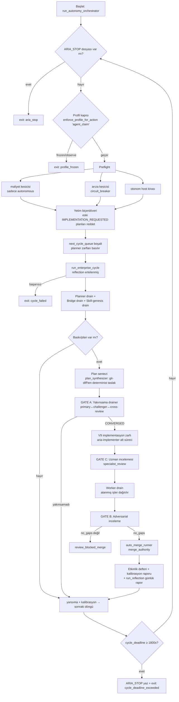

**Ritim kontrolü** (`cycle_rhythm.py:61`; etkin override 2 saat — aşağıdaki nota bakın, `next_cycle_queue.py`): bir sonraki döngü ancak üç fren de geçerse başlar — kuyruk boşalmadıysa (`drain_empty`), açık bülten tavanı dolduysa (`backlog_at_cap`) ya da son döngüden **6 saat** geçmediyse (`MIN_CYCLE_INTERVAL_HOURS`, günde ≤4 döngü) zincir durur. Kuyruk derinliği 32; `pressure_id` idempotensi anahtarı.

> **2026-09-25 tam okuma notu:** Ritim freni: kod varsayılanı 6 saat, **etkin operatör override'ı 2 saat** (günde en fazla 12 cycle; `aria-config/genesis_policy.json:13-15`). Backlog freni (`cycle_guard`) bulguları checkout'taki `aria-findings/`'ten sayıyor, bulgular ise store'a yazılıyor; sayaç yapısal olarak 0 olduğundan cap 25 hiç tetiklenmiyor (B04, B12). `cost_telemetry_hook` ve `profile_gate` kuruluyor ama hiç çağrılmıyor (B02). Kanıt: `docs/aria/reviews/2026-09-25-aria-tam-okuma/B*.md`.

---

## Şema 2 — Döngü (Cycle) Boru Hattı Katmanı

`run_enterprise_cycle` (`cycle.py:541`). Boru hattı **kod değil veri**: `CYCLE_PHASES` demeti (`cycle.py:3109`, **47 faz**) her fazın aşamasını, ön koşulunu, hata politikasını (`propagate | halt_sequence | record_and_continue | swallow`) ve modunu (`standard | burn_in`) tabloda taşır. Import sırasında `_assert_pipeline_is_well_formed` tabloyu doğrular.

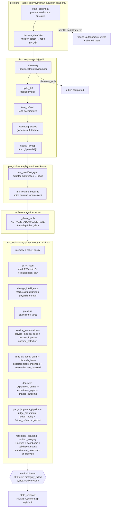

Önemli mekanikler:

- ** Faz atlamaları asla sessiz değildir** — her atlama nedeni kayda geçer: `precondition_unmet:<ad>`, `mode_not_included`, `upstream_failure:<faz>`, `job_deadline_reached`.
- **Zaman disiplini**: `ARIA_JOB_DEADLINE_EPOCH` ortam değişkeni; fazlar arası kontrol + faz içi `SIGALRM` ile `PhaseDeadlineExceeded` (120 s kapanış payı).
- **burn_in modu**: "gözlem provası" şeridi — eylem taşıyan fazlar tabloda `burn_in` modunu taşımadığı için _yapısal olarak_ hiç koşmaz; çıktısı otonomi merdiveninin kabul kanıtıdır.

---

## Şema 3 — Plan Yakınsama Katmanı (Gate A)

`plan_convergence.py` — `plans/events.jsonl` üzerinde olay-kaynaklı (event-sourced) durum makinesi, 14 tek yönlü kapı olayı.

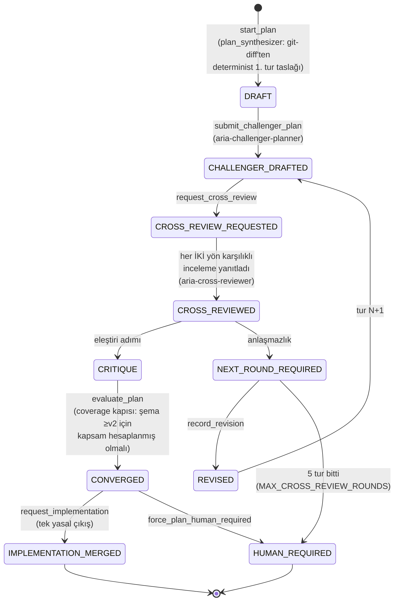

**Tur sürücüsü** `plan_round_controller.advance_plan_rounds` — her tikte durumdan zarf üretir: `DRAFT/REVISED → challenger_plan` zarfı; `CHALLENGER_DRAFTED → ` iki çapraz inceleme zarfı; `CRITIQUE/CROSS_REVIEWED → ` değerlendirme. Ölü zarflar `remint_of` soyağacıyla en fazla 2 kez yeniden basılır. Çapraz inceleme köprüsü her iki plan metnini `<untrusted_*>` etiketlerine sarar ve revizyon kimliği + içerik hash'ini `must_satisfy`'e sabitler (prompt-enjeksiyonu ve TOCTOU'ya karşı).

**Terfi** `promotion_controller.promote_converged_plan_to_dispatch` — kapılar: WIP slotu (dispatch + mission), plan CONVERGED, `converged_plan_hash`, `base_sha`, etki/doğrulama referansları, kanıt-artefakt taşıyan döngü → geçerse `aria/dispatch-request/v2` satırı yazar.

> **2026-09-25 tam okuma notu:** **Gece yolu en fazla 2 tur koşuyor, 5 değil:** workflow `--max-rounds` vermiyor, CLI varsayılanı 2, challenger timeout'u 300 s (`cli.py:2377-2388`). Yakınsama tek cycle içinde değil, cycle'lar arasında adım adım ilerliyor. `advance_plan_rounds` yalnız CLI'dan çağrılıyor; `remint_of` üretimde yok, ölü zarf doğrudan HUMAN_REQUIRED'a gidiyor. Collusion kontrolü `_results_pair_hash_check` yalnız testten çağrılıyor. Terfi (`promotion_controller`) yalnız operatör CLI'ı ve `acknowledge=True` ile oluyor. Canlı: 15 plan başladı, 12'si terk edildi (hepsi 72 s durgunluk kuralı), **0 CONVERGED** (B02, B04, B07, B08). Kanıt: `docs/aria/reviews/2026-09-25-aria-tam-okuma/B*.md`.

---

## Şema 4 — İş Dağıtımı, Mission ve Worktree Katmanı

Kuyruk yok, broker yok: **her kuyruk bir JSONL defteri + okumada katlama (fold) reducer'ı.**

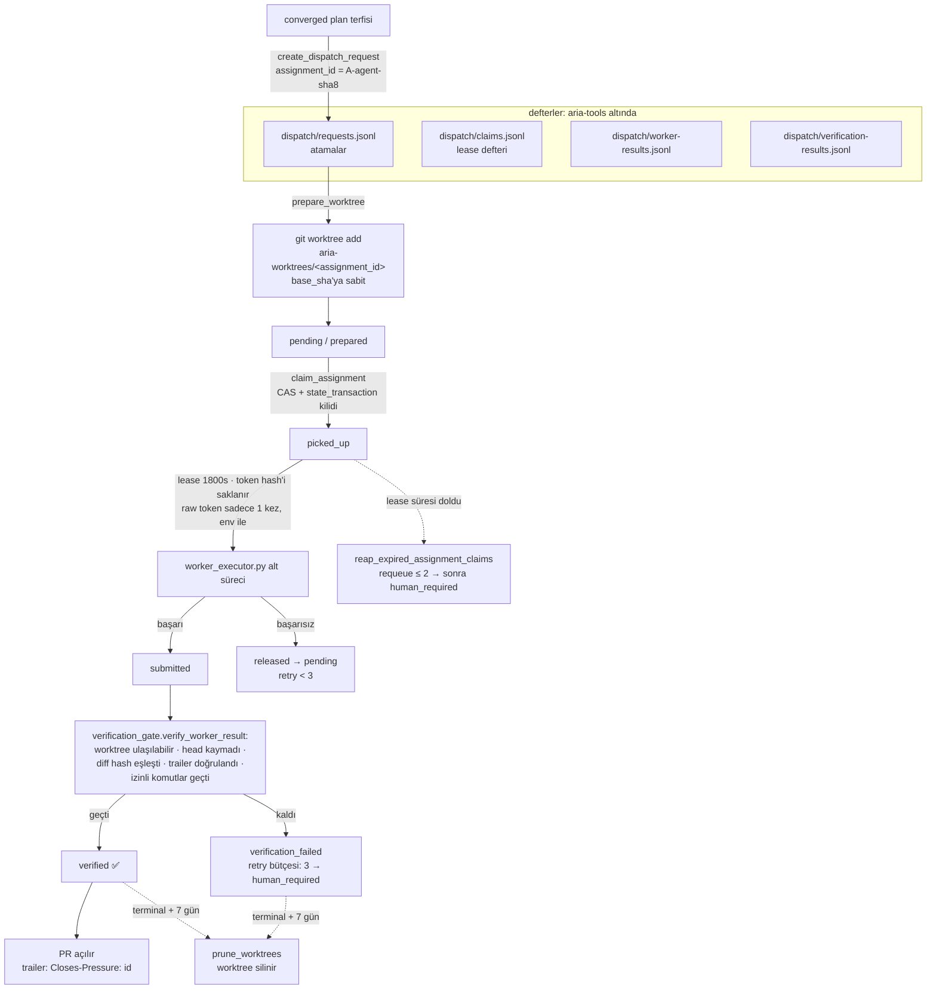

**Mission yaşam döngüsü** (`mission.py:81`): ana hat `DISCOVERED → CONTRACTING → PLANNING → IMPLEMENTING → VALIDATING → READY → MERGING → MAIN_VERIFYING → OUTCOME_OBSERVING`; bekleme durumları (`HUMAN_REQUIRED`, `REVALIDATION_REQUIRED`...) yalnızca `PLANNING` üzerinden geri girer; terminal: `VERIFIED`, `FAILED_AND_ROLLED_BACK`... Geçişler kapalı kenar tablosuyla zorlanır; her mission daima `next_action + wake_condition` beyan etmek zorunda. WIP tavanı 1; seçim deterministik sıra + geçmiş etkinlik üzerinden Thompson örneklemesi. PR gövdesindeki `ARIA-Mission: m-<16hex>` fragmanı bağlanmamış PR'ları mission'a bağlar.

**Daemon ikizleri**: `autonomous_planner_dispatcher` (kuyruk: `agent-invocations/requests.jsonl`, executor: `ci_executor.py`) ve `autonomous_worker_scheduler` (kuyruk: `dispatch/requests.jsonl`, executor: `worker_executor.py`). Her tik: ARIA_STOP kontrolü → profil kapısı → hook → 30 sn uyku.

> **2026-09-25 tam okuma notu:** Canlı: mission olayı 117 satır. 94 mission açıldı ve **hepsi DISCOVERED'da duruyor**; ileri taşıyan bir üretim yolu yok. Thompson banditi `source_type`/`source_kind` uyuşmazlığı yüzünden statik sıraya düşüyor. `prune_worktrees` hiçbir worktree budamıyor, çünkü reducer `completed/cancelled/expired` durumlarını üretmiyor. `worker_dispatch_hook`'taki merge dalı `{"decision":"blocked"}` literali. `verification_gate` komutları tam env ile ve sandbox'sız koşuyor (B07, B10). Kanıt: `docs/aria/reviews/2026-09-25-aria-tam-okuma/B*.md`.

---

## Şema 5 — LLM / Ajan Köprü Katmanı

`llm_bridge.py` asla LLM çağırmaz (operatör yanıtı doğrular). Gerçek çağrı zinciri:

```mermaid
flowchart TD
    K[çekirdek: create_agent_invocation_request<br/>agent_invocations.py:1182] --> EN[zarf: aria/agent-request/v1<br/>suggested_prompt · must_satisfy ·<br/>allowed/forbidden scope · evidence_refs]
    EN --> PR[render_invocation_prompt v3<br/>Twin dilimi + bilgi + kanıt alıntıları<br/>&lt;untrusted_*&gt; etiketli · hash'e bağlı]
    PR --> QR[agent-invocations/requests.jsonl]
    QR --> DM[daemon claim_request<br/>lease 1800s · heartbeat +1800s]
    DM --> SP[alt süreç: ci_executor.py / worker_executor.py<br/>env: ARIA_LEASE_TOKEN + ARIA_CLAIM_METADATA]
    SP --> CL[claude_runtime.run_claude_exec<br/>claude -p --output-format stream-json<br/>--model &lt;m&gt; --effort e · izin modu]
    SP --> CO[codex_runtime<br/>codex exec --json gpt-5.2-codex<br/>sandbox read-only/workspace-write]
    CL & CO --> FB[claude_runtime.run_with_model_fallback<br/>opus YAPRAK · model düşürme YOK (2026-09-12)<br/>kredi biterse ClaudeCreditExhausted → REQUEUED<br/>yalnız çapraz sağlayıcı AUTH failover opus↔glm-5.3]
    FB -->|JSONL olay akışı| RES[sonuç zarfı: aria/agent-response/v1<br/>her must_satisfy için satisfaction_matrix<br/>satisfied/blocked/contradicted]
    RES --> SB[submit_claim_result<br/>iki fazlı günlük + artefact mühürleme]
    SB --> BR[judgment_bridge → feedback_store<br/>ai_judge satırları → run_consensus]
    SB -.başarısız.-> FC[tipleşmiş hata sınıfları:<br/>ClaudeAuthFailure · ClaudeCreditExhausted ·<br/>ClaudePolicyViolation · subprocess_timeout]
    FC -->|api_backoff bitti| EO[EXTERNAL_OUTAGE<br/>30 dk sonra reaper]
    FC -->|istek hatası| RQ[requeue ≤ 2 → STALE]
```

**Sürüm ayak izi**: `ROLE_TARGET_PAIRING` rol-hedef eşlemesi (aria-primary-planner, aria-challenger-planner, aria-cross-reviewer, aria-implementer...); görev-ayrımı zorunlu (**uygulayıcı ≠ inceleyici**); claim anında zarfın hash bağını yeniden üretildiği doğrulanır (bütünlük).

**Ajan doğuşu (genesis)**: yetenek boşluğu → `draft_agent_from_gap` GRAMMAR niyeti üretir (gövde yok) → aria-drafter gövdeyi sentezler → sandbox'ta ≥3 fixture başarısı → **operatör onayı (AutoActionGate — her şeritte zorunlu)** → `materialize_agent_draft` `.claude/agents/aria-*.md` yazar → makro durumlar: `PRESSURE → CANDIDATE_PROPOSED → DRAFT → REAL_SANDBOX → SHADOW → EVAL_WINDOW → ACTIVE`. Gölge ajanlar asla üretim hedefi olamaz.

**Twin** (`twin.py`): worktree değil, repo haritası — bağımlılık grafiği + TESTED_BY kenarları + churn + eş-değişim; `twin/map.json`, 400 komit sınırı. Zarf prompt'una kanıt referans yollarının dilimi render edilir.

> **2026-09-25 tam okuma notu:** Requeue bütçesi aşılınca istek STALE'e değil HUMAN_REQUIRED'a gidiyor. Harness-sınıfı release'ler bütçe yakmıyor; canlıda 266 `native_runtime_execution_unavailable` ve 197 `claude_cli_exit_1` release var. 1.171 isteğin **610'u claim edilmeden `anchor_expired` ile düştü**. Prompt sürümü v6. Gerçek lease süresi yaklaşık 6.333 s. Egress kontrolü native rotada atlanıyor. Görev ayrımı (`forbidden_agent_ids`) yazan üretim kodu yok. `external_outage_reaper` ölü kod (B01, B05, B11). Kanıt: `docs/aria/reviews/2026-09-25-aria-tam-okuma/B*.md`.

---

## Şema 6 — Veri / Kalıcı Durum Katmanı

Veritabanı yok; **hash zincirli, yalnızca-eklenen JSONL defterler** + ayrık bir git dalında yayınlanan durum mağazası.

```mermaid
flowchart LR
    subgraph W[yazıcı]
        W1[append_jsonl / append_declared_jsonl]
    end
    W1 --> L1[satır boyutu ≤ 1 MiB kontrolü<br/>fd açılmadan ÖNCE]
    L1 --> L2[state_transaction:<br/>kilitler deterministik sırada<br/>locks/state-groups/*.lock]
    L2 --> L3[zincir önceden doğrula<br/>bozuk zincire ek yok]
    L3 --> L4[yırtık kuyruk iyileştir<br/>torn tail ftruncate]
    L4 --> L5[tek os.write + fsync<br/>previous_ledger_hash → ledger_hash<br/>sha256 kanonik JSON]
    L5 --> L6[integrity_index.json grubu tazele<br/>atomik tmp→replace]
    L6 --> LG[(cycles.jsonl · runs.jsonl ·<br/>findings.jsonl · governance.jsonl ·<br/>memory/*.jsonl · dispatch/* ·<br/>missions/* · plans/* · queues/*)]
    LG --> RD[strict_jsonl_reader:<br/>strict = GovernanceError<br/>tolerant = atla + teşhis yay]
    LG --> SS[state_store.publish_state]
    SS --> GB[git dalı aria/state<br/>ayrık worktree .aria-state-store<br/>tools/ · workspace/&lt;repo_hash&gt;/ · findings/]
    GB -->|CAS: manifest_root eşleşmeli<br/>FF-only push| REM[uzak depo]
    GB -.çekişme.-> CR[contention replay<br/>transport zarfları aria/ledger-replay-transport/v2]
    LG -.&gt;40MB.-> CP[state_compact:retain 7 gün<br/>gzip arşiv + yeniden zincirleme]
```

**Bellek modeli** (`memory.py` — tek inancı yazar modül): 6 defter (observations, beliefs, uncertainties, contradictions, calibration, learning-events). İnanç durumu: `supported | contradicted | needs_revalidation | stale | withdrawn`. Güven = taban + kanıt-hash'i **değiştiyse** +0.005/destek (tekrar pekiştirme sayılmaz) − yeniden doğrulama cezası − çelişki cezası. Üç yol tepmesi: yaş TTL 90 gün, baş-mesafesi (başkalarının komitleri), diff/FATES; karantinalı kaynak. `withdraw_belief` geri dönüşsüz; çekilmiş inancın yeniden çıkması CONTRADICTION olur. `FATES.json` her döngüde taranan her dosyanın hash haritası — belleğin dosya düzeyinde bütünlük kanıtı.

---

## Şema 7 — Güvenlik / Otonomi / Birleştirme Katmanı

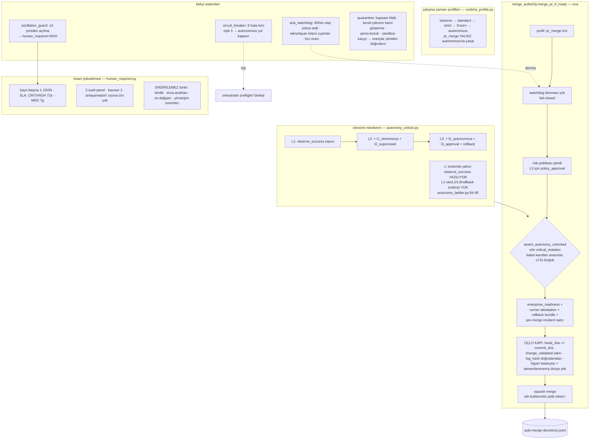

**Araç (tool) terfi merdiveni**: `CALIBRATE → SHADOW → ACTIVE` — SHADOW'dan çıkmak için ≥5 stabil gölge koşusu, fixture taban çizgisi geçmiş, hassasiyet eşiği, kritik yanlış-pozitif yok. Panel onayı 24 saatlik operatör veto penceresi açar; **çekirdek kapsamına dokunan araçlar asla panel onayıyla ACTIVE olamaz** (yalnız operatör).

**Kanıt güven modeli** (`evidence_trust.py`): her referans notlanır — `repo_verified` (blob = `git show <sha>`), `repo_glob_verified` (yalnız inanç), `self_output` (ARIA'nın kendi çıktısı — yasak), `missing`, `invalid`. Bulgular mutlaka `repo_verified` olmalı.

> **2026-09-25 tam okuma notu:** Merge'ü donduran kernel `aria_watchdog` değil; dış watchdog'un açtığı GitHub issue'su (`watchdog_freeze.py`). **Runner attestation hiç yazılamıyor:** workflow'lar `probe-runner-attestation`'a yalnız `tools-dir` veriyor, bu yüzden merge her seferinde `runner_attestation_required_for_merge` ile düşüyor. `change_validated` satırını otomatik yazan kod yok. `enterprise_readiness` kalıcı olarak `operator_blocked` (v3 sözleşme üreticisi yok). `critical_violation` üreticisi olmadığı için "sıfır kritik ihlal" koşulu hep doğru çıkıyor. **Güvenlik:** `auto_merge._normalize_path` içindeki `lstrip("./")` yüzünden `.github/**` ve `.env*` yasak desenleri hiç eşleşmiyor. HUMAN_REQUIRED paneli oyu okuyamıyor: 968 `panel_incomplete`, 114 kayıttan 0 karar (B02, B03, B06, B08). Kanıt: `docs/aria/reviews/2026-09-25-aria-tam-okuma/B*.md`.

---

## Şema 8 — Giriş Yüzeyleri ve Süreçler (dağıtım görünümü)

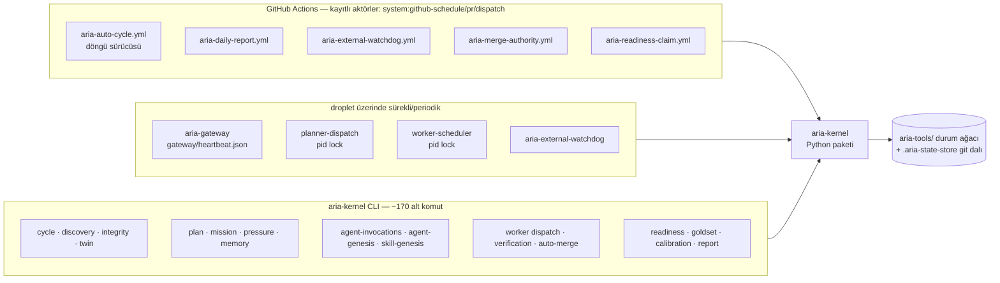

## Depolama Haritası (özet)

| Yüzey                                   | İçerik                                                                  |
| --------------------------------------- | ----------------------------------------------------------------------- | ---------------------------------- |
| `cycles.jsonl`                          | döngü yaşam döngüsü (started/completed/failed/stopped/aborted), şema v3 |
| `runs.jsonl`                            | adaptör koşuları, artefact_ref + kanıt doğrulaması                      |
| `findings.jsonl` / `raw-findings.jsonl` | dedup edilmiş / ham bulgular                                            |
| `governance.jsonl`                      | tüm yönetişim olayları (aria/governance-event/v2)                       |
| `memory/*.jsonl`                        | 6 bellek defteri + inanç tepmesi                                        |
| `dispatch/*.jsonl`                      | istek / lease / işçi sonucu / doğrulama sonucu                          |
| `agent-invocations/*.jsonl`             | zarflar, claim'ler, sonuçlar                                            |
| `missions/`, `plans/`, `queues/`        | mission olayları, plan olayları, next_cycle kuyruğu                     |
| `enterprise/acceptance-events.jsonl`    | otonomi merdiveni kabul kanıtları                                       |
| `human-required/`                       | 114 kayıt · 968 `panel_incomplete` · **0 karar**                        | panel oyu okuyamıyor (Şema 7 notu) |
| `quarantine.jsonl`, `breakers/`         | karantina ve kesici durumu                                              |
| git dalı `aria/state`                   | yayınlanan kalıcı durum (CAS + FF-only)                                 |

## Katmanlar Arası Anahtar Değişmezler

1. **Her şey deftere**: durum = JSONL katlaması; satır asla yerinde değiştirilmez, yalnızca eklenir; hash zinciri `previous_ledger_hash` ile kurülür.
2. **Fail-closed**: okunamayan güvenlik durumu = en katı sonuç (`SAFETY_STATE_UNREADABLE`, watchdog UNREADABLE = merge yasak).
3. **Eylem ayrımı mod sütunında**: burn-in şeridinin "hiçbir eyleme dokunmadık" iddiası docstring değil, tablo kısıtı.
4. **Tekrar pekiştirme değildir**: inanç güveni yalnızca kanıt hash'i değiştiğinde artar.
5. **`pr_merge` yalnızız autonomous profilinde** ve yalnız `assert_autonomy_unlocked` geçilerek — otonomi kanıt zinciri kesintisiz olmalı (≤72s boşluk).

---

# BÖLÜM II — DERİN KATMAN ŞEMALARI

_(12 paralel ajanla kodun tamamı okunarak üretildi; her şema kod satırı referanslıdır.)_

## Şema 9 — Algılama Döngüsü: Keşif → Baskı → Triyaj → Yansıma

ARIA'nın "algı" katmanı: repo'dan kanıt alır, puanlanmış baskıya çevirir, hangisinin ne yapılacağına karar verir ve ertesi geceye devreder.

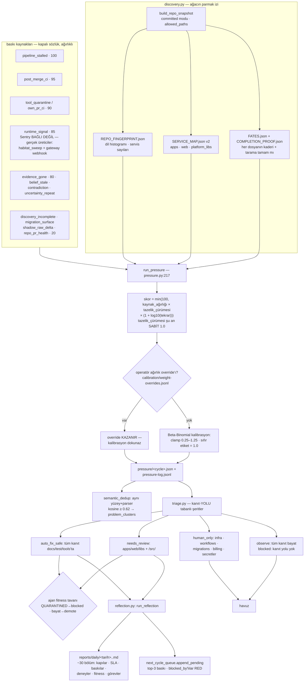

**Yan dönüşler**: `proactive_priority` her döngüde tepkisel baskıdan bağımsız `etki × fırsat` sıralaması üretir (altın-seti olmayan, az yargılanan araçlar öne çıkar). `funnel_health` 597-üretildi/0-yakınsandı türü tıkanıklıkları yakalar → `pipeline_stalled` baskısı (ağırlık 100). `observation_coverage` hiçbir adaptörün okuyamadığı kökleri `unobserved` işaretler; 3 kör gece sonrası yetenek boşluğuna döner.

## Şema 10 — Araç / Adaptör Katmanı

Döngünün `tools` fazında koşan statik analiz adaptörleri ve bunların ömür devri.

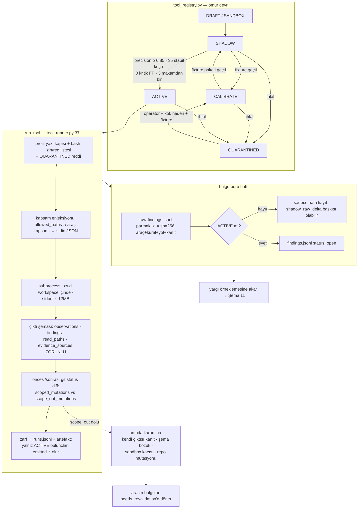

**Repo'daki gerçek adaptörler** (`tools/aria-poc/`): `banned_phrase` (Node gate CLI sarmalayıcı, gölge modunda yalnız gözlem), `cqrs` (kontrolör CommandBus/QueryBus atlaması), `outbox` (transactional outbox ihlali), `agent_harness_security` (7 kural: sızdırılmış secret, güvenilmeyen head-ref checkout, geniş GHA izinleri, prompt-enjeksiyon yüzeyi, kaçak SDK kullanımı, lease token log'u, ajan öz-değişimi), `poc.py` (TS enum'ları ↔ SQL CREATE TYPE karşı çapraz sürüklenme denetleyicisi; Rust enum'ları ts-tarafına eklenir, dolayısıyla **Rust↔SQL** yakalanır, Rust↔TS karşılaştırması yoktur — `poc.py:914-946,1633`). **2026-09-25 durumu:** 11 manifest SHADOW beyan eder; canlı registry'de ACTIVE adaptör yok (7 CALIBRATE · 2 SHADOW · 1 QUARANTINED), bu yüzden hiçbir ham bulgu `emitted` olmuyor. **Kural sağlığı**: FP oranı ≥ 0.75 olan kural karantinaya girer ve çekirdek otomatik olarak o kusurlu eşleştirici için bir "adaptör kural kusuru" bulgusu üretir — bozuk araç kendisini onarım işi haline getirir.

> **2026-09-25 tam okuma notu:** Canlı registry'de 10 araç var: **7 CALIBRATE, 2 SHADOW, 1 QUARANTINED** (agent-harness; fixture `cases` dizini yok). `lint-rules` kayıtlı değil; `registry_compiler` canlı durumu manifestteki SHADOW ile eziyor. `banned_phrase`, `cqrs` ve `outbox` hiç koşmadı (kayıt satırı bir stub'ı çağırıyor). Masum bir adaptör de karantinaya düşebilir: koşu sırasında `aria-tools/`'a bir daemon yazarsa `scope_out_mutations` doluyor. Bir otorite sabiti de var: `promotion.py:106` `evidence_chains_valid=True` sabit geçiriyor; `tool promote --target-status SHADOW` karantinadan kök neden istemeden çıkarıyor (B10, B11, B12). Kanıt: `docs/aria/reviews/2026-09-25-aria-tam-okuma/B*.md`.

## Şema 11 — Yargı / Konsensüs / Kalibrasyon Katmanı

```mermaid
flowchart TD
    SM[generate_judgment_sample<br/>belirsizliğe göre tabakalı<br/>1 − güven + şiddet bonusu] --> FO[judge_fanout: her bulgu için<br/>İKİ zarf zorunlu]
    FO --> J1[aria-evidence-judge<br/>rol: evidence_judgment]
    FO --> J2[aria-adversarial-judge<br/>rol: adversarial_judgment]
    J1 & J2 --> VB[validate_judge_response:<br/>verdict ∈ true/false_positive ·<br/>executor kimliği RED · model zarftan]
    VB --> AIJ[ai_judge satırları<br/>feedback_store]
    AIJ --> CO[generate_ai_consensus — sıralı kapılar]
    CO --> C1{&lt;2 yargıç? single_judge}
    CO --> C2{oy bölünmesi?<br/>ağırlıklı oy: &gt;0.6 toplam ağırlık<br/>Beta(4,1) posterior·yargıç kalibrasyonu}
    CO --> C3{ortalama güven &lt; 0.80? low_confidence}
    CO --> C4{conformal taban altı? conformal_abstain}
    CO --> C5{kanıt repo'da doğrulanamıyor?<br/>evidence_not_repo_verified}
    C1 & C2 & C3 & C4 & C5 --> UN[belirsizlik satırları →<br/>HUMAN_REQUIRED süpürmesi]
    CO -- tüm kapılar geçti --> AC[ai_consensus satırı]
    AC --> ANK{ANKER mi?<br/>≥3 yargıç · oybirliği ·<br/>≥2 farklı model}
    ANK -- evet --> GT[zemin doğruluğu ·<br/>goldset malzemesi]
    ANK -- hayır --> PS[yalnız hassasiyet sayar]
    GT & PS --> PRM[promote_consensus_findings:<br/>operatör ACK ref'i şart →<br/>kalıcı finding]
    GT --> JC[judge_calibration.score_judges:<br/>precision/recall/confidence kalibrasyonu<br/>zemin: insan &gt; anker]
    JC --> JW[yargıç ağırlıkları geri beslenir → C2]
    JC --> DEG{precision &lt; 0.7 ·<br/>≥10 örnek?}
    DEG -- evet --> DG[degraded]
    ARB[split_verdict_groups →<br/>aria-consensus-arbiter tek hakem<br/>toplama yapar, yeniden yargılamaz]
    ARB2[anchor_refutation kolu:<br/>oybirliği grubuna ÇÜRÜTÜCÜ 3. yargıç<br/>MODE: anchor_refutation]
    IND[independence_check · 3 katman:<br/>farklı claim_id/agent_id ·<br/>farklı revision_id · 3-gram Jaccard &lt; 0.85<br/>ihlal → converged değil, cross_review_self_agreement]
    JC --> BR[Brier · Brier skill · 10-kutu ECE ·<br/>bootstrap ECE üst sınırı · Wilson<br/>judge_calibration.py:149-247]
    BR --> CS{calibrated?<br/>≥100 örnek · ECE_üst ≤ 0.10 ·<br/>≥0.80 güvenli oy doğruluğu ≥ 0.75}
    CS -- 30–99 --> PROV[provisional]
    CS -- &lt;30 --> INS[insufficient_data]
    CS -- evet --> CQ[calibration_gate<br/>measure_only VARSAYILAN · enforce:<br/>consensus'u yalnız farklı modellerden<br/>≥2 CALIBRATED yargıç kapatır<br/>yoksa confidence_uncalibrated]
    CQ -.enforce ama quorum yok.-> MO[measure_only'e düşürülür + kayıt]
    LQ[label_queue: escalated · auto_closed_random ·<br/>pending_random — AI verdict önden doldurulmaz<br/>imzasız insan etiketi truth DEĞİL]
    LQ --> GT
```

**2026-09-19 sonrası** (5fe326c6, c12ce179, 5ce69d7c, b7b7d523): yargıç güveni artık Brier/ECE ile puanlanır; "kalibre quorum kapatır, kalibre olmayan yargıç önerir". Batch judge (K istek tek çağrı) kodda var ama varsayılan kapalı (`judge_batch_size=1`, yalnız zai). Bir yargıç kendi katıldığı anchor'da puanlanmaz (ARIA-HIGH-173).

**Altın set**: her etiketli araç için TP≥20/FP≥10 hedefli öneri → `aria-goldset-curator` ajan fixture taslağı yazar → operatör `promote` → `goldsets/active/<tool>.json`; yargıç-geri-oynatma bunu sınav kağıdı olarak kullanır. **Ajan değerlendirmesi**: sabit fixture + beklenen karar sınıfı; gerçek mod 8 defter referanslı provenance ister; iki haftalık pencereler `improved/regressed/flat` karşılaştırır — programın kendi başarı testi.

> **2026-09-25 tam okuma notu:** Canlıda hiçbir yargıç hiç puanlanmadı (`judged_judges=0`), bu yüzden kalibre quorum `measure_only`'de. "İmzalı insan etiketi" kernel'in kendi anahtarıyla imzalanıyor; `judge_replay` `source_type` eksikse satırı "human" sayıyor. Pressure ağırlık kalibrasyonu `tool_id` ile anahtarlanıyor ve kaynak ağırlıklarıyla eşleşmiyor, dolayısıyla çarpan hep 1.0 (B03, B06). Kanıt: `docs/aria/reviews/2026-09-25-aria-tam-okuma/B*.md`.

## Şema 12 — Deney Masası + Bulgu Yaşam Döngüsü

```mermaid
flowchart TD
    subgraph BENCH[experiment_night.py — gecelik tezgah]
        EA[experiment_author: yanlılanabilir<br/>test_disagression/regression/wrong_code<br/>bulgularından KIRMIZI sözleşme üret<br/>≤5/gece · komut şablonu tek: nx test] --> PN[plan_night_experiments<br/>problem şeridi ≤3 · regresyon şeridi ≤3]
        PN --> PE[problem: kayıtlı tarifeyi koş<br/>değişim zinciri aç]
        PE -- kırmızı eşleşti --> CONF[record_finding_reproduction<br/>kesinlik: CONFIRMED]
        PE -- eşleşmedi --> REF[çürütme kaydı — dürüst FP sinyali]
        PN --> RE[regresyon: fix-verified bağları<br/>yeniden koş]
        RE -- kırmızı --> REG[experiment_regression_detected]
        RE -- yeşil --> SF[still_fixed]
    end
    subgraph FLC[finding.py — bulgu ömür devri]
        F1[emit_finding: F-*.json hash zincirli<br/>iddia türü izinli · kanıt taban] --> F2[OPEN]
        F2 -->|üreme| F3[CONFIRMED · tek üretici budur]
        F2 --> INP[IN_PROGRESS]
        INP -->|AYNI tarif yeniden koşulu yeşil| F4[RESOLVED + closes_in_commit]
        F2 --> SUP[SUPPRESSED · WITHDRAWN terminal]
    end
    CONF --> F3
    SF --> F4
    subgraph OUTC[change_outcome.py — merge SONRASI]
        O1[emit_change_outcome: change_validated +<br/>merge satırı şart · yalnız defterden yeniden hesap]
        O1 --> O2[metric: finding_recurrence →<br/>regression / no_gain / gain]
        O1 --> O3[metric: experiment_rerun_hold]
        O2 & O3 --> VD[verdict: regression &gt; no_gain &gt;<br/>gain_confirmed &gt; unknown]
        VD -.no_gain/regression.-> KG[knowledge_graph:<br/>kaynak sayacı cycles_rejected+1]
        KG -.besler.-> TS[mission Thompson banditi<br/>+ pipeline_stalled baskısı]
    end
    BElesc[belief_escalation: ≥3 döngü açık çelişki →<br/>HR-belief paneli · panel oybirliği yalnız<br/>aşağı yönlü inanç düzeltmesi yapabilir]
    UNCR[uncertainty_repeat: aynı (kind,subject)<br/>≥3 tekrar → REPETITION baskısı ağırlık 55]
```

> **2026-09-25 tam okuma notu:** Deney masası iddiayı değil projeyi test ediyor: proje genelinde `nx test` koşuyor ve projedeki herhangi bir kırmızı test bulguyu CONFIRMED yapıyor. Canlıda 2 deneyin ikisi de (F-009, F-010) sahte çürütmeyle bitti. **RESOLVED'a otomatik üretici yok**; "still_fixed → RESOLVED" oku kodda yok. `cycles_rejected` hiçbir kararı etkilemiyor, yani change_outcome → bandit oku da yok. Kanonik depoda **13 OPEN bulgu** var: 8 `seed:drift-scan` (LLM yargısını atlıyor), 5 consensus terfisi (B03, B05, B12). Kanıt: `docs/aria/reviews/2026-09-25-aria-tam-okuma/B*.md`.

## Şema 13 — Skill / Ajan Doğuşu (Genesis) Katmanı

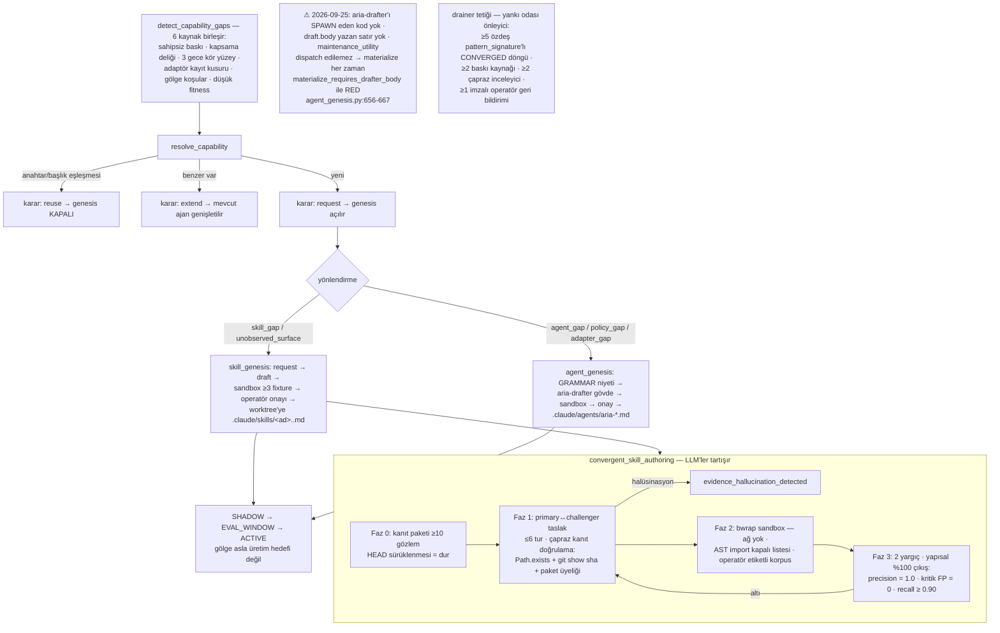

> **2026-09-25 tam okuma notu:** **Güvenlik:** LLM'in yazdığı adaptör **sandbox'sız** koşuyor (düz `subprocess.run`, tam env; `skill_genesis.py:389-408`). `skill_genesis_sandbox` (bwrap + AST denetimi) üretimde hiç çağrılmıyor. Skill'in "≥3 fixture" kontrolü `## Fixture:` başlıklarını saymaktan ibaret. `dispatcher_factory`'nin okuduğu `_base_dir` anahtarını hiçbir kod yazmıyor. Canlıdaki 20 skill-genesis isteğinin hepsi `convergent:false` ve tüketicisi yok. `extend` kararı hiçbir şeyi değiştirmiyor. `agent_priors.map_agent_priors` çağrılmadığı için reuse tespiti de ölü (B01, B03, B04, B09). Kanıt: `docs/aria/reviews/2026-09-25-aria-tam-okuma/B*.md`.

## Şema 14 — Etki / Mimari Omurga / Bilgi Grafiği Katmanı

```mermaid
flowchart TD
    subgraph IG[impact_graph.py]
        NX[Nx grafiği .nx/cache/graph.json<br/>yoksa yerel tarama: tsconfig alias +<br/>proje işaretçileri] --> TOPO[katmanlı topolojik sıra<br/>upstream önce · döngü en küçük isimle kırılır]
        TOPO --> CACHE[service-order-cache.json<br/>parmak izi değişmedikçe yeniden hesaplanmaz]
        NX --> RC[ters kapama = downstream ripple]
    end
    RI[recursive_impact — 6 kaynak:<br/>nx · import (derinlik ≤5) · event sözleşmesi ·<br/>GraphQL · DB entity · frontend modülü<br/>bilinmeyen kaynak = unknown → kapıyı bloklar]
    subgraph SPINE[architecture_spine_gate — 5 değişmez]
        B1[tenant_scoping: getRepository çağrıları] & B2[event_contracts: şema doğrulayıcı] & B3[schema_entity: ADR-011] & B4[auth_security: adaptör koşusu] & B5[harness_security: adaptör koşusu] --> BL[baseline hash]
        BL --> REM[remediyasyon] --> PC[postcheck fark<br/>sayısal artış = regresyon]
        PC -.5 ardışık regresyon.-> HR5[HUMAN_REQUIRED HIGH]
    end
    subgraph KG[knowledge_graph.py — hash zincirli]
        K1[konvansiyonler: confidence ≥ 0.7<br/>plan merge olunca 0.75 verified'a terfi] --> K2[anti-patternler: yalnız operatör<br/>imzasıyla yazılır]
        K3[kaynak etkinlik sayaçları:<br/>minted/converged/merged/rejected] --> K4[rank: converged/minted]
    end
    K4 -.tüketir.-> MST[mission seçimi Thompson] & FUNL[funnel stall taraması]
    SVC[service_examination: değişen + downstream<br/>servisler topolojik sırada · baskılar servise<br/>eşlenir · sahipsiz → coverage gap] --> SEED[mission_seed: çekirdek 4 servis<br/>auth/billing/farm/sensor + kanıtlı projeler<br/>öncelik = ters PageRank merkezilik]
```

> **2026-09-25 tam okuma notu:** `recursive_impact` hiçbir kapıya bağlı değil, yalnız CLI'dan çağrılıyor. `impact_graph` üretimde `.nx` grafiğini okumuyor. Spine fazları `PLAN_ID_PRESENT` koşuluna bağlı, ama hiçbir üretim çağıranı `plan_id` geçmediği için nightly'de hiç koşmuyor. Entity kontrolü, ADR-011 gereği `schema:` beyan etmeyen 194 per-tenant entity'yi ihlal sayıyor (B02, B04, B06, B08). Kanıt: `docs/aria/reviews/2026-09-25-aria-tam-okuma/B*.md`.

## Şema 15 — Maliyet / Profil / Gözlemlenebilirlik Katmanı

```mermaid
flowchart TD
    subgraph COST[maliyet zinciri]
        CAP[genesis_policy caps:<br/>günlük 25$ · aylık 300$ · koşu başına 0.5$] --> AB[assert_within_budget<br/>LLM spawn'dan ÖNCE tek boğaz<br/>claude_runtime:347-367 + ci_executor:2164-2191<br/>⚠ monetary_admission=managed_subscription<br/>→ telemetry_only, REDDETMEZ]
        AB -->|aşıldı| TRP[breaker_state.json: tripped<br/>+ yönetişim olayı · profili DÜŞÜRMEZ<br/>sadece spawn reddeder]
        TRP --> AAG[AutoActionGate: human_ack_required]
        AB -->|geçti| RESV[reserve_cycle_budget<br/>token = ledger_hash · reconcile sonrası]
        RESV --> ATTR[cost-attribution/ay-*.jsonl<br/>rol bazlı · %50 token sapması = drift bayrağı]
    end
    subgraph PROF[runtime_profile.py — izin matrisi]
        P1[observe · frozen: hiçbir eylem] --- P2[standard: claim/commit/validate] --- P3[strict: + PR aç · plan · apply] --- P4[autonomous: + MERGE]
        PC2[okunamayan profil = frozen<br/>tavan: operatör standard · önerilebilir max strict]
    end
    subgraph OBS[gözlemlenebilirlik]
        O1[cycle-metrics.jsonl: faz süreleri<br/>p50/p95 SLO · &gt;900s = degraded] --> O2[dashboards.jsonl + alerts.jsonl<br/>artifact_bytes · maliyet]
        O3[telemetry export: Prometheus/OTEL<br/>~25 aria_* metriği] --> O4[usage.jsonl · context-usage.jsonl]
    end
    subgraph HOST[çoklu host düzeni]
        L1[locks/autonomous-host.cas.json:<br/>epoch/owner/ref+sha CAS kirası<br/>başka host fresh → fail-closed] --> H2[handoffs.jsonl: oturum anlık görüntüsü<br/>aktif plan · açık bulgular · bekleyen istekler]
    end
```

> **2026-09-25 tam okuma notu:** Orkestratör CAS kirasını (`autonomous-host.cas.json`) değil, düz `autonomous-host.lock` kilidini kullanıyor; CAS kirası kilitsiz oku-yaz yapıyor. `reserve_cycle_budget`'in üretim çağıranı yok. Bozuk bir `breaker_state.json` "ok" okunuyor (fail-open). Telemetri yaklaşık 43 metrik (B02, B04, B10). Kanıt: `docs/aria/reviews/2026-09-25-aria-tam-okuma/B*.md`.

## Şema 16 — Uçtan Uca Kapalı Döngü (tüm katmanların tek akışta birleşimi)

```mermaid
flowchart TD
    A["GECE · GitHub Actions cron 17:13 UTC<br/>+ aria-gateway / planner-dispatch / worker-scheduler daemon'ları"] --> B["OTONOMİ ORKESTRATÖRÜ<br/>profil kapısı · maliyet/arıza kesicisi · host kirası"]
    B --> C["DÖNGÜ 47 FAZ<br/>state_continuity → discovery → twin →<br/>adaptörler → bellek → baskı → mission → yargı"]
    C --> D["ALGILAMA ÇIKTISI<br/>baskılar · bulgular · inançlar · görevler"]
    D --> E{"baskı var mı?"}
    E -- hayır --> Z["yansıma + kalibrasyon raporu → uyku"]
    E -- evet --> F["PLAN YAKINSAMASI (Gate A)<br/>primary ↔ challenger ↔ cross-review ≤5 tur<br/>bağımsızlık: farklı principal + metin Jaccard"]
    F --> G["TERFİ → dispatch<br/>WIP=1 · converged hash · kanıt bütünlüğü"]
    G --> H["İŞÇİ: worktree izolasyonu · lease 1800s<br/>aria-implementer → claude CLI sandbox"]
    H --> I["DOĞRULAMA KAPISI<br/>head kayması · diff hash · trailer · izinli komut"]
    I --> J["GATE C uzman incelemesi<br/>kanıt yolu repo'da VAR mi doğrulanır"]
    J --> K["PR: zorunlu bölümler + trailer<br/>HARD_FAIL_CHECKS: 18 sert kontrol"]
    K --> L["GATE B adversarial yargıç<br/>hash doğrulanmış VERDICT satırı"]
    L --> M["BİRLEŞTİRME YETKİSİ<br/>profil autonomous · otonomi L-lanes · watchdog donmamış<br/>üçlü kapı · enterprise readiness · rollback bundle"]
    M --> N["squash merge → main"]
    N --> O["SONRASI: pr_ci_scan · change_outcome<br/>deney tezgahı · inanç güncelleme · kaynak sayaçları"]
    O --> P["YANSIMA: günlük rapor + next_cycle_queue"]
    P --> Q{"ritim frenleri:<br/>kuyruk boş · backlog tavan · 6 saat"}
    Q -- geçiyor --> C
    Q -- dur --> Z
    O -.REGRESYON.-> D
```

Bu son şema ARIA'nın felsefesini tek karede özetler: **algıla → baskıla → tart → yap → doğrula → birleştir → ölç → öğren**, her adımı hash zincirli defterlere yazılmış ve her geri bildirim (kendi PR'inin kırmızı CI'sı, merge sonrası regresyon, yargıç çürütmesi) bir sonraki döngünün girdisi olur.

---

## Şema 17 — Değişim Zinciri + Uygulama/PR Kapıları (change chain)

Bir fikrin commit'e, commit'in merge'e taşındığı içerik-adresli zincir.

```mermaid
flowchart TD
    subgraph CHAIN[change-ledger/ — change_id = sha256 plan+finding+dosyalar]
        C1[change_planned<br/>plan_id · finding_id · İSTENEN dosyalar ·<br/>rollback_ref · mimari tier 1-4] --> C2[change_committed<br/>commit_sha · GERÇEK dosyalar · claim_id]
        C2 --> C3[change_validated<br/>enforced: matris kapısı ·<br/>historical_attestation: backfill]
        C3 --> CO[change_outcome<br/>merge sonrası fayda · Şema 12]
    end
    C1 -.idempotent: aynı içerik = aynı change_id.-> C1
    C2 -.kapsam sürüklenmesi: gerçek ⊄ istenen.-> HR1[scope_drift_requires_human]
    C2 -.istenen dosya diff'te yok + beyan yok.-> HR2[implementation_incomplete_undeclared]
    C2 -.ikinci farklı commit.-> XX[RED: zincir değişmez]
    C3 -.7 günden eski açık zincir.-> ST[change_chain_stale uyarısı]
    subgraph APPLY[apply_engine — iki şerit]
        A1[operatör şeridi: proposal approved_for_apply<br/>+ insan onayı → worktree aç]
        A2[otonom şerit: CONVERGED plan →<br/>BASELINE doğrulama ÖNCE koşulur<br/>→ change_planned → makine onayı<br/>→ staged_for_implementation (atalet)]
        A2 --> AG[run_apply_gate: HEAD = dal olmalı ·<br/>aday paket ≤ baseline tavanı]
        AG --> SG[gate_apply_action: baskı-taraması<br/>FAIL-CLOSED — diff yoksa reddedilir]
        SG --> RP[ready_for_pr]
    end
    RP --> PRM[pr_manager: makine onayı SAHTELENEMEZ —<br/>plan_evaluated CONVERGED olayı +<br/>revizyon içerik hash'i eşleşmeli]
    CHAIN --> RECON[implementation_reconciler:<br/>merge GERÇEĞİ GitHub'dan okunur —<br/>5'li idempotensi · implementation_merged]
    RECON --> KG[knowledge_graph:<br/>konvansiyon hipotezi verified'a terfi]
    CHAIN --> TG[merge_authority üçlü kapısı:<br/>head_sha == commit_sha · validated var ·<br/>log_hash'ler doğrulanır]
```

**Uzman kapısı ayrımı**: `specialist_review_runner` KİM inceleyeceğine karar verir (~84 uzman, dokunulan servise göre); `expert_review_gate` o kararların yeterliliğine hükmeder — ≥2 farklı uzman, oybirliği, ortalama güven ≥ 0.80 ve her `evidence_ref` fix'in base SHA'sındaki git blob'una karşı yeniden doğrulanır (halüsinasyon gören onaylayamaz → HIGH HUMAN_REQUIRED).

> **2026-09-25 tam okuma notu:** `approve_proposal` yalnız testten çağrılıyor (CLI komutu yok), bu yüzden operatör şeridi A1 ölü. `change_validated`'ı otomatik yazan kod yok. Doğrulama matrisinin EXISTENCE/PATTERN katmanları diff'e değil repoya bakıyor; risk türü yoksa exit≠0 koşular da geçiyor. Uzman kapısının roster'ında 27 uzman var, ~84 değil. `enforce_expert_consensus_gate` çağrılmıyor (B03, B05, B08, B09, B10). Kanıt: `docs/aria/reviews/2026-09-25-aria-tam-okuma/B*.md`.

## Şema 18 — Öz-Değişim Muhafızları (kendi kodunu koruma)

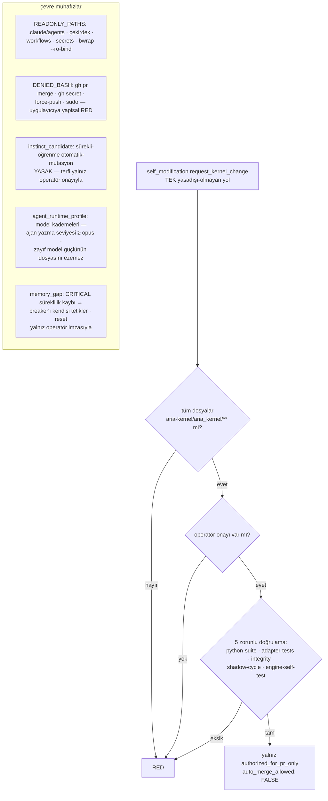

**Karar sorgulama** (`decision_questioning`): kapatılmış kararlar (CONVERGED / IMPLEMENTATION_MERGED) her döngüde örneklenir (N=2) ve saldırgan bir zarfla yeniden açılır — "karar anındaki uzlaşış, inceleme anında kanıt değildir"; yanıt `upheld/overturned/insufficient_evidence` + dosya:satır kanıtı ister. **Araştırma modu** (`research.py`): alan adı izin listesi + her atlama için DNS halka özel adres reddi (SSRF savunması) + 1 MB tavan; kaynaklar `runtime_unverified` kabul edilir, asla kanıt olmaz.

> **2026-09-25 tam okuma notu:** `self_modification.request_kernel_change` **ölü kod**: çağıranı yok, "5 doğrulama" kontrolü de yalnız `len(refs) >= 5`. Bağlı olan gerçek yol şu: gateway → self_improvement mission → `record_self_change_result` → proposal + HUMAN_REQUIRED (B09). Kanıt: `docs/aria/reviews/2026-09-25-aria-tam-okuma/B*.md`.

## Şema 19 — Paslanan-Yüzey Denetimi + Şema Evrimi

Çekirdeğin kendi iç tutarlılığını ölçen "meta" katman: yazılmayan kontroller, çağrılmayan üreticiler, okunamayan eski satırlar.

```mermaid
flowchart TD
    subgraph REACH[erişilebilirlik makasları — hepsi RATCHET]
        R1[closure_reachability:<br/>kapanan bulgunun ÜRETİCİSİ<br/>çağrılıyor mu? baseline'a iğnelenir<br/>asla büyümez]
        R2[control_reachability:<br/>validate_/enforce_/assert_/verify_...<br/>hiç kimse çağırmıyorsa dormant.json<br/>vazgeçme: süre + sahip + bulgu ·<br/>saatle karşılaştırılır]
        R3[surface_reachability:<br/>kapalı sözlüklerin (kaynak · durum · rol...)<br/>YAZILAN üyesi var mı?<br/>unwritten.json · ters yönde vazgeçme YOK]
        R4[literal_provenance motoru:<br/>AST'de sabit akışı — guard'a takılan<br/>değere kadar çözümler · kanıtlayamazsa None]
    end
    subgraph EVOLVE[şema evrimi — diskte satır asla değişmez]
        E1[upcasters: v2 cycles satırı okunurken<br/>yeni sözlüğe yükseltilir · kopya döner]
        E2[migration: tools v1→v2→v3 · workspace v1→v2<br/>fazlar started/copied/validated/finalized ·<br/>rollback: göç-sonrası satır varsa RED]
        E3[_backfill: hash zinciri doldurma —<br/>ARIA_STOP var + pid kilidi yok +<br/>elle yazılmış bakım onayı şart]
        E4[state_compact: 40MB → gzip arşiv<br/>+ yeniden zincirleme]
    end
    subgraph WFCI[workflow sözleşmeleri — CI'nin kendisi de denetlenir]
        W1[9 lane için kayıtlı iş sözleşmesi:<br/>izinler · yazma kökleri · artifact ·<br/>timeout · abort gate]
        W2[verify_workflow_contract:<br/>canlı YAML ↔ kayıt · adım ADI bazlı ·<br/>gate'ten sonraki her adım korumalı]
        W3[preflight: ARIA_GLOBAL_KILL_SWITCH ·<br/>frozen yazı bloğu · DLP fail-closed ·<br/>workflow hash eşleşmesi]
        W4[duvar saati: job timeout − 5dk ·<br/>ARIA GitHub öldürmeden durur]
    end
```

## Şema 20 — Operasyonel Destek Katmanı (haberleşme, arıza, bakım)

```mermaid
flowchart TD
    subgraph SIG[sinyaller ve köprüler]
        RT[runtime_signal_bridge: olay · prod log · GH check<br/>Sentry adı sözlükte ama üretici YOK<br/>kaynak KAPALI sözlük · trust_grade=<br/>runtime_unverified → baskıya işaretçi<br/>'sinyal NEREYE bakacağını söyler,<br/>repo kanıtı NE olduğunu söyler']
        BS[bridge_status_ledger: yargıç/plan rol sonuçları<br/>köprüyesi — crash kurtarma: satır pending +<br/>defter satırı yok = yeniden oynat<br/>retry ≤ 3 → permanent_fail]
    end
    subgraph REAP[biçerdövenler]
        EO[external_outage_reaper: api_backoff_exhausted<br/>30 dk bekle · ≤4 yeniden kuyruğa<br/>→ sonra İNSAN]
        SCL[agent_claim + dispatch_lease reap]
        ORP[yetim implementasyon isteği reddi]
    end
    subgraph OPS[yaşam alanı ve envanter]
        HB[habitat: aria-*/aqua-* geçici dizinleri<br/>3 saat dokunulmamışsa sil · disk &lt; 40GB<br/>= degraded sinyali (deploy eşiğinin üstünde)]
        TK[task-candidates: baskı/bulgu/proaktif/gölge/boşluk<br/>→ döngülük ADAY · next_action ZORUNLU<br/>mission katmanına beslenir]
        ACK[ack ledger: tek-kullanım HMAC'li jetonlar<br/>genesis maddeleştirmesi için · rolling anahtar]
        INC[incident ledger: merge öncesi/sonrası<br/>olay satırları — readiness zincirine kanıt]
    end
    subgraph AGQ[ajanlar arası protokol]
        Q1[agent_question: soru-cevap zarfları ·<br/>hedef başına döngüde ≤1 açık soru ·<br/>yanıt kanıt sitasyonu ya da ret]
        DQ[decision_questioning: kapalı kararların<br/>yeniden sorgulanması]
        SEB[shadow_eval_bridge: DRAFT ajanın tek gerçek<br/>koşudan SHADOW kanıtı — 8 defter<br/>referansı birebir eşleşmeli]
        GSUP[genesis_superiority: EVAL_WINDOW→ACTIVE<br/>için pencere iyileşmesi + Bradley-Terry<br/>düello reytingi üstünlüğü]
    end
    subgraph STORE[depolama tesisatı]
        CP2[canonical_path: resolve + relative_to —<br/>lexical startswith YASAK]
        LI[ledger_inline: &gt;128KB alan → özet koçanı<br/>defter satırı indekstir, yük deposu değil]
        LR[ledger_refs: çapraz-defter referansı —<br/>tam 1 satır eşleşmesi şart]
        CR[contention_replay: publish yarışında kayananın<br/>eki, KANITLANMIŞ ortak önekten sonra<br/>transport zarfıyla yeniden oynatılır]
    end
```

**Çarpıcı bir tasarım kararı**: `guard_item` kapsaması "kötü bir öğe yalnız o öğeye mal olur, toplu işe değil" — ama `LedgerIntegrityError` bilinçli olarak **kapsanmaz**: bozuk defter rapor satırı olamaz, döngüyü durdurur.

> **2026-09-25 tam okuma notu:** `runtime-signals/` manifestte beyanlı değil, `aria/state`'e yayınlanmıyor; canlıda `runtime_signal_ingested` sayısı 0. `habitat_sweep` 3 saatten eski `/tmp/aria-*` dizinlerini canlılığa bakmadan siliyor; uzun süren bir spawn'ın broker soketleri silinebilir (B05, B09). Kanıt: `docs/aria/reviews/2026-09-25-aria-tam-okuma/B*.md`.

---

## Kapsam Tablosu — hangi şema hangi modülleri kapsıyor

| Şema | Ana modüller                                                                                                                                                                                                                                                                       |
| ---- | ---------------------------------------------------------------------------------------------------------------------------------------------------------------------------------------------------------------------------------------------------------------------------------- |
| 0-2  | cycle.py, autonomy_orchestrator, cycle_rhythm, next_cycle_queue, autonomy_state/ladder/unlock                                                                                                                                                                                      |
| 3    | plan_convergence, plan_round_controller, convergence_drainer, promotion_controller, cross_review_bridge                                                                                                                                                                            |
| 4    | worker*dispatch, autonomous*_\_dispatcher/scheduler, mission_, workspace, worktree                                                                                                                                                                                                 |
| 5    | llm_bridge, claude/codex runtime, agent_invocations/contract, agent_genesis, model_fleet, twin                                                                                                                                                                                     |
| 6    | ledger, file_lock, integrity, state_store/snapshot/compact/manifest, memory, semantic_memory                                                                                                                                                                                       |
| 7    | runtime*profile, autonomy_unlock, merge_authority, auto_merge, watchdog, circuit_breaker, quarantine, human_required, evidence*\*                                                                                                                                                  |
| 8    | cli, daemons, gateway, GitHub workflow'ları                                                                                                                                                                                                                                        |
| 9    | discovery, pressure, triage, reflection, learning, funnel_health, debt, observation_coverage                                                                                                                                                                                       |
| 10   | tool_registry/runner/health, registry_compiler, tools/aria-poc adaptörleri, feedback_store, rule_health                                                                                                                                                                            |
| 11   | judgment_bridge, judge_fanout/calibration, calibrated_intelligence, goldset, fixture_runner, agent_eval, independence_check                                                                                                                                                        |
| 12   | experiment*, finding*, change_outcome, belief_escalation, reverify                                                                                                                                                                                                                 |
| 13   | skill_genesis\*, convergent_skill_authoring, capability_gap/resolver, agent_network/routing/priors, dispatcher_factory                                                                                                                                                             |
| 14   | impact, impact*graph, recursive_impact, architecture\*, knowledge_graph, service*\*, lane_classifier, snapshot                                                                                                                                                                     |
| 15   | cost_budget, budget, usage_ledger, runtime_profile, observability, telemetry, runtime_artifacts, handoff_ledger, autonomous_host_lease, performance                                                                                                                                |
| 16   | tüm katmanların birleşimi (uçtan uca)                                                                                                                                                                                                                                              |
| 17   | change_ledger, apply_engine, implementation_reconciler, expert_review_gate, policy_approval, proposal, review_record, pr_manager                                                                                                                                                   |
| 18   | self_modification, implementation_safety (READONLY/DENIED), instinct_candidate, agent_runtime_profile, memory_gap, decision_questioning, research                                                                                                                                  |
| 19   | closure/control/surface_reachability, literal_provenance, surface_manifest_validator, contract_digest, upcasters, migration, \_backfill, docs_ssot, plan_coverage, plan_016_metrics, plan_candidate_source, cycle_diff/progress/guard, workflow_contracts\*, preflight             |
| 20   | habitat, task, ack*ledger, incident_ledger, batch_containment, bridge*\*, runtime_signal_bridge, shadow_eval_bridge, external_outage_reaper, genesis_superiority, agent_question, trust, canonical_path, ledger_inline/refs, contention_replay, db_snapshot (şema anlık görüntüsü) |
| 21   | tools/aria-adapters (2. adaptör filosu), tools/gates (TS kapı kütüphanesi), tools/aria-acceptance, tools/supervisor, tools/watchdog, 12 workflow'un tamamı, scripts/aria/provision_runner.sh, aria-debts/, .claude/ operatör yüzeyleri, agent-workspace                            |
| 22   | context_budget_gate, cycle_phases Protocol kancaları, agent_compliance, pedagogy_lint + narrative_prompt_validator, execution_spine kimlik omurgası, secret_scrub + draft_pii_filter + artifact_safety + gh_token_factory (PII/güvenlik sınırı)                                    |

---

# BÖLÜM III — DENETİM SONUÇLARI (6 bağımsız doğrulama ajanı)

> Bu bölüm, 6 bağımsız ajanla yapılan çapraz denetimin (modül envanteri, olgu-doğrulama, çevre taraması, test envanteri, canlı durum) ürettiği düzeltme ve eklemeleri içerir.

## Doğrulama Düzeltmeleri

1. **Doğrulama yeniden deneme bütçesi (3)** `worker_dispatch_hook.py:55` içinde tanımlı (`DEFAULT_MAX_RETRIES`), `worker_dispatch.py` içinde değil — lease (1800 sn) ve requeue (2) doğru yerde: `worker_dispatch.py:38,65`.
2. **`claude_runtime.py`** `aria_kernel/` paketinde değil, `tools/aria-poc/claude_runtime.py` konumunda (`run_with_model_fallback:1845`). _2026-09-25 düzeltmesi:_ `fable→opus→sonnet` basamakları 2026-09-12 operatör kararıyla kaldırıldı; `opus` yapraktır, yalnız sağlayıcılar-arası auth failover (opus↔glm-5.3) kaldı (`claude_runtime.py:76-95`).
3. Omurga sayıları çelişkili değil: kapı 5 değişmez ölçer (`architecture_spine_gate.py:72`), orkestratör 6 adaptörü tazeler (`spine_orchestrator.py:78`) — `schema_entity` statik AST kontrolü (adaptör okumaz), `schema-drift` ve `test-gap` adaptörleri ise kapının doğrudan tüketmediği tazeleme yüzeyleri.
4. `implementation_reconciler.py:4`'teki "ARIA kendi işini asla birleştirmez" yorumu, autonomous profilin squash merge yapabilen `merge_authority`'sine göre bayat bir ifade — kod çelişkisi değil, yorum sürüklenmesi.

## Şema 21 — Operasyonel Çevre (çekirdek dışı katman)

```mermaid
flowchart TD
    subgraph ADAPTERS2[tools/aria-adapters — 2. adaptör filosu · 11 TS manifest<br/>canlı: 7 CALIBRATE · 2 SHADOW · 1 QUARANTINED · lint-rules kayıtsız]
        SP1[security-boundary] & SP2[tenant-scoping] & SP3[event-contracts] & SP4[test-gap] & SP5[agent-harness-security] --> ORN[spine_orchestrator'ın<br/>6 adaptöründen 5'i]
        EX1[bundle-budget · D2 performans] & EX2[doc-staleness · D5 doküman] &<br/>EX3[fe-dto-parity · D6 doğruluk] & EX4[kernel-dead-wire · E9 öz-denetim] &<br/>EX5[typeorm-entity-schema] & EX6[lint-rules · 2026-09-19] --> CYC[döngünün tools fazı]
    end
    subgraph GATES[tools/gates — ~40 TS kapısı]
        G1[banned-phrase.ts: yasak sözlük<br/>pre-commit + kalite kapısı]
        G2[plan-coverage-witness.ts: deterministik<br/>etki kapanışı — CONVERGED'ı engelleyebilir]
        G3[aria-authority-hash.ts: docs/aria + çekirdek<br/>+ workflow'ların imza hash'i]
        G4[agent-dispatch-gate.ts: PreToolUse kancası —<br/>ajan rozeti + oturum başına ≤12 fışkırma]
        G5[finding-registry.ts: hash zincirli bulgu kaydı<br/>verify/add/close/sweep]
        G6[gha-sha-pin.ts: her uses: 40-hex SHA zorunlu]
    end
    subgraph ACC[tools/aria-acceptance]
        A1[burn_in_driver.py: MOCK moda temiz döngü →<br/>sahte merdiven L1'e koşar,<br/>gerçek kilit defterine DOKUNMAZ]
    end
    subgraph SUP[denetim süreçleri — LLM'siz]
        S1[runtime-supervisor.ts: Docker State.Running<br/>gerçeği · restart politikası · Prometheus]
        S2[probe-runner.mjs: kimliksiz okuma sondaları<br/>· CRITICAL → döngü tetikleyebilir]
        S3[tenant-reality.mjs: kiracı durumu ↔ fiziksel<br/>şema (GDPR erasures muaf)]
    end
    subgraph WF[11 aria-* workflow'u — eksiksiz liste]
        W1[auto-cycle · günlük 17:13 UTC]
        W2[agent-executor · 02:29 UTC + auto-cycle sonrası]
        W3[agent-eval · haftalık pazar 03:30]
        W4[daily-report · merge-authority ·<br/>external-watchdog 08:40 · readiness-claim]
        W5[aria-kernel · çekirdek CI]
        W6[operational-proof · manuel 90 dk kanıt]
        W7[runner-capability-probe · sandbox keşifi]
        W8[state-maintenance · günlük 15:13 —<br/>842MB aria/state dalını sıkıştırır<br/>(yapmazsa gece döngüsü OOM)]
    end
    RH[scripts/aria/provision_runner.sh:<br/>self-hosted runner yaşam alanı —<br/>aria/state bootstrap ETMEZ ·<br/>Claude kimlik DOĞRULAMAZ]
    DEB[aria-debts/: DEBT-*.json zinciri —<br/>auto_close_forbidden · SLA tırmanışı]
    CLD[.claude/ operatör yüzeyi: 52 üst-düzey ajan (18 aria-* + 2 _maintenance) ·<br/>routing-table.md · 5 slash komut ·<br/>katmanlı bilgi belleği]
    AW[agent-workspace/: karatahta +<br/>L1/L2/L3 rapor katmanları]
```

## Şema 22 — Çekirdek Tamamlayıcıları (denetimle ortaya çıkan)

```mermaid
flowchart TD
    subgraph CBG[context_budget_gate — dispatch ÖNCESI bağlam bütçesi]
        B1[rol tavanları / 200K pencere:<br/>yargıç 0.35 · planlayıcı 0.55 ·<br/>uygulayıcı 0.45 · acil 0.65] --> B2[bileşen bazlı tahmin: istek + ajan gövdesi +<br/>@knowledge geçişleri + kanıt alıntıları]
        B2 --> B3[aşım → GovernanceError +<br/>context-audits.jsonl]
    end
    subgraph HOOKS[cycle_phases/ — 5 Protocol DI kancası]
        H1[PlanContentProvider · V9ImplementationRunner ·<br/>MemoryHook · CostTelemetryHook · ProfileGate] --> H2[her birinin NoOp varsayılanı —<br/>eski döngü davranışı korunur]
        H2 --> H3[seçim profil SSoT'sundan:<br/>pr_create yetkisi yoksa implementasyon RED]
    end
    subgraph COMPL[uyum + pedagoji]
        C1[agent_compliance: sözleşmeye uyum —<br/>4 sert + 2 yumuşak kontrol ·<br/>2 yumuşak birikimi = RED]
        C2[pedagogy_lint: her zorunlu kural ≤6 satır<br/>içinde Neden/Sonuç/Örnek anlatımı ·<br/>kademe bazlı token bütçesi]
    end
    subgraph SEC[PII/güvenlik sınırı]
        X1[secret_scrub: 12 tipleşmiş desen —<br/>AWS/GitHub/Anthropic anahtarları ·<br/>lease token env ataması]
        X2[draft_pii_filter: intent'e girmeden<br/>eposta/telefon → belirleyici token]
        X3[artifact_safety: her artefakt yazımı öncesi<br/>temizleme + 1MB tavan]
        X4[gh_token_factory: İKİ jetonlu model —<br/>işçiye asla operatör PAT'i geçmez<br/>(kurulum jetonu + SHA imza anahtarı)]
    end
    ID[execution_spine: her mutasyon için<br/>birleşik aktör kimliği —<br/>system:github-schedule/pr/dispatch ·<br/>service:aria-* · oturum defteri]
```

> **2026-09-25 tam okuma notu:** `execution_spine.py` yalnız testten çağrılıyor; `ARIA_ACTOR` hiçbir yerde set edilmiyor ve runner `{"kind":"human"}` olarak kaydediliyor. `context_budget_gate` üretimde yalnız ölçüyor (`enforce_context_budget=False`). `ProfileGate` ve `CostTelemetryHook` kancaları çağrılmıyor. `secret_scrub`'da 12 değil 13 desen var ve Z.ai anahtarı için desen yok (B01, B04, B05, B09, B11). Kanıt: `docs/aria/reviews/2026-09-25-aria-tam-okuma/B*.md`.

## Canlı Durum Denetimi — makine fiilen çalışıyor mu? (2026-09-25 yeniden ölçüm)

> **Düzeltme.** 16 Eylül ölçümü sunucudaki (droplet) yerel `aria-tools/` klasörünü okuyordu. Oysa CI şeridi durumu **`origin/aria/state` git dalına** yayımlıyor. Önceki tablodaki "aria/state dalı yok" ve "hiç koşmadı" satırları bu yüzden yanlıştı. Aşağıdaki sayılar `git show origin/aria/state:tools/<yüzey>` ile alındı (`aria/state @ e6f462fb`, 2026-09-25).

| Alt sistem                                       | Canlı değer                                                                                                                                           | Durum                                     |
| ------------------------------------------------ | ----------------------------------------------------------------------------------------------------------------------------------------------------- | ----------------------------------------- |
| `cycles.jsonl`                                   | 43 başladı · 30 tamamlandı · 13 başarısız (2026-08-05 → 2026-09-20)                                                                                   | **ÇALIŞIYOR (algılama)**                  |
| Son başarılı cycle                               | `cyc-20260920T212805Z-auto`                                                                                                                           | 2026-09-21'den beri gece koşuları kırmızı |
| `agent-invocations/results.jsonl`                | 304 sonuç: 274 kabul · 30 red. Roller: evidence 85 · adversarial 82 · human_required_adjudication 80 · maintenance 24 · arbiter 2 · challenger_plan 1 | **ÇALIŞIYOR (yargı)**                     |
| `runs.jsonl` / `health.jsonl`                    | 108 / 266                                                                                                                                             | çalışıyor                                 |
| `raw-findings.jsonl`                             | 34.500 satır. %87'si `doc-staleness-adapter`'dan (29.939)                                                                                             | **publish sınırını patlatıyor**           |
| `judgment-samples.jsonl`                         | 220                                                                                                                                                   | çalışıyor                                 |
| `tools/findings.jsonl` (eski yüzey)              | 0                                                                                                                                                     | kanonik depo aşağıda                      |
| `findings/aria-findings/` (kanonik bulgu deposu) | **13 OPEN** (8 `seed:drift-scan` + 5 consensus terfisi), 0 RESOLVED                                                                                   | terfi var, kapanış yok                    |
| canlı `registry.json`                            | 10 araç: 7 CALIBRATE · 2 SHADOW · 1 QUARANTINED; ACTIVE yok                                                                                           | lint-rules kayıtsız                       |
| `human-required/`                                | 114 kayıt · 968 `panel_incomplete` · **0 karar**                                                                                                      | panel oyu okuyamıyor (Şema 7 notu)        |
| `plans/events.jsonl`                             | 15 başladı · 12 terk · 2 değerlendirildi · **0 CONVERGED**                                                                                            | Gate A hiç geçilmedi                      |
| `auto-merge-decisions.jsonl`                     | 8 karar, 8'i `blocked`                                                                                                                                | merge yok                                 |
| `missions/mission-events.jsonl`                  | 117 satır · 94 mission · **hepsi DISCOVERED**                                                                                                         | ileri taşıyan yol yok                     |
| `change-ledger/`                                 | 0 commit                                                                                                                                              | değişim zinciri işlemedi                  |
| ajan istek kuyruğu                               | 1.171 istek · **610 (%52) claim edilmeden `anchor_expired`**                                                                                          | kuyruk kaybı                              |
| `autonomy_state.jsonl`                           | 403 satır, hepsi `profile: standard`, `auto_merges_delta` = 0                                                                                         | observe burn-in 0/30                      |
| Çekirdek CI (`aria-kernel.yml`)                  | her PR'da                                                                                                                                             | **CANLI**                                 |

**Sonuç:** Makine **algılar ve yargılar**, ama **karar verip uygulamaz**. Tam okuma turu (400/400 dosya) bunun kod düzeyindeki 11 kök nedenini buldu; Şema 24'e bakın. Adaptörler koşuyor, yargıçlar gerçek LLM çağrılarıyla verdict üretiyor, pressure ve HUMAN_REQUIRED kuyruğu doluyor. Buna karşın hiçbir bulgu kalıcı finding'e terfi etmiyor, hiçbir plan CONVERGED olmuyor, hiçbir PR merge edilmiyor. Ayrıntı ve kanıtlar: `docs/aria/reviews/2026-09-25-aria-dokuman-kod-karsilastirmasi.md` §1, §4.

---

# BÖLÜM IV — 2026-09-25 EKLERİ: CANLI HUNİ, KALAN ADIMLAR, RAG FARKI

## Şema 23 — Canlı Değer Hunisi (aria/state gerçek sayıları)

```mermaid
flowchart TD
    A["43 cycle başladı<br/>30 tamamlandı · 13 başarısız"] --> B["108 adaptör koşusu<br/>11 adaptör · hepsi SHADOW"]
    B --> C["34.500 ham bulgu (2.755 benzersiz × ~12 koşu)<br/>doc-staleness 29.939 · test-gap 3.459 ·<br/>tenant-scoping 724 · diğer 378"]
    C --> D["220 yargı örneği"]
    D --> E["167 yargıç yanıtı<br/>evidence 85 · adversarial 82"]
    E --> F["18 consensus belirsizliği"]
    E --> G["114 HUMAN_REQUIRED kaydı<br/>80 human_required_adjudication yanıtı"]
    F & G --> H["13 OPEN finding · 0 RESOLVED<br/>8 seed:drift-scan (yargısız) + 5 consensus<br/>HUMAN_REQUIRED: 968 panel_incomplete → 0 karar"]
    H --> I["15 plan başladı<br/>12 terk · 2 değerlendirildi"]
    I --> J["0 CONVERGED"]
    J --> K["94 mission, hepsi DISCOVERED · 0 change-ledger"]
    K --> L["8 auto-merge kararı → 8 blocked"]
    C -.publish sınırı.-> X["2026-09-21'den beri<br/>state_commit_surface_too_large:raw_findings<br/>→ gece koşuları kırmızı"]
    style H fill:#f8d7da
    style J fill:#f8d7da
    style X fill:#f8d7da
```

**Okuma:** Darboğaz iki yerde:

1. **Ham bulgu → finding.** ACTIVE adaptör yok, yani ham bulgu doğrudan `emitted` olamıyor. Consensus yolu ise operatör onayı (ACK) istiyor (`promote_consensus_findings`).
2. **Plan → CONVERGED.** 15 plandan 12'si terk edildi, challenger yalnız 1 kez taslak yazdı.

## Şema 24 — Neden Tam Çalışmadı: Blokajlar ve Kalan Adımlar

```mermaid
flowchart TD
    subgraph BLK[blokajlar — kanıtlı]
        B1["B1 · gece cycle kırmızı (2026-09-21)<br/>raw_findings publish sınırı<br/>kök: doc-staleness gürültüsü<br/>compactor fix 8028bbb0 henüz kanıtlanmadı"]
        B2["B2 · observe burn-in hiç tamamlanmadı<br/>tüm cycle'lar standard"]
        B3["B3 · L1 = 30 observe başarısı<br/>scheduler tavanı standard"]
        B4["B4 · L2/L3 kabul olayı üreticisi YOK<br/>autonomy_ladder.py:84-90<br/>merdiven yapısal olarak L1'de biter"]
        B5["B5 · değer zinciri kopuk<br/>0 finding · 0 CONVERGED · 8/8 blocked"]
        B6["B6 · 6 canlı-kanıt kapanış bulgusu<br/>ARIA-CRITICAL-009 · ARIA-CRITICAL-015 …"]
        B7["B7 · 8 dormant kontrol (10-09 / 10-20)<br/>8 yazılmamış yüzey değeri (10-16)<br/>ORPHAN-CRITICAL-725"]
        B8["B8 · genesis drafter spawn'ı bağlı değil<br/>materialize her zaman RED"]
        B9["B9 · Codex managed-auth açık ·<br/>Z.ai credential runtime'da yok"]
        B10["B10 · yerel MCP boş aria-tools'a bağlı<br/>search findings türünü indekslemiyor"]
    end
    subgraph ROOT[tam okumanın bulduğu kod kopuklukları — önce bunlar]
        RA["A · panel oyu details.verdict'te kalıyor<br/>kernel üst-düzey verdict okuyor"]
        RB["B · attestation girdileri workflow'da yok<br/>→ merge yapısal olarak kapalı"]
        RC["C · change_validated otomatik yazılmıyor"]
        RD["D · readiness v3 sözleşme üreticisi yok"]
        RE["E · gece max-rounds 2 · challenger 300s"]
        RS["S1 lstrip('./') · S2 sandbox'sız adaptör"]
    end
    RA & RB & RC & RD & RE & RS -.önce düzelt.-> S3
    S1["1 · raw_findings'i kökten çöz<br/>(adaptör kural sağlığı + compactor)"] --> S2["2 · runner probe + claude auth status<br/>+ ARIA_MOCK_KILL_SWITCH"]
    S2 --> S3["3 · burn-in-observe mock=false<br/>≥20 geçerli cycle, eylem 0"]
    S3 --> S4["4 · 114 HUMAN_REQUIRED triyajı ·<br/>plan terk nedenleri · ACK ile ilk finding"]
    S4 --> S5["5 · dormant/unwritten son tarihten önce<br/>bağla ya da sil"]
    S5 --> S6["6 · L1: 30/30 observe →<br/>operatör scheduler-ceiling strict"]
    S6 --> S7["7 · L2/L3 olay üreticilerini ekle ·<br/>drafter spawn'ını bağla"]
    S7 --> S8["8 · canlı-kanıt bulgularını kapat →<br/>L2 → L3 → autonomous merge"]
    B1 -.-> S1
    B2 & B3 -.-> S3
    B5 -.-> S4
    B7 -.-> S5
    B4 & B8 -.-> S7
    B6 -.-> S8
```

## Şema 25 — ARIA ≠ RAG

```mermaid
flowchart LR
    subgraph RAG[Klasik RAG]
        R1[kullanıcı sorusu] --> R2[embedding · vektör ANN arama]
        R2 --> R3[top-k chunk]
        R3 --> R4[LLM: chunk'lar bağlam olarak<br/>cevap ÜRETİR]
        R4 --> R5[cevap = çıktı<br/>doğrulama yok]
    end
    subgraph ARIA[ARIA]
        A1[git HEAD snapshot<br/>her dosya hash + fate] --> A2[deterministik adaptör/çıkarıcı<br/>LLM'siz aday bulgu]
        A2 --> A3[zarf: evidence_refs file:line +<br/>target_sha'dan birebir alıntı + content_hash]
        A3 --> A4[LLM = HAKEM<br/>≥2 bağımsız yargıç · Read/Grep ile<br/>repoyu KENDİSİ okur]
        A4 --> A5{her iddia edilen file:line<br/>commit'li git blob'una<br/>hash eşitliğiyle doğrulanır}
        A5 -- hayır --> A6[RED · agent_evidence_not_repo_verified<br/>aria/state'te 44 kez]
        A5 -- evet --> A7[kalibre consensus → belief/finding<br/>hash-zincirli ledger]
        A7 --> A8[belief çürür: diff · 90g TTL ·<br/>head-distance → needs_revalidation]
        A8 --> A2
        SO[ARIA'nın kendi çıktısı<br/>self_output] -. ASLA kanıt değil .-x A5
    end
    subgraph AUX[ARIA'daki RAG-benzeri yardımcılar — yalnız BAĞLAM/ÖNCELİK]
        X1[search.py: SQLite FTS5 + bm25<br/>6 ledger · 'index, not truth']
        X2[context_compiler: geçmiş kararlar<br/>sözcüksel sıra → derived_context VERİ bloğu]
        X3[semantic_memory: embedder SOKETİ<br/>ARIA_EMBEDDER_CMD yok → no-op]
        X4[benzerlik = filtre: Jaccard enum FP ·<br/>3-gram echo-chamber · token-cosine dedup]
    end
```

|                  | RAG                        | ARIA                                                               |
| ---------------- | -------------------------- | ------------------------------------------------------------------ |
| LLM'in rolü      | üretici                    | hakem / doğrulayıcı                                                |
| Doğruluk kaynağı | getirilen metin            | commit SHA'daki git blob hash eşitliği                             |
| Bilgi deposu     | durumsuz vektör indeksi    | hash-zincirli ledger + durum makineli belief                       |
| Bayatlık         | bayat chunk sessizce döner | belief `needs_revalidation → stale`, pressure'a yükselir           |
| Tekrar           | ağırlığı artırır           | "tekrar kanıt değildir": yalnız kanıt hash'i değişince güven artar |
| Kendi çıktısı    | yeniden indekslenebilir    | `self_output` asla kanıt değil                                     |
| Embedding        | çekirdek                   | yok (soket boş)                                                    |
