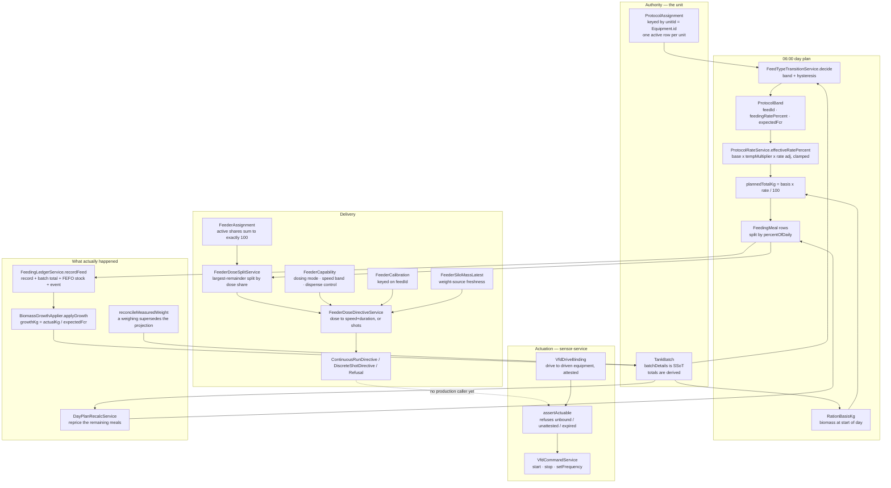

# Feeding System Architecture

## Scope

This is the architecture of record for the feeding chain: how a protocol band becomes
a daily ration, how that ration becomes recorded feed, how recorded feed becomes
biomass, how a weighing corrects it, and how the remaining kilograms become a command
a variable-frequency drive can execute.

It describes farm-service (`apps/farm-service/src/feeding-protocol`, `feeding`,
`batch`, `growth`, `equipment`) and the sensor-service drive binding
(`apps/sensor-service/src/vfd`). Every mechanism named here exists in the source at
the revision this document was written against; the closing section states plainly
what does **not** exist yet, because a description that quietly promises unbuilt work
is worse than no description.

The v1 retirement gates for the engine this replaced live in
`docs/runbooks/feeding-v1-retirement.md`.

## The field rule everything rests on

**A mixed tank is one cohort. The tank — not the batch — is authoritative for weight,
band, feed type and rate.**

Fish are size-graded before they are stocked, so a tank holds one size class even when
several batches are physically present in it. The count-weighted, tank-wide average
weight therefore _is_ the cohort's weight, and resolving the band from it is correct.
Picking one batch's weight would feed the whole tank from a sample of itself.

This looks wrong to a reader who assumes "mixed tank means mixed sizes", so the code
says it out loud in three places and enforces it in one:

- `mixedTankStats()` in `feeding-protocol/services/meal-plan-generator.service.ts`
  computes a mixed-batch flag and a weight coefficient of variation and feeds them
  **only** into the day-plan snapshot. It never selects a batch, never declares a
  dominant one, and never touches `stock.avgWeightG`. A high CV is a signal to an
  operator that the grading has broken down — a human decision, not an arithmetic one.
- `BandWeightG` in `feeding-protocol/services/protocol-rate.service.ts` is a branded
  number with exactly two constructors: `tankBandWeightG(unit)` (re-derived from the
  unit's totals) and `derivedBandWeightG(biomassKg, fishCount)`. `bandFor()` and
  `resolveExpectedFcr()` refuse a bare `number`, so handing the band resolver a
  batch-scoped weight such as `batch.getCurrentAvgWeight()` is a compile error rather
  than a silent second source.
- `BiomassGrowthApplierService.reconcileMeasuredWeight` distributes a measured weight
  across `batchDetails` in proportion to each batch's share, for the same reason: the
  sample sizes the tank.

Batch identity is kept for traceability, and for nothing else in this chain.

## The chain



The dashed edge is the one link that is **not** built. Everything else on the diagram
runs.

## 1. Protocol assignment — the unit is the key

`ProtocolAssignment` (`feeding-protocol/entities/protocol-assignment.entity.ts`) binds
a `FeedingProtocolV2` to a **unit**, where the unit id is `Equipment.id` — the same
identity as `TankBatch.tankId` and the site-authorization sink `resolveTankSiteId`.

At most one assignment per unit can be active, and that is structural, not a service
rule:

```ts
@Index(['tenantId', 'unitId'], { unique: true, where: `"status" = 'active'` })
```

The assignment also carries the operational layer that must not pollute the protocol
template: rate adjustment, meal-time offset, meals-per-day override, per-unit expected-
FCR overrides, and fasting/medication suspension windows.

`batches_v2.protocolId` is **gone**. It was declared with a comment claiming the
protocol follows the fish; nothing in the repository ever wrote it, and it referenced
the retired v1 `feeding_protocols` table, so three readers took their "no protocol"
branch for the lifetime of the feature while the 06:00 engine fed the same tank from
its assignment. The column was dropped by
`database/migrations/1808700000000-DropBatchProtocolId.ts` and stays dropped by
`batch/__tests__/batch-protocol-id-retired.architecture.spec.ts`, which fails the build
if any SQL string names `batches_v2` and `protocolId` together or if the entity
re-declares the property.

The read paths now resolve through one service,
`feeding-protocol/services/unit-protocol-resolver.service.ts`, which has two halves: a
single bulk SQL shape (`loadActiveBindings`, `unitId = ANY(...)`) and pure band→rate
math delegated to `ProtocolRateService`. The tanks-page DataLoader
(`equipment/dataloaders/feed-selection.dataloader.ts`) and `FeedSelectorService` go
through it; the batch traceability query reads the same
assignment ⋈ protocol authority with its own SQL, and the 06:00 generator loads
assignments in bulk itself but calls the same `ProtocolRateService` and
`FeedTypeTransitionService`. So there is one authority for "which protocol" and one
implementation of "at what rate", and no path carries a second copy of either.

The v1 rate calculator, `feed/services/feeding-protocol-rate.service.ts`, survives
beside the still-live v1 `feeding_protocols` surface and has **no production caller** —
its three callers reached it through the dropped column. Its own header says not to
wire new ones.

## 2. Bands

`ProtocolBand` (`feeding-protocol/entities/feeding-protocol-v2.entity.ts`) carries, per
weight band:

| Field                              | Meaning                                                         |
| ---------------------------------- | --------------------------------------------------------------- |
| `minWeightG` / `maxWeightG`        | half-open `[min, max)`, clamped at the edges                    |
| `feedId` / `feedCode` / `feedName` | the feed product, denormalised onto the band                    |
| `feedingRatePercent`               | base daily ration as a percentage of biomass                    |
| `expectedFcr`                      | band default, overridable per unit                              |
| `mealSchedule`                     | optional band-level override of the protocol's default schedule |

Bands are grams only — the v1 gram/kilogram ambiguity does not exist here. Gaps and
overlaps are rejected by `protocol-validation.service.ts`.

Expected FCR resolves in a fixed order with recorded provenance: unit override → the
protocol's configured source (`band` | `matrix` | `feed`) → the band scalar as the
fallback when a configured matrix is absent. The chosen source is stamped into the day
plan as `fcrResolvedSource`, so a plan never hides which number it used.

Temperature is a first-class absence: `temperatureMultiplier(adjustments, null)`
returns `1.0`. A missing reading never scales a ration, and the plan snapshot records
`usingDefaultTemperature`. Effective temperature comes from
`water-quality/services/water-temperature.service.ts` with source `sensor | manual |
none`.

## 3. The daily plan

`FeedingCronV2Service` (`feeding-protocol/services/feeding-cron-v2.service.ts`) runs
the scheduled work. All jobs take a session-scoped advisory lock, so one instance runs
each job.

| Schedule     | Job                                                                                                                                        |
| ------------ | ------------------------------------------------------------------------------------------------------------------------------------------ |
| 05:30        | mark meals `missed` whose window closed over 6 hours ago; auto-finalise stale `partially_fed` meals; apply the `daily`-mode growth roll-up |
| 06:00        | generate day plans for every active assignment; emit `UnfedUnitDetected` for stocked units with no effective plan                          |
| 07:00        | refresh the feed-stock coverage forecast                                                                                                   |
| every 15 min | `MealWindowUpcoming` for meals due within 60 minutes, batched at 500 entries per event, stamped idempotently                               |
| 18:00        | recompute running FCR for live batches, project it onto `batches_v2.fcr.actual`, emit `FCRAlert` past 10% / 20% variance                   |
| 20:00        | `FeedingDailySummary` plus day-scope `MealUnderfed`                                                                                        |
| monthly      | retention: day plans and meals 24 months, mobile command receipts 90 days                                                                  |

Generation itself is `MealPlanGeneratorService.computeDayPlan` — a pure function shared
by the cron, the operator's regenerate action and the activation dry run:

```text
plannedTotalKg = rationBasisKg x effectiveRatePercent / 100
effectiveRatePercent = clamp(bandRate x tempMultiplier x (1 + rateAdj/100),
                             protocol min, protocol max)
```

and each meal takes `plannedTotalKg x percentOfDaily / 100`.

The plan freezes a snapshot of every input it used — average weight, fish count,
biomass, water temperature and its source, band index, feed identity, base rate,
temperature multiplier, effective rate, expected FCR and its provenance, plus the mixed-
batch flag and weight CV. Downstream steps read the snapshot rather than recomputing,
which is why a meal finalised at 19:00 still grows the fish by the FCR the plan was
priced with.

Suspensions are honoured at generation: a `fasting` window produces a `SKIPPED` plan
with zero kilograms (while still advancing the band memory, so the next day does not
start from stale state); a `medication` window keeps the schedule and substitutes
`medicatedFeedId` on every meal.

Persistence is idempotent by key: `INSERT ... ON CONFLICT (tenantId, unitId, planDate)
DO NOTHING`. A second run in the same day writes nothing and — importantly — applies no
second feed transition, because the transition is applied only when the insert actually
produced a row.

A stocked unit that produces no plan is not silent. `detectUnfedUnits` emits
`UnfedUnitDetected` with a classified reason: `no_assignment`, `assignment_paused` or
`draft_protocol`.

## 4. Feed-type transition — one mechanism

`FeedTypeTransitionService` (`feeding-protocol/services/feed-transition.service.ts`) is
the only place that decides or records which feed a unit is on.

- `decide()` is pure and resolves the band from the weight **together with the
  assignment's band memory** (`currentBandIndex` / `currentFeedId`), applying
  `transitionBufferG` hysteresis: an up-shift needs the new band's `minWeightG` to be
  exceeded by the buffer, a down-shift needs its `maxWeightG` to be undercut by it.
  Otherwise the current band holds, so a fish oscillating on a boundary cannot flip
  feeds daily.
- `apply()` is the only writer of `currentFeedId` / `currentBandIndex` /
  `lastTransitionAt` / `totalTransitions`, and the only publisher of
  `FeedTypeTransitioned`. The state cannot be written without the event, nor the event
  without the state.
- `autoTransition: false` **holds** the assignment's band instead of following the
  weight, which is what "no automatic transition" has to mean. The operator's manual
  path is `DayPlanAdminService.transitionUnitFeed`, which goes through the same
  `apply()` with `automatic: false` and refuses a target feed that is not one of the
  protocol's band feeds.

Three callers share that one decision: the 06:00 generator, the intra-day
recalculation, and the activation dry run. Before this, the generator selected the band
from weight alone and never read the assignment's memory, so an overnight boundary
crossing changed the morning feed with no event, and the first intra-day recalculation
then compared against the stale index and could publish a second, contradictory
transition for a boundary already crossed. `feeding-protocol/__tests__/feed-transition-one-mechanism.spec.ts`
pins the single mechanism.

## 5. Recording what was actually fed

`FeedingLedgerService.recordFeed` (`feeding/services/feeding-ledger.service.ts`) is the
single sink for feed, and the only place in the service that creates a
`feeding_records` row. Three callers reach it: the v2 meal engine
(`MealExecutionService`, once per pour), the manual `CreateFeedingRecordHandler`, and
the legacy execution path during its drain window. (One other method mutates an
existing record's actual amount outside this path — `markFeedingCompleted` in
`scheduler/feeding-scheduler.service.ts` — and it has no caller anywhere in the
repository.)

In one transaction it:

1. writes the `FeedingRecord` row (with `mealId` / `pourIndex` / `dayPlanId` when the
   pour belongs to a planned meal) and computes its variance columns;
2. increments the batch's `totalFeedConsumed` and `totalFeedCost` — the batch row is
   locked by the **caller**, in canonical lock order, and this service never takes a
   lock of its own;
3. deducts feed stock FEFO, scoped to the unit's site with a logged tenant-wide
   fallback, under an idempotency key (`meal-deduct-<mealId>-<pourIndex>` for meals,
   `feeding-deduct-<recordId>` otherwise). A feed the storage ledger has never seen is
   skipped with a warning; a storage-tracked feed with no usable lot throws, which
   rolls the whole feeding back — insufficient stock cannot leave a recorded feeding
   behind;
4. enqueues `FeedingRecorded` through the outbox on the same manager.

Cost is computed here for every caller from `feed.pricePerKg` when the caller did not
supply one, so no path can under-report to finance.

Mobile pours arrive through `MealExecutionService.recordMealFeeding`, which requires
the at-most-once command envelope (`clientCommandId` + `payloadHash`, via
`MobileCommandReceiptService`). A replay returns the stored result without taking a
single lock; an envelope-less "legacy" call to this stock-decrementing path is
rejected outright. Receipts are purged after 90 days, and even then a replayed
command cannot double-apply: the meal status guard and the stock-movement idempotency
key are two independent layers.

Corrections go through `correctMealPour`, which moves the delta through every layer —
the pour's audit fields, the meal's variance, the ledger row, the batch totals, a
compensating stock movement (an extra `OUT`, or an `IN` back to the original lot
resolved from the original movement), and the growth delta.

Feed given outside the plan still counts. `CreateFeedingRecordHandler` binds the record
to the unit's live day plan, adds the kilograms to `unplannedActualKg`, applies growth
in the same transaction regardless of growth mode (the daily roll-up sums meal actuals
only, so unplanned feed applied nowhere else would apply nowhere at all), and reprices
the remaining meals with reason `unplanned_feed`.

## 6. Growth comes from feed that was actually given

`growthKg = actualKg / expectedFcr`, never `plannedKg`.

`BiomassGrowthApplierService` (`feeding-protocol/services/biomass-growth-applier.service.ts`)
is the single writer of a unit's weight and biomass. It exposes two entry points —
`applyGrowth` (FCR projection) and `reconcileMeasuredWeight` (a weighing) — that share
one private writer, so both take the same lock order and the same proportional
distribution across `batchDetails`.

`growthKg` may be negative. Reducing a recorded pour reduces biomass by the same
formula, so corrections are symmetric; a share never falls below zero.

**Growth application mode** is a protocol setting, `growthApplicationMode: 'per_meal' |
'daily'`. What the day-end total is does not depend on it — growth is linear in feed —
so what the mode actually controls is _when_ the tank's weight moves, and therefore
which weight the rest of the day's re-pricing, the band decision and the tanks page
see. The fixes agent settled it as a strict either/or with no third path:

- `per_meal` (the behaviour for any protocol that does not say `daily`) applies growth
  when a meal is **finalised** — in `MealExecutionService`, and in the 05:30 sweep when
  it auto-finalises a stale partial meal, using the same formula and the same snapshot
  FCR;
- `daily` holds growth back and applies the day's total once in the 05:30 roll-up,
  stamped with `rollupAppliedAt` as the idempotency key.

Because each mode has exactly one application path, double application is not something
the code avoids — it is something the code cannot express.

The compounding this design exists to prevent is worth naming. In `per_meal` mode,
finalising a meal writes projected growth into `TankBatch.totalBiomassKg`, and the
day's ration used to be recomputed from that very column: the morning meal enlarged the
noon meal, which enlarged the evening meal, every day, once per meal. It is also
biologically false — a fish does not convert feed to flesh at the moment of eating.
`ration-basis.ts` closes it structurally: `RationBasisKg` is a branded type whose only
constructors are "biomass at the start of the day", "shift by a real stock movement"
and "re-baseline onto a measurement". FCR-projected growth has **no constructor**, and
`dailyRationKg()` accepts nothing else, so pricing a day from a live biomass column
does not compile.

## 7. Weighing is authoritative

Before this, a growth sample wrote `Batch.weight.actual` and died there. Every plan,
band, rate and forecast path reads `TankBatch.avgWeightG`, so weighing 200 fish and
finding them 40% off the model changed no plan, no band, no feed type and no
`plannedTotalKg`. Biomass evolved forever as `biomass += fedKg / assumedFCR` — a
projection nothing could correct. `TankBatch.lastSamplingAt` had no writer anywhere.

`RecordGrowthSampleHandler` (`growth/handlers/record-growth-sample.handler.ts`) now:

1. resolves the sampled unit through `batch/utils/unit-for-batch.util.ts`, which is
   fail-closed on ambiguity — a batch stocked in more than one unit with no explicit
   `tankId` throws rather than moving a cohort nobody weighed;
2. takes the canonical lock (all of the unit's batches by ascending id, then the
   `TankBatch` row) and rejects a sample filed against a tank that does not hold the
   batch;
3. calls `reconcileMeasuredWeight`, which derives the target biomass as
   `knownCount x measuredAvgWeightG / 1000` and applies the difference. A sample
   asserts an average **weight**, never a population, so `totalQuantity` is untouched
   and `TankBatchService.applyBatchDelta` remains the sole owner of counts;
4. reprices the live day plan with reason `growth_sample`, which re-baselines the
   ration basis onto the measured biomass and re-evaluates the band against the weight
   that was actually observed — in the same transaction, so a plan can never reflect a
   measurement that rolled back.

Provenance is required, not optional. The private writer takes a discriminated
`BiomassWriteProvenance` (`{ source: 'fcr_projection', basedOnFcr }` or
`{ source: 'measurement', measurementId, measuredAt, sampleSize, confidencePercent }`),
so a write that does not declare whether it was measured or projected is
inexpressible. It lands in two places: `Batch.weight.theoretical` versus
`Batch.weight.actual` (with `variance` finally computed — a block that had never had a
writer, significant above 10%), and `TankBatch.weightProvenance`, which stores the
measured value, the projection it superseded, and the error between them.

That last field is the point of the whole phase: projection-versus-measurement error is
a stored fact for the first time. Before it, biomass was a projection nothing could
correct and nothing could even score.

## 8. A stock change is a ration change

Mortality, cull, transfer (both legs), harvest, harvest reversal, stocking and ledger
reconciliation all reprice the day's remaining meals. That is not seven call sites that
each remember to do it — it is one mechanism that cannot be bypassed. Four of the five
original paths did remember; `allocate-to-tank` did not, so stocking a tank raised its
biomass while the day's remaining meals kept feeding the smaller number.

`TankBatchService.applyStockChange` (`batch/services/tank-batch.service.ts`) is the only
way to change a unit's stock. The writer that actually mutates `batchDetails`,
`applyBatchDelta`, is **private**, and the only handle to it is the `StockChange` object
`applyStockChange` hands to its callback; re-widening it, or reaching it from a second
file, fails `batch/__tests__/services/tank-batch.service.spec.ts`. When the callback
returns, the service settles every unit the handle touched:

- exactly once per unit, no matter how many deltas landed on it;
- with the **accumulated signed biomass delta**, which is what moves the ration basis;
- in ascending `unitId` order, so a transfer and its mirror cannot take day-plan locks
  in opposite orders;
- after every delta is written, so the recalculation reads settled stock;
- only on success.

The recalculation itself reaches the feeding engine through a port,
`batch/services/unit-ration-recalculator.port.ts`, implemented by
`DayPlanRecalcService`. The token is injected **without** `@Optional()`, so a deployment
that forgets to bind a recalculator does not boot. `RecalcTrigger` is a discriminated
union that makes reason and basis-effect inseparable: a stock reason does not compile
without its signed biomass delta, a weighing re-baselines, and every other reason
(growth application, temperature, protocol or assignment edit, unplanned feed, manual
regenerate) reprices at the same basis — it may change the rate, never the biomass the
rate applies to.

Emptying a unit is handled explicitly: remaining meals are cancelled, the plan closes,
the assignment is paused, and `FeedingProtocolAssignmentPaused(unit_emptied)` is
published, so 06:00 does not generate a plan for an empty tank.

Water temperature changes reach the same service from
`water-quality/services/water-quality.service.ts` with reason `temperature`.

## 9. Feeders and the dose split

`FeederAssignment` (`feeding-protocol/entities/feeder-assignment.entity.ts`) binds a
unit to a FEEDING-category `Equipment` row and records that feeder's **share** of the
unit's daily dose. It mirrors `ProtocolAssignment`: keyed by unit, rows are ended
rather than deleted, so a feeding record written last month can still name the feeder
that delivered it and the share it then had.

The invariant — a unit's active shares sum to exactly 100 — is enforced in the
database, by `1808900000000-CreateFeederAssignments.ts`:

- `feeder_assignment_unit_totals` holds one derived row per unit with
  `CHECK (activeSharePercentTotal = 0 OR activeSharePercentTotal = 100)`. Zero means
  the unit is hand-fed; 100 means its feeders cover the whole dose. Nothing else can
  commit.
- A `CONSTRAINT TRIGGER ... DEFERRABLE INITIALLY DEFERRED` on `feeder_assignments`
  recomputes that total at COMMIT.

**Why the deferral is load-bearing.** Adding a second feeder necessarily passes through
a moment where the shares do not sum to 100 — the first row still says 100, the second
says 40. An IMMEDIATE check would reject that intermediate state and make a two-feeder
unit unreachable. Judging at COMMIT looks only at the state the transaction actually
leaves behind. The corollary is deliberate: a multi-row edit outside a transaction
fails, because each autocommit statement is its own transaction, so feeder-set edits
are structurally required to be transactional.

The totals row is also the serialization anchor. The trigger function `UPDATE`s it
_before_ it reads the active set, so two transactions touching the same unit conflict
on one row: under READ COMMITTED the second blocks and then re-reads a snapshot that
includes the first one's committed rows; under REPEATABLE READ or SERIALIZABLE it
aborts. Without the anchor, two concurrent inserts could each observe a locally valid
sum and commit a unit at 150%. Both PL/pgSQL functions are pinned with
`SET search_path` to the schema they were created in, so the guard reports on the data
rather than on its own plumbing when a caller arrives with a different search path.

A service-layer check exists too (`handlers/feeder-assignment.handlers.ts`, integer
thousandths so floating point cannot disagree with `numeric`), but only to give the
operator a readable message. The database is the guarantee.

`FeederDoseSplitService.splitDoseByShare` divides a dose by share using the
largest-remainder method at gram resolution, with a deterministic tie-break, so the
parts reconstitute the whole exactly. Rounding 33.333% of 10 kg three times naively
yields 9.999 kg, and a silent 1 g/day shortfall is the same class of defect as a 90%
share total: invisible, permanent, and paid by the fish.

Changing a unit's feeder set publishes `UnitFeederAssignmentsChanged` with the complete
active set, which is what lets sensor-service rewrite the units a drive claims.

## 10. Calibration and the drive command

Two tables, split along the line between the machine and the feed:

**`FeederCapability`** (`equipment/entities/feeder-capability.entity.ts`) — one row per
feeder, carrying what belongs to the machine: `dosingMode` (`discrete` shots vs
`continuous` auger), `siloCapacityKg`, the drive's validated speed band
(`minSpeedHz` / `maxSpeedHz`), and `dispenseControl` (`time_based` vs `weight_based`)
with its `weightSensorId`. Silo capacity lives here because a silo has one capacity; it
used to sit on the per-feed calibration row, where it was restated once per calibrated
feed and could disagree with itself.

**`FeederCalibration`** (`equipment/entities/feeder-calibration.entity.ts`) — one row
per (feeder, feed), keyed on **`feedId`**. It used to be keyed on pellet diameter,
which is not an identity: two 4 mm feeds from different mills differ in bulk density
and coating and flow through the same auger at different rates. `feedId` is also the
axis the protocol band already turns on, which is what makes the feed transition
automatic — fish grow into the next band, the band's `feedId` changes, and the matching
calibration is found by that id with nobody re-typing anything.

A calibration cannot choose its own physics: `dosing_mode` is FK-pinned to the
capability row, so grams-per-shot on an auger is unstorable by any writer, raw SQL
included. The speed band is carried as an FK-cascaded copy purely so "the reference
speed lies inside the drive's band" can be a local CHECK.

**The physics** (`feeding-protocol/services/feeder-dose-directive.service.ts`). An auger
is volumetric: each screw revolution displaces a fixed volume, and an induction motor
under a VFD turns at a speed proportional to drive frequency, so

```text
gramsPerMinute(f) = gramsPerMinute(f_ref) x f / f_ref
```

— linear through the origin, which is why one measured point fixes the whole line. That
derivation fails at both ends: at low frequency the motor loses torque and cooling, the
screw stick-slips and the hopper bridges; at high frequency the flights no longer fill
completely and the drive enters field weakening, so delivered mass falls _below_ the
line. The high end is the dangerous one, because the model would over-promise and the
fish would be underfed by an amount nothing measures. The line is therefore declared
valid only on `[minSpeedHz, maxSpeedHz]`, and outside it the solver **refuses** rather
than extrapolating or clamping — and the refusal reports the run durations that _are_
reachable, so the guessing does not simply move elsewhere.

With no preferred duration the solver runs at `referenceSpeedHz` — the one operating
point where the rate was measured rather than inferred — and derives the duration. With
a preferred duration (a meal window slow enough for fish to eat) it keeps the duration
and solves for speed. Speed is quantised to the 0.01 Hz drives accept **before**
delivered mass is computed, so `deliveredGrams` describes the command that will
actually be issued. Discrete feeders round to the nearest whole shot, because rounding
down would bias every meal low.

Every outcome is a member of one discriminated union — `continuous_run`,
`discrete_shots`, or `refused` with a reason from a closed set
(`not_commissioned`, `no_calibration_for_feed`, `run_window_unreachable`,
`weight_source_silent`, `non_positive_dose`) — so a caller cannot read `.speedHz`
without first proving the plan is a plan.

A weight-based feeder is refused before any arithmetic if its bound mass source has not
reported within 30 minutes. The freshness test is on the reading, not the id: a
non-null uuid cannot prove a load cell exists. The reading arrives through
`events/listeners/sensor-mass-projection.listener.ts` into
`feeder_silo_mass_latest` — a farm-side, newest-wins projection of the sensor-service
reading stream, with plausibility bounds, because a garbage value would keep a dead
cell looking healthy.

## 11. The VFD

`VfdDriveBinding` (`apps/sensor-service/src/vfd/entities/vfd-drive-binding.entity.ts`)
binds a drive to the farm `equipment.id` it **actuates** — feeder, pump, blower,
anything motorised. The binding is generic on purpose; nothing about it assumes a
feeder. Its primary key is the device id, because a drive turns one shaft, so a second
binding row for the same drive is unrepresentable.

Unit derivation is the narrower layer on top. `resolveDrivenUnit` returns a
discriminated union, never a nullable id:

| Outcome               | Meaning                                                      |
| --------------------- | ------------------------------------------------------------ |
| `unbound`             | no equipment recorded; must not actuate                      |
| `unattested`          | the owner has not confirmed the equipment; must not actuate  |
| `expired`             | confirmed once, but the answer aged out; must not actuate    |
| `not_a_feeder`        | a pump or blower — **a successful outcome carrying no unit** |
| `feeder_without_unit` | a feeder whose assignments ended                             |
| `feeder_ambiguous`    | a feeder serving several units; no guess is made             |
| `feeder_unit`         | the one case where a unit exists                             |

`assertActuable` gates every command that moves a shaft. It requires an attested,
fresh identity but deliberately does **not** require a unit: a pump legitimately serves
none, and a feeder whose assignment lapsed still has to be able to run — refusing that
would stop feeding, which is the worse welfare outcome.

**Cross-service integrity is by attestation, and here is what that cannot guarantee.**
farm-service owns equipment identity; sensor-service owns the drive; a cross-service
foreign key is not available, because the two per-tenant table sets are granted to
different database roles and coupling one service's DDL to another's would trade this
problem for a deploy-ordering one. So `drivenEquipmentId` is a **soft reference**, and
it can be wrong for as long as the news takes to arrive. sensor-service publishes
`VfdDriveBindingAttestationRequested`; farm-service answers from
`events/listeners/vfd-drive-binding-attestation.listener.ts` with the equipment's
category, code, name, site and its **complete** current served-unit set. A binding is
written `PENDING` and cannot actuate until that answer arrives.

The residual risk is bounded rather than silent: an attestation older than one hour is
re-asked (rate-limited to one question per drive per minute so a farm-service outage is
not amplified), and one older than 24 hours is refused. A deleted equipment row revokes
its bindings immediately rather than waiting for the age-out. What remains uncovered is
the window between a change in farm-service and the arrival of the news — a drive can
act on an answer that was true when it was given and is not true now, for at most that
window.

The mobile client (`web/apps/aquamobil`) carries a fleet index, a drive detail screen,
a unit drives card and a tablet board strip, plus start/stop. Actuation is **online
only**, and the ban on queueing it is structural: `src/pwa/actuation-commands.ts` lists
the actuation root fields, and `Extract<OperationType, ActuationCommandRootField>`
becoming non-empty fails the build. A recorded observation replayed two hours later
records the same fact; a drive command replayed two hours later spins an auger nobody
is standing next to.

### Configuration drift is not detected — what must be built, and why

#### The gap, stated precisely

Command-time verification is solid. The edge gateway is provisioned with
`verify_write_readback: true`, the cloud waits for the gateway's real
Modbus-level acknowledgement and never fabricates one, a missing acknowledgement
is a failure rather than an optimistic success, and every attempt — successful or
not — lands in the immutable `vfd_command_audit_logs`.

All of that answers "did my command arrive". None of it answers "is it still
there".

There is no periodic comparison between the parameter values this platform
intended and the values the drive currently holds.
`vfd-change-set-scheduler.service.ts` sweeps every 30 seconds, but it is an
apply orchestrator: it looks for approved change sets that are due and writes
them. Once a set reaches its terminal applied state nothing re-reads it, and
nothing re-asserts it.

#### The concrete failure

Set a drive to 60 Hz. Power is cut. The drive returns at 40 Hz.

The polling loop reads 40, stores it as telemetry, and the UI shows 40. Nothing
compares that against the 60 that was commanded, so nothing re-sends and nothing
warns. The operator sees a number that looks authoritative and is not what the
system asked for.

Per-dose feeding speed is immune to this, and the reason is architectural rather
than lucky: `FeederDoseDirectiveService` recomputes speed and duration from the
calibration for every dispense and sends them with the command, so the next
dispense re-asserts. The exposure is confined to parameters set once at
commissioning and expected to persist — acceleration and deceleration ramps,
maximum frequency limits, control mode, motor nameplate values. A drive running
for months on a wrong maximum-frequency limit is invisible today.

#### Why this is worth building

An actuator that silently disagrees with its commanded configuration is a safety
surface, not a data-quality one. The same discipline that made the drive binding
fail closed applies here: the platform already refuses to actuate a drive whose
owner has not attested it, precisely so it never acts on a guess. A drive whose
configuration has drifted is the same class of problem discovered later.

#### What it needs — no new infrastructure

Every ingredient exists.

1. **Intent is already recorded.** `vfd-programming` holds parameter
   definitions, change sets and change-set items carrying previous values.
2. **The device is already readable.** `readVfdParameters` exists, the drives are
   polled on `poll_interval_ms`, and the register catalogue is per brand.
3. **The comparison does not exist.** That is the whole of the missing work.

Three things to add:

- A slower configuration read alongside the existing telemetry poll. This is the
  substantive change: `VfdReading` today carries only operational values —
  output frequency, motor current, DC bus voltage, temperatures, status and fault
  words. Not one configuration parameter. The platform watches what the drive is
  _doing_ and never what it is _set to_, so drift is invisible by construction
  rather than by oversight.
- A comparison of what is read against the intent held in `vfd-programming`.
- An alarm on divergence, routed like any other drive fault.

#### What it will not tell you

It will report that a value changed, never who changed it.

A drive's own event log records faults — overcurrent, overtemperature, phase
loss — not parameter edits. A keypad change is typically not journalled at all,
and where it is, the format is vendor-specific. Fault history is readable today
only for Rockwell (`fault_history_1`) and Mitsubishi (`fault_history_1`,
`fault_history_2`); the other six brand configs (ABB, Danfoss, Delta, Schneider,
Siemens, Yaskawa) carry no such register, though the drives keep one and the
addresses could be added from vendor documentation.

Attribution therefore comes from our side, not the drive's.
`vfd_command_audit_logs` records every write this platform issued, including the
failures. When a drift is detected and no matching entry exists, the change did
not originate here — a panel edit, a post-outage reset, or another system. That
does not name the actor, but it establishes the boundary, which is usually what
the operational question actually requires.

## 12. What is NOT built

- **The dose directive has no production caller.** `FeederDoseDirectiveService` is
  registered, tested and exported, and nothing in the repository calls
  `planUnitDoseForBand` or `planFeederDose` outside its own spec. The plan does not
  yet issue commands; that is the next phase. This is the dashed edge on the diagram.
- **No equipment picker for the drive binding.** `bindVfdDrivenEquipment` is a
  mutation with no UI behind it in `web/modules/sensor-module` — the module has no
  farm-service `equipmentList` query, and the previously shipped tank/pump dropdowns
  were removed precisely because they were permanently empty while the fields behind
  them were sent as free uuids.
- **`VfdDevice.farmId` is still a bare uuid.** It is a location scope rather than an
  actuation target, and deriving it needs a site-hierarchy projection that does not
  exist.
- **No drive percentage, hopper contents or fault meaning on mobile.** Each would be a
  number the client computed and the server never stated; the surfaces show output
  frequency in Hz, silo _capacity_ labelled as capacity, and the raw fault code with
  the manual named.
- **Stocking through batch creation still bypasses the stock writer.**
  `create-batch.handler`'s bulk `initialLocations` path and the legacy
  `BatchService.updateTankBatch*` primitives build `TankBatch` rows themselves, so they
  neither derive through `applyStockChange` nor reprice the day.
- **`RecordGrowthSamplePayload.tankId` remains optional** (making it required is a
  breaking GraphQL input change); ambiguity is caught fail-closed instead.

## 13. A warning about tests, from the FCR sweep

The 18:00 FCR alert sweep selected its own work with

```sql
WHERE "isActive" = true
  AND status IN ('ACTIVE','GROWING')
  AND (fcr->>'actual')::numeric > 0
```

`fcr.actual` had exactly one writer — `CloseBatchHandler` — in the same block that sets
`status = CLOSED` and `isActive = false`. A live batch therefore always had
`fcr.actual = 0` and failed the third clause; a batch with a non-zero `fcr.actual` was
by construction closed and failed the first two. The predicate was **unsatisfiable**.
Not one `FCRAlert` was ever emitted in production, for months, while the alert-engine
consumer sat waiting.

The unit test was green the whole time, because it mocked `manager.query` and returned
rows directly. It never executed the predicate it claimed to verify. A test that mocks
away the thing it is testing is worse than no test: it converts an open question into a
false answer, and it does so on the dashboard everyone trusts.

The repair is in two parts, and both matter:

- the scope query now derives from batch **lifecycle** alone
  (`LIVE_BATCH_FCR_SCOPE_SQL` in `growth/services/fcr-calculation.service.ts`, bound to
  the same `OPERATIONAL_BATCH_STATUSES` constant behind `assertFeedable`), and the FCR
  value is computed in-process by the single authority, so the sweep no longer gates
  itself on a column nothing in its own pipeline maintains;
- the contract is now pinned against real Postgres in
  `apps/farm-service/src/__tests__/e2e/running-fcr-sweep.postgres.spec.ts`, which was
  proven to go red when the unsatisfiable predicate is restored. The remaining unit
  spec states in its own header that it verifies **alert policy only** and that
  discovery and computation are mocked there and cannot be verified from it.

The general lesson for the next reader: a passing test proves that the code path the
test executed behaved as asserted. It proves nothing about a path the test replaced
with a double. When the thing under test _is_ a predicate, a query plan, a constraint
or a lock order, the double is the bug.

## Where the code lives

| Concern                                     | Path                                                                                                 |
| ------------------------------------------- | ---------------------------------------------------------------------------------------------------- |
| Protocol, bands, settings                   | `apps/farm-service/src/feeding-protocol/entities/feeding-protocol-v2.entity.ts`                      |
| Unit assignment                             | `.../entities/protocol-assignment.entity.ts`                                                         |
| Protocol lookup for the read paths          | `.../services/unit-protocol-resolver.service.ts`                                                     |
| Band / rate / expected-FCR maths            | `.../services/protocol-rate.service.ts`                                                              |
| Feed transition (single mechanism)          | `.../services/feed-transition.service.ts`                                                            |
| Day-plan computation and persistence        | `.../services/meal-plan-generator.service.ts`                                                        |
| Ration basis (anti-compounding brand)       | `.../services/ration-basis.ts`                                                                       |
| Scheduled jobs                              | `.../services/feeding-cron-v2.service.ts`                                                            |
| Intra-day repricing                         | `.../services/day-plan-recalc.service.ts`                                                            |
| Operator plan actions                       | `.../services/day-plan-admin.service.ts`                                                             |
| Meal execution, pours, corrections          | `.../services/meal-execution.service.ts`                                                             |
| Growth + measurement writer                 | `.../services/biomass-growth-applier.service.ts`                                                     |
| Feeder assignment + dose split              | `.../entities/feeder-assignment.entity.ts`, `.../services/feeder-dose-split.service.ts`              |
| Dose → drive directive                      | `.../services/feeder-dose-directive.service.ts`                                                      |
| Single feed-write sink                      | `apps/farm-service/src/feeding/services/feeding-ledger.service.ts`                                   |
| Stock writer + recalculation port           | `apps/farm-service/src/batch/services/tank-batch.service.ts`, `.../unit-ration-recalculator.port.ts` |
| Growth sample handler                       | `apps/farm-service/src/growth/handlers/record-growth-sample.handler.ts`                              |
| Running FCR + alert scope                   | `apps/farm-service/src/growth/services/fcr-calculation.service.ts`                                   |
| Feeder capability / calibration / silo mass | `apps/farm-service/src/equipment/entities/feeder-*.entity.ts`                                        |
| Drive binding + unit resolution             | `apps/sensor-service/src/vfd/services/vfd-drive-binding.service.ts`                                  |
| Attestation answer                          | `apps/farm-service/src/events/listeners/vfd-drive-binding-attestation.listener.ts`                   |
| Mobile drive surface                        | `web/apps/aquamobil/src/pages/drives/`, `src/utils/vfd-drive.ts`, `src/pwa/actuation-commands.ts`    |
