<!-- ARIA-CURRENT-STATE-NOTICE: This explanatory architecture document is subordinate to docs/aria/CURRENT_STATE.md and executable contracts. If this document conflicts with code, machine-checked contracts, or CURRENT_STATE.md, the lower-priority prose must be corrected or marked historical. -->

# ARIA Architecture / ARIA Mimarisi

Authority: explanatory-architecture
Current authority: `docs/aria/CURRENT_STATE.md` + executable contracts
Runtime status: Claude Code CLI mainline
Historical scope: snowball/Claude-era references are non-normative unless reaffirmed by current executable contracts

## Authority Chain / Yetki Zinciri

### EN

ARIA is governed by a fail-closed authority chain. Executable code and machine-checked contracts are normative; this document explains that system but does not replace the live authority in `CURRENT_STATE.md`.

### TR

ARIA kapalı-hata veren bir yetki zinciriyle yönetilir. Çalıştırılabilir kod ve makineyle kontrol edilen sözleşmeler normatiftir; bu doküman sistemi açıklar ama `CURRENT_STATE.md` dosyasındaki canlı otoritenin yerine geçmez.

### Executable Links / Çalıştırılabilir Bağlantılar

| Claim | Code/Test authority | Why it matters |
|---|---|---|
| Live human-readable authority | [docs/aria/CURRENT_STATE.md](./CURRENT_STATE.md) | Runtime claims must defer to the current state index. |
| CLI surface | [aria-kernel/aria_kernel/cli.py](../../aria-kernel/aria_kernel/cli.py) | Public runtime entry points are defined in code. |
| Runtime profile authority | [aria-kernel/aria_kernel/runtime_profile.py](../../aria-kernel/aria_kernel/runtime_profile.py) | Write permission is profile-bound. |
| SSoT invariant | [tests/invariants/aria-doc-runtime-ssot.spec.ts](../../tests/invariants/aria-doc-runtime-ssot.spec.ts) | Stale runtime prose is test-blocked. |

### Diagram / Diyagram

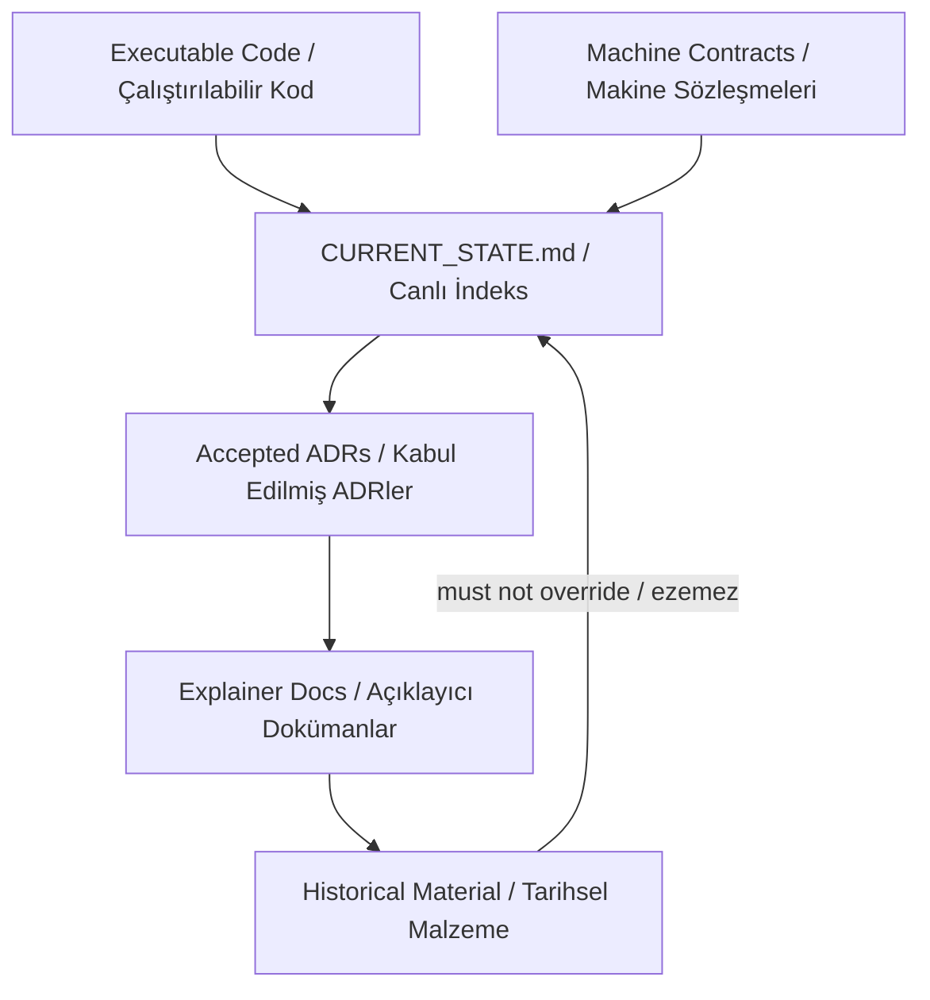

## Main Value / Ana Değer

### EN

ARIA's main contribution is not replacing Aqua's tests or reviewers. It turns distributed tenant, schema, event, CI, finding, and debt rules into a repo-aware evidence, memory, pressure, triage, and validation control plane.

### TR

ARIA'nın ana katkısı Aqua testlerinin ya da reviewerların yerine geçmek değildir. Dağınık tenant, schema, event, CI, finding ve debt kurallarını repo şeklini bilen evidence, memory, pressure, triage ve validation kontrol düzlemine çevirir.

### Executable Links / Çalıştırılabilir Bağlantılar

| Claim | Code/Test authority | Why it matters |
|---|---|---|
| Aqua risk adapters are known but gated | [aria-kernel/aria_kernel/adapter_portfolio.py](../../aria-kernel/aria_kernel/adapter_portfolio.py) | Tenant, schema, event, CQRS, outbox, and NATS surfaces are named capability lanes. |
| Risk becomes pressure | [aria-kernel/aria_kernel/pressure.py](../../aria-kernel/aria_kernel/pressure.py) | ARIA prioritizes stale beliefs, contradictions, health violations, and findings. |
| Pressure becomes triage | [aria-kernel/aria_kernel/triage.py](../../aria-kernel/aria_kernel/triage.py) | High-risk domains default to review or human-only handling. |
| Validation is structured | [aria-kernel/aria_kernel/validation_matrix_gate.py](../../aria-kernel/aria_kernel/validation_matrix_gate.py) | Claims must map to required validation evidence. |

### Diagram / Diyagram

```mermaid
flowchart LR
  Aqua["Aqua Rules / Aqua Kuralları"]
  Repo["Repo Shape / Repo Şekli"]
  Evidence["Evidence / Kanıt"]
  Memory["Memory / Hafıza"]
  Pressure["Pressure / Baskı"]
  Triage["Triage / Sınıflandırma"]
  Validation["Validation / Doğrulama"]
  Report["Report or PR / Rapor veya PR"]

  Aqua --> Repo
  Repo --> Evidence
  Evidence --> Memory
  Memory --> Pressure
  Pressure --> Triage
  Triage --> Validation
  Validation --> Report
```

## Repo-Shape Acquisition / Repo Şeklini Edinme

### EN

ARIA learns the repository shape mechanically from committed snapshots, file fates, fingerprints, service maps, package markers, Nx markers, migration counts, web module markers, and feedback path mapping.

### TR

ARIA repo şeklini committed snapshot, file fate, fingerprint, service map, package marker, Nx marker, migration sayısı, web module marker ve feedback path mapping üzerinden mekanik olarak çıkarır.

### Executable Links / Çalıştırılabilir Bağlantılar

| Claim | Code/Test authority | Why it matters |
|---|---|---|
| Discovery writes snapshot/fates/fingerprint/service map | [aria-kernel/aria_kernel/discovery.py](../../aria-kernel/aria_kernel/discovery.py) | Repo topology enters ARIA through reproducible artifacts. |
| Path feedback becomes capability gaps | [aria-kernel/aria_kernel/feedback.py](../../aria-kernel/aria_kernel/feedback.py) | External reports are mapped back to repo surfaces. |
| Service ownership is later validated | [tests/invariants/_constants.ts](../../tests/invariants/_constants.ts) | Aqua already has invariant-backed surface definitions. |

### Diagram / Diyagram

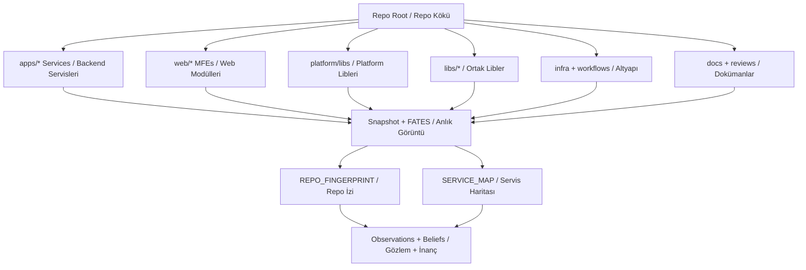

## Memory And State / Hafıza ve Durum

### EN

ARIA memory is ledger-first. Discovery artifacts become observations, observations support beliefs, evidence drift pushes beliefs into revalidation or stale states, and contradictions create pressure for later cycles. ARIA must not use its own generated reports as evidence.

### TR

ARIA hafızası ledger-first çalışır. Discovery artefaktları observation olur, observation kayıtları belief destekler, evidence drift belief kayıtlarını revalidation veya stale durumuna iter, contradiction ise sonraki cycle için pressure üretir. ARIA kendi ürettiği raporları kanıt olarak kullanmamalıdır.

### Executable Links / Çalıştırılabilir Bağlantılar

| Claim | Code/Test authority | Why it matters |
|---|---|---|
| Belief and observation lifecycle | [aria-kernel/aria_kernel/memory.py](../../aria-kernel/aria_kernel/memory.py) | Memory state is append-only and evidence-bound. |
| Write-driving runtime state | [aria-kernel/aria_kernel/state_manifest.py](../../aria-kernel/aria_kernel/state_manifest.py) | State surfaces must be declared before autonomy trusts them. |
| Learning hooks | [aria-kernel/aria_kernel/learning.py](../../aria-kernel/aria_kernel/learning.py) | Feedback and stale state can trigger future skill or agent genesis. |
| Knowledge graph support | [aria-kernel/aria_kernel/knowledge_graph.py](../../aria-kernel/aria_kernel/knowledge_graph.py) | Repo facts can be connected across surfaces. |

### Diagram / Diyagram

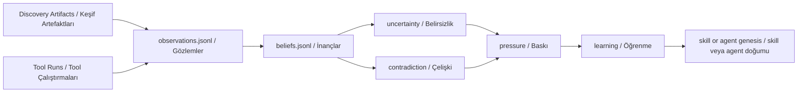

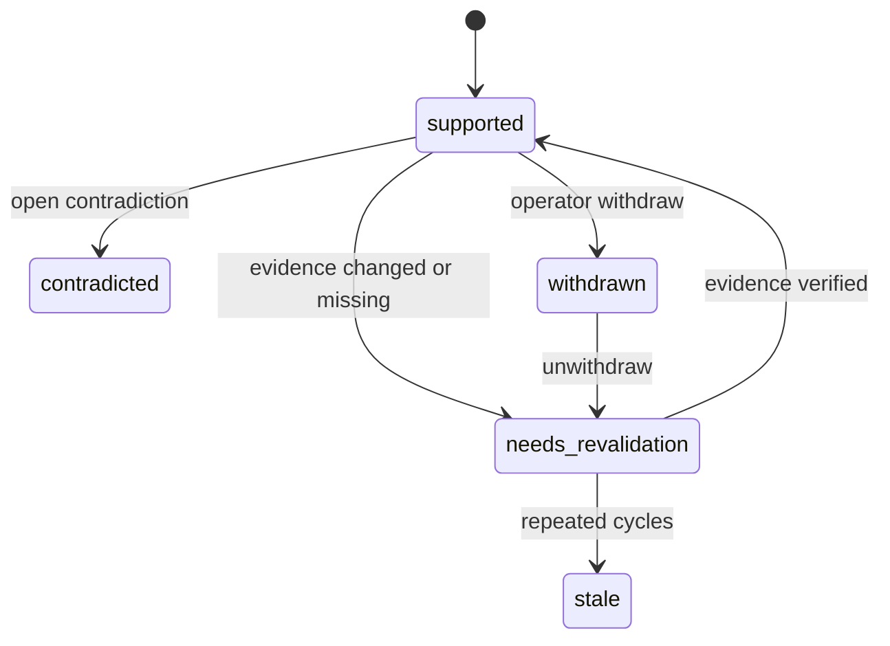

## Decision Making / Karar Verme

### EN

ARIA decides from pressure. If there is no pressure, no plan is synthesized. If a plan exists, primary/challenger/cross-review convergence must pass before implementation, specialist review, worker dispatch, post-implementation review, and any merge path.

### TR

ARIA kararını pressure üzerinden verir. Pressure yoksa plan üretilmez. Plan varsa implementation, specialist review, worker dispatch, post-implementation review ve merge hattından önce primary/challenger/cross-review convergence geçmek zorundadır.

### Executable Links / Çalıştırılabilir Bağlantılar

| Claim | Code/Test authority | Why it matters |
|---|---|---|
| Outer autonomy loop | [aria-kernel/aria_kernel/autonomy_orchestrator.py](../../aria-kernel/aria_kernel/autonomy_orchestrator.py) | Cycle, convergence, review, dispatch, and merge order are coded. |
| Plan content synthesis | [aria-kernel/aria_kernel/plan_synthesizer.py](../../aria-kernel/aria_kernel/plan_synthesizer.py) | Plans come from concrete pressure sources. |
| Convergence state machine | [aria-kernel/aria_kernel/plan_convergence.py](../../aria-kernel/aria_kernel/plan_convergence.py) | Plans cannot silently jump from draft to execution. |
| Cross-review bridge | [aria-kernel/aria_kernel/cross_review_bridge.py](../../aria-kernel/aria_kernel/cross_review_bridge.py) | Agent responses must become legal convergence events. |

### Diagram / Diyagram

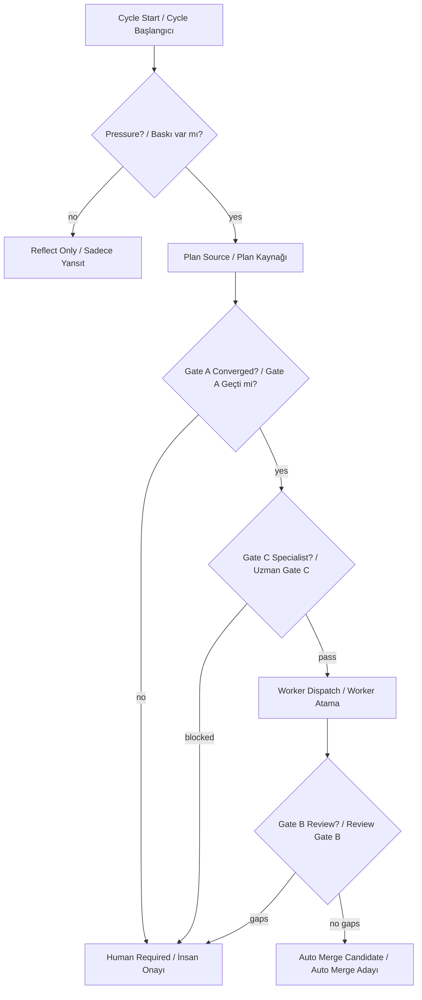

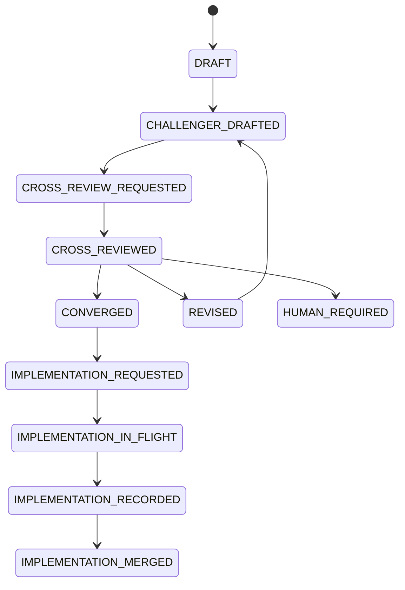

## Skill Writing / Skill Yazımı

### EN

Skill writing is governed genesis, not prompt-only invention. A repeated gap or pattern can create a request, but draft, corpus, sandbox, evidence, approval, registry, shadow, readiness, and promotion gates must pass before active use.

### TR

Skill yazımı prompt-only üretim değildir; yönetişimli genesis akışıdır. Tekrarlayan gap veya pattern request yaratabilir, fakat active kullanımdan önce draft, corpus, sandbox, evidence, approval, registry, shadow, readiness ve promotion gate geçmek zorundadır.

### Executable Links / Çalıştırılabilir Bağlantılar

| Claim | Code/Test authority | Why it matters |
|---|---|---|
| Skill genesis request/draft/materialize | [aria-kernel/aria_kernel/skill_genesis.py](../../aria-kernel/aria_kernel/skill_genesis.py) | Skill files are scoped and approval-gated. |
| Convergent authoring | [aria-kernel/aria_kernel/convergent_skill_authoring.py](../../aria-kernel/aria_kernel/convergent_skill_authoring.py) | Primary/challenger/judge gates reduce hallucinated adapters. |
| Sandbox isolation | [aria-kernel/aria_kernel/skill_genesis_sandbox.py](../../aria-kernel/aria_kernel/skill_genesis_sandbox.py) | Unsafe imports and unsandboxed execution fail closed. |
| Promotion policy | [aria-kernel/aria_kernel/promotion.py](../../aria-kernel/aria_kernel/promotion.py) | SHADOW to ACTIVE requires readiness and operator approval. |

### Diagram / Diyagram

```mermaid
flowchart LR
  Gap["Gap or Pattern / Boşluk veya Pattern"]
  Request["Request / İstek"]
  Draft["Draft / Taslak"]
  Corpus["Corpus + Fixtures / Korpus + Fixture"]
  Sandbox["Sandbox / Kum Havuzu"]
  Approval["Operator Approval / Operatör Onayı"]
  Materialize["Materialize / Yazıya Geçir"]
  Registry["Registry / Kayıt"]
  Shadow["SHADOW / Gölge"]
  Active["ACTIVE / Aktif"]

  Gap --> Request
  Request --> Draft
  Draft --> Corpus
  Corpus --> Sandbox
  Sandbox --> Approval
  Approval --> Materialize
  Materialize --> Registry
  Registry --> Shadow
  Shadow --> Active
```

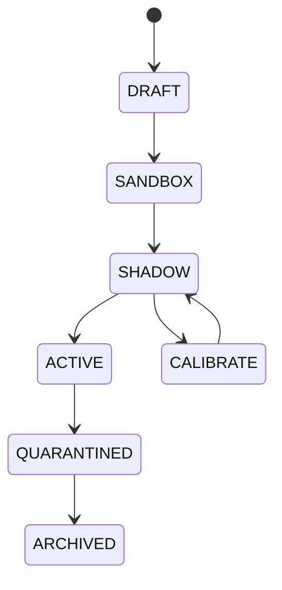

## Agent Writing / Agent Yazımı

### EN

Agent writing starts from a capability gap and becomes an `aria-*` draft intent. Materialization is gated by fixtures, sandbox proof, approval, target path containment, and response contracts. Invocation uses append-only requests, lease tokens, evidence validation, and satisfaction matrices.

### TR

Agent yazımı capability gap ile başlar ve `aria-*` draft intent kaydına dönüşür. Materialization; fixture, sandbox proof, approval, target path containment ve response contract ile sınırlandırılır. Invocation append-only request, lease token, evidence validation ve satisfaction matrix kullanır.

### Executable Links / Çalıştırılabilir Bağlantılar

| Claim | Code/Test authority | Why it matters |
|---|---|---|
| Agent genesis | [aria-kernel/aria_kernel/agent_genesis.py](../../aria-kernel/aria_kernel/agent_genesis.py) | Agent birth is approval and sandbox gated. |
| Agent role SSoT | [aria-kernel/aria_kernel/agent_surface.py](../../aria-kernel/aria_kernel/agent_surface.py) | Roles, targets, lifecycle labels, and pairings are centralized. |
| Request/response contract | [aria-kernel/aria_kernel/agent_contract.py](../../aria-kernel/aria_kernel/agent_contract.py) | Responses must satisfy exact scope and evidence rules. |
| Invocation ledger | [aria-kernel/aria_kernel/agent_invocations.py](../../aria-kernel/aria_kernel/agent_invocations.py) | Claims, leases, heartbeats, and results are append-only. |

### Diagram / Diyagram

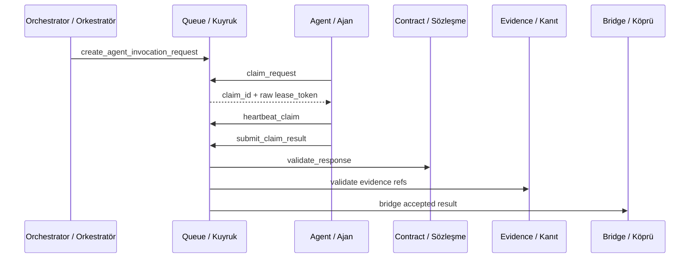

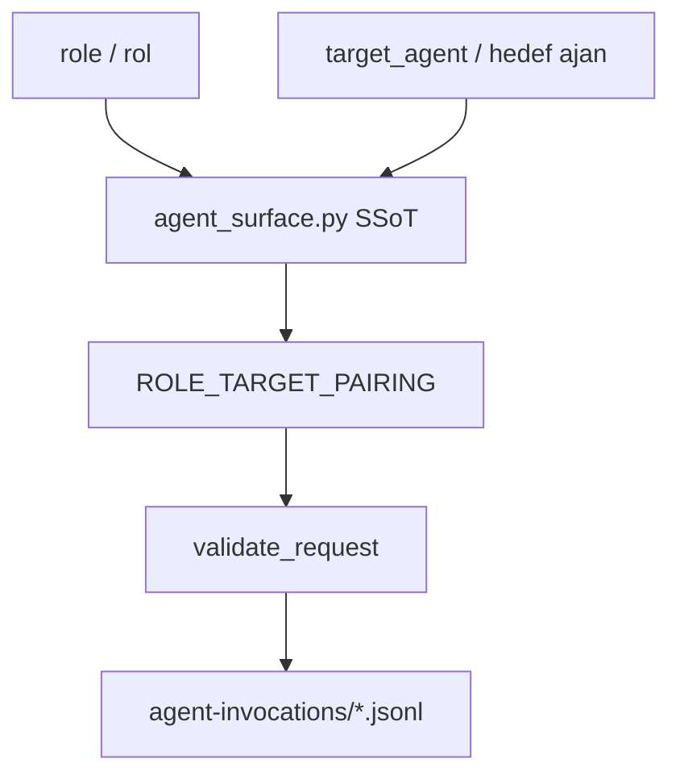

## Bug Finding / Hata Bulma

### EN

ARIA treats bug-like signals as evidence-bound findings, feedback, pressure, and debt. Tool findings are not automatically operator findings; promotion to `aria-findings/F-*.json` needs provenance, severity, evidence shape, and banned-phrase checks. Debts are explicit follow-ons with owner and due-date discipline.

### TR

ARIA bug benzeri sinyalleri evidence-bound finding, feedback, pressure ve debt olarak işler. Tool finding otomatik olarak operatör finding değildir; `aria-findings/F-*.json` seviyesine çıkmak için provenance, severity, evidence shape ve banned-phrase kontrolü gerekir. Debt kayıtları owner ve due-date disiplini olan açık follow-on kayıtlardır.

### Executable Links / Çalıştırılabilir Bağlantılar

| Claim | Code/Test authority | Why it matters |
|---|---|---|
| Finding emission | [aria-kernel/aria_kernel/finding.py](../../aria-kernel/aria_kernel/finding.py) | Operator-facing findings have severity and evidence gates. |
| Debt emission | [aria-kernel/aria_kernel/debt.py](../../aria-kernel/aria_kernel/debt.py) | Debts require owner, due date, verified source finding, and no auto-close. |
| Evidence validation | [aria-kernel/aria_kernel/evidence_validator.py](../../aria-kernel/aria_kernel/evidence_validator.py) | Missing files, bad lines, self-output refs, and scope escapes are rejected. |
| Finding registry invariant | [tests/invariants/finding-registry-integrity.spec.ts](../../tests/invariants/finding-registry-integrity.spec.ts) | Registry shape and hash-chain integrity are checked. |

### Diagram / Diyagram

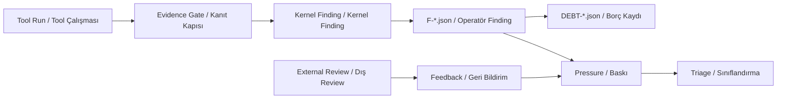

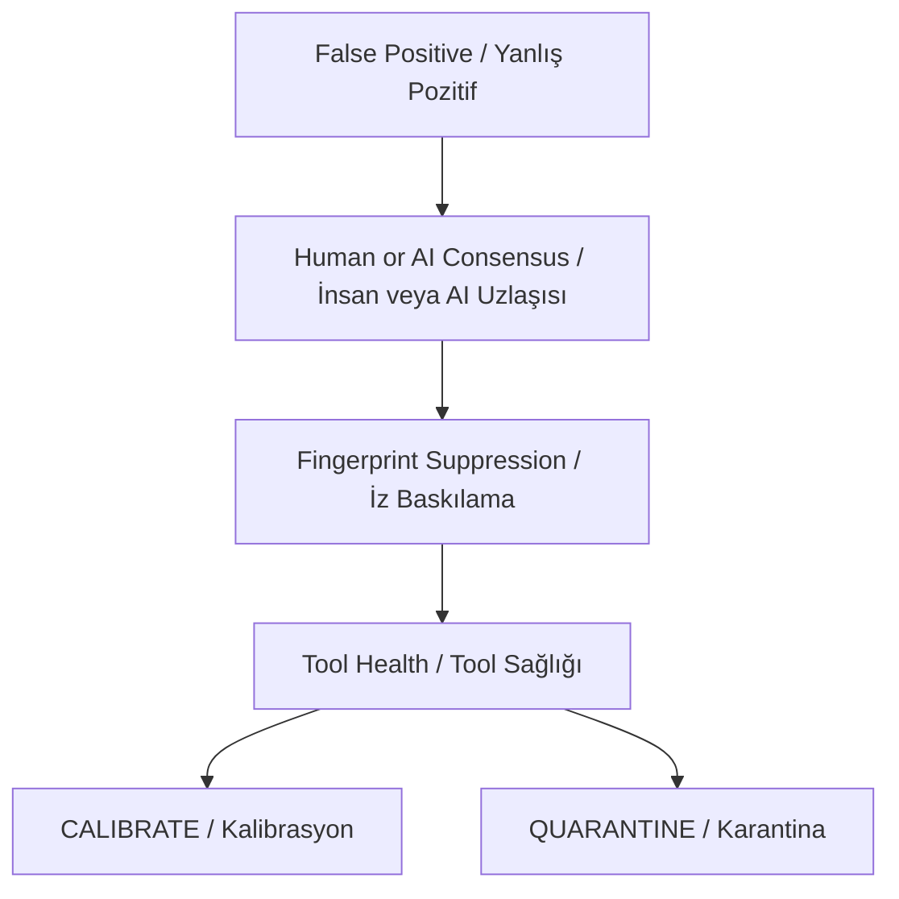

## Aqua Risk Maps / Aqua Risk Haritaları

### EN

ARIA is most valuable when it makes Aqua's existing risk rules visible and repeatable: tenant isolation, schema drift, CQRS/outbox/event consistency, and CI/supply-chain controls.

### TR

ARIA en çok Aqua'nın mevcut risk kurallarını görünür ve tekrarlanabilir yaptığında değer üretir: tenant isolation, schema drift, CQRS/outbox/event consistency ve CI/supply-chain kontrolleri.

### Executable Links / Çalıştırılabilir Bağlantılar

| Claim | Code/Test authority | Why it matters |
|---|---|---|
| Tenant-scoped repository | [libs/backend-common/src/database/tenant-scoped-repository.ts](../../libs/backend-common/src/database/tenant-scoped-repository.ts) | Repository access must stay tenant-aware. |
| Tenant transaction schema pinning | [libs/backend-common/src/database/tenant-transaction.ts](../../libs/backend-common/src/database/tenant-transaction.ts) | Transaction search path is a tenant boundary. |
| Schema manager | [libs/backend-common/src/database/schema-manager.service.ts](../../libs/backend-common/src/database/schema-manager.service.ts) | Platform and tenant schemas are coordinated. |
| Outbox publisher | [platform/libs/outbox/src/outbox-publisher.service.ts](../../platform/libs/outbox/src/outbox-publisher.service.ts) | Domain events should pass through transactional outbox. |
| NATS event bus | [platform/libs/event-bus/src/nats/nats-event-bus.ts](../../platform/libs/event-bus/src/nats/nats-event-bus.ts) | Tenant subjects and event emission rules are runtime concerns. |
| Workflow SHA pin invariant | [tests/invariants/aria-workflow-sha-pin.spec.ts](../../tests/invariants/aria-workflow-sha-pin.spec.ts) | CI supply-chain posture is checked. |

### Diagram / Diyagram

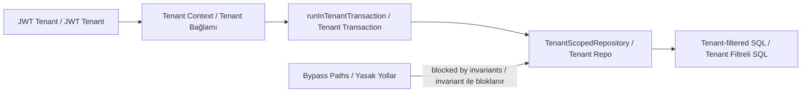

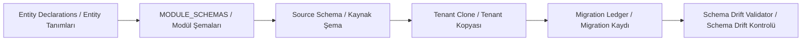

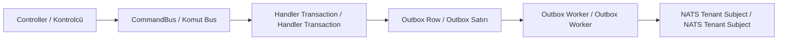

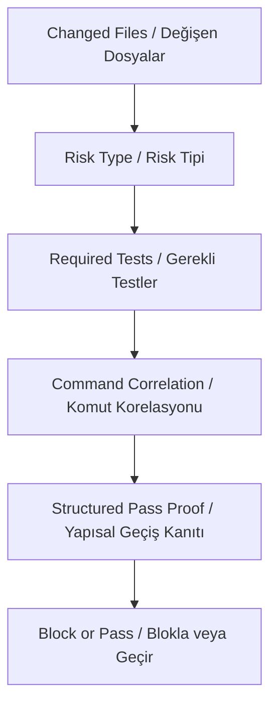

## Runtime And Safety / Çalışma Zamanı ve Güvenlik

### EN

ARIA live autonomous execution is Claude Code CLI based. Promotion evidence must be artifact-bearing, hash-bound, path-contained, indexed, and connected to cycle/run ledgers. Lifecycle-only cycles do not authorize promotion.

### TR

ARIA canlı autonomous execution Claude Code CLI tabanlıdır. Promotion evidence artifact-bearing, hash-bound, path-contained, indexed ve cycle/run ledger bağlantılı olmalıdır. Lifecycle-only cycle promotion yetkisi vermez.

### Executable Links / Çalıştırılabilir Bağlantılar

| Claim | Code/Test authority | Why it matters |
|---|---|---|
| Claude runtime | [tools/aria-poc/claude_runtime.py](../../tools/aria-poc/claude_runtime.py) | Runtime calls are Claude Code CLI mainline. |
| CI executor | [tools/aria-poc/ci_executor.py](../../tools/aria-poc/ci_executor.py) | CI execution path is explicit. |
| Worker executor | [tools/aria-poc/worker_executor.py](../../tools/aria-poc/worker_executor.py) | Worker execution path is explicit. |
| Artifact graph | [aria-kernel/aria_kernel/runtime_artifacts.py](../../aria-kernel/aria_kernel/runtime_artifacts.py) | Promotion proof is graph and hash bound. |
| Artifact safety | [aria-kernel/aria_kernel/artifact_safety.py](../../aria-kernel/aria_kernel/artifact_safety.py) | Runtime artifacts must stay inside safe boundaries. |
| Enterprise observe burn-in | [aria-kernel/aria_kernel/burn_in.py](../../aria-kernel/aria_kernel/burn_in.py) | 20-30 observe cycles prove discovery, memory, pressure, and triage without agent/tool/PR action. |
| Burn-in SSoT | [docs/aria/ENTERPRISE_AUTONOMY_SSOT.md](./ENTERPRISE_AUTONOMY_SSOT.md) | Enterprise autonomy gates and acceptance matrix are documented separately. |
| Auto merge evaluator | [aria-kernel/aria_kernel/auto_merge.py](../../aria-kernel/aria_kernel/auto_merge.py) | Readiness evaluation remains low-level; real merge is delegated to the authority wrapper. |
| Auto merge authority | [aria-kernel/aria_kernel/merge_authority.py::merge_pr_if_ready](../../aria-kernel/aria_kernel/merge_authority.py) | Real merge is fail-closed and authority-wrapper-bound. |

### Diagram / Diyagram

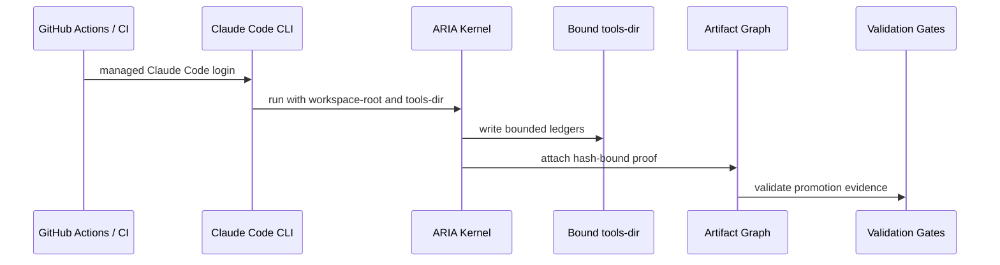

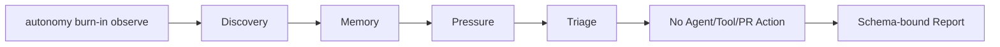

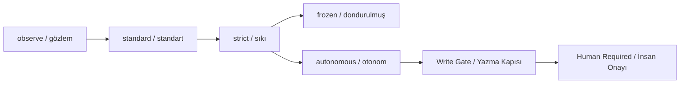

## Historical Docs And Runbooks / Tarihsel Dokümanlar ve Runbook'lar

### EN

Historical snowball, Claude Code, Anthropic, and `llm_bridge.py` language is design history or compatibility material unless the current executable contracts reaffirm it. It must not be read as current runtime authority.

### TR

Tarihsel snowball, Claude Code, Anthropic ve `llm_bridge.py` dili, güncel executable contract tekrar doğrulamadıkça tasarım geçmişi veya uyumluluk malzemesidir. Güncel runtime otoritesi gibi okunmamalıdır.

### Executable Links / Çalıştırılabilir Bağlantılar

| Claim | Code/Test authority | Why it matters |
|---|---|---|
| Current runtime authority | [docs/aria/CURRENT_STATE.md](./CURRENT_STATE.md) | Stale runtime claims must defer to the live index. |
| Historical stale-term invariant | [tests/invariants/aria-doc-runtime-ssot.spec.ts](../../tests/invariants/aria-doc-runtime-ssot.spec.ts) | Historical docs must carry authority notices. |
| Historical smoke runbook | [docs/runbooks/aria-v3-1-smoke.md](../runbooks/aria-v3-1-smoke.md) | This runbook is compatibility material, not live authority. |
| Historical GitHub App runbook | [docs/runbooks/aria-github-app-setup.md](../runbooks/aria-github-app-setup.md) | Its snowball branch-protection instructions are not current authority. |

### Diagram / Diyagram

```mermaid
flowchart TD
  OldDoc["Old Doc / Eski Doküman"]
  Stale{"Stale Runtime Term? / Eski Runtime Terimi?"}
  Notice["Notice Required / Uyarı Gerekli"]
  Current["CURRENT_STATE.md / Canlı Otorite"]
  Defect["Documentation Defect / Dokümantasyon Hatası"]

  OldDoc --> Stale
  Stale -->|yes| Notice
  Stale -->|no| Current
  Notice --> Current
  OldDoc -->|no notice / uyarı yok| Defect
```

## Executable Anchor Matrix / Çalıştırılabilir Dayanak Matrisi

### EN

This matrix keeps the explanatory diagrams tied to code. The core anchors below are inherited from `CURRENT_STATE.md` and should be updated there first when runtime authority changes.

### TR

Bu matris açıklayıcı grafikleri koda bağlı tutar. Aşağıdaki ana dayanaklar `CURRENT_STATE.md` dosyasından gelir; runtime otoritesi değişirse önce orası güncellenmelidir.

### Executable Links / Çalıştırılabilir Bağlantılar

| Surface | Authority |
|---|---|
| CLI | [aria-kernel/aria_kernel/cli.py](../../aria-kernel/aria_kernel/cli.py) |
| Runtime profile | [aria-kernel/aria_kernel/runtime_profile.py](../../aria-kernel/aria_kernel/runtime_profile.py) |
| State manifest | [aria-kernel/aria_kernel/state_manifest.py](../../aria-kernel/aria_kernel/state_manifest.py) |
| Tool registry | [aria-kernel/aria_kernel/tool_registry.py](../../aria-kernel/aria_kernel/tool_registry.py) |
| Runtime artifacts | [aria-kernel/aria_kernel/runtime_artifacts.py](../../aria-kernel/aria_kernel/runtime_artifacts.py) |
| Tool health | [aria-kernel/aria_kernel/tool_health.py](../../aria-kernel/aria_kernel/tool_health.py) |
| Runs reader | [aria-kernel/aria_kernel/runs_reader.py](../../aria-kernel/aria_kernel/runs_reader.py) |
| Agent surface | [aria-kernel/aria_kernel/agent_surface.py](../../aria-kernel/aria_kernel/agent_surface.py) |
| Agent contract | [aria-kernel/aria_kernel/agent_contract.py](../../aria-kernel/aria_kernel/agent_contract.py) |
| Ledger primitive | [aria-kernel/aria_kernel/ledger.py](../../aria-kernel/aria_kernel/ledger.py) |
| Auto merge evaluator | [aria-kernel/aria_kernel/auto_merge.py](../../aria-kernel/aria_kernel/auto_merge.py) |
| Merge authority | [aria-kernel/aria_kernel/merge_authority.py::merge_pr_if_ready](../../aria-kernel/aria_kernel/merge_authority.py) |
| CI executor | [tools/aria-poc/ci_executor.py](../../tools/aria-poc/ci_executor.py) |
| Worker executor | [tools/aria-poc/worker_executor.py](../../tools/aria-poc/worker_executor.py) |
| Claude runtime | [tools/aria-poc/claude_runtime.py](../../tools/aria-poc/claude_runtime.py) |
| Artifact safety | [aria-kernel/aria_kernel/artifact_safety.py](../../aria-kernel/aria_kernel/artifact_safety.py) |

### Diagram / Diyagram

```mermaid
flowchart LR
  Docs["Architecture Doc / Mimari Doküman"]
  Current["CURRENT_STATE.md"]
  Code["Runtime Code / Runtime Kod"]
  Tests["Invariant Tests / Invariant Testleri"]
  CI["Workflows / İş Akışları"]

  Docs --> Current
  Current --> Code
  Current --> Tests
  Tests --> CI
  CI --> Code
```

## Known Limits / Bilinen Sınırlar

### EN

ARIA must be described conservatively. SHADOW or scaffolded adapters are controlled capability growth, not mature autonomous detection. Tenant, auth, data, schema, event, migration, infra, workflow, and ARIA runtime changes default to human review. Auto-merge remains disabled or narrowly gated by policy.

### TR

ARIA temkinli anlatılmalıdır. SHADOW veya scaffolded adapterlar kontrollü capability growth anlamına gelir; olgun autonomous detection değildir. Tenant, auth, data, schema, event, migration, infra, workflow ve ARIA runtime değişiklikleri varsayılan olarak human review ister. Auto-merge kapalı veya çok dar policy gate ile sınırlıdır.

### Executable Links / Çalıştırılabilir Bağlantılar

| Limit | Code/Test authority | Why it matters |
|---|---|---|
| Tool promotion is gated | [aria-kernel/aria_kernel/tool_registry.py](../../aria-kernel/aria_kernel/tool_registry.py) | Tools must not silently jump to ACTIVE. |
| Readiness is explicit | [aria-kernel/aria_kernel/readiness.py](../../aria-kernel/aria_kernel/readiness.py) | Precision, fixtures, and false positives matter. |
| Auto-merge is bounded | [aria-kernel/aria_kernel/auto_merge.py](../../aria-kernel/aria_kernel/auto_merge.py) + [aria-kernel/aria_kernel/merge_authority.py::merge_pr_if_ready](../../aria-kernel/aria_kernel/merge_authority.py) | Evaluation and real merge authority are separate. |
| Human-required paths exist | [aria-kernel/aria_kernel/human_required.py](../../aria-kernel/aria_kernel/human_required.py) | Unsafe or ambiguous items stop for operator review. |

### Diagram / Diyagram

```mermaid
flowchart TD
  Candidate["Candidate Action / Aday Aksiyon"]
  Risk{"High Risk? / Yüksek Risk mi?"}
  Shadow{"Shadow Mature? / Shadow Olgun mu?"}
  Evidence{"Evidence Complete? / Kanıt Tam mı?"}
  Human["Human Review / İnsan Review"]
  Narrow["Narrow Automation / Dar Otomasyon"]

  Candidate --> Risk
  Risk -->|tenant/auth/data/schema/event/infra| Human
  Risk -->|docs/tests/tooling| Shadow
  Shadow -->|no| Human
  Shadow -->|yes| Evidence
  Evidence -->|no| Human
  Evidence -->|yes| Narrow
```
