<!-- ARIA-CURRENT-STATE-NOTICE: This explanatory architecture document is subordinate to docs/aria/CURRENT_STATE.md and executable contracts. If this document conflicts with code, machine-checked contracts, or CURRENT_STATE.md, the lower-priority prose must be corrected or marked historical. -->

# ARIA Architecture / ARIA Mimarisi

Authority: explanatory-architecture
Current authority: `docs/aria/CURRENT_STATE.md` + executable contracts
Runtime status: Claude Code CLI mainline
Historical scope: snowball/Claude-era references are non-normative unless reaffirmed by current executable contracts

## Source catalogue and current review boundary

The [runtime evidence and retention catalogue](./catalogue-runtime-retention.md) gives four
source-digest-bound entries, actual caller/state/test connections and retained-reference diagrams.
The [change outcome catalogue](./catalogue-change-outcome.md) adds the first-outcome and hot
assessment owner plus its test file, including the absent runtime assessment caller. These six
entries are bounded shards of the requested per-file inventory; wider catalogue completeness remains
open. Changed source and its affected catalogue entries/diagrams must be reviewed in the same work
item. The existing documentation authority owner remains unchanged.

The diagrams below describe existing source contracts and historical runtime architecture, not a
dated observation of deployed services. Current S4 work separately implements adaptive provider
admission. The latest user-required policy keeps Codex and Claude Code on their actual CLIs with
managed subscription sessions and no API-key/direct-API fallback. Z.ai alone may use a distinct
authenticated API transport; its credentials and endpoint must never be redirected into either
managed CLI. This supersedes the earlier blanket no-key policy for Z.ai only. No complete path or
live provider is established by this architecture update: CLI status exit zero, file presence and
environment-key removal alone do not prove effective managed authentication. Supervisory engineering
agents use the user-selected Astra xhigh; this does not change ARIA provider selection. Source
presence, offline fixtures, native unavailable-admission results and actual model execution are
separate evidence levels. See [the dated execution-policy
boundary](./CURRENT_STATE.md#execution-policy-amendment-2026-09-11) for the unresolved provisioning
and account-plan conditions.

### Flow-aware planning: selected-source milestone

This work extends the current source/evidence and planning owners. Twin is a rebuildable orientation
projection; source excerpts are evidence tied to the requested revision; the current-body planner
and native result bridge continue to own plan decisions. An additional persistent graph/planner
would duplicate refresh and state responsibilities without a demonstrated need at this boundary.
On-demand model traversal remains useful for explicitly unresolved edges, while bounded recorded
facts make each decision's source reviewable. This hybrid is a design choice based on current
callers, not a universal SSOT requirement.

The first non-farm slice is notification acknowledgement. The source-backed path is
[NotificationPanel.handleNotificationClick](../../web/shell/src/components/NotificationPanel.tsx) →
[useNotifications.markAsRead](../../web/shell/src/hooks/useNotifications.ts) →
[GraphQLClient.request](../../web/shared-ui/src/utils/api-client.ts) →
[AuthenticatedDataSource](../../apps/gateway-api/src/federation/authenticated-data-source.ts) →
registered notification identity/tenant/role guards →
[NotificationResolver.markNotificationAsRead](../../apps/notification-service/src/notification/resolvers/notification.resolver.ts)
→
[InAppNotificationService.markAsRead](../../apps/notification-service/src/notification/services/in-app.service.ts)
→
[NotificationLog](../../apps/notification-service/src/notification/entities/notification-log.entity.ts)
→ Boolean acknowledgement → UI state. A fulfilled GraphQL envelope and a true acknowledgement are
different observations. Navigation is a separate UI action. No NATS emission was found in this
method; background delivery/retention is an adjacent path, not an invented synchronous edge. These
are targeted source edges, not executed HTTP, database, auth or deployment proof.

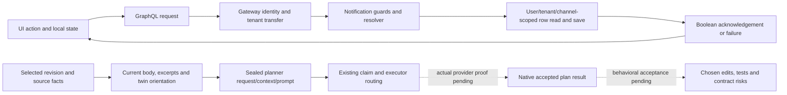

The ARIA-self slice uses [plan_body_from_state](../../aria-kernel/aria_kernel/plan_convergence.py),
[run_convergence_drainer](../../aria-kernel/aria_kernel/convergence_drainer.py),
[planner_dispatch_hook](../../aria-kernel/aria_kernel/planner_dispatch_hook.py) and
[plan_convergence_bridge](../../aria-kernel/aria_kernel/plan_convergence_bridge.py). A stored
request is only delivery. Acceptance requires the actual provider result to reach the same
plan/revision and change the chosen edit/test set. The planner hook launches the existing CI
executor with a native inherited claim; its historical Claude header does not choose a provider.
Codex-only readiness must cover planning and independent judging as well as implementation. Runtime
owns that routing; this milestone adds no dispatcher.

An available committed blob must supply its own bytes, even when working files change or disappear.
Unavailable selected objects must produce an explicit skip, never a working-file substitution. Old
sealed requests stay historical and byte-identical. After a relevant commit/refresh, a fresh plan
must use the new source or state the evidence gap. Two differing prompts are not evidence of correct
planning: a distinct evaluator must check the actual returned plan's edit surfaces, validation
commands and contract/migration risks against expectations inaccessible to the model session. This
controlled planning comparison is not an undisclosed-solution learning trial or measured learning
gain.

Freshness has separate consumers. The existing `twin._qualified_twin_context` reobserves the named
pilot's selected content and directory membership when minting a new request. A changed target
revision, missing input or changed scope yields `unknown` and no qualified feature bodies; mint does
not silently rebuild. The cycle's discovery and twin-refresh owners produce the next observation.
Existing native tests cover working edits, configuration refresh, new membership and
committed-target change while preserving the original request/context/prompt ledger prefixes. Their
scope is the named pilot, not complete cross-layer behavioral knowledge. Committed excerpts now read
the request's selected Git bytes directly. Dispatch-time task-revision binding and the actual
planner's response to changed evidence remain acceptance requirements in the runtime and flow lanes;
stored target metadata alone does not prove them.

Current isolated execution: the three source-binding methods passed with two subtests in 23.42
seconds; thirteen existing excerpt/discovery/literal v1–v4 replay methods passed separately in 18.76
seconds, on unchanged source identity
`f04f073f84d1e2772ad00a1fc8bff4ebee761084eb2ad98efd6ad4398b5b9a65`. These are sixteen distinct
methods across two runs. The actual 97-signature observer preserved all 966 root names and 1,579
ordered exports; only the private mint helper's optional `target_sha` argument changed. A different
author reviewed the causal source and test oracles. No model planning result, independent semantic
verdict or learned utility is claimed by these executions.

The addressable entries below bind the changed source and tests. They record targeted review scope;
broader per-file manual reading remains incomplete. Full snapshots and exact native/test receipts
live in the current execution register's flow evidence location.

#### aria-kernel/aria_kernel/snapshot.py

Purpose: Selected-source reader. Source SHA256: `974e0c6d09b8df4e49ee021f1f89284ec443d6634fc62c57541edaa04146bd5d`.

Private committed metadata and blob readers share the existing Git transport and allowance.
Discovery retains its known-size read; excerpt mint obtains bounded size first. Reads selected Git
objects, writes no state. Callers: twin qualification and evidence excerpt packing.

Evidence/review limit: Native selected-source and metadata/body boundary controls passed, including
exact versus insufficient shared allowance. The real committed discovery consumer passed in the
separate compatibility selection. Targeted changed-owner review, not full-file semantic review or a
rerun of all transport tests.

#### aria-kernel/aria_kernel/evidence_excerpts.py

Purpose: Quoted evidence packing. Source SHA256: `9463ab93a3fc9f3b8f96c7f5e9bd489f755f6f9ee96e03bb74ffe5e84dc3fc3e`.

Public working-file API retains its signature and behavior. A private common packer quotes committed
input for pinned requests, preserves order/line/output limits, and emits explicit unavailable
entries. Full-file hash/size/commit are source provenance; excerpt hash remains the quoted-byte
digest.

Evidence/review limit: Original native RED14.17s reproduced working bytes at a different selected
commit. The unchanged original method and availability/budget controls passed in the three-method
run. Existing working-reader, line/output cap and literal replay controls passed separately. The
original failure remains historical evidence.

#### aria-kernel/aria_kernel/agent_invocations.py

Purpose: Native mint and sealed context. Source SHA256: `8be4c3029c075ff52763da42d4b85bcc36e90f5ba27f940e119727874aac2e41`.

Mint forwards target_sha into the existing excerpt owner after its existing sealed-request return.
Stored request/context/prompt and final budget audit remain the authorities for replay; no
claim-time source refresh. Planning, implementation and judge mint consumers share this input
boundary.

Evidence/review limit: Actual current-body drainer request, native context/prompt/audit joins and
selected source bytes passed; stored old requests remain immutable. Full role/provider execution,
dispatch-time revision qualification and all-file review remain separate.

The integrated native merge consumer also reuses the extracted
`_verify_invocation_context_binding_rows`; the public verifier retains its existing early refusal
and tools-index behavior. `claim_request` now checks implementation scope through
`_implementation_scope_conflict` inside the existing claims transaction. The same helper serves
merge capture using native results, prepared submissions, release and heartbeat expiry. Exact path
or directory overlap refuses; other roles keep their admission contract. A prepared submission
retains ownership until its native result. These claim and result consumers are reviewed additions
over the isolated excerpt-test source; their connected execution is pending. The separate isolated
lifecycle controls and normal-caller results are documented in [native pre-merge
binding](#native-pre-merge-context-and-implementation-binding).

#### aria-kernel/tests/test_evidence_excerpts.py

Purpose: Source and packing regression tests. Source SHA256: `8661860f448d329def7c28440244c4aa7926f478f07ea9d9492abd313b061af9`.

Adds actual committed discovery/current-plan/drainer quotation coverage, native old-commit
availability and a real Git metadata/body allowance control. Existing public working reader, excerpt
hash, caps and replay tests remain literal unchanged.

Evidence/review limit: First new method failed at the genuine different-source assertion after
native prerequisites, then passed unchanged. All three added methods and two subtests now pass;
thirteen unchanged compatibility methods pass separately. No model reply or planner choice is
supplied by these tests.

### Connected candidate: cycle and retained-evidence consumers

The root-owned integration checkout combines reviewed increments with the preserved accepted central
baseline. Each native trial must record this one complete source identity and actual module origins,
separately from the task Git revision. Isolated successes remain historical prerequisites until the
connected candidate executes the selected consumers. No branch/index reset or whole-file replacement
removes inherited R1 evidence readers.

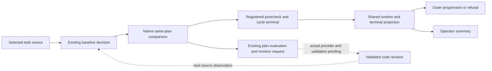

A repeated cycle cannot forgive an unresolved comparison by replacing its baseline. A clean
postcheck resolves that observation; it is not by itself the native change-validation matrix. Old
native rows retain their source meaning. The retained-reference and hot-log readers are catalogued
in [runtime evidence and retention](./catalogue-runtime-retention.md); targeted existing continuity
controls will run on this connected revision.

#### aria-kernel/aria_kernel/architecture_spine_gate.py

Source SHA256: `a096f44e3018d398c395124c438abfe9e6de1dd1a140bb1fbca7e6cddb807699`.

Owns source invariant measurement and native baseline/postcheck evidence. Event-schema comparison
records introduced and removed violation identities while retaining count fallback for historical
inputs. The private cycle-baseline decision reuses the existing same-plan governance readers and
preserves an unresolved baseline hash; missing or replaced anchors remain unavailable. The private
plan projection now carries that same selected postcheck, baseline hash and regression descriptors
into plan evaluation. It reads source/native history and appends through the existing governance
owner. The cycle and plan evaluator are its production consumers.

Evidence/review boundary: Original identity regression, clean comparison, legacy comparator and
later-cycle retention controls exercised this owner in isolated runs. The corrective-consumer
selection subsequently passed seven methods with two subtests in 212.27 seconds; five unchanged
compatibility methods passed separately in 72.99 seconds. Changed producers/readers were peer
reviewed; wider file reading remains partial. Connected candidate execution, actual model repair and
native source-validation linkage remain open.

#### aria-kernel/aria_kernel/plan_convergence.py

Source SHA256: `62bee05d16de7ccf432c9ab7555adec8c9c224043235a011233a4ff75c7d4f9f`.

The existing evaluator consumes the same-plan spine observation after its existing critic and
coverage decision. An unresolved regression enters the existing next-round path below the round cap
and human-required path at the cap. Existing stronger human-required reasons remain intact. No
comparison history preserves the old behavior; incomplete or inconsistent selected evidence stays
unavailable. The native plan-evaluated event records the gate facts; no second lifecycle or queue is
introduced.

Evidence/review boundary: The real controller RED reached an incorrect converged decision. The
unchanged oracle and complementary controls now pass in the separate seven-method run. Targeted
evaluator/consumer review is complete; whole-file reading and actual autonomous repair are not
claimed.

#### aria-kernel/aria_kernel/plan_round_controller.py

Source SHA256: `d8bfb4420c1ac384983880109b2641c243400485c3a3ec1e9a07d5533f8b01d0`.

The existing round controller carries the evaluator's captured observation into its native primary
request. Request deduplication, legal revision states and the existing bounded rounds remain the
owners of retry. The current plan and native postcheck hashes travel together; terminal plans are
not reopened.

Evidence/review boundary: Actual persisted request/context/prompt and plan joins passed in the
isolated seven-method selection. The five-method compatibility run preserves the existing
omitted-root and clean review paths. This entire controller was read; no provider executed in these
fixtures.

#### aria-kernel/aria_kernel/convergence_drainer.py

Source SHA256: `352b4cb9c5444ef2207d0394dca1f2500280e29f58886f738b48a2ab11bdfc8c`.

The real reviewed-state phase forwards the same captured facts through existing `must_satisfy`,
drainer persistence and the primary-plan bridge. A later evaluation replaces or clears that
obligation. Independent challenger context and existing legal-state guards are preserved; this owner
does not reconstruct a second decision from prompt text.

Evidence/review boundary: Native drainer request, persistence and sealed context assertions passed
in the isolated seven-method run; an existing cross-cycle terminal control passed in the separate
five-method run. Changed phases and bridge/persistence callers were reviewed; wider file reading
remains partial.

#### aria-kernel/tests/test_plan_convergence.py

Source SHA256: `0471995f20bfc1e3d5a3ab053671f79335a0b0d8f60f27c8ceee02af29665cc0`.

Added ordinary fixtures connect real source comparisons, plan/critique events, controller requests
and drainer persistence. They cover unresolved history, unavailable anchors, round limits, stronger
refusal, unrelated plans and legal source restoration followed by a clean postcheck. Earlier methods
are preserved. Seven methods plus two subtests passed in 212.27 seconds, and five existing methods
passed separately in 72.99 seconds on the same isolated source. These are twelve distinct methods
across two runs, not a combined execution.

Evidence/review boundary: Different authors reviewed actual test bodies and reached oracles. Reviews
use declared native critique inputs, and source restoration is a fixture edit. Neither is a
model-authored repair or native change-validation proof. The existing
validation-matrix/command-admission connection remains a required next boundary; gates are not
bypassed by a clean static comparison.

#### aria-kernel/aria_kernel/cycle.py

Source SHA256: `3f58ab780dccbad18521836980485ba7aee0d7e06251db164539dd6f8f2f8b76`.

Owns registered phase sequencing and native cycle terminal results. Its architecture baseline
invokes the existing spine decision; its postcheck turns observed regressions into phase failure.
Runtime execution status remains distinct from the cycle terminal result. It reads workspace and
tools state, invokes existing phase owners and writes native cycle records; the outer orchestrator
consumes its result.

Evidence/review boundary: The isolated actual regression/clean pair and two legacy progression
controls passed. A later three-cycle fixture preserves an unrepaired obligation and accepts a
declared repair plus clean postcheck. This does not prove a model produced or validated the edit,
nor default outer plan enrollment. Changed phase and terminal paths were reviewed; full-file reading
remains partial.

#### aria-kernel/aria_kernel/autonomy_orchestrator.py

Source SHA256: `4825fbc1195f273fe30515f05064a5ede67badfb8d89746cbba1f719606034dd`.

Owns outer cycle progression, planner/worker dispatch ordering and result reporting. It consumes the
shared runtime_artifacts projection before counting a completed cycle or deciding whether to
continue. The existing explicit continue-on-failure option remains an operator decision and does not
rewrite failed evidence. Native result fields and downstream planner/worker owners remain separate.

Evidence/review boundary: Six isolated methods with eight subtests passed, including actual
failed/clean cycle results, declared legacy result shapes and explicit continuation. The native
fixtures bind a plan through the existing runner seam and substitute downstream dispatch. Root
reviewed the causal owner and all added tests; automatic repair, real provider and connected
execution remain unproven.

#### aria-kernel/tests/test_architecture_spine_gate.py

Source SHA256: `1b4e1bf420f253c9ddecb50dd4498fb996649af46a0bd723c722c19881f2f626`.

Tests the existing spine producers, comparison and native governance rows. Added event identity
controls distinguish an equal-count swap from no drift, empty/restored identities and historical
count fallback. Pytest/unittest is the caller; only disposable source and native test roots are
written.

Evidence/review boundary: Original equal-count RED and the four-method producer/comparator selection
reached real native assertions; complementary controls are not additional reproduced defects.
Existing affected compatibility was separately selected. New method/helper review is complete; the
whole historical file is not re-certified by integration.

#### aria-kernel/tests/test_enterprise_cycle.py

Source SHA256: `1999a771cd39cbe0113ea0415b734b37db399b5ec95a95a41ce1b71ff33e0d91`.

Tests registered cycle phases and terminal propagation. Added ordinary source regressions, clean
paths and later-cycle controls use real Git/native evidence owners. A declared edit is applied
through the existing test seam, never presented as model work. Followups check same-plan anchor
retention, source repair, unrelated plans and the existing five-regression escalation.

Evidence/review boundary: The original subsequent-cycle RED failed at lost regression. The
four-method candidate produced three passes and one new oracle failure; the separately corrected
fresh-observation control passed in 28.72 seconds with unchanged production. No combined four-method
GREEN is claimed. Exact old test bodies remain preserved; connected selection is pending.

#### aria-kernel/tests/test_autonomy_orchestrator.py

Source SHA256: `02d21b1ea2e550a603ec73874a04a5401c1e6fc877f8e600f6b07df51dde7185`.

Tests actual outer consumption of cycle terminal results and operator summary consistency. Added
fixtures run real cycle/source/ledger work before the progression oracle, while downstream
planner/worker collaborators are substituted. Declared legacy result shapes and explicit continue
policy cover the existing caller contract.

Evidence/review boundary: The unchanged negative and clean controls plus complementary/legacy
selection passed six methods with eight subtests in 227.31 seconds on isolated source. Tests
demonstrate result consumption, not an actual implementation/judge or full autonomous loop. Added
test bodies and dependencies received different-author review.

## Authority Chain / Yetki Zinciri

### EN

ARIA is governed by a fail-closed authority chain. Executable code and machine-checked contracts are normative; this document explains that system but does not replace the live authority in `CURRENT_STATE.md`.

### TR

ARIA kapalı-hata veren bir yetki zinciriyle yönetilir. Çalıştırılabilir kod ve makineyle kontrol edilen sözleşmeler normatiftir; bu doküman sistemi açıklar ama `CURRENT_STATE.md` dosyasındaki canlı otoritenin yerine geçmez.

### Executable Links / Çalıştırılabilir Bağlantılar

| Claim | Code/Test authority | Why it matters |
|---|---|---|
| Live human-readable authority | [docs/aria/CURRENT_STATE.md](./CURRENT_STATE.md) | Runtime claims must defer to the current state index. |
| CLI surface | [aria-kernel/aria_kernel/cli.py](../../aria-kernel/aria_kernel/cli.py) | Public runtime entry points are defined in code. |
| Runtime profile authority | [aria-kernel/aria_kernel/runtime_profile.py](../../aria-kernel/aria_kernel/runtime_profile.py) | Write permission is profile-bound. |
| SSoT invariant | [tests/invariants/aria-doc-runtime-ssot.spec.ts](../../tests/invariants/aria-doc-runtime-ssot.spec.ts) | Stale runtime prose is test-blocked. |

### Diagram / Diyagram

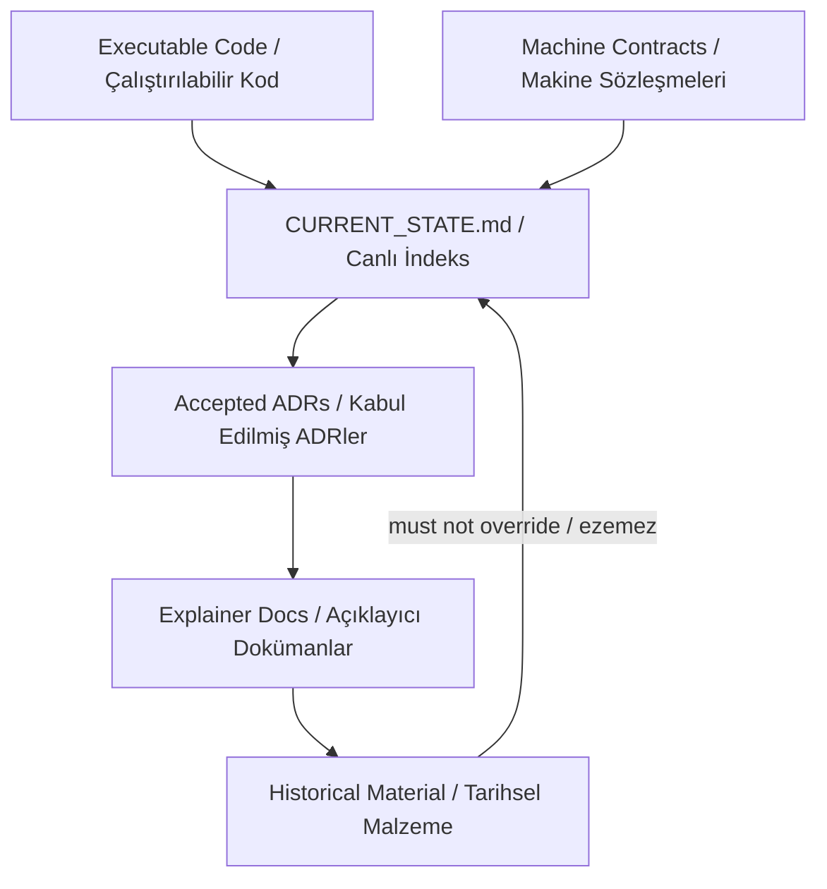

## Main Value / Ana Değer

### EN

ARIA's main contribution is not replacing Aqua's tests or reviewers. It turns distributed tenant, schema, event, CI, finding, and debt rules into a repo-aware evidence, memory, pressure, triage, and validation control plane.

### TR

ARIA'nın ana katkısı Aqua testlerinin ya da reviewerların yerine geçmek değildir. Dağınık tenant, schema, event, CI, finding ve debt kurallarını repo şeklini bilen evidence, memory, pressure, triage ve validation kontrol düzlemine çevirir.

### Executable Links / Çalıştırılabilir Bağlantılar

| Claim | Code/Test authority | Why it matters |
|---|---|---|
| Aqua risk adapters are known but gated | [aria-kernel/aria_kernel/adapter_portfolio.py](../../aria-kernel/aria_kernel/adapter_portfolio.py) | Tenant, schema, event, CQRS, outbox, and NATS surfaces are named capability lanes. |
| Risk becomes pressure | [aria-kernel/aria_kernel/pressure.py](../../aria-kernel/aria_kernel/pressure.py) | ARIA prioritizes stale beliefs, contradictions, health violations, and findings. |
| Pressure becomes triage | [aria-kernel/aria_kernel/triage.py](../../aria-kernel/aria_kernel/triage.py) | High-risk domains default to review or human-only handling. |
| Validation is structured | [aria-kernel/aria_kernel/validation_matrix_gate.py](../../aria-kernel/aria_kernel/validation_matrix_gate.py) | Claims must map to required validation evidence. |

### Diagram / Diyagram

```mermaid
flowchart LR
  Aqua["Aqua Rules / Aqua Kuralları"]
  Repo["Repo Shape / Repo Şekli"]
  Evidence["Evidence / Kanıt"]
  Memory["Memory / Hafıza"]
  Pressure["Pressure / Baskı"]
  Triage["Triage / Sınıflandırma"]
  Validation["Validation / Doğrulama"]
  Report["Report or PR / Rapor veya PR"]

  Aqua --> Repo
  Repo --> Evidence
  Evidence --> Memory
  Memory --> Pressure
  Pressure --> Triage
  Triage --> Validation
  Validation --> Report
```

## Repo-Shape Acquisition / Repo Şeklini Edinme

### EN

ARIA learns the repository shape mechanically from committed snapshots, file fates, fingerprints, service maps, package markers, Nx markers, migration counts, web module markers, and feedback path mapping.

### TR

ARIA repo şeklini committed snapshot, file fate, fingerprint, service map, package marker, Nx marker, migration sayısı, web module marker ve feedback path mapping üzerinden mekanik olarak çıkarır.

### Executable Links / Çalıştırılabilir Bağlantılar

| Claim | Code/Test authority | Why it matters |
|---|---|---|
| Discovery writes snapshot/fates/fingerprint/service map | [aria-kernel/aria_kernel/discovery.py](../../aria-kernel/aria_kernel/discovery.py) | Repo topology enters ARIA through reproducible artifacts. |
| Path feedback becomes capability gaps | [aria-kernel/aria_kernel/feedback.py](../../aria-kernel/aria_kernel/feedback.py) | External reports are mapped back to repo surfaces. |
| Service ownership is later validated | [tests/invariants/_constants.ts](../../tests/invariants/_constants.ts) | Aqua already has invariant-backed surface definitions. |

### Diagram / Diyagram

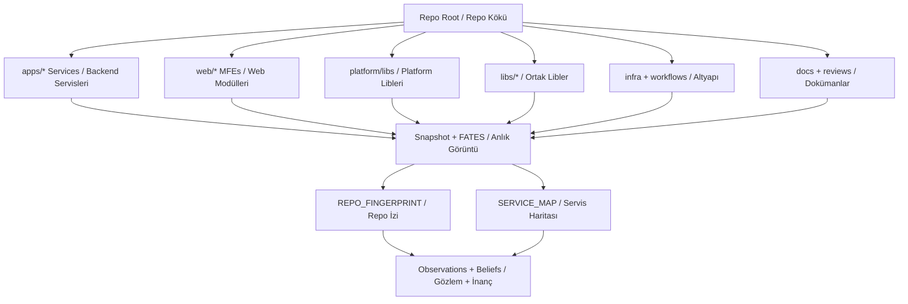

## Memory And State / Hafıza ve Durum

### EN

ARIA memory is ledger-first. Discovery artifacts become observations, observations support beliefs, evidence drift pushes beliefs into revalidation or stale states, and contradictions create pressure for later cycles. ARIA must not use its own generated reports as evidence.

### TR

ARIA hafızası ledger-first çalışır. Discovery artefaktları observation olur, observation kayıtları belief destekler, evidence drift belief kayıtlarını revalidation veya stale durumuna iter, contradiction ise sonraki cycle için pressure üretir. ARIA kendi ürettiği raporları kanıt olarak kullanmamalıdır.

### Executable Links / Çalıştırılabilir Bağlantılar

| Claim | Code/Test authority | Why it matters |
|---|---|---|
| Belief and observation lifecycle | [aria-kernel/aria_kernel/memory.py](../../aria-kernel/aria_kernel/memory.py) | Memory state is append-only and evidence-bound. |
| Write-driving runtime state | [aria-kernel/aria_kernel/state_manifest.py](../../aria-kernel/aria_kernel/state_manifest.py) | State surfaces must be declared before autonomy trusts them. |
| Learning hooks | [aria-kernel/aria_kernel/learning.py](../../aria-kernel/aria_kernel/learning.py) | Feedback and stale state can trigger future skill or agent genesis. |
| Knowledge graph support | [aria-kernel/aria_kernel/knowledge_graph.py](../../aria-kernel/aria_kernel/knowledge_graph.py) | Repo facts can be connected across surfaces. |

### Diagram / Diyagram

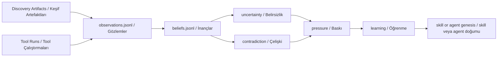

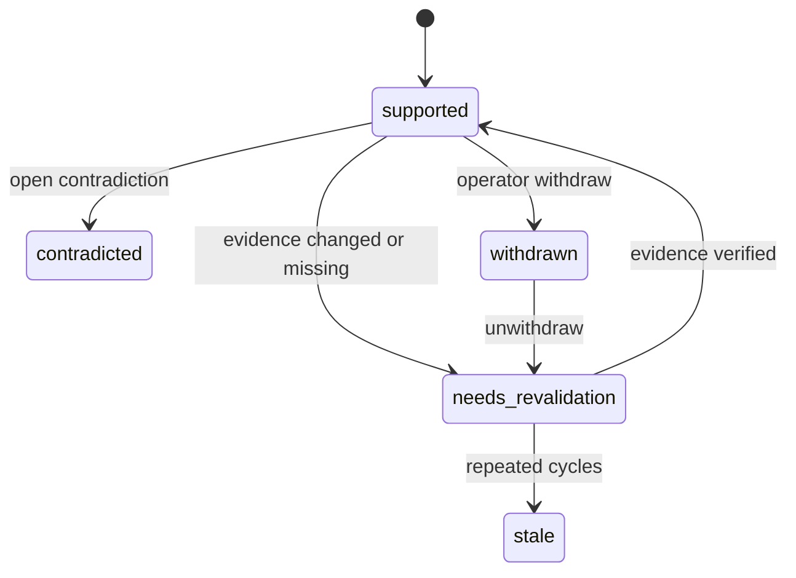

## Decision Making / Karar Verme

### EN

ARIA decides from pressure. If there is no pressure, no plan is synthesized. If a plan exists, primary/challenger/cross-review convergence must pass before implementation, specialist review, worker dispatch, post-implementation review, and any merge path.

### TR

ARIA kararını pressure üzerinden verir. Pressure yoksa plan üretilmez. Plan varsa implementation, specialist review, worker dispatch, post-implementation review ve merge hattından önce primary/challenger/cross-review convergence geçmek zorundadır.

### Executable Links / Çalıştırılabilir Bağlantılar

| Claim | Code/Test authority | Why it matters |
|---|---|---|
| Outer autonomy loop | [aria-kernel/aria_kernel/autonomy_orchestrator.py](../../aria-kernel/aria_kernel/autonomy_orchestrator.py) | Cycle, convergence, review, dispatch, and merge order are coded. |
| Plan content synthesis | [aria-kernel/aria_kernel/plan_synthesizer.py](../../aria-kernel/aria_kernel/plan_synthesizer.py) | Plans come from concrete pressure sources. |
| Convergence state machine | [aria-kernel/aria_kernel/plan_convergence.py](../../aria-kernel/aria_kernel/plan_convergence.py) | Plans cannot silently jump from draft to execution. |
| Cross-review bridge | [aria-kernel/aria_kernel/cross_review_bridge.py](../../aria-kernel/aria_kernel/cross_review_bridge.py) | Agent responses must become legal convergence events. |

### Diagram / Diyagram

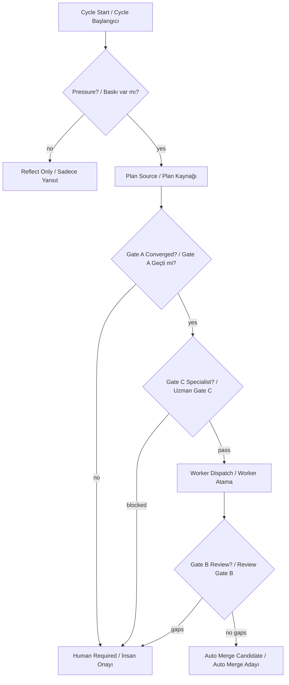

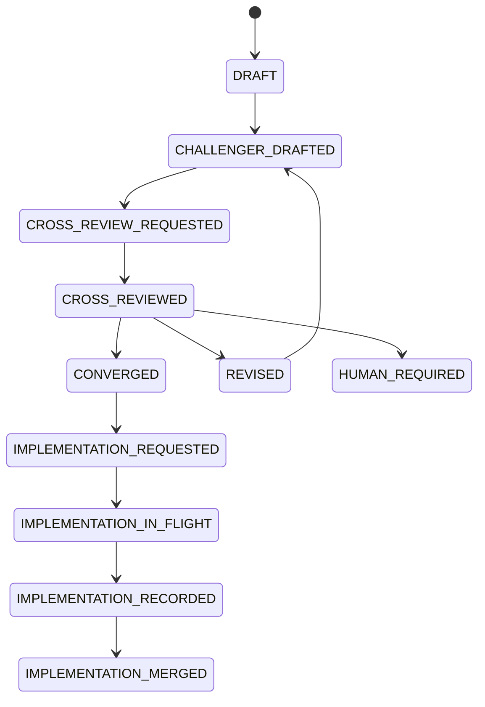

## Skill Writing / Skill Yazımı

### EN

Skill writing is governed genesis, not prompt-only invention. A repeated gap or pattern can create a request, but draft, corpus, sandbox, evidence, approval, registry, shadow, readiness, and promotion gates must pass before active use.

### TR

Skill yazımı prompt-only üretim değildir; yönetişimli genesis akışıdır. Tekrarlayan gap veya pattern request yaratabilir, fakat active kullanımdan önce draft, corpus, sandbox, evidence, approval, registry, shadow, readiness ve promotion gate geçmek zorundadır.

### Executable Links / Çalıştırılabilir Bağlantılar

| Claim | Code/Test authority | Why it matters |
|---|---|---|
| Skill genesis request/draft/materialize | [aria-kernel/aria_kernel/skill_genesis.py](../../aria-kernel/aria_kernel/skill_genesis.py) | Skill files are scoped and approval-gated. |
| Convergent authoring | [aria-kernel/aria_kernel/convergent_skill_authoring.py](../../aria-kernel/aria_kernel/convergent_skill_authoring.py) | Primary/challenger/judge gates reduce hallucinated adapters. |
| Sandbox isolation | [aria-kernel/aria_kernel/skill_genesis_sandbox.py](../../aria-kernel/aria_kernel/skill_genesis_sandbox.py) | Unsafe imports and unsandboxed execution fail closed. |
| Promotion policy | [aria-kernel/aria_kernel/promotion.py](../../aria-kernel/aria_kernel/promotion.py) | SHADOW to ACTIVE requires readiness and operator approval. |

### Diagram / Diyagram

```mermaid
flowchart LR
  Gap["Gap or Pattern / Boşluk veya Pattern"]
  Request["Request / İstek"]
  Draft["Draft / Taslak"]
  Corpus["Corpus + Fixtures / Korpus + Fixture"]
  Sandbox["Sandbox / Kum Havuzu"]
  Approval["Operator Approval / Operatör Onayı"]
  Materialize["Materialize / Yazıya Geçir"]
  Registry["Registry / Kayıt"]
  Shadow["SHADOW / Gölge"]
  Active["ACTIVE / Aktif"]

  Gap --> Request
  Request --> Draft
  Draft --> Corpus
  Corpus --> Sandbox
  Sandbox --> Approval
  Approval --> Materialize
  Materialize --> Registry
  Registry --> Shadow
  Shadow --> Active
```

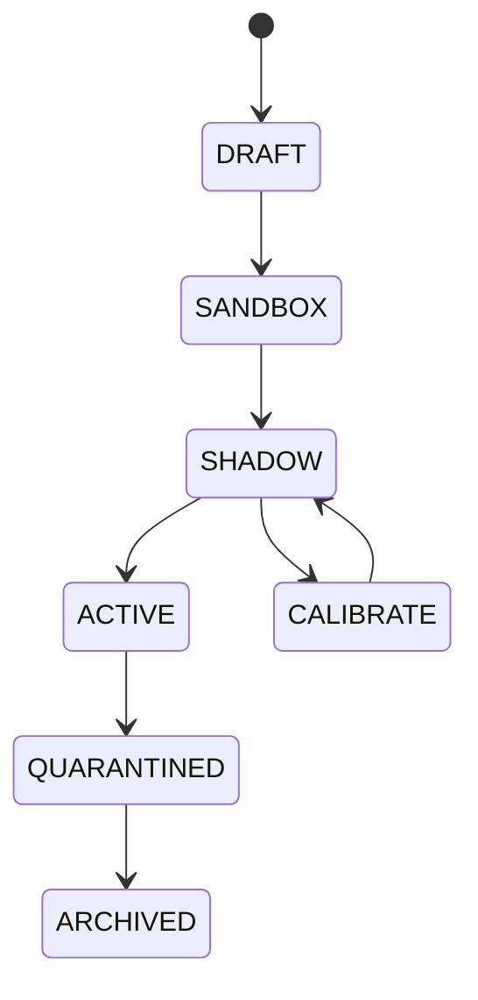

## Agent Writing / Agent Yazımı

### EN

Agent writing starts from a capability gap and becomes an `aria-*` draft intent. Materialization is gated by fixtures, sandbox proof, approval, target path containment, and response contracts. Invocation uses append-only requests, lease tokens, evidence validation, and satisfaction matrices.

### TR

Agent yazımı capability gap ile başlar ve `aria-*` draft intent kaydına dönüşür. Materialization; fixture, sandbox proof, approval, target path containment ve response contract ile sınırlandırılır. Invocation append-only request, lease token, evidence validation ve satisfaction matrix kullanır.

### Executable Links / Çalıştırılabilir Bağlantılar

| Claim | Code/Test authority | Why it matters |
|---|---|---|
| Agent genesis | [aria-kernel/aria_kernel/agent_genesis.py](../../aria-kernel/aria_kernel/agent_genesis.py) | Agent birth is approval and sandbox gated. |
| Agent role SSoT | [aria-kernel/aria_kernel/agent_surface.py](../../aria-kernel/aria_kernel/agent_surface.py) | Roles, targets, lifecycle labels, and pairings are centralized. |
| Request/response contract | [aria-kernel/aria_kernel/agent_contract.py](../../aria-kernel/aria_kernel/agent_contract.py) | Responses must satisfy exact scope and evidence rules. |
| Invocation ledger | [aria-kernel/aria_kernel/agent_invocations.py](../../aria-kernel/aria_kernel/agent_invocations.py) | Claims, leases, heartbeats, and results are append-only. |

### Diagram / Diyagram

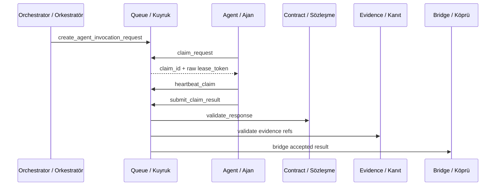

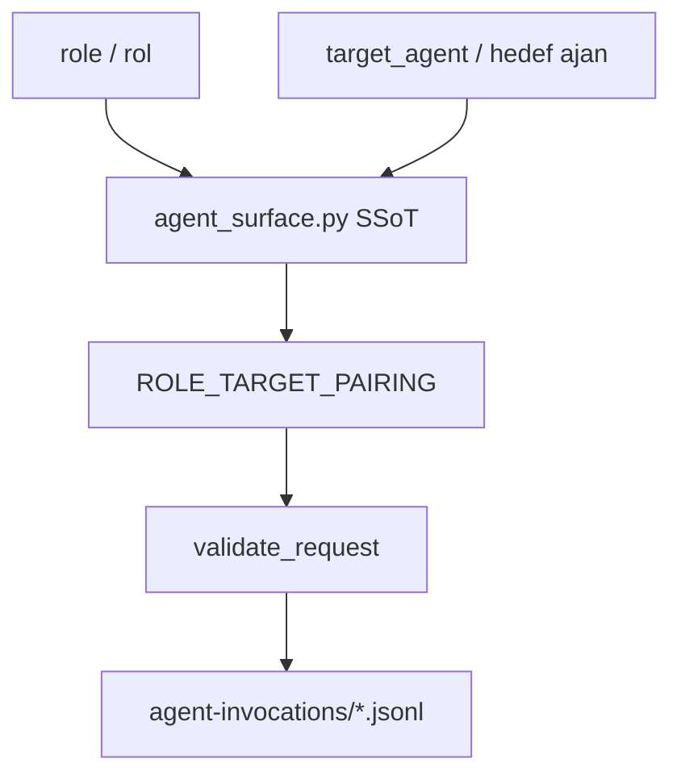

## Bug Finding / Hata Bulma

### EN

ARIA treats bug-like signals as evidence-bound findings, feedback, pressure, and debt. Tool findings are not automatically operator findings; promotion to `aria-findings/F-*.json` needs provenance, severity, evidence shape, and banned-phrase checks. Debts are explicit follow-ons with owner and due-date discipline.

### TR

ARIA bug benzeri sinyalleri evidence-bound finding, feedback, pressure ve debt olarak işler. Tool finding otomatik olarak operatör finding değildir; `aria-findings/F-*.json` seviyesine çıkmak için provenance, severity, evidence shape ve banned-phrase kontrolü gerekir. Debt kayıtları owner ve due-date disiplini olan açık follow-on kayıtlardır.

### Executable Links / Çalıştırılabilir Bağlantılar

| Claim | Code/Test authority | Why it matters |
|---|---|---|
| Finding emission | [aria-kernel/aria_kernel/finding.py](../../aria-kernel/aria_kernel/finding.py) | Operator-facing findings have severity and evidence gates. |
| Debt emission | [aria-kernel/aria_kernel/debt.py](../../aria-kernel/aria_kernel/debt.py) | Debts require owner, due date, verified source finding, and no auto-close. |
| Evidence validation | [aria-kernel/aria_kernel/evidence_validator.py](../../aria-kernel/aria_kernel/evidence_validator.py) | Missing files, bad lines, self-output refs, and scope escapes are rejected. |
| Finding registry invariant | [tests/invariants/finding-registry-integrity.spec.ts](../../tests/invariants/finding-registry-integrity.spec.ts) | Registry shape and hash-chain integrity are checked. |

### Diagram / Diyagram

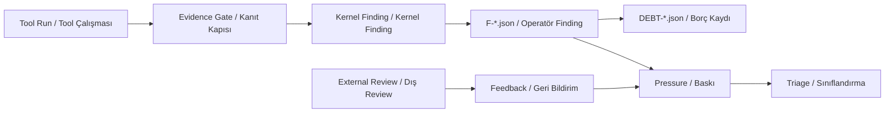

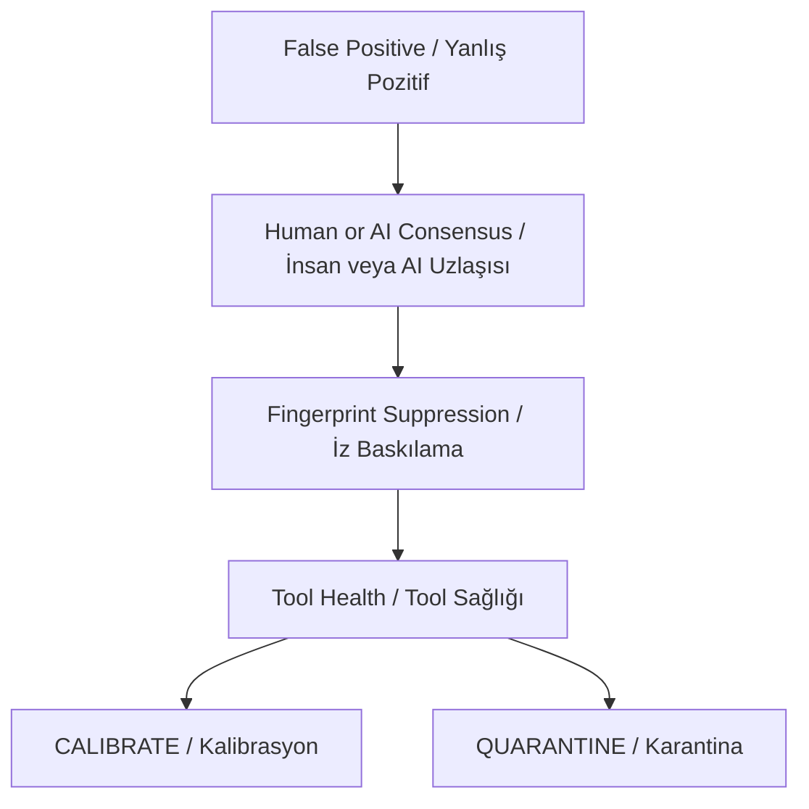

## Aqua Risk Maps / Aqua Risk Haritaları

### EN

ARIA is most valuable when it makes Aqua's existing risk rules visible and repeatable: tenant isolation, schema drift, CQRS/outbox/event consistency, and CI/supply-chain controls.

### TR

ARIA en çok Aqua'nın mevcut risk kurallarını görünür ve tekrarlanabilir yaptığında değer üretir: tenant isolation, schema drift, CQRS/outbox/event consistency ve CI/supply-chain kontrolleri.

### Executable Links / Çalıştırılabilir Bağlantılar

| Claim | Code/Test authority | Why it matters |
|---|---|---|
| Tenant-scoped repository | [libs/backend-common/src/database/tenant-scoped-repository.ts](../../libs/backend-common/src/database/tenant-scoped-repository.ts) | Repository access must stay tenant-aware. |
| Tenant transaction schema pinning | [libs/backend-common/src/database/tenant-transaction.ts](../../libs/backend-common/src/database/tenant-transaction.ts) | Transaction search path is a tenant boundary. |
| Schema manager | [libs/backend-common/src/database/schema-manager.service.ts](../../libs/backend-common/src/database/schema-manager.service.ts) | Platform and tenant schemas are coordinated. |
| Outbox publisher | [platform/libs/outbox/src/outbox-publisher.service.ts](../../platform/libs/outbox/src/outbox-publisher.service.ts) | Domain events should pass through transactional outbox. |
| NATS event bus | [platform/libs/event-bus/src/nats/nats-event-bus.ts](../../platform/libs/event-bus/src/nats/nats-event-bus.ts) | Tenant subjects and event emission rules are runtime concerns. |
| Workflow SHA pin invariant | [tests/invariants/aria-workflow-sha-pin.spec.ts](../../tests/invariants/aria-workflow-sha-pin.spec.ts) | CI supply-chain posture is checked. |

### Diagram / Diyagram

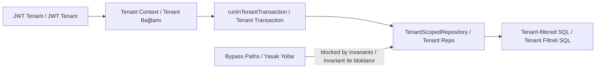

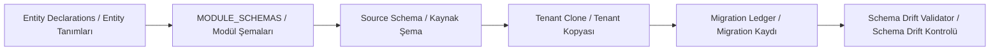

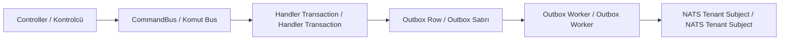

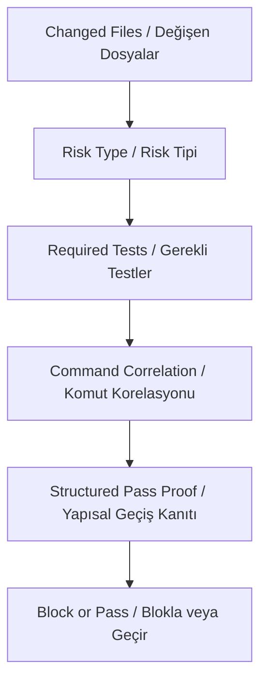

## Runtime And Safety / Çalışma Zamanı ve Güvenlik

### EN

ARIA live autonomous execution is Claude Code CLI based. Promotion evidence must be artifact-bearing, hash-bound, path-contained, indexed, and connected to cycle/run ledgers. Lifecycle-only cycles do not authorize promotion.

### TR

ARIA canlı autonomous execution Claude Code CLI tabanlıdır. Promotion evidence artifact-bearing, hash-bound, path-contained, indexed ve cycle/run ledger bağlantılı olmalıdır. Lifecycle-only cycle promotion yetkisi vermez.

### Executable Links / Çalıştırılabilir Bağlantılar

| Claim | Code/Test authority | Why it matters |
|---|---|---|
| Claude runtime | [tools/aria-poc/claude_runtime.py](../../tools/aria-poc/claude_runtime.py) | Runtime calls are Claude Code CLI mainline. |
| CI executor | [tools/aria-poc/ci_executor.py](../../tools/aria-poc/ci_executor.py) | CI execution path is explicit. |
| Worker executor | [tools/aria-poc/worker_executor.py](../../tools/aria-poc/worker_executor.py) | Worker execution path is explicit. |
| Artifact graph | [aria-kernel/aria_kernel/runtime_artifacts.py](../../aria-kernel/aria_kernel/runtime_artifacts.py) | Promotion proof is graph and hash bound. |
| Artifact safety | [aria-kernel/aria_kernel/artifact_safety.py](../../aria-kernel/aria_kernel/artifact_safety.py) | Runtime artifacts must stay inside safe boundaries. |
| Enterprise observe burn-in | [aria-kernel/aria_kernel/burn_in.py](../../aria-kernel/aria_kernel/burn_in.py) | 20-30 observe cycles prove discovery, memory, pressure, and triage without agent/tool/PR action. |
| Burn-in SSoT | [docs/aria/ENTERPRISE_AUTONOMY_SSOT.md](./ENTERPRISE_AUTONOMY_SSOT.md) | Enterprise autonomy gates and acceptance matrix are documented separately. |
| Auto merge evaluator | [aria-kernel/aria_kernel/auto_merge.py](../../aria-kernel/aria_kernel/auto_merge.py) | Readiness evaluation remains low-level; real merge is delegated to the authority wrapper. |
| Auto merge authority | [aria-kernel/aria_kernel/merge_authority.py::merge_pr_if_ready](../../aria-kernel/aria_kernel/merge_authority.py) | Real merge is fail-closed and authority-wrapper-bound. |

### Diagram / Diyagram

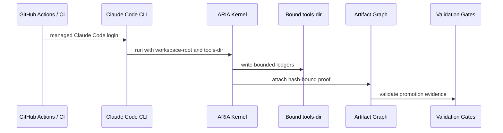

```mermaid
flowchart LR
  BurnIn["autonomy burn-in observe"]
  Discovery["Discovery"]
  Memory["Memory"]
  Pressure["Pressure"]
  Triage["Triage"]
  Blocked["No Agent/Tool/PR Action"]
  Report["Schema-bound Report"]

  BurnIn --> Discovery
  Discovery --> Memory
  Memory --> Pressure
  Pressure --> Triage
  Triage --> Blocked
  Blocked --> Report
```

```mermaid
flowchart LR
  Observe["observe / gözlem"]
  Standard["standard / standart"]
  Strict["strict / sıkı"]
  Frozen["frozen / dondurulmuş"]
  Autonomous["autonomous / otonom"]
  WriteGate["Write Gate / Yazma Kapısı"]
  Human["Human Required / İnsan Onayı"]

  Observe --> Standard
  Standard --> Strict
  Strict --> Frozen
  Strict --> Autonomous
  Autonomous --> WriteGate
  WriteGate --> Human
```

## Historical Docs And Runbooks / Tarihsel Dokümanlar ve Runbook'lar

### EN

Historical snowball, Claude Code, Anthropic, and `llm_bridge.py` language is design history or compatibility material unless the current executable contracts reaffirm it. It must not be read as current runtime authority.

### TR

Tarihsel snowball, Claude Code, Anthropic ve `llm_bridge.py` dili, güncel executable contract tekrar doğrulamadıkça tasarım geçmişi veya uyumluluk malzemesidir. Güncel runtime otoritesi gibi okunmamalıdır.

### Executable Links / Çalıştırılabilir Bağlantılar

| Claim | Code/Test authority | Why it matters |
|---|---|---|
| Current runtime authority | [docs/aria/CURRENT_STATE.md](./CURRENT_STATE.md) | Stale runtime claims must defer to the live index. |
| Historical stale-term invariant | [tests/invariants/aria-doc-runtime-ssot.spec.ts](../../tests/invariants/aria-doc-runtime-ssot.spec.ts) | Historical docs must carry authority notices. |
| Historical smoke runbook | [docs/runbooks/aria-v3-1-smoke.md](../runbooks/aria-v3-1-smoke.md) | This runbook is compatibility material, not live authority. |
| Historical GitHub App runbook | [docs/runbooks/aria-github-app-setup.md](../runbooks/aria-github-app-setup.md) | Its snowball branch-protection instructions are not current authority. |

### Diagram / Diyagram

```mermaid
flowchart TD
  OldDoc["Old Doc / Eski Doküman"]
  Stale{"Stale Runtime Term? / Eski Runtime Terimi?"}
  Notice["Notice Required / Uyarı Gerekli"]
  Current["CURRENT_STATE.md / Canlı Otorite"]
  Defect["Documentation Defect / Dokümantasyon Hatası"]

  OldDoc --> Stale
  Stale -->|yes| Notice
  Stale -->|no| Current
  Notice --> Current
  OldDoc -->|no notice / uyarı yok| Defect
```

## Executable Anchor Matrix / Çalıştırılabilir Dayanak Matrisi

### EN

This matrix keeps the explanatory diagrams tied to code. The core anchors below are inherited from `CURRENT_STATE.md` and should be updated there first when runtime authority changes.

### TR

Bu matris açıklayıcı grafikleri koda bağlı tutar. Aşağıdaki ana dayanaklar `CURRENT_STATE.md` dosyasından gelir; runtime otoritesi değişirse önce orası güncellenmelidir.

### Executable Links / Çalıştırılabilir Bağlantılar

| Surface | Authority |
|---|---|
| CLI | [aria-kernel/aria_kernel/cli.py](../../aria-kernel/aria_kernel/cli.py) |
| Runtime profile | [aria-kernel/aria_kernel/runtime_profile.py](../../aria-kernel/aria_kernel/runtime_profile.py) |
| State manifest | [aria-kernel/aria_kernel/state_manifest.py](../../aria-kernel/aria_kernel/state_manifest.py) |
| Tool registry | [aria-kernel/aria_kernel/tool_registry.py](../../aria-kernel/aria_kernel/tool_registry.py) |
| Runtime artifacts | [aria-kernel/aria_kernel/runtime_artifacts.py](../../aria-kernel/aria_kernel/runtime_artifacts.py) |
| Tool health | [aria-kernel/aria_kernel/tool_health.py](../../aria-kernel/aria_kernel/tool_health.py) |
| Runs reader | [aria-kernel/aria_kernel/runs_reader.py](../../aria-kernel/aria_kernel/runs_reader.py) |
| Agent surface | [aria-kernel/aria_kernel/agent_surface.py](../../aria-kernel/aria_kernel/agent_surface.py) |
| Agent contract | [aria-kernel/aria_kernel/agent_contract.py](../../aria-kernel/aria_kernel/agent_contract.py) |
| Ledger primitive | [aria-kernel/aria_kernel/ledger.py](../../aria-kernel/aria_kernel/ledger.py) |
| Auto merge evaluator | [aria-kernel/aria_kernel/auto_merge.py](../../aria-kernel/aria_kernel/auto_merge.py) |
| Merge authority | [aria-kernel/aria_kernel/merge_authority.py::merge_pr_if_ready](../../aria-kernel/aria_kernel/merge_authority.py) |
| CI executor | [tools/aria-poc/ci_executor.py](../../tools/aria-poc/ci_executor.py) |
| Worker executor | [tools/aria-poc/worker_executor.py](../../tools/aria-poc/worker_executor.py) |
| Claude runtime | [tools/aria-poc/claude_runtime.py](../../tools/aria-poc/claude_runtime.py) |
| Artifact safety | [aria-kernel/aria_kernel/artifact_safety.py](../../aria-kernel/aria_kernel/artifact_safety.py) |

### Diagram / Diyagram

```mermaid
flowchart LR
  Docs["Architecture Doc / Mimari Doküman"]
  Current["CURRENT_STATE.md"]
  Code["Runtime Code / Runtime Kod"]
  Tests["Invariant Tests / Invariant Testleri"]
  CI["Workflows / İş Akışları"]

  Docs --> Current
  Current --> Code
  Current --> Tests
  Tests --> CI
  CI --> Code
```

## Known Limits / Bilinen Sınırlar

### EN

ARIA must be described conservatively. SHADOW or scaffolded adapters are controlled capability growth, not mature autonomous detection. Tenant, auth, data, schema, event, migration, infra, workflow, and ARIA runtime changes default to human review. Auto-merge remains disabled or narrowly gated by policy.

### TR

ARIA temkinli anlatılmalıdır. SHADOW veya scaffolded adapterlar kontrollü capability growth anlamına gelir; olgun autonomous detection değildir. Tenant, auth, data, schema, event, migration, infra, workflow ve ARIA runtime değişiklikleri varsayılan olarak human review ister. Auto-merge kapalı veya çok dar policy gate ile sınırlıdır.

### Executable Links / Çalıştırılabilir Bağlantılar

| Limit | Code/Test authority | Why it matters |
|---|---|---|
| Tool promotion is gated | [aria-kernel/aria_kernel/tool_registry.py](../../aria-kernel/aria_kernel/tool_registry.py) | Tools must not silently jump to ACTIVE. |
| Readiness is explicit | [aria-kernel/aria_kernel/readiness.py](../../aria-kernel/aria_kernel/readiness.py) | Precision, fixtures, and false positives matter. |
| Auto-merge is bounded | [aria-kernel/aria_kernel/auto_merge.py](../../aria-kernel/aria_kernel/auto_merge.py) + [aria-kernel/aria_kernel/merge_authority.py::merge_pr_if_ready](../../aria-kernel/aria_kernel/merge_authority.py) | Evaluation and real merge authority are separate. |
| Human-required paths exist | [aria-kernel/aria_kernel/human_required.py](../../aria-kernel/aria_kernel/human_required.py) | Unsafe or ambiguous items stop for operator review. |

### Diagram / Diyagram

```mermaid
flowchart TD
  Candidate["Candidate Action / Aday Aksiyon"]
  Risk{"High Risk? / Yüksek Risk mi?"}
  Shadow{"Shadow Mature? / Shadow Olgun mu?"}
  Evidence{"Evidence Complete? / Kanıt Tam mı?"}
  Human["Human Review / İnsan Review"]
  Narrow["Narrow Automation / Dar Otomasyon"]

  Candidate --> Risk
  Risk -->|tenant/auth/data/schema/event/infra| Human
  Risk -->|docs/tests/tooling| Shadow
  Shadow -->|no| Human
  Shadow -->|yes| Evidence
  Evidence -->|no| Human
  Evidence -->|yes| Narrow
```

## Native pre-merge context and implementation binding

The integrated source now includes the reviewed native context and four-predicate increments.
Connected execution remains pending. The isolated normal runner fixture passes branch-tip,
content-hash, file-scope exclusion and native unwaived plan-coverage checks. Its eight ordinary
subtests include missing observations, changed native state, a live competing claim and release, and
coverage-manifest absence and restoration. Three pre-merge predicates still refuse as unimplemented.
Coverage waiver adjudication and current graph reattestation remain unqualified. No permission, full
readiness, provider execution or remote merge is established.

### aria-kernel/aria_kernel/merge_authority.py

- Entry: [`_capture_pre_merge_context`](../../aria-kernel/aria_kernel/merge_authority.py#L327).
  `merge_pr_if_ready` remains the sole real-merge authority; its final perimeter
  captures the fresh PR observation, workspace root, tools root and diff before
  invoking the existing registry. Missing roots retain explicit refusal.
- SHA256: `ff9d428fa2c2687059be1e47ffd5a189f313b62b03a639cf8b1e4b210efdeb68`.
- Purpose: bind the native repository, PR observation, immutable planned/final
  committed change, current plan revision, snapshot, original implementation
  request and claim, accepted result, sealed response/transcript, implementation
  event, and successful bridge rows. Missing joins remain explicit gaps.
- State owners: existing host binding, ordered transactions, declared ledger
  parser, plan reducer/body, snapshot producer, request/envelope validation,
  response validator, and result bridge. Git and host work occur outside state
  transactions; exact captured bytes are rechecked before returning. At the
  final transaction it observes scope ownership using the invocation owner's
  shared helper, one effective time and those same verified request/claim/result
  rows. The private evidence retains the three ledger tips and any conflicting
  native claim ID/hash. This transaction is not held across remote merge.
- Coverage observer: `_capture_pre_merge_coverage` joins the current adopted
  plan revision to its native round event, exact input and closure-manifest
  bytes/hash, writer-owned report fields and recorded successful witness. The
  planning commit must be a Git ancestor of the observed PR base. File bytes
  are rechecked with the native ledger prefixes. Unavailable artifacts keep a
  local refusal reason without invalidating the other verified observations.
- Coverage limits: the manifest's `inputs_hash` is checked for shape, not
  independently recomputed. Comparing the input file with the adopted plan and
  hashing the manifest do not reattest graph bytes, tool bytes, working-tree
  cleanliness or dependency changes at the implementation tip. Waived coverage
  refuses until its actual critic request/result/artifact chain is verified.
- The change owner admits one final committed event per change. The fixture uses
  two real signed Git commits and one final native event; this corrects the first
  checkpoint's mistaken assumption that multiple committed rows were legal.
- Limits: the existing 16 MiB per-file read bound and full committed snapshot do
  not constitute an aggregate work or latency bound. The diff comparison hashes
  trimmed text under the existing transport convention, not original raw bytes.
  No retained-prefix or cold replay qualification is provided here.
- Manual read: complete merge owner and current increment. Root independently
  reviewed the source, native test, and first context result.

### aria-kernel/aria_kernel/implementation_safety.py

- Entries: [`_PreMergeEvidence`](../../aria-kernel/aria_kernel/implementation_safety.py#L977),
  `HardFailContext`, `_check_branch_tip_lock_and_recheck`, and
  `_check_content_hash_recheck`, `_check_per_file_mutual_exclusion`, and
  `_check_plan_coverage_witness_verified`.
- SHA256: `13c4399797fe17e70aa431b89782ce277f924aa580ef255791975f6a198c7d4a`.
- Purpose: immutable observations and the optional `pre_merge_evidence=None`
  field. The branch predicate compares native commit bindings and current local
  HEAD/source/base refs. The content predicate compares recomputed current plan
  content with the original request and recorded implementation hashes. Neither
  replaces the existing remote expected-head merge check.
- Caller: `run_hard_fail_checks` remains the registry/report owner. File-scope
  exclusion requires the joined implementation and a complete native scope
  observation; a live conflicting claim refuses. The coverage predicate requires
  a bound implementation and native current-plan coverage observations; the
  original v1 plan policy remains coverage-not-required, while v2 requires a
  verified unwaived manifest. Missing coverage or revision mismatches refuse.
  Two bindings remain unimplemented: operator feedback signature and runtime
  budget. Monetary admission must consume the shared runtime policy and actual
  attempt/authentication evidence; none of the live predicates introduces a
  nominal dollar threshold.
- Fifth predicate (2026-09-11), `expert_consensus_evidence_verified`:
  `merge_authority._capture_pre_merge_expert_consensus` reads back the
  `specialist_domain_review` requests the existing producer
  (`expert_review_gate` mint) bound to THIS implementation — by the
  request/claim/result-row/commit/plan-revision identity inside their
  `must_satisfy` binding, not by role alone — takes each request's accepted
  result through the same request/claim/artifact/response verification the
  implementation join uses (sealed output hash, response contract, matrix entry
  id), and hands the panel's `{expert, verdict, confidence, evidence_refs}` to
  the existing `evaluate_expert_consensus` with evidence re-verified at the
  implementation HEAD. `_PreMergeEvidence` carries `expert_request_ids`,
  `expert_result_hashes`, `expert_target_sha`, `expert_distinct_reviewers`,
  `expert_consensus_approved/reason` and `expert_unavailable_reason`; the check
  passes only as `native_final_expert_consensus_verified`, otherwise it names
  the evaluator's reason (`insufficient_reviewers`, `not_unanimous_satisfied`,
  `low_confidence`, `evidence_not_repo_verified`) or the binding gap. The
  response contract now validates roles against `INVOCATION_ROLES` — the set
  the request writer obeys — because the narrower `REQUEST_ROLES` rejected the
  one role the producer mints ("agent-response.role unknown:
  specialist_domain_review"), which is what left the memory lane's
  expert-consumer control red before consensus. Sealed expert artifacts join
  the capture's change-during-capture recheck like the coverage files.
- Manual read: complete file plus changed predicates. The native controls
  include missing workspace/base observations, signed source-branch progression
  with the original commit checked out detached, and a legal plan-owner rejection.
  The stale branch case fails branch verification while content remains valid;
  the later native rejection makes both checks unavailable.

### aria-kernel/aria_kernel/agent_invocations.py — native binding entries

- Entries: `verify_invocation_context_binding`, its private shared row
  comparison `_verify_invocation_context_binding_rows`, `claim_request`, and
  `_implementation_scope_conflict`.
- SHA256: `c7a5846ea95b1940396b96f6434ec1f8e5f23cae11094aad6a79f48abcc987c6`.
- Purpose: keep one existing comparison/error owner for the public verifier and
  captured-row consumer. The public signature, early context refusal, later
  prompt lookup, and normal tools-index behavior are preserved. Capture supplies
  its own verified native rows and does not invoke the public index writer.
- Scope owner: the existing claims transaction refuses overlapping implementation
  scopes before appending a lease. The same private helper serves merge capture;
  it reuses declared-path normalization and native result, prepared-submission,
  release and heartbeat-expiry helpers. Other roles are excluded. Exact path or
  directory-member overlap blocks; adjacent directory names are disjoint.
  A prepared submission retains ownership after expiry until its native result.
  Normal expiry uses the owner's strict `expiry < now` comparison.
- Manual read: changed helper, original public verifier, native request/claim/
  result/artifact owners and their relevant callers. This is not a complete
  manual read claim for the entire agent-invocations module.

### aria-kernel/aria_kernel/auto_merge.py

- Entry: `GhCliGitHubAdapter.get_pr`, called by the existing merge authority.
- SHA256: `362a5fd49445fd58060c6b45201b197ad2cba0d2d6d756d1ad3f9c636a1d4128`.
- Purpose: request native `baseRefOid`, `body`, and `url` alongside the existing
  PR fields and project them without inferred fallback values. The existing
  live GitHub snapshot evaluator and remote expected-head merge check remain.
- Read completeness: changed projection, constructor, transport and downstream
  merge consumers read; this entry does not claim a full-module manual read.

### aria-kernel/aria_kernel/auto_merge_runners.py

- Entry: `RealAutoMergeRunner.__call__`.
- SHA256: `cb10d3657883bfd0e3db43ddddea86b91eb92434644ae6abf1c8e9c5173cf09d`.
- Purpose: forward its existing workspace root into the autonomous authority
  call. The observing branch still calls evaluation with `dry_run=True`.
  Existing profile, watchdog, readiness resolution and item containment remain.
- Read completeness: complete changed class and direct selection callers read;
  other runners in this module are not claimed fully reread.

### aria-kernel/tests/test_merge_authority_pre_merge_perimeter.py

- Entries: `NativePreMergeContextTests`, `NativeImplementationContextTests`, and
  `GitHubPreMergeContextTests` transport control.
- SHA256: `19f828e3cb6885da4b13b2c7b78f8bb597d8c96b1601a9b30ad9d99307605342`.
- Evidence: the first native missing-request test passed in 42.73s after its real
  absent-capability failure. The implementation fixture subsequently reached a
  genuine missing request join (43.00s); after repair, the strengthened method
  passed once in 36.31s, no subtests, stable source `04502433`. Its actual native
  baseline/candidate commands, two signed commits, final event, accepted result,
  exact identities, first two predicates and unchanged native bytes were reached.
- The added call-through writer spy is prospective post-fix coverage: it proves
  that the public verifier invokes the actual index writer and capture does not.
  Source-only extraction findings are not represented as executed failures.
- Earlier failures remain classified separately: unignored dependency symlink,
  a fixture's rejected second committed event, and sandbox Git EPERM. The actual
  successful command fixture does not execute a model or establish runtime use.
- The new runner append preserves every prior native assertion and controls the independent earlier
  authority gates through the existing test helper. It must pass the actual predicates, record a
  perimeter refusal for the remaining checks, and perform no adapter merge. The original caller pair
  failed at missing base projection and absent capture invocation (35.77s), then passed unchanged
  (35.06s, source `804f4f03`). The strengthened pair passed with four ordinary subtests in 167.28s,
  source `f5c3db24`; these are coverage controls, not additional pre-fix REDs. The JSON adapter test
  uses a declared transport substitute, with no live GitHub call. Installed `gh` 2.65.0 local help
  independently lists the three requested fields.
- The subsequent file-scope consumer regression reached its first new positive
  assertion and failed `check_not_implemented` (137.99s). After the shared-owner
  connection, the unchanged native method passed with six subtests (134.43s,
  stable `c2d6af8d`). The actual runner blocks merging while a new overlapping
  native claim is live, reports its exact claim/hash, then clears exclusion after native
  authenticated release. Missing workspace/base and rejected implementation
  remain unavailable. At that historical checkpoint the other four predicates
  prevented every adapter merge.
- Fourth-predicate evidence: the strengthened native method and seven existing
  coverage wrapper controls produced one intended failure and seven passes in
  145.59s. Actual native plan/witness/implementation joins passed before the new
  coverage predicate reported `check_not_implemented`. The unchanged eight then
  passed with eight subtests in 140.42s, stable `8474cc90`. The normal runner
  consumes the exact coverage event/manifest; moving the actual manifest away
  refuses coverage while the other three stay valid, and restoring it clears
  that refusal. Three remaining predicates still prevent every adapter merge.
  Test headers were corrected after this run; all non-docstring AST nodes and
  assertions remain equal to the executed bytes.
- Manual read: complete test file and relevant native fixture owners.

### aria-kernel/tests/test_file_lock_and_claim_idempotency.py

- Entry: `ImplementationScopeClaimTests`; existing lock and source controls remain.
- SHA256: `809a0b319031702e86f363699172d8447bcd7e1e113990c7fa0c501004c4d617`.
- Four native lifecycle methods exercise bound disposable repositories and
  declared request/claim/result producers: overlap/disjoint/release, heartbeat
  extension and exact expiry, directory versus adjacent paths with another role,
  and actual prepared-submission continuation through terminal result.
- Evidence: first overlap RED22.82s; corrected-history GREEN24.49s. Directory and
  prepared-submission controls passed in the three-method55.91s attempt; that
  attempt's two heartbeat subtests failed at a test state-label assertion.
  Only the heartbeat method was rerun after the correction:22.14s with two passing
  subtests. The native release producer also required an earlier test-only
  `requeued` history correction. Those oracle defects are preserved separately;
  they are not production failures. Four distinct methods passed across separate
  checkpoints, not a combined four-method execution.
- Limits: leaf requests use the public optional-ID contract. Prepared/result
  behavior proves lifecycle ownership; it does not establish a plan/PR bridge,
  model execution or merge readiness. The append interruption calls the actual
  native writer before raising an ordinary I/O error; no native row is fabricated.
- Manual read: complete test file and relevant native producer/lifecycle helpers.

### aria-kernel/tests/test_nightly_profile_authority_contract.py

- Entry: `MergeStaysImpossibleWhenTheNightRunsStrict.test_only_autonomous_clears_dry_run`.
- SHA256: `60bb8a41d79d23da2076badef36d449aea8465d2ad04bb94fb01dbe3f46056f3`.
- Purpose: the existing recording stub accepts the authority's new optional
  workspace argument and asserts its original caller supplies the root. Prior
  profile/evaluation/zero-merge assertions remain. The unchanged strict sibling
  stays an evaluation-path control.
- Evidence: original pair produced one pass and one fixture failure (1.36s) after
  the new keyword was forwarded. The corrected pair and three original perimeter controls passed together
  (5 methods, no subtests, 6.25s, stable source `e51d8587`).
- Read completeness: both affected sibling methods, fixture setup and their
  runner callers; no full-module manual-read claim.

API100 comparison against the genuine pre-edit capture found only the two
intended optional additions (`HardFailContext.pre_merge_evidence=None` and
`merge_pr_if_ready.workspace_root=None`). All other observed fields, 966 root
public names and 1,579 ordered root exports remain equal. The subsequent actual
API100 capture after file-scope integration is byte-identical to that caller
capture (1.07s, stable `c2d6af8d`); the scope changes add no API delta. Broader
required publication checks and the three remaining predicates are not closed
by this bounded milestone. Fourth-predicate API observation is recorded in the
accompanying export receipt; the eight private observation fields do not change
root exports or the public entrypoints.

```mermaid
flowchart TD
  Test[Native implementation test] -->|calls| Capture[Private merge context capture]
  Capture -->|reads and verifies| State[Bound native ledger prefixes and artifacts]
  Capture -->|calls| Plan[Plan and snapshot owners]
  Capture -->|compares captured rows| Binding[Private invocation binding comparison]
  Public[Public invocation verifier] -->|loads then delegates| Binding
  Claim[claim_request] -->|calls inside existing claims transaction| Scope[Shared scope and lifecycle helper]
  Capture -->|calls after exact native prefix recheck| Scope
  Scope -->|returned scope observation data| Context
  Capture -->|calls| Coverage[Private coverage observer]
  Coverage -->|reads and verifies current plan event input and manifest| CoverageState[Existing plan events and coverage artifacts]
  Coverage -->|returned observations or local refusal| Context
  Capture -->|returns observations| Context[HardFailContext with explicit gaps]
  Context -->|evaluated by| Registry[Four bounded native checks and three closed checks]
  Runner[RealAutoMergeRunner] -->|current production call| Merge[merge_pr_if_ready]
  Merge -->|captures fresh PR root and diff| Capture
  GitHub[GhCliGitHubAdapter.get_pr] -->|returns native base head body URL| Merge
```

### aria-kernel/aria_kernel/plan_coverage.py

- Entry: `compute_plan_coverage`; SHA256
  `77839b1e05b4f6857a7460ff9588dbd28f29ac9e29694752ddbe4a4b482b1e39`.
- The wrapper now obtains nested native plan paths through the existing
  `plan_convergence.affected_surface_paths` owner. Its private import preserves
  root exports. Valid direct outer-dict and flat-list inputs remain supported;
  malformed shapes receive the shared validator's error rather than accidental
  stringification. Public function signatures and native event shapes are unchanged.
- Private `_coverage_witness_input` and `_coverage_report_fields` retain the
  producer's input/report normalization and now serve the merge observer too.
  The actual seven existing wrapper controls pass after that extraction.
- Existing callers include the convergence drainer. The producer invokes the real
  TypeScript witness, writes the input and closure manifest under the bound tools
  root, and returns a payload for `record_coverage`. Git HEAD is a planning-time
  observation; it does not assert that the later implementation commit was tested
  for coverage. Existing environment failures remain unavailable.
- Native evidence: one intended false-covered regression failed in58.71s after
  actual graph/tool/Git/manifest prerequisites. The unchanged method passed
  in22.64s after the shared-reader repair, stable source `8be96d73`. This is the
  producer path only; the fourth merge predicate was still closed at that cutoff.
- Manual read: complete producer and shared path reader, relevant TypeScript
  graph/closure functions and native record validator/reducer. This does not
  claim complete manual review of the whole TypeScript repository.

### aria-kernel/tests/test_plan_coverage.py

- Entries: `PlanCoverageWrapperTests` and `NativePlanCoverageTests`; current
  source SHA256 `28a937d3f561271d00c4b91a10737ff1f30b2167d041c8704024ef89391c0c35`.
  Executed source was `b51a8ed89b0cb9a74f3861adf96b1368355faaaccb68de2debb80cdcf3339cf9`;
  the later module-header correction preserves every assertion and other AST node.
- The native fixture commits actual selected witness/config bytes and creates
  two real Nx projects with a declared dependency. A normal nested plan source
  path and an unmapped documentation path reach real offline Node/Nx execution.
  Native plan, tool-byte, Git, graph and manifest checks precede the gap verdict.
- After repair, the test reaches the exact two-project closure, one dependent gap,
  one informational unmapped path and a synthetic risk; it then records and reads
  the real coverage event and checks the unchanged manifest. The earlier seven
  wrapper methods use a declared runner substitute and do not claim native tool
  execution. The current module header distinguishes these classes.
- No model execution, waiver adjudication, arbitrary-path completeness or remote
  merge is established. Manual read covers the complete test file and its native
  setup/record owners.

### aria-kernel/tests/_helpers/production_shaped.py

- Entry: `production_converged_plan`; SHA256
  `50a5402d9ec400857fd2fa77220e99ae60326522fe13a572bc78ec19ea9ed21a`.
- Optional `with_coverage=False` preserves the original schema v1 fixture. The
  explicit v2 branch invokes the default real coverage producer, requires an
  unwaived covered result, records that event, then uses the native evaluator.
  The real normal-runner fixture supplies actual committed witness/config bytes
  and offline Nx projects. Its eight-method run reaches this branch before the
  implementation producers and final merge perimeter.
- Manual read: complete changed function and relevant plan/coverage callers,
  with all other helper bodies preserved. This is not a full-module manual-read
  claim. The post-run docstring explanation does not change executed behavior.

```mermaid
flowchart TD
  NativeTest[Native coverage test] -->|calls| PlanOwner[Native plan and critique owners]
  NativeTest -->|calls| Compute[compute_plan_coverage]
  Compute -->|extracts paths with| Shared[affected_surface_paths]
  Compute -->|runs committed tool bytes| Witness[TypeScript coverage witness]
  Witness -->|calls| Nx[Actual Nx graph producer]
  Nx -->|graph data| Witness
  Witness -->|report data| Compute
  Compute -->|writes| Manifest[Input and closure manifest]
  Compute -->|payload data| NativeTest
  NativeTest -->|calls with payload| Record[record_coverage]
  Record -->|appends| Events[Existing plan events ledger]
```

Connected applicability: these source and test exports were applied as reviewed increments over the
accepted central baseline, preserving its index and staged patch. The selected-source excerpt
changes remain in the shared invocation owner. Isolated API100 and test results above remain
historical receipts until the connected normal-caller selection runs. Operator feedback must
distinguish issuer authority and exact change/revision scope from signature validity; absent
feedback is not permission to fabricate endorsement. Runtime budget qualification must consume the
shared managed-subscription policy and actual attempts, while expert qualification must join
independent native sessions and their current source evidence.

## Connected managed runtime dispatch

The frozen runtime export was reconciled into this candidate using literal common-baseline files.
Shared invocation source binding and all four existing native merge predicates were retained. The
digests below identify integrated files; historical runtime evidence remains labelled by its
original execution scope. Native planning acceptance is pending the actual normal hook call.

Reading completeness: source semantics below follow actual targeted owner/caller reading and the
saved per-slice reviews. Unless an entry explicitly says whole file read, the current whole-file
reading status remains partial; exact byte capture is not a manual completeness claim. Historical
passing evidence is not a current combined16-file run.

### `aria-kernel/aria_kernel/agent_env.py`

SHA256 `4980928e0ffabc5a6844c013bd09c66f97683e46db741eebea19d820a5cfe64c`. Constructs provider child
environments.

The existing Codex execution/status owners call private closed environment builders; explicit
overlays and inherited provider keys are excluded before launch. Claude build_agent_env remains its
existing owner and is not qualified as effectively managed-only by this Codex slice.

Environment is per child; no credential store. Actual disposable child/key exclusion and real
component paths passed at their recorded earlier cutoffs.

### `aria-kernel/aria_kernel/agent_invocations.py`

SHA256 `66a376ab677d484b9f58413abb71c6646ab7b508a01427a3285c6641cb9223ff`. Owns requests, claims,
acceptance and release classification.

CI inherited admission and budget reservation call the added private dispatch validator under
existing transactions, reusing live lease/lifecycle/latest-claim authority. Structured native
runtime releases are harness faults; native submit and immutable output sealing are existing owners.

Original request/claim/result hashes remain authoritative. Inherited2 and lease3 passed; current
sealed result helper is source-reviewed but not reached by the failing native positive fixture.

### `aria-kernel/aria_kernel/agent_runtime_profile.py`

SHA256 `d049418ea07b0ee2b802e6dc8c52f7f11ce7d705ebd7ae4b5de023e07b62ba84`. Resolves canonical and
operator agent profiles.

read_agent_runtime_profile supplies tools/write capabilities, model/effort and budget to CI/runtime
consumers through runtime_profiles. Frozen earlier offline corrections preserve profile provenance
and accepted policy-independent lookup behavior.

No provider eligibility follows from a resolved profile. Exact earlier profile/offline controls
passed; selected read-only profile constrains the genuine component.

### `aria-kernel/aria_kernel/budget.py`

SHA256 `ea23549c7d5c5ea7049846c1fba40c5058a578e4a88546af007867d3cf44699a`. Prices observed token
usage and reserves native attempts.

CI calls private native reservation, which reads the shared genesis monetary decision, validates
real live ownership and appends the existing governance attempt inside the four-surface transaction.
Published Astra prices are explicitly nominal API estimates for subscription telemetry.

Subscription admission does not impose nominal dollar caps; unknown pricing is not zero. Actual
lease3 passed; no native model usage/accepted-result join is claimed from those controls.

### `aria-kernel/aria_kernel/genesis_policy.py`

SHA256 `5abd74a2f8220ba754d58e91ceb7d819f04b04a5668013eb68d17a098b475ebd`. Loads existing
default/operator policy and provides the shared monetary decision.

CI and model_fleet read the optional strict adaptive policy; budget consumes the same private
monetary accessor with exact digest. Only explicit supported managed provider/runtime/auth triples
qualify for subscription admission; absent/disabled policy returns to the existing legacy path.

Existing optional-loader classification precedes strict enabled validation. Earlier native/legacy
controls passed; public policy must be committed before root mints the actual task target.

### `aria-kernel/aria_kernel/implementation_safety.py`

SHA256 `123ad9208c3f5d27c30978e6c0a5fa7661380be4ed4684290bebb8c8c2d42958`. Owns existing sandbox and
resource-limit construction.

The managed Codex context calls private runtime-state wrapping and effective-environment limiter
selection, reusing existing bwrap/system roots/network rules. Only auth.json is mounted read-only
into private writable CODEX_HOME; SQLite/log/tmp paths and PID namespace are private.

Actual disposable auth-file/PID/limiter controls and genuine managed component passed. Whole
filesystem or arbitrary tool authorization is not inferred; root integrates alongside its other
accepted containment changes.

### `aria-kernel/aria_kernel/model_fleet.py`

SHA256 `db929fad8d9c1f697526071cc4581ccd762da688196dab5f208520c00cae64da`. Owns provider
declarations, offline model assignment and native admission observations.

Existing offline helpers remain cheap marker/binary observations. New private native admission
consumes typed status via the runtime-owned callback, resolved profile and shared monetary policy,
then returns eligible routes; no kernel-to-PoC import is introduced.

Astra/ultra is explicit on the native OpenAI route, without changing legacy fleet default. Zero
eligible stays pending/requeue; the Claude live route is not qualified by current Codex evidence.

The Z.ai row (2026-09-11) is `runtime_hint="zai"`: the kernel's own HTTP transport, not a CLI. Its
cheap availability signal is a NAMED credential boundary (`credential_file_env`
`ARIA_ZAI_API_KEY_FILE`, or `credential_env` `ARIA_ZAI_API_KEY` for CI injection);
`_RUNTIME_BINARIES` maps the hint to no binary, `provider_model` honours `ARIA_ZAI_MODEL`, and the
admission row carries `credential_source` (`file`/`env`) next to `auth_method`
(`subscription_api_key`, the managed-subscription binding
`genesis_policy._runtime_monetary_admission` admits). The fleet is also the one binding a model has
to its provider: `claude_runtime._model_provider` and `dispatch_failure.resolve_dispatch_route` read
`provider_for_model` here rather than any spawn redirect. Current SHA256
`578e5015c93f55aa6b101382fb28efbba6a872fecb4814effec491900328bdb3`.

Operator decision 2026-09-12 (opus is a leaf; see
[CURRENT_STATE](./CURRENT_STATE.md#quota-exhaustion-policy-amendment-2026-09-12)): each `Provider`
row states `admits_writes` (anthropic only) and `provider_admits_writes` is what the auth failover
and the admission read. `_native_runtime_admission` takes `cooled_providers` and decides two
refusals without a probe — `provider_quota_cooldown` (the provider's newest
`provider_quota_cooldown` governance row has not reached `until`; `quota_observation` unavailable,
the window on the row) and `provider_readonly_runtime` (a write-capable profile on a runtime that
cannot write) — so an exhausted provider is skipped for `provider_cooldown_seconds` and the next
vendor is admitted for the roles it can serve.

ARIA-HIGH-107 (2026-09-12): the admission moved to its own module. `model_fleet.py` keeps the fleet
declaration, availability and assignment; `aria_kernel/native_admission.py` owns
`_native_runtime_admission`, `AdmissionOutcome`, `_NativeRuntimeAdmission` and
`native_admission_budget_seconds`; `aria_kernel/status_probe.py` owns `_RuntimeStatusObservation`
(now carrying a required three-valued `decision: StatusDecision`), the retry-with-backoff of an
undecided probe and the one `AdmissionClock` per admission. The ladder moves past a provider only on
a DECIDED unavailable observation; the first provider in contention that stays undecided halts it as
`provider_undecided`, and one the vendor did not refuse but whose controls this host could not bind
halts it as `provider_control_unavailable` (verifier amendment, 2026-09-12) — both with no route and
a named `halting_provider`. `tools/aria-poc/status_answers.py` classifies each CLI's status answer
BEFORE its exit code (both installed CLIs report a logged-out session with exit 1), so a decided
refusal is never laundered into a stall. Contract: [CONTRACTS
§12.16](./CONTRACTS.md#1216--native-fleet-admission-a-probe-that-did-not-answer-is-not-an-auth-fact).

### `aria-kernel/aria_kernel/provider_cooldown.py`

The ledger fact behind the cooldown (2026-09-12). `record_provider_cooldown` appends one
`provider_quota_cooldown` row to `governance.jsonl` (provider, model, `quota_unavailable`, seconds,
`recorded_at`, `until`, request/claim ids, the runtime's detection record);
`active_provider_cooldowns` returns the newest unexpired row per provider;
`provider_cooldown_for_claim` returns the row a given claim wrote; `provider_cooldown_seconds` is
the one accessor for the duration (the enabled adaptive block's value, else the same policy
dataclass's declared default — the loader pins both to 900). Every reader goes through one row
contract: a `provider_quota_cooldown` row missing or mistyping any field a reader indexes
(`schema_version`, provider, model, reason, `cooldown_seconds`, both instants, request/claim ids,
detection) is refused by name as `GovernanceError("provider_cooldown_row_malformed:<field> …")`,
never skipped, so a malformed row cannot silently re-admit an exhausted provider (`model_fleet`
indexes the row unguarded on that guarantee). Written by two `except ClaudeCreditExhausted` arms
through the same owner: `ci_executor._main` on the native lane before the claim is released under
`provider_quota_unavailable:<provider>`, and `worker_executor.main` under the `--claim-id` the
dispatch hook minted before it exits 1. Read by `_adaptive_pre_claim_admission` before the fleet is
probed, and by `worker_dispatch_hook` twice — before claiming (an active cooldown on the
assignment's provider, resolved via `dispatching_provider_for_model` from the target agent's
profile, returns `provider_cooldown` with no claim and no spawn, governance
`worker_dispatch_provider_cooldown` stage `pre_claim`) and after a non-zero executor exit (the row
this claim wrote is the quota-vs-crash discriminator; the claim is released under
`provider_quota_unavailable:<provider>`, stage `executor`). `autonomous_worker_scheduler` treats
`provider_cooldown` as a back-off tick (sleeps the poll interval, records provider and
`cooldown_until` on the iteration row) — before this the daemon slept only on `no_pending` and
re-claimed a cooled assignment every iteration. A malformed row propagates out of the hook by name
and stops the daemon. Pinned by `tests/test_provider_quota_cooldown.py`,
`tests/test_worker_lane_provider_cooldown.py`, and end to end by `test_ci_executor_native_claude`.

### `tools/aria-poc/zai_runtime.py`

The Z.ai transport (operator policy 2026-09-11: Z.ai only through its own subscription API; never a
credential handed to the `claude` or `codex` child). `read_zai_credential` establishes the secret
from exactly one boundary and refuses by name (`credential_not_configured`,
`credential_file_unreadable`, `credential_file_permissions`, `credential_file_empty`,
`credential_sources_ambiguous`); `resolve_zai_endpoint` names the documented Coding-Plan
(`/api/coding/paas/v4`) and general (`/api/paas/v4`) OpenAI-compatible base URLs or an explicit
`custom` URL; `probe_zai_status` spends one `max_tokens=1` completion to record what the selected
endpoint actually answered as the (auth, quota, reason, HTTP status, vendor code/message)
observation; `run_zai_chat` sends the kernel-rendered prompt as the user turn and returns content,
the vendor's usage block and the same `auth_failure`/`credit_exhaustion` classification the CLI
runtimes report. In `ci_executor`, `observe_status` prepares a `ZaiExecutionContext` for the
admission probe, `_invoke_native_zai` mirrors `_invoke_native_codex` row for row (attempt
reservation, transcript = raw response body, sealed envelope, usage-or-refuse,
`runtime_attempt_finished` with `provider_session_provenance="http_response_id"`), and the legacy
auth failover's Z.ai rung reaches `_run_zai_as_claude_result` (AUTH failures of read-only roles
only, since 2026-09-12). Proven end to end against a local stand-in vendor with the real executor
child and real kernel claim/submit (`tests/test_ci_executor_native_zai.py`); the secret is asserted
absent from every file the kernel writes. Live (2026-09-11): the Coding-Plan route answered 200 and
the general route 429/1113, and the first accepted native planner result ran here — with three
transport facts measured on the way: GLM-5.3 reasons by default against `max_tokens` (default now
65,536, `ARIA_ZAI_MAX_TOKENS`; route effort → `reasoning_effort`; an exhausted budget is
`output_budget_exhausted`), and `response_format=json_object` made it rewrite `.json` evidence paths
(opt-in via `ARIA_ZAI_JSON_OBJECT=1`).

### `aria-kernel/aria_kernel/agent_contract_delivery.py`

Every route delivers the agent's contract to the model that is told to obey it (ARIA-HIGH-073).
`render_agent_contract` strips the agent file's frontmatter, inlines each `@.claude/knowledge/…md`
citation once in order inside a named fence within a byte budget (omissions listed, never dropped;
escapes and missing files listed), and hashes the text. `ci_executor` prefixes it to the `codex
exec` prompt, sends it as the Z.ai system turn, and prefixes it to the Claude stdin prompt;
`agent_contract_hash` rides the sealed envelope and an `agent_contract` block rides
`runtime_attempt_finished`, while `prompt_hash` keeps binding the kernel-rendered request. Before
this the rendered request said "per your agent contract" and no route carried the contract — the
first completed native planner attempt answered with `plan` instead of `plan_content` and was
refused after 69,945 tokens.

### `aria-kernel/aria_kernel/planner_dispatch_hook.py`

SHA256 `d679eb0756fb15884303f5200e032204d022edeb93fc7bee96bdb945d7949bbd`. Dispatches existing
pending planner roles through one native claim and CI entry.

It validates existing host/task binding before claim, uses the kernel fused prompt projection, and
launches code-tree CI with task-root cwd and bound tools. Code/kernel PYTHONPATH remains separate
from task data.

Actual hook control passed with only final subprocess replaced; inherited CI negative controls
passed separately. Root’s integrated genuine challenger is still required to join them.

### `aria-kernel/aria_kernel/release_reason.py`

SHA256 `e0da40ebd9fbd831f7a90519fdd8eb13609afb810fd116372681cfa98a3402e1`. Projects executor reasons
to a closed structured release envelope.

release_claim uses parse_release_reason; three exact native admission/execution/task-binding codes
now map to harness fault domain beside retained legacy strings. Existing mappings and public
signatures are preserved. 2026-09-12: the parameterised `provider_quota_unavailable:<provider>`
reason (code `PROVIDER_QUOTA_UNAVAILABLE`, detail = the provider, harness) is the credit-exhaustion
release; `agent_invocations.HARNESS_FAULT_RELEASE_REASON_PREFIXES` owns the same prefix so the
requeue budget does not burn for a billing event. ARIA-HIGH-107: `native_runtime_provider_undecided`
(code `NATIVE_RUNTIME_PROVIDER_UNDECIDED`, harness; the constant
`release_reason.NATIVE_RUNTIME_PROVIDER_UNDECIDED`) is the release the executor hands an inherited
claim back under when the fleet's first provider in contention never answered its status probe, and
`native_runtime_control_unavailable` (code `NATIVE_RUNTIME_CONTROL_UNAVAILABLE`, harness) when the
vendor did not refuse but this host could not bind the route's controls — a stalled or broken host,
not the request, so the budget stands; the planner dispatch hook reads each back as its
`provider_undecided` / `provider_control_unavailable` back-off status (`ADMISSION_HALT_STATUSES`),
and the child's refused summary carries the matching `harness_unavailable` / retryable shape from
the same `ADMISSION_REFUSALS` record.

Public RELEASE_REASON_CODES values intentionally gain3 codes; names/signature observations do not
prove constant-value equality. Whole current file manually read.

### `aria-kernel/aria_kernel/runtime_profiles.py`

SHA256 `784578ed91c8bce32da63d0d660a9af1ab83dadbf6e14367acb295ffa2170982`. Loads built-in and
operator runtime profile definitions.

agent_runtime_profile calls this owner, which honors explicit roots/source precedence and strict
profile shape without assigning native provider eligibility. It supplies canonical capabilities and
preserved budget/effort metadata.

Earlier exact offline/profile controls passed; no changed default activation. Configuration
provenance is distinct from actual supported authentication.

### `aria-kernel/aria_kernel/session_continuity.py`

SHA256 `0f12b737dd40fb352c6549cf497eab10f736689c2772397a5ce4b98971c6af9a`. Chooses and records
existing native session continuity.

CI passes the actual task target, prompt/settings/model fingerprint and native independent-session
requirement to existing decide_session. The managed route gets private per-dispatch process state;
planner/judge role requests retain separate identity.

Session rows and fingerprints stay on existing surfaces. Genuine component had a CLI thread, but
that does not prove native ARIA session/result continuity.

### `aria-kernel/tests/test_agent_runtime_profile.py`

SHA256 `05587111fb0367367fc6ef2d816739d0a041e4438106dd92f95871ea56dbd11e`. Exercises existing
profile consumers with exact declared configuration fixtures.

Earlier added ordinary bodies call real profile readers and meaningful downstream profile contracts.
This export carries the frozen accepted offline test bytes unchanged.

Earlier selected profile tests passed; no native auth or live model assertion exists.

### `aria-kernel/tests/test_ci_executor_live_path_smoke.py`

SHA256 `1645ec9dfe4cae384f3914dd1fb1b50a90de75762d5af93f6f6da4c44e9dafda`. Exercises ordinary native
admission, lease/task binding and result lifecycle.

Real mint/context/prompt/claim/submit owners are used; provider replies in native positive are
explicitly disposable substitutes. Exact inherited2 and binding3 passed on the production bytes
exported here; only diagnostic assertion-message bytes changed afterward.

Native positive remains FAILED/PENDING because its contained status fixture exits1. Accepted
result/attempt/sealed appendix is unreached; the assertion message preserves actual typed refusal.
No sealed corruption probe is included.

### `aria-kernel/tests/test_model_fleet_and_codex.py`

SHA256 `12ecfde068b1f1d3f622956920daf7a56f593520beed6800b3481276fc32df71`. Exercises offline fleet
and real disposable CLI/environment/containment boundaries.

Tests call existing provider and runtime owners, with explicit fake binaries for status/response
cases and genuine child resource/auth-file/PID checks. Historical fixture-import failures are
preserved separately from corrected passing checkpoints.

The genuine component result is external evidence, not relabelled as this unit suite. No combined
whole-file pass is claimed.

### `tools/aria-poc/ci_executor.py`

SHA256 `ee51b2c7e045ee9811e00dac45f4b46c9deaf1606d63242ac9539d2b6b8b8a47`. Owns normal native
inherited/direct dispatch and accepted-result reconciliation.

It validates optional policy, actual inherited lease and task HEAD before status, retains original
target in session context, reserves and invokes the selected contained Codex callback, then uses
real kernel submit. The new read-only result helper derives actual request role and safely joins
sealed output hash to request/claim/agent/session/policy/attempt; mutable output is not authority.

Inherited2 and factored lease3 passed; native positive fixture has not reached claim. Generic
provider_nonzero remains distinct from inferred auth/quota in typed finish data. Code-root
imports/task cwd split is implemented; a whole dirty-tree freshness guarantee is not implied.

2026-09-12 (opus is a leaf): `invoke_claude_cli` hands `run_with_model_fallback` the profile's
`write_capable` fact and audits a detection as `model_credit_exhausted` (no hop is named because
there is none); `_main` has a dedicated `except ClaudeCreditExhausted` arm that records the provider
cooldown (native lane) and releases under `provider_quota_unavailable:<provider>`;
`_adaptive_pre_claim_admission` feeds `active_provider_cooldowns(tools_dir)` into the fleet
admission. `MODEL_FALLBACK_TIER` / `CREDIT_FALLBACK_EFFORT` / `on_refusal` no longer exist in either
executor. On the legacy (non-adaptive) lane the arm records no cooldown — that lane's admission
(`_pre_claim_environment_gate`) reads none — so every opus exhaustion there lands in the drain as a
`credit_exhausted` failure class, i.e. an `executor_environment_failure` breaker row
(`ci_executor_drain.PERSISTENT_BREAKER_KIND_BY_CLASS`; threshold 3 in 96 h). `_provider_for_model`,
`claude_runtime._model_provider` and `dispatch_failure.resolve_dispatch_route` all read
`model_fleet.dispatching_provider_for_model` (unlisted tier → the managed Anthropic session), stated
once.

### `tools/aria-poc/codex_runtime.py`

SHA256 `399e5f9fd26e90203e68bcf86be299c049759652c93622eb0b47e41b6ba07bd4`. Owns Codex argv, result
parsing, bounded status and managed context execution.

CI injects this owner’s typed status callback into fleet admission and invokes its existing managed
execution component. Supported file/ChatGPT settings, ignored user config, retained system
requirements and private output/state paths share the actual status/exec context.

Real managed component answered ARIA_COMPONENT_OK in40.0283s with actual token usage/thread events;
observed model/effort remain unknown despite requested Astra/ultra. It was component-only, with
inherited output buffering and sealed-context tool limits disclosed.

```mermaid
flowchart TD
  H[Normal planner hook] --> C[CI inherited or direct main]
  C --> P[Genesis policy and fleet admission]
  C --> V[Invocation lease authority]
  C --> T[Task root and target observation]
  P --> S[Runtime status callback]
  S --> M[Existing containment and limiter]
  C --> B[Existing budget reservation]
  B --> V
  C --> X[Managed Codex exec]
  X --> M
  X -. response and usage .-> C
  C --> U[Native submit and sealed accepted result]
  C --> R[Read-only accepted result join]
  U -. sealed row and artifact .-> R
  B -. attempt row .-> R
  R -. verified result and attempt .-> C
```

Solid edges are calls, dashed edges data. Public role routing remains the existing hook/CI route;
there is no parallel dispatcher. Alternate providers, writer grant support, remaining merge
predicates and validated revision adoption are separate continuing work, not qualifications
conferred by this export.

### aria-kernel/aria_kernel/specialist_review_runner.py

- Entry: `run_specialist_review_runner`; SHA256
  `6f209a09290905559222f6fafbe2d71d4b33a20f48fa3cea31108d45982ca1b5`.
- The existing autonomy orchestrator calls this plan-review owner between native
  implementation dispatch and worker execution. With a workspace, the private
  context helper uses native tools binding, the verified plan fold and
  `plan_body_from_state` to supply the adopted body/hash, observed Git target,
  cycle and affected paths to the existing invocation producer. Evidence refs,
  review scope and retrieval hints remain separate fields. Missing native source
  or body raises before minting. No-workspace calls retain the original recipe.
- The existing request/context/prompt ledgers own persistence and idempotence.
  The topic selector and accepted-result polling behavior are unchanged. No
  final implementation review or model result is inferred from this plan panel.
- Manual reading covers the changed helper, complete runner/polling/parser and
  selection, native body/context dependencies and actual orchestrator phase;
  other transformation internals are not a new whole-module read claim.

### aria-kernel/tests/test_gate_accepted_result_binding.py

- Entry: `NativeSpecialistPlanBinding`; SHA256
  `5546a29e88fa1a70514373a24c405728dc135c775a0f0a42226d84cf79c33bcc`.
- The actual native one-method regression failed at the absent revision hash
  after Git, convergence, request and context prerequisites. The unchanged test
  passed in 29.67 seconds after the producer correction, with zero subtests.
  Later exact target/cycle/path/body and repeat-dispatch history checks ran.
  Both runs preserved their source and script inputs; RED was 12.51 seconds.
- Native zero-wait dispatch creates two requests and reports unavailable review
  results. No provider or accepted reviewer result is supplied. Earlier test
  methods remain unchanged; their declared result substitutes are not upgraded
  to native model evidence. Manual reading covers the full test module and the
  new fixture's production owners.

```mermaid
flowchart LR
  Orchestrator[Existing autonomy orchestrator] -->|calls before worker execution| Specialist[Specialist runner]
  Specialist -->|reads| Plan[Native plan fold and matched body]
  Specialist -->|observes| Git[Current source target]
  Plan -->|body and revision data| Specialist
  Git -->|commit data| Specialist
  Specialist -->|calls| Mint[Existing invocation mint]
  Mint -->|appends| Sealed[Native request context and prompt ledgers]
  Specialist -->|polls own request| Accepted[Accepted result owner]
```

### aria-kernel/aria_kernel/expert_review_gate.py

- Entry: `_ensure_implementation_expert_requests`; SHA256
  `242501ae91d68f2bdf5d14e14315d82612487d772aa710131e1f7416c12fd7d2`.
- The real merge authority supplies its captured native context and actual
  registry report. The private producer requires positive branch, content,
  exclusion and coverage checks, then reuses the topic selector and native
  invocation mint. Each read-only specialist request binds the original
  implementation request/claim/result/event, immutable committed event, plan
  revision, head/base and trimmed diff hash in its descriptor and sealed prompt.
- The existing request/context/prompt owners supply persistence and repeat-call
  identity. Scope, evidence refs and retrieval paths refer to the changed source.
  Native mint failures propagate; absent prerequisites create no invented panel.
  Capture stays read-only and the existing check report is not changed by minting.
- The strengthened native perimeter test reached a genuine zero-versus-two
  request failure after all four prerequisites (169.64 seconds). The unchanged
  method passed with eight subcases in 79.72 seconds, source `391f5a3b`. It verifies
  both sealed final requests and repeat-call ledger equality, while all three
  remaining predicates still block merge. No accepted expert response or provider
  execution was supplied. The existing standalone verdict evaluator is not an
  executed native consensus consumer at this checkpoint.
- Manual reading covers the full expert owner, changed authority path and complete
  native test. Public evaluator signatures and exports are unchanged by this
  private producer. This increment does not qualify deleted-source admission.

```mermaid
flowchart LR
  Runner[Normal merge runner] -->|calls| Authority[Merge authority]
  Authority -->|reads native rows and source| Capture[Read-only context capture]
  Capture -->|context data| Authority
  Authority -->|evaluates| Registry[Hard-fail registry]
  Registry -->|four native prerequisites data| Authority
  Authority -->|calls with context and report| Expert[Final expert request owner]
  Expert -->|selects topic reviewers and calls| Mint[Native invocation mint]
  Mint -->|appends pending requests and sealed context| Ledgers[Existing invocation ledgers]
  Registry -->|three unresolved checks refuse| Refusal[No merge]
```
