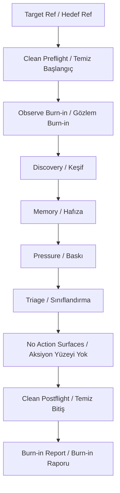
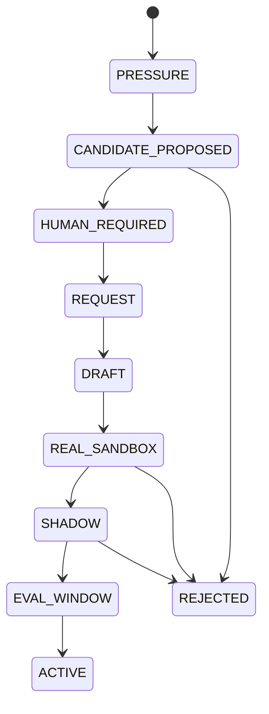
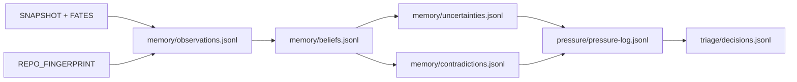

<!-- ARIA-CURRENT-STATE-NOTICE: This enterprise autonomy SSoT is subordinate to executable code, machine-checked contracts, and docs/aria/CURRENT_STATE.md. If prose conflicts with runtime code or tests, code/tests win and this file must be corrected. -->

# ARIA Enterprise Autonomy SSoT / ARIA Kurumsal Otonomi SSoT

Authority: enterprise-autonomy-ssot
Current authority: `docs/aria/CURRENT_STATE.md` + executable contracts
Runtime entrypoint: `autonomy burn-in observe`
Report schema: `docs/aria/schemas/autonomy-burn-in-report.schema.json`

## EN

ARIA becomes enterprise-grade only when autonomy is proven by append-only,
hash-bound evidence, not by a successful demo cycle. The first sanctioned
path is an exactly 30-attempt observe burn-in with at least 20 valid cycles that produces discovery, memory,
pressure, finding, and triage evidence while proving that no agent claim,
tool run, PR, merge, promotion, or materialization occurred.

## TR

ARIA ancak başarılı bir demo cycle ile değil, append-only ve hash-bound
kanıtlarla enterprise-grade olur. İlk izinli yol en az 20 valid cycle içeren tam 30 denemelik observe
burn-in'dir: discovery, memory, pressure, finding ve triage kanıtı üretir;
aynı anda agent claim, tool run, PR, merge, promotion veya materialization
olmadığını kanıtlar.

## Production Autonomy Target Decisions (2026-06-20) / Production Otonomi Hedef Kararları (2026-06-20)

This section records accepted operator target decisions for the next
enterprise-autonomy implementation plan. Prose does not grant runtime
authority: these decisions become live only when the machine-readable policy
files, schemas, executable owners, required GitHub check, CODEOWNERS ownership,
state-manifest declarations, and invariants listed here land on `main`.

Bu bölüm bir sonraki enterprise-autonomy implementation plan için kabul edilen
operator hedef kararlarını kaydeder. Prose runtime authority vermez: bu kararlar
ancak burada listelenen machine-readable policy files, schemas, executable
owners, required GitHub check, CODEOWNERS ownership, state-manifest declarations
ve invariants `main` üzerine indiğinde canlı olur.

ARIA's full-production autonomy target is built on:

- executable kernel owners as the decision authority;
- machine-readable policy and schema SSoTs under `docs/aria/policy/*.json`;
- declared append-only ledgers in `state_manifest.py`;
- GitHub branch protection plus the `aria-merge-authority` required status check;
- short-lived GitHub App installation token leases for writes and `GITHUB_TOKEN` for CI proof;
- external durable runtime state roots with hash-bound artifact snapshots and a signed-proof target;
- rollback bundles and incident ledger rows for every autonomous merge.

| Decision | Accepted target |
|---|---|
| Autonomy level | Full production autonomy: ARIA plans, implements, opens PRs, tests, merges, and manages rollback/incident records inside selected risk gates. |
| Repo scope | Whole repo, risk-gated. |
| L3 policy | Two-stage human policy approval; after approval ARIA completes test, merge, rollback bundle, and incident-ledger workflow. |
| Rollback | Rollback bundle + incident ledger is mandatory for every autonomous merge. |
| L2 unlock | 30 successful supervised L2 merges are required before L2 autonomous merge unlocks. |
| Acceptance bar | 30 observe cycles, 30 L1 autonomous merges, 30 L2 supervised merges, 10 L2 autonomous merges, 5 L3 two-stage approval PRs, zero critical policy violations, and 3 rollback simulation or real rollback successes. |
| Runtime | Hybrid runtime: GitHub Actions for checks/proofs and a self-hosted private runner for implementation work. |
| Token model | Hybrid token model: GitHub App installation token for write leases, `GITHUB_TOKEN` for CI proof, no PAT runtime path. |
| Merge authority | Kernel decision + `aria-merge-authority` required check + CODEOWNERS-protected policy files. |
| Policy SSoT | Hybrid policy SSoT: `docs/aria/policy/*.json` and schemas are machine authority; `aria-kernel` modules enforce; this document is the subordinate index. |
| Owner map | `risk_policy.py`, `autonomy_unlock.py`, `policy_approval.py`, `rollback_bundle.py`, `incident_ledger.py`; `merge_authority.py` reads those owners and remains the final merge orchestrator. |
| Ledger/state | Hybrid ledger/state: external durable runtime ledgers are canonical; hash-bound artifact snapshots provide PR and CI evidence; signed snapshot proof is required before this target becomes live; all ledger paths are declared in `state_manifest.py` and all appends use declared JSONL writers. |

## Enterprise Gates / Kurumsal Kapılar

| Gate | EN | TR | Executable Anchor |
|---|---|---|---|
| Live authority | Runtime claims defer to current code/tests. | Runtime iddiaları mevcut kod/teste tabidir. | [CURRENT_STATE.md](./CURRENT_STATE.md) |
| Burn-in path | Observe cycles are separate from `autonomy run`. | Observe cycle yolu `autonomy run` değildir. | [burn_in.py](../../aria-kernel/aria_kernel/burn_in.py) |
| Explicit roots | Workspace, workspace base, tools dir, target ref, output dir are explicit. | Workspace, workspace base, tools dir, target ref, output dir açık verilir. | [cli.py](../../aria-kernel/aria_kernel/cli.py) |
| Repo-local state blocked | Tools/workspace/output roots must be outside the repo. | Tools/workspace/output kökleri repo dışında olmalı. | [burn_in.py](../../aria-kernel/aria_kernel/burn_in.py) |
| Bound report surface | Output dir must live under bound `tools-dir/burn-in/`. | Output dir bound `tools-dir/burn-in/` altında olmalı. | [state_manifest.py](../../aria-kernel/aria_kernel/state_manifest.py) |
| Clean ref | Pre/post worktree must be clean and HEAD must match target ref. | Başta/sonda worktree temiz, HEAD target ref ile aynı olmalı. | [burn_in.py](../../aria-kernel/aria_kernel/burn_in.py) |
| No action surfaces | Agent/tool/PR/promotion/materialization surfaces must not grow. | Agent/tool/PR/promotion/materialization yüzeyleri büyümemeli. | [burn_in.py](../../aria-kernel/aria_kernel/burn_in.py) |
| Machine report | Acceptance is a schema-bound JSON report. | Acceptance schema-bound JSON rapordur. | [autonomy-burn-in-report.schema.json](./schemas/autonomy-burn-in-report.schema.json) |



## Runtime Contract / Runtime Sözleşmesi

Command:

```bash
npm run aria:burnin:observe -- \
  --workspace-root /path/to/clean/worktree \
  --workspace-base /tmp/aria-workspaces \
  --tools-dir /tmp/aria-tools \
  --target-ref HEAD \
  --cycles 30 \
  --min-valid-cycles 20 \
  --output-dir /tmp/aria-tools/burn-in/run-001
```

The command writes `autonomy-burn-in-report.json` and returns success only
when `acceptance_verdict` is `passed`.

Komut `autonomy-burn-in-report.json` yazar ve sadece `acceptance_verdict`
değeri `passed` ise başarılı döner.

## Agent And Skill Genesis / Agent ve Skill Doğumu

Observe burn-in may discover pressure, but it must not directly create a
skill or agent. Enterprise genesis follows this lifecycle:

Observe burn-in pressure bulabilir, fakat doğrudan skill veya agent
oluşturamaz. Enterprise genesis akışı:



Minimum promotion requirements:

- `PRESSURE -> CANDIDATE_PROPOSED`: at least 5 repeated observations or 2 independent sources.
- `HUMAN_REQUIRED -> REQUEST`: signed operator approval and existing-capability check.
- `DRAFT -> REAL_SANDBOX`: scoped read paths, forbidden read paths, fixture set, and output schema.
- `REAL_SANDBOX -> SHADOW`: real fixture execution, no artifact safety violations.
- `SHADOW -> ACTIVE`: evaluation window with precision, false-positive, crash-rate, and owner review evidence.

## Memory Shape / Hafıza Şekli

ARIA memory is not chat history. It is append-only runtime state declared in
`state_manifest.py` and written by discovery/memory/pressure/triage code.

ARIA hafızası sohbet geçmişi değildir. `state_manifest.py` içinde tanımlı,
discovery/memory/pressure/triage kodu tarafından yazılan append-only runtime
state'tir.



## Repo Shape / Repo Şekli

ARIA learns repo shape from committed snapshots, not from stale prose. The
burn-in report summarizes the number of completed discoveries, fated files,
memory rows, pressure rows, and triage decisions.

ARIA repo şeklini stale prose'dan değil committed snapshot'lardan öğrenir.
Burn-in raporu tamamlanan discovery sayısını, fated file sayısını, memory
row'larını, pressure row'larını ve triage kararlarını özetler.

Executable links:

- [discovery.py](../../aria-kernel/aria_kernel/discovery.py)
- [cycle_diff.py](../../aria-kernel/aria_kernel/cycle_diff.py)
- [memory.py](../../aria-kernel/aria_kernel/memory.py)
- [pressure.py](../../aria-kernel/aria_kernel/pressure.py)
- [triage.py](../../aria-kernel/aria_kernel/triage.py)
- [state_manifest.py](../../aria-kernel/aria_kernel/state_manifest.py)

## Acceptance Matrix / Kabul Matrisi

This table is a view of executable authorities; runtime code and invariant
tests remain the source of truth.

| Requirement ID | Gate | Runtime Authority | Runtime Symbol | Predicate | Evidence Field | Failure Class | Waiver ID | Owner | Expires On |
|---|---|---|---|---|---|---|---|---|---|
| ARIA-ENT-001 | 30/20 observe burn-in | `burn_in.py` | `REQUIRED_CYCLE_ATTEMPTS`, `REQUIRED_MIN_VALID_CYCLES` | exactly 30 attempts and at least 20 valid cycles | `acceptance_conditions` | `observe_burn_in_acceptance_failed` | none | platform-autonomy | 2026-07-31 |
| ARIA-ENT-002 | Clean ref/root binding | `burn_in.py` | `_require_clean_worktree`, `_git` | clean pre/post worktree and HEAD equals target ref | `failure_reports`, `base_commit_sha` | `observe_burn_in_ref_or_root_failed` | none | platform-autonomy | 2026-07-31 |
| ARIA-ENT-003 | No action surfaces | `state_manifest.py` + `burn_in.py` | `observe_disallowed_tool_surfaces`, `DISALLOWED_OBSERVE_SURFACES` | manifest-derived action/mutation surfaces do not change | `disallowed-actions.json`, `manifest-tail-hashes.json` | `observe_burn_in_disallowed_delta` | none | platform-autonomy | 2026-07-31 |
| ARIA-ENT-004 | Trust-grade evidence | `evidence_trust.py` | `EvidenceEnvelope`, `SELF_OUTPUT_PREFIXES` | evidence is repo-verified at target SHA and not ARIA self-output | `evidence_envelopes` | `evidence_trust_rejected` | none | platform-autonomy | 2026-07-31 |
| ARIA-ENT-005 | Append-only finding/debt state | `finding.py`, `debt.py` | `_replay_findings`, `_replay_debts` | show/list replay event ledgers and bind source hashes | `source_ledger_hash` | `finding_debt_ledger_replay_failed` | none | platform-autonomy | 2026-07-31 |
| ARIA-ENT-006 | Workflow preflight fail-closed | `preflight.py` | `WorkflowPreflightVerdict` | kill switch, exact paths, DLP, token provenance, network evidence, clean worktree | `failure_classes` | `workflow_preflight_contract` | none | platform-autonomy | 2026-07-31 |
| ARIA-ENT-007 | Genesis lifecycle gate | `genesis_lifecycle.py`, `genesis_policy.py` | `GENESIS_LIFECYCLE_STATES`, `record_transition` | only reducer-approved transitions with threshold evidence pass | `genesis-lifecycle/events.jsonl` | `genesis_lifecycle_transition_rejected` | none | platform-autonomy | 2026-07-31 |
| ARIA-ENT-008 | Merge authority disabled-by-default | `merge_authority.py`, `runtime_profile.py` | `merge_pr_if_ready`, `ACTION_PERMISSIONS["pr_merge"]` | real merge uses authority wrapper and autonomous profile gate | `merge_authority_decision` | `direct_real_merge_forbidden` | none | platform-autonomy | 2026-07-31 |
| ARIA-ENT-009 | Enterprise readiness claim | `enterprise_readiness.py` | `evaluate_enterprise_readiness_claim` | bundle, workflow runs, hashes, remote CAS, rollback, waivers, branch protection are green | `readiness_claim` | `readiness_claim_incomplete` | none | platform-autonomy | 2026-07-31 |

## Open Enterprise Work / Açık Kurumsal İşler

The burn-in path is the first acceptance slice. It does not claim that full
autonomous merge is enterprise-ready. Remaining professional hardening includes
global workflow kill switch, remote CAS lease proof, scoped GitHub token
provenance, DLP artifact classifier expansion, and auto-merge acceptance
evidence.

Burn-in yolu ilk acceptance dilimidir. Full autonomous merge'in
enterprise-ready olduğunu iddia etmez. Kalan profesyonel işler: global workflow
kill switch, remote CAS lease kanıtı, scoped GitHub token provenance, DLP
artifact classifier genişletme ve auto-merge acceptance kanıtı.
