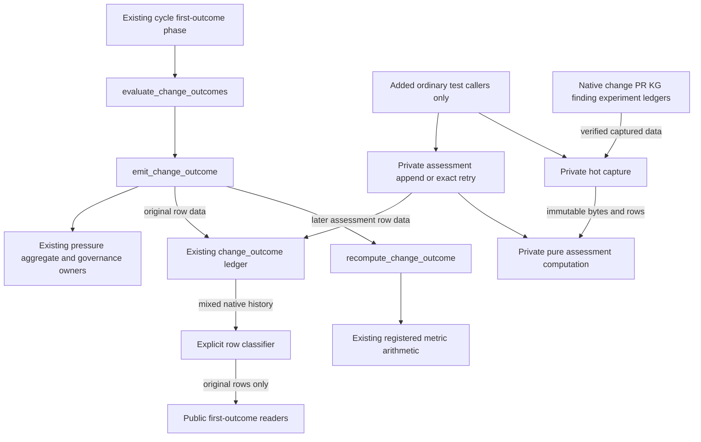

# Change outcome and hot assessment catalogue entries

This is the two-file S2-A shard of the [ARIA source catalogue](./ARCHITECTURE.md#source-catalogue-and-current-review-boundary). It documents the existing first-outcome owner and the integrated hot assessment increment. Root applied the exact reviewed two-file export to accepted R1 with original HEAD/index/staged bytes unchanged. The source-only integration identity is `6fdc9734a5654a14232b647dedd1f9134de3b992e96f4a229ab677a0513a56ec`; central execution and documentation checks are tracked separately. The isolated results below remain attributed to their actual executors.

Source cutoff: isolated assessment `b000f5db1ad330b8ad87dc8e1aa17b942c24eabf6a5c751a8dff90c5ebdd11e2`; exported patch `6d794f7006d11a048b6edb3bddcfa4fe105543bcf7dfc1680a3582f25aaad727`. Both full files were manually reread at the exact hashes below, not merely indexed with AST. Production ranges 1–390,391–733,734–1132 and test ranges 1–350,351–680,681–1004 cover all lines. `s2a-catalogue-source-proof.json` SHA256 `f74ed14d407e9f2b151aea8e99238e0a568086a710bd25bd36ce09b284a88cfb` binds current byte hashes, reading ranges, symbols and exact selectors. This read-completeness statement covers these two files only.

## `aria-kernel/aria_kernel/change_outcome.py`

SHA256 `a50daf854cd49d7bec12607f66d69298bff8cf108cf7910094e994e9e95a7b2c`; 50,538 bytes, 1,132 lines. **Manual read complete.** Read this owner before changing first-outcome arithmetic, later assessment capture/classification, or outcome-ledger readers. Historical measurements in the module's opening 2026-08-20 commentary are dated author statements; they are not fresh host observations or evidence that this candidate is deployed.

**Purpose and current behavior.** The established public API recomputes a merged, validated change's first outcome from native event/observation ledgers and records it in the existing `change_outcome` surface. The S2-A addition privately captures an immutable hot evidence view, derives a later assessment for the original convention family/planned scope, and appends a distinct `change_assessment` event to that same surface. It leaves first outcomes immutable and excludes later assessments from public first-outcome lists, nightly counters and pressure aggregation.

| Symbol/entry                                                                                | Inputs, outputs and ownership                                                                                                                                                                                                                                                                                                                                                                                                                                                                                                                                       |
| ------------------------------------------------------------------------------------------- | ------------------------------------------------------------------------------------------------------------------------------------------------------------------------------------------------------------------------------------------------------------------------------------------------------------------------------------------------------------------------------------------------------------------------------------------------------------------------------------------------------------------------------------------------------------------- |
| `MetricReading:142`, `EvaluationContext:170`, `BENEFIT_METRICS:396`, `_metric_readings:413` | Existing metric value/context interfaces and signal/source checks. The shared registry reads recurrence from native finding/governance events and experiment hold from matched observations. Worst supported verdict is selected by `fold_outcome_verdict:402`; a red experiment alone does not create a second regression detector.                                                                                                                                                                                                                                |
| `recompute_change_outcome:489`, `emit_change_outcome:620`                                   | Require original planned/committed/validated and merged PR joins. Recompute first-outcome inputs, enforce existing age threshold, return exact prior content or refuse changed evidence, append an original event, then call the existing aggregate/governance owners. Existing first-outcome semantics are preserved; the new explicit upper event-time cutoff applies to private captures.                                                                                                                                                                        |
| `_classify_outcome_rows:208`, `find_change_outcome:571`, `list_change_outcomes:586`         | Verify native input through the existing declared reader; explicitly separate original `CHANGE_RECORD_SCHEMA/change_outcome` rows from private `aria/change-assessment/v1/change_assessment` rows. Validate per-stream predecessor history. Return original rows only; unrecognized event/shape does not become positive evidence.                                                                                                                                                                                                                                  |
| `_AssessmentCapture:190`, `_capture_assessment_inputs:734`                                  | Resolve existing repository identity and bound tools authority, validate host metadata before evidence transactions, then recheck those exact bytes under ordered native locks. Capture verified planned/committed/validated/original-outcome, PR, governance, experiment definitions/recipes/observations, validation runs, native convention and finding prefixes. Derive original merge, family ancestry, normalized planned scope, stream and predecessor. Output immutable stored bytes/serialized verified rows and metadata, not a portable retained object. |
| `_compute_change_assessment:952`                                                            | Pure recomputation from captured rows: same registered arithmetic and verdict precedence, event interval `(original merged_at, captured cutoff]`, input/material digests, exact assessment ID and explicit availability. No command rerun or caller-supplied verdict.                                                                                                                                                                                                                                                                                               |
| `_record_change_assessment:980`                                                             | Revalidate current host authority outside evidence locks and exact bytes inside. Require original outcome reference. Check an exact existing assessment before current predecessor, so retrying an older capture after its successor returns the original row unchanged. A different stale capture must be recaptured. Append once through the existing declared transaction; no first-outcome aggregate/governance mutation.                                                                                                                                       |
| `evaluate_change_outcomes:1043`                                                             | Existing nightly first-outcome sweep selects eligible merged validated changes, oldest merge first, with disclosed skips/errors and existing per-night limit. It does not invoke later assessment capture or append.                                                                                                                                                                                                                                                                                                                                                |

**Actual callers and dependencies.** `cycle.py:1110–1116` imports/calls `evaluate_change_outcomes`; phase registration remains after `experiment_night`. The new private capture/compute/append functions have test callers only at this cutoff. A source search of production kernel files found their definitions and internal append→compute call, with no cycle, planner or prompt consumer. Core dependencies remain `change_ledger`, declared `ledger` transactions, `state_manifest` surface resolution, `state_store` host-binding readers, `workspace` canonical identity/repository-state location, `knowledge_graph` native observation validation, finding/experiment/governance owners and existing pressure effectiveness writer. No dependency was replaced by a duplicate verifier/store.

**State and retention.** The only new persistent rows use `change-ledger/outcome.jsonl` under its existing surface/lock group. Original outcome rows and the current tool/repository-state roots remain owned by existing modules. Each assessment descriptor records source surface/root kind/repository identity/relative path, original native prefix length/hash/row count/tail and selected row references. All `retained_prefix_ref` values are null; availability is exactly hot evidence available, durability unavailable with `retained_prefix_unavailable`, corrective qualification unknown. Serialized captured rows make repeated in-process computation stable after later appends; they do not provide cold reconstruction after process/source loss. The 16 MiB/20,000-row limits admit capture contents; existing authority/verification owners perform additional reads. These are not a total physical-I/O or time bound for a future sweep.

**Compatibility and downstream limits.** Original public signatures and exports remained equal in the actual API76 capture; no shared state manifest/schema file or public export was edited. First-outcome negative aggregation still uses `knowledge_graph.record_pressure_source_outcome`; its legacy workspace-root path limitation is unchanged. Native later assessment rows do not automatically withdraw/reinstate conventions, reach a new prompt, or initiate correction. Durable retained prefixes, fair bounded scheduling, effective latest/supersession serving, corrected-request→adoption→first planned append lineage and evidence-qualified reinstatement are separate open dependencies. Existing `gain_confirmed` is the preserved metric vocabulary, not new proof of measured product effectiveness or causal benefit.

**Demonstrated behavior.** The seven added ordinary methods and fourteen unchanged selected legacy methods passed in the separate attributed checkpoints below. This is neither one combined 21-case run nor a whole-cycle/deployment result. The actual host-binding control observes real common-directory Git calls outside yielded evidence transactions in both capture and append; it does not establish a blanket absence of commands in every transaction-enter/exit path.

Arrows name calls unless explicitly labelled data. There is deliberately no cycle/planner→assessment edge: that runtime connection is absent in this source slice. No model/provider action is involved.

## `aria-kernel/tests/test_change_outcome.py`

SHA256 `dee45bf7685b51532bbf61f8d10c11846d5fa269ad6da067a0363ea91179b7f8`; 51,710 bytes, 1,004 lines. **Manual read complete.** Read before altering fixtures or claims for this owner. There are 22 test methods: all 15 original method bodies remain byte-exact, seven methods were added, and the proposal-derived refusal method at `:252` remains excluded from the reviewed ordinary selection. Reading its preserved source does not mean it was executed. No module-wide run is authorized by the selected evidence below.

**Fixtures and actual producers.** `OutcomeBase:68` retains its controlled declared-row helpers and existing validation-matrix fixture omission; only three setup lines bind a unique `ARIA_REPO_STATE_ROOT`. `AssessmentHotEvidenceTests:412` owns a disposable real Git source, separate bound `<store>/tools` and repository-state roots, actual named unittest→native validation→validated change chain, normal fixture PR observation/clock, original outcome, existing fixture signer/native convention and registered recipe/experiment. `_verified_run:559` checks actual canonical verifier/log/command/commit/behavior evidence; `_observe:575` calls the real experiment producer. These are local fixture authorities, not live PR governance or an orchestrator-signing fix. `AssessmentAdverseAccountingTests:803` uses a separate fixture at the legacy pressure owner's actual checkout-local tools path, emits a real finding, executes a genuinely failed named behavior test, records native reproduction and seeds nonzero pressure counts through the existing writer.

| Added ordinary contract                                                       | Current anchor and actual boundary                                                                                                                                                                                                         |
| ----------------------------------------------------------------------------- | ------------------------------------------------------------------------------------------------------------------------------------------------------------------------------------------------------------------------------------------ |
| `test_assessment_append_preserves_first_outcome_readers_and_counters`         | `:604`; mixed native row discrimination, original public readers, stream/scope/native prefix bytes and hot/null-durability fields; original public changed-evidence behavior preserved.                                                    |
| `test_later_native_observation_does_not_change_captured_prefix`               | `:664`; later real observation lies inside the same time window yet cannot alter the old captured membership/computation.                                                                                                                  |
| `test_exact_retry_after_successor_returns_original_assessment_without_append` | `:678`; exact old capture retry returns original cycle/row after successor, native outcome/governance bytes unchanged.                                                                                                                     |
| `test_captured_observations_respect_inclusive_upper_event_time`               | `:695`; normal experiment producer clock supplies after-cutoff and exact-cutoff events. Only exact-boundary event contributes; this controls event time, not command wall-clock completion.                                                |
| `test_hot_capture_and_append_validate_binding_before_transaction`             | `:738`; wrappers call original transaction and Git functions and require observed real common-directory commands in both phases, preventing a vacuous pass. Prospective post-correction control, no fabricated pre-correction runtime RED. |
| `test_distinct_stale_capture_requires_recapture_before_append`                | `:788`; distinct capture with outdated predecessor cannot append; normal recapture produces successor and preserves prior prefix.                                                                                                          |
| `test_native_reproduction_assessment_preserves_nonzero_pressure_counters`     | `:804`; real failed unittest/native run/reproduction yields no_gain while prior 9/5/3/2 counts, bytes, original readers and governance remain unchanged; `_record_aggregate` wraps the real function and must receive no call.             |

**Attributed actual results and limits.** Exact selectors live in the assessment evidence directory, relative to an `aria-kernel` runner cwd. Initial four, lock one, upper-window one, adverse one and legacy fourteen manifests have 21 distinct names. No new execution was performed for this catalogue.

| Preserved checkpoint                          | Executor, result and source binding                                                                                                                                                                                                                                                                    |
| --------------------------------------------- | ------------------------------------------------------------------------------------------------------------------------------------------------------------------------------------------------------------------------------------------------------------------------------------------------------ |
| `s2a-initial-four-red.log/json`               | Author: 4 failed, 40.51s, zero subtests, `0a6adbdc…`. All setups reached the same missing capture capability; later semantic assertions were unreached. One absent capability, not four independent baseline defects.                                                                                  |
| `parent-s2a-four-initial.log/json`            | Supervising assistant: 4 passed, 48.33s, zero subtests, `aaa09424…`; original four bodies unchanged. No author duplicate.                                                                                                                                                                              |
| `s2a-lock-control-one-green.log/json`         | Author: 1 passed, 9.47s, zero subtests, `e523a4b3…`; real binding call-order control.                                                                                                                                                                                                                  |
| `s2a-upper-window-one-green.log/json`         | Author: 1 passed, 13.27s, zero subtests, `8bccad7f…`; observation-time boundary.                                                                                                                                                                                                                       |
| `parent-s2a-adverse-one.log/json`             | Supervising assistant: 1 passed, 13.05s, zero subtests, `6d56…`; native adverse event and nonzero counters. No author duplicate.                                                                                                                                                                       |
| `s2a-legacy-fourteen-green.log/json`          | Author: 14 passed, 50.96s, zero subtests, final `b000f5db…`; 12 controlled declared-fixture tests plus two declaration/registration introspection tests. Not 14 actual native command chains or a full cycle.                                                                                          |
| `s2a-final.api.json` and raw observer receipt | Author API76 observer exit0, stable `b000f5db…`, JSON byte-identical to before at SHA256 `859ea85fe1994ab74c392e9e7503f99a05ddb9944a4c33d2f7d93e2bd5ed6ac9`. This captures 74 public plus two inherited private callable signatures and unchanged root exports; it is not an additional behavior test. |

Parent raw files are under `/var/tmp/codex-aria-parent-assessment-20260911-m89xfqrd/`; author files are under `/tmp/codex-aria-assessment-evidence-20260911-ljhxscjv/`. Different-author source/body/raw reviews are under `/tmp/codex-aria-runtime-evidence-20260911-o8c5835e/`, including final hot export/API review SHA256 `0000c3695b63ab37f6831223e9de70bcce43ce2dbb5cbbb888c5204dbda3a966`. That peer checked exact two-file delta, 1,167 unchanged scoped entries, preserved index/staged bytes, original/current file bytes and actual API equality. Root integration/source identity after applying the patch must be recorded separately; these results are not silently relabelled as a central rerun.

**Remaining evidence gap.** Cold/portable prefix and referenced-log closure, multi-process concurrency, finite/fair runtime scheduling, serving/retraction/reinstatement, corrective lineage and actual product benefit are not established by this module's selected tests. Its state is disposable local fixture state; no live service, credentials, providers or external model were exercised. Older failed setup/candidate/source-review evidence remains preserved rather than replaced by later GREEN.
