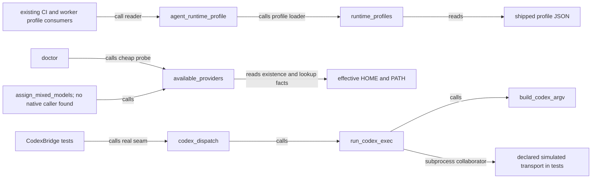

# S4 offline profile, Codex argv and provider-probe prerequisite

This catalogue describes the accepted six-file offline/probe behavior with the publication-only test
identifier correction below, source cutoff
`f3229a6932f82dcdd7d7b9bfa8474ae24c825c0ac97125e33e600dc9bad3ac78`. It excludes later native
admission, policy, managed-status and Z.ai transport work. “Exercised” below refers to the
historical approved dirty-baseline selections; clean-HEAD publication validation must be recorded
separately by root. No shipped profile, role, price, budget, grant or default runtime activation
changed.

## `aria-kernel/aria_kernel/runtime_profiles.py`

SHA256 `784578ed91c8bce32da63d0d660a9af1ab83dadbf6e14367acb295ffa2170982` — 13,055 bytes, 293 lines.
Full owner and complete change manually read; this reading claim does not extend to every downstream
caller.

`RuntimeProfile:89` and `_validate_profile:111` own the closed kernel envelope loaded from package
`data/runtime_profiles.json`. Optional `runtime` defaults to `claude`; explicit `codex` admits
exactly `gpt-6-astra`/`ultra`. Existing tools, scope, environment grants, external writes, per-run
budget, concurrency and MCP validation remain. `agent_runtime_profile._read_profile_cached` consumes
this owner; existing Claude runtime/settings consumers use its grants and deny rules. It returns
immutable profile data and writes no ledger. The path-keyed process cache is unchanged; it is not a
fresh configuration-byte receipt.

Historical initial12 tests exercise real copied JSON loading, exact selected Codex pair,
omitted/explicit Claude, unsupported pairs and unchanged judge grants. No native Codex
containment/claim/model launch is proved. Read this owner and companion resolver plus the actual
selected JSON/role before changing its schema or precedence.

## `aria-kernel/aria_kernel/agent_runtime_profile.py`

SHA256 `d049418ea07b0ee2b802e6dc8c52f7f11ce7d705ebd7ae4b5de023e07b62ba84` — 13,331 bytes, 306 lines.
Full owner and change manually read.

`AgentRuntimeProfile:139`, `_read_profile_cached:204` and `read_agent_runtime_profile:245` resolve
agent markdown through the authoritative kernel profile. The trailing default runtime field now
propagates the selected kernel value. Legacy model/effort vocabulary, fable/max fallback, empty
unknown-agent grants and asymmetric authoring-tier guards remain unchanged. CI and worker profile
readers are existing inbound callers; the resolver reads markdown and the profile owner, returns
data and writes no runtime result. Its cache remains agent/repository-path keyed.
`resolve_claude_model:260` and `resolve_claude_effort:271` do not themselves select a Codex
transport.

Historical initial12 covers actual selected/default/mirror behavior and the original
scout/unknown-agent controls. Frontmatter alone does not activate Astra; the exact provider alias
does not add it to the authoring tier. Native executor runtime selection is unwired in this exported
slice. Read both profile owners and real caller grant usage before changing propagation.

## `aria-kernel/aria_kernel/model_fleet.py`

SHA256 `533549cdaf9e1541f1d140c588727a9b5d9ae507a4293d5c2218b69622bf363a` — 6,440 bytes, 158 lines.
Full exported owner and both accepted changes manually read.

`Provider`/`_FLEET:53` retain legacy provider/default-model declarations. `provider_for_model:154`
adds only the exact Astra→OpenAI alias. `_codex_session_present:83` uses explicit CODEX_HOME or
effective HOME/.codex; `available_providers:95` respects an explicitly empty PATH instead of
substituting ambient PATH. The probe checks executable lookup/file or environment presence and does
not execute binaries or write state. `doctor.py:154` consumes it. `assign_mixed_models:130` calls
the probe and stripes roles; the bounded source search found no production native caller of that
assignment function.

Historical probe7 exercises actual disposable PATH/file lookup and the real assignment consumer;
initial12 covers alias/default preservation. This is **cheap availability observation**, not
supported authentication, quota, entitlement, actual session independence or executed-model
diversity. Legacy key/Claude-redirect declarations are preserved behavior, not authorization to
activate them under the user's later managed-auth/Z.ai policy. No native adaptive policy or status
DTO exists in these exported bytes.

## `tools/aria-poc/codex_runtime.py`

SHA256 `3e9e5c49e2c97892a93ed2b27c4d047c9af93b47de29c01c84d8a30f590747fc` — 7,409 bytes, 197 lines.
Full exported owner and complete effort-propagation change manually read.

`build_codex_argv:72`, `run_codex_exec:131` and `codex_dispatch:184` gain optional effort
propagation. Explicit `ultra` becomes the literal `-c model_reasoning_effort="ultra"` override
alongside unchanged network-off flags. Omission preserves exact legacy argv/default model and does
not pass an extra `effort=None` to a strict injected runner. The runner owns a disposable
final-message file, subprocess timeout, event parsing and typed result fields.
`scope_discipline.codex_network_off_config` is its existing kernel dependency. The bounded source
search found no native CI/worker caller of this standalone adapter in this export.

Historical initial12 drives the real builder/runner/parser through a declared simulated subprocess
transport and checks transcript, output-file lifecycle, cwd/timeout and exact argv. No actual model
runs; result.model is the existing requested-value echo, while absent observed effort remains
unknown. The exported runner is not proof of current managed-only execution, native tool authority,
session/usage/claim/result integration or equivalent containment. Read the complete owner and native
caller controls before wiring it.

## `aria-kernel/tests/test_agent_runtime_profile.py`

SHA256 `9b0c789f32b81ec9b6ac1a698025ae2dec9f771a2156b2ae1ac51dd6f2f3149b` — 12,112 bytes. Complete
new helper/four methods and selected existing controls manually read; broader existing test bodies
preserved and AST-inventoried, not claimed freshly executed or exhaustively re-reviewed here.

`AgentRuntimeProfileReaderTests` uses actual copied profile JSON and unchanged evidence-judge
markdown, redirects only the existing profile-path owner and clears existing reader caches at
cleanup. New methods cover selected Codex/grants, omitted/explicit Claude, legacy frontmatter
default and unsupported pairs. It imports the actual two profile owners and standard unittest/temp
fixtures; no native memory/claim or provider credential fixture is needed. Initial12 includes those
four plus unchanged scout/unknown-agent controls. The test is a pytest/unittest entrypoint, with no
production callers or production state writes.

## `aria-kernel/tests/test_model_fleet_and_codex.py`

SHA256 `932198bd5e8ce5d118c668452249cc7fdb8d243f7ad9c6d7fc75ba3a09faada5` — 16,839 bytes. All seven
added methods/helpers and exact selected existing controls manually read; other original methods are
preserved and inventoried, not newly executed by this publication note.

`CodexBridge` executes actual adapter code with a declared deterministic subprocess transport, pins
explicit/omitted effort and strict callback compatibility, and checks exact provider alias/default
mapping. `Availability` and `MixedAssignment` add actual disposable filesystem/PATH and real
assignment-consumer controls; disposable marker bytes are not usable credentials and no marker
binary runs. Standard fixtures clean up their own paths. Only the external transport/ambient lookup
seams are simulated as documented; no native success is fabricated. Initial12 and probe7 select
ordinary exact IDs, not whole modules or later managed-auth controls.

## Calls and data at this cutoff

This diagram records source calls/reads. It does not join the native profile consumer to Codex
execution, because this export does not implement that route.

## Frozen exports and evidence boundary

Export root is `/tmp/codex-aria-runtime-evidence-20260911-o8c5835e/`:

- Initial exact six: `accepted-offline-s4-six/accepted-six-baseline-only.patch` SHA256
  `98764ee5570b11883f9add4f64a684b22a4d576ebb8ad48f83794edf69a56040`; immutable literal files are
  under `accepted-offline-s4-six/files/` using the six relative paths above.
- Apply next: `accepted-probe-two/accepted-two-increment.patch` SHA256
  `2a6a12df10ae297280eb28613084f09b4feaf787052c41363ab37b433cb6c1be`. Its
  `files/aria-kernel/aria_kernel/model_fleet.py` and
  `files/aria-kernel/tests/test_model_fleet_and_codex.py` replace those two initial captures. Net
  scope remains six files.

All six original baseline blobs independently equal genuine HEAD
`fea5890da74f6a8b253c06af765a77c3b5b958e7`; direct JSON/role/scope/bootstrap controls are also
HEAD-identical (`offline-probe-head-dependency-proof.json`). No direct original ten-file
memory-patch dependency was found. Importing the root kernel still loads a broad existing graph, so
static disjointness is not clean-HEAD validation.

Historical author initial12 GREEN was 12 methods plus seven passing subtests; worker probe7 GREEN
was seven methods without subtests, with separate supervising-assistant acceptance. One alias method
overlaps: **18 distinct methods across those selections**, not a combined 18-method run. Exact
immutable manifests are `initial-proposed12.ids.txt` and `probe-first-seven.ids.txt`.
Clean-publication collection and the same 18 distinct methods passed (seven passing subtests, 0.72
seconds) on source identity `7fecacc2edb134e12af29beb644b2a2c09e767d9d967973f195679fe9feecd1b`,
based directly on HEAD `fea5890da74f6a8b253c06af765a77c3b5b958e7`. This is a new source-context
validation of the same methods, not 18 additional unique tests. API, repository hooks and Actions
results are recorded separately in the publication review; this statement does not anticipate their
result. Requested/propagated/observed model settings remain separate; no price/cap/default
activation or latest managed-auth compliance claim follows from this offline prerequisite.

## Publication naming correction

The normal commit hook rejected three local fixture variable names and two prose uses. Only those
names/prose changed; standard `tempfile` ownership, cleanup and all assertions remain. AST
comparison is identical after reversing the local identifier rename. The original exported test
hashes and first commit failure are preserved externally. The test entries above identify the
corrected publication bytes; the four production owners remain exact accepted exports. The same
eighteen methods passed again with seven passing subtests in 0.68 seconds, exit zero, after the
naming correction. Before/after source identity remained
`6a6a4ba148aae50f8f0828e1927fc321445412095562665ad56c4eebf920554d`. This is repeat validation of
changed test bytes, not added unique coverage.
