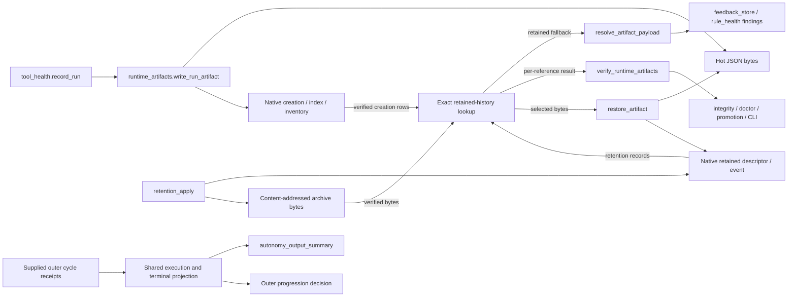
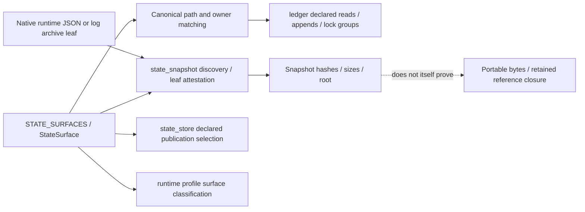
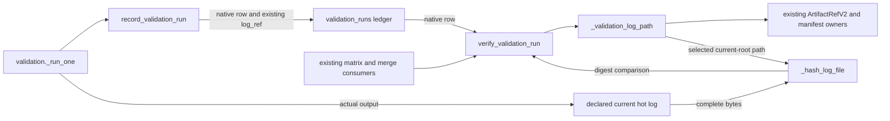
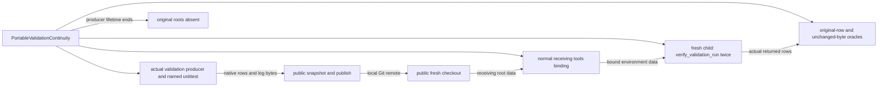

<!-- ARIA-CURRENT-STATE-NOTICE: This source catalogue is explanatory and subordinate to CURRENT_STATE.md and executable contracts. -->

# ARIA source catalogue: runtime evidence and retention

Authority: explanatory source catalogue. Date: 2026-09-11.

This grouped catalogue is linked from [ARCHITECTURE.md](./ARCHITECTURE.md), not a runtime registry or a new state owner. Its six independently addressable entries cover three production owners and three test owners across R1 and R2. **Six entries is this shard's completeness, not completeness of ARIA's source inventory.** The wider kernel, executor, configuration, workflow and service catalogue remains in progress.

| Entry                                                                     | Kind       | Read completeness                          | Review                                                                 |
| ------------------------------------------------------------------------- | ---------- | ------------------------------------------ | ---------------------------------------------------------------------- |
| [runtime_artifacts.py](#aria-kernel-aria-kernel-runtime-artifacts-py)     | Production | Full manual file read by audit_memory_diff | Root checked causal source, actual callers and diagram semantics       |
| [state_manifest.py](#aria-kernel-aria-kernel-state-manifest-py)           | Production | Full manual file read by audit_memory_diff | Root checked declarations, snapshot/ledger consumers and limits        |
| [test_runtime_artifacts.py](#aria-kernel-tests-test-runtime-artifacts-py) | Tests      | Full manual file read by root              | Different-author helper/oracle/evidence review by audit_memory_diff    |
| [test_state_snapshot.py](#aria-kernel-tests-test-state-snapshot-py)       | Tests      | Full manual file read by root              | Different-author helper/oracle/evidence review by audit_memory_diff    |
| [validation_runs_ledger.py](#validation-run-ledger)                       | Production | Full manual file read by audit_memory_diff | Different-author source/evidence review by audit_test_evidence         |
| [test_state_store.py](#state-store-tests)                                 | Tests      | Full manual file read by audit_memory_diff | Different-author fixture/oracle/evidence review by audit_test_evidence |

A source digest below identifies the whole file; it is neither a Git commit nor a complete-tree identity. A changed source invalidates its entry until behavior, affected edges and evidence are reviewed again. A fresh hash alone does not perform that review. The existing documentation/authority checks remain the owner; an additional catalogue stale-entry check is planned but not implemented or claimed here.

Solid diagram arrows below show source-backed calls or labelled data dependencies. Only the listed selected tests establish execution; diagrams do not imply every edge ran, that any service is deployed, or that a model was called. Dashed edges identify missing proof. Snapshot declaration is distinct from archive transfer and reference closure. Each entry identifies its own evidence cutoff. R1 final-ten and R2 isolated two/six-method results remain distinct; later documentation and central integration checks are reported separately.

## [aria-kernel/aria_kernel/runtime_artifacts.py](../../aria-kernel/aria_kernel/runtime_artifacts.py)

**Source and read completeness.** Current SHA256 `de03d2f789726d5f37fff025446381715a8122e023783ab19f0c03930423c2a9`; 107,092 bytes / 2,332 lines. The R1 file at SHA256 `c1ff43829037ad4ab757f067ee102bb6465e7e089abbee8eb114e42de0f06daa` received the full manual read recorded at its final-ten cutoff `fc0362da94bc18a3e3bdc5878c478677afb4aede20d621c4f89604683c6dca2c`. The connected candidate adds the reviewed private `_cycle_result_status` and changes `autonomy_output_summary` to consume it. Root reviewed those complete changes and proved every other definition, including all retained-reference readers, remains literal. This is targeted current review plus historical full-file review, not a new full-file reading claim.

**Read before changing.** Read this whole owner, `tool_health.py::record_run` (artifact writer call at132), `ledger.py` declared append/read/transaction ownership, `state_manifest.py` runtime/retention declarations at490–505, and the selected native fixtures in `tests/test_runtime_artifacts.py:134,373,414,474,559`. If changing storage behavior, also read `state_compact.py` and `state_store.py` publication ownership; this entry does not imply those entire dependency files were reread here.

**Purpose and symbols.** This module persists full runtime evidence before thin run records, resolves findings from exact artifact pointers, verifies runtime graph evidence, controls the existing v2 promotion entry, prepares/restores retention copies, and projects bounded operator summaries. `ArtifactRefV2` (73) and `_validate_artifact_ref_v2_shape` (1667) own the strict seven-field reference vocabulary. `write_run_artifact` (136) scrubs and writes a JSON wrapper, hashes it, then appends native creation/index/inventory rows; `append_run_by_cycle` (250) preserves thin run and budget facts. These are sequential native writes, not a cross-file transaction guarantee.

`resolve_artifact_payload` (635) preserves the legacy public dict-or-None API, large hot JSON admission and 64-entry file-identity cache (308). `_resolve_artifact_bytes` (577), `_archive_history` (503), `_archive_ref_for_query` (521), and native creation/event joins own bounded retained lookup. Retained identity includes source surface, ID, original URI, content hash and producer; a newer hot version does not replace an older full reference. The public hot path itself validates shape/URI/hash and does not separately join every native producer field. String ID/URI restore refuses multiple complete versions. Explicit-root read-only lookup does not initialize state; omitted-root compatibility can call `ensure_tools_dir`.

`verify_runtime_artifacts` (780) checks native chains, run/pointer joins, cycle files, indexes, manifest/inventory versions and retained archive bytes. `verify_artifacts` (704) remains the separate legacy hot-index verifier; its presence does not imply every public verifier has archive semantics. `_refs_requiring_hot_index` (1776) independently verifies retained history even after restoring a hot copy, so it need not invent a compacted index. `_native_summary_for_ref` (1946) joins producer-aware native versions; `_source_is_native_republication` (1983) qualifies historical source differences through actual later native creation. Generic legacy index matching and run-ID deduplication retain their existing behavior.

`retention_dry_run` (959), `retention_apply` (975), `restore_artifact` (1065), and `rollback_retention` (1119) remain distinct public operations. Apply copies verified bytes into content-addressed `.archive/runtime/.../<original-filename>` and idempotently appends `artifact_archived` with `source_descriptor` under the existing retention transaction; it does not itself unlink hot files. Restore selects one exact native identity, rehydrates bytes when needed and appends `artifact_restored`; it does not recreate the native artifact index. Rollback remains its existing manifest-selected copy/hash/event path; no new rollback result was demonstrated by R1 final-ten.

`approve_runtime_v2_promotion` (838) and `require_runtime_v2_promotion` (918) retain existing profile/operator/source/identity/verifier-version checks; no gate behavior was changed by R1. `autonomy_output_summary` (1379), `_memory_learning_projection` (1282), `_memory_receipt` (1220) and `_fit_memory_learning_summary` (1363) report supplied outer-cycle receipts and verified artifact status. Memory counts are reporting occurrences, not unique appends, backlog size or measured gain. Priority/source-order selection, omission markers and 8 KiB optional memory / 32 KiB stdout limits are distinct from retained-read work budgets.

The connected result consumer also uses `_cycle_result_status` from `autonomy_orchestrator.run_autonomy_orchestrator`. Runtime failure details retain precedence; runtime success cannot hide a failed, aborted or unknown terminal result. The original result fields remain intact, and legacy callers omitting one field retain their existing interpretation. The isolated outer selection passed six methods and eight subtests in 227.31 seconds; its fixture supplies the plan binding and substitutes downstream dispatch, so it is not a model run or default outer-plan enrollment proof. Connected retention/restore, version-continuity and receiving-hot-log controls are required before accepting this integrated revision.

**Actual callers, callees and state.** `tool_health.py:132` calls the writer. Finding consumers call `resolve_finding_from_artifact` from `feedback_store.py:1115,1117` and `rule_health.py:71`. Runtime graph verification is consumed by `promotion_controller.py:116`, `doctor.py:118`, `integrity.py:28` and `cli.py:3958`; CLI retention/restore/rollback calls are at4004/4015/4025 and summary at5978. Internal graph/summary paths reuse the same per-reference verifier. Native state includes `run-artifacts/hot/**/*.json`, creation/index/inventory JSONL, `runs/by-cycle/*.jsonl`, `retention/events.jsonl`, archive bytes and `runtime/v2-promotions.jsonl`. This owner delegates path declarations/native integrity to `state_manifest`/`ledger`, root/binding to `tool_registry`, and payload scrubbing to `artifact_safety`.

**Demonstrated tests and limits.** The root engineering agent's exact final-ten collection matched its literal selector; raw execution reports 10 methods plus 9 passing subtests in 82.21 s, exit 0, stable `fc0362da...`. Six methods / 6 subtests are in the runtime test owner: current/legacy cold lookup; ID/URI restore and post-restore verification; retained A/native hot B continuity; large hot/cache/native replacement; native record rows; and literal-byte summary matching. The native publisher fixture does not execute its declared tool/model. B has native publication/read proof but the version test has one original run referencingA, not a second executed run. The four snapshot/policy methods are described in the separate test entry. Earlier RED/GREEN histories are preserved and do not add distinct coverage. Evidence: `r1-final-ten-{collect,green}.{json,log}` in `/tmp/codex-aria-retention-r1-r2-20260911-_qef_m9w`.

Cold work limits are per operation: source 16 MiB / 32 files / 20,000 rows / 32 candidate rows, plus artifact 16 MiB / 2 MiB per file, including a private attempted hot read before fallback. They are not a whole graph-verifier wall-clock/history limit, and the legacy public hot admission is intentionally different. R2 receiving-hot-log relocation is described below; R3/R4 durable prefixes/reference closure and coordinated publication/final eviction, whole-store restore and measured learning usefulness remain open. No last-copy deletion, shared archive transaction across all writers, or live activation is established here.

## [aria-kernel/aria_kernel/state_manifest.py](../../aria-kernel/aria_kernel/state_manifest.py)

**Source and read completeness.** SHA256 `7d515823291631bd607aad6001a2134cdc8c12e01e3a18d45d586f8c5c204ed9`; 74,523 bytes / 1,071 lines. Full manual read completed: 1–200,201–440,441–720,721–1071; rereads replaced truncated combined output. No application import or import-time validator execution by this reviewer. Exact production bytes match the R1 final-ten cutoff above.

**Read before changing.** Read the entire declaration/lookup owner, `ledger.py` surface admission and ordered lock use (558,640,845), `state_snapshot.py` declared inventory/pattern consumption (223,408,468), and `state_store.py` declared publication selection (3950,5189,5231). For the R1 additions read the exact archive fixture in `tests/test_state_snapshot.py:119` and this file's runtime declarations 490–496. Path declaration, host/repository authority and transport closure are different owners.

**Purpose and symbols.** `StateSurface` (201) describes path pattern, root kind, state class, lock/index group, strict-read policy, durability, write-driving status, profile surface, observation/action classification and enterprise inclusion. `_infer_profile_surface`/`_infer_observe_class` (171/175) provide defaults; explicit declaration values take precedence. `STATE_SURFACES` (228) is the executable roster, and `iter_surfaces` (739), `surface_by_name` (759), `surfaces_for_lock_group` (766), plus profile selectors (1006–1039) expose it to existing owners.

`normalize_surface_relative_path` (786) bounds and canonicalizes POSIX paths; `surface_path_matches` (822) uses a component-aware iterative matcher (`*` stays in one component; `**` spans zero or more); `validate_state_surface_patterns` (865) checks the declared grammar/name/pattern identity. `surface_for_relative_path` (898) and `surface_for_path` (926) select the most specific unambiguous matching owner. `surface_key_name` (743) separates a glob-instance suffix from its canonical surface name. `resolve_surface_path` (1042) only joins an exact declared path and rejects globs; it is not a binding validator.

`_base_matches_root_kind` (970) requires identity metadata for a tools root and existence for workspace/repository roots. `_has_valid_tools_identity` (988) checks the local metadata shape/contract marker; this is not a complete canonical-repository authority proof. `repo_identity.json` remains host-derived and absent from the portable roster; `tools_contract` (402) carries the repository/tree contract while the normal binding owner restores host metadata. No duplicate registry/store is created.

**State and downstream effects.** The roster includes tools, workspace and repository ledgers/indexes/runtime artifacts/locks, including native changes, validation/bench, mission/gateway, memory/KG, discovery/twin, profiles and retained archives. R1 adds `.archive/runtime/**/*.json` and `.archive/runtime/**/*.log` as artifact leaves alongside `archives/*.jsonl.gz`; all use existing runtime-artifact ownership. A declaration allows existing consumers to discover/attest a leaf; it does not itself copy, resolve, decompress, pin or delete bytes. Existing KG late-joiner declarations retain `strict_read=False` for their separate historical chain owner; describing this policy does not qualify their effective serving behavior.

**Tests and demonstrated scope.** In the root engineering agent's final-ten, the actual snapshot archive method and three unchanged policy/declared-chain methods pass (4 methods and 3 policy subtests). The archive method independently checks JSON bytes/hash/size, declarations and existing gzip leaf/hash plus manifest root; it does not execute a validation log producer or cold publish/restore. Exact evidence is the same 10 / 9 / 82.21 s `fc0362da...` run, not a second result. Wider path/snapshot tests exist but were not executed by this selection. Source presence and successful leaf attestation do not imply portable reference closure or universal snapshot completeness.

## [aria-kernel/tests/test_runtime_artifacts.py](../../aria-kernel/tests/test_runtime_artifacts.py)

Source SHA256: `8989906b087031651500b6a6a148a600df389ac3076928cc95106b3b3ccb8179`.
Read completeness: full file read by root, 1,007 lines / 54,360 bytes. Semantic review: `/root/audit_memory_diff` checked the described helpers, selected oracles and downstream limits against source and raw evidence; this was review, not a rerun. Source reading does not mean every test was executed.

**Purpose and owners.** This unittest module checks native runtime evidence and its operator-facing projections. `RuntimeArtifactTests` (line274) owns native record/artifact/retention cases; `AutonomySummaryDerivedCountersTests` (602) checks warning/budget/lifecycle/byte-reference projections; `CycleLifecycleStatusTests` (777) covers the lifecycle fold; `MemoryLearningSummaryTests` (811) distinguishes initial memory state, individual completion/audit receipts, missing inputs and bounded display. There are 31 statically identified test methods; this count is an inventory, not coverage.

**Calls and state.** Pytest/unittest invokes the test classes. The new `_cold_runtime_fixture` (134) is also imported by `test_state_snapshot.py::SnapshotBuildTests.test_runtime_archives_are_attested_as_supported_leaves`. It creates a real disposable Git repository and bound tools root, then uses tool registration, approval fixtures, `record_run`, `retention_apply` and `compact_state`; the legacy branch restores writable copies of immutable native capture bytes and removes the bundle clone's ordinary origin to reproduce the original repository identity. It uses native ledger readers, exact hashes and `_tree_bytes_and_modes` (119). Teardown removes only disposable fixture roots. The native run envelope is fixture state, not execution of its registered tool/model. Ordinary summary DTO tests substitute input dictionaries; they do not run an autonomous cycle.

**R1 behavior and evidence.** Lines373/414/474/559 add current+legacy cold reads, independent ID/URI restores with real post-restore verification, native retained A / hot B publication continuity and public large-artifact cache compatibility. Exact native creation/retention/run/pointer/hash joins are asserted; reads preserve the tools tree, restores preserve source ledgers/index and append a real retention row. The version test has one original run referencing A; B is demonstrated by the native publisher and explicit reads, not a second run. The retained-version RED failed at the public A read after native prerequisites; unchanged GREEN reached its later private-reader/verifier/ambiguity assertions. The snapshot-oracle failure lived in the other test owner and was corrected separately.

Six methods in this file are selected by `r1-final-ten.proposed.ids.txt`: the four R1 methods above, native `test_record_run_writes_artifact_backed_v2_rows`, and literal-byte `test_a_matching_artifact_is_not_drift`. The consolidated 10-method selection passed with 9 subtests in 82.21 s at input `fc0362da94bc18a3e3bdc5878c478677afb4aede20d621c4f89604683c6dca2c`; this file contributes 6 of those methods and 6 subtests. Raw/command/selection/source/resource evidence is under `/tmp/codex-aria-retention-r1-r2-20260911-_qef_m9w/r1-final-ten-{collect,green}.*`. Repeated earlier RED/GREEN runs are not additional unique coverage.

**Downstream and limits.** Changes to this helper affect the snapshot archive case as well as runtime tests. The projection tests map to `autonomy_output_summary`, reflection/CLI/report consumers, but their earlier G0 results are historical separate checkpoints. The current selection does not execute the whole module, its existing altered-record cases, R2 portable validation-log recovery, R3 concurrent eviction, live services or model learning utility. No such scenario is newly authorized by this catalogue entry.

## [aria-kernel/tests/test_state_snapshot.py](../../aria-kernel/tests/test_state_snapshot.py)

Source SHA256: `73a22404d67572dea1e75b04cc10d2b9a5c7e79073c9be275eb8de4c1cdbfcf3`.
Read completeness: full file read by root, 1,021 lines / 43,220 bytes. Semantic review: `/root/audit_memory_diff` checked the described helpers, selected oracles and downstream limits against source and raw evidence; this was review, not a rerun. Source reading does not mean every test was executed.

**Purpose and owners.** The module checks the existing snapshot owner's storage policies, root/chain continuity, filesystem observation/resource handling, signature interface and daily-anchor linkage. `SnapshotPolicyTests` (64) covers state-class policies; `SnapshotBuildTests` (82) builds actual snapshots; `SnapshotSignatureRoundTripTests` (789) contains existing disposable-key/signature controls; `SnapshotAnchorTests` (966) checks report linkage. There are 41 statically identified methods. Signature/altered-record scenarios remain outside the current execution selection; describing their presence is not a new test plan.

**Calls and state.** Pytest/unittest invokes these classes. Build setup selects disposable tools via `ensure_tools_dir` and a declared belief fixture; `_build` forwards to the actual `state_snapshot.build_snapshot`, `_surface` consumes `state_manifest.iter_surfaces`. Existing tests also exercise manifest-root/continuity functions, filesystem transport seams and `report.build_daily_anchor`. Signature setup uses fixture key paths; no production credential lifecycle is established. The R1 archive method imports the native cold fixture/tree reader from `test_runtime_artifacts.py`, avoiding a second archive producer. All state is confined to fixture paths and removed during teardown.

**R1 change and evidence.** `test_runtime_archives_are_attested_as_supported_leaves` (119) calls the actual snapshot owner on a current native archive after retention+compaction. It independently compares the JSON leaf's path, artifact-only policy, byte size and hash; checks both runtime JSON/log declarations; and confirms the existing gzip leaf's raw hash and valid manifest root with no read-time writes. It does not decompress/prove a ledger prefix or execute a log producer. The preserved first candidate run failed later at a test-only `StateSurface.path` assumption after native leaf checks. The correction to the owner's real `path_pattern` field passed unchanged production, then the final 10 consolidation passed.

Four selected methods from this file ran in final 10: the new archive method, both policy methods, and `test_a_snapshot_records_present_surfaces_with_chain_tips`. They contribute 4 methods and 3 passing policy subtests to the 10 / 9 total above. Those three legacy controls are policy/declared-fixture compatibility, not native publish/restore transport. Exact evidence and source identity are the same final 10 record; no extra test count is claimed.

**Downstream and limits.** This module guards `state_manifest`→`state_snapshot` declarations used by state-store/publisher/continuity consumers. The R1 change establishes snapshot attestation of a retained JSON leaf only. Log portability, archive transfer, reference/prefix closure, final eviction, full snapshot compatibility and whole-store recovery remain independently owned acceptance obligations. No paused scenarios were added or executed for this increment.

## R2 hot validation-log relocation checkpoint

The following two entries add the accepted isolated R2 increment to the central source. Distinct
source/test/evidence review by audit_test_evidence and the supervising assistant accepted the exact
two-file export. The central exact eight-method integration run passed with two subtests in
36.31 seconds at `0b26d47c0161f36c016cfb441620997460c5006d219b166434872de34a7d77b2`.
Its same-root API94 capture is byte-identical to the accepted central capture (`441c7c90…`);
unlike the isolated comparison, it needs no manifest-path adjustment. Four selected documentation
checks and the canonical pin/diff checks passed. The pin check first encountered a preserved
sandbox Git `EPERM`, then passed outside that sandbox; the eight tests were not rerun.
These repeat the same eight isolated methods and add no distinct coverage. Original isolated source identity is
`b56cc821a9a2bf9d744b2ce9ddf0d387db7bab5ed67baa082bceee0301b6bf4a`. Parent export/API/compatibility
receipt SHA256 is `c87c3032db30f126a5b0035c3adeac2a1db1231ea43aa2d8079e1203843f1147`. Eight distinct
methods passed in the isolated checkout across separate two-method and six-method runs; no combined
isolated run or additional parent test execution is claimed. Earlier R1 cutoffs remain historical.

## Validation run ledger

Source path:
[aria-kernel/aria_kernel/validation_runs_ledger.py](../../aria-kernel/aria_kernel/validation_runs_ledger.py).

**Source/read completeness:** SHA256
`88b5c16c74310f205dab6f0e94c267f63a5f3d9d5839cdf87958e6d03f535829`; 21,873 bytes/525 lines. Full
manual read by audit_memory_diff of the original owner plus the complete candidate delta/current
helper, with overlapping direct reads for the binding validator and footer; no AST-only claim.
Source signatures/static exports checked separately; actual API94 capture/comparison passed with
exactly the reviewed load_manifest checkout-path accounting: raw objects differ in that one default;
every other signature/export/order field matches accepted R1. Root public names966 and ordered
exports1579 are unchanged under the retained import schedule.

**Purpose and ownership:** one native validation-run writer/reader/schema.
`record_validation_run:185` validates actual command-result metadata, derives status from
exit/timeout, hashes its log, and appends the declared validation_runs surface. Its optional bounded
input_binding is an observation descriptor, not an execution/coverage attestation. Existing scoped
rows carry an owner-derived strict ArtifactRefV2 for the declared validation_run_logs surface.
`list_validation_runs:417`/`find_validation_run_by_id:426` read native rows; classification and
duration readers retain the required status/number semantics. Existing schema v2 and public
parameters remain unchanged.

**R2 flow:** `verify_validation_run:471` reads the native row, then `_validation_log_path:436`
selects the current tools-root path whenever the existing log_ref is present. Existing ArtifactRefV2
parser and state_manifest path owner validate shape and declared namespace;
run/artifact/producer/hash/content-type/source-surface fields join to the native row. Containment
prevents the resolved path leaving the tools root. This is path/reference validation, not a
replacement repository-binding authority. Absent-reference legacy rows use their original log_path.
`_hash_log_file:154` hashes the complete read_bytes result with no new cap; verifier compares
unchanged log_hash and returns the original row without rewriting history. There is no fallback to
an old absolute path when a ref exists, nor to archives if the receiving hot log is missing.

**Callers/dependencies/state:** actual producer validation.py::\_run_one writes through
record_validation_run after normal command/log creation. Existing consumers are
validation_matrix_gate.py:566 and auto_merge.py:557; R2 tests exercise the shared verifier, not
those entire gates. Native ledger owner supplies load/append; tool_registry supplies root
resolution; state_manifest declares validation/validation-runs.jsonl and validation/logs/\*.log.
Existing state_store snapshot/publication/checkout plus tools_binding restore identity carry those
surfaces. No state_store/runtime_artifacts/schema/export producer was changed by R2.

**Evidence:** author exact-two GREEN: two methods plus two passing subtests22.93s, stable source
above, exit0. The real portable test includes local publication, producer root teardown, normal
receiving bind, six candidate-module origins, two actual public verifications returning the original
row, and byte preservation. Both legacy/scoped >2MiB actual named-command logs pass. Initial RED
failed only at the old absolute path after its native prerequisites; historical evidence remains.
Independent raw follow-up is recorded in R2-unchanged-green-independent-review.md (runtime evidence
directory), SHA2562a353e6b20fdbc643a6a8e44d6b0773088c499af6ece5a6393c8a41d0f2d9301; that is review,
not another execution. The disjoint six existing compatibility methods passed21.12s with zero
subtests on this same source after exact-six collection1.83s. They are a separate run from the
original two methods, not a combined eight run.

**Read before editing:** this full owner; validation.py::\_run_one/\_write_run_log;
runtime_artifacts.py::ArtifactRefV2; state_manifest.py::surface_for_relative_path and validation
declarations; native ledger/root-binding owners; the actual PortableValidationContinuity fixtures.
Those dependencies' cited seams were read, not their complete files. R3 owns retained-log/prefix
availability and archive qualification; this hot relocation proves neither cold replay nor complete
input/environment coverage, behavioral usefulness, altered authority or automatic outcome serving.

Arrows are calls unless labelled data. This diagram does not assert either merge gate executed in
the R2 proof.

## State-store tests

Source path: [aria-kernel/tests/test_state_store.py](../../aria-kernel/tests/test_state_store.py).

**Source/read completeness:** SHA256
`ce6bc3923cae12a0d6dfb447ffb0861a55f5087208c2d68ba4b84ceaea794d66`; 160,915 bytes/3536 lines. **Full
manual file read completed by audit_memory_diff.** Direct reads
covered1–450,451–900,901–1350,1351–1800,1801–2250,2251–2700,2701–3150 and3151–3536, plus3320–3375 to
replace a truncated display. The earlier partial-read draft is retained. Static preservation
separately confirms all111 pre-existing class method bodies unchanged; source reading does not imply
their execution. No historical mixed/paused selector was added to R2. Exact source and manual-read
ranges are in r2-catalogue-read-completeness.json.

**Purpose and ownership:** existing state-store test owner; dedicated
PortableValidationContinuity(StateStoreTestCase) adds two ordinary methods without inheriting
another heavy test. Existing fixture builds a disposable local bare Git remote and source clone,
uses normal bootstrap acknowledgement and declared fixture roots. Pytest/unittest calls the class;
no production caller imports it. The new class owns the R2 ordinary producer/consumer oracle only,
not production root or authority policy.

**Existing file scope:** ScopedGitTransportTests owns actual local Git pipe
byte/record/deadline/reaping controls. StateStoreTestCase supplies local bare-remote bootstrap,
declared fixture ledgers, snapshot creation and fixture commits.
BootstrapDiscipline/SnapshotJsonSizeBoundary/AncestryProof/ConcurrentPublishers/ReCheckoutSafety
cover native publication history, size limits and checkout/publish lifecycle interleavings. Other
classes cover opening versus checkout, daily anchors, declared surface staging, bound state roots,
machine-local identity/index/lock-sidecar handling, learned-convention continuity, surface sizes,
store verification and static no-force-push call inspection. Some pre-existing methods deliberately
alter fixture records or substitute transport failures; they remain outside the selected ordinary R2
runs. The full-file catalogue description records their source presence, not new permission,
execution or demonstrated status. LearnedConventionContinuity uses normal fixture signing/PR readers
and native promotion/store/prompt owners; R2 does not modify or rerun that path.

**New behavior/actual state:** portable method:3178 creates real planned/committed metadata and a
named path-normalization unittest; records native validation/log/input-binding joins; uses public
build_publishable_snapshot/publish_state/checkout_state_store against the local remote; tears down
producer checkout/store/log; binds receiving tools by the existing owner; independently verifies
five carried byte streams and six candidate module origins. A fresh child invokes the real shared
verifier twice and must return the unchanged original row, then native bytes remain unchanged.
Large-log method:3392 independently constructs/counts2,244,042 stdout bytes from17,000 actual
validated paths and exercises both absent-ref and scoped-ref warm verification with real
command/commit/native log checks. No mocked child, manual record alteration or substituted verifier
result.

**Evidence and limits:** the same exact two bodies produced initial1failed/1passed+2passing
subtests17.67s, then unchanged2passed+2passing subtests22.93s after the one-owner repair. This is
two distinct methods across separate checkpoints, not four independent cases. Six selected
pre-existing compatibility methods passed separately in21.12s with zero subtests; the
source-reviewed fixture/native-command limits remain as described in
r2-compatibility-selection-review.md. Native tests prove fresh receiving HOT evidence continuity and
warm admission; they do not remove receiving logs, produce validation archive mappings, run a
provider/model, execute merge gates, attest full dependency/environment closure or measure learning
gain. The fixture controls local profile/bootstrap authority through existing test owners only. Full
pre-existing test-file behavioural coverage is not claimed. Read before changing: the complete file,
existing StateStoreTestCase/\_EnvPatch/test bootstrap, selected public state_store/snapshot/binding
owners and any production owner exercised by the exact selected method; do not substitute another
class’s inherited heavy test or broaden a mixed module to obtain coverage.

The test owns bind and fresh-child invocation; checkout and binding supply data, not those calls.
Data arrows are labelled. Normal local Git actions occur only inside approved test fixtures; no live
service/network/provider execution is involved.
