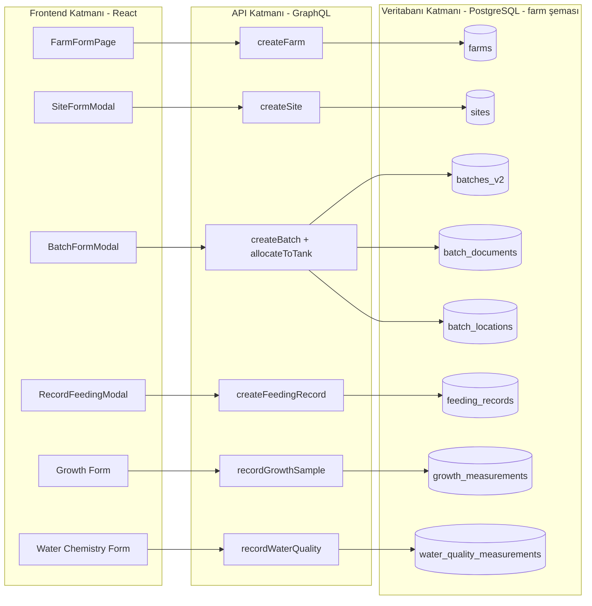
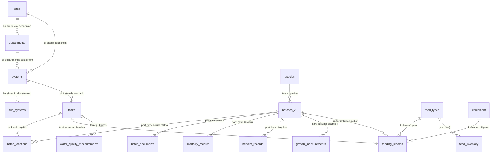
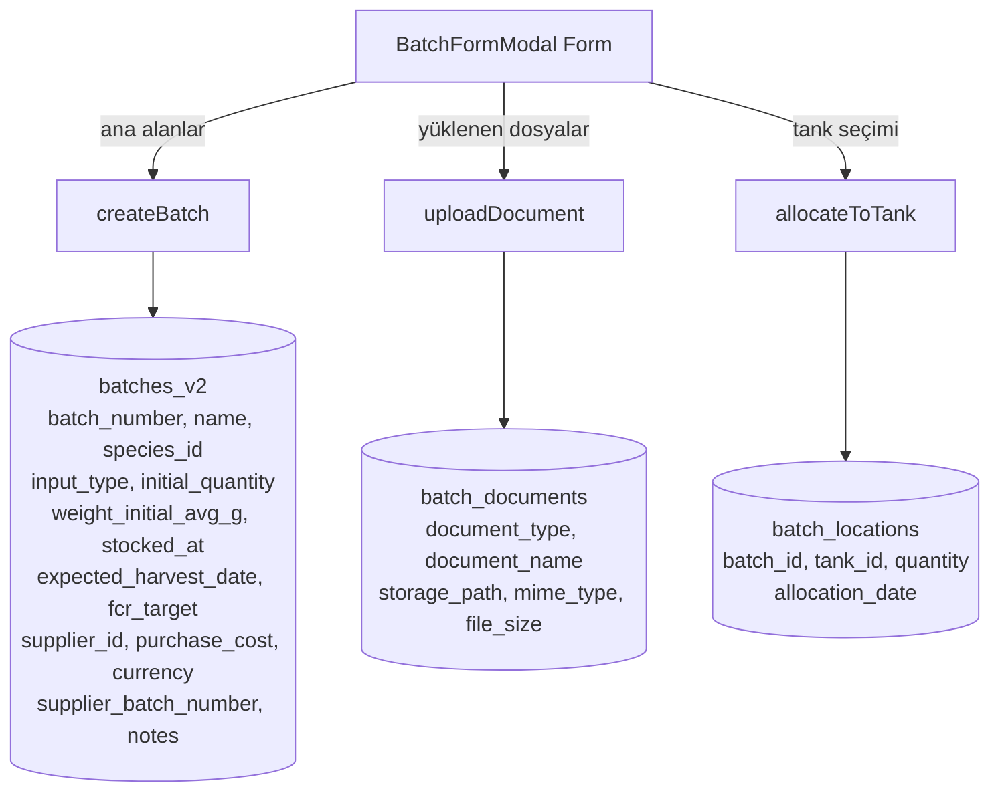

# Farm Modülü — Frontend → Veritabanı Şema Haritası (Görsel)

Bu döküman farm modülünün frontend ekranlarındaki bilgilerin **hangi veritabanı tablosuna** ve **hangi sütuna** yazıldığını şema biçiminde gösterir. Yazılı anlatım için bkz: [farm-modulu-sema-anlatim.md](./farm-modulu-sema-anlatim.md)

> **NOT:** İlk geçişte bazı iddialar yanlış çıktı ve birçok tablo/ekran atlandı. Düzeltmeler ve tamamlayıcı liste için aşağıdaki **§8 Tekrar Kontrol — Düzeltmeler ve Eksikler** bölümüne bakın. O bölümde gerçek durum verilmiştir.

---

## 1. Genel Akış — Üç Katman



---

## 2. Hiyerarşi — Farm İçindeki Tabloların Bağlantısı



---

## 3. Ekran Ekran → Tablo Haritası

### 3.1 FarmFormPage → `farm.farms`

```
┌──────────────────────────────────────────────────────────────────┐
│  EKRAN: FarmFormPage.tsx                                         │
│  MUTATION: createFarm(input: CreateFarmInput!)                   │
│  HEDEF TABLO: farm.farms                                         │
├──────────────────────────────────────────────────────────────────┤
│  Form Alanı        →  API Alanı         →  Tablo Sütunu          │
├──────────────────────────────────────────────────────────────────┤
│  Farm Name         →  name              →  farms.name            │
│  Latitude + Lng    →  location{lat,lng} →  farms.location (JSONB)│
│  Address           →  address           →  farms.address         │
│  Contact Person    →  contactPerson     →  farms.contact_person  │
│  Contact Phone     →  contactPhone      →  farms.contact_phone   │
│  Contact Email     →  contactEmail      →  farms.contact_email   │
│  Description       →  description       →  farms.description     │
│  Total Area        →  totalArea         →  farms.total_area      │
│  Farm Type (UI)    →  type              →  ⚠ şemada karşılığı yok│
└──────────────────────────────────────────────────────────────────┘
```

---

### 3.2 SiteFormModal → `farm.sites`

```
┌──────────────────────────────────────────────────────────────────┐
│  EKRAN: SiteFormModal.tsx                                        │
│  MUTATION: createSite(input: CreateSiteInput!)                   │
│  HEDEF TABLO: farm.sites                                         │
├──────────────────────────────────────────────────────────────────┤
│  Site Name         →  name              →  sites.name            │
│  Site Code         →  code              →  sites.code            │
│  Status            →  status            →  sites.status          │
│  Description       →  description       →  sites.description     │
│  Country           →  country           →  sites.country         │
│  Timezone          →  timezone          →  sites.timezone        │
│  Total Area (m²)   →  totalArea         →  sites.total_area_m2   │
│  Latitude          →  location.latitude →  sites.latitude        │
│  Longitude         →  location.longitude→  sites.longitude       │
│  City              →  address.city      →  sites.city            │
│  Street Address    →  address.street    →  sites.address         │
│  Region/State      →  region            →  ⚠ metadata JSONB      │
│  Postal Code       →  address.postalCode→  ⚠ metadata JSONB      │
│  Site Manager      →  siteManager       →  ⚠ metadata JSONB      │
│  Contact Email     →  contactEmail      →  ⚠ metadata JSONB      │
│  Contact Phone     →  contactPhone      →  ⚠ metadata JSONB      │
└──────────────────────────────────────────────────────────────────┘
```

---

### 3.3 BatchFormModal → `farm.batches_v2` + `batch_documents` + `batch_locations`

Parti oluşturmak **üç tabloya birden** yazar:



```
┌──────────────────────────────────────────────────────────────────────┐
│  Form Alanı             →  Mutation         →  Tablo.Sütun           │
├──────────────────────────────────────────────────────────────────────┤
│  Batch Name             →  createBatch      →  batches_v2.name       │
│  Species                →  createBatch      →  batches_v2.species_id │
│  Strain                 →  createBatch      →  batches_v2.strain     │
│  Input Type             →  createBatch      →  batches_v2.input_type │
│  Initial Quantity       →  createBatch      →  batches_v2.initial_quantity │
│  Average Weight (g)     →  createBatch      →  batches_v2.weight_initial_avg_g │
│  Stocking Date          →  createBatch      →  batches_v2.stocked_at │
│  Expected Harvest Date  →  createBatch      →  batches_v2.expected_harvest_date │
│  Target FCR             →  createBatch      →  batches_v2.fcr_target │
│  Supplier               →  createBatch      →  batches_v2.supplier_id│
│  Purchase Cost          →  createBatch      →  batches_v2.purchase_cost │
│  Currency               →  createBatch      →  batches_v2.currency   │
│  Supplier Batch Number  →  createBatch      →  batches_v2.supplier_batch_number │
│  Notes                  →  createBatch      →  batches_v2.notes      │
│  Arrival Method         →  createBatch      →  ⚠ metadata JSONB      │
│                                                                       │
│  Health Certificate 📎  →  uploadDocument   →  batch_documents.*     │
│  Import Documents  📎   →  uploadDocument   →  batch_documents.*     │
│                                                                       │
│  Tank Selection         →  allocateToTank   →  batch_locations.tank_id │
│  Allocation Quantity    →  allocateToTank   →  batch_locations.quantity │
│  Allocation Date        →  allocateToTank   →  batch_locations.allocation_date │
└──────────────────────────────────────────────────────────────────────┘
```

---

### 3.4 RecordFeedingModal → `farm.feeding_records`

```
┌──────────────────────────────────────────────────────────────────┐
│  EKRAN: RecordFeedingModal                                       │
│  MUTATION: createFeedingRecord                                   │
│  HEDEF TABLO: farm.feeding_records                               │
├──────────────────────────────────────────────────────────────────┤
│  Feeding Date        →  feedingDate        →  feeding_date       │
│  Feeding Time        →  feedingTime        →  feeding_time       │
│  Batch               →  batchId            →  batch_id           │
│  Tank                →  tankId             →  tank_id            │
│  Feed Type           →  feedId             →  feed_id            │
│  Planned Amount (kg) →  plannedAmount      →  planned_amount     │
│  Actual Amount (kg)  →  actualAmount       →  actual_amount      │
│  Waste Amount (kg)   →  wasteAmount        →  waste_amount       │
│  Fish Behavior       →  fishBehavior       →  fish_behavior      │
│  Feeding Method      →  feedingMethod      →  feeding_method     │
│  Equipment           →  equipmentId        →  equipment_id       │
│  Duration (min)      →  feedingDurationMin →  feeding_duration_minutes │
│  Notes               →  notes              →  notes              │
└──────────────────────────────────────────────────────────────────┘
```

---

### 3.5 Growth Form → `farm.growth_measurements`

```
┌──────────────────────────────────────────────────────────────────┐
│  MUTATION: recordGrowthSample                                    │
│  HEDEF TABLO: farm.growth_measurements                           │
├──────────────────────────────────────────────────────────────────┤
│  Measurement Date    →  measurementDate    →  measurement_date   │
│  Batch               →  batchId            →  batch_id           │
│  Tank                →  tankId             →  tank_id            │
│  Sample Size         →  sampleSize         →  sample_size        │
│  Average Weight (g)  →  avgWeightG         →  avg_weight_g       │
│  Total Biomass (kg)  →  totalBiomassKg     →  total_biomass_kg   │
│  FCR (optional)      →  fcr                →  fcr                │
│  Notes               →  notes              →  notes              │
└──────────────────────────────────────────────────────────────────┘
```

---

### 3.6 Water Chemistry Form → `farm.water_quality_measurements`

```
┌──────────────────────────────────────────────────────────────────┐
│  MUTATION: recordWaterQuality                                    │
│  HEDEF TABLO: farm.water_quality_measurements                    │
├──────────────────────────────────────────────────────────────────┤
│  Measurement Date    →  measurementDate    →  measurement_date   │
│  Tank / System       →  tankId / systemId  →  tank_id / system_id│
│  Equipment           →  equipmentId        →  equipment_id       │
│  Notes               →  notes              →  notes              │
│                                                                  │
│  25+ Parametre (pH, DO, NH3, NO2, ... )                          │
│     →  parameterValues                                           │
│     →  parameter_values (JSONB — hepsi tek sütunda)              │
└──────────────────────────────────────────────────────────────────┘
```

---

## 4. Tüm Farm Tabloları — Hızlı Referans

| # | Tablo | Ne Tutar | Frontend Kaynağı |
|---|-------|----------|------------------|
| 1 | `sites` | Üretim tesisleri | SiteFormModal |
| 2 | `departments` | Site içindeki departmanlar | (admin) |
| 3 | `systems` | RAS / akaryakıt vb. sistemler | (admin) |
| 4 | `sub_systems` | Sistem alt bileşenleri | (admin) |
| 5 | `tanks` | Tanklar / kafesler / havuzlar | TankFormModal |
| 6 | `species` | Yetiştirilen türler | SpeciesTab |
| 7 | `batches_v2` | Balık partileri (stok) | BatchFormModal |
| 8 | `batch_documents` | Parti belgeleri (sağlık, ithalat) | BatchFormModal → upload |
| 9 | `batch_locations` | Partinin hangi tankta olduğu | BatchFormModal → allocate |
| 10 | `mortality_records` | Ölüm kayıtları | ⚠ UI eksik |
| 11 | `harvest_records` | Hasat kayıtları | ⚠ UI eksik |
| 12 | `growth_measurements` | Büyüme ölçümleri | Growth Form |
| 13 | `feed_types` | Yem ürünleri kataloğu | FeedsTab |
| 14 | `feeding_protocols` | Yemleme protokolleri | (admin) |
| 15 | `feeding_records` | Günlük yemleme kayıtları | RecordFeedingModal |
| 16 | `feed_inventory` | Yem stok seviyeleri | (admin) |
| 17 | `daily_feeding_executions` | Otomatik yemleyici sonuçları | (sistem) |
| 18 | `feeder_calibrations` | Yemleyici kalibrasyonu | FeederCalibrationSection |
| 19 | `equipment` | Tesis ekipmanları | EquipmentTab |
| 20 | `water_quality_measurements` | Su kalitesi ölçümleri | Water Chemistry Form |
| — | `farms` (legacy) | Eski farm tablosu | FarmFormPage (legacy) |
| — | `ponds` (legacy) | Eski havuz tablosu | legacy createPond |
| — | `batches` (legacy) | Eski parti tablosu | legacy |

---

## 5. Uyarılar ve Bilinmesi Gerekenler

### ⚠ Sorunlu Noktalar

| Konu | Durum | Açıklama |
|------|-------|----------|
| `farms` vs `sites` | Çift kayıt | Hem eski `farms` tablosu hem yeni `sites` tablosu var. Yeni ekranlar `sites`'e yazıyor, eskiler `farms`'a. |
| `batches` vs `batches_v2` | Çift kayıt | Eski `batches` tablosu kullanımdan kalkıyor. Yeni parti kaydı `batches_v2`'ye düşüyor. |
| Site.region/siteManager/contactEmail | Şemada yok | V001 migration'da sütunu yok. Muhtemelen `metadata` JSONB içine gömülüyor. |
| Batch.arrivalMethod | Şemada yok | `metadata` JSONB içine gömülüyor. |
| Water Quality 25+ parametre | JSONB blob | Ayrı sütun değil, tek JSONB içinde. Raporlama zorlaşır. |
| FK constraint eksikleri | 30+ tablo | `batch_id` gibi alanlar tabloda var ama FK yok. Tutarsız veri riski. |
| `schemaName` frontend'den | 🔴 Güvenlik | GraphQL argümanı olarak geliyor; SQL injection riski var (farm-module-review-2026-03-16.md'de detay). |

### ✗ Frontend'i Eksik Mutation'lar

Backend'de var, UI'da yok (farm-module-review-2026-03-16.md §7.3):
- `createHarvestRecord`, `createHealthEvent`, `createGrowthMeasurement`
- `createDepartment`, `createSystem`, `createWorker`
- `createChemical`, `createConsumable`, `createStorageLocation`
- `createMaintenanceSchedule`, `createWorkOrder`, `createSparePart`
- `createSupplier`, `createWaterQualityRecord`

---

## 6. Renk Kodu Özeti

- 🟢 **Yeşil** → Net eşleşme (form → API → sütun)
- 🟡 **Sarı** → Kısmi eşleşme (JSONB'ye gömülüyor veya şemada karşılığı belirsiz)
- 🔴 **Kırmızı** → Eşleşme yok (sütun yok, UI yok veya güvenlik sorunu)

---

## 7. Kaynak Dosyalar

**Frontend:**
- `web/modules/farm-module/src/pages/FarmFormPage.tsx`
- `web/modules/farm-module/src/pages/setup/components/SiteFormModal.tsx`
- `web/modules/farm-module/src/pages/production/components/BatchFormModal.tsx`
- `web/modules/farm-module/src/graphql/feeding.operations.ts`
- `web/modules/farm-module/src/graphql/growth.operations.ts`

**Backend:**
- `apps/farm-service/src/farm/resolvers/farm.resolver.ts`
- `apps/farm-service/src/farm/dto/create-farm.input.ts`
- `apps/farm-service/src/batch/entities/batch.entity.ts`
- `apps/farm-service/src/feeding/entities/feeding-record.entity.ts`
- `apps/farm-service/src/growth/entities/growth-measurement.entity.ts`

**Migration'lar:**
- `database/migrations/modules/farm/V001__farm_initial_schema.sql`
- `database/migrations/modules/farm/V002__add_production_tables.sql`
- `database/migrations/modules/farm/V003__add_ras_tables.sql`
- `database/migrations/modules/farm/V004__add_feeding_tables.sql`
- `database/migrations/modules/farm/V005__add_feeder_calibrations.sql`

**İlgili önceki inceleme:** `docs/farm-module-review-2026-03-16.md`

---

## 8. Tekrar Kontrol — Düzeltmeler ve Eksikler 🔍

İlk geçişin ikinci bir incelemesi sonucunda aşağıdaki düzeltmeler ve tamamlayıcı listeler eklendi.

### 8.1 YANLIŞ İddiaların Düzeltilmesi

| # | Orijinal İddia | Gerçek Durum | Kaynak |
|---|---------------|--------------|--------|
| 1 | **FarmFormPage, `farms` tablosuna kayıt yapıyor** | **YANLIŞ — hiçbir yere kayıt yapmıyor.** Ekran stub. `handleSubmit` sadece `console.log` ve 1sn `setTimeout`, sonra `/sites`'a yönlendiriyor. Arka uç çağrısı yok. | `web/modules/farm-module/src/pages/FarmFormPage.tsx:100-110` |
| 2 | **Site.contactEmail `metadata` JSONB'ye gömülüyor** | **YANLIŞ — gerçek sütun.** `site.entity.ts:229` `contactEmail` VARCHAR(150) olarak tanımlı. | `apps/farm-service/src/site/entities/site.entity.ts:229` |
| 3 | **Site.contactPhone `metadata` JSONB'ye gömülüyor** | **YANLIŞ — gerçek sütun.** `site.entity.ts:225` `contactPhone` VARCHAR(50). | `apps/farm-service/src/site/entities/site.entity.ts:225` |
| 4 | **Batch.arrivalMethod `metadata` JSONB'ye gömülüyor** | **YANLIŞ — gerçek enum sütun.** `batch.entity.ts:292` `ArrivalMethod` enum tipi. | `apps/farm-service/src/batch/entities/batch.entity.ts:289-292` |
| 5 | **`feeder_calibrations` farm şemasında** | **YANLIŞ — `public` şemasında.** V005 migration `farm.` prefix'i olmadan oluşturuyor. Diğer farm tabloları `farm.` şemasında. | `database/migrations/modules/farm/V005__add_feeder_calibrations.sql:5` |
| 6 | **Toplam 20 farm tablosu var** | **YANLIŞ — 71 entity mevcut.** TypeORM `SourceSchemaBootstrapService.synchronize()` ile entity'lerden tablo yaratıyor. Migration dosyaları sadece çekirdek 11 tabloyu içeriyor, gerisi runtime'da oluşuyor. | `apps/farm-service/src/app.module.ts:87`; 71 `*.entity.ts` dosyası |

### 8.2 Atlanan Tablolar (71 entity — gerçek liste)

İlk listem **20 tablo** içeriyordu. Asıl liste **71 entity**. Atlananlar:

**Stok / Depo yönetimi (10 tablo):**
- `storage_locations`, `storage_inventory`, `stock_movements`
- `inventory_counts`, `inventory_count_items`
- `purchase_orders`, `purchase_order_items`
- `consumables`, `chemicals`, `chemical_types`, `chemical_sites`

**Tedarikçi (3 tablo):**
- `suppliers`, `supplier_types`, `supplier_sites`

**Bakım (3 tablo):**
- `maintenance_schedules`, `work_orders`, `spare_parts`

**Sağlık (1 tablo):**
- `health_events`

**Görev / Zamanlama (3 tablo):**
- `tasks`, `auto_rules`, `recurring_templates`

**Hasat (2 tablo):**
- `harvest_plans` (listeliydi), `harvest_records` (listeliydi), ama `harvest_plan` ayrı entity

**Yem (5 tablo):**
- `feed` (ana yem), `feed_sites`, `feed_type_species`, `feeding_programs`, `feeding_program_tanks`, `feeding_tables`

**Ekipman alt yapısı (4 tablo):**
- `equipment_types`, `equipment_systems`, `sub_equipment`, `sub_equipment_types`

**Su kalitesi yapılandırma (2 tablo):**
- `water_quality_parameter_configs`, `water_quality_param_equipment`

**Hava / Deniz / Uydu (5 tablo):**
- `weather_observations`, `weather_settings`, `marine_observations`
- `regulatory_settings`, `sentinel_hub_settings`

**Batch yan tabloları (3 tablo):**
- `batch_feed_assignments`, `tank_allocations`, `tank_batches`, `tank_operations`

**Diğer (6 tablo):**
- `workers`, `site_contacts`, `code_sequences`
- `audit_logs`, `farm_outbox` (event sourcing için)

### 8.3 Atlanan GraphQL Resolver'ları

İlk listede 8 resolver vardı. Gerçekte **36 resolver dosyası**. Atlananlar:

```
apps/farm-service/src/
├── ai-insights/ai-insights.resolver.ts                  ← AI önerileri
├── batch/resolvers/
│   ├── batch-feed-assignment.resolver.ts                ← batch'e yem atama
│   └── cleaner-fish.resolver.ts                         ← temizleyici balık
├── chemical/chemical.resolver.ts                        ← kimyasallar
├── consumable/consumable.resolver.ts                    ← sarf malzemeler
├── department/department.resolver.ts                    ← departmanlar
├── equipment/sub-equipment.resolver.ts                  ← alt ekipman
├── feed/feeding-protocol.resolver.ts                    ← yemleme protokolü
├── feeding/resolvers/feeding-program.resolver.ts        ← yemleme programı
├── fish-health/resolvers/health-event.resolver.ts       ← sağlık olayları
├── harvest/resolvers/harvest-plan.resolver.ts           ← hasat planı
├── harvest/resolvers/harvest.resolver.ts                ← hasat kaydı
├── maintenance/resolvers/
│   ├── maintenance-schedule.resolver.ts                 ← bakım programı
│   ├── spare-part.resolver.ts                           ← yedek parça
│   └── work-order.resolver.ts                           ← iş emri
├── regulatory/regulatory.resolver.ts                    ← düzenleyici raporlar
├── sentinel-hub/sentinel-hub.resolver.ts                ← Sentinel Hub uydu
├── storage/storage.resolver.ts                          ← depo
├── supplier/supplier.resolver.ts                        ← tedarikçi
├── system/system.resolver.ts                            ← RAS sistem
├── task/resolvers/
│   ├── auto-rule.resolver.ts                            ← otomatik kurallar
│   ├── recurring-template.resolver.ts                   ← tekrarlayan şablon
│   └── task.resolver.ts                                 ← görevler
├── water-quality/
│   ├── water-quality-parameter-config.resolver.ts       ← parametre yapıl.
│   └── water-quality.resolver.ts                        ← ölçüm
├── weather/weather.resolver.ts                          ← hava
└── worker/worker.resolver.ts                            ← çalışanlar
```

### 8.4 Atlanan Frontend Sayfaları

İlk listede 6-7 form vardı. Gerçekte **25+ sayfa**:

```
web/modules/farm-module/src/pages/
├── FarmFormPage.tsx                 ← STUB! Kayıt yapmıyor
├── FarmListPage.tsx                 ← Liste
├── FarmDetailPage.tsx               ← Detay
├── MapViewPage.tsx                  ← Harita
├── SensorDashboardPage.tsx          ← Sensör paneli
├── analytics/AnalyticsPage.tsx      ← Analitik
├── cleaner-fish/CleanerFishPage.tsx ← Temizleyici balık
├── company/CompanyPage.tsx          ← Şirket
├── feeding/
│   ├── FeedingPage.tsx              ← Yemleme
│   └── FeedingProgramForm.tsx       ← Yemleme programı
├── harvest/HarvestPlansPage.tsx     ← Hasat planları
├── health/HealthEventsPage.tsx      ← Sağlık olayları
├── maintenance/
│   ├── MaintenanceSchedulesPage.tsx ← Bakım programları
│   ├── SparePartsPage.tsx           ← Yedek parçalar
│   └── WorkOrdersPage.tsx           ← İş emirleri
├── reports/ReportsPage.tsx          ← Raporlar (regülatör)
├── settings/SentinelHubSettingsPage.tsx ← Uydu ayarları
├── setup/SetupPage.tsx              ← Kurulum
├── storage/StoragePage.tsx          ← Depo/Stok
├── tanks/TanksPage.tsx              ← Tanklar
├── tasks/TasksPage.tsx              ← Görevler
└── water-chemistry/WaterChemistryPage.tsx ← Su kimyası
```

### 8.5 GraphQL Olmayan Yazma Yolları (Önemli!)

Veriler sadece GraphQL üzerinden gelmiyor. Atlanan yollar:

| Yol | Dosya | Ne Yazıyor |
|-----|-------|-----------|
| **REST Controller — Batch CRUD** | `apps/farm-service/src/batch/controllers/batch.controller.ts` | `POST /api/batches`, `POST /api/tank-operations/mortality`, `.../cull`, `.../transfer`, `.../harvest` → `batches_v2`, `mortality_records`, `harvest_records`, `tank_operations` |
| **Outbox Event Pattern** | `apps/farm-service/src/outbox/farm-outbox.entity.ts` | `farm_outbox` tablosu — diğer modüllere event yayını için her DB yazması burada da kayıt oluşturuyor |
| **Event Handlers** | `apps/farm-service/src/storage/event-handlers/feeding-storage-event.handler.ts` | Yemleme kaydı atıldığında depo stoğunu otomatik düşüyor → `stock_movements`, `storage_inventory` |
| **Audit Log** | `apps/farm-service/src/audit/audit-log.entity.ts` | Her kritik yazma işlemi `audit_logs` tablosuna kayıt atıyor |
| **Source Schema Bootstrap** | `apps/farm-service/src/app.module.ts:87, 182` | TypeORM `synchronize()` — ilk açılışta entity'lerden tablo yaratıyor. Migration'sız runtime tablo. |

### 8.6 Güncellenmiş Akış Diyagramı

```mermaid
flowchart LR
    subgraph FE[Frontend — React]
        PG1[FarmFormPage - STUB]
        PG2[SiteFormModal]
        PG3[BatchFormModal]
        PG4[FeedingPage]
        PG5[StoragePage]
        PG6[HealthEventsPage]
        PG7[MaintenancePages]
        PG8[TasksPage]
        PG9[ReportsPage]
        PG10[WaterChemistryPage]
    end

    subgraph API[API Katmanı]
        GQL[GraphQL Resolvers<br/>36 dosya]
        REST[REST Controller<br/>Batch ops]
    end

    subgraph BUS[Event / Async]
        OB[farm_outbox]
        EH[Event Handlers]
    end

    subgraph DB[(PostgreSQL — farm şeması<br/>71 tablo)]
        DBcore[Core: sites, tanks, batches_v2...]
        DBstor[Storage: stock_movements, inventory...]
        DBaudit[Audit: audit_logs, farm_outbox]
    end

    PG1 -.->|Hiçbir şey| Void((HİÇ))
    PG2 --> GQL
    PG3 --> GQL
    PG3 --> REST
    PG4 --> GQL
    PG5 --> GQL
    PG6 --> GQL
    PG7 --> GQL
    PG8 --> GQL
    PG9 --> GQL
    PG10 --> GQL
    GQL --> DBcore
    GQL --> OB
    REST --> DBcore
    OB --> EH
    EH --> DBstor
    GQL --> DBaudit
```

### 8.7 Net Kapsam Durumu

| Kategori | İlk Geçiş | Gerçek | Kapsam Oranı |
|----------|-----------|--------|--------------|
| Tablo | ~20 | 71 | %28 |
| Resolver | 8 | 36 | %22 |
| GraphQL Mutation | ~25 | 75+ | %33 |
| Frontend Sayfa | ~7 | 25+ | %28 |
| Yazma Yolu | GraphQL | GraphQL + REST + Outbox/Events | %33 |

İlk geçiş **ana create flow'larını** iyi gösteriyor (farm, site, batch, feeding, growth, water quality) ama modülün tamamı değil. Detaylı ek için bu bölüm eklendi.
