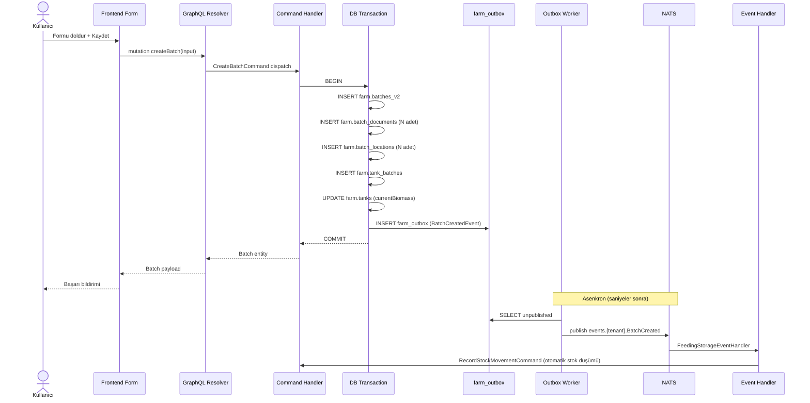
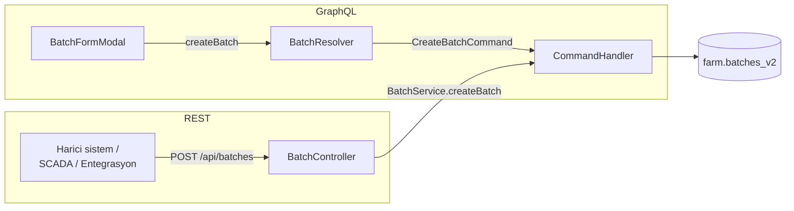
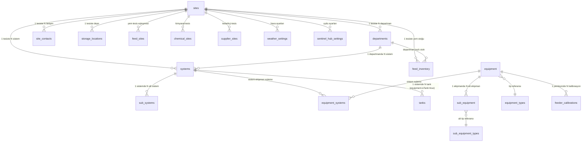
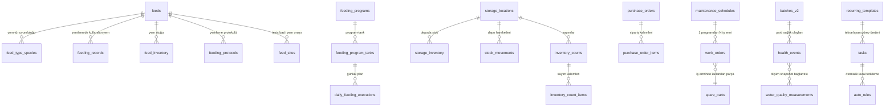

# Farm Modülü — Frontend ↔ Veritabanı Tam Şema Haritası (Görsel Referans)

> **Tarihsel envanter:** Bu dosya 2026 ilkbaharındaki farm modülünü anlatır;
> güncel API veya runtime sözleşmesi değildir. Özellikle eski `MapViewPage`,
> tenant Sentinel credential formu, weather settings ve point/AOI/tile proxy
> bölümleri emekliye ayrılmıştır. Güncel çevresel izleme sözleşmesi için
> `dist/graphql/subgraphs/farm.graphql`,
> `docs/api/openapi/farm-service.yaml` ve
> `docs/runbooks/monitoring/farm-environment-monitoring.md` kaynak alınır.

Bu doküman farm modülünün tüm veri akışlarını, tablolarını ve alan eşleşmelerini görsel ve tablo formatında gösterir. Anlatımsal versiyon için bkz: [`farm-modulu-sema-anlatim.md`](./farm-modulu-sema-anlatim.md).

**Kapsam:** 70 entity, 36 GraphQL resolver, 3 REST controller, 7 event handler, 21 frontend sayfa, 28+ form modal, 500+ form alanı.

---

## İçindekiler

1. [Mimari Genel Bakış](#1-mimari-genel-bakış)
2. [Veri Akışı Diyagramları](#2-veri-akışı-diyagramları)
3. [Tablo Hiyerarşisi (ER)](#3-tablo-hiyerarşisi-er-diyagramı)
4. [Alt Sistem Bazlı Ekran→Tablo Eşleşmeleri](#4-alt-sistem-bazlı-ekrantablo-eşleşmeleri)
5. [Tüm Tablolar — Sütun Bazlı Referans](#5-tüm-tablolar--sütun-bazlı-referans)
6. [GraphQL Mutation ve Query Kataloğu](#6-graphql-mutation-ve-query-kataloğu)
7. [REST Endpoint Kataloğu](#7-rest-endpoint-kataloğu)
8. [Event Handler ve Outbox Akışı](#8-event-handler-ve-outbox-akışı)
9. [Çok Tablolu İşlem Akışları](#9-çok-tablolu-işlem-akışları)
10. [Orphan ve Stub Ekranlar](#10-orphan-ve-stub-ekranlar)
11. [Güvenlik ve Tasarım Notları](#11-güvenlik-ve-tasarım-notları)

---

## 1. Mimari Genel Bakış

Farm modülü beş ana katmandan oluşur:

```
┌─────────────────────────────────────────────────────────────────┐
│ 1. Frontend — React modülü (21 sayfa, 28+ modal, 500+ alan)     │
│    web/modules/farm-module/src/                                 │
└─────────────────────────────────────────────────────────────────┘
                              ↓
┌─────────────────────────────────────────────────────────────────┐
│ 2. API — GraphQL (36 resolver) + REST (3 controller)            │
│    apps/farm-service/src/**/resolvers/                          │
│    apps/farm-service/src/**/controllers/                        │
└─────────────────────────────────────────────────────────────────┘
                              ↓
┌─────────────────────────────────────────────────────────────────┐
│ 3. CQRS — Command / Query Handler (~150 komut, ~90 sorgu)       │
│    apps/farm-service/src/**/handlers/                           │
└─────────────────────────────────────────────────────────────────┘
                              ↓
┌─────────────────────────────────────────────────────────────────┐
│ 4. Event Bus (NATS) + Outbox tablosu                            │
│    apps/farm-service/src/outbox/                                │
│    apps/farm-service/src/events/listeners/                      │
│    apps/farm-service/src/storage/event-handlers/                │
└─────────────────────────────────────────────────────────────────┘
                              ↓
┌─────────────────────────────────────────────────────────────────┐
│ 5. PostgreSQL — 70 entity / tablo                               │
│    Şema: farm (69 tablo) + public (1 tablo: feeder_calibrations)│
└─────────────────────────────────────────────────────────────────┘
```

### Kritik Mimari Kararlar

| Karar                           | Detay                                                                                                           | Referans                                                |
| ------------------------------- | --------------------------------------------------------------------------------------------------------------- | ------------------------------------------------------- |
| **Çok kiracılı (multi-tenant)** | Her tabloda `tenant_id UUID` zorunlu. Tenant ID JWT'den çıkar, istemciden kabul edilmez.                        | `@CurrentTenant()` decorator'ı kullanımı                |
| **TypeORM `synchronize`**       | Migration sadece çekirdek 11 tabloyu tanımlar. Diğer 59 tablo entity'lerden runtime'da oluşur.                  | `apps/farm-service/src/app.module.ts:87,182`            |
| **Soft delete**                 | Kritik tablolarda `is_deleted BOOLEAN`, `deleted_at TIMESTAMPTZ`, `deleted_by UUID`. Fiziksel silme uygulanmaz. | Batch, Feed, Consumable, Chemical, FeedingProgram vb.   |
| **CQRS ayrımı**                 | Command handler yazımları, Query handler okumaları yapar. Birlikte kullanılmaz.                                 | `apps/farm-service/src/**/handlers/`                    |
| **Outbox pattern**              | Her domain command transaction'da `farm.farm_outbox`'a event satırı yazar. Dış worker NATS'e basar.             | `apps/farm-service/src/outbox/farm-outbox.entity.ts:19` |
| **İdempotent event işleme**     | NATS at-least-once teslim verdiği için event handler'lar `idempotencyKey` kullanır.                             | `feeding-storage-event.handler.ts:157`                  |
| **Optimistik kilitleme**        | `@VersionColumn` ile çakışan güncellemeler engellenir.                                                          | Batch, FeedingProgram, Equipment vb.                    |

---

## 2. Veri Akışı Diyagramları

### 2.1 Genel Akış — Üç Katman

```mermaid
flowchart TB
    subgraph FE[Frontend — React]
        direction LR
        FE_Setup[Setup/Core<br/>SiteFormModal<br/>EquipmentTab<br/>SpeciesTab vb.]
        FE_Batch[Batch<br/>BatchFormModal<br/>MortalityModal<br/>TransferModal]
        FE_Feed[Feeding<br/>RecordFeedingModal<br/>FeedingProgramForm]
        FE_Storage[Storage<br/>PurchaseOrderModal<br/>StockMovementModal]
        FE_Maint[Maintenance<br/>Schedules<br/>WorkOrders<br/>SpareParts]
        FE_Health[Health<br/>HealthEvents<br/>Reports modals]
        FE_Task[Tasks<br/>TaskModal<br/>AutoRuleModal]
    end

    subgraph API[API Katmanı]
        direction LR
        GQL[GraphQL<br/>36 resolver<br/>~80 mutation<br/>~60 query]
        REST[REST<br/>BatchController<br/>14 endpoint]
    end

    subgraph CQRS[Command/Query Handler]
        direction LR
        Cmd[Command Handler<br/>~150 dosya]
        Qry[Query Handler<br/>~90 dosya]
    end

    subgraph BUS[Event Bus]
        OUT[(farm_outbox)]
        NATS[NATS Event Bus]
        LSTN[Listeners<br/>7 handler]
    end

    subgraph DB[(PostgreSQL)]
        SCH_FARM[(farm schema<br/>69 tablo)]
        SCH_PUB[(public schema<br/>feeder_calibrations)]
    end

    FE_Setup --> GQL
    FE_Batch --> GQL
    FE_Batch --> REST
    FE_Feed --> GQL
    FE_Storage --> GQL
    FE_Maint --> GQL
    FE_Health --> GQL
    FE_Task --> GQL

    GQL --> Cmd
    GQL --> Qry
    REST --> Cmd

    Cmd --> SCH_FARM
    Cmd --> OUT
    Qry --> SCH_FARM
    Cmd --> SCH_PUB

    OUT --> NATS
    NATS --> LSTN
    LSTN --> Cmd
```

### 2.2 Tipik Mutation Akışı



### 2.3 REST + GraphQL İkili Yazma (Batch)

Batch, iki farklı kanaldan yazılabilir:



Her iki yol aynı command handler'ı çağırır; sonuç aynı tablolara yazılır.

---

## 3. Tablo Hiyerarşisi (ER Diyagramı)

### 3.1 Çekirdek Hiyerarşi



### 3.2 Batch ve Tank İlişkileri

```mermaid
erDiagram
    species ||--o{ batches_v2 : "1 türde N parti"
    batches_v2 ||--o{ batch_documents : "parti belgeleri"
    batches_v2 ||--o{ batch_locations : "parti lokasyon tarihçesi"
    batches_v2 ||--o{ batch_feed_assignments : "parti yem atamaları"
    batches_v2 ||--o{ tank_allocations : "tank atamaları"
    batches_v2 ||--o{ tank_operations : "tank işlem kayıtları"
    batches_v2 ||--o{ mortality_records : "ölüm kayıtları"
    batches_v2 ||--o{ harvest_records : "hasat kayıtları"
    batches_v2 ||--o{ harvest_plans : "hasat planları"
    batches_v2 ||--o{ growth_measurements : "büyüme ölçümleri"
    batches_v2 ||--o{ feeding_records : "yemleme kayıtları"
    batches_v2 ||--o{ feeding_tables : "yemleme tabloları"
    batches_v2 ||--o{ health_events : "sağlık olayları"

    equipment ||--o{ tank_batches : "tank-parti birleşimi"
    equipment ||--o{ tank_allocations : "tanka atama"
    equipment ||--o{ tank_operations : "tankta işlem"
    equipment ||--o{ batch_locations : "parti lokasyonu"
    equipment ||--o{ feeding_records : "tankta yemleme"
    equipment ||--o{ water_quality_measurements : "tank su kalitesi"

    suppliers ||--o{ batches_v2 : "tedarikçi-parti"
    suppliers ||--o{ feeds : "tedarikçi-yem"
    suppliers ||--o{ chemicals : "tedarikçi-kimyasal"
    suppliers ||--o{ consumables : "tedarikçi-sarf"
    suppliers ||--o{ purchase_orders : "tedarikçi-sipariş"
```



### 3.3 Yem, Depo, Sağlık ve Bakım



---

## 4. Alt Sistem Bazlı Ekran→Tablo Eşleşmeleri

Farm modülü 17 alt sistem içerir. Her biri için ekran → form → mutation → tablo zincirinde eşleşme.

### 4.1 Setup / Core (Tesis-Departman-Sistem-Tank-Ekipman-Tür)

**Konum:** `web/modules/farm-module/src/pages/setup/`

| Ekran          | Dosya                                | Hedef Tablo                                               | Mutation                                                                          |
| -------------- | ------------------------------------ | --------------------------------------------------------- | --------------------------------------------------------------------------------- |
| SitesTab       | `setup/tabs/SitesTab.tsx`            | `farm.sites`                                              | `createSite`, `updateSite`, `deleteSite`                                          |
| SiteFormModal  | `setup/components/SiteFormModal.tsx` | `farm.sites`                                              | aynı                                                                              |
| DepartmentsTab | `setup/tabs/DepartmentsTab.tsx`      | `farm.departments`                                        | `createDepartment`, `updateDepartment`, `deleteDepartment`                        |
| SystemsTab     | `setup/tabs/SystemsTab.tsx`          | `farm.systems`, `farm.sub_systems`                        | `createSystem`, `updateSystem`, `deleteSystem`                                    |
| EquipmentTab   | `setup/tabs/EquipmentTab.tsx`        | `farm.equipment`, `farm.sub_equipment`                    | `createEquipment`, `updateEquipment`, `deleteEquipment`, `createSubEquipment` vb. |
| SpeciesTab     | `setup/tabs/SpeciesTab.tsx`          | `farm.species`                                            | `createSpecies`, `updateSpecies`, `deleteSpecies`                                 |
| FeedsTab       | `setup/tabs/FeedsTab.tsx`            | `farm.feeds`, `farm.feed_type_species`, `farm.feed_sites` | `createFeed`, `updateFeed`, `deleteFeed`                                          |
| ChemicalsTab   | `setup/tabs/ChemicalsTab.tsx`        | `farm.chemicals`, `farm.chemical_sites`                   | `createChemical`, `updateChemical`, `deleteChemical`                              |
| SuppliersTab   | `setup/tabs/SuppliersTab.tsx`        | `farm.suppliers`, `farm.supplier_sites`                   | `createSupplier`, `updateSupplier`, `deleteSupplier`                              |

#### SiteFormModal — alan bazlı eşleşme

Konum: `setup/components/SiteFormModal.tsx:13-30`

| Form alanı (UI etiketi) | Field (kod)          | Tip      | Zorunlu | Doğrulama                          | Mutation alanı       | Tablo sütunu                           |
| ----------------------- | -------------------- | -------- | ------- | ---------------------------------- | -------------------- | -------------------------------------- |
| Site Adı                | `name`               | text     | evet    | min 1                              | `input.name`         | `sites.name` (varchar 255)             |
| Site Kodu               | `code`               | text     | evet    | min 2, alphanumeric, uppercase     | `input.code`         | `sites.code` (varchar 50)              |
| Durum                   | `status`             | enum     | hayır   | ACTIVE/INACTIVE/MAINTENANCE/CLOSED | `input.status`       | `sites.status`                         |
| Açıklama                | `description`        | textarea | hayır   | —                                  | `input.description`  | `sites.description` (text)             |
| Ülke                    | `country`            | text     | hayır   | —                                  | `input.country`      | `sites.country`                        |
| Bölge/State             | `region`             | text     | hayır   | —                                  | `input.region`       | `sites.metadata` JSONB ⚠              |
| Sokak Adresi            | `address.street`     | text     | hayır   | —                                  | `input.address`      | `sites.address` (text)                 |
| Şehir                   | `address.city`       | text     | hayır   | —                                  | `input.city`         | `sites.city`                           |
| Posta Kodu              | `address.postalCode` | text     | hayır   | —                                  | `input.postalCode`   | `sites.metadata` JSONB ⚠              |
| Zaman Dilimi            | `timezone`           | text     | hayır   | —                                  | `input.timezone`     | `sites.timezone`                       |
| Toplam Alan (m²)        | `totalArea`          | number   | hayır   | min 0                              | `input.totalAreaM2`  | `sites.total_area_m2` (decimal)        |
| Enlem                   | `location.latitude`  | number   | hayır   | -90..90                            | `input.latitude`     | `sites.latitude`                       |
| Boylam                  | `location.longitude` | number   | hayır   | -180..180                          | `input.longitude`    | `sites.longitude`                      |
| Site Yöneticisi         | `siteManager`        | text     | hayır   | —                                  | `input.siteManager`  | `sites.metadata` JSONB ⚠              |
| İletişim E-postası      | `contactEmail`       | email    | hayır   | regex                              | `input.contactEmail` | `sites.contact_email` (varchar 150) ✅ |
| İletişim Telefonu       | `contactPhone`       | text     | hayır   | —                                  | `input.contactPhone` | `sites.contact_phone` (varchar 50) ✅  |

> **⚠ Not:** `region`, `postalCode`, `siteManager` alanları tabloda ayrı sütun değil, `metadata` JSONB içine gömülür. Bu alanlar üzerinden SQL filtreleme yapılamaz (sadece JSONB path query ile erişilebilir).

### 4.2 Batch (Parti) Yönetimi

**Konum:** `web/modules/farm-module/src/pages/production/`

| Ekran                          | Dosya                                      | Hedef Tablo(lar)                                                                                               | Mutation / REST                                           |
| ------------------------------ | ------------------------------------------ | -------------------------------------------------------------------------------------------------------------- | --------------------------------------------------------- |
| BatchFormModal                 | `production/components/BatchFormModal.tsx` | `batches_v2`, `batch_documents`, `batch_locations`, `tank_allocations`, `tank_batches`, `tanks`, `farm_outbox` | `createBatch` (GraphQL) + `POST /api/batches` (REST)      |
| MortalityModal                 | `production/components/MortalityModal.tsx` | `batches_v2`, `tank_operations`, `tank_batches`, `mortality_records`                                           | `recordMortality` + `POST /api/tank-operations/mortality` |
| CullModal                      | `production/components/CullModal.tsx`      | `batches_v2`, `tank_operations`                                                                                | `recordCull` + `POST /api/tank-operations/cull`           |
| TransferModal                  | `production/components/TransferModal.tsx`  | `tank_batches` (2 satır), `tank_operations` (TRANSFER_OUT + TRANSFER_IN)                                       | `transferBatch` + `POST /api/tank-operations/transfer`    |
| (kapatma) Batch detail → Close | Batch detail sayfası                       | `batches_v2`                                                                                                   | `closeBatch` mutation                                     |
| BatchFeedAssignment            | Batch detail tabs                          | `batch_feed_assignments`                                                                                       | `assignFeedsToBatch`                                      |

#### BatchFormModal — alan bazlı eşleşme (15 temel alan + arrays)

Konum: `production/components/BatchFormModal.tsx`

**Tab 1 — Temel Bilgiler (11 alan):**

| Form alanı            | Field                 | Tip           | Zorunlu | Doğrulama                                                           | Mutation alanı                  | Tablo sütunu                                       |
| --------------------- | --------------------- | ------------- | ------- | ------------------------------------------------------------------- | ------------------------------- | -------------------------------------------------- |
| Parti Adı             | `name`                | text          | evet    | —                                                                   | `input.name`                    | `batches_v2.name`                                  |
| Tür                   | `speciesId`           | UUID (select) | evet    | —                                                                   | `input.speciesId`               | `batches_v2.species_id`                            |
| Tedarikçi             | `supplierId`          | UUID (select) | evet    | —                                                                   | `input.supplierId`              | `batches_v2.supplier_id`                           |
| Tedarikçi Parti No    | `supplierBatchNumber` | text          | hayır   | —                                                                   | `input.supplierBatchNumber`     | `batches_v2.supplier_batch_number`                 |
| Irk / Strain          | `strain`              | text          | hayır   | —                                                                   | `input.strain`                  | `batches_v2.strain`                                |
| Giriş Tipi            | `inputType`           | enum          | evet    | EGGS/LARVAE/POST_LARVAE/FRY/FINGERLINGS/JUVENILES/ADULTS/BROODSTOCK | `input.inputType`               | `batches_v2.input_type`                            |
| Başlangıç Adedi       | `initialQuantity`     | number        | evet    | >0                                                                  | `input.initialQuantity`         | `batches_v2.initial_quantity`                      |
| Ortalama Ağırlık (g)  | `avgWeightG`          | number        | evet    | step 0.001, >0                                                      | `input.initialWeight.avgWeight` | `batches_v2.weight_initial_avg_g`                  |
| Stoklama Tarihi       | `stockedAt`           | date          | evet    | —                                                                   | `input.stockedAt`               | `batches_v2.stocked_at`                            |
| Beklenen Hasat Tarihi | `expectedHarvestDate` | date          | hayır   | —                                                                   | `input.expectedHarvestDate`     | `batches_v2.expected_harvest_date`                 |
| Geliş Yöntemi         | `arrivalMethod`       | enum          | evet    | AIR_CARGO/TRUCK/BOAT/RAIL/LOCAL_PICKUP/OTHER                        | `input.arrivalMethod`           | `batches_v2.arrival_method` ✅ (gerçek enum sütun) |
| Hedef FCR             | `targetFCR`           | number        | evet    | 0.5–5.0                                                             | `input.targetFCR`               | `batches_v2.fcr_target`                            |
| Satın Alma Maliyeti   | `purchaseCost`        | number        | hayır   | min 0                                                               | `input.purchaseCost`            | `batches_v2.purchase_cost`                         |
| Para Birimi           | `currency`            | text          | hayır   | ISO 4217                                                            | `input.currency`                | `batches_v2.currency`                              |
| Notlar                | `notes`               | textarea      | hayır   | max 5000                                                            | `input.notes`                   | `batches_v2.notes`                                 |

**Tab 2 — Belgeler (iki dosya yükleme dizisi):**

| Form alanı                   | Field                  | Tip         | Zorunlu        | Mutation alanı               | Tablo sütunu                                          |
| ---------------------------- | ---------------------- | ----------- | -------------- | ---------------------------- | ----------------------------------------------------- |
| Sağlık Sertifikaları (max 5) | `healthCertificates[]` | file[]      | evet (en az 1) | `input.healthCertificates[]` | `batch_documents` — her dosya bir satır               |
| Belge Adı                    | `.documentName`        | text        | evet           | `.documentName`              | `batch_documents.document_name`                       |
| Belge Numarası               | `.documentNumber`      | text        | hayır          | `.documentNumber`            | `batch_documents.document_number`                     |
| Düzenleme Tarihi             | `.issueDate`           | date        | hayır          | `.issueDate`                 | `batch_documents.issue_date`                          |
| Son Geçerlilik               | `.expiryDate`          | date        | hayır          | `.expiryDate`                | `batch_documents.expiry_date`                         |
| Düzenleyen Kurum             | `.issuingAuthority`    | text        | hayır          | `.issuingAuthority`          | `batch_documents.issuing_authority`                   |
| Dosya (MinIO path)           | `.storagePath`         | text (auto) | evet           | `.storagePath`               | `batch_documents.storage_path`                        |
| İthalat Belgeleri (max 5)    | `importDocuments[]`    | file[]      | hayır          | `input.importDocuments[]`    | aynı yapıda `batch_documents`, `document_type=IMPORT` |

> Dosya yükleme iki aşamalı: önce `useUploadBatchDocument()` MinIO'ya POST eder, dönen `{documentId, storagePath, storageUrl}` mutation input'una eklenir. Mutation sadece metadata yazar.

**Tab 3 — Tank Atamaları (array, min 1):**

| Form alanı             | Field                      | Tip           | Zorunlu | Doğrulama                    | Mutation alanı                    | Tablo sütunu                                            |
| ---------------------- | -------------------------- | ------------- | ------- | ---------------------------- | --------------------------------- | ------------------------------------------------------- |
| Tank                   | `tankAllocations[].tankId` | UUID (select) | evet    | —                            | `input.initialLocations[].tankId` | `batch_locations.tank_id`, `tank_allocations.tank_id`   |
| Miktar                 | `.quantity`                | number        | evet    | toplam = initialQuantity     | `.quantity`                       | `batch_locations.quantity`, `tank_allocations.quantity` |
| Biyokütle (hesaplanan) | `.biomass`                 | number (auto) | —       | quantity × avgWeightG / 1000 | `.biomass`                        | `batch_locations.biomass`                               |
| Atama Tarihi           | `.allocationDate`          | date          | hayır   | default: stockedAt           | `.allocationDate`                 | `tank_allocations.allocation_date`                      |

**Tab 4 — Notlar:**

Tek alan, `notes` → `batches_v2.notes`.

#### MortalityModal — alan bazlı eşleşme

Konum: `production/components/MortalityModal.tsx`

| Form alanı           | Field        | Tip      | Zorunlu              | Mutation alanı     | Tablo sütunu                                                                       |
| -------------------- | ------------ | -------- | -------------------- | ------------------ | ---------------------------------------------------------------------------------- |
| Miktar               | `quantity`   | number   | evet                 | `input.quantity`   | `mortality_records.count`, `batches_v2.total_mortality` (+=)                       |
| Ortalama Ağırlık (g) | `avgWeightG` | number   | hayır (display+edit) | `input.avgWeightG` | `mortality_records.estimated_biomass_loss` (hesap)                                 |
| Sebep                | `reason`     | enum     | evet                 | `input.reason`     | `mortality_records.cause` (DISEASE/STARVATION/WATER_QUALITY/PREDATION/UNKNOWN/...) |
| Detay                | `detail`     | text     | hayır                | `input.detail`     | `mortality_records.cause_detail`                                                   |
| Gözlem Tarihi        | `observedAt` | datetime | evet                 | `input.observedAt` | `mortality_records.record_date`                                                    |
| Notlar               | `notes`      | textarea | evet                 | `input.notes`      | `mortality_records.notes`                                                          |

### 4.3 Feeding (Yemleme)

**Konum:** `web/modules/farm-module/src/pages/feeding/`

| Ekran                                    | Dosya                                       | Hedef Tablo                                                                                                | Mutation                                         |
| ---------------------------------------- | ------------------------------------------- | ---------------------------------------------------------------------------------------------------------- | ------------------------------------------------ |
| RecordFeedingModal                       | `feeding/components/RecordFeedingModal.tsx` | `feeding_records`, `feed_inventory`, `stock_movements` (event), `storage_inventory` (event), `farm_outbox` | `createFeedingRecord`                            |
| FeedingProgramForm                       | `feeding/FeedingProgramForm.tsx`            | `feeding_programs`, `feeding_program_tanks`                                                                | `createFeedingProgram`, `updateFeedingProgram`   |
| (yemleme protokolü) SetupPage > FeedsTab | `setup/tabs/FeedsTab.tsx`                   | `feeding_protocols`                                                                                        | `createFeedingProtocol`, `updateFeedingProtocol` |
| FeederCalibrationSection                 | EquipmentTab içi                            | `feeder_calibrations` (public şema)                                                                        | `saveFeederCalibrations`                         |

#### RecordFeedingModal — alan bazlı eşleşme

| Form alanı            | Field                    | Tip           | Zorunlu | Doğrulama                  | Mutation alanı                 | Tablo sütunu                                |
| --------------------- | ------------------------ | ------------- | ------- | -------------------------- | ------------------------------ | ------------------------------------------- |
| Parti                 | `batchId`                | UUID (select) | evet    | —                          | `input.batchId`                | `feeding_records.batch_id`                  |
| Tank                  | `tankId`                 | UUID (select) | hayır   | —                          | `input.tankId`                 | `feeding_records.tank_id`                   |
| Yemleme Tarihi        | `feedingDate`            | date          | evet    | —                          | `input.feedingDate`            | `feeding_records.feeding_date`              |
| Yemleme Saati         | `feedingTime`            | time (HH:MM)  | evet    | —                          | `input.feedingTime`            | `feeding_records.feeding_time` (varchar 10) |
| Öğün Sırası           | `feedingSequence`        | number        | evet    | min 1, default 1           | `input.feedingSequence`        | `feeding_records.feeding_sequence`          |
| Günlük Toplam Öğün    | `totalMealsToday`        | number        | evet    | min 1, default 1           | `input.totalMealsToday`        | `feeding_records.total_meals_today`         |
| Yem                   | `feedId`                 | UUID (select) | evet    | —                          | `input.feedId`                 | `feeding_records.feed_id`                   |
| Yem Parti No          | `feedBatchNumber`        | text          | hayır   | —                          | `input.feedBatchNumber`        | `feeding_records.feed_batch_number`         |
| Planlanan Miktar (kg) | `plannedAmount`          | number        | evet    | min 0                      | `input.plannedAmount`          | `feeding_records.planned_amount`            |
| Fiili Miktar (kg)     | `actualAmount`           | number        | evet    | min 0                      | `input.actualAmount`           | `feeding_records.actual_amount`             |
| Fire (kg)             | `wasteAmount`            | number        | hayır   | min 0                      | `input.wasteAmount`            | `feeding_records.waste_amount`              |
| Varyans (kg)          | hesap                    | auto          | —       | planned − actual           | `input.variance`               | `feeding_records.variance` (computed)       |
| Varyans (%)           | hesap                    | auto          | —       | —                          | `input.variancePercent`        | `feeding_records.variance_percent`          |
| Ortam Koşulları       | `environment.*`          | nested        | hayır   | —                          | `input.environment`            | `feeding_records.environment` (JSONB)       |
| → Su Sıcaklığı        | `.waterTemp`             | number        | —       | —                          | `.waterTemp`                   | JSONB                                       |
| → Çözünmüş Oksijen    | `.dissolvedOxygen`       | number        | —       | —                          | `.dissolvedOxygen`             | JSONB                                       |
| → Hava Durumu         | `.weather`               | enum          | —       | —                          | `.weather`                     | JSONB                                       |
| → Rüzgar Seviyesi     | `.windLevel`             | enum          | —       | —                          | `.windLevel`                   | JSONB                                       |
| → Görüş               | `.visibility`            | enum          | —       | —                          | `.visibility`                  | JSONB                                       |
| Balık Davranışı       | `fishBehavior.*`         | nested        | hayır   | —                          | `input.fishBehavior`           | `feeding_records.fish_behavior` (JSONB)     |
| → İştah               | `.appetite`              | enum          | —       | POOR/NORMAL/GOOD/EXCELLENT | `.appetite`                    | JSONB                                       |
| → Yemleme Şiddeti     | `.feedingIntensity`      | number        | —       | 1–5                        | `.feedingIntensity`            | JSONB                                       |
| → Yüzey Hareketi      | `.surfaceActivity`       | enum          | —       | —                          | `.surfaceActivity`             | JSONB                                       |
| → Sürü Davranışı      | `.schoolingBehavior`     | enum          | —       | —                          | `.schoolingBehavior`           | JSONB                                       |
| → Anormal Davranış    | `.abnormalBehavior`      | text          | —       | —                          | `.abnormalBehavior`            | JSONB                                       |
| Yemleme Yöntemi       | `feedingMethod`          | enum          | evet    | MANUAL/AUTOMATIC           | `input.feedingMethod`          | `feeding_records.feeding_method`            |
| Ekipman               | `equipmentId`            | UUID (select) | hayır   | —                          | `input.equipmentId`            | `feeding_records.equipment_id`              |
| Süre (dk)             | `feedingDurationMinutes` | number        | hayır   | min 0                      | `input.feedingDurationMinutes` | `feeding_records.feeding_duration_minutes`  |
| Yem Maliyeti          | `feedCost`               | number        | hayır   | —                          | `input.feedCost`               | `feeding_records.feed_cost`                 |
| Para Birimi           | `currency`               | text          | hayır   | —                          | `input.currency`               | `feeding_records.currency`                  |
| Yemleyen Kişi         | `fedBy`                  | UUID          | evet    | —                          | `input.fedBy`                  | `feeding_records.fed_by`                    |
| Doğrulayan Kişi       | `verifiedBy`             | UUID          | hayır   | —                          | `input.verifiedBy`             | `feeding_records.verified_by`               |
| Notlar                | `notes`                  | textarea      | hayır   | —                          | `input.notes`                  | `feeding_records.notes`                     |
| Atlandıysa Sebep      | `skipReason`             | text          | hayır   | —                          | `input.skipReason`             | `feeding_records.skip_reason`               |

**Yan etki:** `createFeedingRecord` tetiklendikten sonra `FeedingRecordedEvent` yayınlanır. `FeedingStorageEventHandler` bunu dinleyip:

- `feed_inventory.quantity_kg` azaltır (FEFO sırasıyla)
- `stock_movements`'a `OUT` hareketi yazar
- `idempotencyKey=feeding-deduct-{eventId}` ile tekrarları engeller

### 4.4 Growth (Büyüme)

**Konum:** `web/modules/farm-module/src/graphql/growth.operations.ts` + batch detay altında

| Ekran / Operation          | Hedef Tablo                                              | Mutation             |
| -------------------------- | -------------------------------------------------------- | -------------------- |
| Growth form (batch detail) | `growth_measurements`, opsiyonel `batches_v2` güncelleme | `recordGrowthSample` |
| Verify                     | `growth_measurements`                                    | `verifyMeasurement`  |

#### Growth örnek alan → sütun eşleşmesi

| Form alanı                | Field                      | Mutation alanı                   | Tablo sütunu                                                |
| ------------------------- | -------------------------- | -------------------------------- | ----------------------------------------------------------- |
| Ölçüm Tarihi              | `measurementDate`          | `input.measurementDate`          | `growth_measurements.measurement_date`                      |
| Parti                     | `batchId`                  | `input.batchId`                  | `growth_measurements.batch_id`                              |
| Tank                      | `tankId`                   | `input.tankId`                   | `growth_measurements.tank_id`                               |
| Ölçüm Tipi                | `measurementType`          | `input.measurementType`          | `growth_measurements.measurement_type` (enum)               |
| Ölçüm Yöntemi             | `measurementMethod`        | `input.measurementMethod`        | `growth_measurements.measurement_method`                    |
| Örneklem Büyüklüğü        | `sampleSize`               | `input.sampleSize`               | `growth_measurements.sample_size`                           |
| Populasyon Büyüklüğü      | `populationSize`           | `input.populationSize`           | `growth_measurements.population_size`                       |
| Bireysel Ölçümler         | `individualMeasurements[]` | `input.individualMeasurements[]` | `growth_measurements.individual_measurements` (JSONB array) |
| Ortalama Ağırlık (g)      | `averageWeight`            | `input.averageWeight`            | `growth_measurements.average_weight`                        |
| Ortalama Boy (cm)         | `averageLength`            | `input.averageLength`            | `growth_measurements.average_length`                        |
| Varyasyon Katsayısı       | `weightCV`                 | hesap                            | `growth_measurements.weight_cv` (computed)                  |
| Koşul Faktörü             | `conditionFactor`          | hesap                            | `growth_measurements.condition_factor` (computed)           |
| Önceki Biyokütle          | `previousBiomass`          | `input.previousBiomass`          | `growth_measurements.previous_biomass`                      |
| Biyokütle Artışı          | `biomassGain`              | hesap                            | `growth_measurements.biomass_gain` (computed)               |
| Tahmini Biyokütle         | `estimatedBiomass`         | hesap                            | `growth_measurements.estimated_biomass`                     |
| Batch Ağırlığını Güncelle | `updateBatchWeight`        | `input.updateBatchWeight`        | — (flag; true ise `batches_v2.weight_actual_*` güncellenir) |
| Notlar                    | `notes`                    | `input.notes`                    | `growth_measurements.notes`                                 |

### 4.5 Water Chemistry (Su Kimyası)

**Konum:** `web/modules/farm-module/src/pages/water-chemistry/`

| Ekran                  | Dosya                                                | Hedef Tablo                               | Mutation                                                                  |
| ---------------------- | ---------------------------------------------------- | ----------------------------------------- | ------------------------------------------------------------------------- |
| WaterChemistryPage     | `water-chemistry/WaterChemistryPage.tsx`             | — (parent)                                | —                                                                         |
| RecordTab              | `water-chemistry/components/RecordTab.tsx`           | `water_quality_measurements`              | `recordReading` / `createWaterQualityMeasurement`                         |
| ConfigFormModal        | `water-chemistry/components/ConfigFormModal.tsx`     | `water_quality_parameter_configs`         | `createParameterConfig`, `updateParameterConfig`, `deleteParameterConfig` |
| TemplatePickerModal    | `water-chemistry/components/TemplatePickerModal.tsx` | `water_quality_parameter_configs` (toplu) | `bulkCreateFromTemplate`                                                  |
| (param-ekipman eşleme) | ConfigForm veya ek sekme                             | `water_quality_param_equipment`           | `bulkMapParamsEquipment`                                                  |

#### Ölçüm kaydı alan → sütun

Ölçüm formu dinamiktir — yapılandırılmış her parametre için bir input gelir. Temel alanlar:

| Form alanı                                                  | Field                    | Mutation alanı          | Tablo sütunu                                             |
| ----------------------------------------------------------- | ------------------------ | ----------------------- | -------------------------------------------------------- |
| Ölçüm Tarihi                                                | `measurementDate`        | `input.measurementDate` | `water_quality_measurements.measurement_date`            |
| Tank                                                        | `tankId`                 | `input.tankId`          | `water_quality_measurements.tank_id`                     |
| Sistem                                                      | `systemId`               | `input.systemId`        | `water_quality_measurements.system_id`                   |
| Ekipman                                                     | `equipmentId`            | `input.equipmentId`     | `water_quality_measurements.equipment_id`                |
| Ölçen                                                       | `measuredBy`             | `input.measuredBy`      | `water_quality_measurements.measured_by`                 |
| Notlar                                                      | `notes`                  | `input.notes`           | `water_quality_measurements.notes`                       |
| **25+ parametre** (pH, DO, NH3, NO2, sıcaklık, tuzluluk...) | `parameterValues.{code}` | `input.parameterValues` | `water_quality_measurements.parameter_values` (JSONB) ⚠ |

> **⚠ JSONB notu:** Tüm parametre değerleri tek JSONB sütununa gömülür. SQL filtreleme `WHERE parameter_values->>'pH' > '8.0'` şeklinde JSONB path ile yapılır — standart indexli karşılaştırmalar uygulanmaz.

#### ConfigFormModal — parametre tanımı

| Form alanı   | Field            | Tip      | Zorunlu      | Mutation alanı        | Tablo sütunu                                  |
| ------------ | ---------------- | -------- | ------------ | --------------------- | --------------------------------------------- | -------------------------------------------------- |
| Kod          | `code`           | text     | evet, unique | `input.code`          | `water_quality_parameter_configs.code`        |
| Ad           | `name`           | text     | evet         | `input.name`          | `water_quality_parameter_configs.name`        |
| Birim        | `unit`           | text     | evet         | `input.unit`          | `water_quality_parameter_configs.unit`        |
| Veri Tipi    | `dataType`       | enum     | evet         | NUMBER/TEXT/BOOLEAN   | `input.dataType`                              | `water_quality_parameter_configs.data_type`        |
| Grup         | `group`          | enum     | evet         | BASIC/ADVANCED/CUSTOM | `input.group`                                 | `water_quality_parameter_configs.group`            |
| Hassasiyet   | `precision`      | number   | hayır        | —                     | `input.precision`                             | `water_quality_parameter_configs.precision`        |
| Optimum Min  | `optimalMin`     | number   | hayır        | —                     | `input.optimalMin`                            | `water_quality_parameter_configs.optimal_min`      |
| Optimum Max  | `optimalMax`     | number   | hayır        | —                     | `input.optimalMax`                            | `water_quality_parameter_configs.optimal_max`      |
| Uyarı Min    | `warningMin`     | number   | hayır        | —                     | `input.warningMin`                            | `water_quality_parameter_configs.warning_min`      |
| Uyarı Max    | `warningMax`     | number   | hayır        | —                     | `input.warningMax`                            | `water_quality_parameter_configs.warning_max`      |
| Kritik Min   | `criticalMin`    | number   | hayır        | —                     | `input.criticalMin`                           | `water_quality_parameter_configs.critical_min`     |
| Kritik Max   | `criticalMax`    | number   | hayır        | —                     | `input.criticalMax`                           | `water_quality_parameter_configs.critical_max`     |
| Grafik Rengi | `chartColor`     | color    | hayır        | default `#3B82F6`     | `input.chartColor`                            | `water_quality_parameter_configs.chart_color`      |
| Eksen Grubu  | `chartAxisGroup` | enum     | hayır        | LEFT/RIGHT            | `input.chartAxisGroup`                        | `water_quality_parameter_configs.chart_axis_group` |
| Görünür      | `isVisible`      | checkbox | —            | `input.isVisible`     | `water_quality_parameter_configs.is_visible`  |
| Zorunlu      | `isRequired`     | checkbox | —            | `input.isRequired`    | `water_quality_parameter_configs.is_required` |

### 4.6 Storage / Inventory (Depo ve Stok)

**Konum:** `web/modules/farm-module/src/pages/storage/`

| Ekran                                    | Dosya                                              | Hedef Tablo                                               | Mutation                                                                     |
| ---------------------------------------- | -------------------------------------------------- | --------------------------------------------------------- | ---------------------------------------------------------------------------- |
| CreatePurchaseOrderModal                 | `storage/components/CreatePurchaseOrderModal.tsx`  | `purchase_orders`, `purchase_order_items`                 | `createPurchaseOrder`                                                        |
| ReceiveDeliveryModal                     | `storage/components/ReceiveDeliveryModal.tsx`      | `purchase_orders`, `storage_inventory`, `stock_movements` | `receiveDelivery`                                                            |
| RecordStockMovementModal                 | `storage/components/RecordStockMovementModal.tsx`  | `stock_movements`, `storage_inventory`                    | `recordStockMovement`                                                        |
| TransferStockModal                       | `storage/components/TransferStockModal.tsx`        | `stock_movements` (2 satır), `storage_inventory`          | `transferStock`                                                              |
| StartInventoryCountModal                 | `storage/components/StartInventoryCountModal.tsx`  | `inventory_counts`, `inventory_count_items`               | `createInventoryCount`                                                       |
| InventoryCountDetailModal                | `storage/components/InventoryCountDetailModal.tsx` | `inventory_count_items`                                   | `updateInventoryCountItems`, `submitInventoryCount`, `approveInventoryCount` |
| (depo konumu) StoragePage > LocationsTab | `storage/StoragePage.tsx`                          | `storage_locations`                                       | `createStorageLocation`, `updateStorageLocation`, `deleteStorageLocation`    |

#### CreatePurchaseOrderModal

| Form alanı           | Field                  | Tip         | Zorunlu  | Mutation alanı                      | Tablo sütunu                             |
| -------------------- | ---------------------- | ----------- | -------- | ----------------------------------- | ---------------------------------------- | -------------------------- |
| Kategori             | `category`             | enum        | evet     | FEED/CHEMICAL/CONSUMABLE/HEALTHCARE | `input.category`                         | `purchase_orders.category` |
| Tedarikçi Adı        | `supplierName`         | text        | evet     | `input.supplierName`                | `purchase_orders.supplier_name`          |
| Tedarikçi İletişim   | `supplierContact`      | text        | hayır    | `input.supplierContact`             | `purchase_orders.supplier_contact`       |
| Beklenen Teslim      | `expectedDeliveryDate` | date        | hayır    | `input.expectedDeliveryDate`        | `purchase_orders.expected_delivery_date` |
| Notlar               | `notes`                | textarea    | hayır    | `input.notes`                       | `purchase_orders.notes`                  |
| Toplam Tutar (hesap) | auto                   | number      | —        | —                                   | `purchase_orders.total_amount`           |
| Kalem Öğe ID         | `items[].itemId`       | UUID        | evet     | `input.items[].itemId`              | `purchase_order_items.item_id`           |
| Kalem Adı            | `.itemName`            | text (auto) | —        | `.itemName`                         | `purchase_order_items.item_name`         |
| Kalem Kodu           | `.itemCode`            | text (auto) | —        | `.itemCode`                         | `purchase_order_items.item_code`         |
| Miktar               | `.quantity`            | number      | evet, >0 | `.quantity`                         | `purchase_order_items.quantity`          |
| Birim                | `.unit`                | text (auto) | —        | `.unit`                             | `purchase_order_items.unit`              |
| Birim Fiyat          | `.unitPrice`           | number      | hayır    | `.unitPrice`                        | `purchase_order_items.unit_price`        |
| Kalem Toplamı        | auto                   | —           | —        | —                                   | `purchase_order_items.total_price`       |

#### RecordStockMovementModal

| Form alanı     | Field          | Zorunlu                | Mutation alanı                                                                                                                                    | Tablo sütunu                       |
| -------------- | -------------- | ---------------------- | ------------------------------------------------------------------------------------------------------------------------------------------------- | ---------------------------------- | ------------------------------- |
| Hareket Tipi   | `movementType` | evet                   | IN / OUT / TRANSFER / WASTE / ADJUSTMENT / RETURN (6 değer — kod referansı: `apps/farm-service/src/storage/entities/stock-movement.entity.ts:14`) | `input.movementType`               | `stock_movements.movement_type` |
| Kalem          | `itemId`       | evet                   | `input.itemId`                                                                                                                                    | `stock_movements.item_id`          |
| Kaynak Konum   | `fromLocation` | koşullu (OUT/TRANSFER) | `input.fromLocationId`                                                                                                                            | `stock_movements.from_location_id` |
| Hedef Konum    | `toLocation`   | koşullu (IN/TRANSFER)  | `input.toLocationId`                                                                                                                              | `stock_movements.to_location_id`   |
| Miktar         | `quantity`     | evet, >0               | `input.quantity`                                                                                                                                  | `stock_movements.quantity`         |
| Birim          | `unit`         | auto                   | `input.unit`                                                                                                                                      | `stock_movements.unit`             |
| Sebep          | `reason`       | ADJUSTMENT için evet   | `input.reason`                                                                                                                                    | `stock_movements.reason`           |
| Notlar         | `notes`        | hayır                  | `input.notes`                                                                                                                                     | `stock_movements.notes`            |
| Hareket Tarihi | `movementDate` | evet                   | `input.movementDate`                                                                                                                              | `stock_movements.movement_date`    |

### 4.7 Supplier (Tedarikçi)

**Konum:** SetupPage > SuppliersTab + PurchaseOrder akışı

Hedef tablolar: `farm.suppliers`, `farm.supplier_types`, `farm.supplier_sites`.

| Alan            | Mutation alanı          | Tablo sütunu                 |
| --------------- | ----------------------- | ---------------------------- |
| Kod             | `input.code`            | `suppliers.code`             |
| Ad              | `input.name`            | `suppliers.name`             |
| Tür             | `input.supplierTypeId`  | `suppliers.supplier_type_id` |
| İletişim Kişisi | `input.contactPerson`   | `suppliers.contact_person`   |
| E-posta         | `input.contactEmail`    | `suppliers.contact_email`    |
| Telefon         | `input.contactPhone`    | `suppliers.contact_phone`    |
| Adres           | `input.address`         | `suppliers.address`          |
| Şehir           | `input.city`            | `suppliers.city`             |
| Ülke            | `input.country`         | `suppliers.country`          |
| Ödeme Koşulları | `input.paymentTerms`    | `suppliers.payment_terms`    |
| Tesis Onayı     | `input.approvedSites[]` | `supplier_sites` (N satır)   |

### 4.8 Maintenance (Bakım)

**Konum:** `web/modules/farm-module/src/pages/maintenance/`

| Ekran                    | Dosya                                      | Hedef Tablo                             | Mutation                                                                     |
| ------------------------ | ------------------------------------------ | --------------------------------------- | ---------------------------------------------------------------------------- |
| MaintenanceSchedulesPage | `maintenance/MaintenanceSchedulesPage.tsx` | `maintenance_schedules`                 | `createSchedule`, `updateSchedule`, `deleteSchedule`, `closeSchedule`        |
| WorkOrdersPage           | `maintenance/WorkOrdersPage.tsx`           | `work_orders`, `spare_parts` (kullanım) | `createWorkOrder`, `updateWorkOrder`, `completeWorkOrder`, `cancelWorkOrder` |
| SparePartsPage           | `maintenance/SparePartsPage.tsx`           | `spare_parts`                           | `createSparepart`, `updateSparepart`, `deleteSparepart`                      |

#### MaintenanceSchedulesPage — temel alanlar (16)

| Form alanı            | Field                      | Mutation alanı                                    | Tablo sütunu                                       |
| --------------------- | -------------------------- | ------------------------------------------------- | -------------------------------------------------- |
| Program Kodu          | `scheduleCode`             | `input.scheduleCode`                              | `maintenance_schedules.schedule_code`              |
| Ad                    | `name`                     | `input.name`                                      | `maintenance_schedules.name`                       |
| Açıklama              | `description`              | `input.description`                               | `maintenance_schedules.description`                |
| Kategori              | `category`                 | enum: PREVENTIVE/CORRECTIVE/PREDICTIVE/INSPECTION | `maintenance_schedules.category`                   |
| Varlık Tipi           | `assetType`                | enum: TANK/EQUIPMENT/PUMP/...                     | `maintenance_schedules.asset_type`                 |
| Varlık                | `assetId`                  | UUID                                              | `maintenance_schedules.asset_id`                   |
| Tekrar Kuralı         | `recurrenceRule`           | JSONB (frequency, interval vb.)                   | `maintenance_schedules.recurrence_rule`            |
| Başlangıç             | `startDate`                | date                                              | `maintenance_schedules.start_date`                 |
| Bitiş                 | `endDate`                  | date                                              | `maintenance_schedules.end_date`                   |
| Sonraki Vade          | `nextDueDate`              | date (hesap)                                      | `maintenance_schedules.next_due_date`              |
| Tahmini Süre (dk)     | `estimatedDurationMinutes` | number                                            | `maintenance_schedules.estimated_duration_minutes` |
| Tahmini Maliyet       | `estimatedCost`            | number                                            | `maintenance_schedules.estimated_cost`             |
| Kontrol Listesi       | `checklistTemplate`        | JSONB array                                       | `maintenance_schedules.checklist_template`         |
| Gerekli Parçalar      | `requiredMaterials`        | JSONB array                                       | `maintenance_schedules.required_materials`         |
| Varsayılan Görevli    | `defaultAssigneeId`        | UUID                                              | `maintenance_schedules.default_assignee_id`        |
| Otomatik İş Emri Üret | `autoGenerateWorkOrder`    | boolean                                           | `maintenance_schedules.auto_generate_work_order`   |
| Önceden Üretim Günü   | `generateDaysBefore`       | number                                            | `maintenance_schedules.generate_days_before`       |

### 4.9 Health (Sağlık Olayları)

**Konum:** `web/modules/farm-module/src/pages/health/HealthEventsPage.tsx`

Hedef tablo: `farm.health_events` (ana tablo), opsiyonel `water_quality_measurements` bağlantısı.

| Form alanı                | Field                  | Mutation alanı                       | Tablo sütunu                           |
| ------------------------- | ---------------------- | ------------------------------------ | -------------------------------------- |
| Başlık                    | `title`                | `input.title`                        | `health_events.title`                  |
| Açıklama                  | `description`          | `input.description`                  | `health_events.description`            |
| Olay Tipi                 | `eventType`            | enum                                 | `health_events.event_type`             |
| Olay Tarihi               | `eventDate`            | date                                 | `health_events.event_date`             |
| Olay Saati                | `eventTime`            | time                                 | `health_events.event_time`             |
| Parti                     | `batchId`              | UUID                                 | `health_events.batch_id`               |
| Tank                      | `tankId`               | UUID (opsiyonel)                     | `health_events.tank_id`                |
| Hastalık Kategorisi       | `diseaseCategory`      | enum                                 | `health_events.disease_category`       |
| Hastalık Adı              | `diseaseName`          | text                                 | `health_events.disease_name`           |
| Şiddet                    | `severity`             | enum: MINOR/MODERATE/SEVERE/CRITICAL | `health_events.severity`               |
| Semptomlar                | `symptoms[]`           | JSONB array                          | `health_events.symptoms`               |
| Etkilenen Populasyon      | `affectedPopulation`   | JSONB (count, percent vb.)           | `health_events.affected_population`    |
| Tedavi Bilgisi            | `treatment`            | JSONB                                | `health_events.treatment`              |
| Tedavi Altında            | `isUnderTreatment`     | boolean                              | `health_events.is_under_treatment`     |
| Tedavi Bitiş              | `treatmentEndDate`     | date                                 | `health_events.treatment_end_date`     |
| Arınma Süresi (gün)       | `withdrawalPeriodDays` | number                               | `health_events.withdrawal_period_days` |
| Karantina                 | `isQuarantined`        | boolean                              | `health_events.is_quarantined`         |
| Karantina Başl.           | `quarantineStartDate`  | date                                 | `health_events.quarantine_start_date`  |
| Karantina Bitiş           | `quarantineEndDate`    | date                                 | `health_events.quarantine_end_date`    |
| Lab Sonuçları             | `labResults`           | JSONB                                | `health_events.lab_results`            |
| Veteriner Danışma         | `vetConsultation`      | JSONB                                | `health_events.vet_consultation`       |
| Veteriner Bilgilendirildi | `vetNotified`          | boolean                              | `health_events.vet_notified`           |
| Su Kalitesi Snapshot      | `waterQualitySnapshot` | JSONB                                | `health_events.water_quality_snapshot` |
| Durum                     | `status`               | enum: ACTIVE/RESOLVED/MONITORING     | `health_events.status`                 |
| Çözülme Tarihi            | `resolvedDate`         | date                                 | `health_events.resolved_date`          |
| Takip Gerekli             | `followUpRequired`     | boolean                              | `health_events.follow_up_required`     |
| Sonraki Takip             | `nextFollowUpDate`     | date                                 | `health_events.next_follow_up_date`    |
| Notlar                    | `notes`                | text                                 | `health_events.notes`                  |
| Ekler                     | `attachments[]`        | simple-array                         | `health_events.attachments`            |
| Tahmini Maliyet           | `estimatedCost`        | number                               | `health_events.estimated_cost`         |
| Para Birimi               | `currency`             | text                                 | `health_events.currency`               |

### 4.10 Tasks (Görevler ve Otomasyon)

**Konum:** `web/modules/farm-module/src/pages/tasks/`

| Ekran                      | Dosya                                             | Hedef Tablo                 | Mutation                                                              |
| -------------------------- | ------------------------------------------------- | --------------------------- | --------------------------------------------------------------------- |
| TaskFormModal              | `tasks/components/TaskFormModal.tsx`              | `tasks`, `task_assignments` | `createTask`, `updateTask`, `completeTask`, `reassignTask`            |
| AutoRuleFormModal          | `tasks/components/AutoRuleFormModal.tsx`          | `auto_task_rules`           | `createAutoRule`, `updateAutoRule`, `deleteAutoRule`                  |
| RecurringTemplateFormModal | `tasks/components/RecurringTemplateFormModal.tsx` | `recurring_task_templates`  | `createTemplate`, `updateTemplate`, `pauseTemplate`, `deleteTemplate` |

#### TaskFormModal

| Form alanı        | Field              | Zorunlu | Tablo sütunu                                                   |
| ----------------- | ------------------ | ------- | -------------------------------------------------------------- |
| Başlık            | `title`            | evet    | `tasks.title`                                                  |
| Açıklama          | `description`      | hayır   | `tasks.description`                                            |
| Kategori          | `category`         | evet    | `tasks.category` (GENERAL/CLEANING/FEEDING/HEALTH/MAINTENANCE) |
| Öncelik           | `priority`         | evet    | `tasks.priority` (LOW/MEDIUM/HIGH/URGENT)                      |
| Atanan Kişi       | `assignedTo`       | evet    | `task_assignments.user_id`                                     |
| Son Tarih         | `dueDate`          | evet    | `tasks.due_date`                                               |
| Son Saat          | `dueTime`          | hayır   | `tasks.due_time`                                               |
| Lokasyon          | `location`         | hayır   | `tasks.location`                                               |
| Tahmini Süre (dk) | `estimatedMinutes` | hayır   | `tasks.estimated_minutes`                                      |
| Kontrol Listesi   | `checklistItems[]` | hayır   | `tasks.checklist_items` (JSONB)                                |
| Etiketler         | `tags[]`           | hayır   | `tasks.tags` (simple-array)                                    |

#### AutoRuleFormModal

| Form alanı       | Field              | Tablo sütunu                                                                                                                                  |
| ---------------- | ------------------ | --------------------------------------------------------------------------------------------------------------------------------------------- |
| Ad               | `name`             | `auto_task_rules.name`                                                                                                                        |
| Trigger Tipi     | `trigger`          | `auto_task_rules.trigger` (enum: SCHEDULE / EXPIRY_NEAR / MAINTENANCE_DUE / LICENSE_EXPIRY / WATER_PARAM_ALERT)                               |
| Trigger Koşulu   | `triggerCondition` | `auto_task_rules.trigger_condition` (SCHEDULE için interval hours string; WATER_PARAM_ALERT için threshold config). Serbest expression değil. |
| Aksiyon          | `action`           | `auto_task_rules.action` (CREATE_TASK/SEND_ALERT/LOG_EVENT)                                                                                   |
| Görev Kategorisi | `taskCategory`     | `auto_task_rules.task_category`                                                                                                               |
| Öncelik          | `priority`         | `auto_task_rules.priority`                                                                                                                    |
| Atama            | `assignedTo`       | `auto_task_rules.assigned_to`                                                                                                                 |
| Etkin            | `enabled`          | `auto_task_rules.enabled`                                                                                                                     |
| Notlar           | `notes`            | `auto_task_rules.notes`                                                                                                                       |

#### RecurringTemplateFormModal

| Form alanı       | Field             | Tablo sütunu                                                       |
| ---------------- | ----------------- | ------------------------------------------------------------------ |
| Şablon Adı       | `templateName`    | `recurring_task_templates.template_name`                           |
| Görev Başlığı    | `taskTitle`       | `recurring_task_templates.task_title`                              |
| Görev Açıklaması | `taskDescription` | `recurring_task_templates.task_description`                        |
| Kategori         | `category`        | `recurring_task_templates.category`                                |
| Öncelik          | `priority`        | `recurring_task_templates.priority`                                |
| Atama            | `assignedTo`      | `recurring_task_templates.assigned_to`                             |
| Sıklık           | `frequency`       | `recurring_task_templates.frequency` (DAILY/WEEKLY/MONTHLY/CUSTOM) |
| Haftanın Günleri | `daysOfWeek[]`    | `recurring_task_templates.days_of_week`                            |
| Ayın Günü        | `dayOfMonth`      | `recurring_task_templates.day_of_month`                            |
| Başlangıç        | `startDate`       | `recurring_task_templates.start_date`                              |
| Bitiş            | `endDate`         | `recurring_task_templates.end_date`                                |

### 4.11 Harvest (Hasat Planlama ve Kayıt)

**Konum:** `web/modules/farm-module/src/pages/harvest/HarvestPlansPage.tsx`

| İşlem         | Hedef Tablo                                     | Mutation                                   |
| ------------- | ----------------------------------------------- | ------------------------------------------ |
| Plan oluştur  | `harvest_plans`                                 | `createHarvestPlan`                        |
| Plan güncelle | `harvest_plans`                                 | `updateHarvestPlan`                        |
| Plan onayla   | `harvest_plans` (status=APPROVED)               | `approveHarvestPlan` / `updateHarvestPlan` |
| Hasat kaydet  | `harvest_records`, `batches_v2`, `tank_batches` | `createHarvestRecord`                      |
| Hasat (REST)  | aynı                                            | `POST /api/tank-operations/harvest`        |

48 form alanı mevcut. Kilit alanlar:

| Alan                 | Mutation alanı                                       | Tablo sütunu                                         |
| -------------------- | ---------------------------------------------------- | ---------------------------------------------------- |
| Parti                | `batchId`                                            | `harvest_plans.batch_id`, `harvest_records.batch_id` |
| Hasat Tarihi         | `harvestDate`                                        | `.harvest_date`                                      |
| Hedef Biyokütle (kg) | `targetBiomassKg`                                    | `harvest_plans.estimates` (JSONB)                    |
| Tahmini Adet         | `estimatedQuantity`                                  | aynı JSONB                                           |
| Grade A/B/C %        | `gradeA_percent`, `gradeB_percent`, `gradeC_percent` | `harvest_records.quality_control` (JSONB)            |
| Hasat Yöntemi        | `harvestMethod`                                      | `.method` enum (NET/PUMP/SEINE)                      |
| Beklenen FCR         | `expectedFCR`                                        | hesap (read-only)                                    |
| Fiili Ağırlık        | `actualWeight`                                       | `harvest_records.total_biomass`                      |
| Fiili Adet           | `actualQuantity`                                     | `harvest_records.quantity_harvested`                 |
| Hasat Mortalitesi    | `mortality`                                          | `harvest_records.mortality_during_harvest`           |
| Reddedilen Miktar    | `rejectedQuantity`                                   | `harvest_records.rejected_quantity`                  |
| Red Sebebi           | `rejectionReason`                                    | `harvest_records.rejection_reason`                   |
| Fiyat / kg           | `pricePerKg`                                         | `harvest_records.total_revenue` (hesap)              |
| Alıcı                | `buyer`                                              | `harvest_records.shipment` JSONB                     |

### 4.12 Reports / Regulatory (Yasal Raporlar)

**Konum:** `web/modules/farm-module/src/pages/reports/`

| Rapor                               | Modal                                                | Hedef Tablo(lar)                                                                                                                                                              | Mutation                                                                                                                                                                                            |
| ----------------------------------- | ---------------------------------------------------- | ----------------------------------------------------------------------------------------------------------------------------------------------------------------------------- | --------------------------------------------------------------------------------------------------------------------------------------------------------------------------------------------------- |
| Disease Outbreak (Hastalık Salgını) | `reports/components/modals/DiseaseOutbreakModal.tsx` | `health_events` (detay) — ⚠ ~~regulatory_events~~ ⚠ _(tablo yok — health_events'e yazılır)_ tablosu yok (önceki iddia yanlıştı; sadece `regulatory_settings` entity'si var) | `createDiseaseOutbreak`                                                                                                                                                                             |
| Escape Report (Kaçış)               | `reports/components/modals/EscapeReportModal.tsx`    | ~~regulatory_events~~ ⚠ _(tablo yok — health_events'e yazılır)_                                                                                                              | `createEscapeReport`                                                                                                                                                                                |
| Welfare Event (Refah)               | `reports/components/modals/WelfareEventModal.tsx`    | ~~regulatory_events~~ ⚠ _(tablo yok — health_events'e yazılır)_                                                                                                              | `createWelfareEvent`                                                                                                                                                                                |
| Biomass Report                      | `reports/tabs/BiomassReportTab.tsx`                  | ⚠ stub (setTimeout)                                                                                                                                                          | —                                                                                                                                                                                                   |
| Slaughter Report                    | `reports/tabs/SlaughterReportTab.tsx`                | `harvest_records` view, ~~regulatory_events~~ ⚠ _(tablo yok — health_events'e yazılır)_                                                                                      | ilgili mutation'lar                                                                                                                                                                                 |
| Sea Lice Report                     | `reports/tabs/SeaLiceReportTab.tsx`                  | ~~regulatory_events~~ ⚠ _(tablo yok — health_events'e yazılır)_, `health_events`                                                                                             | —                                                                                                                                                                                                   |
| Smolt Report                        | `reports/tabs/SmoltReportTab.tsx`                    | ~~regulatory_events~~ ⚠ _(tablo yok — health_events'e yazılır)_                                                                                                              | —                                                                                                                                                                                                   |
| Cleaner Fish Report                 | `reports/tabs/CleanerFishReportTab.tsx`              | `batches_v2` (filtered cleaner), `tank_batches`                                                                                                                               | ⚠ UI uses mock aggregates; `cleanerFishReport` backend query removed as a zero-returning stub. Mattilsynet submission goes through `submitCleanerFishReport` mutation in `regulatory.resolver.ts`. |

#### DiseaseOutbreakModal — Norveç FDIR regülasyonu (17+ alan)

| Form alanı                | Field                  | Zorunlu      | Tablo sütunu                           |
| ------------------------- | ---------------------- | ------------ | -------------------------------------- |
| Hastalık Kategorisi       | `diseaseCategory`      | evet         | A (egzotik), C (yerli), F (diğer)      |
| Hastalık Kodu             | `diseaseCode`          | evet         | kategoriye göre filtrelenir            |
| Şüpheli / Doğrulanmış     | `suspectedOrConfirmed` | evet         | suspected/lab_confirmed                |
| Şiddet                    | `severity`             | evet         | minor/moderate/severe/critical         |
| Etkilenen Tahmini Sayı    | `estimatedAffected`    | hayır        | `health_events.affected_population`    |
| Etkilenen %               | `affectedPercentage`   | evet (0–100) | aynı JSONB                             |
| Etkilenen Tanklar         | `selectedTankIds[]`    | evet         | — (ilişkili kayıtlar)                  |
| Klinik Belirtiler         | `clinicalSigns[]`      | evet         | `health_events.symptoms`               |
| Acil Aksiyonlar           | `immediateActions[]`   | evet         | `health_events.treatment` JSONB        |
| Karantina Önlemleri       | `quarantineMeasures[]` | evet         | aynı                                   |
| Veteriner Bilgilendirildi | `veterinarianNotified` | evet         | `health_events.vet_notified`           |
| Vet Adı                   | `veterinarianName`     | koşullu      | `health_events.vet_consultation` JSONB |
| Vet İletişim              | `veterinarianContact`  | koşullu      | aynı                                   |
| Lab Sonuçları[]           | `labResults[]`         | hayır        | `health_events.lab_results` JSONB      |
| → Numune Tipi             | `.sampleType`          | evet         | —                                      |
| → Numune Tarihi           | `.sampleDate`          | evet         | —                                      |
| → Lab Adı                 | `.labName`             | evet         | —                                      |
| → Test Tipi               | `.testType`            | evet         | —                                      |
| → Sonuç                   | `.result`              | evet         | —                                      |
| → Sonuç Yorumu            | `.conclusion`          | evet         | —                                      |

> Kategori A ve C için anında; F için 24 saat içinde FDIR'e bildirim zorunlu. `varsling.akva@mattilsynet.no` aracılığıyla.

### 4.13 Weather / Marine / Sentinel Hub

**Konum:** `web/modules/farm-module/src/pages/settings/SentinelHubSettingsPage.tsx`

| Ekran                     | Hedef Tablo                                   | Mutation                                                     |
| ------------------------- | --------------------------------------------- | ------------------------------------------------------------ |
| SentinelHubSettingsPage   | `sentinel_hub_settings`                       | ayar kaydet mutation'ı (API'da yalnız okuma + ayar kaydetme) |
| (otomatik) Weather worker | `weather_observations`, `marine_observations` | scheduled job / event                                        |
| Weather Settings          | `weather_settings`                            | ayar kaydet                                                  |
| Regulatory Settings       | `regulatory_settings`                         | ayar kaydet                                                  |

> **Not:** `weather_observations`, `marine_observations`, `sentinel_hub_settings` tabloları çoğunlukla dış API besleyicileri tarafından yazılır. Frontend'de yalnızca ayar formları vardır, ölçüm verisi otomatik akar.

#### SentinelHubSettingsPage — alanlar

| Form alanı           | Field             | Tablo sütunu                                   |
| -------------------- | ----------------- | ---------------------------------------------- |
| API Anahtarı         | `apiKey` (masked) | `sentinel_hub_settings.api_key` (şifreli)      |
| İlgi Alanı Geometri  | `aoiGeometry`     | `sentinel_hub_settings.aoi_geometry` (GeoJSON) |
| Bulut Örtüsü Max (%) | `cloudCover`      | `sentinel_hub_settings.cloud_cover_max`        |
| Tarih Aralığı        | `timerange`       | `sentinel_hub_settings.timerange`              |
| OAuth Yapılandırma   | `authentication`  | `sentinel_hub_settings.auth_config` JSONB      |

### 4.14 Cleaner Fish (Temizleyici Balık)

**Konum:** `web/modules/farm-module/src/pages/cleaner-fish/CleanerFishPage.tsx`

| Ekran                    | Hedef Tablo                                           | Mutation                 |
| ------------------------ | ----------------------------------------------------- | ------------------------ |
| CreateBatchModal         | `batches_v2` (batchType=CLEANER_FISH), `tank_batches` | `createCleanerFishBatch` |
| DeployModal              | `tank_batches`, `tank_operations`                     | `deployCleanerFish`      |
| MortalityModal (cleaner) | `batches_v2`, `tank_operations`                       | `recordCleanerMortality` |
| TransferModal (cleaner)  | `tank_batches` (2 satır), `tank_operations` (2 satır) | `transferCleanerFish`    |
| RemoveModal              | `tank_batches`                                        | `removeCleanerFish`      |

### 4.15 Worker / Company / Site Contacts

| Ekran                             | Hedef Tablo                                     | Mutation                                       |
| --------------------------------- | ----------------------------------------------- | ---------------------------------------------- |
| CompanyPage                       | `farm.workers`, tenant profili (company modülü) | —                                              |
| Worker yönetimi                   | `farm.workers`                                  | `createWorker`, `updateWorker`, `deleteWorker` |
| SiteContacts (SiteFormModal altı) | `farm.site_contacts`                            | (site create/update üzerinden)                 |

### 4.16 AI Insights

Konum: `apps/farm-service/src/ai-insights/ai-insights.resolver.ts`

Sadece **query** (mutation yok). MCP entegrasyonu ile sensör dataset özeti + öneri döner. Veritabanı yazmaz.

### 4.17 Sensor Dashboard / Analytics / Map

| Ekran                 | Hedef Tablo                                  | Not                                                    |
| --------------------- | -------------------------------------------- | ------------------------------------------------------ |
| SensorDashboardPage   | — (sadece okuma: iot modülü sensor_readings) | Real-time WebSocket / polling                          |
| AnalyticsPage         | — (agregat okuma)                            | —                                                      |
| TanksPage (filtreler) | — (okuma: tank_batches, equipment, tanks)    | —                                                      |
| MapViewPage           | — (Leaflet + Sentinel Hub + CMEMS)           | Gerçek implementasyon — önceki "stub" iddiası yanlıştı |

---

## Enum Sözlüğü — Tek Kaynaklı Tablo

Doküman boyunca parça parça geçen enum değerlerinin tek-kaynaklı
listesi. Kaynak dosya referansları ile doğrulanmıştır; herhangi bir
kod değişikliği bu tabloyu da güncellemek zorundadır.

### `BatchStatus`

Dosya: `apps/farm-service/src/batch/entities/batch.types.ts:27`

| Değer         | Anlam                                    |
| ------------- | ---------------------------------------- |
| `QUARANTINE`  | Yeni gelen parti karantinada             |
| `ACTIVE`      | Üretime alındı, büyüme başladı           |
| `GROWING`     | Rutin büyüme aşaması                     |
| `PRE_HARVEST` | Hasat öncesi hazırlık                    |
| `HARVESTING`  | Hasat devam ediyor                       |
| `HARVESTED`   | Fiziksel hasat tamamlandı                |
| `TRANSFERRED` | Başka siteye / müşteriye transfer edildi |
| `FAILED`      | Üretim başarısız (mortality vb.)         |
| `CLOSED`      | Lifecycle sonlandırıldı (closeBatch)     |

### `BatchCloseReason`

Dosya: `apps/farm-service/src/batch/commands/close-batch.command.ts:15`

| Değer               | Anlam                                                                                                           |
| ------------------- | --------------------------------------------------------------------------------------------------------------- |
| `HARVEST_COMPLETED` | Hasat tamamlanması sonrası kapatma                                                                              |
| `TRANSFERRED`       | Transfer sonrası kapatma                                                                                        |
| `FAILED`            | Başarısızlık / mortality sonrası kapatma                                                                        |
| `CANCELLED`         | İptal                                                                                                           |
| `OTHER`             | SUPER_ADMIN / TENANT_ADMIN kullanımına açık (diğer lifecycle kontrolleri atlar — sadece terminal statüler için) |

### `MovementType`

Dosya: `apps/farm-service/src/storage/entities/stock-movement.entity.ts:14`

| Değer        | Anlam                           |
| ------------ | ------------------------------- |
| `IN`         | Depo girişi                     |
| `OUT`        | Depo çıkışı (yemleme / tüketim) |
| `TRANSFER`   | İki depo arası taşıma           |
| `WASTE`      | Fire (uygunsuz stok atılması)   |
| `ADJUSTMENT` | Fiziksel sayım düzeltmesi       |
| `RETURN`     | Tedarikçiye iade                |

### `HealthEventStatus`

Dosya: `apps/farm-service/src/fish-health/entities/health-event.entity.ts`

| Değer        | Anlam          |
| ------------ | -------------- |
| `ACTIVE`     | Devam ediyor   |
| `MONITORING` | İzleme altında |
| `RESOLVED`   | Çözüldü        |
| `CHRONIC`    | Kronik         |
| `CANCELLED`  | İptal edildi   |

### `EquipmentStatus`

Dosya: `apps/farm-service/src/equipment/entities/equipment.entity.ts`

| Değer            | Anlam                           |
| ---------------- | ------------------------------- |
| `OPERATIONAL`    | Çalışır durumda                 |
| `MAINTENANCE`    | Bakımda                         |
| `REPAIR`         | Tamirde                         |
| `OUT_OF_SERVICE` | Hizmet dışı                     |
| `DECOMMISSIONED` | Kullanımdan kaldırıldı          |
| `STANDBY`        | Yedek / Beklemede               |
| `ACTIVE`         | Aktif (tank — içinde balık var) |
| `PREPARING`      | Hazırlanıyor                    |
| `CLEANING`       | Temizleniyor                    |
| `HARVESTING`     | Hasat yapılıyor                 |
| `FALLOW`         | Boş / Dinlendirme               |
| `QUARANTINE`     | Karantina                       |

### `BackdateContext` (yeni — phase 1.5)

Dosya: `apps/farm-service/src/common/services/backdate-policy.service.ts`

| Değer       | Default gün | Env override                    |
| ----------- | ----------- | ------------------------------- |
| `feeding`   | 7           | `FEEDING_BACKDATE_LIMIT_DAYS`   |
| `mortality` | 14          | `MORTALITY_BACKDATE_LIMIT_DAYS` |
| `growth`    | 30          | `GROWTH_BACKDATE_LIMIT_DAYS`    |
| `harvest`   | 7           | `HARVEST_BACKDATE_LIMIT_DAYS`   |

---

## 5. Tüm Tablolar — Sütun Bazlı Referans

Farm modülü **70 entity** içerir. Aşağıdaki tablolar alt sisteme göre gruplanmıştır. Her satır: sütun, tip, nullable, default, not.

### 5.1 Core Hierarchy

#### `farm.sites`

Entity: `apps/farm-service/src/site/entities/site.entity.ts`

| Sütun                                                             | Tip          | Null  | Default           | Not                                           |
| ----------------------------------------------------------------- | ------------ | ----- | ----------------- | --------------------------------------------- |
| `id`                                                              | uuid         | hayır | gen_random_uuid() | PK                                            |
| `tenant_id`                                                       | uuid         | hayır | —                 | INDEX, multi-tenant                           |
| `name`                                                            | varchar(255) | hayır | —                 | UNIQUE per tenant                             |
| `code`                                                            | varchar(50)  | hayır | —                 | UNIQUE per tenant                             |
| `site_type`                                                       | enum         | hayır | —                 | SEA_CAGE/LAND_BASED/HATCHERY/NURSERY/...      |
| `status`                                                          | enum         | hayır | ACTIVE            | ACTIVE/MAINTENANCE/INACTIVE/CLOSED            |
| `description`                                                     | text         | evet  | —                 | —                                             |
| `address`                                                         | text         | evet  | —                 | —                                             |
| `city`                                                            | varchar      | evet  | —                 | —                                             |
| `country`                                                         | varchar      | evet  | —                 | —                                             |
| `latitude`                                                        | decimal      | evet  | —                 | —                                             |
| `longitude`                                                       | decimal      | evet  | —                 | —                                             |
| `altitude`                                                        | decimal      | evet  | —                 | —                                             |
| `timezone`                                                        | varchar      | evet  | —                 | IANA zone                                     |
| `total_area_m2`                                                   | decimal      | evet  | —                 | —                                             |
| `water_source`                                                    | varchar      | evet  | —                 | —                                             |
| `license_number`                                                  | varchar      | evet  | —                 | —                                             |
| `license_expiry`                                                  | date         | evet  | —                 | —                                             |
| `contact_email`                                                   | varchar(150) | evet  | —                 | ✅ gerçek sütun                               |
| `contact_phone`                                                   | varchar(50)  | evet  | —                 | ✅ gerçek sütun                               |
| `settings`                                                        | jsonb        | evet  | —                 | esnek ayarlar                                 |
| `metadata`                                                        | jsonb        | evet  | —                 | region, postalCode, siteManager burada gömülü |
| `is_active`                                                       | boolean      | hayır | true              | —                                             |
| `created_at`, `updated_at`, `created_by`, `updated_by`, `version` | standart     |

#### `farm.departments`

| Sütun                     | Tip          | Not                                     |
| ------------------------- | ------------ | --------------------------------------- |
| `id`                      | uuid         | PK                                      |
| `tenant_id`               | uuid         | INDEX                                   |
| `site_id`                 | uuid         | FK → sites.id                           |
| `name`                    | varchar(255) | UNIQUE per site                         |
| `code`                    | varchar(50)  | UNIQUE per site                         |
| `department_type`         | enum         | HATCHERY/NURSERY/GROWOUT/BROODSTOCK vb. |
| `status`                  | enum         | ACTIVE/INACTIVE/MAINTENANCE             |
| `description`             | text         | —                                       |
| `manager_id`              | uuid         | —                                       |
| `settings`, `metadata`    | jsonb        | —                                       |
| audit + version sütunları | —            | —                                       |

#### `farm.systems`

| Sütun                        | Tip     | Not                            |
| ---------------------------- | ------- | ------------------------------ |
| `id`                         | uuid    | PK                             |
| `tenant_id`                  | uuid    | INDEX                          |
| `site_id`                    | uuid    | FK → sites.id                  |
| `department_id`              | uuid    | FK → departments.id (nullable) |
| `name`                       | varchar | —                              |
| `code`                       | varchar | UNIQUE                         |
| `system_type`                | enum    | RAS/FLOW_THROUGH/POND/CAGE/... |
| `status`                     | enum    | —                              |
| `description`                | text    | —                              |
| `capacity_m3`                | decimal | —                              |
| `max_biomass_kg`             | decimal | —                              |
| `species_id`                 | uuid    | FK                             |
| `water_source`, `water_type` | varchar | —                              |
| `settings`, `metadata`       | jsonb   | —                              |

#### `farm.sub_systems`

| Sütun                                              | Tip   | Not |
| -------------------------------------------------- | ----- | --- |
| `id`, `tenant_id`, `system_id`                     | uuid  | —   |
| `name`, `sub_system_type`, `status`, `description` | —     | —   |
| `settings`, `metadata`                             | jsonb | —   |

#### `farm.tanks` (= `farm.equipment` with `is_tank=true`)

Entity: `apps/farm-service/src/tank/entities/tank.entity.ts` (equipment alias)

Tank aslında `equipment` tablosunun alt kümesidir (`isTank=true`). Tank'a özel alanlar:

| Sütun                                          | Tip     | Not                                     |
| ---------------------------------------------- | ------- | --------------------------------------- |
| `is_tank`                                      | boolean | —                                       |
| `volume_m3`                                    | decimal | —                                       |
| `diameter_m`, `length_m`, `width_m`, `depth_m` | decimal | —                                       |
| `max_biomass_kg`                               | decimal | —                                       |
| `current_biomass_kg`                           | decimal | denormalize                             |
| `current_count`                                | int     | denormalize                             |
| `water_type`                                   | varchar | —                                       |
| `specifications`                               | jsonb   | tankType, material, waterFlow, aeration |

#### `farm.equipment`

Entity: `apps/farm-service/src/equipment/entities/equipment.entity.ts`

| Sütun                                                     | Tip         | Not                |
| --------------------------------------------------------- | ----------- | ------------------ |
| `id`                                                      | uuid        | PK                 |
| `tenant_id`                                               | uuid        | INDEX              |
| `department_id`                                           | uuid (FK)   | nullable, RESTRICT |
| `sub_system_id`                                           | uuid (FK)   | nullable, CASCADE  |
| `equipment_type_id`                                       | uuid (FK)   | —                  |
| `parent_equipment_id`                                     | uuid (FK)   | self-ref, SET NULL |
| `name`                                                    | varchar     | —                  |
| `code`                                                    | varchar     | UNIQUE per tenant  |
| `description`, `manufacturer`, `model`, `serial_number`   | varchar     | —                  |
| `purchase_date`, `installation_date`, `warranty_end_date` | date        | —                  |
| `purchase_price`                                          | decimal     | —                  |
| `currency`                                                | varchar     | —                  |
| `status`                                                  | enum        | —                  |
| `location`                                                | jsonb       | —                  |
| `specifications`                                          | jsonb       | —                  |
| `maintenance_schedule`                                    | jsonb       | —                  |
| `supplier_id`                                             | uuid        | —                  |
| `sub_equipment_count`                                     | int         | denormalize        |
| `operating_hours`                                         | int         | —                  |
| `is_tank`, `is_visible_in_sensor`                         | boolean     | flag               |
| `volume`, `current_biomass`, `current_count`              | decimal/int | denormalize        |
| `is_active`, `is_deleted`, `deleted_at`, `deleted_by`     | soft delete |

#### `farm.equipment_types`

Non-tenant referans verisi. Sütunlar: `id`, `name`, `code UNIQUE`, `description`, `category`, `icon`, `specification_schema` (JSONB), `allowed_sub_equipment_types` (simple-array), `is_active`, `is_system`, `sort_order`, audit.

#### `farm.sub_equipment`

| Sütun                                                                                       | Not |
| ------------------------------------------------------------------------------------------- | --- |
| `id`, `tenant_id`, `parent_equipment_id` (FK CASCADE), `sub_equipment_type_id` (FK)         | —   |
| `name`, `code` (UNIQUE per parent), `description`, `manufacturer`, `model`, `serial_number` | —   |
| `status`, `specifications` (JSONB), `installation_date`, `notes`, `is_active`               | —   |

#### `farm.sub_equipment_types`

Non-tenant referans: `id`, `name`, `code UNIQUE`, `description`, `compatible_equipment_types` (simple-array), `specification_schema`, `is_active`, `is_system`, `sort_order`.

#### `farm.equipment_systems`

Junction: `id`, `tenant_id`, `equipment_id` (FK CASCADE), `system_id` (FK CASCADE), `is_primary` (boolean), `role` (varchar 50), `criticality_level` (1–5), `notes`, audit. UNIQUE (equipment_id, system_id).

#### `public.feeder_calibrations` ⚠ (farm şemasında değil)

Entity: `equipment/entities/feeder-calibration.entity.ts`. Cross-service tablosu.

| Sütun                      | Tip          | Not   |
| -------------------------- | ------------ | ----- |
| `id`                       | uuid         | PK    |
| `tenant_id`                | uuid         | INDEX |
| `equipment_id`             | uuid         | —     |
| `feed_size_mm`             | decimal(5,2) | —     |
| `feed_size_label`          | varchar(100) | —     |
| `grams_per_dispensing`     | decimal(8,2) | —     |
| `silo_capacity_kg`         | decimal(8,2) | —     |
| `notes`                    | text         | —     |
| `created_at`, `updated_at` | —            | —     |

UNIQUE (tenant_id, equipment_id, feed_size_mm).

#### `farm.species`

`id`, `tenant_id`, `common_name`, `scientific_name`, `category` (enum), `water_type`, `description`, `optimal_temp_min/max`, `optimal_ph_min/max`, `optimal_do_min`, `optimal_salinity_min/max`, `growth_rate_data` (JSONB), `metadata`, `is_active`.

#### `farm.farms` (legacy)

`id`, `tenant_id`, `name`, `location` (JSONB `{lat, lng}`), `address`, `contact_person`, `contact_phone`, `contact_email`, `description`, `total_area`, `is_active`, audit. **Yeni kayıtlar `sites`'a gider.**

#### `farm.ponds` (legacy)

`id`, `tenant_id`, `farm_id` (FK), `name`, `capacity`, `water_type`, `depth`, `surface_area`, `status`. **Yeni kayıtlar `tanks` (equipment)'a gider.**

### 5.2 Batch & Tank Operations

#### `farm.batches_v2`

Entity: `apps/farm-service/src/batch/entities/batch.entity.ts:76-444`

| Sütun                                                              | Tip           | Not                                                                        |
| ------------------------------------------------------------------ | ------------- | -------------------------------------------------------------------------- |
| `id`                                                               | uuid          | PK                                                                         |
| `tenant_id`                                                        | uuid          | INDEX                                                                      |
| `batch_number`                                                     | varchar(50)   | UNIQUE per tenant                                                          |
| `name`                                                             | varchar       | —                                                                          |
| `description`                                                      | text          | —                                                                          |
| `species_id`                                                       | uuid          | FK                                                                         |
| `strain`                                                           | varchar       | —                                                                          |
| `input_type`                                                       | enum          | —                                                                          |
| `batch_type`                                                       | enum          | PRODUCTION/CLEANER_FISH                                                    |
| `cleaner_source_type`                                              | enum          | farmed/wild_caught (cleaner için)                                          |
| `initial_quantity`                                                 | int           | —                                                                          |
| `current_quantity`                                                 | int           | —                                                                          |
| `total_mortality`                                                  | int           | —                                                                          |
| `harvested_quantity`                                               | int           | —                                                                          |
| `cull_count`                                                       | int           | —                                                                          |
| `total_feed_consumed`                                              | decimal(15,2) | —                                                                          |
| `total_feed_cost`                                                  | decimal(15,2) | —                                                                          |
| `retention_rate`                                                   | decimal       | hesap                                                                      |
| `sgr`                                                              | decimal       | hesap                                                                      |
| `cost_per_kg`                                                      | decimal       | hesap                                                                      |
| `weight`                                                           | jsonb         | `{initial: {avg, total}, theoretical: {avg, total}, actual: {avg, total}}` |
| `weight_initial_avg_g`                                             | decimal       | düzleştirilmiş                                                             |
| `weight_initial_total_kg`                                          | decimal       | düzleştirilmiş                                                             |
| `weight_theoretical_avg_g`                                         | decimal       | düzleştirilmiş                                                             |
| `weight_theoretical_total_kg`                                      | decimal       | düzleştirilmiş                                                             |
| `weight_actual_avg_g`                                              | decimal       | düzleştirilmiş                                                             |
| `weight_actual_total_kg`                                           | decimal       | düzleştirilmiş                                                             |
| `fcr`                                                              | jsonb         | `{target, actual, theoretical, userOverride}`                              |
| `fcr_target`, `fcr_actual`, `fcr_theoretical`, `fcr_user_override` | decimal       | düzleştirilmiş                                                             |
| `feeding_summary`, `growth_metrics`, `mortality_summary`           | jsonb         | denormalize                                                                |
| `stocked_at`                                                       | date          | —                                                                          |
| `expected_harvest_date`                                            | date          | —                                                                          |
| `actual_harvest_date`                                              | date          | —                                                                          |
| `supplier_id`                                                      | uuid          | FK                                                                         |
| `supplier_batch_number`                                            | varchar       | —                                                                          |
| `purchase_cost`                                                    | decimal       | —                                                                          |
| `currency`                                                         | varchar       | —                                                                          |
| `arrival_method`                                                   | enum          | ✅ gerçek enum sütun                                                       |
| `notes`                                                            | text          | —                                                                          |
| `status`                                                           | enum          | QUARANTINE/ACTIVE/GROWING/HARVESTING/HARVESTED/CLOSED                      |
| `is_active`, soft delete sütunları                                 | —             |
| `version`                                                          | int           | optimistic lock                                                            |

#### `farm.batch_documents`

`id`, `tenant_id`, `batch_id` (FK CASCADE), `document_type` (enum HEALTH/IMPORT/OTHER), `document_name`, `document_number`, `storage_path`, `storage_url`, `original_filename`, `mime_type`, `file_size`, `issue_date`, `expiry_date`, `issuing_authority`, `notes`, `is_active`, `created_at`, `created_by`.

#### `farm.batch_locations`

`id`, `tenant_id`, `batch_id` (FK), `location_type` (TANK/POND), `tank_id` (FK SET NULL), `pond_id` (FK), `quantity`, `biomass`, `avg_weight`, `moved_at`, `moved_by`, `transfer_reason` (enum), `previous_location_id`, `is_current_location` (INDEX), `exited_at`, `notes`, audit.

#### `farm.batch_feed_assignments`

`id`, `tenant_id`, `batch_id` (FK UNIQUE), `feed_assignments` (JSONB array: `[{feedId, feedCode, feedName, minWeightG, maxWeightG, priority}]`), `is_active`, `is_deleted`, `deleted_at`, `deleted_by`, `notes`, `version`, audit.

#### `farm.tank_allocations`

`id`, `tenant_id`, `batch_id` (FK), `tank_id` (FK), `allocation_type` (enum), `allocation_date`, `quantity`, `avg_weight_g`, `biomass_kg`, `source_tank_id`, `density_kg_m3`, `allocated_by`, `is_deleted`, `notes`, audit.

#### `farm.tank_batches`

Denormalize tank→parti snapshot.

`id`, `tenant_id`, `tank_id` (FK UNIQUE), `primary_batch_id` (FK), `is_mixed_batch`, `batch_details` (JSONB), `total_quantity`, `avg_weight_g`, `total_biomass_kg`, `density_kg_m3`, `cleaner_fish_quantity`, `cleaner_fish_biomass_kg`, `cleaner_fish_details` (JSONB), `last_feeding_at`, `last_sampling_at`, `last_mortality_at`, `capacity_used_percent`, `is_over_capacity`, audit.

#### `farm.tank_operations`

Tüm tank işlemlerinin kayıt defteri.

`id`, `tenant_id`, `tank_id` (FK), `batch_id` (FK), `operation_type` (enum: MORTALITY/CULL/TRANSFER/HARVEST/SAMPLING/ADJUSTMENT/CLEANER_DEPLOY/CLEANER_MORTALITY/CLEANER_TRANSFER/CLEANER_REMOVE), `operation_date`, `quantity`, `avg_weight_g`, `biomass_kg`, `mortality_reason`, `cull_reason`, `transfer_reason`, `destination_tank_id`, `harvest_total_weight_kg`, `harvest_price_per_kg`, `harvest_buyer`, `is_cleaner_fish_operation`, `cleaner_species_name`, `cleaner_batch_id`, `pre_operation_state` (JSONB), `post_operation_state` (JSONB), `is_deleted`, audit.

#### `farm.mortality_records`

`id`, `tenant_id`, `batch_id` (FK CASCADE), `tank_id` (FK SET NULL), `record_date`, `count` (int), `estimated_biomass_loss`, `daily_mortality_rate`, `cause` (enum: DISEASE/WATER_QUALITY/PREDATION/STARVATION/...), `cause_detail`, `severity` (NORMAL/ELEVATED/HIGH/CRITICAL/MASS), `water_quality_snapshot` (JSONB), `symptoms`, `behavior_observations`, `physical_condition`, `actions_taken`, `recommendations`, `lab_sample_taken`, `lab_results`, `documents` (JSONB), `recorded_by`, `verified_by`, `verified_at`, `notes`, audit.

### 5.3 Growth & Harvest

#### `farm.growth_measurements`

`id`, `tenant_id`, `batch_id` (FK), `tank_id`, `pond_id`, `measurement_date`, `measurement_type`, `measurement_method`, `sample_size`, `population_size`, `sample_percent`, `individual_measurements` (JSONB array), `statistics` (JSONB), `average_weight`, `average_length`, `weight_cv`, `condition_factor`, `growth_comparison` (JSONB), `performance` (enum), `fcr_analysis` (JSONB), `estimated_biomass`, `previous_biomass`, `biomass_gain`, `suggested_actions` (JSONB), `conditions` (JSONB), `is_verified`, `verified_by`, `verified_at`, `measured_by`, `update_batch_weight`, `is_processed`, audit.

#### `farm.harvest_plans`

`id`, `tenant_id`, `plan_code` (UNIQUE), `name`, `description`, `batch_id` (FK CASCADE), `status` (enum), `harvest_type`, `harvest_method`, `planned_date`, `confirmed_date`, `window_start_date`, `window_end_date`, `criteria` (JSONB), `estimates` (JSONB), `financial_projection` (JSONB), `logistics` (JSONB), `customer_order` (JSONB), `quality_requirements` (JSONB), `actual_quantity_harvested`, `actual_biomass_harvested`, `actual_avg_weight`, `approved_by`, `approved_at`, `created_by`, `notes`, `attachments`, audit.

#### `farm.harvest_records`

`id`, `tenant_id`, `record_code` (UNIQUE), `lot_number` (UNIQUE), `batch_id` (FK), `harvest_plan_id` (FK SET NULL), `tank_id` (FK SET NULL), `status`, `harvest_date`, `method`, `operation` (JSONB), `quantity_harvested`, `total_biomass`, `average_weight`, `min_weight`, `max_weight`, `size_distribution` (JSONB), `product_form` (enum), `quality_grade` (enum), `quality_control` (JSONB), `quality_approved`, `lot_info` (JSONB), `yield_calculation` (JSONB), `shipment` (JSONB), `customer_deliveries` (JSONB array), `total_revenue`, `harvest_cost`, `currency`, `mortality_during_harvest`, `rejected_quantity`, `rejection_reason`, `supervisor_id`, `approved_by`, `approved_at`, `notes`, `attachments`, `updated_by`, audit.

### 5.4 Feeding (Yemleme)

#### `farm.feeds`

`id`, `tenant_id`, `code` (UNIQUE), `name` (UNIQUE), `description`, `brand`, `manufacturer`, `supplier_id` (FK SET NULL), `type` (enum), `target_species`, `pellet_size`, `floating_type` (enum), `nutritional_content` (JSONB), `feeding_table` (JSONB), `status` (enum), `quantity`, `min_stock`, `unit`, `storage_requirements`, `storage_temp_min`, `storage_temp_max`, `storage_humidity_min`, `storage_humidity_max`, `shelf_life_months`, `expiry_date`, `price_per_kg`, `currency`, `documents` (JSONB), `unit_size`, `unit_price`, `environmental_impact` (JSONB), `feeding_curve` (JSONB array), `feeding_matrix_2d` (JSONB), `min_fish_weight_g`, `max_fish_weight_g`, `is_active`, soft delete, audit.

#### `farm.feed_type_species`

Junction: `id`, `tenant_id`, `feed_id` (FK CASCADE), `species_id` (FK CASCADE), `growth_stage` (enum), `recommended_weight_min_g`, `recommended_weight_max_g`, `feeding_rate_percent`, `feeding_frequency_per_day`, `feeding_rate_config` (JSONB), `recommendation` (enum), `priority`, `expected_performance` (JSONB), `is_active`, `notes`, `metadata`, soft delete, audit. UNIQUE (tenant_id, feed_id, species_id, growth_stage).

#### `farm.feed_sites`

Junction: `id`, `tenant_id`, `feed_id` (FK CASCADE), `site_id` (FK CASCADE), `is_approved`, `approved_by`, `approved_at`, `created_at`, `created_by`. UNIQUE (feed_id, site_id).

#### `farm.feeding_protocols`

`id`, `tenant_id`, `name` (UNIQUE), `description`, `feed_id` (FK), `species`, `stage` (enum), `temperature_ranges` (JSONB), `growth_stage_protocols` (JSONB), `default_schedule` (JSONB), `target_fcr`, `min_dissolved_oxygen`, `optimal_temperature` (JSONB), `special_conditions` (JSONB), `notes`, `is_active`, `is_default`, audit, `version`.

#### `farm.feeding_programs`

`id`, `tenant_id`, `site_id` (FK), `code` (UNIQUE per tenant), `name`, `description`, `feed_assignments` (JSONB array, runtime validated), `fcr_table` (JSONB), `status` (enum DRAFT/ACTIVE/PAUSED/COMPLETED/CANCELLED), `start_date`, `end_date`, `paused_at`, `activated_at`, `completed_at`, `settings` (JSONB, default), `total_tanks`, `total_feed_transitions`, `total_feed_consumed`, `created_by`, `last_modified_by`, `deleted_at`, `is_deleted`, `deleted_by`, `version`, audit.

#### `farm.feeding_program_tanks`

`id`, `tenant_id`, `feeding_program_id` (FK CASCADE), `equipment_id` (FK CASCADE), `equipment_type` (enum), `equipment_name`, `equipment_code`, `current_feed_id` (FK SET NULL), `current_feed_code`, `current_weight_range_index`, `last_feed_transition_at`, `total_feed_transitions`, `temperature_sensor_id` (FK SET NULL), `temperature_sensor_code`, `is_active`, `added_at`, `removed_at`, `notes`, `created_by`, `last_modified_by`, audit. UNIQUE (feeding_program_id, equipment_id).

#### `farm.feed_inventory`

`id`, `tenant_id`, `feed_id` (FK RESTRICT), `site_id` (FK CASCADE), `department_id` (FK SET NULL), `quantity_kg`, `min_stock_kg`, `status` (enum), `lot_number`, `manufacturing_date`, `expiry_date`, `received_date`, `unit_price_per_kg`, `total_value`, `currency`, `storage_location`, `storage_temperature`, `notes`, audit.

#### `farm.feeding_records`

Alan listesi için bkz §4.3. Bunun yanında `ref` sütunları (batch_id, tank_id, feed_id, equipment_id) ve JSONB kümeleri (`environment`, `fish_behavior`) var.

#### `farm.feeding_tables`

`id`, `tenant_id`, `batch_id` (FK CASCADE), `feed_id` (FK RESTRICT), `version`, `previous_version_id`, `recalculation_reason`, `parameters` (JSONB), `schedule` (JSONB array), `summary` (JSONB), `target_fcr`, `actual_fcr`, `start_date`, `end_date`, `status` (enum), `is_active`, `notes`, `calculated_at`, `calculated_by`, audit, `entity_version`. UNIQUE (tenant_id, batch_id, version).

#### `farm.daily_feeding_executions`

`id`, `tenant_id`, `feeding_program_id` (FK CASCADE), `feeding_program_tank_id` (FK CASCADE), `execution_date`, `equipment_id`, `equipment_type` (enum), `equipment_name`, `equipment_code`, `calculations` (JSONB), `actual_results` (JSONB), `status` (enum PLANNED/IN_PROGRESS/COMPLETED/SKIPPED/PARTIAL), `completed_at`, `completed_by`, `feeder_equipment_id`, `feeder_name`, `feeding_method` (enum), `notes`, `skip_reason`, `created_by`, `last_modified_by`, audit. UNIQUE (feeding_program_tank_id, execution_date).

### 5.5 Storage / Inventory

#### `farm.storage_locations`

`id`, `tenant_id`, `site_id` (FK), `code` (UNIQUE), `name`, `description`, `location_type` (enum), `capacity`, `current_quantity`, `notes`, `is_active`, audit.

#### `farm.storage_inventory`

`id`, `tenant_id`, `item_id`, `storage_location_id` (FK), `quantity_kg`, `last_count_date`, `notes`, audit.

#### `farm.stock_movements`

`id`, `tenant_id`, `movement_type` (enum — gerçek kod `IN / OUT / TRANSFER / WASTE / ADJUSTMENT / RETURN`; önceki revizyonlar bunu yanlış listeliyordu), `item_id`, `item_type` (FEED/CHEMICAL/CONSUMABLE), `from_location_id`, `to_location_id`, `quantity`, `unit`, `reason`, `reference`, `lot_number`, `manufacturing_date`, `expiry_date`, `movement_date`, `performed_by`, `idempotency_key` (UNIQUE), `notes`, audit.

#### `farm.inventory_counts`

`id`, `tenant_id`, `count_date`, `storage_location_id` (FK), `counted_by`, `status` (enum DRAFT/SUBMITTED/APPROVED), `notes`, audit.

#### `farm.inventory_count_items`

`id`, `inventory_count_id` (FK CASCADE), `item_id`, `recorded_quantity`, `variance`, `notes`, audit.

#### `farm.purchase_orders`

`id`, `tenant_id`, `po_code` (UNIQUE), `category` (enum), `supplier_id` (FK), `supplier_name`, `supplier_contact`, `order_date`, `expected_delivery_date`, `delivery_date`, `status` (enum DRAFT/PENDING/RECEIVED/CANCELLED), `total_amount`, `currency`, `notes`, audit.

#### `farm.purchase_order_items`

`id`, `po_id` (FK CASCADE), `item_id`, `item_name`, `item_code`, `quantity`, `unit`, `unit_price`, `total_price`, `received_quantity`, audit.

### 5.6 Chemical / Consumable / Supplier

#### `farm.chemicals`

`id`, `tenant_id`, `code` (UNIQUE), `name` (UNIQUE), `description`, `type` (enum), `brand`, `active_ingredient`, `concentration`, `formulation`, `supplier_id`, `status`, `quantity`, `min_stock`, `unit`, `requires_approval`, `withdrawal_period_days`, `usage_protocol` (JSONB), `safety_info` (JSONB), `storage_requirements`, storage/humidity min/max, `shelf_life_months`, `expiry_date`, `usage_areas` (simple-array), `documents` (JSONB), `unit_price`, `currency`, `notes`, `is_active`, soft delete, audit.

#### `farm.chemical_types`

Referans: `id`, `name`, `code` (UNIQUE), `description`, `icon`, `is_active`, `is_system`, `sort_order`, audit.

#### `farm.chemical_sites`

Junction: `id`, `tenant_id`, `chemical_id` (FK CASCADE), `site_id` (FK CASCADE), `is_approved`, `approved_by`, `approved_at`, `created_by`. UNIQUE.

#### `farm.consumables`

`id`, `tenant_id`, `name`, `code` (UNIQUE), `category` (enum), `description`, `unit`, `brand`, `supplier_id`, `quantity`, `min_stock`, `status`, `unit_price`, `currency`, storage/humidity min/max, `storage_requirements`, `notes`, `is_active`, soft delete, audit.

#### `farm.suppliers`

`id`, `tenant_id`, `code` (UNIQUE), `name` (UNIQUE), `supplier_type_id`, `contact_person`, `contact_email`, `contact_phone`, `address`, `city`, `country`, `payment_terms`, `notes`, `is_active`, audit.

#### `farm.supplier_types`

Referans: `id`, `code` (UNIQUE), `name`, `description`, `is_active`.

#### `farm.supplier_sites`

Junction: `id`, `tenant_id`, `supplier_id` (FK CASCADE), `site_id` (FK CASCADE), `is_preferred`, `notes`.

### 5.7 Maintenance / Spare Parts

#### `farm.maintenance_schedules`

Bkz §4.8 tablosu — sütunlar: `schedule_code` (UNIQUE), `name`, `description`, `category` (enum), `status`, `asset_type` (enum), `asset_id`, `asset_name`, `recurrence_rule` (JSONB), `start_date`, `end_date`, `next_due_date`, `last_executed_date`, `current_meter_reading`, `last_maintenance_meter_reading`, `next_maintenance_meter_reading`, `estimated_duration_minutes`, `estimated_cost`, `currency`, `checklist_template` (JSONB), `required_materials` (JSONB), `instructions`, `default_assignee_id`, `default_team_id`, `alert_settings` (JSONB), `metrics` (JSONB), `auto_generate_work_order`, `generate_days_before`, `notes`, audit.

#### `farm.work_orders`

`id`, `tenant_id`, `work_order_code` (UNIQUE), `title`, `description`, `type` (enum), `status`, `priority`, `asset_type`, `asset_id`, `related_asset` (JSONB), `planned_start_date`, `due_date`, `estimated_duration_minutes`, `actual_start_time`, `actual_end_time`, `actual_duration_minutes`, `assigned_to`, `assigned_team_id`, `created_by`, `approved_by`, `approved_at`, `checklist` (JSONB), `checklist_progress`, `used_materials` (JSONB), `labor_records` (JSONB), `estimated_cost`, `cost_summary` (JSONB), `currency`, `maintenance_schedule_id` (FK), `is_recurring`, `completion_notes`, `completed_by`, `completed_at`, `verified_by`, `verified_at`, `related_health_event_id`, `related_alert_incident_id`, `notes`, `attachments`, audit.

#### `farm.spare_parts`

`id`, `tenant_id`, `code` (UNIQUE), `name`, `description`, `supplier_id` (FK), `quantity`, `min_stock`, `unit_price`, `currency`, `is_active`, audit.

### 5.8 Health

#### `farm.health_events`

Bkz §4.9 tablosu — sütunlar: `id`, `tenant_id`, `batch_id` (FK CASCADE), `tank_id` (FK SET NULL), `title`, `description`, `event_type`, `event_date`, `event_time`, `disease_category`, `disease_name`, `severity`, `symptoms` (JSONB), `affected_population` (JSONB), `treatment` (JSONB), `is_under_treatment`, `treatment_end_date`, `withdrawal_period_days`, `earliest_harvest_date`, `is_quarantined`, `quarantine_start_date`, `quarantine_end_date`, `quarantine_tank_id`, `lab_results` (JSONB), `lab_confirmed`, `vet_consultation` (JSONB), `vet_notified`, `water_quality_snapshot` (JSONB), `related_water_quality_measurement_id`, `status`, `resolved_date`, `resolution_notes`, `parent_event_id`, `alert_incident_id`, `estimated_cost`, `currency`, `reported_by`, `follow_up_required`, `next_follow_up_date`, `notes`, `attachments`, audit.

### 5.9 Tasks

#### `farm.tasks`

`id`, `tenant_id`, `task_code` (UNIQUE), `title`, `description`, `category` (enum), `priority`, `status`, `assigned_to`, `assigned_team_id`, `due_date`, `due_time`, `location`, `estimated_minutes`, `checklist_items` (JSONB), `tags` (simple-array), `completed_at`, `completed_by`, `auto_rule_id` (FK nullable), `recurring_template_id` (FK nullable), `parent_task_id`, `notes`, audit.

#### `farm.auto_task_rules`

`id`, `tenant_id`, `name`, `description`, `condition` (text/JSONB), `trigger` (JSONB), `action` (enum), `task_category`, `priority`, `assigned_to`, `enabled`, `notes`, audit.

#### `farm.recurring_task_templates`

`id`, `tenant_id`, `template_name`, `task_title`, `task_description`, `category`, `priority`, `assigned_to`, `frequency` (enum DAILY/WEEKLY/MONTHLY/CUSTOM), `days_of_week` (simple-array), `day_of_month`, `start_date`, `end_date`, `is_active`, `last_generated_at`, audit.

### 5.10 Water Quality

#### `farm.water_quality_measurements`

Bkz §4.5 — sütunlar: `id`, `tenant_id`, `tank_id` (FK), `system_id` (FK), `batch_id` (FK nullable), `measurement_date`, `parameter_values` (JSONB ⚠ 25+ parametre), `equipment_id`, `measured_by`, `notes`, audit.

#### `farm.water_quality_parameter_configs`

Bkz §4.5 config formu tablosu.

#### `farm.water_quality_param_equipment`

Junction: `id`, `tenant_id`, `param_config_id` (FK), `equipment_id` (FK), `calibration_date`, `notes`, audit.

### 5.11 Weather / Marine / Regulatory

#### `farm.weather_observations`

`id`, `tenant_id`, `site_id` (FK), `observation_date`, `temperature`, `humidity`, `wind_speed`, `wind_direction`, `precipitation`, `pressure`, `cloud_cover`, `uv_index`, `visibility`, `raw_data` (JSONB), `source`, `notes`, audit.

#### `farm.weather_settings`

`id`, `tenant_id`, `site_id` (FK), `api_source` (enum), `api_key`, `alert_thresholds` (JSONB), `is_active`, audit.

#### `farm.marine_observations`

`id`, `tenant_id`, `site_id` (FK), `observation_date`, `wave_height`, `water_temp`, `salinity`, `current_speed`, `current_direction`, `tide_level`, `raw_data` (JSONB), `source`, audit.

#### `farm.regulatory_settings`

`id`, `tenant_id`, `site_id` (FK), `compliance_framework` (enum), `certifications` (JSONB array), `authority_contacts` (JSONB), `reporting_schedule` (JSONB), `notes`, audit.

#### `farm.sentinel_hub_settings`

Bkz §4.13 — sütunlar: `api_key` (şifreli), `aoi_geometry`, `cloud_cover_max`, `timerange`, `auth_config` (JSONB), `is_active`, `last_sync_date`, audit.

### 5.12 Worker / Site Contacts / Company

#### `farm.workers`

`id`, `tenant_id`, `user_id` (dış ref), `name`, `role`, `department`, `email`, `phone`, `notes`, `is_active`, audit.

#### `farm.site_contacts`

`id`, `tenant_id`, `site_id` (FK CASCADE), `name`, `role`, `email`, `phone`, `notes`, `is_active`, audit.

### 5.13 Audit / Infrastructure

#### `farm.farm_audit_logs`

`id`, `tenant_id` (INDEX), `entity_type` (varchar 100), `entity_id` (uuid), `action` (enum CREATE/UPDATE/DELETE/SOFT_DELETE/RESTORE), `user_id`, `user_name`, `changes` (JSONB), `metadata` (JSONB), `entity_version`, `summary`, `created_at`. 90 gün saklanır.

#### `farm.code_sequences`

`id`, `tenant_id`, `entity_type` (varchar 50), `prefix` (varchar 10), `year`, `last_sequence`, `last_generated_at`, audit. UNIQUE (tenant_id, entity_type, year). Batch number (B-2024-00001) gibi kod üretiminde kullanılır.

#### `farm.farm_outbox`

`id`, `tenant_id`, `event_type`, `aggregate_id`, `aggregate_type`, `payload` (JSONB), `published` (boolean), `published_at`, `created_at`. INDEX (`created_at WHERE published_at IS NULL`). Outbox pattern için.

---

## 6. GraphQL Mutation ve Query Kataloğu

Toplam **36 resolver**, **~80 mutation**, **~60 query**. Her resolver'ın dosya yolu, mutation listesi ve hedef tabloları.

### 6.1 Resolver Tablosu

| Resolver                            | Dosya                                                      | Mutation'lar                                                                                                                                                                                                                                                                                | Query'ler                                                                                                                                                                         | Hedef tablolar                                                                                                                                         |
| ----------------------------------- | ---------------------------------------------------------- | ------------------------------------------------------------------------------------------------------------------------------------------------------------------------------------------------------------------------------------------------------------------------------------------- | --------------------------------------------------------------------------------------------------------------------------------------------------------------------------------- | ------------------------------------------------------------------------------------------------------------------------------------------------------ |
| FarmResolver                        | `farm/resolvers/farm.resolver.ts:40`                       | createFarm, createPond                                                                                                                                                                                                                                                                      | farm, farms, pond                                                                                                                                                                 | `farms`, `ponds`                                                                                                                                       |
| SiteResolver                        | `site/site.resolver.ts`                                    | createSite, updateSite, deleteSite                                                                                                                                                                                                                                                          | site, sites                                                                                                                                                                       | `sites`                                                                                                                                                |
| DepartmentResolver                  | `department/department.resolver.ts`                        | createDepartment, updateDepartment, deleteDepartment                                                                                                                                                                                                                                        | department, departments, departmentDeletePreview                                                                                                                                  | `departments`                                                                                                                                          |
| SystemResolver                      | `system/system.resolver.ts`                                | createSystem, updateSystem, deleteSystem                                                                                                                                                                                                                                                    | system, systems                                                                                                                                                                   | `systems`, `sub_systems`                                                                                                                               |
| TankResolver                        | `tank/resolvers/tank.resolver.ts:161`                      | createTank, updateTank, updateTankStatus, deleteTank                                                                                                                                                                                                                                        | tank, tanks, tanksByDepartment, availableTanks                                                                                                                                    | `tanks` (equipment with is_tank)                                                                                                                       |
| EquipmentResolver                   | `equipment/equipment.resolver.ts`                          | createEquipment, updateEquipment, deleteEquipment, saveFeederCalibrations                                                                                                                                                                                                                   | equipment, equipmentList, equipmentTypes                                                                                                                                          | `equipment`, `equipment_systems`, `public.feeder_calibrations`                                                                                         |
| SubEquipmentResolver                | `equipment/sub-equipment.resolver.ts`                      | createSubEquipment, updateSubEquipment, deleteSubEquipment                                                                                                                                                                                                                                  | subEquipment, subEquipmentList, subEquipmentTypes                                                                                                                                 | `sub_equipment`                                                                                                                                        |
| SpeciesResolver                     | `species/resolvers/species.resolver.ts`                    | createSpecies, updateSpecies, deleteSpecies                                                                                                                                                                                                                                                 | species, speciesList                                                                                                                                                              | `species`                                                                                                                                              |
| BatchResolver                       | `batch/resolvers/batch.resolver.ts:109`                    | createBatch, updateBatch, updateBatchStatus, recordMortality, recordCull, allocateBatchToTank, transferBatch, closeBatch                                                                                                                                                                    | batch, batches, batchPerformance, batchHistory, availableTanks, generateBatchNumber                                                                                               | `batches_v2`, `batch_documents`, `batch_locations`, `tank_allocations`, `tank_batches`, `tank_operations`, `mortality_records`, `tanks`, `farm_outbox` |
| BatchFeedAssignmentResolver         | `batch/resolvers/batch-feed-assignment.resolver.ts:37`     | assignFeedsToBatch, updateBatchFeedAssignment, deleteBatchFeedAssignment                                                                                                                                                                                                                    | batchFeedAssignment                                                                                                                                                               | `batch_feed_assignments`                                                                                                                               |
| CleanerFishResolver                 | `batch/resolvers/cleaner-fish.resolver.ts:419`             | createCleanerFishBatch, deployCleanerFish, recordCleanerMortality, transferCleanerFish, removeCleanerFish                                                                                                                                                                                   | cleanerFishSpecies, cleanerFishBatches, tankCleanerFish, cleanerFishReport                                                                                                        | `batches_v2` (cleaner), `tank_batches`, `tank_operations`                                                                                              |
| GrowthResolver                      | `growth/resolvers/growth.resolver.ts`                      | recordGrowthSample, updateBatchWeightFromSample, verifyMeasurement                                                                                                                                                                                                                          | growthMeasurements, growthTrend, sgrAnalysis                                                                                                                                      | `growth_measurements`, `batches_v2` (update)                                                                                                           |
| HarvestPlanResolver                 | `harvest/resolvers/harvest-plan.resolver.ts`               | createHarvestPlan, updateHarvestPlan, deleteHarvestPlan                                                                                                                                                                                                                                     | harvestPlans, harvestPlan                                                                                                                                                         | `harvest_plans`                                                                                                                                        |
| HarvestResolver                     | `harvest/resolvers/harvest.resolver.ts:196`                | createHarvestRecord, updateHarvestRecord, deleteHarvestRecord                                                                                                                                                                                                                               | harvests, harvest, harvestsByBatch, harvestStatistics                                                                                                                             | `harvest_records`, `batches_v2`, `tank_batches`                                                                                                        |
| FeedResolver                        | `feed/feed.resolver.ts`                                    | createFeed, updateFeed, deleteFeed                                                                                                                                                                                                                                                          | feed, feeds                                                                                                                                                                       | `feeds`, `feed_type_species`, `feed_sites`                                                                                                             |
| FeedingProtocolResolver             | `feed/feeding-protocol.resolver.ts`                        | createFeedingProtocol, updateFeedingProtocol, deleteFeedingProtocol                                                                                                                                                                                                                         | feedingProtocol, feedingProtocols                                                                                                                                                 | `feeding_protocols`                                                                                                                                    |
| FeedingResolver                     | `feeding/resolvers/feeding.resolver.ts:912`                | createFeedingRecord, updateFeedingRecord, addFeedInventory, consumeFeedInventory, adjustFeedInventory                                                                                                                                                                                       | feedingRecord, feedingRecords, dailyFeedingPlan, feedingSummary, feedInventory, growthSimulation, feedConsumptionForecast, projectHarvestDate, estimateSGR, activeTanks           | `feeding_records`, `feed_inventory`, (via event) `stock_movements`, `storage_inventory`                                                                |
| FeedingProgramResolver              | `feeding/resolvers/feeding-program.resolver.ts`            | createFeedingProgram, updateFeedingProgram                                                                                                                                                                                                                                                  | feedingProgram, feedingPrograms                                                                                                                                                   | `feeding_programs`, `feeding_program_tanks`, `daily_feeding_executions`                                                                                |
| StorageResolver                     | `storage/storage.resolver.ts:86`                           | createStorageLocation, updateStorageLocation, deleteStorageLocation, recordStockMovement, transferStock, createPurchaseOrder, updatePurchaseOrderStatus, receiveDelivery, cancelPurchaseOrder, createInventoryCount, updateInventoryCountItems, submitInventoryCount, approveInventoryCount | storageLocation, storageLocations, storageInventory, stockMovements, storageOverview, traceLot, purchaseOrders, purchaseOrder, pendingDeliveries, inventoryCounts, inventoryCount | `storage_locations`, `storage_inventory`, `stock_movements`, `purchase_orders`, `purchase_order_items`, `inventory_counts`, `inventory_count_items`    |
| ChemicalResolver                    | `chemical/chemical.resolver.ts`                            | createChemical, updateChemical, deleteChemical, addChemicalDocument, removeChemicalDocument                                                                                                                                                                                                 | chemical, chemicals                                                                                                                                                               | `chemicals`, `chemical_sites`, `chemical_documents`                                                                                                    |
| ConsumableResolver                  | `consumable/consumable.resolver.ts`                        | createConsumable, updateConsumable, deleteConsumable                                                                                                                                                                                                                                        | consumable, consumables                                                                                                                                                           | `consumables`                                                                                                                                          |
| SupplierResolver                    | `supplier/supplier.resolver.ts`                            | createSupplier, updateSupplier, deleteSupplier                                                                                                                                                                                                                                              | supplier, suppliers                                                                                                                                                               | `suppliers`, `supplier_sites`                                                                                                                          |
| FishHealthResolver                  | `fish-health/resolvers/health-event.resolver.ts`           | createHealthEvent, updateHealthEvent, deleteHealthEvent, recordTreatment, startQuarantine, endQuarantine                                                                                                                                                                                    | healthEvents, healthEvent                                                                                                                                                         | `health_events`                                                                                                                                        |
| MaintenanceScheduleResolver         | `maintenance/resolvers/maintenance-schedule.resolver.ts`   | createSchedule, updateSchedule, deleteSchedule, closeSchedule                                                                                                                                                                                                                               | maintenanceSchedule, maintenanceSchedules                                                                                                                                         | `maintenance_schedules`                                                                                                                                |
| WorkOrderResolver                   | `maintenance/resolvers/work-order.resolver.ts`             | createWorkOrder, updateWorkOrder, completeWorkOrder, cancelWorkOrder                                                                                                                                                                                                                        | workOrder, workOrders                                                                                                                                                             | `work_orders`                                                                                                                                          |
| SparePartResolver                   | `maintenance/resolvers/spare-part.resolver.ts`             | createSparepart, updateSparepart, deleteSparepart                                                                                                                                                                                                                                           | sparePart, spareParts                                                                                                                                                             | `spare_parts`                                                                                                                                          |
| TaskResolver                        | `task/resolvers/task.resolver.ts`                          | createTask, updateTask, completeTask, cancelTask, reassignTask                                                                                                                                                                                                                              | task, tasks                                                                                                                                                                       | `tasks`, `task_assignments`                                                                                                                            |
| AutoRuleResolver                    | `task/resolvers/auto-rule.resolver.ts`                     | createAutoRule, updateAutoRule, deleteAutoRule                                                                                                                                                                                                                                              | autoRule, autoRules                                                                                                                                                               | `auto_task_rules`                                                                                                                                      |
| RecurringTemplateResolver           | `task/resolvers/recurring-template.resolver.ts`            | createTemplate, updateTemplate, pauseTemplate, deleteTemplate                                                                                                                                                                                                                               | recurringTemplate, recurringTemplates                                                                                                                                             | `recurring_task_templates`                                                                                                                             |
| WaterQualityResolver                | `water-quality/water-quality.resolver.ts`                  | recordReading, createWaterQualityMeasurement                                                                                                                                                                                                                                                | waterQualityMeasurements                                                                                                                                                          | `water_quality_measurements`                                                                                                                           |
| WaterQualityParameterConfigResolver | `water-quality/water-quality-parameter-config.resolver.ts` | createParameterConfig, updateParameterConfig, deleteParameterConfig, bulkCreateFromTemplate, bulkMapParamsEquipment, reorderParameterConfigs                                                                                                                                                | parameterConfigs, parameterTemplates                                                                                                                                              | `water_quality_parameter_configs`, `water_quality_param_equipment`                                                                                     |
| WeatherResolver                     | `weather/weather.resolver.ts`                              | setWeatherSettings                                                                                                                                                                                                                                                                          | weatherObservations, weatherSettings, marineObservations                                                                                                                          | `weather_settings`; okur `weather_observations`, `marine_observations`                                                                                 |
| RegulatoryResolver                  | `regulatory/regulatory.resolver.ts`                        | recordComplianceEvent, recordInspection, recordAudit                                                                                                                                                                                                                                        | regulatoryEvents, inspections                                                                                                                                                     | ~~regulatory_events~~ ⚠ _(tablo yok — health_events'e yazılır)_, `inspections`                                                                        |
| SentinelHubResolver                 | `sentinel-hub/sentinel-hub.resolver.ts`                    | (ayar kaydet)                                                                                                                                                                                                                                                                               | sentinelHubTiles, sentinelHubStats                                                                                                                                                | `sentinel_hub_settings`                                                                                                                                |
| WorkerResolver                      | `worker/worker.resolver.ts`                                | createWorker, updateWorker, deleteWorker                                                                                                                                                                                                                                                    | worker, workers                                                                                                                                                                   | `workers`                                                                                                                                              |
| AIInsightsResolver                  | `ai-insights/ai-insights.resolver.ts`                      | — (query-only)                                                                                                                                                                                                                                                                              | aiInsight, aiRecommendations                                                                                                                                                      | — (MCP okuma)                                                                                                                                          |

### 6.2 Input DTO Örnekleri

Her mutation'ın input'u sıkı doğrulanır (`class-validator` decorator'ları ile). Yer sınırından dolayı tüm input'lar yerine en karmaşık iki tanesi:

#### CreateBatchInput

Dosya: `apps/farm-service/src/batch/dto/create-batch.dto.ts`

```typescript
{
  name?: string              // @IsString, @MaxLength(255)
  description?: string       // @IsString, @MaxLength(5000)
  speciesId: UUID            // @IsUUID, required
  strain?: string
  inputType: BatchInputType  // enum, @IsEnum
  initialQuantity: number    // @IsInt, @Min(1)
  initialWeight: {
    avgWeight: number        // @IsNumber, @Min(0.001)
    totalBiomass?: number    // hesap
  }
  stockedAt: Date            // @IsDate
  expectedHarvestDate?: Date
  targetFCR?: number         // @Min(0.5), @Max(5.0)
  supplierId?: UUID
  supplierBatchNumber?: string
  purchaseCost?: number
  currency?: string          // ISO 4217
  arrivalMethod: ArrivalMethod  // enum
  healthCertificates?: BatchDocumentInput[]
  importDocuments?: BatchDocumentInput[]
  initialLocations: [{       // @ArrayMinSize(1)
    tankId?: UUID
    pondId?: UUID
    quantity: number
    biomass?: number
    allocationDate?: Date
  }]
  notes?: string
}
```

#### CreateFeedingRecordInput

Dosya: `apps/farm-service/src/feeding/dto/` (line 134-232)

Bkz §4.3 tablosu — orada her alan input'un bire bir karşılığıdır.

---

## 7. REST Endpoint Kataloğu

### 7.1 BatchController

Dosya: `apps/farm-service/src/batch/controllers/batch.controller.ts:141`  
Prefix: `/api/batches` + `/api/tank-operations`  
Auth: JwtAuthGuard  
Header: `x-tenant-id` (zorunlu), `x-user-id` (opsiyonel)

| Method | Path                                | Body DTO                                      | Hedef Tablolar                                                       |
| ------ | ----------------------------------- | --------------------------------------------- | -------------------------------------------------------------------- |
| POST   | `/api/batches`                      | CreateBatchDto                                | `batches_v2`, `tank_batches`, `farm_outbox`                          |
| GET    | `/api/batches`                      | — (query params: status, speciesId, isActive) | —                                                                    |
| GET    | `/api/batches/:id`                  | —                                             | —                                                                    |
| PUT    | `/api/batches/:id`                  | UpdateBatchDto                                | `batches_v2`                                                         |
| DELETE | `/api/batches/:id`                  | —                                             | `batches_v2` (soft)                                                  |
| POST   | `/api/batches/:id/allocate`         | AllocateBatchDto                              | `tank_allocations`, `tank_batches`                                   |
| GET    | `/api/batches/:id/allocations`      | —                                             | —                                                                    |
| GET    | `/api/batches/:id/operations`       | —                                             | —                                                                    |
| GET    | `/api/batches/:id/metrics`          | —                                             | —                                                                    |
| POST   | `/api/tank-operations/mortality`    | RecordMortalityDto                            | `tank_operations`, `batches_v2`, `tank_batches`, `mortality_records` |
| POST   | `/api/tank-operations/cull`         | RecordCullDto                                 | aynı + cull sebebi                                                   |
| POST   | `/api/tank-operations/transfer`     | RecordTransferDto                             | `tank_operations` (2), `tank_batches`                                |
| POST   | `/api/tank-operations/harvest`      | RecordHarvestDto                              | `tank_operations`, `harvest_records`, `batches_v2`                   |
| GET    | `/api/tank-operations/tank/:tankId` | —                                             | —                                                                    |

### 7.2 HealthController

`apps/farm-service/src/health/health.controller.ts` — sadece liveness/readiness; domain yazmaz.

### 7.3 SentinelHubProxyController

`apps/farm-service/src/sentinel-hub/sentinel-hub-proxy.controller.ts` — uydu verilerini proxy'ler; read-only.

---

## 8. Event Handler ve Outbox Akışı

### 8.1 Outbox Tablosu

`farm.farm_outbox` — her domain command handler transaction'ında bir event satırı ekler. `OutboxWorkerService` bunları NATS'e basar.

**Outbox'a yazılan event'ler:**

1. `FarmCreated` ← createFarm
2. `PondCreated` ← createPond
3. `BatchCreated` ← createBatch (includes tankAllocations array)
4. `BatchUpdated`, `BatchClosed`, `BatchTransferred` ← ilgili mutation
5. `MortalityRecorded`, `CullRecorded` ← recordMortality/recordCull
6. `TankCreated`, `TankUpdated` ← tank mutation
7. `FeedingRecorded` ← createFeedingRecord (tetikleyici FeedingStorageEventHandler)
8. `FeedInventoryAdjusted` ← addFeedInventory, consumeFeedInventory, adjustFeedInventory
9. `HarvestRecorded` ← createHarvestRecord
10. `StorageLocationCreated`, `StockMovementRecorded` ← storage mutation'ları

### 8.2 Event Subject Pattern

`events.{tenantId}.{EventType}` — örnek: `events.550e8400-e29b-41d4-a716-446655440000.FeedingRecorded`.  
Wildcard abonelik: `subscribeWildcard('FeedingRecorded', handler)` — tüm kiracılardan yakalar.

### 8.3 Event Listener'lar (7 dosya)

| Listener                       | Dosya                                                        | Event                           | Yazdığı Tablo                              |
| ------------------------------ | ------------------------------------------------------------ | ------------------------------- | ------------------------------------------ |
| BatchCreatedListener           | `events/listeners/batch-created.listener.ts:37`              | BATCH_CREATED                   | yazmaz (sadece aggregate event'ler yayar)  |
| FeedingCompletedListener       | `events/listeners/feeding-completed.listener.ts`             | FeedingRecordedEvent            | yazmaz (dispatch)                          |
| HarvestCompletedListener       | `events/listeners/harvest-completed.listener.ts`             | HarvestCompletedEvent           | yazmaz                                     |
| LowStockAlertListener          | `events/listeners/low-stock-alert.listener.ts`               | FeedInventoryLowStockEvent      | yazmaz (bildirim)                          |
| MaintenanceScheduleDueListener | `events/listeners/maintenance-schedule-due.listener.ts`      | MaintenanceScheduleDueEvent     | yazmaz                                     |
| MortalityRecordedListener      | `events/listeners/mortality-recorded.listener.ts`            | MortalityRecordedEvent          | yazmaz (sağlık uyarısı)                    |
| **FeedingStorageEventHandler** | `storage/event-handlers/feeding-storage-event.handler.ts:42` | FeedingRecordedEvent (wildcard) | **`stock_movements`, `storage_inventory`** |

### 8.4 FeedingStorageEventHandler Detayı

Dosya: `apps/farm-service/src/storage/event-handlers/feeding-storage-event.handler.ts:42-187`

```
FeedingRecord kaydı atılır
       ↓ (outbox → NATS)
FeedingRecordedEvent
       ↓
FeedingStorageEventHandler
       ↓ (UUID regex validation)
FEFO ile feed_inventory bul (en erken tarihli)
       ↓
RecordStockMovementCommand:
  movementType: OUT
  itemType: FEED
  itemId: feedId
  quantity: event.actualAmountKg
  fromLocationId: inventory.storageLocationId
  reference: "FEEDING: {batchId}"
  idempotencyKey: "feeding-deduct-{eventId}"
       ↓
stock_movements'a satır
storage_inventory quantity azalır
```

**Hata toleransı:**

- Uygun `feed_inventory` bulunamazsa: WARN log'la, feeding kaydını bozma
- Deduction command başarısız olursa: log'la, rethrow etme
- Tutarsızlıklar periyodik `approveInventoryCount` ile düzeltilir

---

## 9. Çok Tablolu İşlem Akışları

### 9.1 createBatch → 8 Tabloya Kadar

Handler: `batch/handlers/create-batch.handler.ts`  
Transaction: tek `queryRunner.startTransaction`

| Sıra | Tablo                             | İşlem                            |
| ---- | --------------------------------- | -------------------------------- |
| 1    | `batches_v2`                      | INSERT ana batch                 |
| 2    | `batch_documents` × N             | INSERT health certificates       |
| 3    | `batch_documents` × M             | INSERT import documents          |
| 4    | `tank_batches` × K                | INSERT veya UPDATE her tank için |
| 5    | `tank_allocations` × K            | INSERT allocation kaydı          |
| 6    | `tanks` (equipment) × K           | UPDATE `current_biomass`         |
| 7    | `feeder_calibrations` (opsiyonel) | UPDATE varsa                     |
| 8    | `farm_outbox`                     | INSERT BatchCreatedEvent         |

### 9.2 recordMortality → 4 Tablo

1. `tank_operations` → INSERT MORTALITY
2. `batches_v2` → UPDATE `current_quantity`, `total_mortality`
3. `tank_batches` → UPDATE `current_quantity`, `total_biomass_kg`
4. `mortality_records` → INSERT detay kayıt
5. `farm_outbox` → INSERT MortalityRecordedEvent

### 9.3 transferBatch → 3 Tablo, 2 Operation

1. `tank_batches` (kaynak) → UPDATE decrement
2. `tank_batches` (hedef) → UPDATE increment
3. `tank_operations` × 2 → TRANSFER_OUT + TRANSFER_IN
4. `farm_outbox` → BatchTransferredEvent

### 9.4 receiveDelivery → 4 Tablo

Handler: `storage/handlers/receive-delivery.command.ts`

1. `purchase_orders` → UPDATE status = DELIVERED
2. `storage_inventory` → INSERT yeni lot veya UPDATE quantity
3. `stock_movements` → INSERT IN with lot tracking
4. `farm_outbox` → DeliveryReceivedEvent

### 9.5 approveInventoryCount → 3 + N Tablo

1. `inventory_counts` → UPDATE status = APPROVED
2. `storage_inventory` × N → UPDATE quantity per location
3. `stock_movements` × N → INSERT VARIANCE correction per discrepancy (> threshold)
4. `farm_outbox` → InventoryCountApprovedEvent

### 9.6 createFeedingRecord → Asenkron Yan Etkili Akış

1. `feeding_records` → INSERT (senkron)
2. `farm_outbox` → FeedingRecordedEvent (senkron, aynı TX)
3. (asenkron) NATS → FeedingStorageEventHandler
4. (asenkron) `stock_movements` → INSERT OUT
5. (asenkron) `storage_inventory` / `feed_inventory` → UPDATE quantity

---

## 10. Orphan ve Stub Ekranlar

### 10.1 Frontend Stub'lar (Persistence Yok)

| Ekran                        | Dosya                                     | Durum                    | Detay                                                                                                                                                                               |
| ---------------------------- | ----------------------------------------- | ------------------------ | ----------------------------------------------------------------------------------------------------------------------------------------------------------------------------------- |
| **FarmFormPage**             | `pages/FarmFormPage.tsx:100-110`          | 🔴 Stub                  | `handleSubmit` yalnız `console.log` + `setTimeout(1000)` + `navigate('/sites')`. API çağrısı yok. 8 form alanı kaydedilmiyor.                                                       |
| **FarmListPage delete**      | `pages/FarmListPage.tsx:295`              | 🔴 Stub                  | Silme işlemi `console.log('Çiftlik silindi...')` ile simülasyon.                                                                                                                    |
| ~~MapViewPage~~              | `pages/MapViewPage.tsx`                   | ✅ **Gerçek**            | Leaflet + Sentinel Hub + CMEMS + AOI drawing. Önceki "stub" iddiası yanlıştı — kor-noktalar-dogrulama.md çalışma log'una bakın.                                                     |
| **FarmFormPage** (silindi)   | eski: `pages/FarmFormPage.tsx`            | 🔴 Stub — **düzeltildi** | `handleSubmit` sadece console.log + setTimeout; `/sites/new` + `/sites/:id/edit` data-loss bug'ı. Commit `refactor(farm): remove legacy farm concept from frontend` ile kaldırıldı. |
| **FarmDetailPage** (silindi) | eski: `pages/FarmDetailPage.tsx`          | 🔴 Mock — **düzeltildi** | `mockFarm = {...}` hardcoded; `/sites/:siteId` her site için aynı sahte veri gösteriyordu. Aynı commit'te kaldırıldı.                                                               |
| BiomassReportTab             | `pages/reports/tabs/BiomassReportTab.tsx` | 🟡 Kısmi stub            | Save butonu `setTimeout` ile sahte başarı döner.                                                                                                                                    |

### 10.2 Tablolar için Yazar Bulunmayanlar

| Tablo                                                                                               | Durum          | Not                                                       |
| --------------------------------------------------------------------------------------------------- | -------------- | --------------------------------------------------------- |
| `weather_observations`                                                                              | dış API        | Otomatik besleme worker                                   |
| `marine_observations`                                                                               | dış API        | Otomatik besleme worker                                   |
| `sentinel_hub_settings`                                                                             | ayar formu var | read-dominant                                             |
| `water_quality_parameter_configs` (system kayıtlar)                                                 | seed           | admin-only referans                                       |
| `supplier_types`, `chemical_types`, `equipment_types`, `sub_equipment_types`, `feed_types` (system) | seed           | Mutation yok, init script'ten gelir                       |
| `farms` (legacy)                                                                                    | kullanılmıyor  | FarmFormPage stub olduğundan hiç yazılmıyor               |
| `ponds` (legacy)                                                                                    | az kullanım    | `createPond` mutation var ama UI'da görünür bir çağrı yok |
| `farm_outbox`                                                                                       | internal       | Mutation değil, her handler implicit yazıyor              |

### 10.3 UI Eksik Olan Mutation'lar

Backend mutation'ı var, frontend çağrısı bulunmadı:

- `createCompanyInfo`, `updateCompanyInfo` (CompanyPage sadece kısmi)
- Bazı batch mutation detayları (örn `batchHistory` query UI'da tüm alanları göstermiyor)
- `reorderParameterConfigs` (su kalitesi param sıralama — UI drag-drop)

---

## 11. Güvenlik ve Tasarım Notları

### 11.1 Tenant İzolasyonu

✅ Her tabloda `tenant_id` INDEX'li  
✅ `@CurrentTenant()` JWT'den çıkar — istemciden kabul edilmez  
✅ `getTenantSchemaName(tenantId)` dinamik şema için güvenli türetme  
✅ Cross-tenant event handler (FeedingStorageEventHandler) UUID regex ile tenant doğrulaması yapar

### 11.2 JSONB'ye Gömülü Alanlar (Dikkat)

Aşağıdaki alanlar ayrı sütun değil JSONB içindedir — SQL filtreleme sınırlıdır:

| Tablo                        | JSONB sütun                                                               | Gömülü alanlar                           |
| ---------------------------- | ------------------------------------------------------------------------- | ---------------------------------------- |
| `sites`                      | `metadata`                                                                | region, postalCode, siteManager          |
| `water_quality_measurements` | `parameter_values`                                                        | 25+ su parametresi (pH, DO, NH3, NO2...) |
| `feeding_records`            | `environment`, `fish_behavior`                                            | waterTemp, weather, appetite vb.         |
| `batches_v2`                 | `weight`, `fcr`, `feeding_summary`, `growth_metrics`, `mortality_summary` | çok boyutlu özetler                      |
| `health_events`              | `symptoms`, `treatment`, `lab_results`, `water_quality_snapshot`          | semptom listesi, tedavi, lab detayları   |

### 11.3 FK Constraint Durumu

Çoğu entity'de `@ManyToOne` decorator'ı var ama tüm migration'lar fiziksel FK constraint'i kurmaz. TypeORM `synchronize()` ile oluşan tablolarda FK eksik olabilir.

- CASCADE delete: batch, batch_documents, batch_locations, health_events, chemical_sites, feed_sites gibi tablolarda var
- SET NULL: tank_id gibi opsiyonel bağlarda
- RESTRICT: species_id, feed_id gibi kritik referanslarda

### 11.4 Soft Delete Pattern

Kritik entity'lerde: `is_deleted BOOLEAN`, `deleted_at TIMESTAMPTZ`, `deleted_by UUID`. Fiziksel DELETE yapılmaz. `Soft-restore` endpoint'i expose edilmemiş (undelete mutation yok).

### 11.5 Dosya Yükleme

`chemicals` ve `batches_v2` dokümanları iki aşamalı:

1. MinIO'ya multipart upload → signed URL + documentId
2. GraphQL mutation metadata ile `batch_documents` / `chemical_documents` satırı yazar

Bu desen **SQL injection / arbitrary upload** risklerini ayrıştırır. Ama MinIO URL TTL'i + tenant prefix doğrulaması yapılandırma seviyesinde kontrol edilmeli.

### 11.6 Rate Limiting Eksikliği

Mutation'larda `@RateLimit` decorator'ı yok. Yüksek etkili işlemler korumasız:

- `createBatch` — çok sayıda allocation yazabilir
- `recordMortality` — spam edilirse büyüme modellerini bozabilir
- `receiveDelivery` — stok tablosuna kütlesel etki yapabilir

### 11.7 Cascade Delete Onayı

`deleteDepartment(id, cascade)` — `cascade: boolean` (default false). Preview query (`GetDepartmentDeletePreviewQuery`) silinecek related entity'leri gösterir. Rol: TENANT_ADMIN.

### 11.8 Şema Seçim Güvenliği

✅ Hiçbir mutation `schemaName` veya tenant selector'ü istemciden kabul etmez. Tüm şema adları JWT'deki tenant ID'den `getTenantSchemaName()` ile türetilir. Önceki audit'te (2026-03-16) flag'lenen SQL injection riski şu an mevcut değil.

### 11.9 Legacy Tablo Çifti

| Eski      | Yeni                             | Durum                                                                                              |
| --------- | -------------------------------- | -------------------------------------------------------------------------------------------------- |
| `farms`   | `sites`                          | Yeni akışlar `sites` kullanır. `farms` tablosu duruyor ama yeni veri gelmiyor (FarmFormPage stub). |
| `batches` | `batches_v2`                     | Yeni akışlar `batches_v2` kullanır.                                                                |
| `ponds`   | `tanks` (equipment with is_tank) | Yeni akışlar `tanks` kullanır. `ponds` tablosu ve `createPond` mutation'ı legacy.                  |

### 11.10 Public Şema Anomali

`public.feeder_calibrations` — tek `public` şema tablosu. Muhtemelen cross-service paylaşım için bu şekilde. RLS politikası farklı olabilir.

---

## Referanslar

- Önceki farm modül incelemesi: `../farm-module-review-2026-03-16.md`
- Anlatımsal versiyon: `./farm-modulu-sema-anlatim.md`
- Frontend: `web/modules/farm-module/src/`
- Backend: `apps/farm-service/src/`
- Migration'lar: `database/migrations/modules/farm/V001-V005*.sql`
- Init script: `infrastructure/docker/init-scripts/03-farm-tables-and-seed.sql`
- TypeORM synchronize: `apps/farm-service/src/app.module.ts:87, 182`
