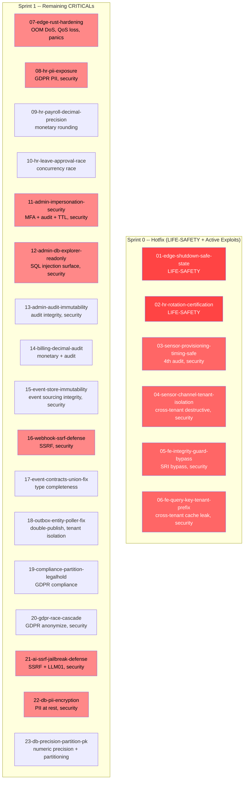

# Dependency Graph: Critical Fixes Plan

## Topological Analysis

**Cycle detection:** No cycles detected. All 23 packages have zero hard prerequisites.

**Parallelizable:** ALL packages are parallelizable within their sprint tier. The DAG is flat (no edges) because each package operates on a distinct service boundary:

| Package | Service Boundary | Isolation Reason |
|---------|-----------------|------------------|
| 01 | sens-api-gateway (shutdown) | Rust, no TS dependency |
| 02 | hr-service (aquaculture handlers) | Isolated handler |
| 03 | sensor-service (provisioning) | Isolated service method |
| 04 | sensor-service (channel mgmt) | Different service file |
| 05 | web/shell (integrity guard) | Frontend, no backend dep |
| 06 | web/modules (query keys) | Frontend, no backend dep |
| 07 | sens-api-gateway (MQTT/LoRa) | Rust, no TS dependency |
| 08 | hr-service + event-contracts | Event contract breaking change |
| 09 | hr-service (payroll) | Isolated entity/handler |
| 10 | hr-service (leave) | Isolated handler |
| 11 | admin-api-service (impersonation) | Isolated module |
| 12 | admin-api-service (db explorer) | Different controller |
| 13 | admin-api-service (audit) | Different module |
| 14 | billing-service | Isolated service |
| 15 | event-store-service | Isolated service |
| 16 | notification-service | Isolated service |
| 17 | event-contracts (index.ts) | Shared lib, additive change |
| 18 | messaging-service (outbox) | Isolated module |
| 19 | messaging-service (compliance) | Different module |
| 20 | messaging-service (gdpr) | Different module |
| 21 | messaging-service (ai) | Different module |
| 22 | hr-service (entity encryption) | Same entity as P08, no conflict |
| 23 | sensor-service + messaging-service (schema) | Entity-only changes |

## Soft Dependencies (Co-requisites)

These are NOT modeled as DAG edges. They indicate shared files where the executor should be aware of ordering considerations:

| Package A | Package B | Shared Resource | Note |
|-----------|-----------|----------------|------|
| 08 | 22 | `employee.entity.ts` | P08 modifies GraphQL types, P22 adds encryption transformer. No field overlap. |
| 19 | 23 | `compliance-audit-log.entity.ts` | P19 adds partitioning, P23 fixes PK. Migrations should be coordinated. |
| 16 | 21 | SSRF defense pattern | Same implementation pattern. P21 should reference P16's implementation. |

## Execution Sequence (Deterministic)

Applying Kahn's algorithm with security-first tie-breaking (all nodes have zero in-degree):

### Sprint 0 (position 1-6, security override for LIFE-SAFETY):
1. `01-edge-shutdown-safe-state` (LIFE-SAFETY, security override)
2. `02-hr-rotation-certification-validation` (LIFE-SAFETY, security override)
3. `03-sensor-provisioning-timing-safe` (active exploit, 4th audit)
4. `04-sensor-channel-tenant-isolation` (cross-tenant destructive)
5. `05-fe-integrity-guard-bypass` (security bypass)
6. `06-fe-query-key-tenant-prefix` (cross-tenant data leak)

### Sprint 1 (position 7-23, security-sensitive first, then alphabetical):
7. `07-edge-rust-hardening`
8. `08-hr-pii-exposure`
9. `11-admin-impersonation-security`
10. `12-admin-db-explorer-readonly`
11. `13-admin-audit-immutability`
12. `15-event-store-immutability-checkpoint`
13. `16-webhook-ssrf-defense`
14. `20-gdpr-race-cascade`
15. `21-ai-ssrf-jailbreak-defense`
16. `22-db-pii-encryption`
17. `09-hr-payroll-decimal-precision`
18. `10-hr-leave-approval-race`
19. `14-billing-decimal-audit`
20. `17-event-contracts-union-fix`
21. `18-outbox-entity-poller-fix`
22. `19-compliance-partition-legalhold`
23. `23-db-precision-partition-pk`
