# Dependency Graph: Full Platform Remediation

## Topological Execution Order

Kahn's algorithm with security-sensitive-first tie-breaking, then lexicographic:

| Step | Package(s) | Sprint | Notes |
|------|-----------|--------|-------|
| 1 | 01, 02, 03, 05, 07 | Sprint 1 | Tier 1 zero-in-degree (from tier1-fixes plan) |
| 2 | 04, 06 | Sprint 1 | Tier 1 depends on 03, 01 respectively |
| 3 | 08, 09, 10, 11, 12, 14, 15, 16 | Sprint 1-2 | All zero-in-degree (independent of tier 1) |
| 4 | 13 | Sprint 2 | Independent but high-risk (naming strategy) |
| 5 | 17, 18, 19, 20 | Sprint 2 | Type safety packages, all parallelizable |
| 6 | 21, 22 | Sprint 3 | LOW findings, parallelizable |
| 7 | 23 | Sprint 2-3 | Systemic A, depends on 01, 06, 11 |

Note on step 3: Packages 08-16 (excluding 13) have no prerequisites on packages 01-07. They CAN execute in parallel with tier 1 packages. However, for sprint planning purposes, security-sensitive packages (10, 12) are recommended for Sprint 1, and the rest for Sprint 2.

Note on step 7: Package 23 has hard prerequisites on 01, 06, and 11. Since 01 and 06 are Sprint 1, and 11 is Sprint 1-2, package 23 cannot start until all three complete. Recommended for Sprint 2-3.

## DAG

```mermaid
graph TD
    %% Tier 1 packages (from tier1-fixes plan)
    P01["01-mqtt-device-event-schema-routing<br/><b>HIGH</b> | security-sensitive"]
    P02["02-event-store-tenant-auth<br/><b>HIGH</b> | security-sensitive"]
    P03["03-allowed-base-domains-fail-closed<br/><b>MEDIUM</b> | security-sensitive"]
    P04["04-strip-tenant-header-priority-reorder<br/><b>MEDIUM</b> | security-sensitive"]
    P05["05-nginx-socketio-config-sync<br/><b>MEDIUM</b>"]
    P06["06-mqtt-io-config-tenant-scoping<br/><b>MEDIUM</b>"]
    P07["07-hr-handlers-post-commit-refetch<br/><b>MEDIUM</b>"]

    %% Sprint 1-2 new packages (zero-in-degree)
    P08["08-event-contract-flat-object<br/><b>MEDIUM</b>"]
    P09["09-sensor-ts-ignore-worker-pool<br/><b>MEDIUM</b>"]
    P10["10-console-log-to-logger<br/><b>MEDIUM</b> | security-sensitive"]
    P11["11-feeding-scheduler-getrepository<br/><b>MEDIUM</b>"]
    P12["12-auth-hardening-token-mfa<br/><b>MEDIUM</b> | security-sensitive"]
    P13["13-database-naming-strategy<br/><b>MEDIUM</b>"]
    P14["14-nginx-csp-wss-only<br/><b>MEDIUM</b> | security-sensitive"]
    P15["15-ci-timescaledb-image<br/><b>MEDIUM</b>"]
    P16["16-rust-edge-tracing<br/><b>MEDIUM</b>"]

    %% Sprint 2 type safety packages
    P17["17-farm-service-as-any<br/><b>MEDIUM</b>"]
    P18["18-sensor-service-as-any<br/><b>MEDIUM</b>"]
    P19["19-remaining-services-as-any<br/><b>MEDIUM</b>"]
    P20["20-alert-engine-test-as-any<br/><b>MEDIUM</b>"]

    %% Sprint 3 LOW packages
    P21["21-tenant-isolation-guard-simplification<br/><b>LOW</b> | security-sensitive"]
    P22["22-low-findings-cleanup<br/><b>LOW</b>"]

    %% Systemic package
    P23["23-systemic-a-tenant-context-non-http<br/><b>MEDIUM</b> | security-sensitive"]

    %% Tier 1 edges (from existing plan)
    P03 --> P04
    P01 --> P06

    %% New edges
    P05 -.->|soft: same nginx files| P14
    P01 --> P23
    P06 --> P23
    P11 --> P23

    %% Styling
    style P01 fill:#ff9999,stroke:#cc0000
    style P02 fill:#ff9999,stroke:#cc0000
    style P03 fill:#ffcc99,stroke:#cc6600
    style P04 fill:#ffcc99,stroke:#cc6600
    style P05 fill:#ffcc99,stroke:#cc6600
    style P06 fill:#ffcc99,stroke:#cc6600
    style P07 fill:#ffcc99,stroke:#cc6600
    style P08 fill:#ffcc99,stroke:#cc6600
    style P09 fill:#ffcc99,stroke:#cc6600
    style P10 fill:#ffcc99,stroke:#cc6600
    style P11 fill:#ffcc99,stroke:#cc6600
    style P12 fill:#ffcc99,stroke:#cc6600
    style P13 fill:#ffcc99,stroke:#cc6600
    style P14 fill:#ffcc99,stroke:#cc6600
    style P15 fill:#ffcc99,stroke:#cc6600
    style P16 fill:#ffcc99,stroke:#cc6600
    style P17 fill:#ffffcc,stroke:#cccc00
    style P18 fill:#ffffcc,stroke:#cccc00
    style P19 fill:#ffffcc,stroke:#cccc00
    style P20 fill:#ffffcc,stroke:#cccc00
    style P21 fill:#ccffcc,stroke:#00cc00
    style P22 fill:#ccffcc,stroke:#00cc00
    style P23 fill:#ffccff,stroke:#cc00cc
```

## Parallelizable Sets

**Set A (Step 1):** 01, 02, 03, 05, 07 — all zero-in-degree, no edges between them
**Set B (Step 2):** 04, 06 — unblocked after A; parallel to each other
**Set C (independent of A/B):** 08, 09, 10, 11, 12, 13, 14, 15, 16, 17, 18, 19, 20, 21, 22 — all zero-in-degree except 14 (soft dep on 05)
**Set D (depends on A+C):** 23 — depends on 01, 06, 11

Effective parallelism:
- Sets A and C can execute simultaneously (no shared files between sets)
- Within Set C, all packages are parallelizable (different services/files)
- Package 14 should wait for 05 completion (same nginx files) but is not hard-blocked
- Package 23 is the convergence point — waits for 01, 06, 11

## Edge Justification

| Edge | Reason |
|------|--------|
| 03 -> 04 | Both modify `libs/backend-common/src/middleware/tenant-context.middleware.ts`. Sequential to avoid conflicts. |
| 01 -> 06 | Both modify `apps/sensor-service/src/ingestion/mqtt-listener.service.ts`. 01 establishes tenant-scoped pattern; 06 reuses it. |
| 05 -> 14 (soft) | Both modify nginx config files. Not a hard dependency (different lines/sections) but recommended sequential for cleaner history. |
| 01 -> 23 | 23 refactors 01's specific fix into generic withTenantContext(). 01 must exist first. |
| 06 -> 23 | 23 refactors 06's specific fix into generic withTenantContext(). 06 must exist first. |
| 11 -> 23 | 23 refactors 11's getScopedRepository cron pattern into generic withTenantContext(). 11 must exist first. |

## Cycle Detection

No cycles detected. Kahn's algorithm terminates with 23 emitted packages = 23 total packages. No Tarjan SCC escalation required.
