# Dependency Graph: HIGH Findings Remediation

```mermaid
graph TD
    subgraph "Sprint 2 -- Security-Critical HIGHs"
        P01["01-sensor-channel-idor-tenant-scoping<br/>[security-sensitive]"]
        P02["02-sensor-vfd-rate-limit<br/>[security-sensitive]"]
        P03["03-sensor-mqtt-any-types"]
        P04["04-sensor-emergency-rollback-deployment-logs<br/>[security-sensitive]"]
        P05["05-sensor-sql-interpolation<br/>[security-sensitive]"]
        P06["06-edge-mqtt-tls-command-replay<br/>[security-sensitive]"]
        P07["07-edge-modbus-write-whitelist<br/>[security-sensitive]"]
        P10["10-admin-audit-trail-wiring<br/>[security-sensitive]"]
        P12["12-platform-crypto-salt-gcm-aad<br/>[security-sensitive]"]
        P20["20-data-event-contracts-tenant<br/>[security-sensitive]"]
        P23["23-messaging-compliance-audit-gdpr<br/>[security-sensitive]"]
        P25["25-messaging-embedding-vector-tenant<br/>[security-sensitive]"]
        P26["26-messaging-tenant-isolation-nats<br/>[security-sensitive]"]
        P27["27-frontend-module-federation-auth<br/>[security-sensitive]"]
    end

    subgraph "Sprint 2 -- Non-Security HIGHs"
        P08["08-edge-ffi-unwrap-h2-dep"]
        P09["09-edge-scada-cancellation-mqtt-jitter"]
        P13["13-platform-billing-integrity"]
        P15["15-farm-event-publishing-transactions"]
        P16["16-farm-outbox-cron-lifecycle"]
        P17["17-hr-gdpr-payroll-audit<br/>[security-sensitive]"]
    end

    subgraph "Sprint 3 -- Remaining HIGHs"
        P11["11-admin-remaining-high<br/>[security-sensitive]"]
        P14["14-platform-remaining-high<br/>[security-sensitive]"]
        P18["18-hr-state-machine-overtime-conflict"]
        P19["19-hr-outbox-repo-i18n<br/>[security-sensitive]"]
        P21["21-database-float-timestamp-naming"]
        P22["22-messaging-outbox-idempotency"]
        P24["24-messaging-ai-safety-injection<br/>[security-sensitive]"]
        P28["28-frontend-security-a11y<br/>[security-sensitive]"]
        P29["29-frontend-i18n-date-remaining"]
    end

    %% Dependencies
    P20 --> P22
    P20 --> P16
    P21 --> P22

    %% Parallelizable groups (no edges between them)
    %% Sprint 2 Tier 1: P01, P02, P03, P04, P05, P06, P07, P08, P09 (all independent)
    %% Sprint 2 Tier 2: P10, P12, P13, P15, P17, P20, P23, P25, P26, P27 (all independent)
    %% Sprint 3: P11, P14, P18, P19, P21, P24, P28, P29 (mostly independent)
    %% Sprint 3 deps: P22 depends on P20 and P21; P16 depends on P20

    style P01 fill:#ff9999
    style P02 fill:#ff9999
    style P04 fill:#ff9999
    style P05 fill:#ff9999
    style P06 fill:#ff9999
    style P07 fill:#ff9999
    style P10 fill:#ff9999
    style P12 fill:#ff9999
    style P17 fill:#ff9999
    style P20 fill:#ff9999
    style P23 fill:#ff9999
    style P25 fill:#ff9999
    style P26 fill:#ff9999
    style P27 fill:#ff9999
    style P11 fill:#ff9999
    style P14 fill:#ff9999
    style P19 fill:#ff9999
    style P24 fill:#ff9999
    style P28 fill:#ff9999
```

## Topological Execution Order (Kahn's Algorithm)

### Tier 0 -- Zero in-degree, security-sensitive first (parallelizable)
All packages except 16 and 22 have zero in-degree. Security-sensitive packages sorted by slug ascending:

1. 01-sensor-channel-idor-tenant-scoping [security]
2. 02-sensor-vfd-rate-limit [security]
3. 04-sensor-emergency-rollback-deployment-logs [security]
4. 05-sensor-sql-interpolation [security]
5. 06-edge-mqtt-tls-command-replay [security]
6. 07-edge-modbus-write-whitelist [security]
7. 10-admin-audit-trail-wiring [security]
8. 12-platform-crypto-salt-gcm-aad [security]
9. 17-hr-gdpr-payroll-audit [security]
10. 20-data-event-contracts-tenant [security] **-- unblocks 16 and 22**
11. 23-messaging-compliance-audit-gdpr [security]
12. 25-messaging-embedding-vector-tenant [security]
13. 26-messaging-tenant-isolation-nats [security]
14. 27-frontend-module-federation-auth [security]

### Tier 0 continued -- Non-security zero in-degree (parallelizable)
15. 03-sensor-mqtt-any-types
16. 08-edge-ffi-unwrap-h2-dep
17. 09-edge-scada-cancellation-mqtt-jitter
18. 13-platform-billing-integrity
19. 15-farm-event-publishing-transactions
20. 21-database-float-timestamp-naming **-- unblocks 22**

### Tier 0 continued -- Remaining zero in-degree
21. 11-admin-remaining-high [security]
22. 14-platform-remaining-high [security]
23. 18-hr-state-machine-overtime-conflict
24. 19-hr-outbox-repo-i18n [security]
25. 24-messaging-ai-safety-injection [security]
26. 28-frontend-security-a11y [security]
27. 29-frontend-i18n-date-remaining

### Tier 1 -- Depends on Tier 0 packages
28. 16-farm-outbox-cron-lifecycle (after 20-data-event-contracts-tenant)
29. 22-messaging-outbox-idempotency (after 20-data-event-contracts-tenant AND 21-database-float-timestamp-naming)

## Cycle Detection
No cycles detected. Kahn's algorithm emits all 29 packages.

## Parallelization Opportunities
- All 27 Tier 0 packages are mutually parallelizable (no edges between them)
- Packages 16 and 22 must wait for package 20 (and 22 also for 21)
- Domain-isolated packages (edge, frontend, HR) can be distributed to different executors simultaneously
