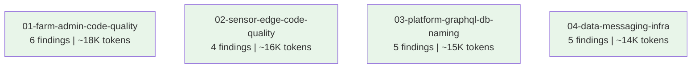

# Dependency Graph: LOW Findings Cleanup

## Topological Analysis

**No edges.** All 4 packages are fully parallelizable -- zero dependencies between them.

**Kahn's algorithm output (deterministic tie-breaking by slug ascending):**
1. 01-farm-admin-code-quality
2. 02-sensor-edge-code-quality
3. 03-platform-graphql-db-naming
4. 04-data-messaging-infra

**Cycle detection:** Not applicable -- DAG has 0 edges, 4 nodes. No cycles possible.

**Parallel execution:** All 4 packages can be executed simultaneously by independent executors. No ordering constraints.

## Notes

- Package 04 touches `libs/event-contracts` and `libs/backend-common` (shared libs), but only adds tests and comments -- no interface or export changes. Therefore no downstream rebuild dependency is created.
- If executing serially, the listed order is arbitrary; any permutation is valid.
