# Dependency Graph: MEDIUM Findings Remediation

## Topological Execution Order

Kahn's algorithm with security-sensitive-first tie-breaking, then lexicographic slug ascending:

| Step | Package(s) | Sprint | Notes |
|------|-----------|--------|-------|
| 1 | 01, 02, 03, 04, 05, 06, 07, 08, 09, 11, 12, 13, 14, 15 | 3 | All zero-in-degree, fully parallelizable |
| 2 | 10 | 3-4 | Zero-in-degree but recommended after existing full-remediation plan package 08 (event-contract-flat-object) completes, to avoid conflicting event contract changes |

Security-sensitive packages in Step 1: 01, 03, 07, 08, 09, 12. These should be prioritized within the step.

## DAG

```mermaid
graph TD
    %% Sprint 3 -- All parallelizable (zero-in-degree)
    P01["01-frontend-token-polling-stale<br/>MEDIUM | security-sensitive"]
    P02["02-frontend-a11y-contrast<br/>MEDIUM"]
    P03["03-edge-resilience-safety<br/>MEDIUM | security-sensitive"]
    P04["04-hr-monetary-types-events<br/>MEDIUM"]
    P05["05-hr-scheduling-leave-safety<br/>MEDIUM"]
    P06["06-hr-frontend-a11y<br/>MEDIUM"]
    P07["07-farm-domain-integrity<br/>MEDIUM | security-sensitive"]
    P08["08-admin-security-hardening<br/>MEDIUM | security-sensitive"]
    P09["09-platform-monetary-config-resilience<br/>MEDIUM | security-sensitive"]
    P10["10-data-layer-event-contracts<br/>MEDIUM"]
    P11["11-data-layer-query-performance<br/>MEDIUM"]
    P12["12-sensor-tenant-scoping-safety<br/>MEDIUM | security-sensitive"]
    P13["13-messaging-storage-redis-resilience<br/>MEDIUM"]
    P14["14-messaging-ai-embedding-safety<br/>MEDIUM"]
    P15["15-database-schema-hygiene<br/>MEDIUM"]

    %% Cross-plan soft dependency
    EXISTING_08["(existing plan) 08-event-contract-flat-object"]

    EXISTING_08 -.->|soft: shared event contract files| P10

    %% Intra-plan soft dependencies (same entity files, recommend sequential)
    P04 -.->|soft: payroll.entity.ts| P15
    P09 -.->|soft: safe-math in backend-common| P10

    %% Styling
    style P01 fill:#ffcc99,stroke:#cc6600
    style P02 fill:#ffffcc,stroke:#cccc00
    style P03 fill:#ffcc99,stroke:#cc6600
    style P04 fill:#ffcc99,stroke:#cc6600
    style P05 fill:#ffcc99,stroke:#cc6600
    style P06 fill:#ffffcc,stroke:#cccc00
    style P07 fill:#ffcc99,stroke:#cc6600
    style P08 fill:#ffcc99,stroke:#cc6600
    style P09 fill:#ffcc99,stroke:#cc6600
    style P10 fill:#ffcc99,stroke:#cc6600
    style P11 fill:#ffcc99,stroke:#cc6600
    style P12 fill:#ffcc99,stroke:#cc6600
    style P13 fill:#ffcc99,stroke:#cc6600
    style P14 fill:#ffcc99,stroke:#cc6600
    style P15 fill:#ffcc99,stroke:#cc6600
    style EXISTING_08 fill:#cccccc,stroke:#999999
```

## Parallelizable Sets

**Set A (all packages except 10):** 01-09, 11-15 -- all zero-in-degree with no hard edges between them. Fully parallelizable. Recommended grouping:

- **Security-first batch:** 01, 03, 07, 08, 09, 12 (6 packages, all security-sensitive)
- **Domain batch:** 04, 05, 06, 11, 13, 14, 15 (7 packages, domain improvements)
- **Small/quick:** 02 (single accessibility fix)

**Set B (10 only):** Soft dependency on existing plan's package 08 (event-contract-flat-object) which also modifies `libs/event-contracts/src/tenant-events.ts`. If 08 has already been committed, 10 can proceed. If 08 is still pending, 10 should wait to avoid merge conflicts on the same file.

## Edge Justification

| Edge | Type | Reason |
|------|------|--------|
| existing-08 -> 10 | Soft | Both modify `libs/event-contracts/src/tenant-events.ts` and potentially `base-event.ts`. Sequential prevents merge conflicts. |
| 04 -> 15 | Soft | Both modify `apps/hr-service/src/hr/entities/payroll.entity.ts`. Package 04 changes event types; package 15 changes column structure. No functional dependency but sequential recommended. |
| 09 -> 10 | Soft | Package 09 may change `libs/backend-common/src/utils/safe-math.ts`; package 10 changes `libs/event-contracts/`. Both in shared libs. No hard dependency. |

## Cycle Detection

No cycles detected. Kahn's algorithm terminates with 15 emitted packages = 15 total packages. No Tarjan SCC escalation required.

## Cross-Plan Dependencies

This plan (medium-fixes) is designed to execute **after** the existing `2026-04-09-full-remediation` plan's Sprint 1-2 packages (01-20). The only actual file-level overlap is between:
- full-remediation package 08 (event-contract-flat-object) and medium-fixes package 10 (data-layer-event-contracts) -- both touch `libs/event-contracts/src/tenant-events.ts`
- full-remediation package 13 (database-naming-strategy) and medium-fixes package 15 (database-schema-hygiene) -- both touch entity naming

All other packages in this plan touch files not modified by the full-remediation plan, making them safe to execute in parallel with full-remediation Sprint 1-2 packages.
