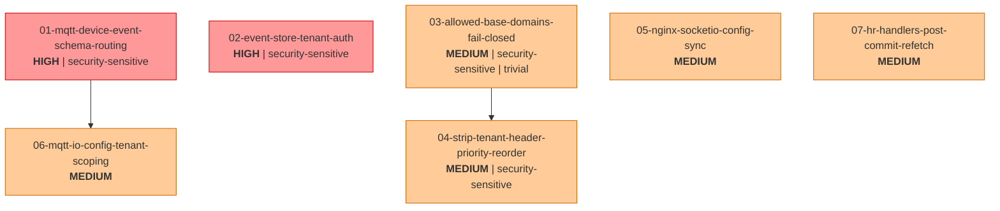

# Dependency Graph: Tier 1 Fixes

## Topological Execution Order

Kahn's algorithm with lexicographic tie-breaking on zero-in-degree packages:

| Step | Package(s) | Notes |
|------|-----------|-------|
| 1 | 01, 02, 03, 05, 07 | All zero-in-degree, parallelizable |
| 2 | 04 | Depends on 03 |
| 3 | 06 | Depends on 01 |

Security-sensitive packages at step 1: 01, 02, 03 (security override places them first within the tier, but they are already at step 1).

## DAG

## Parallelizable Sets

**Tier 1 (step 1):** Packages 01, 02, 03, 05, 07 have no dependencies on each other. They can be executed in parallel by separate sessions or in any order within a single session.

**Tier 2 (step 2):** Package 04 can start after 03 completes. Package 06 can start after 01 completes. Packages 04 and 06 are themselves parallelizable (no edge between them).

## Edge Justification

| Edge | Reason |
|------|--------|
| 03 -> 04 | Both modify `libs/backend-common/src/middleware/tenant-context.middleware.ts`. Package 03 changes line 170 (fail-closed default). Package 04 changes lines 95-110 (priority reorder). Sequential commits avoid merge conflicts on the same file. |
| 01 -> 06 | Both modify `apps/sensor-service/src/ingestion/mqtt-listener.service.ts`. Package 01 establishes the tenant-scoped QueryRunner pattern for MQTT handlers. Package 06 reuses that pattern for the DeviceIoConfig query. |

## Cycle Detection

No cycles detected. Kahn's algorithm terminates with 7 emitted packages = 7 total packages. No Tarjan SCC escalation required.
