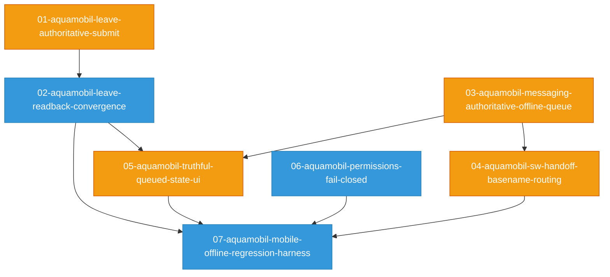

# Dependency Graph: AquaMobil Offline Sync Remediation

## Topological Execution Order

### Tier 0 (zero in-degree, parallelizable)
01-aquamobil-leave-authoritative-submit, 03-aquamobil-messaging-authoritative-offline-queue, 06-aquamobil-permissions-fail-closed

### Tier 1 (unblocked after Tier 0)
02-aquamobil-leave-readback-convergence (after 01), 04-aquamobil-sw-handoff-basename-routing (after 03)

### Tier 2 (unblocked after Tier 1)
05-aquamobil-truthful-queued-state-ui (after 02, 03)

### Tier 3 (validation gate)
07-aquamobil-mobile-offline-regression-harness (after 02, 04, 05, 06)

## Cycle Detection
No cycles detected. All 7 packages have a valid execution order.
