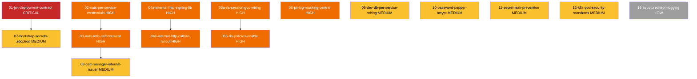

# Dependency Graph — Security Hardening Remediation

## Topological Execution Order

**Tier 0 (zero prerequisites — can run any order):** 01, 02, 04a, 05a, 06, 09, 10, 11, 12, 13
**Tier 1 (unblocked after tier 0):** 03 (after 02), 04b (after 04a), 05b (after 05a), 07 (after 01)
**Tier 2 (unblocked after tier 1):** 08 (after 03)

## Recommended Sequence (phase-aware)

1. **P01** — Unbreaks production. Must ship first.
2. Parallel/sequential within Phase 1: **P02 → P03**, **P04a → P04b**, **P05a → P05b**, **P06**
3. Phase 2: **P07** (after P01), **P08** (after P03), **P09**, **P10**
4. Phase 3: **P11**, **P12**, **P13**

## Cycle Detection
None — graph is acyclic. Kahn's algorithm terminates with all 14 packages emitted.
