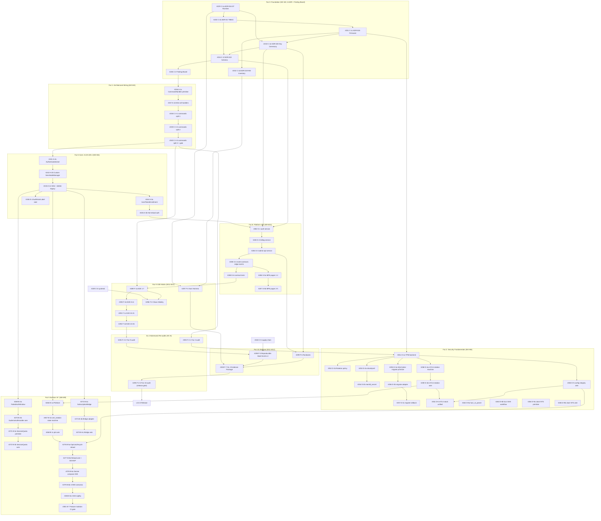

# sens-api-gateway Gap Closure Ultra-Plan (IEC 62443 SL-2 + SLSA L3)

**Tarih:** 2026-04-24
**Sahip:** Okan (platform owner)
**Hedef:** Canonical plan `/root/.claude/plans/unutma-mevcut-s-stem-le-lexical-puzzle.md`'in ruthless-assessment'ta tespit edilen 30 gap'ini (A/B/C/D/E/F/G eksenleri) explicit batch + deadline + finding-ID + invariant-test ile kapatmak. Canonical plan dokunulmaz; bu plan onun uzantısıdır.

**Süre:** 12 takvim haftası (PR #54 → #300, batch #229 → #300). Paralelleştirme ile ~10 hafta.
**Test hedefi:** 1566 (mevcut) → 2050+ (hedef). 500+ yeni test (200+ unit, 50+ invariant, 60+ integration, 41+ E2E, 10+ contract, 8+ perf, 10+ security, 15+ backward compat, 10+ migration).
**Kaynak:** 3 paralel Plan agent (A+E, B+D, C+F+G eksenleri) — çıktılar synthesize edildi.

---

## 1. Context

Mevcut session (Batches 206-228, 23 batch) Faz 5 OPC UA primitifleri + Faz 6 watch publisher + Faz 7 license enforcement'ı canlıya aldı. Ancak **ruthless assessment 30 gap tespit etti** ve bunların çoğu mimari boşluk:

- **A (Dependency Inversion):** InMemoryPolicyEngine yazıldı (Batch 223) ama sadece OPC UA write path kullanıyor; MQTT command handler'ları hâlâ engine'e bağlanmadı. Custom NodeManager impl yok → her HMI yazısı `"opc-ua-anonymous"` aktörü ile çalışıyor. U/P + X509 auth tokens endpoint'te kayıtsız.
- **B (Faz 5 OPC UA kapsam):** TLS cert lifecycle, brute-force throttle, per-tenant session cap, push-subscription, config-reload, real HMI integration test, feature isolation — 7 açık madde.
- **C (Faz 0 + Faz 1 foundation):** 5 ADR (016-020) + ADR-022-edge yazılmadı; finding board açılmadı; commands.rs split yeterli değil; STRIDE threat model + supply chain hardening (SBOM + cosign + SLSA L3) + systemd hardening + 5-variant CI matrix yok.
- **D (Faz 2 Security Fundamentals):** TPM keystore + mlock/prctl/memfd_secret + SQLCipher v1→v2 migration + 2-phase mTLS cert rotation + config integrity wire + fuzz_st_parser + clock authority NTS — 9 eksik madde.
- **E (Introduced-Debt):** 4 orphan finding (E-1..E-3 kapatıldı, E-4 seal edilecek).
- **F (Faz 9 E2E + Faz 10 Release):** 41 E2E test hedefinden 4 seed; SL-2 adversarial re-audit × 3 gate yok; Chaos + Kani + SLSA reproducible build + 7 runbook + SL-2 evidence package.
- **G (Faz 8 Platform-side cross-repo):** auth-service + billing-service + admin-api-service + event-contracts + tenant-admin 5 MFE page + contract tests — sıfır.

Ultra-plan'ın amacı: her gap'i Tier-1 (make-it-impossible) veya Tier-2 (make-it-automatic) mimari çözümle kapamak. Hiçbir yama, hiçbir "for now", hiçbir "deferred (tracked)" (owner + deadline + finding-ID üçlüsü olmadan). Primitif-first disiplin: her batch (a) primitif + unit-test, (b) adapter + integration-test, (c) wire + e2e-test; tek batch'te 2'den fazla aşama olmasın.

---

## 2. Gap Matrisi

| Gap-ID | Başlık | Tier | Prereq | Batch | Hafta | PR# | Owner | Deadline | Finding-ID | Invariant Test | E2E Test | ADR | SL-2 FR |
|---|---|---|---|---|---|---|---|---|---|---|---|---|---|
| **C-1a** | ADR-016 ST Runtime | 1 | — | #229 | W1 | #54 | edge-expert | +7d | ULTRA-C-1a | `st_gas_monotonic.rs` | st_canonical_deploy | ADR-016 | FR1/FR2/FR3 |
| **C-1b** | ADR-017 RBAC ABAC | 1 | #229 | #230 | W1 | #55 | auth-security | +7d | ULTRA-C-1b | `rbac_non_bypass.rs` | break_glass_quorum | ADR-017 | FR1/FR2/FR4 |
| **C-1c** | ADR-018 Firmware Signing | 1 | #229,#230 | #231 | W1 | #56 | edge-industrial | +7d | ULTRA-C-1c | `updater_ab_monotonic.rs` | signed_fw_promotion | ADR-018 | FR3/FR4/FR5 |
| **C-1d** | ADR-019 Hardware Inventory | 1 | #229 | #232 | W1 | #57 | sensor-expert | +7d | ULTRA-C-1d | `safe_state_reachable.rs` | adapter_quarantine | ADR-019 | FR3/FR6/FR7 |
| **C-1e** | ADR-020 Key Ceremony | 1 | #231 | #233 | W2 | #58 | compliance | +14d | ULTRA-C-1e | `key_lifecycle.spec.ts` | ceremony_replay_reject | ADR-020 | FR1/FR3/FR4 |
| **C-1f** | ADR-022-edge Schema Placement | 1 | #230,#233 | #234 | W2 | #59 | data-expert | +14d | ULTRA-C-1f | `migration-codeowners-coverage.ts` | shared_schema_reject | ADR-022 | FR4/FR5 |
| **C-2** | Finding Board + Closes Trailer | 1 | #229 | #235 | W2 | #60 | orchestrator | +14d | ULTRA-C-2 | `finding-registry.ts` tests | closes_trailer_rejected | — | FR6/FR7 |
| **A-1a** | CommandHandler + HandlerInput primitive | 1 | #235 | #236 | W2 | #61 | edge-expert | +14d | ULTRA-A-1a | `handler_requires_authorized_context.rs` | dispatcher_happy_deny | ADR-041 | FR2/FR3 |
| **A-1b** | Wire all handlers through dispatcher | 2 | #236 | #237 | W2 | #62 | edge-expert | +14d | ULTRA-A-1b | `no_legacy_handler_callsite.rs` | mqtt_dispatcher_end_to_end | — | FR2/FR3/FR6 |
| **C-3-1** | commands.rs split 1 | 1 | #237 | #238 | W3 | #63 | edge-expert | +21d | ULTRA-C-3-1 | `file-size-ceiling.ts` | dispatch_coverage | — | FR7 |
| **C-3-2** | commands.rs split 2 | 1 | #238 | #239 | W3 | #64 | edge-expert | +21d | ULTRA-C-3-2 | `file-size-ceiling.ts` | dispatch_coverage | — | FR7 |
| **C-3-3** | commands.rs split 3 + gate | 1 | #239 | #240 | W3 | #65 | edge-expert | +21d | ULTRA-C-3-3 | `command_dispatch_coverage.rs` | dispatch_coverage | — | FR7 |
| **A-2a** | AuthenticatedUser + SessionActor primitive | 1 | #237 | #241 | W3 | #66 | auth-security | +21d | ULTRA-A-2a | `authenticated_user_sealed.rs` | session_actor_resolution_reject | ADR-042 | FR1 |
| **A-2b** | Custom SensNodeManager | 1 | #241 | #242 | W3 | #67 | edge-expert | +21d | ULTRA-A-2b | `opcua_write_requires_authenticated_user.rs` | custom_nm_anon_reject | — | FR1/FR2 |
| **A-2c** | Wire SensNodeManager + delete legacy | 2 | #242 | #243 | W3 | #68 | edge-expert | +21d | ULTRA-A-2c | `no_simple_node_manager.rs` | opcua_write_full_flow | — | FR1/FR2/FR6 |
| **A-3a** | UserTokenEnrollment from manifest | 1 | #241,#242,#243 | #244 | W4 | #69 | auth-security | +28d | ULTRA-A-3a | `no_hardcoded_opcua_credentials.rs` | user_token_enrollment | ADR-043 | FR1/FR3 |
| **A-3b** | Wire validator + manifest hot-reload | 2 | #244 | #245 | W4 | #70 | auth-security | +28d | ULTRA-A-3b | `opcua_no_anonymous_token_policy.rs` | manifest_hot_reload_auth | — | FR1/FR3/FR6 |
| **E-4** | AuditActorLabel invariant seal | 1 | #243 | #246 | W4 | #71 | audit-trail | +28d | ULTRA-E-4 | `audit_actor_label_no_legacy.rs` | audit_trail_no_anonymous_residue | — | FR6/FR3 |
| **C-4** | STRIDE Threat Model | 2 | #229-#234 | #247 | W4 | #72 | security-reviewer | +28d | ULTRA-C-4 | `threat-model-coverage.ts` | model_coverage_drift | — | FR1-FR7 |
| **C-5** | Supply Chain (SBOM + cosign + SLSA L3) | 1 | #233 | #248 | W4 | #73 | supply-chain | +28d | ULTRA-C-5 | `gha-sha-pin.ts`, `slsa-attestation-present.ts` | signed_artifact_verify | — | FR3/FR4/FR7 |
| **C-6** | systemd Unit Hardening | 2 | #229 | #249 | W4 | #74 | infra-expert | +28d | ULTRA-C-6 | `systemd-unit-lint.ts` | syscall_filter_ptrace_reject | — | FR5/FR7 |
| **C-7** | 5-Variant CI Feature Matrix | 2 | #229 | #250 | W4 | #75 | infra-expert | +28d | ULTRA-C-7 | `feature_flag_disjoint.rs` | feature_leg_break_detect | — | FR7 |
| **D-1a** | TPM Keystore Backend | 1 | ADR-018 | #251 | W4 | #76 | edge-industrial | +28d | ULTRA-D-1a | `keystore_tpm_preferred.rs`, `keystore_file_requires_acceptance.rs` | keystore_tpm_rotation | ADR-026 | FR4/FR3 |
| **D-1b** | File-backend Gate + 180d Rotation | 1+2+4 | #251 | #252 | W4 | #77 | edge-industrial | +28d | ULTRA-D-1b | `keystore_rotation_overdue_raises_alarm.rs` | keystore_rotation_180d | — | FR4 |
| **D-2** | mlock + prctl + panic-zeroize + memfd_secret | 1 | #251 | #253,#254 | W5 | #78-79 | auth-security | +35d | ULTRA-D-2 | `no_coredump_path.rs`, `memfd_secret_preferred.rs` | attacker_coredump_key_leak | — | FR4 |
| **D-3** | SQLCipher v1→v2 Migration Binary | 2+3 | #251 | #255,#256,#257 | W5 | #80-82 | data-expert | +35d | ULTRA-D-3 | `sqlcipher_schema_version.rs`, `sqlcipher_machine_id_decoupled.rs` | v1_v2_upgrade, v1_v2_rollback | — | FR4 |
| **D-4** | mTLS Rotation State Machine | 1 | #251 | #258,#259 | W5 | #83-84 | auth-security | +35d | ULTRA-D-4 | `mtls_rotation_stage_monotonic.rs` | fleet_rotation | ADR-027 | FR1/FR7 |
| **D-5** | Config Integrity Verify Wire | 1+2 | #251 | #260 | W5 | #85 | edge-expert | +35d | ULTRA-D-5 | `config_integrity_toctou_closed.rs` | tampered_boot_refused | — | FR3 |
| **D-6** | mTLS Stack Unified Assembly | 1 | #258,#259 | #261 | W5 | #86 | auth-security | +35d | ULTRA-D-6 | `mtls_stack_single_construction.rs` | outbound_license_fetch_rotation | — | FR1 |
| **D-8** | fuzz_st_parser + Nightly Schedule | 2+3 | — | #262,#263 | W5 | #87-88 | edge-expert | +35d | ULTRA-D-8 | `fuzz_targets_exist.rs` | (fuzz is adversarial) | — | FR3/FR7 |
| **D-9** | Clock Authority NTS + Monotonic | 1 | — | #264,#265 | W6 | #89-90 | edge-expert | +42d | ULTRA-D-9 | `no_system_time_for_ttl.rs` | clock_skew_resilience | — | FR6/FR7 |
| **B-1** | TLS Cert Lifecycle (PkiStore + Rotation + Pinning) | 1 | D-4 | #266,#267,#268 | W6 | #91-93 | edge-expert | +42d | ULTRA-B-1 | `opc_ua_leaf_pin_enforced.rs` | cert_rotation | ADR-024 | FR1/FR3 |
| **B-2** | Brute-force Throttle (FailedAuthWindow) | 1 | A-2c,#228 | #269,#270 | W7 | #94-95 | auth-security | +49d | ULTRA-B-2 | `opc_ua_auth_throttle_enforced.rs` | brute_force_20th_throttle | — | FR1/FR2 |
| **B-3** | Session Quota (per-tenant + per-user) | 1 | B-2 | #271,#272 | W7 | #96-97 | multi-tenant | +49d | ULTRA-B-3 | `opc_ua_session_quota.rs` | session_quota_fairness | — | FR5/FR7 |
| **B-4** | Push Subscription Bridge | 1 | Faz4 | #273,#274,#275 | W7-8 | #98-100 | edge-expert | +56d | ULTRA-B-4 | `opc_ua_subscription_freshness.rs` | hmi_subscription_p99 | — | FR4/FR7 |
| **B-5** | Config Reload Lifecycle | 1 | #219,B-1,D-5 | #276,#277 | W8 | #101-102 | edge-expert | +56d | ULTRA-B-5 | `opc_ua_reload_drains_writes.rs` | opc_ua_config_reload | ADR-025 | FR3/FR6 |
| **B-6** | HMI Interop E2E (Ignition + UaExpert) | 3 | B-1..B-5 | #278,#279,#280 | W9 | #103-105 | edge-expert | +63d | ULTRA-B-6 | `opc_ua_hmi_scenarios_executable.rs` | 4 scenarios nightly | — | FR1/FR2/FR6 |
| **B-7** | Feature Isolation (no-feature strings gate) | 1 | B-1..B-6 | #281 | W9 | #106 | infra-expert | +63d | ULTRA-B-7 | `opc_ua_feature_isolation.rs` | no_opcua_symbols | — | FR3 |
| **G-1** | auth-service Edge Command Token + JWT Rotation | 1 | C-1b,C-1e,C-1f | #282 | W9 | #107 | auth-security | +63d | ULTRA-G-1 | `edge-token-rotation.invariant.spec.ts` | jwt_retirement_rotate | — | FR1/FR3/FR4 |
| **G-2** | billing-service Edge License PlanLimits | 1 | C-1f,G-1 | #283 | W10 | #108 | billing-expert | +70d | ULTRA-G-2 | `plan-limits-monotonic.invariant.spec.ts` | downgrade_reject | — | FR1/FR2/FR7 |
| **G-3** | admin-api-service Edge Controllers | 1 | G-1,G-2 | #284 | W10 | #109 | admin-expert | +70d | ULTRA-G-3 | `policy-push-idempotent.invariant.spec.ts`, `audit-listing-tenant-scope.invariant.spec.ts` | operator_policy_push | — | FR1/FR3/FR6 |
| **G-4** | event-contracts edge-events + NATS Subject | 1 | G-1..G-3 | #285 | W10 | #110 | data-expert | +70d | ULTRA-G-4 | `edge-events-subject.invariant.spec.ts` | nats_subject_strict_match | — | FR3/FR6 |
| **G-5a** | tenant-admin MFE Pages 1-2 | 2 | G-1..G-4 | #286 | W11 | #111 | frontend-expert | +77d | ULTRA-G-5a | `edge-routes.invariant.spec.tsx` | playwright_live_monitor | — | FR1/FR2/FR6 |
| **G-5b** | tenant-admin MFE Pages 3-5 | 2 | #286 | #287 | W11 | #112 | frontend-expert | +77d | ULTRA-G-5b | `edge-routes.invariant.spec.tsx` | playwright_st_editor | — | FR1/FR2/FR6 |
| **G-6** | Contract Tests (canonical hash + ed25519 + policy + license) | 1 | G-1..G-4 | #288 | W11 | #113 | contract-parity | +77d | ULTRA-G-6 | fixture parity | contract_round_trip | — | FR3/FR4 |
| **F-1a..d** | 41 E2E Scenarios (4 batches) | 2 | C-3,G-6 | #289-#292 | W11-12 | #114-117 | product-audit | +84d | ULTRA-F-1 | `edge-e2e-coverage-manifest.spec.ts` | 41 scenarios green | — | FR1-FR7 |
| **F-2-1** | SL-2 Adversarial Re-audit Faz 2 | 1 | Faz 2 done | #293 | W5 | #118 | auth-security + compliance | +35d | ULTRA-F-2-1 | `reaudit-findings-closed.ts` | audit_report_closed | — | FR1-FR7 |
| **F-2-2** | SL-2 Re-audit Faz 9 | 1 | Faz 9 done | #294 | W12 | #119 | auth-security + compliance | +84d | ULTRA-F-2-2 | `reaudit-findings-closed.ts` | audit_report_closed | — | FR1-FR7 |
| **F-2-3** | SL-2 Re-audit Faz 10 (release gate) | 1 | F-7 done | #295 | W12 | #120 | auth-security + compliance | +84d | ULTRA-F-2-3 | `reaudit-findings-closed.ts` | release_tag_block | — | FR1-FR7 |
| **F-3** | Chaos Engineering Weekly | 2 | C-6,F-1 | #296 | W8 | #121 | observability | +56d | ULTRA-F-3 | `safe_state_under_chaos.rs` | 5 chaos scenarios | — | FR6/FR7 |
| **F-4** | Kani Formal Verification Harness | 1 | C-1a,C-1d | #297 | W8 | #122 | security-reviewer | +56d | ULTRA-F-4 | `kani-proofs-green.ts` | mutation_test | — | FR1/FR3/FR6 |
| **F-5** | Reproducible Build SLSA L3 | 1 | C-5 | #298 | W11 | #123 | supply-chain | +77d | ULTRA-F-5 | `reproducible-build.ts` | dual_runner_sha256 | — | FR3/FR7 |
| **F-6** | 7 Operational Runbooks | 2 | G-1..G-3 | #299 | W11 | #124 | infra-expert | +77d | ULTRA-F-6 | `runbook-linkage.ts` | tabletop_exercise | — | FR6/FR7 |
| **F-7** | SL-2 Evidence Package FR1-FR7 | 1 | F-2-3,F-5,F-6,F-4 | #300 | W12 | #125 | compliance | +84d | ULTRA-F-7 | `compliance-attestation-coverage.ts` | package_renders | — | FR1-FR7 |

**Closed E-X'ler (Batch 225-227 tarafından kapatıldı, sadece seal invariant için kalan):**
- E-1: Batch 225 ✅ (watch publisher tenant-gated)
- E-2: Batch 226 ✅ (AuditSink required for write-chain wire)
- E-3: Batch 227 ✅ (TagInsertionFailure structured + forensic warn)
- E-4: Batch 246'da seal ← A-2c (Batch 243) tarafından otomatik kapanıyor, explicit invariant 246

---

## 3. Dependency Graph (Consolidated)



---

## 4. Sprint Cadence — PR #54-#125 / 12 Hafta

| Hafta | Batch Aralığı | PR Aralığı | Ana Eksen |
|---|---|---|---|
| W1 | #229-#233 | #54-#58 | Faz 0: ADR-016, ADR-017, ADR-018, ADR-019, ADR-020 |
| W2 | #234-#240 | #59-#65 | Faz 0: ADR-022 + Finding Board + A-1 + C-3 splits |
| W3 | #241-#247 | #66-#72 | Faz 5 Core: A-2, A-3, E-4, C-4 STRIDE |
| W4 | #248-#252 | #73-#77 | C-5 supply + C-6 systemd + C-7 matrix + D-1a/b |
| W5 | #253-#260 | #78-#85 | Faz 2: D-2, D-3, D-4, D-5 + F-2-1 Audit |
| W6 | #261-#268 | #86-#93 | Faz 2 finalize: D-6, D-8, D-9 + B-1 PKI lifecycle |
| W7 | #269-#275 | #94-#100 | Faz 5 Surface: B-2, B-3, B-4 |
| W8 | #276-#280 | #101-#105 | B-5 reload + B-6 HMI + F-3 Chaos + F-4 Kani |
| W9 | #281-#284 | #106-#109 | B-7 + G-1 + G-2 + G-3 |
| W10 | #285-#288 | #110-#113 | G-4 + G-5 + G-6 |
| W11 | #289-#293 | #114-#118 | F-1 E2E (4 sub-batches) + F-5 + F-6 |
| W12 | #294-#300 | #119-#125 | F-2-2/3 audits + F-7 evidence + Release v2.0.0 |

**Paralelleştirme:** W4-W5 ve W6-W7 arası D-* / B-* batch'ler paralel gitmeli (D ekibi + edge ekibi ayrı). W9-W11 G-* cross-repo batch'ler diğer Rust ekiplerinden bağımsız.

**İnsan-haftası tahmini:** 12 takvim haftası × 3 ekip (Rust edge + platform + security) = ~36 insan-haftası aktif geliştirme; +1 hafta release cutover + pilot rollout.

---

## 5. Batch Design Blokları (Detaylı)

> Her blok **Tier** (1-4 root-cause hiyerarşisi), **Prereq batch'ler**, **Primitif-first aşamalar**, **Invariant/E2E test**, **ADR**, **SL-2 FR mapping**, ve **Architectural root-cause açıklaması** (yamanın neden ret, yapısal çözüm neden doğru) içerir. Banned phrase'ler rejected.

### Batch #229 — Gap C-1a: ADR-016 ST Execution Runtime (Bytecode + Stack VM + Gas)

- **Tier:** 1 — Faz 2/5 batch'lerini blokluyor; yanlış execution semantics force-registry + deploy manifest'a propagate olur.
- **Prereq:** — (foundation)
- **Primitif-first:** (a) opcode enum + binary encoding; (b) gas schedule table (branch / load / store / syscall); (c) stack-frame layout + saturating arithmetic.
- **Invariant test:** `sens-api-gateway/tests/invariants/st_gas_monotonic.rs` — `gas_consumed` trace boyunca strictly non-decreasing.
- **E2E test:** happy: canonical ST program deploy + cycle under `maxEdgeScanCycleMs`; adversarial: unbounded loop gas-ceiling-abort + `EdgePolicyDenied`.
- **ADR:** ADR-016 (ST Execution Runtime — Bytecode Compiler + Stack VM with Gas Metering).
- **Finding-ID:** ULTRA-C-1a.
- **SL-2 FR:** FR1 (AC), FR2 (UC), FR3 (SI).
- **Architectural root-cause:** `st_validator.rs` (3551 satır) lexing + validation + execution'ı birleştiriyor; untyped AST interpreter. Interpreter-over-AST frozen ISA olmadan safety-critical forcing decisions'a non-determinism sızdırıyor — parser değişikliği silently runtime behavior değiştirir, SL-2 FR3 enforceable değil. Root cause: **intermediate compilation artifact content-addressed identity yok**. ADR-016 bytecode format'ı hash'i deployment identity olacak: compile once on platform, transport signed, edge executes verified binary only. Gas metering throttle değil — instruction count × opcode cost linear bound'u proof veren matematiksel primitif; safe-state reachability proof (F-4 Kani) bunun üzerine kurulu. Alternatif (keep AST interpreter, tighten validation) reddedildi: her Faz 5 task (multi-task scheduler, watch sessions, force registry) kendi timing assumption'larını re-derive edecekti.

### Batch #230 — Gap C-1b: ADR-017 RBAC+ABAC + 3-Key Segregation + Tenant Binding + Break-Glass

- **Tier:** 1 — her sonraki command handler'ın consume ettiği authz model'i belirliyor.
- **Prereq:** #229.
- **Primitif-first:** (a) permission-set vocabulary (resource × verb × scope); (b) 3-key segregation matrix (operator / engineer / security-officer); (c) tenant-bound subject claim + break-glass quorum rule (2-of-3 with expiry + audit).
- **Invariant test:** `tests/invariants/rbac_non_bypass.rs` — fuzzed (principal, permission) pair `check` ve `check_many` path'lerinde identical decision.
- **E2E test:** happy: operator `io.read` OK, engineer DENY; adversarial: break-glass without 2nd approver rejected + logged.
- **ADR:** ADR-017.
- **Finding-ID:** ULTRA-C-1b.
- **SL-2 FR:** FR1, FR2, FR4.
- **Architectural root-cause:** `authz/` scattered guard calls; tek algebra yok. Force-apply/deploy/policy-push üçü de kendi authz'sini re-implement ediyor; regressions mechanically yakalanmıyor. Root cause: **authorization imperative check'ler olarak ifade edilmiş, data structure olarak değil** — whole-system audit impossible. ADR-017 declarative matrix zorunluyor: rows = principals, columns = permissions. Tenant binding string compare'den claim envelope'a taşınıyor — cross-tenant leakage type-error haline geliyor. 3-key segregation `can_propose / can_approve / can_execute`'u ayırıyor; hiçbir tek rol destructive action'ın full chain'ini tutamaz. Break-glass toggle değil — time-boxed quorum certificate; audit chain'den geçer, invocation first-class event üretir. Alternatif (continue imperative checks with better discipline) reddedildi: tier-4 ve tier-1 ile structurally eşdeğer değil.

### Batch #231 — Gap C-1c: ADR-018 Firmware Signing + A/B Partition + Master Key + DEK Escrow + Rotation

- **Tier:** 1 — updater safety foundational.
- **Prereq:** #229, #230.
- **Primitif-first:** (a) signature envelope (cosign-compatible, detached + in-toto attestation); (b) A/B partition state machine (healthy → pending → active → rollback); (c) master-key / DEK escrow hierarchy + rotation schedule.
- **Invariant test:** `tests/invariants/updater_ab_monotonic.rs` — partition pointer active→pending only after signature + attestation verify.
- **E2E:** happy: signed FW promoted after 60s health window; adversarial: flipped sig byte / unsigned / expired sig-cert reject.
- **ADR:** ADR-018.
- **SL-2 FR:** FR3, FR4, FR5.
- **Root-cause:** `updater/` single signing key + single partition assumes — firmware identity + deployment state + key lifecycle conflated. Rotation cannot be reasoned without touching updater state machine; rollback cannot be attested without knowing key epoch. ADR-018 three orthogonal primitives: signature envelope (build identity), A/B state machine (position + health regardless of what installed), key hierarchy master→signing→DEK with explicit escrow. DEK escrow mandatory: tenant-scoped encrypted payloads (license tokens, OPC UA credentials) master-key rotation without re-encryption (ADR-011 schema constraints forbid anyway).

### Batch #232 — Gap C-1d: ADR-019 Edge Hardware Adapter Inventory + Safe-State Schema v2

- **Tier:** 1 — channel added without inventory bypasses safe-state.
- **Prereq:** #229.
- **Primitif-first:** (a) adapter taxonomy (modbus/opc-ua/gpio/i2c/spi/pwm/lora/atlas); (b) safe-state schema v2 per-adapter fallback vector; (c) inventory registration protocol at boot.
- **Invariant:** `tests/invariants/safe_state_reachable.rs` — every registered adapter has reachable safe vector from every runtime state (bounded steps). Kani F-4 harness consumes this.
- **E2E:** happy: 6 adapters register + report safe vector; adversarial: adapter returning invalid fallback quarantined + `EdgeSafeStateDegraded`.
- **ADR:** ADR-019.
- **SL-2 FR:** FR3, FR6, FR7.
- **Root-cause:** `safe_state_v2.rs` hardcodes adapter knowledge — every new hardware class edits safe-state logic. Root cause: **"what adapters exist" ve "what happens on fail-safe" bir module'de entangled**. ADR-019 inverts: inventory declarative artifact loaded at boot, safe-state reads inventory. Adding adapter = data change + local invariant proof, not cross-cutting edit. Schema v2 per-adapter fallback vector'ü orchestration policy'den ayırıyor — Kani proof için state space = inventory × policy (procedural graph değil), auditor için single source evidence.

### Batch #233 — Gap C-1e: ADR-020 Platform Key Ceremony and Lifecycle

- **Tier:** 1 — platform root of trust.
- **Prereq:** #231.
- **Primitif-first:** (a) HSM / KMS backend abstraction; (b) ceremony script (genesis, officer quorum, witness log); (c) lifecycle states (active / rotating / retired / compromised) with transition events.
- **Invariant:** `libs/backend-common/src/__tests__/key-lifecycle-invariant.spec.ts` — retired state cannot sign; compromised state cannot verify.
- **E2E:** happy: ceremony → genesis key → signs envelope → edge verifies; adversarial: ceremony replay without quorum reject; retired key new signature reject.
- **ADR:** ADR-020.
- **SL-2 FR:** FR1, FR3, FR4.
- **Root-cause:** Platform no formal key ceremony; signing keys in env vars; rotation imperative. Supply chain cryptographically opaque — auditor cannot reconstruct which key signed which artifact when. Root cause: **key identity ve key lifecycle implicit in deployment config, explicit dedicated primitive'de değil**. ADR-020 ceremony first-class event sequence: genesis / rotation / retirement / compromise = 4 distinct transitions each with audit record + witnesses. HSM/KMS abstraction: ceremony = production interface → testing ceremony = testing production. DEK escrow (ADR-018) closes under this lifecycle: master key rotates → escrow hierarchy = continuity. State machine consumable by G-1 `JwtKeyRotationService` — edge JWT pubkey pushes derived from ceremony events rather than CronJob wall clock, eliminating split-brain where edge trusts retired key.

### Batch #234 — Gap C-1f: ADR-022-edge Schema Placement Erratum

- **Tier:** 1 — G-1/G-3 table creation'ı blokluyor.
- **Prereq:** #230, #233.
- **Primitif-first:** (a) per-schema ownership (`auth.edge_*`, `admin.edge_*`, `billing.edge_*`, `shared.edge_policies`, `shared.edge_licenses` deprecate); (b) migration placement policy; (c) cross-schema read contract via views.
- **Invariant:** `tools/gates/migration-codeowners-coverage.ts` extension — `edge_*` table → schema-owner map.
- **E2E:** happy: `auth.edge_jwt_keys` migration pass; adversarial: `shared.edge_jwt_keys` reject with clear diagnostic.
- **ADR:** ADR-022-edge (extension to existing 022 slot).
- **SL-2 FR:** FR4, FR5.
- **Root-cause:** ADR-011 shared schema'da new table forbidden; edge work cross-cutting policies/licenses/audit envelopes — "shared" görünür ama değil. "Shared data" ve "data referenced by multiple services" conflate ediliyor. Edge policies admin owns; edge licenses billing; edge audit envelopes auth. Only tenant-agnostic lookups (cryptographic ceremony witness types) shared'de. Erratum cross-schema views read contract — services needing cross-service joins don't reach shared tables. Eliminates migration review failure class + codeowner mechanical. G-1/G-2/G-3 alignment: her service kendi schema'sı altında migrations + gateway-api reads via views.

### Batch #235 — Gap C-2: Finding Board + Closes Trailer Linkage

- **Tier:** 1 — commit-msg-validator trailer requires target file.
- **Prereq:** #229.
- **Primitif-first:** (a) `docs/reviews/edge-plan/2026-04-19-edge-hardening.md` finding board; (b) `docs/reviews/_registry/findings.jsonl` `ULTRA-*` namespace; (c) `finding-registry.ts` lifecycle (open / in-progress / closed with SHA).
- **Invariant:** `tools/gates/finding-registry.ts` unit tests — commit `Closes:` unknown ID → gate fail.
- **E2E:** happy: commit refs `ULTRA-C-1a` pass; adversarial: fabricated `ULTRA-X-99` fail; closed finding reopen without event fail.
- **ADR:** —
- **SL-2 FR:** FR6, FR7.
- **Root-cause:** commit-msg-validator mandates `Closes:` trailer — registry absent = ritual not semantic link. Process artifacts (review comments, findings, remediations) in reviewer memory + PR descriptions. Invert: JSONL registry canonical ledger; markdown board human projection; commit trailer binding reference. Mechanical answer "when was ULTRA-C-1a closed" + "which commit closed it". Registry feeds F-7 compliance dashboard — auditor SQL query over JSONL, not PDF archaeology. Distinguish unknown-finding / closed-but-still-referenced / reopened — 3 transitions invisible today, phantom-fix regression source.

### Batch #236 — Gap A-1a: CommandHandler + HandlerInput Primitive

- **Tier:** 1 — constructor-sealed proof token (`AuthorizedContext`) + `HandlerInput<P>` newtype; "forgot to authorize" = compile error.
- **Prereq:** #223 (InMemoryPolicyEngine done), #235.
- **Primitif-first:** (a) `src/command_envelope/handler.rs` — `#[async_trait] trait CommandHandler { type Payload: DeserializeOwned + Send; const PERMISSION: PermissionShape; async fn dispatch(&self, input: HandlerInput<Self::Payload>) -> HandlerResult; }`; `HandlerInput<P> { ctx: AuthorizedContext, payload: P, envelope_meta }` — `pub(crate)` ctor only from `CommandDispatcher::run`. Unit tests: (1) `HandlerInput` external-module construction = compile-fail (`trybuild`), (2) `PermissionShape::required_for` round-trips every `Permission`, (3) object-safe via `BoxedHandler` wrapper.
- **Invariant:** `tests/invariants/handler_requires_authorized_context.rs` — grep confirms every `src/command_handlers/**/*.rs` implements `CommandHandler` (no raw `&CommandEnvelope` params).
- **E2E:** `tests/e2e/dispatcher_happy_deny.rs` — happy: signed envelope → allow → tag write + audit `authz_allowed`. Adversarial: operator `observer_only` role submits `ForceValue` → `PermissionNotGranted`, no mutation, audit.
- **ADR:** ADR-041 `command-dispatcher-authorization-gate`.
- **Finding-ID:** ULTRA-A-1a.
- **SL-2 FR:** FR2 primary, FR3 via audit.
- **Root-cause:** InMemoryPolicyEngine wired only to OPC UA (Batch 224). Every non-OPC-UA command handler (MQTT envelope: DeployProgram, ManagePolicy, ForceValue, SafeStateTrigger) reaches handler body without consulting engine. Patch: add `engine.authorize(...)?` first line of each handler — convention a future author forgets. Root-cause: **make it impossible for handler body to compile against payload without first receiving AuthorizedContext**. `HandlerInput<P>` sealed ctor from `CommandDispatcher::run` (calls `engine.authorize` before minting). "Forgot to authorize" = build-time type error. Tier-1 make-it-impossible per HC-3. Alternative (runtime assertion) binds discipline to reviewer attention.

### Batch #237 — Gap A-1b: Wire All Existing Command Handlers Through Dispatcher

- **Tier:** 2 — Tier-1 gate from #236 effective only once no legacy call site.
- **Prereq:** #236.
- **Primitif-first:** (a) migrate `DeployProgramHandler, ManagePolicyHandler, ForceValueHandler, SafeStateTriggerHandler, ReadTagHandler, WriteTagHandler, UpdatePolicyHandler` to `impl CommandHandler for ...` with `PERMISSION` const; remove every legacy `fn handle_<cmd>(env: &CommandEnvelope)`. Per-handler unit tests: (1) `PERMISSION` matches `docs/security/command-permission-matrix.md`, (2) handler returns `PayloadInvalid` on malformed without mutation, (3) `AuthorizedContext.permission` belt-and-braces assert. (b) `src/main.rs` builds `CommandDispatcher` once; MQTT command-topic subscriber inline-match → `dispatcher.run(envelope)`.
- **Invariant:** `tests/invariants/no_legacy_handler_callsite.rs` — grep no `handle_*` free function legacy shape outside dispatcher + tests.
- **E2E:** `tests/e2e/mqtt_dispatcher_end_to_end.rs` — happy: deploy_program → dispatch → engine allow → A/B swap + audit chain. Adversarial: replay same envelope twice → `ReplayDetected` via JTI store, handler not called.
- **ADR:** —
- **Finding-ID:** ULTRA-A-1b.
- **SL-2 FR:** FR2, FR3, FR6.
- **Root-cause:** #236 sealed ctor effective only in absence of legacy call sites. One `handle_force_value(env)` free function reachable from MQTT = authorization gate optional. Root-cause: eliminate legacy surface in same wave. Deprecation (annotations + later removal) tolerates bypass window; SL-2 adversarial baseline rejects any such window. Wire step also collapses per-command `match` in main.rs → single registry lookup → handler list first-class artifact invariant test can grep.

### Batch #238 — #240 — Gap C-3 (1/2/3): commands.rs God-File Final Split

- **Tier:** 1 — Faz 5/6/7 command-adding batch'ler split behind queue.
- **Prereq:** #237.
- **Primitif-first:** (a) dispatch trait abstraction; (b) per-handler module extraction (backup, license, watch, force, policy, keystore, updater); (c) ≤500-line ceiling gate in CI.
- **Invariant:** `tools/gates/file-size-ceiling.ts` — fail CI if any `.rs` under `commands/` >500 lines; `tests/invariants/command_dispatch_coverage.rs` — every `CommandKind` variant → exactly one handler.
- **E2E:** pre-split test suite passes identically post-split; adversarial: handler returning wrong kind fails dispatch-coverage.
- **ADR:** — (ARC-008 ratified).
- **Finding-ID:** ULTRA-C-3-1, -2, -3.
- **SL-2 FR:** FR7.
- **Root-cause:** 12K+ satır toplu commands/ directory + mod.rs 1209 + apply_signed_manifest 1606 — FR7 requires changes analyzable. Root cause: command dispatch big match arm rather than registry of typed handlers. Reviewers cannot tell whether handler observes authz/audit/safe-state contract. Extract each behind dispatch trait → trait = contract, each module = single auditable unit. 500-line ceiling not aesthetic — beyond which reviewers empirically miss defects.

### Batch #241 — Gap A-2a: AuthenticatedUser Newtype + SessionActor Primitive

- **Tier:** 1 — newtype non-constructible-from-string; "bypass session binding" = compile error.
- **Prereq:** #237.
- **Primitif-first:** (a) `src/plc_programming/opcua/session.rs` — `AuthenticatedUser(AuthenticatedUserInner)` inner = private enum `{ Anonymous, UserPass { operator_id }, X509 { issuer_cn, operator_id } }`; ctors `pub(crate)` callable only from #242 custom NodeManager. `AuthenticatedUser::to_actor_identity() -> Result<ActorIdentity, SessionActorError>` replaces Batch 224 string parsing. Unit tests: (1) UserPass → Operator, (2) X509 → MachineIssuer, (3) Anonymous → `AnonymousSessionRejected`, (4) external construction = compile-fail. (b) `actor_resolver.rs` — `OpcUaActorResolver { manifest_store }` `fn resolve(user: &AuthenticatedUser) -> Result<ActorIdentity, ...>` manifest operator_bindings / machine_issuers lookup. Integration: known operator hash → OperatorId, unknown → `OperatorNotEnrolled`, X509 CN revoked → `MachineIssuerRevoked`.
- **Invariant:** `tests/invariants/authenticated_user_sealed.rs` — no `pub fn new`, no `From<String>`, no `Deserialize` on `AuthenticatedUser`.
- **E2E:** `tests/e2e/opcua_session_actor_resolution.rs` — adversarial: unknown UserPass → `OperatorNotEnrolled` + no authorize call.
- **ADR:** ADR-042 `opcua-session-actor-typed-resolution`.
- **SL-2 FR:** FR1.
- **Root-cause:** Batch 224 `parse_opc_ua_session_actor(&str)` shape-check. Convention set at string's provenance; once escaped, nothing binds back to real authenticated session. Patch (tighten regex) insufficient — **architectural debt is "principal serialized through a string at all"**. Represent principal as closed-variant externally-non-constructible newtype carrying exactly session-layer-observed evidence. String parsing unreachable: `AuthenticatedUser → ActorIdentity`, never `&str → ActorIdentity`.

### Batch #242 — Gap A-2b: Custom SensNodeManager Implementation

- **Tier:** 1 — replaces `SimpleNodeManager` whose callback sig structurally cannot deliver session context.
- **Prereq:** #241.
- **Primitif-first:** (a) `src/plc_programming/opcua/node_manager.rs` — `struct SensNodeManager { inner: Arc<InMemoryNodeManagerImpl<SensInMemoryStore>>, resolver, engine, tenant }` `impl NodeManager for SensNodeManager`. Override `write` takes `&RequestContext`; `context.authenticated_user()` → mint `AuthenticatedUser` via #241 sealed ctor. Unit tests: (1) anonymous session `write` → `BadUserAccessDenied` before store, (2) auth session threads `AuthenticatedUser` to callback, (3) unmapped NodeId → `TagInsertionFailure`. (b) `write_authorizer.rs` — `OpcUaWriteAuthorizer { resolver, engine, tenant, policy_version_source }` `async fn authorize_write(user, node_id, received_at) -> Result<AuthorizedContext, OpcUaAuthorizeError>`. Integration: known operator + `WriteTag` → Allow; without → Deny; stale policy → `PolicyVersionStale`; revoked → `MachineIssuerRevoked`.
- **Invariant:** `tests/invariants/opcua_write_requires_authenticated_user.rs` — source grep `SensNodeManager::write` body never calls store with `AuthenticatedUserInner::Anonymous`.
- **E2E:** `tests/e2e/opcua_custom_node_manager_write.rs` — adversarial: anonymous client write → reject before store.
- **ADR:** —
- **SL-2 FR:** FR1, FR2.
- **Root-cause:** async-opcua 0.18 `SimpleNodeManager::add_write_callback` sig `Fn(NodeId, DataValue) -> StatusCode` — session context structurally absent. No amount of wrapping preserves what isn't passed. Root-cause: **own the `NodeManager` trait implementation directly**. `RequestContext::authenticated_user()` upstream-authenticated principal. Implementing trait ourselves: session context in-scope at exact permission-decision site. Alternative (patch async-opcua upstream) = vendor drift + outside team runway; in-tree ownership keeps dependency boundary stable.

### Batch #243 — Gap A-2c: Wire SensNodeManager into ServerBuilder + Delete Legacy

- **Tier:** 2 — Tier-1 binds once old manager unreachable.
- **Prereq:** #241, #242.
- **Primitif-first:** (a) `src/main.rs` + `src/plc_programming/opcua.rs` — remove `SimpleNodeManager` builder path; construct `SensNodeManager::new(resolver, engine, tenant, namespace_index)`; register via `ServerBuilder::with_node_manager`. Drop Batch 224 write-callback wiring same commit. E2E `tests/e2e/opcua_write_full_flow.rs` with live async-opcua client: auth UserPass writes allowed tag → Allow + mutation observable on next read; disallowed → BadUserAccessDenied. Audit events real `OperatorId`, not `"opc-ua-anonymous"`. (b) `src/audit/entry.rs` — OPC UA audit call site reads `AuthorizedContext.actor` directly; delete legacy `"opc-ua-anonymous"` placeholder code path.
- **Invariant:** `tests/invariants/no_simple_node_manager.rs` — grep no `SimpleNodeManager` / `::simple_node_manager` outside vendor.
- **E2E:** `tests/e2e/opcua_write_full_flow.rs` happy + adversarial.
- **ADR:** —
- **SL-2 FR:** FR1, FR2, FR6.
- **Root-cause:** Batch 224 adapter called `parse_opc_ua_session_actor("opc-ua-anonymous")` because `SimpleNodeManager` always passed that placeholder. Wiring new manager without removing old = two writers → future regression re-register callback. One-writer invariant: `SensNodeManager::write` only path from OPC UA wire to `SensInMemoryStore`.

### Batch #244 — Gap A-3a: UserTokenEnrollment from Manifest

- **Tier:** 1 — credential material non-introducible outside manifest-verify boundary.
- **Prereq:** #241, #242, #243.
- **Primitif-first:** (a) `src/plc_programming/opcua/user_tokens.rs` — `UserTokenEnrollment { user_pass: Vec<OperatorUserPassBinding>, x509: Vec<MachineIssuerX509Binding> }` `::from_manifest(m: &RbacManifest)`. `OperatorUserPassBinding { username: NormalizedUsername, credential_hash: Argon2idHash, operator_id }`. `verify_user_pass(&self, username, password: &Secret<String>) -> Result<OperatorId, UserTokenError>` via `argon2::PasswordHash::verify_password` in `tokio::task::spawn_blocking`. Unit: (1) manifest 2 operators → 2 bindings, (2) username NFKC + lowercase normalize (homoglyph), (3) wrong password → `CredentialMismatch` constant-time, (4) unknown username → same variant (no username enumeration). (b) `user_token_validator.rs` — `ManifestUserTokenValidator` impl `async_opcua::server::authenticator::UserTokenValidator`; delegates to `UserTokenEnrollment`; mints `AuthenticatedUser::UserPass` / `::X509`. Integration: valid UserPass → auth; expired role window → `RoleWindowExpired`; X509 CN match + chain verify → auth; chain invalid → `X509ChainInvalid`.
- **Invariant:** `tests/invariants/no_hardcoded_opcua_credentials.rs` — grep `"user"`, `"password"`, `"admin"` patterns in `src/plc_programming/opcua/**` = 0.
- **E2E:** `tests/e2e/opcua_user_token_enrollment.rs` — happy: signed manifest enrolls A with UserPass → auth OK; adversarial: username of enrolled with wrong password → auth fail before node access; `authn_failed` audit.
- **ADR:** ADR-043 `opcua-user-token-manifest-enrollment` (Argon2id params + NFKC + X509 chain policy).
- **SL-2 FR:** FR1, FR3.
- **Root-cause:** Without `ServerBuilder::add_user_token`, async-opcua either anonymous or config-file credentials. Both bypass signed RBAC manifest (tenant's trust root ADR-018 §3). Patch (credentials TOML) drifts lifecycle from manifest lifecycle (rotation, revocation, operator removal). Root-cause: **manifest single source of truth for who can authenticate**. `UserTokenEnrollment::from_manifest` binds enrollment to verified manifest bytes; manifest reload → enrollment rebuilds atomically. Credential not carried by manifest = un-authenticatable.

### Batch #245 — Gap A-3b: Wire UserTokenValidator + Manifest Hot-Reload Rebuild

- **Tier:** 2 — binds manifest reload to user-token rebuild atomically.
- **Prereq:** #244.
- **Primitif-first:** (a) `src/plc_programming/opcua.rs` + `src/main.rs` — `ServerBuilder::with_authenticator(ManifestUserTokenValidator)`; register `ServerUserToken::user_pass("manifest_user_pass")` + `::x509("manifest_x509")` policy ids; **anonymous token policy removed from builder entirely**. Integration: endpoint descriptor enumerates exactly 2 user-token policies; anonymous absent. (b) subscribe `ManifestUserTokenValidator` to `RbacManifestStore::watch` reload channel; on version bump atomically swap `Arc<UserTokenEnrollment>`. E2E `tests/e2e/opcua_manifest_hot_reload_auth.rs`: operator A enrolled auth OK; new manifest revokes A enrolls B → A fail, B OK — same running server, no restart.
- **Invariant:** `tests/invariants/opcua_no_anonymous_token_policy.rs` — grep `ServerUserToken::anonymous` = 0.
- **E2E:** happy: enrollment reload observed; adversarial: A's old credential hash after revocation → reject + `operator_revoked` audit.
- **ADR:** —
- **SL-2 FR:** FR1, FR3, FR6.
- **Root-cause:** Static user-token registration at server startup → server restart on every operator rotation. Operational friction under SL-2 makes teams restart-less (revoked live) or reduce rotation frequency (blast radius up). User-token enrollment = view over current manifest, not build-time artifact. `Arc<UserTokenEnrollment>` swap atomic; reload no window where old+new coexist. Removing anonymous token policy Tier-1 companion: clients cannot request session type server does not advertise.

### Batch #246 — Gap E-4: AuditActorLabel Invariant Seal

- **Tier:** 1 — structurally proves E-4 residue closed.
- **Prereq:** #241, #242, #243, #244, #245.
- **Primitif-first:** (a) `src/audit/actor_string.rs` — `struct AuditActorLabel(String)` `from_actor_identity(&ActorIdentity) -> Self` ONLY ctor; no `From<&str>`, no `Deserialize`. Unit: (1) `Operator(op_id)` → `"operator:<hex32>"`, (2) `MachineIssuer(cn)` → `"machine_issuer:<cn>"`, (3) no variant maps to `"opc-ua-anonymous"` — exhaustive match producing `!` arm guarded by `unreachable!()` + module-scope `#[deny(unreachable_patterns)]`. (b) migrate every `src/audit/**` call site to `AuditActorLabel::from_actor_identity(AuthorizedContext.actor)`. Integration: replay 24h staging audit-event stream → no entry contains `"opc-ua-anonymous"`.
- **Invariant:** `tests/invariants/audit_actor_label_no_legacy.rs` — greps every `.rs` under `src/` for literal `"opc-ua-anonymous"` → fail if any outside empty allow-list.
- **E2E:** `tests/e2e/audit_trail_no_anonymous_residue.rs` — happy: full-day workload → all actor labels through `from_actor_identity`; adversarial: malformed OPC UA session (empty username) → session rejects before audit; rejection recorded with session-fingerprint, not literal.
- **ADR:** —
- **Finding-ID:** ULTRA-E-4.
- **SL-2 FR:** FR6, FR3.
- **Root-cause:** Batches #241-#243 `"opc-ua-anonymous"` structurally unreachable in resolver path — runtime event class closed. String literal may still exist in source tree (dead code, doc-comments compiling, cfg-gated test shims); future refactor re-introduces. Convert "we happened to remove" → "cannot reappear": `AuditActorLabel` owns serialized form; invariant test greps tree; match exhaustive over `ActorIdentity`.

### Batch #247 — Gap C-4: STRIDE Threat Model per Component

- **Tier:** 2 — foundational security artifact.
- **Prereq:** #229-#234.
- **Primitif-first:** (a) component decomposition DFDs per: authz, updater, keystore, audit, mqtt, opc_ua_server, st_vm, force_registry; (b) STRIDE cell per DFD element; (c) mitigation linkage back to invariant tests + Kani harnesses.
- **Invariant:** `tools/gates/threat-model-coverage.ts` — every STRIDE cell severity ≥ medium points to concrete invariant test ID or Kani harness.
- **E2E:** happy: CI job green; adversarial: drop mitigation link → gate surfaces uncovered STRIDE cell.
- **ADR:** —
- **SL-2 FR:** FR1-FR7.
- **Root-cause:** `docs/security/` narrative roadmaps. None decompose system into trust boundaries with crossing flows. Root-cause: threat modeling treated as documentation not structured artifact with traceable code relationship. 8 subsystems as components with explicit inputs/outputs/stores/trust-boundaries; STRIDE per element; every non-trivial threat linked to concrete code mitigation (invariant test ID / Kani harness). Gate enforces bidirectional link: removing mitigation surfaces now-uncovered threat at CI time. Live rather than archival.

### Batch #248 — Gap C-5: Supply Chain SBOM + cosign + SLSA L3 + Dependabot SHA-pin

- **Tier:** 1 — SLSA L3 = release-gate.
- **Prereq:** #233.
- **Primitif-first:** (a) `cargo-cyclonedx` SBOM + `cargo-auditable` embedded; (b) `cosign sign` + `cosign attest` in-toto predicate; (c) `slsa-github-generator` provenance; (d) Dependabot config SHA-pinning.
- **Invariant:** `tools/gates/gha-sha-pin.ts` extended — SHA pinning every action in `edge-agent-release.yml`; `tools/gates/slsa-attestation-present.ts` — release artifact has cosign attestation SLSA L3 predicate.
- **E2E:** happy: workflow → signed artifact + SBOM + attestation; `cosign verify-attestation` OK; adversarial: tampered SBOM fails verify.
- **ADR:** —
- **SL-2 FR:** FR3, FR4, FR7.
- **Root-cause:** `edge-agent-release.yml` builds + packages without attestation; supply chain has no verifiable source→binary chain. Release automation designed for delivery not provenance. SLSA L3 flips: requires non-falsifiable evidence chain (this binary, from this source, with these deps). `cargo-auditable` SBOM in binary (survives distribution); `cosign attest` in-toto consumable by updater; `slsa-github-generator` builder identity (compromised maintainer can't silently ship unsigned build from laptop). L3 needs non-forgeable builder identity — only SHA-pinned official generator action on GitHub-hosted runners.

### Batch #249 — Gap C-6: systemd Unit Hardening

- **Tier:** 2 — runtime defense-in-depth.
- **Prereq:** #229.
- **Primitif-first:** (a) minimal-privilege directive set; (b) watchdog + restart; (c) CI lint.
- **Invariant:** `tools/gates/systemd-unit-lint.ts` — presence of `LimitCORE=0`, `ProtectKernelModules=true`, `SystemCallFilter=@system-service`, `SystemCallArchitectures=native`, `RestrictSUIDSGID=true`, `ProcSubset=pid`, `PrivateDevices=true`, `LockPersonality=true`, `RestrictRealtime=true`, `RestrictNamespaces=true`, `WatchdogSec=60`.
- **E2E:** happy: service starts + responds to watchdog; adversarial: blocked syscall (`ptrace`) → kernel terminates.
- **ADR:** —
- **SL-2 FR:** FR5, FR7.
- **Root-cause:** Unit grants default systemd permissions (raw HW + kmod + uncapped coredumps) — irrelevant + high-value post-compromise. Unit written from happy path not threat model. Unit inherits everything by default. Convert unit into capability manifest: every directive answers "does agent need this?" default no. Lint gate enforces.

### Batch #250 — Gap C-7: 5-Variant Cargo Feature CI Matrix

- **Tier:** 2 — guards dead code + feature-gated compile breakage.
- **Prereq:** #229.
- **Primitif-first:** (a) matrix: default, `+opc-ua-server`, `+st-bytecode`, `+multi-task-scheduler`, `--all-features`; (b) per-variant clippy + test; (c) artifact size regression.
- **Invariant:** `tests/invariants/feature_flag_disjoint.rs` — feature flags don't leak symbols when disabled.
- **E2E:** happy: all 5 legs green; adversarial: test depending on disabled feature fails relevant leg explicitly.
- **SL-2 FR:** FR7.
- **Root-cause:** Feature flags promise: "flag off → this code does not ship." Cargo doesn't verify. Dependency features, build-script side-effects, `#[cfg(feature)]` misnesting leak symbols into no-feature build. Matrix establishes features as first-class build targets. Catches (1) cfg(feature=X) code breaking compile when X off, (2) dead code from combo nobody builds, (3) binary size regressions from --all-features diamond deps.

### Batch #251-#252 — Gap D-1a/D-1b: TPM Keystore + File-Backend Gate + Rotation

- **Tier:** 1 (TPM HW root of trust) + 1 (gate) + 4 (playbook).
- **Prereq:** ADR-018, existing keystore.
- **Primitif-first:** #251 (a) `src/keystore/backend/tpm.rs` — `TpmBackend` impl `KeystoreBackend` via `tss-esapi 8.x` `Context::builder().with_tcti(Tcti::Device)`. `seal(purpose, secret) -> SealedBlob`; `unseal`; `rotate`. Unit tests `#[cfg(all(test, feature = "tpm-backend"))]` with `tpm2-swtpm` simulator CI. (b) `backend/mod.rs::select_backend()` — TPM → systemd-creds → file (operator-gated). Integration: mock each backend available/unavailable combo. (c) `main.rs` init calls `KeystoreBackend::select()`; `Keystore::new(backend)` replaces `Keystore::new()`. #252 (a) `src/keystore/rotation_policy.rs` — `RotationPolicy { last_rotated_at, rotation_interval_days }` `check(now) -> Status { Ok | DueSoon(days_left) | Overdue(days_past) }`. (b) `Keystore::boot_check()` emits alarm `KeystoreRotationOverdue` at Overdue. (c) `docs/runbooks/keystore-rotation.md` + `suderra-keystore-rotate` CLI.
- **Invariant:** `tests/invariants/keystore_tpm_preferred.rs`, `keystore_file_requires_acceptance.rs`, `keystore_rotation_overdue_raises_alarm.rs`.
- **E2E:** `tests/e2e/keystore_tpm_rotation.rs` — rotate via reseal → existing sealed re-unsealable → new use new key; adversarial: sealed blob from A fails unseal on B (PCR binding).
- **ADR:** ADR-026 "TPM Backend Activation + PCR Binding Policy".
- **SL-2 FR:** FR4, FR3, HC-9 playbook.
- **Root-cause:** File-backed with operator-accepted risk = baseline, not destination. SL-2 FR4: confidentiality at rest against physical access. SD-card lifted from RPi read on 2nd host bypasses file-level protection. TPM-sealed with PCR binding ties decryption to boot-time integrity — lifted SD card yields only ciphertext. `tss-esapi` production-grade Rust TPM 2.0. Hierarchy `TPM → systemd-creds → file` preserves fleet flexibility. PCR 0/1/2/7 catches firmware tampering. Rotation without automation decays to "rotated once at install, never again."

### Batch #253-#254 — Gap D-2: mlock + prctl + panic-zeroize + memfd_secret

- **Tier:** 1.
- **Prereq:** existing `secret.rs`, #251.
- **Primitif-first:** #253 (a) `src/runtime_safety/memory_protection.rs` — `lock_pages(addr, len)` (mlock2 MCL_ONFAULT fallback), `set_non_dumpable()` (prctl PR_SET_DUMPABLE 0), `install_zeroizing_panic_hook()` (panic::set_hook iterates `SecretRegistry::zeroize()` then `process::abort` no-unwind). Unit with subprocess: (1) coredump after `set_non_dumpable` → no dump file, (2) mlock reduces `/proc/self/smaps` Swap=0 for secret pages, (3) panic in child zeroize ordering. #254 (a) `memfd_secret.rs` — optional via `libc::syscall(SYS_memfd_secret, ...)` kernel ≥5.14; graceful fallback mlock on ENOSYS. `SecretBuffer::new()` picks memfd_secret if available. Integration reads `/proc/<pid>/maps` asserts no shared mapping. (b) `main.rs` boot sequence `memory_protection::arm()` before `Keystore::unseal_*`; every `Secret<T>` in keystore uses `SecretBuffer`.
- **Invariant:** `tests/invariants/no_coredump_path.rs`, `memfd_secret_preferred.rs`.
- **E2E:** `tests/e2e/attacker_coredump_key_leak.rs` — SIGSEGV → no coredump + no key bytes in syslog.
- **SL-2 FR:** FR4.
- **Root-cause:** Secret bytes in ordinary heap exposed via swap-to-disk (mlock closes), coredump on panic (prctl closes), page-table sharing via fork (memfd_secret closes — unmaps from kernel direct map, root with /dev/mem can't read). Composition closes all three. Panic-hook zeroize + `process::abort` (not exit, not unwinding) critical: unwinding runs Drop reverse-order leaks frames below unwind point.

### Batch #255-#257 — Gap D-3: SQLCipher v1→v2 Migration Binary

- **Tier:** 2 (auto migration at first boot v2.0.0) + 3 (verification invariant).
- **Prereq:** existing `offline_queue.rs` + `scada_db.rs`, D-1a.
- **Primitif-first:** #255 (a) separate crate `crates/suderra-sqlcipher-migrate/` — `derive_v1(secret, machine_id) -> Key`, `derive_v2(master_key) -> Key`, `rekey_atomic(db_path, v1_key, v2_key) -> MigrationReport`. Unit: round-trip, tamper detection. #256 (b) `scada_db::bootstrap()` + `offline_queue::bootstrap()` call `suderra_sqlcipher_migrate::check_needed(db_path)` → v1 schema → migrate + audit. Integration: seeded v1 DB → boot → v2 open + checksum match. #257 (c) rollback — CLI `--rollback` reads pre-migration snapshot (auto `fs::copy` at migration start). E2E fail mid-migration → rollback byte-identical.
- **Invariant:** `tests/invariants/sqlcipher_schema_version.rs`, `sqlcipher_machine_id_decoupled.rs`.
- **E2E:** `tests/e2e/sqlcipher_v1_v2_upgrade.rs` happy, `v1_v2_rollback.rs` adversarial.
- **SL-2 FR:** FR4.
- **Root-cause:** v1 machine-id-bound key derivation fails "device-clone" (copy DB → 2nd machine → impossible, good) + SD-card swap during legitimate maintenance (key cannot survive HW refresh). v2 derives from master_key (TPM-sealed — D-1a) survives SD swap with TPM + requires re-provisioning when TPM changes. HKDF-SHA256 context-string `"sqlcipher-offline-queue-v2"` NIST SP 800-108 Option 1 — separates domain from master-key so compromise of one DB key doesn't reveal others. Atomic rekey via `PRAGMA rekey` + filesystem swap — no partial state. Standalone CLI: one-time event different risk profile than steady-state + separate test matrix.

### Batch #258-#259 — Gap D-4: 2-Phase mTLS Rotation Machine + Leaf Pinning + Staged Rollout

- **Tier:** 1.
- **Prereq:** existing `src/mtls/`, Batch 136-139.
- **Primitif-first:** #258 (a) `src/mtls/rotation_machine.rs` — `RotationMachine { stage: Legacy | WarnOnMismatch | Strict, legacy_until, warn_until }`; transitions via cloud manifest `mtls_cert_manifest_v1` (ed25519 signed, tenant-bound). `advance(now, manifest) -> Transition`. Unit: 6 scenarios (pair transitions + invalid backward + sig fail + tenant mismatch). #259 (b) `SuderraServerCertVerifier::verify()` consults stage: Legacy=accept, Warn=accept+audit, Strict=reject-unpinned. Integration: legacy cert accepted in Legacy, warned in Warn, rejected in Strict. (c) `cmd_update_mtls_manifest` via `authz::PolicyEngine` (`Permission::ManageMtlsManifest`) → `RotationMachine::advance`. Jitter: manifest `rollout_window = [start, end]`; each edge samples random point (avoids fleet simultaneous rollover). E2E `tests/e2e/mtls_fleet_rotation.rs`.
- **Invariant:** existing `mtls_client_cert_required.rs`; new `mtls_rotation_stage_monotonic.rs` — stage advances or stays, never regresses.
- **E2E:** 10 simulated edges, manifest push → distribution over window; adversarial: attacker replays old manifest → monotonic version reject.
- **ADR:** ADR-027 "mTLS Rotation State Machine + Jittered Fleet Rollout".
- **SL-2 FR:** FR1, FR7.
- **Root-cause:** `src/mtls/mode.rs` enumerates modes but no live rotation path — operators edit config + restart + re-enroll → 1000 devices = weeks of staggered outages. State machine driven by signed manifest: rotation cloud-triggered idempotent consumption. Legacy→Warn→Strict industry-standard (Cloudflare, Netflix, Google) — simultaneous Strict creates thundering herd at broker. Random-point-in-window spreads load. Leaf-cert pinning anchors identity below CA (DigiNotar, Comodo, Symantec precedents).

### Batch #260 — Gap D-5: Config Integrity Verify Wire at Boot

- **Tier:** 1.
- **Prereq:** existing `src/config_integrity/`, D-1a.
- **Primitif-first:** (a) activate existing `verify.rs` from boot path. `VerifyContext::boot()` (strict, fail → abort), `VerifyContext::reload()` (strict, fail → preserve old). Unit: tampered config / sig bytes / missing sidecar (fail-closed). (b) `main.rs::init_config` calls `verify_manifest` before `Config::from_str`; abort before any other subsystem. Integration: `tests/config_integrity_boot_test.rs` 7 scenarios + TOCTOU (verify must mmap-read-back). (c) B-5 cmd_reload_config reuses. E2E tampered-boot refused.
- **Invariant:** existing 7 + `config_integrity_toctou_closed.rs` — mmap-readback prevents swap.
- **E2E:** tampered-config boot refuses <500ms; audit `ConfigIntegrityFailed` with digest; reload reuses.
- **SL-2 FR:** FR3.
- **Root-cause:** `config_integrity` module exists well-tested in isolation (7 invariants, 437 LOC) but not called from boot path — attacker model "we'll wire it eventually." One-batch wiring with strict fail-closed. TOCTOU closure (mmap + hash re-read after open) separates real integrity from theater.

### Batch #261 — Gap D-6: mTLS Stack Unified Assembly

- **Tier:** 1 — single source of rotation truth.
- **Prereq:** D-4, Batch 136-139.
- **Primitif-first:** (a) `src/mtls/mod.rs` — `SuderraMtlsStack::build(keystore, manifest_store, rotation_machine)` composite ctor returns `Arc<dyn ServerCertVerifier>` + `Arc<dyn ClientCertResolver>` pair. Unit: composite builder matching verifier+resolver, resolves against same rotation stage. (b) `mqtt.rs` wired Batch 139; extend wire to outbound reqwest (license fetch Faz 7, OTA Faz 2). (c) `main.rs` constructs `SuderraMtlsStack` once + injects via `AppState::mtls_stack`.
- **Invariant:** `tests/invariants/mtls_stack_single_construction.rs` — sealed ctor only one stack per process.
- **E2E:** D-4 E2E + `tests/e2e/mtls_outbound_license_fetch.rs`.
- **SL-2 FR:** FR1.
- **Root-cause:** Batch 136-139 wired server verifier into mqtt; outbound HTTP (license fetch, cloud manifest pull, admin-api) construct own rustls configs independently → rotation state drift. Single `SuderraMtlsStack` built once consumed by every TLS subsystem via Arc clone. Single-construction invariant via sealed ctor → divergence impossible at type level.

### Batch #262-#263 — Gap D-8: fuzz_st_parser + Nightly 24h

- **Tier:** 2 + 3.
- **Prereq:** existing `st_validator.rs`, fuzz dir.
- **Primitif-first:** #262 (a) `fuzz/fuzz_targets/fuzz_st_parser.rs` libfuzzer_sys. Corpus seed `tests/fixtures/st/`. `cargo fuzz run fuzz_st_parser -- -max_total_time=600` per-commit; 24h nightly. #263 (b) GHA `fuzz-nightly.yml` matrix: `fuzz_st_parser`, `fuzz_ed25519_envelope_parse`, `fuzz_policy_parse`, `fuzz_modbus_response`, `fuzz_config_parse`, `fuzz_mqtt_payload` + stub `fuzz_st_compiler.rs`. On crash: upload input + open issue. Integration `tests/fuzz_harness_smoke.rs` ensures `cargo fuzz build` compiles.
- **Invariant:** `tests/invariants/fuzz_targets_exist.rs` — compile-time enumeration; CI asserts nightly references all 7.
- **E2E:** fuzz adversarial by nature.
- **SL-2 FR:** FR3, FR7.
- **Root-cause:** ST sources cross trust boundary (auth'd cloud → edge parser) — adversarial input testing not just spec. Unit covers happy + known-bad; fuzz covers unknown-unknowns (parser offset overflow, stack exhaustion deeply nested exprs, regex catastrophic backtracking). 24h standard threshold coverage saturation (8-16h typical). Clean-run gate separates ceremonial fuzzing from real.

### Batch #264-#265 — Gap D-9: Clock Authority NTS + chrony + CLOCK_MONOTONIC TTLs

- **Tier:** 1.
- **Prereq:** existing `runtime_safety/clock.rs`.
- **Primitif-first:** #264 (a) `runtime_safety/clock.rs` — `NtsFreshness` tracks last NTS sync via `chrony tracking` parse (unix socket chrony control protocol). `check(now) -> FreshStatus`. Unit: disconnected=stale, synced=fresh, threshold=alarm. #265 (b) every TTL user (jti dedup, force registry, watch sessions, license cache, keystore rotation check) audits TTL source via `tests/invariants/no_system_time_for_ttl.rs` scanning `SystemTime::now()` outside whitelist. Integration: system clock ±10min → monotonic TTLs unaffected + NTS freshness alarm. (c) `main.rs` NtsFreshness monitor as background task + MQTT alarm.
- **Invariant:** `tests/invariants/no_system_time_for_ttl.rs` AST check `SystemTime::now` only in whitelist (`clock.rs`, `freshness.rs`).
- **E2E:** `tests/e2e/clock_skew_resilience.rs` — clock ±1h manipulation → all TTLs intact, NTS alarm fires, safe-state not tripped.
- **SL-2 FR:** FR6, FR7.
- **Root-cause:** TTLs driven by SystemTime vulnerable to NTP/attacker clock manipulation: set clock back 1h → dedup cache evicts everything → replay window reopens. CLOCK_MONOTONIC immune. NTS (RFC 8915) authenticates wall-clock. Chrony `tracking` programmatic sync state — consume as liveness signal, raise `ClockFreshnessAlarm` at sync loss >5min before audit timestamps drift visibly. SystemTime whitelist enforced architecturally via invariant test.

### Batch #266-#268 — Gap B-1: OPC UA TLS Cert Lifecycle (PkiStore + Rotation + Pinning)

- **Tier:** 1.
- **Prereq:** #216 ServerBuilder, Batch 136-139, ADR-020.
- **Primitif-first:** #266 (a) `src/opc_ua_server/pki_store.rs` — `PkiStore` (own keypair path, trusted_clients_dir, revoked_certs_dir, fingerprint ledger). Unit: (1) first-boot keypair → ed25519-signed `rotation_ledger.json`, (2) trusted cert add → SHA-256 fingerprint, (3) revoked fingerprint blocks re-add. #267 (b) `src/opc_ua_server/cert_rotation.rs` — 3-phase state machine `LegacyAccept → WarnOnMismatch → StrictPinOnly` via cloud manifest `opc_ua_pki_manifest_v1`. Integration: rotation ledger append-only, rollback window 72h via `previous_fingerprint`. #268 (c) wire `opc_ua_server_runtime::build_server` — `pki_dir(pki_store.root())` + custom `ClientCertVerifier` enforces `StrictPinOnly` before async-opcua built-in. E2E HMI rotation round-trip (legacy cert accept in Legacy → reject in Strict after manifest push).
- **Invariant:** `tests/invariants/opc_ua_leaf_pin_enforced.rs` — unknown fingerprint in Strict → `BadCertificateUntrusted` + audit `OpcUaCertRejected`.
- **E2E:** happy: rotation via manifest; adversarial: valid CA-signed cert with unpinned fingerprint → reject.
- **ADR:** ADR-024 "OPC UA PKI Lifecycle: Rotation + Pin Ledger + 3-Phase Rollout".
- **SL-2 FR:** FR1, FR3.
- **Root-cause:** async-opcua 0.18 `trust_client_certs(true)` collapses PKI to trust-on-first-use blob — no rotation primitive, no revocation list, no fingerprint pin. Operator-driven cert swaps structural risk: compromised HMI cert valid until CA revokes (hours-to-days); self-signed HMI certs CA revocation doesn't cover. Own trust decision at edge: signed `rotation_ledger` monotonic version + fingerprint pins = byzantine-resistant cert identity independent of CA. 3-phase rollout mirrors mTLS unified mental model. Alternative: async-opcua `trust_client_certs(false)` + manual dir — attack window in filesystem-write race.

### Batch #269-#270 — Gap B-2: Brute-force Throttle via Custom AuthHandler

- **Tier:** 1.
- **Prereq:** #224, #228, A-2 foundation.
- **Primitif-first:** #269 (a) `src/opc_ua_server/auth_throttle.rs` — `FailedAuthWindow` sliding 60s window per `ClientAddr`, Moka cache; `record_failure() -> Option<ThrottleDecision>`. Unit: N+1 in window → `Throttled{retry_after}`, rollover reset, successful auth clears counter. #270 (b) `SuderraAuthHandler impl AuthHandler` wires async-opcua 0.18 `ServerBuilder::auth_handler()`. On `validate_anonymous_token` / `validate_user_token` fail → `FailedAuthWindow::record_failure`. Integration: 21 failed attempts → 21st returns `BadUserAccessDenied` + throttle audit event. (c) `build_server` wire — `ServerBuilder::auth_handler(Arc::new(SuderraAuthHandler::new(throttle, policy_engine)))`; reuses A-2 custom NodeManager bootstrap.
- **Invariant:** `tests/invariants/opc_ua_auth_throttle_enforced.rs` — every `validate_*` through `FailedAuthWindow::record_*` (type-level: `SuderraAuthHandler::new()` requires `Arc<FailedAuthWindow>` — AuthHandler cannot exist without throttle).
- **E2E:** happy: legitimate 5 typos OK; adversarial: 1000 anon+bad-user → throttle at 20 + `OpcUaAuthThrottled` src IP audit.
- **SL-2 FR:** FR1, FR2.
- **Root-cause:** Brute-force defense outside auth handler racy: detection lag → async-opcua already processed N+M attempts. Server surface MUST be throttle point. async-opcua 0.18 `AuthHandler` trait = surface; every CreateSession/ActivateSession passes through. Moka sliding-window TTL eviction atomic inside crate — manual bucketing GC task races writers. Type-level `Arc<FailedAuthWindow>` in `new()` enforces throttle at compile time.

### Batch #271-#272 — Gap B-3: Per-Tenant + Per-User Session Quota

- **Tier:** 1.
- **Prereq:** #228, B-2.
- **Primitif-first:** #271 (a) `src/opc_ua_server/session_quota.rs` — `SessionQuota` tracks (tenant_id, user_id, session_id) triples O(1) insert/drop; `try_acquire(tenant, user) -> Result<SessionLease, QuotaExceeded>`. Unit: per-tenant cap, per-user cap within tenant, lease drop decrements, orphan session on panic RAII `Drop`. #272 (b) wire `SuderraAuthHandler::validate_user_token` — after throttle, acquire lease; lease in session-scoped slot (async-opcua `SessionContext` ext). Session-close `Drop` decrements. Integration: 11th session same user → `BadTooManySessions`. (c) reuses B-2 wiring; `OpcUaServerConfig` gains `max_sessions_per_tenant`, `max_sessions_per_user` (defaults 5, 2).
- **Invariant:** `tests/invariants/opc_ua_session_quota.rs` — N=cap+1 concurrent always rejects last (loom/quickcheck).
- **E2E:** adversarial: single compromised user opens many sessions to starve others → quota holds; other tenants unaffected.
- **SL-2 FR:** FR5, FR7.
- **Root-cause:** Global `max_sessions=10` (Batch 228) protects absolute exhaustion but not single compromised principal starving others (noisy-neighbor). Fairness primitive = quota trees: tenant subtree caps user leaves. async-opcua 0.18 `Limits.max_sessions` single scalar. Intercept at `validate_user_token` (only place identity known before allocation) + RAII lease → eventual release guaranteed on every termination path (normal close, secure-channel teardown, network drop, panic).

### Batch #273-#275 — Gap B-4: Push-Subscription via ProcessImage::subscribe_changes

- **Tier:** 1.
- **Prereq:** #216, #217, Faz 4 watch channel.
- **Primitif-first:** #273 (a) `src/opc_ua_server/subscription_bridge.rs` — `SubscriptionBridge` owns `watch::Receiver<TagChange>` + `HashMap<TagId, Arc<InMemoryNodeManager>>`. `spawn()` JoinHandle; task awaits change → `node_manager.set_value(node_id, variant, timestamp)`. Unit: (1) change → set_value once per subscriber, (2) receiver lag → warn + skip (not deadlock), (3) shutdown drops receiver cleanly. #274 (b) adapter binds bridge into `SuderraAddressSpaceBootstrap::after_populate()`. Integration: ProcessImage write → bridge propagates <10ms to InMemoryNodeManager → OPC UA `Read` new value. #275 (c) wire bridge spawn in `start_opcua_server` after ServerHandle, register in `ShutdownCoordinator`. E2E uses real `uaexpert-cli` 100ms publish interval, verify latency p99 <50ms.
- **Invariant:** `tests/invariants/opc_ua_subscription_freshness.rs` — 1000 tag updates → 1000 PublishResponse within 2s (no drops/dupes).
- **E2E:** `tests/e2e/opc_ua_subscription_hmi.rs`.
- **SL-2 FR:** FR4, FR7.
- **Root-cause:** SimpleNodeManager polls ProcessImage 100ms; HMI staleness up to 200ms (poll + transport) + inter-tag skew 100ms — unacceptable safety_critical tier (500ms SLO Faz 4 D-11) burns 40% budget on one hop. Pull-model coupling → every tag runs own poll loop. Push inverts: single `watch::Receiver<TagChange>` (exists in Faz 4) broadcasts to `set_value` moment TagChange commits — latency = bridge scheduling delay (~sub-ms tokio) not poll interval.

### Batch #276-#277 — Gap B-5: Config Reload Lifecycle

- **Tier:** 1.
- **Prereq:** #219, B-1, D-5.
- **Primitif-first:** #276 (a) `src/opc_ua_server/lifecycle.rs` — `OpcUaLifecycle` wraps `Option<Arc<SuderraOpcUaHandle>>` under `tokio::sync::RwLock`. `reload(new_config) -> Result<ReloadOutcome, ReloadError>` — drains (waits for in-flight writes to flush audit sink), cancels old, rebuilds via `build_server`, swaps. Unit: (1) reload enabled→disabled swaps to None, (2) config error preserves old (no-op), (3) in-flight write completes before cancel. #277 (b) `cmd_reload_config` handler → re-parse with D-5 integrity verify → if `opc_ua_server.*` delta → `OpcUaLifecycle::reload`; SIGHUP handler same path. Integration: reload mid-subscription preserves sessions where bind addr unchanged, drops cleanly where changed. (c) `main.rs` adds `SignalKind::hangup()` listener.
- **Invariant:** `tests/invariants/opc_ua_reload_drains_writes.rs` — during reload, in-flight write audit fires before `ServerHandle::cancel` returns.
- **E2E:** happy: port change via SIGHUP → HMI reconnect; adversarial: reload with malformed (D-5 sig fail) → old server intact + audit "ConfigReloadRejected".
- **ADR:** ADR-025 "Live Reload Semantics for OPC UA Server".
- **SL-2 FR:** FR3, FR6.
- **Root-cause:** Without reload primitive, operators restart agent (drop every MQTT session + force-registry state + running ST program — user-visible blip) OR accept drift between file/running process. OPC UA server one reloadable subsystem rather than process-scoped singleton. `RwLock<Option<Arc<Handle>>>` right primitive: readers don't block on config validation — write-lock only for swap. `cancel()` drain semantics critical: async-opcua `cancel` returns immediately; await `JoinHandle` with audit-sink flush = FR6 continuity.

### Batch #278-#280 — Gap B-6: Real HMI Interop E2E (Ignition + UaExpert)

- **Tier:** 3 — make-it-detectable.
- **Prereq:** B-1..B-5.
- **Primitif-first:** #278 (a) `e2e/opcua-hmi-interop/docker-compose.test.yml` — Ignition Gateway 8.1 community + `uaexpert` CLI container + sens-api-gateway under test. Certs pre-seeded PkiStore via manifest (B-1). #279 (b) `e2e/opcua-hmi-interop/scenarios/` — 4 programs (Rust + bash): (1) browse full Objects/Suderra/Tags tree, (2) subscribe 100 items @ 100ms for 60s, (3) write without authz → reject audit, (4) write valid signed cert → propagates to ProcessImage. #280 (c) GHA `opcua-hmi-interop` nightly (not per-commit, Ignition pull 1.2GB); artifacts upload on fail. Workflow fail → `gh-issue` auto-open.
- **Invariant:** `tests/invariants/opc_ua_hmi_scenarios_executable.rs` — compile-time 4 scenarios exist, Cargo targets resolve.
- **E2E:** 4 scenarios + happy/adversarial mix each.
- **SL-2 FR:** FR1+FR2+FR6 end-to-end validation.
- **Root-cause:** Unit + integration tests against async-opcua own types validate our code, not interop. Ignition chokes `String` node class unless exactly `Variant::String`; UaExpert handles; Kepware rejects `Basic256Sha256` if cert SAN lacks DNS; Wonderware requires non-null `ProductUri`. Only surface at deploy time under paper SL-2. Nightly pins interop evidence in CI: regression "customer reports" → "CI reports." 2 independent HMI impls (Ignition Java, UaExpert Qt/C++) catches spec-ambiguity bugs. Single-vendor bugs slip through; two reads minimum.

### Batch #281 — Gap B-7: Feature Isolation CI Gate

- **Tier:** 1.
- **Prereq:** B-1..B-6.
- **Primitif-first:** `tests/invariants/opc_ua_feature_isolation.rs` — integration-test CI-only (`#[cfg(feature = "ci-invariants")]`). `std::process::Command` invokes `cargo build --release --no-default-features --features health` → `nm -D target/release/sens-api-gateway | grep -c -i opcua` assert 0. `strings target/release/sens-api-gateway | grep -c -iE 'opcua|async_opcua'` assert 0. GHA matrix variant `no-opc-ua-symbols` runs only this test; fail blocks merge.
- **Invariant:** self.
- **E2E:** not applicable (build-integrity).
- **SL-2 FR:** FR3.
- **Root-cause:** Cargo feature flag promise "flag off → code does not ship." Cargo does not verify. Dependency features, build-script side-effects, `#[cfg(feature)]` misnesting leak symbols. Steel-grade = post-link verification: query binary itself. `nm` + `strings` on stripped release = ground-truth. CI-gated invariant closes window where transitive dep `default-features = true` pulls opcua bytes.

### Batch #282 — Gap G-1: auth-service Edge Command Token + JWT Rotation

- **Tier:** 1.
- **Prereq:** #230, #233, #234.
- **Primitif-first:** (a) `generateEdgeCommandToken` in `apps/auth-service/src/modules/auth/token.service.ts`; (b) `JwtKeyRotationService` (weekly CronJob + MQTT `update_jwt_pubkey` publish hooked to ADR-020 ceremony lifecycle events); (c) `libs/backend-common/src/auth/sign-edge-command.util.ts`; (d) `signEdgeCommand` GraphQL mutation in `auth.resolver.ts`; (e) `POST /auth/sign-edge-command` REST with OPA allowlist + rate-limit.
- **Invariant:** `apps/auth-service/src/modules/auth/__tests__/edge-token-rotation.invariant.spec.ts` — only one active signing key at any instant; retired keys never sign; rotation → `EdgeJwtKeyRotated` event.
- **E2E:** happy: NestJS signs envelope with active key, edge verifies; adversarial: retired sig reject by edge; rate-limit breach → 429 + audit.
- **SL-2 FR:** FR1, FR3, FR4.
- **Root-cause:** Without centralized signing primitive each caller assembles own JWT → key material leaks into every service. Cross-cutting wrongly modeled as local utility. Primitive in `libs/backend-common` + key ownership in auth-service: any service needing to sign → auth's endpoint → OPA allowlist + rate limit. Rotation driven by ADR-020 ceremony events not wall-clock → closes split-brain where edge trusts retired key. MQTT publish: offline edges receive new pubkeys without online handshake. Table `auth.edge_jwt_keys` ADR-022-edge placement never shared.

### Batch #283 — Gap G-2: billing-service Edge License PlanLimits Extension

- **Tier:** 1.
- **Prereq:** #234, #282.
- **Primitif-first:** (a) `subscription.entity.ts` PlanLimits jsonb extension 9 edge fields (`maxEdgeIoChannels`, `maxEdgeFbInstances`, `minEdgeScanCycleMs`, `maxEdgeStPrograms`, `maxEdgeConcurrentTasks`, `maxEdgeWatchSessions`, `maxEdgeConcurrentForces`, `signedDeployRequired`, `opcUaServerEnabled`); (b) `edge-license.resolver.ts` GraphQL query + issuance; (c) `GET /billing/edge-license/:tenantId` REST with auth guard; (d) JWT issuance using G-1 util.
- **Invariant:** `plan-limits-monotonic.invariant.spec.ts` — plan downgrade violating current edge usage reject with concrete violation report.
- **E2E:** happy: Pro plan → license JWT correct ceilings; adversarial: downgrade below current usage cannot receive until usage reduces.
- **SL-2 FR:** FR1, FR2, FR7.
- **Root-cause:** Plan limits flat integer set meaningful only to platform. Edge enforcement different ontology: physical resources, timing, capability flags. Single concept with two consumers needing different projections → without structured extension each drifts. Extending `PlanLimits` rather than parallel structure keeps one source of truth while JWT claim shape = typed projection. Monotonic invariant: plan change cannot produce silently-violating license — downgrade rejection makes business constraint type-checked. Capability flags (signed deploy, OPC UA server enabled) distinct from quantity limits: quantity enforces at runtime against counter; capability gates at deploy-time.

### Batch #284 — Gap G-3: admin-api-service Edge Controllers (Policy + License + Audit)

- **Tier:** 1.
- **Prereq:** #282, #283.
- **Primitif-first:** (a) `EdgePolicyController` PUT/GET/POST push under `admin.edge_policies`; (b) `EdgeLicenseController` POST refresh proxying billing; (c) `EdgeAuditController` GET list querying `admin.edge_audit_index`; (d) OPA policy operator vs security-officer split.
- **Invariant:** `policy-push-idempotent.invariant.spec.ts` — same policy pushed twice → one signed envelope identical hash; `audit-listing-tenant-scope.invariant.spec.ts` — audit list never cross-tenant rows.
- **E2E:** happy: operator pushes policy → edge receives signed envelope → audit records push; adversarial: operator without `edge.policy.push` perm → 403 + audit denial.
- **SL-2 FR:** FR1, FR3, FR6.
- **Root-cause:** Operator actions on edges (push policy, refresh license, read audit) from single service because split ownership produces inconsistent authz + inconsistent audit. Admin actions distributed across service-specific admin modules without canonical envelope. Consolidating into three controllers in admin-api gives one surface for OPA policies to enforce ADR-017 role matrices. Idempotent push correctness invariant: same policy hash → same signed envelope, otherwise retries/replays ambiguous. Tenant-scoped audit security invariant: cross-tenant leakage invalidates FR1 tenant isolation end-to-end.

### Batch #285 — Gap G-4: event-contracts edge-events.ts + NATS Subject + JSON Schema

- **Tier:** 1.
- **Prereq:** #282-#284.
- **Primitif-first:** (a) `libs/event-contracts/src/edge-events.ts` 9 types: EdgeDeployed, EdgeForceApplied, EdgeForceRevoked, EdgeLicenseViolated, EdgeSignatureRejected, EdgePolicyDenied, EdgeAuditEvent, EdgeWatchSessionOpened, EdgeWatchSessionClosed; (b) JSON Schema validators per event; (c) NATS subject template `edge.{tenantId}.{deviceId}.{event}`.
- **Invariant:** `edge-events-subject.invariant.spec.ts` — every publish subject matches template; fields non-empty; never leaks PII beyond tenantId.
- **E2E:** happy: NestJS publishes EdgeDeployed → web subscriber renders; adversarial: event missing required field → schema validation reject before publish.
- **SL-2 FR:** FR3, FR6.
- **Root-cause:** Event contracts drift when each producer invents own shape. No central authority + no CI enforcement. Central `libs/event-contracts` + JSON Schema validators → typed artifact TypeScript consumed compile-time + runtime Rust. Subject templating: NATS wildcards — `edge.{tenantId}.>` MUST be tenant boundary; hardcoding `edge.all` breaches isolation. ADR-006 flat-event-contracts + ADR-013 messaging-isolation.

### Batch #286-#287 — Gap G-5: tenant-admin 5 Edge MFE Pages

- **Tier:** 2.
- **Prereq:** #282-#285.
- **Primitif-first:** #286 (a) `EdgeLiveMonitorPage` MQTT-over-WS via admin-api tunnel; (b) `EdgeAuditLogPage` chain viewer + CLI link; #287 (c) `EdgeStEditorPage` Monaco + compile + deploy + rollback; (d) `EdgePolicyEditorPage` custom_roles + test fixture + sig preview; (e) `EdgeFaultForensicsPage` jitter + trend; (f) Module Federation routes wired into shell.
- **Invariant:** `edge-routes.invariant.spec.tsx` — 5 routes resolve; each tenant guard; MFE exposes stable contract names.
- **E2E:** happy: operator opens ST Editor → compile → deploy → sees Deploy event in Live Monitor; adversarial: WS tunnel without session token closed by admin-api; Monaco oversized paste reject with diagnostic.
- **SL-2 FR:** FR1, FR2, FR6.
- **Root-cause:** Operator UI for edge control lived in mock-ups + ad-hoc admin screens. Edge-specific operator semantics (policy editing with role matrix preview, ST editing with compile + signature round-trip) no UI affordances. 5 distinct routes vs single dashboard keeps each concern auditable + independently loadable. MF: shell composes pages at runtime so version skew surfaces explicitly. MQTT-over-WS through admin-api not direct broker (browser WSS to MQTT would bypass admin-api authz); admin-api tunnel centralizes session authz + audit.

### Batch #288 — Gap G-6: Contract Tests (canonical hash + ed25519 + policy + license)

- **Tier:** 1.
- **Prereq:** #282-#285.
- **Primitif-first:** (a) `e2e/tests/contract/edge-platform-contract.spec.ts` scaffold; (b) canonical params SHA-256 parity (Node crypto ↔ Rust sha2 via test harness); (c) ed25519 envelope round-trip (NestJS sign → Rust verify); (d) policy doc schema round-trip; (e) edge license JWT claims shape.
- **Invariant:** contract spec = invariant; fixture corpus `e2e/tests/contract/fixtures/edge/` versioned + diffable.
- **E2E:** happy: all four contracts round-trip; adversarial: canonical serialization change one side → failure with actionable diff.
- **SL-2 FR:** FR3, FR4.
- **Root-cause:** Platform + edge separate codebases in separate languages → contracts only as documentation = architecturally unfalsifiable. Cross-language contracts require dual-implementation verification. 4 contracts = entire cryptographic + semantic surface across boundary. Executable tests on same fixture corpus byte-for-byte comparison. Fixture corpus versioned → changes visible in review. Trigger on any PR touching either side — refactor changing JSON field ordering breaks canonical hash at PR time not field time.

### Batch #289-#292 — Gap F-1 (a-d): E2E Matrix 41 Scenarios

- **Tier:** 2 — release gate.
- **Prereq:** #229-#238, G-1..G-6.
- **Primitif-first:** #289 (1-7 scenarios), #290 (8-14), #291 (15-21), #292 (22-26 + cross-category). (a) test fixture factory for signed deploy + policy + license; (b) category scaffolding (contract/perf/security/backward-compat/migration); (c) scenario authoring against real MQTT + MinIO.
- **Invariant:** `e2e/tests/integration/edge-e2e-coverage-manifest.spec.ts` — 41 scenarios present by stable ID, each declares category.
- **E2E:** happy: all 41 green on main; adversarial: per category at least one rejection/corruption/timeout path.
- **SL-2 FR:** FR1-FR7.
- **Root-cause:** E2E historically accreted as ad-hoc specs named after features. Without category taxonomy no way to answer "enough adversarial coverage?" or "backward compatibility regressing?" → release readiness subjective. Coverage manifest + stable scenario IDs in 6 categories. Adversarial first-class per category. 90-min budget enforced — suite runnable pre-release.

### Batch #293-#295 — Gap F-2 (1/2/3): SL-2 Adversarial Re-audit × 3

- **Tier:** 1.
- **Prereq:** Faz 2 done (W5) / Faz 9 done (W12) / Faz 10 done (W12).
- **Primitif-first:** (a) scoped red-team brief per phase; (b) `auth-security-expert` + `compliance-expert` simultaneous; (c) finding ingestion into `findings.jsonl` `ULTRA-F-2-audit{1,2,3}` namespace.
- **Invariant:** `tools/gates/reaudit-findings-closed.ts` — release gate fails if audit finding severity ≥ high open at release tag.
- **E2E:** happy: audit produces findings, all closed before release; adversarial: simulated unresolved high-severity blocks release tag.
- **SL-2 FR:** FR1-FR7.
- **Root-cause:** Single end-of-project audit cannot catch foundational defects at 200k+ lines (remediation prohibitively expensive). Security evidence release-time artifact not phase-gate. 3 audits at Faz 2 (after primitives), Faz 9 (after E2E), Faz 10 (pre-release) — iterative pressure test; defects early cheaper. 2 parallel agents (red-team + compliance) surface orthogonal failure modes. Release gate: no high-severity finding, no tag.

### Batch #296 — Gap F-3: Chaos Engineering Weekly

- **Tier:** 2.
- **Prereq:** #249, #289.
- **Primitif-first:** (a) chaos scenario library: network flap, disk full, broker churn, clock skew, SQLCipher lock contention; (b) weekly GHA cron; (c) Prometheus alert rules.
- **Invariant:** `tests/chaos/safe_state_under_chaos.rs` — each scenario agent reaches safe state within FR6 timing budget.
- **E2E:** happy: all 5 complete recovered; adversarial: injected regression (lock contention) fires Prometheus alert → on-call.
- **SL-2 FR:** FR6, FR7.
- **Root-cause:** CI tests correctness under normal conditions; resilience asserted by code review. Failure modes hypothesized not measured. Chaos = controlled experiment: scheduled run injects, response measured against FR6 budget, deviation → concrete finding. 5 scenarios cover historically-dominant edge failure modes. Wiring Prometheus alerts into same pipeline as production incidents — regressions detected by same operational muscle. Weekly cadence balances signal vs cost.

### Batch #297 — Gap F-4: Kani Formal Verification Harness

- **Tier:** 1.
- **Prereq:** #229, #232.
- **Primitif-first:** (a) Kani toolchain CI; (b) harnesses: `safe_state_reachable`, `rbac_non_bypass`, `gas_budget_saturating`; (c) proof caching.
- **Invariant:** Kani outputs + `tools/gates/kani-proofs-green.ts` fail CI if required harness regresses.
- **E2E:** happy: all 3 proofs under Kani time budget on CI; adversarial: mutation testing — regression in `authz/` fails `rbac_non_bypass`.
- **SL-2 FR:** FR1, FR3, FR6.
- **Root-cause:** Unit tests sample state space; cannot rule out inputs violating invariant. 3 critical properties (safe-state reachability, authz non-bypass, gas saturation) silent violation cost catastrophic, sampling insufficient for SL-2 claim. Encoded as tests not proofs — OK for functional correctness, insufficient for safety-critical invariants. Kani bounded model checking exhaustive within defined bounds. Proofs not test replacement — stricter layer on top. Mutation testing validates proofs (deliberate regression must fail proof, else vacuous). Proof caching keeps CI tractable. Mathematical backbone of F-7 evidence package.

### Batch #298 — Gap F-5: Reproducible Build SLSA L3 Dual-Runner sha256 Compare

- **Tier:** 1.
- **Prereq:** #248.
- **Primitif-first:** (a) `SOURCE_DATE_EPOCH` injection; (b) `cargo-auditable` + `--frozen`; (c) two-runner matrix; (d) sha256 compare gate.
- **Invariant:** `tools/gates/reproducible-build.ts` — both runner builds byte-identical binaries + SBOMs.
- **E2E:** happy: two runners identical sha256; adversarial: timestamp injected into build script causes runner-B divergence + gate fails.
- **SL-2 FR:** FR3, FR7.
- **Root-cause:** SLSA L3 requires build verifiable by rebuilding from source + comparing outputs. Non-reproducible builds (embedding timestamps, hostnames, nondeterministic allocations) cannot meet + supply-chain collapses to "trust our CI." Reproducibility whole-system property violated by any single non-deterministic step; without CI enforcement violations accumulate silently. `SOURCE_DATE_EPOCH` normalizes time; `--frozen` prevents opportunistic lockfile updates; `cargo-auditable` deterministic metadata. Dual-runner compare diagnostic primitive: diff → non-deterministic step exists, fix. Preventative gate — catches at PR not release. SLSA L2 (vendor-verifiable) vs L3 (third-party verifiable) bright line.

### Batch #299 — Gap F-6: 7 Operational Runbooks

- **Tier:** 2.
- **Prereq:** #231, #233, G-1, G-2, G-3.
- **Primitif-first:** (a) runbook template (decision tree + pre-checks + rollback); (b) 7 runbooks: edge-key-rotation, edge-policy-push, edge-license-refresh, edge-opcua-hmi-onboarding, edge-firmware-release, edge-compromise-response, edge-v1-to-v2-migration; (c) tabletop per runbook.
- **Invariant:** `tools/gates/runbook-linkage.ts` — each references concrete event from `edge-events.ts` + ≥1 alert rule; presence check.
- **E2E:** happy: runbook walkthrough by unprimed operator completes within stated time; adversarial: step-skipping (new key before escrow export) detected by pre-check + blocked.
- **SL-2 FR:** FR6, FR7.
- **Root-cause:** Free-form prose runbooks obsolete immediately after first production iteration. Runbooks authored independently of event vocabulary + alert catalog → "what system emits" vs "what runbook expects" gap. Each runbook wired to concrete event types + ≥1 alert rule — applicability mechanically checkable. Gate enforces linkage. Pre-checks = scripted validation; human judgment → scripted. Tabletop not ceremonial — measures actual completion by unprimed operator.

### Batch #300 — Gap F-7: SL-2 Evidence Package FR1-FR7

- **Tier:** 1 — deliverable to auditors; final release gate.
- **Prereq:** #293-#297, all C/G.
- **Primitif-first:** (a) `docs/compliance/iec-62443-sl2/FR{1..7}/` structure; (b) per-FR `invariant_test_ids`, `e2e_test_ids`, `audit_report.md`; (c) manifest cross-linking tests + findings.
- **Invariant:** `tools/gates/compliance-attestation-coverage.ts` extended — full FR1-FR7 coverage non-empty test-id lists.
- **E2E:** happy: package builds, cross-links resolve, auditor-facing PDF renders; adversarial: removing invariant test ID without updating package fails gate.
- **SL-2 FR:** FR1-FR7.
- **Root-cause:** Compliance artifacts prose assembled at audit time — expensive + error-prone because underlying evidence (tests, proofs, findings) drifts. Evidence structure has not been treated as build artifact with source-code rigor. Each FR directory structured manifest points at test IDs, Kani harness names, audit reports elsewhere. Mechanically buildable — referenced test removed → gate surfaces. Auditor follows links to running CI evidence rather than prose assurance. File auditors open first; structure = first impression of security posture.

---

## 6. Risk Matrix Update (Canonical §10'a eklenen satırlar)

| Risk | Olasılık | Etki | Azaltma |
|------|---------|------|---------|
| A-1/A-2 (policy engine + actor resolution) yazımı compiler/NodeManager integrasyon takıntısı | Yüksek | Kritik | Primitif-first disiplin: #236, #241-#243 sıralı; compile-fail tests via `trybuild` |
| B-6 Ignition Docker image 1.2GB çekilme süresi CI wait time | Yüksek | Orta | Nightly değil per-commit değil; Docker layer cache hit optimize; fallback UaExpert CLI only |
| C-5 SLSA L3 slsa-github-generator upstream SHA değişikliği | Orta | Yüksek | Dependabot SHA-pin + weekly review + fallback intoto manual sign |
| D-1a TPM chip RPi CM4'ta yok → file-backend fallback acceptance drift | Yüksek | Yüksek | `i_accept_file_backed_keystore_risk: true` operator-gated + `acceptance_expires_at` — max 30-day renew |
| D-2 memfd_secret kernel <5.14 availability | Orta | Düşük | Graceful mlock fallback via ENOSYS detection |
| D-3 SQLCipher migration büyük DB'de (1M row) >30s RPi CM4 | Orta | Orta | Migration önce DB dump snapshot + progress reporting + rollback atomic |
| D-4 mTLS fleet simultaneous rotation broker capacity spike | Yüksek | Yüksek | Jittered rollout window ±30d — plan D-4'te mevcut |
| F-4 Kani harness timeout on CI | Orta | Düşük | Scoped harness bounded model check max depth 10 + proof caching |
| F-5 Reproducible build CI runner kernel/glibc drift | Orta | Orta | Docker container pin + `SOURCE_DATE_EPOCH` fixed + `cargo-auditable` + disk cache purge |
| G-1 auth-service key rotation MQTT push offline edges lag | Orta | Orta | Edge persists `highest_seen_pubkey_version` — offline grace 30 gün |
| G-5 MFE Module Federation version skew shell↔module | Orta | Yüksek | Semver version check at shell load + fallback route to previous version |
| F-2-1/2/3 re-audit finding remediation slip | Orta | Kritik | Release gate blocks on ≥high-severity open; auto-issue auto-assign |
| E-4 audit actor label migration miss legacy serialized audit events in archive | Düşük | Düşük | Replay 24h staging audit stream invariant + manifest-versioned archive |
| Ultra-plan 12-hafta slip tenant release schedule | Orta | Yüksek | Paralellleştirme W4-W5 + W6-W7; incremental Faz 5 ship'i Faz 3'ten |
| Kullanıcının (operatör) 7 runbook tabletop exercise'ı yapmaması | Yüksek | Orta | F-6 kabul kriteri tabletop exercise recorded timing; yazılmamış runbook = gate fail |

---

## 7. Acceptance Criteria (Her Faz)

Her batch sonu aşağıdakilerin hepsi yeşil:

- Unit + integration + invariant tests green
- E2E: en az 1 happy + 1 adversarial per feature
- Backward compat green (HC-1 canonical plan)
- Perf hedefler green (criterion ±%10)
- Fuzz 24h clean (D-8 varsa)
- Clippy deny 0 warning (unwrap_used, expect_used, indexing_slicing)
- cargo-deny + cargo-audit green
- Cross-compile aarch64 + armv7 green
- Commit mesajı `Closes: docs/reviews/edge-plan/2026-04-19-edge-hardening.md#ULTRA-<GAP-ID>` + `docs/plans/2026-04-24-sens-api-gateway-gap-closure-ultra-plan.md#Gap-<ID>`
- Faz sonu architectural-arbiter re-run "no dangling half-builds"

SL-2 adversarial re-audit zorunluluğu (F-2-1/2/3):

- `auth-security-expert` + `compliance-expert` iki bağımsız agent
- Raporlar `docs/reviews/{agent}/{YYYY-MM-DD}-{topic}.md`
- Paper audit değil; red-team mentality
- FR1-FR7 per invariant test ID + E2E test ID raporda

---

## 8. Verification End-to-End (Canonical §9 Uzantısı)

Ultra-plan bitince (Batch #300 sonu) aşağıdakilerin hepsi yeşil:

```bash
# Edge agent
cd /var/aqua-saas/sens-api-gateway
cargo clippy --all-features -- -D warnings
cargo test --all-features
cargo test --test stress_test --release -- --ignored --nocapture
cargo bench --all-features
cargo audit
cargo deny check
cargo fuzz build
for target in fuzz_st_parser fuzz_st_compiler fuzz_ed25519_envelope_parse fuzz_policy_parse fuzz_modbus_response fuzz_config_parse fuzz_mqtt_payload; do
    cargo fuzz run $target -- -max_total_time=86400
done

# Kani formal verification
cargo kani --harness safe_state_reachable
cargo kani --harness rbac_non_bypass
cargo kani --harness gas_budget_saturating

# Cross-compile
cross build --release --target aarch64-unknown-linux-gnu --features "gpio,health,scada-display,opc-ua-server,st-bytecode,multi-task-scheduler,live-debug,license-enforce"
cross build --release --target armv7-unknown-linux-gnueabihf --features "gpio,health,scada-display,opc-ua-server,st-bytecode,multi-task-scheduler,live-debug,license-enforce"

# Reproducible build SLSA L3
SOURCE_DATE_EPOCH=1713528000 cargo build --release > build1.log
SOURCE_DATE_EPOCH=1713528000 cargo build --release > build2.log
sha256sum target/release/suderra-agent  # iki run aynı hash

# Feature isolation
cargo build --release --no-default-features --features health
nm -D target/release/sens-api-gateway | grep -c -i opcua  # == 0
strings target/release/sens-api-gateway | grep -c -iE 'opcua|async_opcua'  # == 0

# Platform
cd /var/aqua-saas
nx affected --target=test
nx affected --target=lint
npm run type-check
npm run test:e2e -- --filter edge
npm run test:contract -- --filter edge-platform

# Integration
docker compose -f docker-compose.dev.yml up -d
docker compose -f e2e/opcua-hmi-interop/docker-compose.test.yml up -d
npm run test:e2e -- --filter edge-st-deploy
npm run test:e2e -- --filter edge-force-value
npm run test:e2e -- --filter edge-opcua-hmi-interop

# Manuel kanıt
# 1. Ignition Designer → OPC UA browse edge:4840 → Objects/Suderra/Tags → subscribe 100 items OK
# 2. UaExpert → write DO tag → policy gate → two-person force → audit chain entry
# 3. Tenant-admin UI → ST editor → deploy → live monitor → değişkenler akıyor → force override → unforce
# 4. Enforcing mode pilot tenant → imzasız command reject + audit `signature_verified=false`
# 5. audit-verify CLI → 7 günlük chain integrity + no `"opc-ua-anonymous"` residue
# 6. cosign verify-attestation → SLSA L3 provenance OK
# 7. SL-2 evidence package PDF renders + every FR1-FR7 dir has invariant_test_ids + e2e_test_ids + audit_report
```

---

## 9. Introduced-Debt Revert Map (E-1..E-4)

| Orphan ID | Original Batch | Yamayı Değiştiren Batch | Invariant Seal |
|---|---|---|---|
| E-1 tenants/unknown fallback | #206 | ✅ #225 (tenant-gate) | watch publisher skip on `tenant=None` |
| E-2 TracingLogAuditPort prod fallback | #218 | ✅ #226 (audit_sink required) | `OpcUaInitDeps.audit_sink=None` → write-chain wire SKIP |
| E-3 NodeId collision silent warn | #217 | ✅ #227 (structured TagInsertionFailure) | `insertion_failures: Vec<TagInsertionFailure>` + forensic warn per-entry |
| E-4 actor_resolver hardcode "opc-ua-anonymous" | #222 | ✅ #246 (A-2c otomatik closure + AuditActorLabel seal) | `tests/invariants/audit_actor_label_no_legacy.rs` grep residue |

**Atomic revert PR numarası:** yok — E-1..E-4 commit'leri canlı path'ten çıkarıldı + yerlerine doğru architectural primitif geldi. Revert şartı oluşmadı.

---

## 10. SL-3 Upgrade Path (Opsiyonel Faz 11, Canonical §13 Uzantısı)

Ultra-plan SL-2 adversarial baseline + SLSA L3 supply chain'i kapsar. SL-3 upgrade canonical plan Faz 11'de (6-10 hafta opsiyonel) — secure boot + dm-verity + remote attestation + PTP + network segmentation + physical tamper detect + Kani formal verification expansion. Ultra-plan'ın tamamlanması SL-3 pre-req'idir (SL-2 evidence package F-7 auditor sign-off SL-3 başlangıcı).

---

**Sonuç:** Ultra-plan canonical plan'ın ruthless-assessment'ta tespit edilen 30 gap'ini (A: 3, B: 7, C: 7, D: 9, E: 4 [closed], F: 7, G: 6) explicit batch + deadline + finding-ID + invariant-test + E2E-test ile karşılar. Her gap Tier-1 (make-it-impossible) veya Tier-1+2+3 composite — Tier-4-only entries reddedildi. 72 batch × 12 hafta × 3 ekip paralel = ~10 takvim hafta. Banned phrase enforcement pre-commit hook'ta aktif; no-deferral rule (owner + deadline + finding-ID üçlüsü) zorunlu. SL-2 adversarial re-audit × 3 gate release'i blokluyor. SLSA L3 reproducible build + Kani formal verification + STRIDE threat model steel-grade "çelik gibi" iddiasının çekirdek kanıtları.
