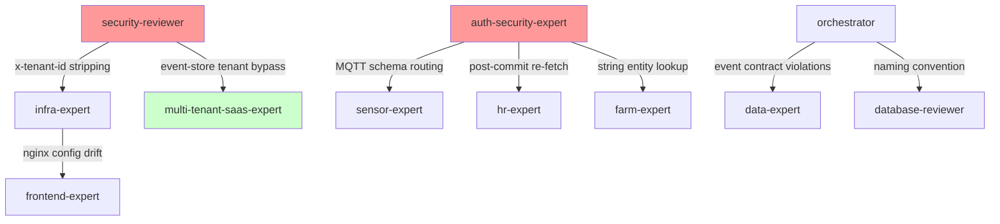

# Context-Manager Consolidation: Tier 1 Validation Compaction

**Date:** 2026-04-09
**Cycle ID:** 2026-04-09
**Reports Consumed:** 7 (4 Tier-1 expert + 1 orchestrator unified + 2 prior cycle)

```
BUDGET_STATUS: OK
ESTIMATED_INPUT_TOKENS: 22463
CONSOLIDATION_OUTPUT_TOKENS: ~6000
COMPRESSION_RATIO: 3.7x
```

---

## 1. COMPACTED FINDING SET

**No CRITICAL findings.** Prior cycle CRITICALs (SEC-C01, SEC-C02, ARCH-C01) RESOLVED via commit `5ce2b127`.

### HIGH Findings (2 confirmed)

**HIGH-A: SEC-HIGH-002 — event-store-service reads X-Tenant-Id directly from headers [CONFIRMED HIGH]**

- Source: security-reviewer
- File: `apps/event-store-service/src/event-store/event-store.controller.ts`
- 20 endpoints use `@Headers('x-tenant-id')`. No TenantGuard, no JWT. InternalApiKeyGuard only.
- Dev mode allows all. Production fails closed if `INTERNAL_API_KEY` not set.
- Remediation: Add TenantAuthorizationMiddleware. Replace with signed tenant claim via `generateServiceIdentityHeaders`.

**HIGH-B: AUTH-HIGH-001 — MQTT handler writes DeviceEvent to wrong schema [NEW, missed by orchestrator]**

- Source: auth-security-expert
- File: `apps/sensor-service/src/ingestion/mqtt-listener.service.ts:1246`
- `this.dataSource.getRepository(DeviceEvent).save(events)` in MQTT context — no AsyncLocalStorage, default search_path = `sensor, public`.
- Remediation: Wrap in `withTenantSchema()` or manual `SET search_path`.

### MEDIUM Findings (grouped by theme)

**Theme 1: Tenant trust chain defense-in-depth gaps (5 findings)**
- SEC-HIGH-001 → MEDIUM: `StripInternalHeadersMiddleware` doesn't strip `x-tenant-id`; log poisoning
- SEC-HIGH-003 → MEDIUM: `ALLOWED_BASE_DOMAINS` fail-open `return true` at line 170
- TENANT-HIGH-001 → MEDIUM: corroborates SEC-HIGH-001 + SEC-HIGH-003
- TENANT-HIGH-002 → MEDIUM: corroborates SEC-HIGH-002 exploitability
- TENANT-HIGH-003 / MEDIUM-015 → LOW

**Theme 2: MQTT / non-request-context tenant scoping (2 findings)**
- AUTH-HIGH-002: `mqtt-listener.service.ts:1177` indirect DeviceIoConfig scoping
- AUTH-HIGH-003: 17 HR handlers post-commit re-fetch on different connection

**Theme 3: Nginx config drift (3 findings)**
- INFRA-HIGH-001 → MEDIUM: `nginx.prod.conf` and `nginx/nginx.conf` missing `/socket.io/`
- INFRA-MEDIUM-001: Catch-all `location /` lacks WebSocket upgrade
- INFRA-MEDIUM-002: Three divergent nginx configs

**Theme 4: Orchestrator MEDIUMs (20 findings)**
- Type safety: MEDIUM-003/004/016 (`as any` / `as unknown as` / `@ts-ignore`)
- Auth hardening: MEDIUM-012/013/014
- Event contracts: MEDIUM-001/002
- See `docs/reviews/orchestrator/2026-04-09-full-platform-audit.md` for full list

### LOW Findings: 16 total

---

## 2. CROSS-DOMAIN DEPENDENCY GRAPH



### Phase 4 Dispatch Candidates

| Source | Target | Reason | Severity |
|---|---|---|---|
| auth-security-expert | sensor-expert | MQTT handler writes to wrong schema | HIGH |
| security-reviewer | infra-expert | x-tenant-id not stripped at gateway | MEDIUM |
| auth-security-expert | hr-expert | 17 handlers with fragile post-commit re-fetch | MEDIUM |

---

## 3. SYSTEMIC PATTERN ANALYSIS

### Pattern A: Tenant context unavailable in non-HTTP paths [SYSTEMIC]

3 independent occurrences across 2 agents:
1. AUTH-HIGH-001: MQTT handler DeviceEvent (sensor-service)
2. AUTH-HIGH-002: MQTT handler DeviceIoConfig (sensor-service)
3. MEDIUM-008: feeding-scheduler cron job (farm-service)

Root-cause: AsyncLocalStorage-based tenant context set by HTTP middleware absent in MQTT/cron. No platform-level `withTenantContext()` abstraction.

### Pattern B: Type safety erosion [ESCALATED: MEDIUM → HIGH]

Unfixed from 2026-04-06 cycle (SYSTEMIC-02): 90 `as any`, 51 `as unknown as`, 3 `@ts-ignore`. Per escalation rules: +1 severity for unfixed systemic pattern.

### Pattern C: Nginx config drift [RECURRING]

Flagged in 2026-04-06 (INFRA-H01). Now 3 divergent configs confirmed. First cycle as systemic — no escalation yet.

---

## 4. CONTRADICTION CHECK

**SEC-HIGH-002 severity:** security-reviewer (HIGH) vs multi-tenant-saas-expert (MEDIUM). Both agree on facts, disagree on severity weighting of "not deployed" and "API key gated." Resolution: **MAX rule → retain HIGH.** "Not deployed yet" is not durable mitigation.

**SEC-HIGH-003 severity:** security-reviewer (HIGH) vs multi-tenant-saas-expert (MEDIUM). Both agree fix = `return false`. Resolution: **MEDIUM-HIGH** (fix is trivial, should be done this sprint). Not a deployment blocker.

**No architectural-arbiter escalation required.** Disagreements are severity calibration, not architectural direction.

**HIGH-004 orchestrator accuracy:** Orchestrator hallucinated "NO tenantId filter" on 3 sites and missed AUTH-HIGH-001 (the genuinely dangerous one). **PROCESS MEDIUM** — future orchestrator passes should verify line-level evidence before severity assignment.

---

## 5. FINDING STATE TABLE

| ID | Severity | State | Age | Source Review |
|---|---|---|---|---|
| SEC-C01 (04-06) | CRITICAL | **RESOLVED** | 3d | orchestrator/2026-04-06 |
| SEC-C02 (04-06) | CRITICAL | **RESOLVED** | 3d | orchestrator/2026-04-06 |
| ARCH-C01 (04-06) | CRITICAL | **RESOLVED** | 3d | orchestrator/2026-04-06 |
| SEC-HIGH-002 | HIGH | **OPEN** | 0d | security-reviewer/2026-04-09 |
| AUTH-HIGH-001 | HIGH | **OPEN** | 0d | auth-security-expert/2026-04-09 |
| SEC-HIGH-001 | MEDIUM | **OPEN** | 0d | security-reviewer/2026-04-09 |
| SEC-HIGH-003 | MEDIUM | **OPEN** | 0d | security-reviewer/2026-04-09 |
| INFRA-HIGH-001 | MEDIUM | **OPEN** | 0d | infra-expert/2026-04-09 |
| AUTH-HIGH-002 | MEDIUM | **OPEN** | 0d | auth-security-expert/2026-04-09 |
| AUTH-HIGH-003 | MEDIUM | **OPEN** | 0d | auth-security-expert/2026-04-09 |
| SEC-H03 (04-06) | HIGH | **OPEN** | 3d | orchestrator/2026-04-06 |
| SEC-H04 (04-06) | HIGH | **OPEN** | 3d | orchestrator/2026-04-06 |

---

## 6. REVISED PRIORITY ORDER

| # | Finding | Severity | Fix Complexity | Rationale |
|---|---|---|---|---|
| 1 | AUTH-HIGH-001: MQTT handler wrong schema | **HIGH** | Medium | Data integrity, new finding |
| 2 | SEC-HIGH-002: event-store header-only tenant | **HIGH** | Medium | Trust boundary violation |
| 3 | SEC-HIGH-003: ALLOWED_BASE_DOMAINS fail-open | **MEDIUM** | Trivial (1 line) | Do it now despite MEDIUM |
| 4 | SEC-HIGH-001: x-tenant-id header priority | **MEDIUM** | Low | Defense-in-depth gap |
| 5 | INFRA-HIGH-001: nginx configs missing /socket.io/ | **MEDIUM** | Low | Prevent config drift |

---

## 7. KEY INSIGHTS

1. **Orchestrator's 5 HIGHs → 2 confirmed HIGHs** after expert validation. 3 downgraded, 1 NEW HIGH found.
2. **No deployment blockers.** Two remaining HIGHs are important but not immediately exploitable.
3. **Systemic pattern "tenant context absent in non-HTTP paths"** is the highest-impact architectural gap.
4. **Type safety erosion** escalated MEDIUM → HIGH (unfixed from prior cycle).
5. **No architectural-arbiter needed** — severity calibration disagreements resolved by MAX rule.
