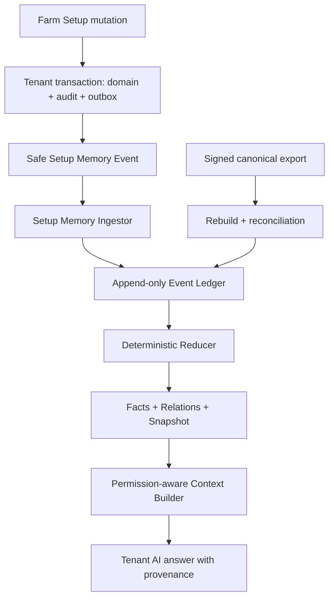

# Tenant Setup Memory Kernel — Mimari Tasarım

> **Durum:** İnceleme taslağı  
> **Sürüm:** 0.1.0  
> **Tarih:** 24 Ağustos 2026  
> **Repo tabanı:** `main@9eba57decff0a152467922c880ffc83bef455473`  
> **Kapsam:** Yalnızca Farm Setup bilgisinin tenant'a özel, kalıcı ve güncel AI hafızasına dönüştürülmesi

## 1. Yönetici kararı

Suderra'nın ilk AI-first altyapı adımı, modelin Farm Setup ekranındaki metinleri sohbet sırasında geçici olarak görmesi değildir. İlk adım, her tenant için **kanıta bağlı ve yeniden üretilebilir bir Setup hafızası** kurmaktır.

Bu tasarımda:

- Farm Setup verisinin doğruluk otoritesi `farm-service` ve ilgili kanonik servislerdir.
- AI hafızası ikinci bir doğruluk otoritesi değildir; kaynak veriden üretilen, izlenebilir bir projeksiyondur.
- Kullanıcı bir Setup kaydı oluşturduğunda, güncellediğinde veya sildiğinde hafıza aynı değişikliği sürümlü olarak işler.
- LLM yeniden eğitilmez ve tenant verisiyle fine-tune edilmez.
- Kalıcılık; append-only event ledger, deterministik reducer, fact/relation projeksiyonu ve kontrollü context retrieval ile sağlanır.
- Engineering ARIA çalışma zamanı kopyalanmaz veya tenant verisine açılmaz. Yalnızca ARIA'nın kanıt, ledger, reducer, replay ve fail-closed ilkeleri Tenant Intelligence Runtime içinde yeniden uygulanır.
- İlk sürüm salt okunurdur. AI Setup verisini açıklar ve bağlam olarak kullanır; Setup kaydı oluşturamaz, değiştiremez veya silemez.

Bu kararın kısa adı: **Tenant Setup Memory Kernel**.

## 2. Amaç ve müşteri sonucu

Amaç, müşterinin AI'ya her konuşmada tesisini yeniden anlatmak zorunda kalmamasıdır. AI, yetkili kullanıcı için şu tür soruları güncel ve kaynaklı cevaplayabilmelidir:

- Bu tenant'ın kaç sitesi, departmanı ve üretim sistemi var?
- Belirli bir ekipman hangi site, departman ve sisteme bağlı?
- Bir sistemin türü, kapasite tanımı ve ilişkili tankları nedir?
- Bu tesiste hangi türler, yemler, kimyasallar ve tedarikçiler tanımlı?
- Bir Setup bilgisi en son ne zaman ve hangi kaynak olayıyla değişti?
- Eksik, çelişkili, silinmiş veya yeniden doğrulanması gereken bir kurulum bilgisi var mı?

Müşteri açısından başarı; AI'nın daha akıllı görünmesi değil, **doğru tenant bağlamını tekrar istemeden bilmesi, yanlış veya eski kurulum bilgisi uydurmaması ve cevabını kaynağa bağlamasıdır**.

## 3. Kapsam

### 3.1 Bu sürümün içinde

Farm Setup arayüzündeki 12 sekme bu hafıza alanının nihai kapsamıdır:

1. Sites
2. Departments
3. Systems
4. Equipment
5. Species
6. Suppliers
7. Slaughter Facilities
8. Chemicals
9. Consumables
10. Fish Health
11. Feeds
12. Workers

Bu sürümün mimari kapsamı şunları içerir:

- AI tarafından görülmesine izin verilen her Setup alanının sözleşmeyle sınıflandırılması.
- Entity ilişkilerinin tenant'a özel bir Setup graph/projection olarak tutulması.
- İlk yükleme, create, update, replace, status change ve delete/tombstone senkronizasyonu.
- Olayların append-only ledger'da saklanması ve deterministic reducer ile projeksiyon üretilmesi.
- Kaynak sürümü, olay kimliği, zaman ve doğrulama durumunun her bilgiyle birlikte tutulması.
- Kaçırılmış olayların full rebuild/reconciliation ile tespit edilmesi.
- AI'nın tüm tenant hafızasını prompt'a doldurmak yerine yalnızca soruyla ilgili context'i kontrollü bir tool üzerinden alması.
- Tenant izolasyonu, güncel kullanıcı yetkisi, PII redaksiyonu, audit ve fail-closed davranış.
- Adım adım rollout ve her adım için bağımsız kabul kapısı.

### 3.2 Bu sürümün dışında

Şunlar daha sonraki ayrı tasarım ekleridir ve bu belgeyle uygulanmaz:

- Sensör veya laboratuvar zaman serileri.
- Su kimyası hesapları, kütle dengesi, hidrolik akış veya nedensel simülasyon.
- Yemleme gerçekleşenleri, FCR, büyüme, mortalite veya üretim episodları.
- Ekipman heartbeat'i, predictive maintenance, iş emri veya bakım görevi.
- Mobil uygulama.
- AI tarafından herhangi bir business mutation veya fiziksel ekipman kontrolü.
- Tenantlar arası ham veri, hafıza veya öğrenme paylaşımı.
- Engineering ARIA'nın repository, shell, GitHub veya PR araçlarının Tenant AI tarafından kullanılması.

## 4. Mevcut repo bağlamı

`Farm Setup`, `web/modules/farm-module/src/pages/setup/SetupPage.tsx` altında 12 sekme olarak sunulmaktadır.

Mevcut `docs/architecture/farm-enterprise-ssot.md` ve `docs/plans/sites-setup-remediation/README.md` şu önemli temeli tanımlar:

- Setup business write'ları tenant transaction, audit ve outbox kontratına taşınmaktadır.
- Site, PII içermeyen site contact replacement, department, system, equipment, sub-equipment, tank, supplier approved-site ve feeder calibration akışlarının önemli bir bölümü hedef kontrata alınmıştır.
- Diğer Setup write yüzeylerinin remediation çalışması devam etmektedir.
- Worker için kanonik otorite HR `employees`; Fish Health terapötik maddeleri için hedef kanonik otorite Chemical master; tank kimliği için hedef otorite `tanks.id`'dir.

Bu nedenle Setup hafızası için kritik ön koşul şudur:

> Backfill tek başına yeterli değildir. AI hafızasının güncel kalabilmesi için kapsam içindeki her kanonik Setup write yüzeyi transaction + audit + outbox sözleşmesini tamamlamalıdır.

Eksik event coverage bulunan aggregate, hafızada `PARTIAL` olarak işaretlenir ve AI bu aggregate için “güncel ve eksiksiz” iddiasında bulunamaz.

## 5. Mimari ilkeler

1. **Source of truth korunur.** Setup row'u veya kanonik servis kaydı gerçektir; memory projection onun kopyasıdır.
2. **Kanıt, çıkarımdan üstündür.** Her fact ve relation bir source event veya backfill snapshot referansına sahiptir.
3. **Model eğitimi ile işletme hafızası ayrılır.** Tenant Setup bilgisi model ağırlıklarına yazılmaz.
4. **Ledger append-only'dir.** Geçmiş olay düzeltilmez; yeni bir düzeltme/supersede olayı eklenir.
5. **Reducer deterministiktir.** Aynı contract sürümü ve aynı olay dizisi aynı canonical projection hash'ini üretir.
6. **Replay idempotent'tir.** Aynı olayın tekrar gelmesi state'i ikinci kez değiştirmez.
7. **Incremental ve clean rebuild eşdeğer olmalıdır.** Eşdeğer değilse projeksiyon yayınlanmaz.
8. **Tenant bağlamı zorunlu ve immutable'dır.** Tenant, model çıktısından veya kullanıcı metninden türetilmez.
9. **Yetki her retrieval anında yeniden değerlendirilir.** Hafızada eski rol/izin kararı cache'lenmez.
10. **Minimum veri ilkesi uygulanır.** “Her detay”, her güvenli ve izinli detaydır; secret, credential ve gereksiz PII değildir.
11. **Belirsizlik görünürdür.** Eksik, eski, çelişkili veya doğrulanmamış bilgi sessizce fact yapılmaz.
12. **Fail-closed davranılır.** Bozuk ledger, bilinmeyen contract sürümü veya reconciliation mismatch varsa son hatalı snapshot “latest” yapılmaz.
13. **AI servis bağımsızlığı korunur.** Setup CRUD, LLM veya memory consumer kapalı olduğunda çalışmaya devam eder.
14. **Adım geçmeden sonraki adıma atlanmaz.** Her rollout kapısında test kanıtı ve açık geçiş kararı gerekir.

## 6. Değerlendirilen yaklaşımlar

| Yaklaşım | Güçlü yanı | Temel riski | Karar |
|---|---|---|---|
| Her AI sorusunda farm-service'e canlı sorgu | İlk geliştirme hızlı, veri güncel | Çok sayıda tool çağrısı, ilişki kurma zorluğu, tarih/provenance ve missed-event görünürlüğü zayıf | Tek başına kullanılmaz; reconciliation ve gerektiğinde doğrulama kaynağı olur |
| Yalnızca vector database / embedding | Metin benzerliği ve serbest soru iyi | Update/delete, exact değer, ilişki, yetki ve deterministik rebuild için doğruluk otoritesi olamaz | Ana hafıza olmaz; ileride yalnızca izinli açıklama alanları için yardımcı index olabilir |
| Event ledger + deterministic projection + kontrollü retrieval | Güncel, izlenebilir, replay edilebilir, graph ilişkilerine uygun | Contract ve event coverage disiplini gerektirir | **Seçilen yaklaşım** |

## 7. Engineering ARIA ile ilişki

Bu proje “Engineering ARIA tenant verisini öğrensin” yaklaşımı değildir.

| Konu | Engineering ARIA | Tenant Setup Memory Kernel |
|---|---|---|
| Amaç | Repository healing, mission/workstream/evidence/PR lifecycle | Bir tenant'ın kurulum bağlamını güvenli biçimde bilmek |
| Veri alanı | Kod, repo graph, findings, test ve PR kanıtları | İzinli Farm Setup fact ve relation'ları |
| Runtime | Engineering Runtime | Tenant Intelligence Runtime içindeki `ai-service` bileşenleri |
| Yetki | Repo/shell/GitHub gibi mühendislik araçları | Sınırlı tenant context retrieval tool'ları |
| Paylaşım | Repository mission state | Tenantlar arasında paylaşılmaz |
| Ortak ilkeler | Event ledger, reducer, evidence, replay, hash, fail-closed | Aynı ilkeler domain'e özel ve ayrı state/security ile uygulanır |

Ortak bir intelligence kernel ileride kod seviyesinde paylaşılabilir; fakat tenant event store'u, projection schema'sı, encryption boundary'si ve service authorization'ı Engineering ARIA'dan ayrıdır.

## 8. Hedef mimari



### 8.1 Yerleşim kararı

İlk sürüm `apps/ai-service` içinde modüler bir `Setup Memory` bounded context olarak kurulur. Bunun nedenleri:

- Mevcut Tenant AI/agent çalışma zamanı ile aynı güvenlik sınırında kalır.
- İlk sürümde ayrı servis operasyon yükü oluşturmaz.
- Event ledger ve projection tabloları bağımsız modül/schema sınırına sahip olabilir.
- Trafik, ekip veya regülasyon ihtiyacı doğarsa daha sonra ayrı servise çıkarılabilir.

`farm-service`, Setup verisinin ve safe memory event üretiminin otoritesidir. LLM'nin `farm-service` veritabanına doğrudan erişimi yoktur.

### 8.2 Bileşenler

| Bileşen | Sorumluluk |
|---|---|
| Setup Memory Contract Registry | Her alanın tipi, birimi, görünürlüğü, sensitivity'si, relation semantiği ve update davranışını tanımlar |
| Safe Memory Event Publisher | Aynı tenant transaction içinde AI'ya izinli canonical snapshot'ı outbox'a yazar |
| Setup Memory Ingestor | Event schema, tenant subject/payload uyumu, signature, idempotency ve version kontrollerini yapar |
| Memory Event Ledger | Kabul edilen olayları tenant içinde append-only saklar |
| Deterministic Reducer | Ledger'dan fact/relation/snapshot projeksiyonlarını üretir |
| Projection Store | Current facts, relations, tombstones, snapshot version ve health bilgisini tutar |
| Backfill/Reconciler | Signed canonical export ile ilk yükleme ve düzenli clean rebuild karşılaştırması yapar |
| Context Builder | Soruyla ilgili ve kullanıcının görmeye yetkili olduğu minimum fact paketini hazırlar |
| Tenant Setup Tool | AgentRunner'a typed, bounded ve read-only context sunar |
| Memory Inspector | Yetkili admin'e coverage, lag, source event, status ve mismatch görünürlüğü verir |

## 9. Setup Memory Contract

### 9.1 Zorunlu alan sınıflandırması

Her Setup entity/DTO alanı aşağıdaki sınıflardan tam olarak birine atanır:

| Sınıf | Anlamı | Örnek kullanım |
|---|---|---|
| `AI_VISIBLE` | AI cevaplarında güvenle kullanılabilen typed fact | Sistem tipi, ekipman modeli, kapasite tanımı |
| `RELATION` | Başka bir kanonik entity ile yönlü ilişki | Equipment `BELONGS_TO` System |
| `REFERENCE_ONLY` | AI değeri değil, kaynağa güvenli referansı tutar | Onaylı doküman ID'si |
| `REDACTED` | Hafızaya alınmaz veya geri döndürülemez biçimde maskelenir | Kişisel telefon, özel adres, secret |
| `DERIVED` | Yalnız sürümlü deterministic code ile hesaplanır | Canonical display path veya relation count |

Bir alan sınıflandırılmadan memory event contract'a eklenemez. Setup entity, DTO veya GraphQL input'a yeni alan eklenip Memory Contract Registry güncellenmezse CI başarısız olur.

### 9.2 Alan sözleşmesi kaydı

Her alan kaydı en az şunları içerir:

```yaml
aggregateType: System
fieldPath: systemType
valueType: enum
unit: null
memoryClass: AI_VISIBLE
sensitivity: INTERNAL
required: true
sourceAuthority: farm-service.systems
updateSemantics: REPLACE
aliases: [system type, production system]
contractVersion: 1
```

Bu registry, frontend label listesinden otomatik türetilmez. Kanonik backend entity/DTO/event contract üzerinden yönetilir.

### 9.3 Setup alanları ve kanonik sahiplik

| Setup sekmesi | Hafıza aggregate'ı | Kanonik kaynak kuralı | Temel relation'lar | Özel güvenlik kuralı |
|---|---|---|---|---|
| Sites | Site, safe Site Contact view | Farm Site | Site `HAS_DEPARTMENT`, `HAS_SYSTEM` | Contact için yalnız onaylı PII-free alanlar |
| Departments | Department | Farm Department | Department `BELONGS_TO` Site | Tenant/site yetkisi zorunlu |
| Systems | System | Farm System | System `BELONGS_TO` Site/Department, `HAS_EQUIPMENT` | Topoloji çıkarımı fact olarak yazılmaz |
| Equipment | Equipment, SubEquipment, Tank reference | Kanonik Equipment; tank-like varlıklarda `tanks.id` | Parent/child, system ve site bağları | Credential ve cihaz secret'ları yasak |
| Species | Species, Growth Stage definitions | Farm Species master | Species `HAS_GROWTH_STAGE` | Bilimsel hedef ile tenant beyanı ayrılır |
| Suppliers | Supplier, Approved Site | Farm Supplier | Supplier `APPROVED_FOR` Site | Gereksiz kişi iletişim PII'si redakte edilir |
| Slaughter Facilities | Slaughter Facility | Kanonik regulatory facility kaydı | Facility `SERVES` tenant/site | Regülasyon numarası görünürlüğü role bağlıdır |
| Chemicals | Chemical master | Farm Chemical master | Chemical `HAS_DOCUMENT_REF` | SDS/credential/content blob yerine güvenli referans |
| Consumables | Consumable master | Kanonik Consumable kaydı | Consumable `SUPPLIED_BY` Supplier | Fiyat/tedarik alanları rol bazlıdır |
| Fish Health | Therapeutic substance view | Chemical master üzerinden compatibility view | Substance `IS_CHEMICAL` | Duplicate local authority oluşturulmaz |
| Feeds | Feed, allowed protocol/table references | Farm Feed master | Feed `SUPPLIED_BY`, `APPLIES_TO_SPECIES` | Formül/belge alanı sensitivity kontratına tabidir |
| Workers | Safe Worker view | HR `employees` | Worker `ASSIGNED_TO` Site/Department, `HAS_ROLE` | Farm worker duplicate store otorite değildir; gereksiz PII tutulmaz |

Bu tablo field-level inventory'nin yerini tutmaz. Uygulamaya geçiş kapısı, on iki sekmenin kanonik backend şemalarındaki alanların tamamının registry'de sınıflandırılmasıdır.

## 10. Safe Setup Memory Event sözleşmesi

### 10.1 Event envelope

```json
{
  "eventId": "uuid",
  "eventType": "setup.memory.source.changed.v1",
  "tenantId": "uuid",
  "aggregateType": "System",
  "aggregateId": "uuid",
  "aggregateVersion": 17,
  "operation": "UPDATE",
  "contractVersion": 1,
  "occurredAt": "2026-08-24T10:00:00.000Z",
  "actorRef": "verified-user-ref",
  "correlationId": "uuid",
  "payloadHash": "sha256",
  "memoryProjection": {
    "id": "uuid",
    "name": "RAS Line 1",
    "systemType": "RAS",
    "siteId": "uuid",
    "departmentId": "uuid"
  }
}
```

### 10.2 Neden full safe projection?

Create/update/replace olayları yalnız field patch değil, contract'ın izin verdiği **tam canonical memory projection** taşır.

Bu karar:

- Consumer'ın olay geldikten sonra değişmiş veya silinmiş row'u yeniden fetch etme yarışını önler.
- Replay'i deterministik yapar.
- Reducer'ın eski alanı yanlışlıkla korumasını engeller.
- PII ve secret filtrelemesini producer tarafında açık kontrata bağlar.

Raw entity serialize edilmez. `memoryProjection`, explicit allowlist serializer ile aynı tenant transaction içinde oluşturulur. Delete olayında payload yerine canonical identity, son bilinen `payloadHash`, delete nedeni sınıfı ve tombstone bilgisi bulunur.

### 10.3 Sürümleme ve sıralama

- `eventId` global olarak benzersiz ve idempotency anahtarıdır.
- `aggregateVersion` aynı aggregate için monoton artar.
- Consumer yalnızca beklenen sonraki sürümü uygular.
- Daha eski/duplicate sürüm no-op olarak audit edilir.
- Sürüm boşluğu olayın uygulanmasını durdurur, aggregate'ı `NEEDS_REVALIDATION` yapar ve reconciliation kuyruğuna alır.
- Bilinmeyen `contractVersion` dead-letter/quarantine alanına gider; fail-open parse edilmez.
- Tenant NATS subject'i ile payload içindeki `tenantId` eşleşmezse olay reddedilir ve güvenlik olayı üretilir.

## 11. Kalıcı veri modeli

İlk sürümde tablolar `ai-service` tarafından yönetilen tenant'a özel schema içinde tutulur. Alternatif paylaşımlı tabloda yalnız `tenant_id` kolonuna güvenilmez. Paylaşımlı fiziksel tablo zorunlu hale gelirse PostgreSQL `FORCE ROW LEVEL SECURITY`, tenant-scoped connection context ve cross-tenant invariant testleri birlikte zorunludur.

### 11.1 `setup_memory_events`

Append-only kabul edilmiş event ledger:

| Alan | Açıklama |
|---|---|
| `event_id` | Idempotency ve source event kimliği |
| `tenant_id` | Immutable tenant scope |
| `aggregate_type`, `aggregate_id` | Source aggregate |
| `aggregate_version` | Per-aggregate monoton sürüm |
| `operation` | CREATE, UPDATE, REPLACE, STATUS_CHANGE, DELETE, BOOTSTRAP |
| `contract_version` | Parser/reducer contract sürümü |
| `payload`, `payload_hash` | Yalnız safe memory projection ve canonical hash |
| `occurred_at`, `ingested_at` | Source ve ingestion zamanı |
| `actor_ref`, `correlation_id` | Audit/provenance bağlantısı |
| `ledger_position`, `previous_hash`, `row_hash` | Sıra ve hash-chain kanıtı |

### 11.2 `setup_memory_facts`

Current ve tarihsel typed facts:

| Alan | Açıklama |
|---|---|
| `fact_id` | Stable fact identity |
| `entity_type`, `entity_id`, `field_path` | Fact'in konusu |
| `value_type`, `typed_value`, `unit` | String-only hafızayı engeller |
| `knowledge_kind` | FACT, INFERENCE, UNKNOWN, CONTRADICTION |
| `verification_state` | DECLARED, VERIFIED, NEEDS_REVALIDATION, SUPERSEDED, DELETED |
| `sensitivity` | PUBLIC, INTERNAL, CONFIDENTIAL, RESTRICTED |
| `source_event_id`, `source_version` | Provenance |
| `valid_from`, `valid_to` | Bitemporal/history desteği |
| `superseded_by`, `content_hash` | Update zinciri ve bütünlük |

### 11.3 `setup_memory_relations`

Yönlü ve kanıtlı Setup graph edge'leri:

- `source_type`, `source_id`
- `relation_type`
- `target_type`, `target_id`
- `verification_state`
- `source_event_id`, `source_version`
- `valid_from`, `valid_to`
- `content_hash`

İlk relation sözlüğü kontrollü enum'dur. Serbest LLM metni relation type olarak kaydedilmez.

### 11.4 `setup_memory_snapshots`

- `projection_version`
- `last_ledger_position`
- `canonical_root_hash`
- `contract_registry_hash`
- `coverage_status`: HEALTHY, PARTIAL, STALE, REBUILDING, QUARANTINED
- `last_event_at`, `last_reconciled_at`
- `reconciliation_source_hash`
- `published_at`

Yeni snapshot, tüm invariant'lar geçmeden `published_at` almaz.

## 12. Bilgi durumu ve “öğrenme” semantiği

Setup ekranına kullanıcı tarafından girilmiş bir değer, tenant'ın **beyan edilmiş konfigürasyonudur**. Her zaman fiziksel olarak doğrulanmış gerçek anlamına gelmez.

| Durum | Anlamı | AI davranışı |
|---|---|---|
| `DECLARED` | Yetkili kaynakta kayıtlı Setup değeri | “Setup'ta böyle tanımlı” diye kullanabilir |
| `VERIFIED` | Ek deterministic veya insan doğrulama kanıtı var | Doğrulama kaynağıyla birlikte daha güçlü ifade edebilir |
| `NEEDS_REVALIDATION` | Sürüm boşluğu, source conflict veya eski doğrulama var | Kesin cevap yerine eksikliği açıklar |
| `SUPERSEDED` | Daha yeni değer tarafından değiştirilmiş | Default current context'e girmez; history isteğinde gösterilir |
| `DELETED` | Kaynakta silinmiş/tombstone olmuş | Current varlık olarak gösterilmez |
| `INFERENCE` knowledge kind | AI veya kural tabanlı çıkarım | Fact'i overwrite edemez; ayrı hypothesis/evidence olarak etiketlenir |
| `UNKNOWN` knowledge kind | Gerekli bilgi kaynakta yok | Tahmin edilmez, kullanıcıya eksik alan olarak bildirilir |
| `CONTRADICTION` knowledge kind | İki kanıt uyuşmuyor | Otomatik seçim yapılmaz; doğrulama gerekir |

Örnek: Setup'ta pompa nominal debisi `120 m³/h` yazıyorsa AI bunu “nominal debi 120 m³/h olarak tanımlanmış” diye bilir. Telemetri olmadan “pompa şu anda 120 m³/h çalışıyor” diyemez.

## 13. İlk yükleme ve sürekli senkronizasyon

### 13.1 İlk yükleme

1. Yetkili bir internal service assertion ile tenant için canonical Setup Export çağrılır.
2. Export, event publisher ile aynı Contract Registry serializer'larını kullanır.
3. Kayıtlar `aggregateType`, `aggregateId`, `fieldPath` sırasıyla canonical hale getirilir.
4. Bootstrap event seti ledger'a idempotent biçimde eklenir.
5. Reducer clean projection üretir.
6. Source export hash ile projection canonical root hash karşılaştırılır.
7. Coverage ve hash kontrolleri geçerse snapshot `HEALTHY` olarak yayınlanır.

### 13.2 Sürekli sync

1. Farm Setup write aynı transaction içinde domain row, audit ve outbox memory event'i commit eder.
2. Ingestor strict schema ve tenant boundary kontrolü yapar.
3. Event ledger'a bir kez yazılır.
4. Reducer yalnız ilgili aggregate facts/relations'ını yeni sürüme taşır.
5. Eski facts `SUPERSEDED`, delete edilen aggregate facts/relations `DELETED` olur.
6. Yeni snapshot atomik olarak yayınlanır.
7. Context Builder yalnız yayınlanmış snapshot'ı kullanır.

### 13.3 Reconciliation ve clean rebuild

- Planlı reconciliation canonical export'u yeniden alır.
- Incremental projection ile sıfırdan reducer replay sonucu karşılaştırılır.
- Canonical root hash farklıysa tenant memory `QUARANTINED` olur.
- Hatalı build latest snapshot'ın üzerine yazılmaz.
- Event kaçırılması, source contract drift veya reducer bug'ı çözülmeden AI “güncel Setup biliyorum” iddiasında bulunmaz.
- Rebuild işlemi aynı event seti ve contract registry hash'iyle tekrarlandığında byte-stable canonical output üretmelidir.

## 14. AI context retrieval

AgentRunner doğrudan memory tablolarına SQL çalıştırmaz. Yalnız typed ve read-only bir tool kullanır:

```typescript
getTenantSetupContext({
  tenantContext,
  callerContext,
  intent,
  entityTypes,
  entityIds,
  siteIds,
  relationDepth,
  includeHistory: false,
  maxFacts
})
```

Tool çıktısı:

- İlgili typed facts.
- İzin verilen relation'lar.
- Her bilgi için `sourceEventId`, `sourceEntity`, `sourceVersion`, `verificationState`, `updatedAt`.
- Snapshot `projectionVersion`, `coverageStatus` ve freshness.
- Redacted/omitted alan sayısı.
- Contradiction ve unknown listesi.

Kurallar:

- Bütün tenant hafızası prompt'a yüklenmez.
- Retrieval önce current caller permission filter'ını uygular.
- `relationDepth` ve `maxFacts` server-side üst sınıra sahiptir.
- History varsayılan olarak kapalıdır.
- Semantic index kullanılsa bile dönen sonuç fact/relation store'dan doğrulanır.
- AI'nın Setup hakkındaki her olgusal iddiası en az bir `factId` veya `relationId` ile desteklenir.
- Snapshot `STALE`, `PARTIAL` veya `QUARANTINED` ise tool bunu saklamaz; gerekli aggregate için cevap fail-closed olur.

## 15. Güvenlik ve mahremiyet

### 15.1 Tenant izolasyonu

- `tenantId` verified gateway/service assertion'dan gelir; prompt veya model parametresi değildir.
- ExecutionContext oluşturulduktan sonra tenant değiştirilemez.
- Event subject, payload, database schema ve retrieval context tenant'ı dört ayrı noktada eşleşmelidir.
- Tenant A event'i Tenant B ledger/projection schema'sına yazılamaz.
- Tenant A için üretilen retrieval cache anahtarı tenant, caller permission revision ve projection version içermelidir.
- Ham tenant Setup verisi başka tenant için prompt, eval fixture veya training corpus olmaz.

### 15.2 PII ve secrets

- Worker için AI'nın öğrenmesi gereken bilgiler iş bağlamıyla sınırlıdır: kanonik çalışan referansı, rol, yetkinlik, site/department assignment ve aktiflik gibi açıkça izinli alanlar.
- Kişisel telefon, ev adresi, özel e-posta, kimlik numarası, banka verisi ve gereksiz serbest metin varsayılan olarak `REDACTED`'dır.
- Sensor/gateway credential, API secret, token veya decrypted credential hiçbir event, ledger, projection, embedding veya prompt'a girmez.
- Doküman içeriği otomatik olarak hafızaya kopyalanmaz; ilk sürüm yalnız güvenli document reference ve metadata tutar.
- Kaynaktaki delete/erasure, memory tombstone ve retention workflow'unu tetikler.

### 15.3 Yetki

- Source event üretimi verified actor ve service identity taşır.
- Retrieval her çağrıda güncel backend permission matrix'iyle sınırlandırılır.
- Admin Memory Inspector ayrı bir permission ister.
- AI, memory status veya redaksiyon nedeniyle görmediği alanı “yok” diye yorumlamaz; “erişilemiyor” ile “tanımlı değil” ayrılır.

## 16. Hata davranışı

| Hata | Sistem davranışı | Kullanıcıya etkisi |
|---|---|---|
| Duplicate event | Idempotent no-op ve metric | Yok |
| Out-of-order eski event | Uygulanmaz, audit edilir | Yok |
| Aggregate version gap | Aggregate `NEEDS_REVALIDATION`, reconciliation | Kesin cevap verilmez |
| Bilinmeyen contract version | Quarantine/dead letter | Etkilenen alan `PARTIAL` |
| Reducer exception | Yeni snapshot yayınlanmaz | Son sağlıklı snapshot, freshness uyarısıyla kullanılabilir; kritik freshness aşılırsa cevap durur |
| Clean rebuild hash mismatch | Tenant memory `QUARANTINED` | Setup cevabı fail-closed |
| Memory consumer kapalı | Farm Setup CRUD çalışır; lag büyür | AI stale olduğunu açıklar veya cevaplamaz |
| LLM kapalı | Setup ve memory sync çalışır | Yalnız AI sohbet özelliği etkilenir |
| Cross-tenant mismatch | Event/retrieval reddedilir, güvenlik alarmı | Veri sızıntısı yerine işlem hatası |

## 17. Observability ve müşteri güveni

Teknik metrikler:

- `setup_memory_contract_coverage_ratio`
- `setup_memory_event_ingest_lag_seconds`
- `setup_memory_projection_lag_seconds`
- `setup_memory_reconciliation_mismatch_total`
- `setup_memory_version_gap_total`
- `setup_memory_quarantined_tenants_total`
- `setup_memory_retrieval_stale_denial_total`
- `setup_memory_cross_tenant_denial_total`
- `setup_memory_redacted_field_total`

Yüksek cardinality tenant kimliği raw metric label olarak kullanılmaz. Tenant bazlı inceleme yetkili audit/inspector üzerinden yapılır.

Memory Inspector en az şunları gösterir:

- Son sağlıklı sync zamanı.
- Son farm source event zamanı.
- Kapsanan aggregate ve alan yüzdesi.
- Bekleyen version gap veya quarantine nedeni.
- Projection version ve canonical root hash.
- Son reconciliation sonucu.
- Bir fact'in source event ve source entity zinciri.

## 18. Test stratejisi

### 18.1 Contract testleri

- On iki Setup sekmesinin kanonik backend alanlarının `%100` sınıflandırıldığı doğrulanır.
- Yeni entity/DTO/event alanı registry güncellemesi olmadan CI'da bloklanır.
- Serializer'ın `REDACTED` ve secret alanları event'e koymadığı golden fixture ile kanıtlanır.
- Event schema strict, bounded ve versioned'dır.

### 18.2 Reducer ve replay testleri

- CREATE → UPDATE → REPLACE → DELETE dizileri için state transition testleri.
- Duplicate, retry, out-of-order ve version gap testleri.
- Property-based rastgele event dizileri.
- Aynı ledger + aynı contract hash → aynı canonical root hash.
- Incremental apply sonucu = clean replay sonucu.
- Unknown state/contract fail-closed olur.

### 18.3 Tenant güvenlik testleri

- Tenant A event'i Tenant B schema'sına yazılamaz.
- Tenant A retrieval'ı Tenant B fact/relation döndüremez.
- Aynı kullanıcı farklı tenant context'lerinde cache karışmasına neden olmaz.
- Permission kaldırılması bir sonraki retrieval çağrısında etkili olur.
- Worker PII ve credentials hiçbir log/event/prompt fixture'ında görünmez.

### 18.4 Entegrasyon ve dayanıklılık testleri

- Farm transaction rollback olduğunda domain, audit ve memory outbox birlikte rollback olur.
- Consumer restart ve redelivery kayıp/çift uygulama yaratmaz.
- Missed event reconciliation tarafından bulunur.
- Rebuild sırasında current sağlıklı snapshot hizmet vermeye devam eder.
- Bozuk snapshot latest olarak promote edilmez.

### 18.5 AI eval seti

Her rollout slice'ı için tenant fixture'larıyla kaynaklı soru seti oluşturulur:

- Exact value soruları.
- Relation/topology soruları.
- Update/delete sonrası freshness soruları.
- Unknown/contradiction soruları.
- Role/PII soruları.
- Cross-tenant saldırı prompt'ları.

Başarı şartı: desteklenmeyen olgusal iddia yoktur; kaynak bulunamadığında model çekimserdir.

## 19. Adım adım rollout kapıları

Bu sıra bilinçli olarak mobile veya ileri operasyon zekâsına atlamaz.

### Kapı 0 — Contract ve mevcut coverage

Teslimat:

- On iki sekme için kanonik aggregate haritası.
- Field-level Memory Contract Registry.
- Current event coverage matrisi.
- PII/secret policy ve CI drift gate.

Geçiş koşulu:

- Kapsamdaki alanların `%100`ü sınıflandırılmıştır.
- Kapsam dışı bırakılan alan yoktur; yalnız explicit `REDACTED` sınıfı vardır.
- Kanonik owner çakışmaları çözülmüştür.

### Kapı 1 — Infrastructure Spine pilotu

Kapsam:

- Site → Department → System → Equipment/SubEquipment/Tank ilişkileri.
- Backfill, event ledger, reducer, projection ve Memory Inspector.

Geçiş koşulu:

- İki ayrı tenant fixture'ında clean rebuild hash'i deterministiktir.
- CREATE/UPDATE/DELETE p95 `5 saniye` içinde published projection'a yansır.
- Cross-tenant testlerinde sızıntı `0`dır.
- Missed/duplicate/out-of-order event testleri geçer.

### Kapı 2 — Setup catalog kapsamı

Kapsam:

- Species, Suppliers, Slaughter Facilities, Chemicals, Consumables, Fish Health ve Feeds.
- Her aggregate için source event coverage ve full reconciliation.

Geçiş koşulu:

- Her aggregate `HEALTHY` coverage durumundadır.
- Duplicate authority yoktur; Fish Health Chemical master'ı kullanır.
- Safe document reference ve sensitivity testleri geçer.

### Kapı 3 — Safe Worker view

Kapsam:

- HR `employees` kaynaklı, role-filtered Worker memory projection.

Geçiş koşulu:

- Farm worker duplicate store memory authority değildir.
- PII redaction ve permission revocation testleri geçer.
- Yetkisiz kullanıcı worker facts göremez.

### Kapı 4 — Read-only AI context

Kapsam:

- `getTenantSetupContext` tool'u.
- Kaynaklı cevap, freshness/coverage gösterimi ve read-only shadow eval.

Geçiş koşulu:

- AI claim'lerinin `%100`ü fact/relation provenance taşır.
- Critical missing context'te çekimserlik `%100`dür.
- Yetkisiz mutation tool'u yoktur.
- Tenant başına feature flag ile açılıp kapatılabilir.

### Kapı 5 — Sınırlı müşteri pilotu

Kapsam:

- Önce iç tenant, sonra açıkça seçilmiş az sayıda tenant.
- Memory Inspector ve kullanıcı geri bildirim ölçümü.

Geçiş koşulu:

- Reconciliation mismatch `0`.
- Cross-tenant veya PII incident `0`.
- Setup sorularında kullanıcı fayda puanı hedefi `≥4/5`.
- AI cevabının “eski bilgi” olarak işaretlendiği doğrulanmış olay `0`.

Her kapının sonucu yazılı test kanıtı ve go/no-go kararıyla kaydedilir. Bir kapı başarısızken sonraki kapı feature flag'i açılamaz.

## 20. Definition of Done

Tenant Setup Memory Kernel ilk fazı tamamlanmış sayılır ancak aşağıdakilerin tamamı sağlandığında:

- On iki Setup sekmesindeki her kanonik alan Memory Contract Registry'de sınıflandırılmıştır.
- Tüm izinli create/update/replace/status/delete akışları transaction-bound outbox memory event'i üretir.
- İlk backfill ve incremental sync aynı canonical projection'ı üretir.
- Ledger replay idempotent, versioned, hash-bound ve deterministic'tir.
- Delete'ler tombstone olur; eski facts current context'e sızmaz.
- AI yalnız güncel caller permission'ıyla typed retrieval kullanır.
- Her Setup claim'i provenance taşır.
- Stale, partial, contradiction ve unknown durumları görünür ve fail-closed'dur.
- Worker PII, credentials ve secrets event/ledger/projection/prompt'a girmez.
- Cross-tenant okuma/yazma testleri sıfır sızıntıyla geçer.
- Setup CRUD, memory veya LLM arızasından bağımsız çalışır.
- İlk müşteri pilotu read-only ve feature-flag kontrollüdür.

## 21. Sonraki domain'leri ekleme protokolü

Bu belge yaşayan bir ana tasarımdır; fakat yeni domain yalnız başlık eklenerek hafızaya bağlanmaz. Her yeni domain şu paketi getirmelidir:

1. Kanonik source owner.
2. Field/event Memory Contract.
3. PII ve authority boundary.
4. Initial backfill ve continuous event coverage.
5. Deterministic reducer/projection.
6. Reconciliation ve clean rebuild eşdeğerliği.
7. Typed retrieval contract.
8. Tenant isolation, failure ve AI eval kanıtları.
9. Ayrı rollout gate ve müşteri başarı ölçütü.

Planlanan fakat bu sürümde tasarlanmayan ekler:

- Operasyon ve bakım episod hafızası.
- Üretim, yem, biomass ve FCR hafızası.
- Su kimyası ve bilimsel model registry'si.
- RAS topoloji, akış ve mass-balance context'i.
- İnsan onaylı görev ve sonuç öğrenme döngüsü.

Bu alanlar Setup Memory Kernel sağlıklı ve kanıtlanmış olmadan başlatılmaz.

## 22. Belge geliştirme kaydı

| Sürüm | Tarih | Değişiklik |
|---|---|---|
| 0.1.0 | 24 Ağustos 2026 | Setup hafızasının sınırı, event-ledger/reducer mimarisi, güvenlik modeli, veri modeli, retrieval ve adım adım rollout kapıları tanımlandı |

Bu sürüm mimari inceleme içindir. Kullanıcı onayı sonrasında aynı belgeye field-level contract inventory eklenir; ayrıntılı kod uygulama planı ayrı bir plan belgesi olarak hazırlanır.
