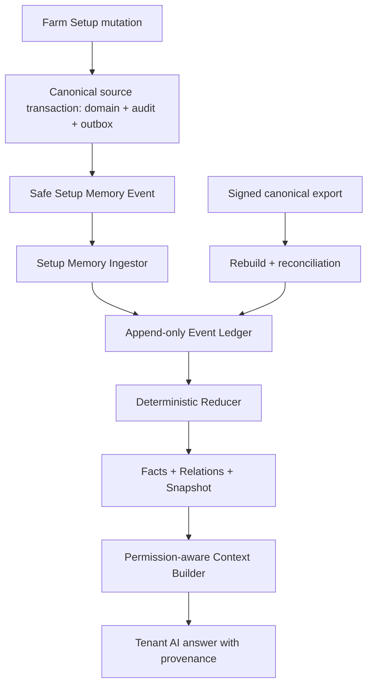

# Step 1 — Tenant Sisteminin Eksiksiz Öğrenilmesi

> **Durum:** İnceleme taslağı  
> **Mimari adı:** Tenant Setup Memory Kernel  
> **Sürüm:** 0.2.0  
> **Tarih:** 24 Ağustos 2026  
> **Repo tabanı:** `main@9eba57decff0a152467922c880ffc83bef455473`  
> **Kapsam:** Farm Setup'taki tenant sistem tanımının eksiksiz, kalıcı ve güncel AI hafızasına dönüştürülmesi

## Kurucu sözleşme

1. AI tenant sistemini sohbet metninden veya model ağırlıklarından değil, kanonik Setup kaynaklarından öğrenir.
2. “Her şey”; izinli bütün alanları, ilişkileri, durumları, sürümleri, sahiplikleri, silmeleri, bilinmeyenleri ve çelişkileri kapsar. Secret, credential, gereksiz PII, operasyon zaman serisi ve fiziksel çalışma durumu bu adımın parçası değildir.
3. Bir bilginin “öğrenilmiş” sayılması için initial backfill, continuous create/update/delete sync, provenance, güncel permission filter ve deterministic clean-rebuild eşdeğerliğinin tamamı kanıtlanmış olmalıdır.

## 1. Yönetici kararı

Suderra'nın ilk AI-first altyapı adımı, modelin Farm Setup ekranındaki metinleri sohbet sırasında geçici olarak görmesi değildir. İlk adım, her tenant için **kanıta bağlı ve yeniden üretilebilir bir Setup hafızası** kurmaktır.

Bu tasarımda:

- Farm Setup verisinin doğruluk otoritesi `farm-service` ve ilgili kanonik servislerdir.
- AI hafızası ikinci bir doğruluk otoritesi değildir; kaynak veriden üretilen, izlenebilir bir projeksiyondur.
- Kullanıcı bir Setup kaydı oluşturduğunda, güncellediğinde veya sildiğinde hafıza aynı değişikliği sürümlü olarak işler.
- LLM yeniden eğitilmez ve tenant verisiyle fine-tune edilmez.
- Kalıcılık; append-only event ledger, deterministik reducer, fact/relation projeksiyonu ve kontrollü context retrieval ile sağlanır.
- Engineering ARIA çalışma zamanı kopyalanmaz veya tenant verisine açılmaz. Yalnızca ARIA'nın kanıt, ledger, reducer, replay ve fail-closed ilkeleri Tenant Intelligence Runtime içinde yeniden uygulanır.
- İlk sürüm salt okunurdur. AI Setup verisini açıklar ve bağlam olarak kullanır; Setup kaydı oluşturamaz, değiştiremez veya silemez.

Bu kararın kısa adı: **Tenant Setup Memory Kernel**.

### 1.1 Tenant sistem modeli

| Katman | AI'nın bu adımda öğreneceği bağlam |
|---|---|
| Tenant kökü | Tenant kimliği ve yalnız yetkili context'ten gelen kapsam |
| Tesis hiyerarşisi | Site → Department → System → Equipment/SubEquipment/Tank ilişkileri |
| Fiziksel tanımlar | Ekipman tipi/modeli, nominal kapasite, kurulum ve Setup durumları |
| Biyolojik ve tedarik katalogları | Species, Feed, Chemical, Consumable, Supplier ve Slaughter Facility tanımları |
| İnsan organizasyonu | HR kaynaklı güvenli Worker role/skill/site/department assignment görünümü |
| Kanıt ve değişim | Kaynak owner, source version, event, zaman, supersession, delete ve verification state |

Setup'taki `ACTIVE`, `INACTIVE` veya benzeri alanlar **beyan edilmiş idari durumdur**. Bu adım equipment heartbeat, gerçek debi, arıza, sensör ölçümü veya fiziksel olarak çalışıyor olma durumu çıkarmaz.

## 2. Amaç ve müşteri sonucu

Amaç, müşterinin AI'ya her konuşmada tesisini yeniden anlatmak zorunda kalmamasıdır. AI, yetkili kullanıcı için şu tür soruları güncel ve kaynaklı cevaplayabilmelidir:

- Bu tenant'ın kaç sitesi, departmanı ve üretim sistemi var?
- Belirli bir ekipman hangi site, departman ve sisteme bağlı?
- Bir sistemin türü, kapasite tanımı ve ilişkili tankları nedir?
- Bu tesiste hangi türler, yemler, kimyasallar ve tedarikçiler tanımlı?
- Bir Setup bilgisi en son ne zaman ve hangi kaynak olayıyla değişti?
- Eksik, çelişkili, silinmiş veya yeniden doğrulanması gereken bir kurulum bilgisi var mı?

Müşteri açısından başarı; AI'nın daha akıllı görünmesi değil, **doğru tenant bağlamını tekrar istemeden bilmesi, yanlış veya eski kurulum bilgisi uydurmaması ve cevabını kaynağa bağlamasıdır**.

## 3. Kapsam

### 3.1 Bu sürümün içinde

Farm Setup arayüzündeki 12 sekme bu hafıza alanının nihai kapsamıdır:

1. Sites
2. Departments
3. Systems
4. Equipment
5. Species
6. Suppliers
7. Slaughter Facilities
8. Chemicals
9. Consumables
10. Fish Health
11. Feeds
12. Workers

Bu sürümün mimari kapsamı şunları içerir:

- AI tarafından görülmesine izin verilen her Setup alanının sözleşmeyle sınıflandırılması.
- Entity ilişkilerinin tenant'a özel bir Setup graph/projection olarak tutulması.
- İlk yükleme, create, update, replace, status change ve delete/tombstone senkronizasyonu.
- Olayların append-only ledger'da saklanması ve deterministic reducer ile projeksiyon üretilmesi.
- Kaynak sürümü, olay kimliği, zaman ve doğrulama durumunun her bilgiyle birlikte tutulması.
- Kaçırılmış olayların full rebuild/reconciliation ile tespit edilmesi.
- AI'nın tüm tenant hafızasını prompt'a doldurmak yerine yalnızca soruyla ilgili context'i kontrollü bir tool üzerinden alması.
- Tenant izolasyonu, güncel kullanıcı yetkisi, PII redaksiyonu, audit ve fail-closed davranış.
- Adım adım rollout ve her adım için bağımsız kabul kapısı.

### 3.2 Bu sürümün dışında

Şunlar daha sonraki ayrı tasarım ekleridir ve bu belgeyle uygulanmaz:

- Sensör veya laboratuvar zaman serileri.
- Su kimyası hesapları, kütle dengesi, hidrolik akış veya nedensel simülasyon.
- Yemleme gerçekleşenleri, FCR, büyüme, mortalite veya üretim episodları.
- Ekipman heartbeat'i, predictive maintenance, iş emri veya bakım görevi.
- Mobil uygulama.
- AI tarafından herhangi bir business mutation veya fiziksel ekipman kontrolü.
- Tenantlar arası ham veri, hafıza veya öğrenme paylaşımı.
- Engineering ARIA'nın repository, shell, GitHub veya PR araçlarının Tenant AI tarafından kullanılması.

## 4. Mevcut repo bağlamı

`Farm Setup`, `web/modules/farm-module/src/pages/setup/SetupPage.tsx` altında 12 sekme olarak sunulmaktadır.

Mevcut `docs/architecture/farm-enterprise-ssot.md` ve `docs/plans/sites-setup-remediation/README.md` şu önemli temeli tanımlar:

- Setup business write'ları tenant transaction, audit ve outbox kontratına taşınmaktadır.
- Site, PII içermeyen site contact replacement, department, system, equipment, sub-equipment, tank, supplier approved-site ve feeder calibration akışlarının önemli bir bölümü hedef kontrata alınmıştır.
- Diğer Setup write yüzeylerinin remediation çalışması devam etmektedir.
- Worker için kanonik otorite HR `employees`; Fish Health terapötik maddeleri için hedef kanonik otorite Chemical master; tank kimliği için hedef otorite `tanks.id`'dir.

Bu nedenle Setup hafızası için kritik ön koşul şudur:

> Backfill tek başına yeterli değildir. AI hafızasının güncel kalabilmesi için kapsam içindeki her kanonik Setup write yüzeyi transaction + audit + outbox sözleşmesini tamamlamalıdır.

Eksik event coverage bulunan aggregate, hafızada `PARTIAL` olarak işaretlenir ve AI bu aggregate için “güncel ve eksiksiz” iddiasında bulunamaz.

## 5. Mimari ilkeler

1. **Source of truth korunur.** Setup row'u veya kanonik servis kaydı gerçektir; memory projection onun kopyasıdır.
2. **Kanıt, çıkarımdan üstündür.** Her fact ve relation bir source event veya backfill snapshot referansına sahiptir.
3. **Model eğitimi ile işletme hafızası ayrılır.** Tenant Setup bilgisi model ağırlıklarına yazılmaz.
4. **Ledger append-only'dir.** Geçmiş olay düzeltilmez; yeni bir düzeltme/supersede olayı eklenir.
5. **Reducer deterministiktir.** Aynı contract sürümü ve aynı olay dizisi aynı canonical projection hash'ini üretir.
6. **Replay idempotent'tir.** Aynı olayın tekrar gelmesi state'i ikinci kez değiştirmez.
7. **Incremental ve clean rebuild eşdeğer olmalıdır.** Eşdeğer değilse projeksiyon yayınlanmaz.
8. **Tenant bağlamı zorunlu ve immutable'dır.** Tenant, model çıktısından veya kullanıcı metninden türetilmez.
9. **Yetki her retrieval anında yeniden değerlendirilir.** Hafızada eski rol/izin kararı cache'lenmez.
10. **Minimum veri ilkesi uygulanır.** “Her detay”, her güvenli ve izinli detaydır; secret, credential ve gereksiz PII değildir.
11. **Belirsizlik görünürdür.** Eksik, eski, çelişkili veya doğrulanmamış bilgi sessizce fact yapılmaz.
12. **Fail-closed davranılır.** Bozuk ledger, bilinmeyen contract sürümü veya reconciliation mismatch varsa son hatalı snapshot “latest” yapılmaz.
13. **AI servis bağımsızlığı korunur.** Setup CRUD, LLM veya memory consumer kapalı olduğunda çalışmaya devam eder.
14. **Adım geçmeden sonraki adıma atlanmaz.** Her rollout kapısında test kanıtı ve açık geçiş kararı gerekir.

## 6. Değerlendirilen yaklaşımlar

| Yaklaşım | Güçlü yanı | Temel riski | Karar |
|---|---|---|---|
| Her AI sorusunda farm-service'e canlı sorgu | İlk geliştirme hızlı, veri güncel | Çok sayıda tool çağrısı, ilişki kurma zorluğu, tarih/provenance ve missed-event görünürlüğü zayıf | Tek başına kullanılmaz; reconciliation ve gerektiğinde doğrulama kaynağı olur |
| Yalnızca vector database / embedding | Metin benzerliği ve serbest soru iyi | Update/delete, exact değer, ilişki, yetki ve deterministik rebuild için doğruluk otoritesi olamaz | Ana hafıza olmaz; ileride yalnızca izinli açıklama alanları için yardımcı index olabilir |
| Event ledger + deterministic projection + kontrollü retrieval | Güncel, izlenebilir, replay edilebilir, graph ilişkilerine uygun | Contract ve event coverage disiplini gerektirir | **Seçilen yaklaşım** |

## 7. Engineering ARIA ile ilişki

Bu proje “Engineering ARIA tenant verisini öğrensin” yaklaşımı değildir.

| Konu | Engineering ARIA | Tenant Setup Memory Kernel |
|---|---|---|
| Amaç | Repository healing, mission/workstream/evidence/PR lifecycle | Bir tenant'ın kurulum bağlamını güvenli biçimde bilmek |
| Veri alanı | Kod, repo graph, findings, test ve PR kanıtları | İzinli Farm Setup fact ve relation'ları |
| Runtime | Engineering Runtime | Tenant Intelligence Runtime içindeki `ai-service` bileşenleri |
| Yetki | Repo/shell/GitHub gibi mühendislik araçları | Sınırlı tenant context retrieval tool'ları |
| Paylaşım | Repository mission state | Tenantlar arasında paylaşılmaz |
| Ortak ilkeler | Event ledger, reducer, evidence, replay, hash, fail-closed | Aynı ilkeler domain'e özel ve ayrı state/security ile uygulanır |

Ortak bir intelligence kernel ileride kod seviyesinde paylaşılabilir; fakat tenant event store'u, projection schema'sı, encryption boundary'si ve service authorization'ı Engineering ARIA'dan ayrıdır.

## 8. Hedef mimari



### 8.1 Yerleşim kararı

İlk sürüm `apps/ai-service` içinde modüler bir `Setup Memory` bounded context olarak kurulur. Bunun nedenleri:

- Mevcut Tenant AI/agent çalışma zamanı ile aynı güvenlik sınırında kalır.
- İlk sürümde ayrı servis operasyon yükü oluşturmaz.
- Event ledger ve projection tabloları bağımsız modül/schema sınırına sahip olabilir.
- Trafik, ekip veya regülasyon ihtiyacı doğarsa daha sonra ayrı servise çıkarılabilir.

Farm Setup kullanıcı arayüzü kapsamıdır; tek başına source authority değildir. Her aggregate'ın kanonik sahibi, kendi tenant transaction'ı ve service outbox'ı içinde Safe Setup Memory Event üretir. `farm-service` yalnız Farm-owned aggregate'ların sahibidir. Worker Safe View yalnız HR `employees` kanonik kaynağından, HR tarafından üretilen allowlist event/export ile beslenir; `farm-service` Worker verisini yeniden yazmaz veya canonicalize etmez. Cross-service projection yalnız source authority, event-contract registry ve tenant authorization gate'leri tamamlandığında açılır. Aynı kural Farm dışında kanonik sahibi bulunan diğer Setup aggregate'larına da uygulanır.

LLM'nin `farm-service`, `hr-service` veya başka bir source authority veritabanına doğrudan erişimi yoktur.

### 8.2 Bileşenler

| Bileşen | Sorumluluk |
|---|---|
| Setup Memory Contract Registry | Her alanın tipi, birimi, görünürlüğü, sensitivity'si, relation semantiği ve update davranışını tanımlar |
| Safe Memory Event Publisher | Aynı tenant transaction içinde AI'ya izinli canonical snapshot'ı outbox'a yazar |
| Setup Memory Ingestor | Event schema, tenant subject/payload uyumu, signature, idempotency ve version kontrollerini yapar |
| Memory Event Ledger | Kabul edilen olayları tenant içinde append-only saklar |
| Deterministic Reducer | Ledger'dan fact/relation/snapshot projeksiyonlarını üretir |
| Projection Store | Current facts, relations, tombstones, snapshot version ve health bilgisini tutar |
| Backfill/Reconciler | Signed canonical export ile ilk yükleme ve düzenli clean rebuild karşılaştırması yapar |
| Context Builder | Soruyla ilgili ve kullanıcının görmeye yetkili olduğu minimum fact paketini hazırlar |
| Tenant Setup Tool | AgentRunner'a typed, bounded ve read-only context sunar |
| Memory Inspector | Yetkili admin'e coverage, lag, source event, status ve mismatch görünürlüğü verir |

## 9. Setup Memory Contract

### 9.1 Zorunlu alan sınıflandırması

Her Setup entity/DTO alanı aşağıdaki sınıflardan tam olarak birine atanır:

| Sınıf | Anlamı | Örnek kullanım |
|---|---|---|
| `AI_VISIBLE` | AI cevaplarında güvenle kullanılabilen typed fact | Sistem tipi, ekipman modeli, kapasite tanımı |
| `RELATION` | Başka bir kanonik entity ile yönlü ilişki | Equipment `BELONGS_TO` System |
| `REFERENCE_ONLY` | AI değeri değil, kaynağa güvenli referansı tutar | Onaylı doküman ID'si |
| `REDACTED` | Hafızaya alınmaz veya geri döndürülemez biçimde maskelenir | Kişisel telefon, özel adres, secret |
| `DERIVED` | Yalnız sürümlü deterministic code ile hesaplanır | Canonical display path veya relation count |

Bir alan sınıflandırılmadan memory event contract'a eklenemez. Setup entity, DTO veya GraphQL input'a yeni alan eklenip Memory Contract Registry güncellenmezse CI başarısız olur.

Buradaki eksiksizlik, alanların `%100`ünün LLM prompt'una verilmesi değil, `%100`ünün bilinçli bir kontrat kararına sahip olmasıdır. Her alan ayrıca `sourceLane` taşır:

- `SETUP`: Bu adımda tenant sistem tanımına alınır.
- `OPERATIONAL`: UI'da Setup altında görünse bile stok miktarı, current load veya canlı cihaz durumu gibi değişken değerler kendi operasyon otoritesinde kalır; Setup hafızası yalnız güvenli referansını tutar.
- `IDENTITY_PII`: Ayrı permission, retention ve erasure kontratı gerektirir; v1 allowlist dışında değer hafızaya alınmaz.

Serbest metin alanları (`description`, `notes`, `precautions` gibi) izin verilse bile **untrusted data** olarak saklanır. System prompt veya tool instruction olamaz; content scanning, uzunluk sınırı, permission filter ve açık data delimiters olmadan modele verilmez.

### 9.2 Alan sözleşmesi kaydı

Her alan kaydı en az şunları içerir:

```yaml
aggregateType: System
fieldPath: systemType
valueType: enum
unit: null
memoryClass: AI_VISIBLE
sensitivity: INTERNAL
sourceLane: SETUP
required: true
sourceAuthority: farm-service.systems
updateSemantics: REPLACE
aliases: [system type, production system]
memoryContractVersion: 1
```

Bu registry, frontend label listesinden otomatik türetilmez. Kanonik backend entity/DTO/event contract üzerinden yönetilir.

### 9.3 Setup alanları ve kanonik sahiplik

| Setup sekmesi | Hafıza aggregate'ı | Kanonik kaynak kuralı | Temel relation'lar | Özel güvenlik kuralı |
|---|---|---|---|---|
| Sites | Site, safe Site Contact view | Farm Site | Site `HAS_DEPARTMENT`, `HAS_SYSTEM` | Contact için yalnız onaylı PII-free alanlar |
| Departments | Department | Farm Department | Department `BELONGS_TO` Site | Tenant/site yetkisi zorunlu |
| Systems | System | Farm System | System `BELONGS_TO` Site/Department, `HAS_EQUIPMENT` | Topoloji çıkarımı fact olarak yazılmaz |
| Equipment | Equipment, SubEquipment, Tank reference | Kanonik Equipment; tank-like varlıklarda `tanks.id` | Parent/child, system ve site bağları | Credential ve cihaz secret'ları yasak |
| Species | Species, Growth Stage definitions | Farm Species master | Species `HAS_GROWTH_STAGE` | Bilimsel hedef ile tenant beyanı ayrılır |
| Suppliers | Supplier, Approved Site | Farm Supplier | Supplier `APPROVED_FOR` Site | Gereksiz kişi iletişim PII'si redakte edilir |
| Slaughter Facilities | Slaughter Facility | Kanonik regulatory facility kaydı | Facility `SERVES` tenant/site | Regülasyon numarası görünürlüğü role bağlıdır |
| Chemicals | Chemical master | Farm Chemical master | Chemical `HAS_DOCUMENT_REF` | SDS/credential/content blob yerine güvenli referans |
| Consumables | Consumable master | Kanonik Consumable kaydı | Consumable `SUPPLIED_BY` Supplier | Fiyat/tedarik alanları rol bazlıdır |
| Fish Health | Therapeutic substance view | Chemical master üzerinden compatibility view | Substance `IS_CHEMICAL` | Duplicate local authority oluşturulmaz |
| Feeds | Feed, allowed protocol/table references | Farm Feed master | Feed `SUPPLIED_BY`, `APPLIES_TO_SPECIES` | Formül/belge alanı sensitivity kontratına tabidir |
| Workers | Safe Worker view | HR `employees` | Worker `ASSIGNED_TO` Site/Department, `HAS_ROLE` | Farm worker duplicate store otorite değildir; gereksiz PII tutulmaz |

Bu tablo field-level inventory'nin yerini tutmaz. Uygulamaya geçiş kapısı, on iki sekmenin kanonik backend şemalarındaki alanların tamamının registry'de sınıflandırılmasıdır.

### 9.4 Repo tabanlı field inventory — coverage dili

Bu bölüm, `main@9eba57decff0a152467922c880ffc83bef455473` için insan tarafından okunabilir başlangıç envanteridir. Uygulamada doğruluk kaynağı, aynı bilgiyi alan başına tutan ve CI tarafından backend entity/DTO/event sözleşmeleriyle karşılaştırılan sürümlü `setup-memory-field-manifest.yaml` olacaktır.

Her alan manifest'te en az şu kararları taşır: `fieldPath`, `valueType`, `unit`, `memoryClass`, `sensitivity`, `sourceLane`, `sourceAuthority`, `relationTarget`, `updateSemantics`, `lifecycle`, `eventCoverage`, `retention`, `erasurePolicy` ve `contractVersion`. JSON alanları tek bir opaque fact değildir; izinli alt yollar typed schema üzerinden ayrı ayrı sınıflandırılır. Bilinmeyen JSON key'leri varsayılan olarak modele verilmez.

| Coverage | Anlamı | AI'nın söyleyebileceği |
|---|---|---|
| `C0 BLOCKED` | Kanonik owner çakışıyor, alan kalıcı değil veya güvenli source contract yok | “Bu bilgi güvenilir Setup hafızasında bulunmuyor” |
| `C1 SOURCE_ONLY` | Kanonik kayıt var; fakat create/update/delete lifecycle outbox coverage yok | Yalnız backfill kaynağını ve `PARTIAL` durumunu açıklar |
| `C2 EVENT_PARTIAL` | Transaction-bound audit/outbox var; fakat event full safe projection, alan sürümü veya tombstone için yetersiz | Son reconciliation zamanı ve eksik coverage uyarısıyla cevaplar |
| `C3 MEMORY_READY` | Full safe projection, monoton aggregate version, tombstone, backfill ve reconciliation kanıtlı | Kaynak ve freshness ile kesin Setup fact'i olarak kullanır |

Bu baseline'da `C3 MEMORY_READY` aggregate yoktur. Dolayısıyla bu envanter, “AI bugün her şeyi biliyor” iddiası değil; bu iddiayı güvenle kurabilmek için kapanması gereken sözleşme listesidir.

### 9.5 Infrastructure Spine alan envanteri

#### Site ve Site Contact

| Alan grubu | Kesin field path'ler | Memory kararı | Baseline |
|---|---|---|---|
| Kimlik ve lifecycle | `id`, `tenantId`, `status`, `isActive`, `isDeleted`, `deletedAt`, `version`, audit alanları | ID/tenant/version `DERIVED`; `status` Setup beyanı; soft-delete tombstone olur; `isActive` ikinci bağımsız fact değil lifecycle'dan türetilir | `C2` |
| Temel tanım | `name`, `code`, `type`, `description`, `country`, `region`, `timezone` | Typed `AI_VISIBLE`; tenant beyanı | `C2`; update event'i `country`, `region`, `timezone` için eksik |
| Regülasyon | `lokalitetsnummer`, `organisationNumberOverride` | `REFERENCE_ONLY`; role-filtered business/regulatory identifier | `C2`; event payload'ı eksik |
| Konum ve alan | `location.latitude`, `location.longitude`, `location.altitude`, `monitoringRadiusM`, `monitoringArea.type`, `monitoringArea.coordinates`, `monitoringLocationRevision`, `areaM2`/`totalArea` | Radius/alan typed fact; hassas koordinat ve geofence `REFERENCE_ONLY`; `totalArea`, `areaM2` alias'ıdır | `C2`; full projection yok |
| Adres ve iletişim | `address.street`, `address.city`, `address.state`, `address.postalCode`, `address.country`, `city`, `siteManager`, `contactEmail`, `contactPhone` | PII/lokasyon nedeniyle `REDACTED`; `city`, `address.city` için duplicate fact yaratılmaz | `C2`; modele verilmez |
| Kapasite/fiziksel setup | `waterCapacityM3`, `maxBiomassKg`, `establishedDate` | Typed Setup tanımı; değer girilebilen kanonik write yüzeyi oluşmadan `UNKNOWN` | `C0`; entity'de var, mevcut Setup form/DTO yolunda yok |
| Tesis imkânları | `facilities.waterSupply`, `electricity`, `generator`, `storage`, `office`, `workshop`, `feedStorage`, `coldStorage`, `laboratory`, `quarantine`, `processingArea`, `staffQuarters` | Typed booleans; Setup lane | `C0`; entity JSON'ı var, form/DTO write yüzeyi yok |
| Tenant ayarları | `settings.timezone`, `locale`, `currency`, `measurementSystem`, `operatingHours.start`, `operatingHours.end`, `emergencyContacts[]` | Typed safe ayarlar allowlist; emergency contact PII'si `REDACTED` | `C2` yalnız API write'ında; current UI yok |
| Serbest içerik | `notes`, `metadata` | `notes` untrusted/redacted; arbitrary `metadata` schema olmadan modele kapalı | `C0`; Setup write contract yok |
| Site contact seti | `SiteContact.id`, `siteId`, `name`, `role`, `email`, `phone`, `isPrimary` | `siteId` relation; `role` ve `isPrimary` safe; ad/e-posta/telefon `REDACTED`; tam-set replacement | `C2`; event yalnız count/primary-change taşır; UI bileşeni sekmeye bağlı değil |

Kanıt kökleri: `apps/farm-service/src/site`, `web/modules/farm-module/src/pages/setup/components/SiteFormModal.tsx`, `SiteContactsSection.tsx`, `web/modules/farm-module/src/pages/setup/tabs/SitesTab.tsx`, `libs/event-contracts/src/farm-events.ts`.

#### Department

| Alan grubu | Kesin field path'ler | Memory kararı | Baseline |
|---|---|---|---|
| Kimlik/lifecycle | `id`, `tenantId`, `status`, `isActive`, delete/version/audit alanları | Kimlik/version `DERIVED`; canonical lifecycle tek fact | `C2` |
| Hiyerarşi | `siteId`, `managerUserId` | `siteId` `RELATION`; manager person ID v1 context'e girmez | `C2`; `siteId` update ile değiştirilemez |
| Temel tanım | `name`, `code`, `type`, `description`, `capacity` | Typed `AI_VISIBLE`; `capacity` birimi contract'ta netleşmeden `UNKNOWN_UNIT` | `C2`; event yalnız core alanların bir bölümünü taşır |
| Yönetici/iletişim | `managerName`, `contactEmail`, `contactPhone`, `departmentManager` | PII `REDACTED`; son üç alan hook/UI beklentisi olup canonical entity/response değildir | `C0` hook-only alanlar |
| Ayarlar | `settings.maxCapacity`, `operatingTemperature.min`, `operatingTemperature.max`, `operatingTemperature.unit`, `waterType`, `biosecurityLevel`, `requiredCertifications[]`, `customFields`, `area` | Typed schema tamamlananlar `REFERENCE_ONLY`; arbitrary custom fields redacted | `C0`; DTO'da tanımlı değerler handler/entity tarafından persist edilmiyor |
| Operasyon alanı | `currentLoad` | `sourceLane: OPERATIONAL`; Setup fact'i değildir | `C0`; hook-only, canonical değil |
| Not | `notes` | Untrusted free text; v1 modele kapalı | `C0`; persist ediliyor fakat response/query taşımadığı için edit sessiz veri kaybı riski yaratıyor |

Kanıt kökleri: `apps/farm-service/src/department`, `web/modules/farm-module/src/hooks/useDepartments.ts`, `web/modules/farm-module/src/pages/setup/tabs/DepartmentsTab.tsx`.

#### System ve SubSystem

| Alan grubu | Kesin field path'ler | Memory kararı | Baseline |
|---|---|---|---|
| Kimlik/lifecycle | `id`, `tenantId`, `status`, `isActive`, delete/version/audit alanları | Kimlik/version `DERIVED`; status beyan edilmiş Setup durumu | `C2` |
| Topoloji | `siteId`, `departmentId`, `parentSystemId`, `childSystems[]` | Yönlü `RELATION`; child list parent relation'dan türetilir; cycle kabul edilmez | `C2`; update event full relation projection taşımıyor |
| Temel/fiziksel tanım | `name`, `code`, `type`, `description`, `totalVolumeM3`, `maxBiomassKg`, `tankCount` | Typed `AI_VISIBLE`; nominal Setup değerleri, gerçek zamanlı kapasite kullanımı değildir | `C2`; core dışı event payload'ı eksik |
| SubSystem | `SubSystem.systemId`, `departmentId`, `name`, `code`, `type`, `description`, `status`, `isActive` | Ayrı aggregate ve relation; exposed write surface olmadan learned fact yapılmaz | `C0`; Setup resolver/form/DTO akışı yok |

Kanıt kökleri: `apps/farm-service/src/system`, `web/modules/farm-module/src/hooks/useSystems.ts`, `web/modules/farm-module/src/pages/setup/tabs/SystemsTab.tsx`.

#### Equipment, EquipmentSystem ve EquipmentType

| Alan grubu | Kesin field path'ler | Memory kararı | Baseline |
|---|---|---|---|
| Kimlik/lifecycle | `id`, `tenantId`, `name`, `code`, `description`, `status`, `isActive`, delete/version/audit alanları | Kimlik/version `DERIVED`; tanım/status `AI_VISIBLE`; heartbeat çıkarılmaz | `C2` |
| Tür/katalog | `equipmentTypeId`, `equipmentType.id`, `name`, `code`, `category`, `description`, `icon`, `specificationSchema`, `isActive`, `isSystem`, `sortOrder` | Physical equipment için type relation; katalog source-owned `REFERENCE_ONLY` | `C2`; katalog lifecycle memory event'i yok |
| Yerleşim/topoloji | `departmentId`, `subSystemId`, `systems[].systemId`, `systems[].isPrimary`, `role`, `criticalityLevel`, `notes`, `parentEquipmentId`, `childEquipment[]`, `subEquipmentCount` | Typed relations; relation notes redacted; inverse/count deterministic türetilir; count provenance taşır; `subSystemId` dead-end SubSystem authority'si çözülmeden kullanılamaz | `C2` junction; `subSystemId` `C0` |
| Ürün bilgisi | `manufacturer`, `model`, `serialNumber`, `supplierId` | Marka/model `AI_VISIBLE`; serial `REFERENCE_ONLY`; supplier relation | `C2`; event payload'ı eksik |
| Tarih ve ticari | `purchaseDate`, `installationDate`, `warrantyEndDate`, `purchasePrice`, `currency` | Tarihler Setup; fiyat/currency commercial permission altında, prompt'a default girmez | `C2`; bazı alanlar API-only |
| Fiziksel konum | `location.building`, `floor`, `room`, `section`, `coordinates.x`, `coordinates.y`, `coordinates.z`, `notes` | Bounded location `REFERENCE_ONLY`; notes redacted | `C2`; current form yok, API-only |
| Bakım tanımı | `maintenanceSchedule.frequency`, `customDays`, `maintenanceNotes`, `checklistItems[]` | Bu adımda yalnız beyan edilmiş Setup plan referansı; görev/gerçek bakım sonraki domain | `C2`; current form yok, API-only |
| Sensör ilişkisi | `isVisibleInSensor`, `temperatureSensorId` | Visibility flag ve cross-service sensor `RELATION`; credential/telemetry alınmaz | `C2` |
| Operasyon uyumluluğu | `operatingHours`, `isTank`, `volume`, `currentBiomass`, `currentCount`, `batchMetrics.*` | Operating hours yalnız telemetry ile verified ise operational; biomass/count/batch `OPERATIONAL`; Equipment cevabındaki tank alanları compatibility projection | Setup hafızasına değer olarak alınmaz |
| Teknik özellik | `specifications.<equipmentType.specificationSchema field>` | Katalog tipine ve birimine göre typed `AI_VISIBLE`/`REFERENCE_ONLY`; unknown key ve `notes` kapalı | `C2`; full safe event projection yok |

Seed edilmiş teknik özellik vocabulary'si: `accuracy`, `airflow`, `autoFilling`, `backwashFrequency`, `backwashInterval`, `beadType`, `beadVolume`, `calibrationDate`, `capacity`, `circumference`, `concentration`, `connectivity`, `controlType`, `coolingCapacity`, `coolingType`, `cop`, `customField1`, `customField2`, `customField3`, `customShape`, `depth`, `diameter`, `drumDiameter`, `efficiency`, `feedGas`, `feedingRate`, `filterClass`, `filtrationSize`, `flowRate`, `frameType`, `fuelConsumption`, `fuelType`, `generationType`, `head`, `heatingCapacity`, `holeCount`, `lampCount`, `lampLifeHours`, `lampType`, `length`, `linerThickness`, `linerType`, `material`, `maxDepth`, `maxFlowRate`, `maxSubmersionDepth`, `maxTemperature`, `measurementRange`, `mediaType`, `mediaVolume`, `meshSize`, `netMaterial`, `notes`, `ozoneProduction`, `parameters`, `phase`, `pipeSize`, `power`, `powerConsumption`, `powerOutput`, `pressure`, `refrigerantType`, `screenSize`, `shape`, `siloVolume`, `surfaceArea`, `transmittance`, `uvDose`, `voltage`, `volume`, `waterSource`, `width`.

Kanıt kökleri: `apps/farm-service/src/equipment`, `apps/farm-service/src/equipment/seeds/equipment-types.seed.ts`, `web/modules/farm-module/src/hooks/useEquipment.ts`, `web/modules/farm-module/src/pages/setup/tabs/EquipmentTab.tsx`.

#### SubEquipment ve FeederCalibration

| Aggregate | Kesin field path'ler | Memory kararı | Baseline |
|---|---|---|---|
| SubEquipment | `id`, `parentEquipmentId`, `subEquipmentTypeId`, `name`, `code`, `description`, `manufacturer`, `model`, `serialNumber`, `status`, `specifications.*`, `installationDate`, `notes`, `isActive`, version/audit | Parent/type relations; bounded scalar/specification typed; serial reference-only; notes redacted | `C2`; modal specification schema'yı expose etmiyor, event core alanlarla sınırlı |
| FeederCalibration | `id`, `equipmentId`, `feedSizeMm`, `feedSizeLabel`, `gramsPerDispensing`, `siloCapacityKg`, `notes`, audit | Equipment relation; feed size ve declared calibration typed Setup; notes redacted; whole-set replacement | `C2`; event grams/dispensing ve silo capacity taşımadığı için replay tek başına yeterli değil |

Sub-equipment schema vocabulary'si: `diameter`, `material`, `type`, `valveType`, `capacity`, `size`, `airFlow`, `parameter`, `meshSize`, `range`, `unit`, `filterClass`, `noiseReduction`, `power`, `lifeHours`, `length`.

#### Tank ve tank-like compatibility

`TANK`, `POND` ve `CAGE` equipment türleri physical `Equipment` row'u değildir; adapter üzerinden kanonik `Tank` aggregate'ına gider. Memory identity her zaman `tanks.id` olmalı, Equipment response yalnız compatibility projection olarak işaretlenmelidir.

| Alan grubu | Kesin field path'ler | Memory kararı | Baseline |
|---|---|---|---|
| Kimlik/topoloji | `id`, `name`, `code`, `description`, `departmentId`, `systemId`, `containerKind`, `equipmentTypeId`, `equipmentTypeCode`, `temperatureSensorId`, `regulatoryUnitId` | Tank ID canonical; department/system/type/sensor relation; regulatory unit role-filtered reference | `C2`; bazı mapping/payload alanları eksik |
| Fiziksel tanım | `tankType`, `material`, `waterType`, `diameter`, `length`, `width`, `depth`, `waterDepth`, `freeboard`, `maxBiomass`, `maxDensity` | Typed Setup facts ve units | `C2`; full event projection yok |
| Hesaplanan hacim | `volume`, `waterVolume` | Geometry ve contract sürümünden deterministik `DERIVED`; hesap kanıtı/formül sürümü taşır | `C2`; yalnız `volume` bazı event'lerde var |
| Su akış setup'ı | `waterFlow.flowRate`, `flowRateUnit`, `exchangeRate`, `inletCount`, `outletCount`, `inletDiameter`, `outletDiameter`, `drainType` | Beyan edilmiş tasarım değerleri; gerçek debi değildir | `C2`; direct DTO/adapter yolu var, mevcut katalog formunda yok ve event payload'ı eksik |
| Aeration setup'ı | `aeration.hasAeration`, `aerationType`, `aeratorCount`, `airFlowRate`, `targetDO` | Beyan edilmiş tasarım/hedef değerleri; canlı DO değildir | `C2`; event payload'ı eksik |
| Konum | `location.building`, `section`, `row`, `column`, `floor`, `coordinates`, `notes` | Reference-only; notes redacted | `C2`; adapter `row`/`column` kaybediyor |
| Durum ve tarihler | `status`, `statusChangedAt`, `statusReason`, `isActive`, `installationDate`, `lastMaintenanceDate`, `nextMaintenanceDate`, `notes` | Status Setup state-machine; reason/notes redacted; bakım tarihleri yalnız reference | `C2`; status event'i var, full projection yok |
| Canlı üretim | `currentBiomass`, `currentCount` | `sourceLane: OPERATIONAL`; Batch/stock projection owner | Setup memory değeri değildir |

Kanıt kökleri: `apps/farm-service/src/tank`, `apps/farm-service/src/equipment/services/tank-equipment-adapter.service.ts`.

### 9.6 Catalog ve biyolojik Setup alan envanteri

#### Species

| Alan grubu | Kesin field path'ler | Memory kararı | Baseline |
|---|---|---|---|
| Kimlik/tanım | `id`, `tenantId`, `commonName`, `scientificName`, `code`, `localName`, `description`, `officialCode`, `category`, `waterType`, `family`, `genus`, `status`, `isActive`, delete/version/audit | Typed `AI_VISIBLE`; description untrusted; official code role-filtered reference; canonical lifecycle tek fact | `C1`; CRUD transaction/audit var, lifecycle outbox yok |
| Optimal koşullar | `optimalConditions.temperature.min`, `max`, `optimal`, `unit`, `criticalMin`, `criticalMax`; `ph.min`, `max`, `optimal`; `dissolvedOxygen.min`, `optimal`, `critical`, `unit`; `salinity.min`, `max`, `optimal`, `unit`; `ammonia.max`, `warning`; `nitrite.max`, `warning`; `nitrate.max`, `warning`; `alkalinity.min`, `max`, `unit`; `hardness.min`, `max`, `unit`; `co2.min`, `max`, `warning`; `lightRegime.lightHours`, `darkHours`, `notes` | Tenant species master'ındaki beyan edilmiş referans aralıklarıdır; bilimsel evrensel gerçek veya canlı su ölçümü değildir; notes untrusted | `C1`; opaque JSON yerine typed subpaths gerekir |
| Büyüme parametreleri | `growthParameters.maxDensity`, `optimalDensity`, `densityUnit`, `avgDailyGrowth`, `minDailyGrowth`, `maxDailyGrowth`, `avgHarvestWeight`, `minHarvestWeight`, `maxHarvestWeight`, `harvestWeightUnit`, `avgTimeToHarvestDays`, `minTimeToHarvestDays`, `maxTimeToHarvestDays`, `targetFCR`, `minFCR`, `maxFCR`, `expectedSurvivalRate`, `minAcceptableSurvival`, `avgSGR` | Beyan edilmiş model/reference değerleri; gerçek üretim sonucu değildir; unit ve source version ile typed | `C1` |
| Input→hasat süreleri | `harvestDaysPerInputType.egg`, `larvae`, `postLarvae`, `fry`, `fingerling`, `juvenile` | Declared duration map; batch hesaplamasına girdi olabilir, sonuç/projection değildir | `C1` |
| Growth stage seti | `growthStages[].stage`, `name`, `order`, `minWeight`, `maxWeight`, `weightUnit`, `typicalDurationDays`, `minDurationDays`, `maxDurationDays`, `recommendedFeedType`, `feedingFrequency`, `feedingRate`, `targetFCR`, `expectedSGR`, `recommendedDensity`, `densityUnit`, `specialRequirements`, `notes` | Ordered typed definitions; requirement/notes untrusted; array replace semantiği ve overlap validation zorunlu | `C1` |
| Pazar | `marketInfo.marketPrice`, `currency`, `priceUnit`, `lastUpdated`, `demandLevel`, `seasonalDemand.highSeason[]`, `lowSeason[]`, `marketCategories[].name`, `minWeight`, `maxWeight`, `priceMultiplier` | Commercial restricted; beyan edilmiş ve freshness'i ayrı; olgusal biology değildir | `C1`; safe role-specific projection yok |
| Üreme | `breedingInfo.breedingAge`, `breedingSeason[]`, `spawningTemperature.min`, `max`, `eggsPerSpawn`, `incubationDays`, `hatchRate`, `fertilizationRate` | Typed declared biology reference | `C1` |
| Cleaner fish | `isCleanerFish`, `cleanerFishType` | Typed classification; `cleanerFishType` controlled taxonomy olmalı | `C1` |
| Tags/not | `tags[]`, `notes` | Tags allowlist/normalized; notes untrusted ve v1 modele default kapalı | `C1` |
| Görsel/doküman | `imageUrl`; `documents[].id`, `name`, `type`, `url`, `uploadedAt` | URL/content değil safe ID/type/time reference; document source/version şart | `C1`; embedded document JSON owner ayrılmalı |
| Tedarikçi | `supplierId` | Supplier `RELATION` | `C1` |
| Feed ilişkisi | UI input `feedIds[]`; canonical `FeedTypeSpecies.speciesId`, `feedTypeId` | Yalnız junction aggregate `RELATION`; Species handler'ın discard ettiği `feedIds[]` fact olamaz | `C0`; iki yönlü write sözleşmesi onarılmalı |
| UI yardımcı alanı | `customTag` | Kalıcı fact değildir; `tags[]` içine normalize edilen UI helper | Manifest'te `DERIVED/UI_ONLY` |

Write-surface ayrımı:

- Setup bugün `optimalConditions` alanlarının yalnız bir bölümünü expose eder. `alkalinity.*` ve `hardness.*` için GraphQL input yolu yoktur.
- `growthParameters`, `growthStages`, `marketInfo` ve `breedingInfo` backend tarafından persist edilebilir fakat Setup formunda yoktur.
- `harvestDaysPerInputType`, `isCleanerFish`, `cleanerFishType` ve `documents[]` entity'de kanonik görünüp normal DTO/handler write yoluna sahip değildir.
- `UpdateSpeciesInput.officialCode` alanı kabul eder; update handler atama yapmadığı için düzenleme kaybolur.
- `imageUrl` DTO/handler yolunda persist edilebilir, ancak mevcut Setup formu source etmez.

Kanıt kökleri: `apps/farm-service/src/species`, `apps/farm-service/src/feed/entities/feed-type-species.entity.ts`, `web/modules/farm-module/src/hooks/useSpecies.ts`, Species Setup tabı.

#### Supplier ve approved sites

| Alan grubu | Kesin field path'ler | Memory kararı | Baseline |
|---|---|---|---|
| Temel/ticari | `id`, `tenantId`, `name`, `code`, `type`, `supplyTypes[]`, `status`, `isActive`, `products[]`, `rating`, `notes`, delete/version/audit | Temel tanım typed; multi-type taxonomy normalize edilir; rating/products commercial permission; notes untrusted; lifecycle tek fact | `C1`; supplier master lifecycle outbox yok |
| Kişi iletişimi | `contactPerson`, `email`, `phone` | Doğrudan PII, `REDACTED`; AI safe projection'a girmez | Source'ta kalır |
| Web/adres | `website`, `address.street`, `address.city`, `address.state`, `address.postalCode`, `address.country`, `city`, `country` | Website güvenli referans; tam adres hassas; `city/country` scalar ve address JSON duplicate authority çözülmeden fact yapılmaz | `C0` duplicate location authority |
| Finansal/vergi | `paymentTerms`, `taxId` | Payment terms commercial restricted; tax ID `REDACTED` | `C1`; safe event yok |
| Approved site relation | `SupplierSite.id`, `tenantId`, `supplierId`, `siteId`, `isPreferred`, `notes`, `createdAt`, `createdBy` | Supplier/site typed relation; preference safe; relation notes untrusted; actor redacted; whole-set replacement | `C2`; `SupplierApprovedSitesChanged` var, master alanları yok |

Create handler mevcut formdaki `city`, `products` ve `notes` değerlerini kaybetmektedir. Bu alanlar canonical write testi geçmeden backfill'de görünse bile güvenilir öğrenilmiş fact sayılmaz.

`CreateSupplierInput.description`, `primaryContact`, `contacts[]`, `fax` ve `certifications[]` transport alanları entity'de karşılık bulmaz ve handler tarafından korunmaz. Bunlar manifest'te `UI_ONLY/C0 BLOCKED` olarak görünür; AI bunları varmış gibi öğrenmez. `supplyTypes[]`, DTO `categories[]` alanından türetilir; source alias'ı registry'de açıkça kayıtlı olmalıdır.

Kanıt kökleri: `apps/farm-service/src/supplier`, `apps/farm-service/src/supplier/handlers/set-supplier-approved-sites.handler.ts`, `web/modules/farm-module/src/hooks/useSuppliers.ts`, Supplier Setup tabı.

#### Slaughter Facility

| Kesin field path'ler | Memory kararı | Baseline |
|---|---|---|
| `id`, `name`, `address`, `godkjenningsnummer`, `isDefault`, `isActive`, audit/lifecycle | Name/default/status safe; address redacted; approval number role-filtered `REFERENCE_ONLY`; deactivation tombstone değildir | `C1`; audit/outbox/delete coverage yok, fakat değişiklik regulatory report assembler'ı etkiliyor |

Regülasyon raporuna etki eden bir facility değişikliği memory event'i olmadan görünmez kalamaz. Kaynak: `apps/farm-service/src/regulatory`, özellikle `regulatory/assembly/assemblers/slakt.assembler.ts`, ve Slaughter Facilities Setup tabı.

#### Chemical ve Fish Health compatibility view

Fish Health ikinci bir chemical master değildir. Kanonik aggregate `Chemical`dır; Fish Health yalnız therapeutic filtre/projection sunar. İki formun farklı alan kaybetmesi veya farklı semantik üretmesi aynı entity için iki truth yaratmamalıdır.

| Alan grubu | Kesin field path'ler | Memory kararı | Baseline |
|---|---|---|---|
| Temel kimyasal | `id`, `tenantId`, `name`, `code`, `type`, `description`, `brand`, `activeIngredient`, `concentration`, `formulation`, `unit` | Typed `AI_VISIBLE`; description untrusted | `C1`; lifecycle outbox yok |
| Lifecycle | `isActive`, `isDeleted`, `deletedAt`, `deletedBy`, `version`, audit alanları | Canonical catalog lifecycle ve tombstone; stock `status`undan ayrıdır | `C1` |
| Tedarik/site | `supplierId`; `ChemicalSite.id`, `tenantId`, `chemicalId`, `siteId`, `isApproved`, `approvedBy`, `approvedAt`, `createdAt`, `createdBy`; UI `siteIds[]` | Supplier/site typed relations; approval actor redacted; UI array canonical junction'a lossless map edilmelidir | `C0`; create bir approved row yazıyor, update `siteId/siteIds[]` ilişkisinin tamamını persist etmiyor |
| Onay/withdrawal | `requiresApproval`, `withdrawalPeriodDays` | Typed safety/regulatory Setup tanımı; role-filtered | `C1`; usage protocol içindeki withdrawal ile duplicate semantik çözülmeli |
| Kullanım protokolü | `usageProtocol.dosage`, `applicationMethod`, `frequency`, `duration`, `withdrawalPeriod`, `targetSpecies[]`, `targetConditions[]`, `contraindications[]`, `precautions[]`, `prescriptionRequired`, `notes` | Therapeutic Setup tanımı; veterinarian/role permission; free text alanları untrusted ve bounded | `C1`; main Chemicals ve Fish Health form semantiği lossless değil |
| Güvenlik | `safetyInfo.hazardClass`, `signalWord`, `hazardStatements[]`, `precautionaryStatements[]`, `firstAid.inhalation`, `skinContact`, `eyeContact`, `ingestion`, `storageConditions`, `disposalMethod`, `msdsUrl` | Bounded safety values role-filtered; free text untrusted; MSDS URL/content yerine safe document reference | `C1` |
| Depolama | `storageRequirements`, `storageTempMin`, `storageTempMax`, `storageHumidityMin`, `storageHumidityMax`, `shelfLifeMonths`, `usageAreas[]` | Typed Setup storage definition; free text/usage areas taxonomy-controlled | `C1`; create numeric alanları kaybedebiliyor |
| Doküman | `documents[].id`, `name`, `type`, `uploadedAt`, `uploadedBy`, `url` | Yalnız safe ID/type/tarih metadata; URL/blob/uploader PII redacted; source-signed reference | `C1`; add/remove document yolu var, generic update metadata authority'si kapatılmalı |
| Stok | `status`, `quantity`, `minStock`, `expiryDate` | `sourceLane: OPERATIONAL`; `status` AVAILABLE/LOW_STOCK/OUT_OF_STOCK/EXPIRED ile DISCONTINUED lifecycle'ı karıştırır ve ayrıştırılmalıdır | Bu adımda current value değildir |
| Ticari | `unitPrice`, `currency` | Commercial restricted; role-gated context | `C1`; safe event yok |
| Not | `notes` | Untrusted, v1 modele default kapalı | `C1` |

Chemical create akışı numeric storage alanlarını kaybedebiliyor; ana Chemicals formu status/withdrawal/site relation'larını göndermiyor, Fish Health formu ise gönderiyor. Bu farklılıklar kapanmadan Chemical/Fish Health `C3` olamaz.

`requiresApproval` ve top-level `withdrawalPeriodDays` entity'de kanoniktir fakat normal DTO/handler/Setup write yoluna sahip değildir. Fish Health bunun yerine `usageProtocol.withdrawalPeriod` yazar. Bu iki alan tek authority altında birleşmeden AI bir withdrawal fact'i seçemez.

Kanıt kökleri: `apps/farm-service/src/chemical`, Chemicals ve Fish Health Setup tabları ve bunların hook'ları.

#### Consumable

| Alan grubu | Kesin field path'ler | Memory kararı | Baseline |
|---|---|---|---|
| Temel tanım | `id`, `tenantId`, `name`, `code`, `category`, `unit`, `description`, `brand`, `notes` | Typed catalog facts; description/notes untrusted | `C1`; lifecycle outbox yok |
| İlişki | `supplierId` | Supplier relation | `C1` |
| Lifecycle | `isActive`, `isDeleted`, `deletedAt`, `deletedBy`, `version`, audit alanları | Canonical catalog lifecycle ve tombstone; stock `status`undan ayrıdır | `C1` |
| Depolama | `storageTempMin`, `storageTempMax`, `storageHumidityMin`, `storageHumidityMax`, `storageRequirements` | Bounded typed Setup guidance; requirements untrusted | `C1` |
| Stok | `status`, `quantity`, `minStock` | `sourceLane: OPERATIONAL`; `status` stock state ile DISCONTINUED lifecycle'ı karıştırır ve ayrıştırılmalıdır | Sonraki operasyon domain'i |
| Fiyat | `unitPrice`, `currency` | Commercial restricted; role-gated context | `C1`; safe event yok |

Kanıt kökleri: `apps/farm-service/src/consumable`, `web/modules/farm-module/src/hooks/useConsumables.ts`, Consumables Setup tabı.

#### Feed ve species mapping

| Alan grubu | Kesin field path'ler | Memory kararı | Baseline |
|---|---|---|---|
| Temel ürün | `id`, `tenantId`, `name`, `code`, `description`, `type`, `brand`, `manufacturer`, `unit`, `pelletSizeLabel`, `pelletSize`, `floatingType`, `productStage`, `composition`, `notes` | Typed catalog facts; description/composition/notes untrusted ve bounded | `C1`; lifecycle outbox yok |
| Lifecycle | `isActive`, `isDeleted`, `deletedAt`, `deletedBy`, `version`, audit alanları | Canonical catalog lifecycle ve tombstone; stock `status`undan ayrıdır | `C1` |
| Supplier/site | `supplierId`; `FeedSite.id`, `tenantId`, `feedId`, `siteId`, `isApproved`, `approvedBy`, `approvedAt`, `createdAt`, `createdBy` | Typed relations; approval actor redacted | `C0`; create tek approved site yazıyor, Setup sonradan site relation'ını değiştiremiyor |
| Species suitability core | `FeedTypeSpecies.id`, `tenantId`, `feedId`, `speciesId`, `growthStage`, `recommendedWeightMinG`, `recommendedWeightMaxG`, `recommendation`, `priority`, `notes`, `isActive` | Feed/species relations ve typed applicability; notes untrusted; legacy `targetSpecies` ikinci fact olamaz | `C0`; Setup mapping'i source etmiyor, Species `feedIds[]` yanlış owner izlenimi veriyor |
| Species suitability model | `FeedTypeSpecies.feedingRatePercent`, `feedingFrequencyPerDay`, `feedingRateConfig.temperatureRanges[].minTemp`, `maxTemp`, `feedingRatePercent`, `feedingFrequency`, `defaultFeedingRatePercent`, `defaultFeedingFrequency`, `notes`, `expectedPerformance.targetFCR`, `minFCR`, `maxFCR`, `expectedSGR`, `survivalRateImpact`, `notes`, `metadata`, delete/version/audit | Typed declared model; arbitrary metadata ve notes schema/redaction olmadan kapalı; gerçekleşen performans değildir | `C0`; DTO/handler/Setup write yolu yok |
| Legacy relation | `targetSpecies` | Free-text denormalization; canonical mapping varsa `DERIVED`, tek başına `UNVERIFIED` | `C1`; create API-only |
| Besin içeriği | `nutritionalContent.crudeProtein`, `crudeFat`, `crudeFiber`, `crudeAsh`, `moisture`, `energy`, `energyUnit`, `phosphorus`, `calcium`, `omega3`, `omega6`, `lysine`, `methionine`, `vitamins.*`, `minerals.*`, `additionalInfo.*`, `nfe`, `grossEnergy`, `digestibleEnergy` | Typed yüzde/enerji/mikrobesin alanları; unit ve basis zorunlu; vitamins/minerals yalnız schema key allowlist; arbitrary `additionalInfo` modele kapalı | `C1` |
| Legacy feeding table | `feedingTable.species`, `stage`, `entries[].temperatureMin`, `temperatureMax`, `temperatureUnit`, `weightRanges[].minWeight`, `maxWeight`, `weightUnit`, `feedPercent`, `feedingFrequency`, `weightRanges[].notes`, `feedingTable.fcr`, `feedingTable.notes` | Beyan edilmiş table; species relation string değil canonical ID'ye migrate edilir; notes untrusted | `C0`; entity-only, DTO/handler/Setup write yolu yok; curve/matrix authority'sinden ayrıştırılmalı |
| Balık ağırlığı | `minFishWeightG`, `maxFishWeightG` | Typed applicability range; tenant feed definition | `C1` |
| Feeding curve | `feedingCurve[].fishWeightG`, `feedingRatePercent`, `fcr` | Beyan edilmiş feed table/reference; gerçekleşen yemleme veya ölçülmüş FCR değildir | `C1`; shape/order/schema doğrulanmalı |
| 2D matrix | `feedingMatrix2D.temperatures[]`, `weights[]`, `rates[][]`, `fcrMatrix[][]`, `temperatureUnit`, `weightUnit`, `notes` | Typed matrix; dimensions/unit/version zorunlu; notes untrusted | `C1`; opaque JSON olarak alınmaz |
| Çevresel beyan | `environmentalImpact.co2EqWithLuc`, `co2EqWithoutLuc` | Tenant/catalog beyanı; methodology/version yoksa `UNVERIFIED` | `C1` |
| Tedarik/depolama | `procurementLeadTimeDays`, `storageRequirements`, `storageTempMin`, `storageTempMax`, `storageHumidityMin`, `storageHumidityMax`, `shelfLifeMonths` | Typed declared procurement/storage setup; free text untrusted | `C0` procurement lead time entity-only; diğer alanlar `C1` source-only |
| Stok | `status`, `quantity`, `minStock`, `expiryDate` | `sourceLane: OPERATIONAL`; `status` stock state ile DISCONTINUED lifecycle'ı karıştırır ve ayrıştırılmalıdır | Bu adımda current value değildir |
| Ticari | `pricePerKg`, `unitSize`, `unitPrice`, `currency` | Commercial restricted; role-gated context | `C1`; safe event yok |
| Doküman | `documents[].id`, `name`, `type`, `uploadedAt`, `uploadedBy`, `url` | Safe ID/type/time reference; URL/uploader redacted | `C1`; generic update belge JSON'ını overwrite/spoof edebilir |

Feeding Protocol ayrı aggregate'dır. Setup memory, Feed master ile protocol'ü birleştirmez; yalnız izinli protocol/table kimliği, sürümü ve relation'ını tutar. Gerçekleşen öğünler, atılan yem miktarı ve gerçekleşen FCR bu adımın dışındadır.

Write-surface ayrımı: Setup `description` ve nutrition'ın önemli bölümünü source etmez; create handler `maxFishWeightG` değerini kaybeder; `feedingTable` ve `procurementLeadTimeDays` kanonik entity'de olmasına rağmen normal DTO/handler write yoluna sahip değildir. `documents[]` create sırasında server metadata'sıyla normalize edilirken generic update ham JSON atayabildiği için uploader/time authority'si korunmamaktadır.

Kanıt kökleri: `apps/farm-service/src/feed`, `apps/farm-service/src/feed/entities/feed-type-species.entity.ts`, `web/modules/farm-module/src/hooks/useFeeds.ts`, Feeds Setup tabı.

### 9.7 Worker safe view alan envanteri

Worker hafızası kişi profili değildir; “tenant bu işi yapacak hangi yetkinlik ve kapasiteye sahip?” sorusuna minimum veriyle cevap veren HR-owned projection'dır. Kanonik kaynak HR `employees`; `farm_workers` compatibility store'u source authority değildir.

| Grup | V1 allowlist / karar |
|---|---|
| Kimlik | Yalnız opaque `employeeId` relation; isim veya doğrudan kimlik gösteren alan yok |
| Organizasyon | `siteId`, `workAreaIds[]`, `departmentId`, `departmentCode` |
| Görev/yetkinlik | Normalize `role`, `positionTaxonomy`, `personnelCategory`, kontrollü `skills[]` |
| Sertifika özeti | `certifications[].typeId`, `valid`, `expiresSoon`; raw belge/lisans numarası yok |
| Uygunluk | Deterministik `veterinarianEligible`, `assignmentEligible`; ham sağlık/izin/termination nedeni yok |
| Tercih edilen retrieval | Kimlik gerekmediğinde kişi satırı yerine role/skill/site bazlı aggregate count ve kapasite |

HR `Employee` kanonik alanlarının manifest kararı:

| Karar | Kesin field path'ler |
|---|---|
| Safe view'e aday | `id`→opaque `employeeId`; `farmId`; `employmentType`; `department`; normalize edilmiş `position`; `laborCategory`; kontrollü `skills[]`; `personnelCategory`; `assignedWorkAreas[]`; `seaWorthy`; `positionId`; `departmentHrId`; `isFarmWorker` |
| Lifecycle/derived | `status`; `isDeleted`; `deletedAt`; `version`; `createdAt`; `updatedAt`; `createdBy`; `updatedBy` — actor IDs prompt'a girmez, status yalnız assignment eligibility türetmekte kullanılır |
| Identity/PII redacted | `employeeNumber`, `firstName`, `lastName`, `email`, `contactInfo.email`, `contactInfo.phone`, `contactInfo.emergencyContact`, `contactInfo.emergencyPhone`, `address.street`, `address.city`, `address.state`, `address.postalCode`, `address.country`, `dateOfBirth`, `nationalId`, `userId`, `supervisorId`, `timezone` |
| Financial redacted | `baseSalary`, `currency`, `bankDetails.bankName`, `accountNumber`, `routingNumber`, `iban`, `swiftCode`, `payrolls[]` |
| Health/safety redacted | `emergencyInfo.bloodType`, `emergencyInfo.medicalConditions[]`, `emergencyInfo.allergies[]`, `emergencyInfo.nextOfKin.name`, `emergencyInfo.nextOfKin.relationship`, `emergencyInfo.nextOfKin.phone`, `emergencyInfo.nextOfKin.email` |
| Date/reason redacted | `hireDate`, `terminationDate` ve termination/leave reason event alanları |
| Normalize edilmeden kapalı | Raw `certifications[]`; string değer license number veya kişi verisi içerebilir. Target projection yalnız `{typeId, valid, expiresSoon}` üretir |
| Operational lane | `currentRotationId`; mevcut vardiya/izin/availability gerçeği Setup hafızasına alınmaz |

Permission revocation veya subject erasure, memory tombstone/revocation event'i ve projection purge üretmelidir.

Legacy `farm_workers` alanları `id`, `tenantId`, `employeeNumber`, `firstName`, `lastName`, `email`, `emailHash`, `contactInfo.email`, `contactInfo.phone`, `contactInfo.emergencyContact`, `contactInfo.emergencyPhone`, `status`, `department`, `position`, `hireDate`, `currency`, `isDeleted`, `isFarmWorker`, `isVeterinarian`, `veterinaryLicenseNumber`, `createdAt`, `updatedAt`, `createdBy`, `version` şeklindedir. Bunların hiçbiri memory authority değildir; kişi alanları redacted, veteriner uygunluğu ise HR kaynaklı normalize credential summary'den derived olmalıdır.

Mevcut HR event'leri (`EmployeeCreated`, `EmployeeUpdated`, `EmployeeTerminated`) safe view'in tamamını taşımaz; HR JSON schema'ları yoktur. Yeni HR-owned event strict schema, monoton version, tombstone ve erasure semantiğiyle PII-free projection taşımalıdır. Kaynaklar: `apps/hr-service/src/hr/entities/employee.entity.ts`, `apps/hr-service/src/hr/events/hr.events.ts`, `libs/event-contracts/src/hr-events.ts`, `apps/farm-service/src/worker/entities/worker.entity.ts`, Workers Setup tabı ve `useWorkers.ts`.

Baseline: `C0 BLOCKED`. `farm_workers` ile HR `employees` arasında canonical identity mapping ve tek write owner oluşmadan Worker memory açılamaz.

### 9.8 Baseline P0 doğruluk ve veri kaybı kapıları

“Tenant'a ait her şeyi öğrenme” hedefi aşağıdaki açıklar kapanmadan uygulanmış sayılamaz:

| P0 | Sorun | Gerekli kapanış kanıtı |
|---|---|---|
| `P0-SETUP-001` | Department hook, GraphQL response'ta olmayan `currentLoad`, `departmentManager`, `contactEmail`, `contactPhone` alanlarını istiyor | Generated operation/schema validation geçer; mock-only alanlar kaldırılır veya kanonik owner tanımlanır |
| `P0-SETUP-002` | UI `STORAGE` department type'ını sunuyor, backend enum kabul etmiyor | UI/backend tek enum sözleşmesi ve create/update contract testi |
| `P0-SETUP-003` | `SiteContactsSection` ve upsert var, Sites tab/modal bu bileşeni kullanmıyor | Gerçek kullanıcı create/update/replace akışı ve event/reconciliation testi |
| `P0-SETUP-004` | Department `notes` persist ediliyor fakat response/query taşımıyor; edit blank değerle overwrite edebilir | Round-trip test mevcut notun sessiz kaybolmadığını kanıtlar |
| `P0-SETUP-005` | Species `feedIds[]` input'u handler tarafından atılıyor; relation başka aggregate'ta | `FeedTypeSpecies` tek owner olur; çift yönlü UI aynı junction'a yazar; relation event'i üretilir |
| `P0-SETUP-006` | Supplier create `city`, `products`, `notes` alanlarını kaybediyor; adres için duplicate authority ve entity'siz transport alanları var | Lossless create/update round-trip, tek canonical address modeli ve her transport alanı için persist veya explicit rejection |
| `P0-SETUP-007` | Chemicals ve Fish Health aynı master'a farklı/lossy alan setleri yazıyor; Chemical create storage numeric alanlarını, update site relation'ını kaybediyor; withdrawal iki authority'de | Tek command contract, tek withdrawal/site authority, iki görünüm için aynı lossless mutation ve lifecycle event'i |
| `P0-SETUP-008` | Slaughter Facility değişikliği regulatory çıktılarını etkiliyor fakat audit/outbox/delete coverage yok | Transaction-bound audit + full safe lifecycle event + report/memory consistency testi |
| `P0-SETUP-009` | Feed/Chemical document JSON'ı generic update ile overwrite/spoof edilebiliyor | Ayrı document owner/command, immutable uploader metadata ve safe reference contract |
| `P0-SETUP-010` | `farm_workers` ve HR `employees` iki kişi otoritesi oluşturuyor; farm CRUD audit/outbox'sız ve PII-rich | HR tek owner, identity migration/erasure cascade, PII-free allowlist event ve permission testleri |
| `P0-SETUP-011` | Species update `officialCode` değerini kaybediyor; harvest-day, cleaner-fish, document ve bazı water-condition alanları canonical dead-end | Her field için lossless write veya açık removal/migration kararı; full create→read→update→read contract testi |
| `P0-SETUP-012` | Feed create `maxFishWeightG` değerini kaybediyor; `feedingTable`, `procurementLeadTimeDays` ve suitability model alanlarının normal write authority'si yok | Tek feed-definition owner, lossless round-trip ve canonical FeedTypeSpecies relation event'i |
| `P0-SETUP-013` | Chemical, Feed ve Consumable `status` enum'ları stock state ile catalog lifecycle'ı aynı alanda karıştırıyor | Ayrı lifecycle ve inventory state sözleşmesi; migration ve backward-compatibility testleri |

Bu P0 listesi backlog notu değil, **Kapı 0'ın fail kriteridir**. Bir satır açıkken ilgili aggregate `HEALTHY` veya `C3` olamaz.

### 9.9 Machine-readable manifest ve CI completeness gate

İnsan okunabilir bu tablo değişiklik tartışmasını kolaylaştırır; merge gate'i makine manifest'idir. Örnek kayıt:

```yaml
contractVersion: 1
aggregateType: Tank
fieldPath: waterFlow.flowRate
valueType: decimal
unitFrom: waterFlow.flowRateUnit
memoryClass: AI_VISIBLE
sensitivity: INTERNAL
sourceLane: SETUP
factStatus: DECLARED
sourceAuthority: farm-service.tanks
updateSemantics: REPLACE
lifecycle: UPSERT_AND_TOMBSTONE
eventCoverage: C2_EVENT_PARTIAL
relationTarget: null
retention: WHILE_SOURCE_EXISTS
erasurePolicy: SOURCE_TOMBSTONE
```

CI şu üç kümenin eşitliğini kanıtlar:

1. Kapsamdaki kanonik backend entity/DTO/GraphQL response ve strict event alanları.
2. `setup-memory-field-manifest.yaml` içindeki field path'ler.
3. Full safe export/event schema ile reducer'ın kabul ettiği field path'ler.

Yeni, silinen veya tipi/birimi değişen alan manifest kararı olmadan merge edilemez. UI-only, duplicate alias, compatibility projection ve operational lane alanları da görünmez bırakılmaz; manifest'te açıkça `DERIVED`, `REDACTED`, `REFERENCE_ONLY`, `OPERATIONAL` veya `C0 BLOCKED` olarak yer alır.

## 10. Safe Setup Memory Event sözleşmesi

### 10.1 Event envelope

Safe Setup Memory Event, repo'nun `libs/event-contracts/src/base-event.ts` içindeki platform `BaseEvent` sözleşmesidir. `eventId`, `eventType`, `timestamp`, `tenantId`, `version`, `aggregateId`, `aggregateType`, `correlationId` ve `userId` platformdaki anlamlarıyla kullanılır. `eventType` PascalCase'tir. `version` yalnız event-schema sürümüdür; Memory Contract Registry sürümü için ayrı, top-level `memoryContractVersion` alanı kullanılır.

Outbox/NATS olayında iç içe `payload`, `metadata` veya `memoryProjection` nesnesi bulunmaz. Her aggregate için strict JSON Schema'lı, top-level allowlist alanlar taşıyan ayrı `SetupMemory{Aggregate}Upserted` ve `SetupMemory{Aggregate}Deleted` event contract'ı tanımlanır.

```json
{
  "eventId": "uuid",
  "eventType": "SetupMemorySystemUpserted",
  "timestamp": "2026-08-24T10:00:00.000Z",
  "tenantId": "uuid",
  "version": 1,
  "aggregateId": "uuid",
  "aggregateType": "System",
  "correlationId": "uuid",
  "userId": "opaque-user-id",
  "sourceAuthority": "farm-service",
  "aggregateVersion": 17,
  "sourceOperation": "UPDATE",
  "memoryContractVersion": 1,
  "memoryProjectionHash": "sha256",
  "name": "RAS Line 1",
  "systemType": "RAS",
  "siteId": "uuid",
  "departmentId": "uuid"
}
```

### 10.2 Neden full safe projection?

Create/update/replace olayları yalnız field patch değil, contract'ın izin verdiği **tam canonical memory projection** alanlarını top-level olarak taşır.

Bu karar:

- Consumer'ın olay geldikten sonra değişmiş veya silinmiş row'u yeniden fetch etme yarışını önler.
- Replay'i deterministik yapar.
- Reducer'ın eski alanı yanlışlıkla korumasını engeller.
- PII ve secret filtrelemesini producer tarafında açık kontrata bağlar.

Raw entity serialize edilmez. Top-level memory alanları explicit allowlist serializer ile aynı source transaction içinde oluşturulur. Delete event contract'ında canonical identity, son bilinen `memoryProjectionHash`, delete nedeni sınıfı ve tombstone bilgisi bulunur; silinmiş aggregate'ın bütün eski alanları yeniden yayınlanmaz.

### 10.3 Sürümleme ve sıralama

- `eventId` global olarak benzersiz ve idempotency anahtarıdır.
- `aggregateVersion` aynı aggregate için monoton artar.
- Ingestor kabul edilen her olayı önce immutable inbound ledger'a `eventId` benzersizliğiyle yazar.
- Reducer event arrival sırasını kullanmaz; her aggregate için `(sourceAuthority, aggregateType, aggregateId, aggregateVersion)` sırasıyla çalışır.
- Version-gap veya out-of-order olayları discard edilmez; aynı aggregate'ın durable pending setinde tutulur.
- Eksik sürüm geldiğinde reducer pending event'leri aggregate version sırasıyla uygular.
- Reconciliation source aggregate'ın `aggregateVersion = N` safe snapshot'ını ürettiğinde reducer checkpoint'i atomik olarak `N`'ye taşır; `<= N` pending olayları no-op/audit, `> N` olayları sırayla uygulanır.
- Daha eski/duplicate sürüm no-op olarak audit edilir.
- Sürüm boşluğu aggregate'ı `NEEDS_REVALIDATION` yapar ve reconciliation kuyruğuna alır.
- Bilinmeyen `memoryContractVersion` veya `BaseEvent.version` dead-letter/quarantine alanına gider; fail-open parse edilmez.
- Tenant NATS subject'i ile event içindeki `tenantId` eşleşmezse olay reddedilir ve güvenlik olayı üretilir.
- `ledgerPosition` yalnız ingestion/audit sırasıdır ve canonical projection hash'ine girmez.
- Canonical root hash; normalleştirilmiş current facts ve relations'ın `entityType/entityId/fieldPath` ve `sourceType/sourceId/relationType/targetType/targetId` anahtarlarıyla stable sort edilip sürümlü canonical JSON olarak serialize edilmesi üzerinden hesaplanır.

## 11. Kalıcı veri modeli

İlk sürümde tablolar `ai-service` tarafından yönetilen tenant'a özel schema içinde tutulur. Alternatif paylaşımlı tabloda yalnız `tenant_id` kolonuna güvenilmez. Paylaşımlı fiziksel tablo zorunlu hale gelirse PostgreSQL `FORCE ROW LEVEL SECURITY`, tenant-scoped connection context ve cross-tenant invariant testleri birlikte zorunludur.

Setup Memory ledger, pending events, facts, relations ve snapshots için bütün tenant-scoped database erişimleri mevcut platform primitive'i `runInTenantTransaction(dataSource, 'ai', tenantId, ...)` ve tenant-scoped repository/connection context üzerinden yapılır. Raw repository veya caller-controlled schema/`search_path` kullanılamaz. Bu, mevcut `ai-service` kodunun her yerde helper kullandığı iddiası değil; yeni Memory Kernel için zorunlu hedef kontrattır.

Reconciler gibi cross-tenant infrastructure işleri yalnız explicit ve audit'li system context içinde tenant başına ayrı transaction yürütür. Event `tenantId`, verified service assertion tenant'ı ve active database tenant context eşleşmeden hiçbir okuma/yazma yapılmaz. Redis veya başka cache anahtarları tenant, permission revision ve projection version taşır. Bu kurallar statik invariant ve gerçek PostgreSQL tenant-isolation testleriyle kapılanır.

### 11.1 `setup_memory_events`

Append-only kabul edilmiş event ledger:

| Alan | Açıklama |
|---|---|
| `event_id` | Idempotency ve source event kimliği |
| `tenant_id` | Immutable tenant scope |
| `aggregate_type`, `aggregate_id` | Source aggregate |
| `source_authority` | Kanonik producer servis/bounded context |
| `aggregate_version` | Per-aggregate monoton sürüm |
| `source_operation` | CREATE, UPDATE, REPLACE, STATUS_CHANGE, DELETE, BOOTSTRAP |
| `event_schema_version`, `memory_contract_version` | BaseEvent ve Memory Contract sürümleri |
| `event_body`, `memory_projection_hash` | Alınan flat safe event ve canonical memory hash |
| `timestamp`, `ingested_at` | Source ve ingestion zamanı |
| `user_id`, `correlation_id` | Opaque actor ve audit/provenance bağlantısı |
| `ledger_position`, `previous_hash`, `row_hash` | Ingestion sırası ve inbound ledger bütünlük kanıtı; projection root hesabına girmez |

### 11.2 `setup_memory_pending_events`

Out-of-order ve version-gap olaylarının durable bekleme seti:

- `event_id`
- `source_authority`, `aggregate_type`, `aggregate_id`, `aggregate_version`
- `waiting_for_version`
- `reason`: OUT_OF_ORDER, VERSION_GAP, RECONCILIATION_HOLD
- `received_at`, `released_at`
- `event_body_hash`

Pending event silinmez; uygulanınca veya reconciliation checkpoint'i nedeniyle no-op olduğunda ledger/audit sonucu bağlanır.

### 11.3 `setup_memory_facts`

Current ve tarihsel typed facts:

| Alan | Açıklama |
|---|---|
| `fact_id` | Stable fact identity |
| `entity_type`, `entity_id`, `field_path` | Fact'in konusu |
| `value_type`, `typed_value`, `unit` | String-only hafızayı engeller |
| `knowledge_kind` | FACT, INFERENCE, UNKNOWN, CONTRADICTION |
| `verification_state` | DECLARED, VERIFIED, NEEDS_REVALIDATION, SUPERSEDED, DELETED |
| `sensitivity` | PUBLIC, INTERNAL, CONFIDENTIAL, RESTRICTED |
| `source_event_id`, `source_version` | Provenance |
| `valid_from`, `valid_to` | Bitemporal/history desteği |
| `superseded_by`, `content_hash` | Update zinciri ve bütünlük |

### 11.4 `setup_memory_relations`

Yönlü ve kanıtlı Setup graph edge'leri:

- `source_type`, `source_id`
- `relation_type`
- `target_type`, `target_id`
- `verification_state`
- `source_event_id`, `source_version`
- `valid_from`, `valid_to`
- `content_hash`

İlk relation sözlüğü kontrollü enum'dur. Serbest LLM metni relation type olarak kaydedilmez.

### 11.5 `setup_memory_snapshots`

- `projection_version`
- `last_ledger_position`
- `source_watermarks`
- `canonical_root_hash`
- `contract_registry_hash`
- `coverage_status`: HEALTHY, PARTIAL, STALE, REBUILDING, QUARANTINED
- `last_event_at`, `last_reconciled_at`
- `reconciliation_source_hash`
- `published_at`

Yeni snapshot, tüm invariant'lar geçmeden `published_at` almaz.

## 12. Bilgi durumu ve “öğrenme” semantiği

Setup ekranına kullanıcı tarafından girilmiş bir değer, tenant'ın **beyan edilmiş konfigürasyonudur**. Her zaman fiziksel olarak doğrulanmış gerçek anlamına gelmez.

| Durum | Anlamı | AI davranışı |
|---|---|---|
| `DECLARED` | Yetkili kaynakta kayıtlı Setup değeri | “Setup'ta böyle tanımlı” diye kullanabilir |
| `VERIFIED` | Ek deterministic veya insan doğrulama kanıtı var | Doğrulama kaynağıyla birlikte daha güçlü ifade edebilir |
| `NEEDS_REVALIDATION` | Sürüm boşluğu, source conflict veya eski doğrulama var | Kesin cevap yerine eksikliği açıklar |
| `SUPERSEDED` | Daha yeni değer tarafından değiştirilmiş | Default current context'e girmez; history isteğinde gösterilir |
| `DELETED` | Kaynakta silinmiş/tombstone olmuş | Current varlık olarak gösterilmez |
| `INFERENCE` knowledge kind | AI veya kural tabanlı çıkarım | Fact'i overwrite edemez; ayrı hypothesis/evidence olarak etiketlenir |
| `UNKNOWN` knowledge kind | Gerekli bilgi kaynakta yok | Tahmin edilmez, kullanıcıya eksik alan olarak bildirilir |
| `CONTRADICTION` knowledge kind | İki kanıt uyuşmuyor | Otomatik seçim yapılmaz; doğrulama gerekir |

Örnek: Setup'ta pompa nominal debisi `120 m³/h` yazıyorsa AI bunu “nominal debi 120 m³/h olarak tanımlanmış” diye bilir. Telemetri olmadan “pompa şu anda 120 m³/h çalışıyor” diyemez.

## 13. İlk yükleme ve sürekli senkronizasyon

### 13.1 İlk yükleme

1. Yetkili bir internal service assertion ile tenant için canonical Setup Export çağrılır.
2. Export, repeatable-read source snapshot içinde çalışır ve her `sourceAuthority` için immutable `sourceWatermark` döndürür. Watermark, export kapsamındaki en büyük transaction-bound outbox konumunu veya eşdeğer monoton source cursor'ı temsil eder.
3. Export, event publisher ile aynı Contract Registry serializer'larını kullanır.
4. Kayıtlar `aggregateType`, `aggregateId`, `fieldPath` sırasıyla canonical hale getirilir.
5. Bootstrap projection yalnız export snapshot'ından kurulur ve watermark checkpoint'iyle birlikte saklanır.
6. Ingestor export sırasında gelen olayları inbound ledger/pending setinde kaybetmeden tutar; bootstrap sonrasında yalnız `sourceWatermark` sonrasındaki olaylar aggregate version sırasıyla uygulanır.
7. Export hash ve projection hash, aynı Memory Contract Registry sürümüyle üretilmiş aynı canonical memory representation üzerinden hesaplanır; raw source-row hash'iyle karşılaştırılmaz.
8. Reducer clean projection üretir.
9. Coverage, watermark ve hash kontrolleri geçerse snapshot `HEALTHY` olarak yayınlanır. Tutarlı cutover kanıtı olmadan `HEALTHY` publish edilemez.

### 13.2 Sürekli sync

1. Kanonik source write kendi tenant transaction'ı içinde domain row, audit ve outbox memory event'i commit eder.
2. Ingestor strict schema ve tenant boundary kontrolü yapar.
3. Event ledger'a bir kez yazılır.
4. Reducer yalnız ilgili aggregate facts/relations'ını yeni sürüme taşır.
5. Eski facts `SUPERSEDED`, delete edilen aggregate facts/relations `DELETED` olur.
6. Yeni snapshot atomik olarak yayınlanır.
7. Context Builder yalnız yayınlanmış snapshot'ı kullanır.

### 13.3 Reconciliation ve clean rebuild

- Planlı reconciliation canonical export'u yeniden alır.
- Export repeatable-read snapshot ve per-source `sourceWatermark` üretir; rebuild yalnız bu tutarlı source cut'a göre yapılır.
- Incremental projection ile sıfırdan reducer replay sonucu karşılaştırılır.
- Rebuild checkpoint'i `aggregateVersion = N` olan source snapshot'a taşındığında `<= N` pending olayları no-op/audit, `> N` olayları sırayla uygulanır.
- Canonical root hash farklıysa tenant memory `QUARANTINED` olur.
- Hatalı build latest snapshot'ın üzerine yazılmaz.
- Event kaçırılması, source contract drift veya reducer bug'ı çözülmeden AI “güncel Setup biliyorum” iddiasında bulunmaz.
- Rebuild işlemi aynı event seti ve contract registry hash'iyle tekrarlandığında byte-stable canonical output üretmelidir.

## 14. AI context retrieval

AgentRunner doğrudan memory tablolarına SQL çalıştırmaz. Yalnız typed ve read-only bir tool kullanır:

```typescript
getTenantSetupContext({
  tenantContext,
  callerContext,
  intent,
  entityTypes,
  entityIds,
  siteIds,
  relationDepth,
  includeHistory: false,
  maxFacts
})
```

Tool çıktısı:

- İlgili typed facts.
- İzin verilen relation'lar.
- Her bilgi için `sourceEventId`, `sourceEntity`, `sourceVersion`, `verificationState`, `updatedAt`.
- Snapshot `projectionVersion`, `coverageStatus` ve freshness.
- Redacted/omitted alan sayısı.
- Contradiction ve unknown listesi.

Kurallar:

- Bütün tenant hafızası prompt'a yüklenmez.
- Retrieval önce current caller permission filter'ını uygular.
- `relationDepth` ve `maxFacts` server-side üst sınıra sahiptir.
- History varsayılan olarak kapalıdır.
- Semantic index kullanılsa bile dönen sonuç fact/relation store'dan doğrulanır.
- AI'nın Setup hakkındaki her olgusal iddiası en az bir `factId` veya `relationId` ile desteklenir.
- Snapshot `STALE`, `PARTIAL` veya `QUARANTINED` ise tool bunu saklamaz; gerekli aggregate için cevap fail-closed olur.

## 15. Güvenlik ve mahremiyet

### 15.1 Tenant izolasyonu

- `tenantId` verified gateway/service assertion'dan gelir; prompt veya model parametresi değildir.
- ExecutionContext oluşturulduktan sonra tenant değiştirilemez.
- Event subject, event body, database schema ve retrieval context tenant'ı dört ayrı noktada eşleşmelidir.
- Tenant A event'i Tenant B ledger/projection schema'sına yazılamaz.
- Tenant A için üretilen retrieval cache anahtarı tenant, caller permission revision ve projection version içermelidir.
- Ham tenant Setup verisi başka tenant için prompt, eval fixture veya training corpus olmaz.

### 15.2 PII ve secrets

- Worker memory v1 allowlist'i yalnız opaque employee reference, role/skill/assignment identifier'ları ve active-state içerir.
- Ad, kişisel telefon, e-posta, ev adresi, kimlik numarası, banka verisi, serbest not ve kullanıcı tarafından girilen serbest metin v1'de yasaktır ve `REDACTED`'dır.
- `BaseEvent.userId`, kişisel profil bilgisi değil, audit sisteminde çözümlenebilen opaque actor identifier'dır.
- Sensor/gateway credential, API secret, token veya decrypted credential hiçbir event, ledger, projection, embedding veya prompt'a girmez.
- Doküman içeriği otomatik olarak hafızaya kopyalanmaz; ilk sürüm yalnız güvenli document reference ve metadata tutar.
- Kaynaktaki delete/erasure, memory tombstone ve retention workflow'unu tetikler.

İleride bir Memory Event veya projection alanı PII sınıfına alınırsa event type platform `PII_BEARING_EVENT_TYPES` registry'sine dahil edilir, event contract zorunlu `cryptoShredKeyId` taşır ve ledger/projection/cache/index aynı retention-erasure planına bağlanır. Source erasure; current projection tombstone'unu, cache/index purge'ünü ve tarihsel şifreli event body'nin crypto-shred veya hukuken zorunlu saklama süresi sonu silme işlemini kapsar. Bu prosedürün test kanıtı olmadan Worker gate'i açılamaz.

### 15.3 Yetki

- Source event üretimi verified actor ve service identity taşır.
- Retrieval her çağrıda güncel backend permission matrix'iyle sınırlandırılır.
- Admin Memory Inspector ayrı bir permission ister.
- AI, memory status veya redaksiyon nedeniyle görmediği alanı “yok” diye yorumlamaz; “erişilemiyor” ile “tanımlı değil” ayrılır.

## 16. Hata davranışı

| Hata | Sistem davranışı | Kullanıcıya etkisi |
|---|---|---|
| Duplicate event | Idempotent no-op ve metric | Yok |
| Uygulanmış sürümden eski event | No-op olur ve audit edilir | Yok |
| Out-of-order gelecek event | Durable pending setinde bekler; eksik sürüm/reconciliation tetiklenir | Etkilenen aggregate kesin cevap vermez |
| Aggregate version gap | Aggregate `NEEDS_REVALIDATION`, reconciliation | Kesin cevap verilmez |
| Bilinmeyen BaseEvent veya Memory Contract sürümü | Quarantine/dead letter | Etkilenen alan `PARTIAL` |
| Reducer exception | Yeni snapshot yayınlanmaz | Son sağlıklı snapshot, freshness uyarısıyla kullanılabilir; kritik freshness aşılırsa cevap durur |
| Clean rebuild hash mismatch | Tenant memory `QUARANTINED` | Setup cevabı fail-closed |
| Memory consumer kapalı | Kanonik Setup CRUD çalışır; lag büyür | AI stale olduğunu açıklar veya cevaplamaz |
| LLM kapalı | Setup ve memory sync çalışır | Yalnız AI sohbet özelliği etkilenir |
| Cross-tenant mismatch | Event/retrieval reddedilir, güvenlik alarmı | Veri sızıntısı yerine işlem hatası |

## 17. Observability ve müşteri güveni

Teknik metrikler:

- `setup_memory_contract_coverage_ratio`
- `setup_memory_event_ingest_lag_seconds`
- `setup_memory_projection_lag_seconds`
- `setup_memory_reconciliation_mismatch_total`
- `setup_memory_version_gap_total`
- `setup_memory_quarantined_tenants_total`
- `setup_memory_retrieval_stale_denial_total`
- `setup_memory_cross_tenant_denial_total`
- `setup_memory_redacted_field_total`

Yüksek cardinality tenant kimliği raw metric label olarak kullanılmaz. Tenant bazlı inceleme yetkili audit/inspector üzerinden yapılır.

Memory Inspector en az şunları gösterir:

- Son sağlıklı sync zamanı.
- Her source authority için son event zamanı.
- Kapsanan aggregate ve alan yüzdesi.
- Bekleyen version gap veya quarantine nedeni.
- Projection version ve canonical root hash.
- Son reconciliation sonucu.
- Bir fact'in source event ve source entity zinciri.

## 18. Test stratejisi

### 18.1 Contract testleri

- On iki Setup sekmesinin kanonik backend alanlarının `%100` sınıflandırıldığı doğrulanır.
- Yeni entity/DTO/event alanı registry güncellemesi olmadan CI'da bloklanır.
- Serializer'ın `REDACTED` ve secret alanları event'e koymadığı golden fixture ile kanıtlanır.
- Event schema strict, bounded ve versioned'dır.

### 18.2 Reducer ve replay testleri

- CREATE → UPDATE → REPLACE → DELETE dizileri için state transition testleri.
- Duplicate, retry, out-of-order ve version gap testleri.
- Property-based rastgele event dizileri.
- Aynı ledger + aynı contract hash → aynı canonical root hash.
- Incremental apply sonucu = clean replay sonucu.
- Unknown state/contract fail-closed olur.

### 18.3 Tenant güvenlik testleri

- Tenant A event'i Tenant B schema'sına yazılamaz.
- Tenant A retrieval'ı Tenant B fact/relation döndüremez.
- Aynı kullanıcı farklı tenant context'lerinde cache karışmasına neden olmaz.
- Permission kaldırılması bir sonraki retrieval çağrısında etkili olur.
- Worker PII ve credentials hiçbir log/event/prompt fixture'ında görünmez.

### 18.4 Entegrasyon ve dayanıklılık testleri

- Farm transaction rollback olduğunda domain, audit ve memory outbox birlikte rollback olur.
- Consumer restart ve redelivery kayıp/çift uygulama yaratmaz.
- Missed event reconciliation tarafından bulunur.
- Rebuild sırasında current sağlıklı snapshot hizmet vermeye devam eder.
- Bozuk snapshot latest olarak promote edilmez.

### 18.5 AI eval seti

Her rollout slice'ı için tenant fixture'larıyla kaynaklı soru seti oluşturulur:

- Exact value soruları.
- Relation/topology soruları.
- Update/delete sonrası freshness soruları.
- Unknown/contradiction soruları.
- Role/PII soruları.
- Cross-tenant saldırı prompt'ları.

Başarı şartı: desteklenmeyen olgusal iddia yoktur; kaynak bulunamadığında model çekimserdir.

## 19. Adım adım rollout kapıları

Bu sıra bilinçli olarak mobile veya ileri operasyon zekâsına atlamaz.

Her gate; sürümlü fixture seti, çalıştırılabilir test komutu, metric tanımı, ölçüm penceresi ve makinece değerlendirilebilir pass/fail oracle'ı içermeden geçilemez.

- `%100 field classification`, CI'ın kanonik DTO/entity/event alanlarından ürettiği sürümlü field-inventory manifest'i üzerinden ölçülür.
- `HEALTHY`; gerekli source coverage'ın tamamı, açık version gap/dead-letter olmaması, son reconciliation hash eşitliği ve freshness SLO'sunun birlikte sağlanmasıdır.
- p95 sync latency, source transaction commit zamanından snapshot `published_at` zamanına kadar; gate artifact'ında sabitlenmiş event hacmi, concurrency, tenant sayısı ve ölçüm penceresinde hesaplanır.
- AI cevapları machine-readable claim record olarak `{claimId, factIds[], relationIds[]}` üretir; validator her olgusal claim için en az bir yetkili kanıt ve güncel snapshot ister.
- Çekimserlik ve “eski bilgi” hedefleri önceden sabitlenmiş adversarial fixture/eval seti ve insan doğrulamalı incident tanımı üzerinden ölçülür.

### Kapı 0 — Contract ve mevcut coverage

Teslimat:

- On iki sekme için kanonik aggregate haritası.
- Repo entity/DTO/GraphQL/event alanlarından üretilen machine-readable field inventory.
- Her alan için `memoryClass`, `sourceLane`, sensitivity, owner, unit, update/lifecycle ve erasure kararı taşıyan Field-level Memory Contract Registry.
- Current event coverage matrisi.
- PII/secret policy ve CI drift gate.
- Bölüm 9.8'deki P0 doğruluk/veri kaybı bulguları için executable regression testleri.

Geçiş koşulu:

- Kapsamdaki alanların `%100`ü sınıflandırılmıştır.
- Kapsam dışı bırakılan alan yoktur; yalnız explicit `REDACTED` sınıfı vardır.
- Kanonik owner çakışmaları çözülmüştür.
- Açık `C0 BLOCKED` veya `P0-SETUP-*` satırı kalmamıştır.
- Manifest/backend/event/reducer field set equality CI gate'i geçmektedir.

### Kapı 1 — Infrastructure Spine pilotu

Kapsam:

- Site → Department → System → Equipment/SubEquipment/Tank ilişkileri.
- Backfill, event ledger, reducer, projection ve Memory Inspector.

Geçiş koşulu:

- Infrastructure Spine aggregate'ları `C3 MEMORY_READY` durumundadır.
- İki ayrı tenant fixture'ında clean rebuild hash'i deterministiktir.
- CREATE/UPDATE/DELETE p95 `5 saniye` içinde published projection'a yansır.
- Cross-tenant testlerinde sızıntı `0`dır.
- Missed/duplicate/out-of-order event testleri geçer.

### Kapı 2 — Setup catalog kapsamı

Kapsam:

- Species, Suppliers, Slaughter Facilities, Chemicals, Consumables, Fish Health ve Feeds.
- Her aggregate için source event coverage ve full reconciliation.

Geçiş koşulu:

- Her aggregate `C3 MEMORY_READY` ve `HEALTHY` coverage durumundadır.
- Duplicate authority yoktur; Fish Health Chemical master'ı kullanır.
- Safe document reference ve sensitivity testleri geçer.

### Kapı 3 — Safe Worker view

Kapsam:

- HR `employees` kaynaklı, role-filtered Worker memory projection.

Geçiş koşulu:

- Farm worker duplicate store memory authority değildir.
- Worker safe view `C3 MEMORY_READY` durumundadır.
- PII redaction ve permission revocation testleri geçer.
- Yetkisiz kullanıcı worker facts göremez.

### Kapı 4 — Read-only AI context

Kapsam:

- `getTenantSetupContext` tool'u.
- Kaynaklı cevap, freshness/coverage gösterimi ve read-only shadow eval.

Geçiş koşulu:

- AI claim'lerinin `%100`ü fact/relation provenance taşır.
- Critical missing context'te çekimserlik `%100`dür.
- Yetkisiz mutation tool'u yoktur.
- Tenant başına feature flag ile açılıp kapatılabilir.

### Kapı 5 — Sınırlı müşteri pilotu

Kapsam:

- Önce iç tenant, sonra açıkça seçilmiş az sayıda tenant.
- Memory Inspector ve kullanıcı geri bildirim ölçümü.

Geçiş koşulu:

- Reconciliation mismatch `0`.
- Cross-tenant veya PII incident `0`.
- Setup sorularında kullanıcı fayda puanı hedefi `≥4/5`.
- AI cevabının “eski bilgi” olarak işaretlendiği doğrulanmış olay `0`.

Her kapının sonucu yazılı test kanıtı ve go/no-go kararıyla kaydedilir. Bir kapı başarısızken sonraki kapı feature flag'i açılamaz.

## 20. Definition of Done

Tenant Setup Memory Kernel ilk fazı tamamlanmış sayılır ancak aşağıdakilerin tamamı sağlandığında:

- On iki Setup sekmesindeki her kanonik alan Memory Contract Registry'de sınıflandırılmıştır.
- UI-only, duplicate alias, compatibility projection ve operational alanların tamamı da machine manifest'te açık karara sahiptir.
- Açık `C0 BLOCKED` veya `P0-SETUP-*` doğruluk/veri kaybı bulgusu kalmamıştır.
- Tüm izinli create/update/replace/status/delete akışları transaction-bound outbox memory event'i üretir.
- Memory event'leri platform `BaseEvent`, flat-object ve strict JSON Schema kontratlarına uyar.
- İlk backfill ve incremental sync aynı canonical projection'ı üretir.
- Backfill cutover'ı repeatable-read export ve per-source watermark ile write kaybetmeden tamamlanır.
- Ledger replay idempotent, versioned, hash-bound ve deterministic'tir.
- Delete'ler tombstone olur; eski facts current context'e sızmaz.
- AI yalnız güncel caller permission'ıyla typed retrieval kullanır.
- Her Setup claim'i provenance taşır.
- Stale, partial, contradiction ve unknown durumları görünür ve fail-closed'dur.
- Worker PII, credentials ve secrets event/ledger/projection/prompt'a girmez.
- Cross-tenant okuma/yazma testleri sıfır sızıntıyla geçer.
- Setup CRUD, memory veya LLM arızasından bağımsız çalışır.
- İlk müşteri pilotu read-only ve feature-flag kontrollüdür.

## 21. Sonraki domain'leri ekleme protokolü

Bu belge yaşayan bir ana tasarımdır; fakat yeni domain yalnız başlık eklenerek hafızaya bağlanmaz. Her yeni domain şu paketi getirmelidir:

1. Kanonik source owner.
2. Field/event Memory Contract.
3. PII ve authority boundary.
4. Initial backfill ve continuous event coverage.
5. Deterministic reducer/projection.
6. Reconciliation ve clean rebuild eşdeğerliği.
7. Typed retrieval contract.
8. Tenant isolation, failure ve AI eval kanıtları.
9. Ayrı rollout gate ve müşteri başarı ölçütü.

Planlanan fakat bu sürümde tasarlanmayan ekler:

- Operasyon ve bakım episod hafızası.
- Üretim, yem, biomass ve FCR hafızası.
- Su kimyası ve bilimsel model registry'si.
- RAS topoloji, akış ve mass-balance context'i.
- İnsan onaylı görev ve sonuç öğrenme döngüsü.

Bu alanlar Setup Memory Kernel sağlıklı ve kanıtlanmış olmadan başlatılmaz.

## 22. Belge geliştirme kaydı

| Sürüm | Tarih | Değişiklik |
|---|---|---|
| 0.2.0 | 24 Ağustos 2026 | Step 1 “tenant sisteminin eksiksiz öğrenilmesi” kurucu sözleşmesi sabitlendi; Infrastructure Spine, catalog/biology ve Worker için repo tabanlı field inventory, coverage dili, P0 doğruluk kapıları ve machine-readable manifest/CI completeness kontratı eklendi |
| 0.1.1 | 24 Ağustos 2026 | Platform BaseEvent uyumu, out-of-order durable pending seti, deterministic canonical hash, source watermark cutover, HR Worker ownership, PII erasure ve ölçülebilir gate oracle'ları eklendi |
| 0.1.0 | 24 Ağustos 2026 | Setup hafızasının sınırı, event-ledger/reducer mimarisi, güvenlik modeli, veri modeli, retrieval ve adım adım rollout kapıları tanımlandı |

Bu sürüm mimari inceleme ve repo-baseline envanteri içindir; çalışan memory implementasyonu değildir. Kullanıcı onayı sonrasında önce Kapı 0 için P0 düzeltmeleri ve machine-readable registry uygulama planı hazırlanır. Kapı 0 test kanıtı olmadan Kapı 1 koduna veya mobile/operasyon/bilim katmanına geçilmez.
