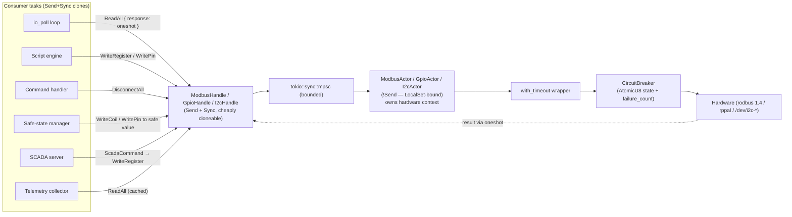
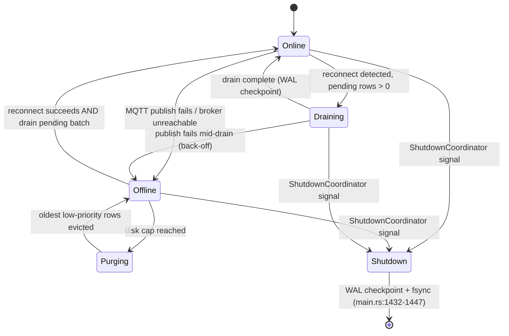
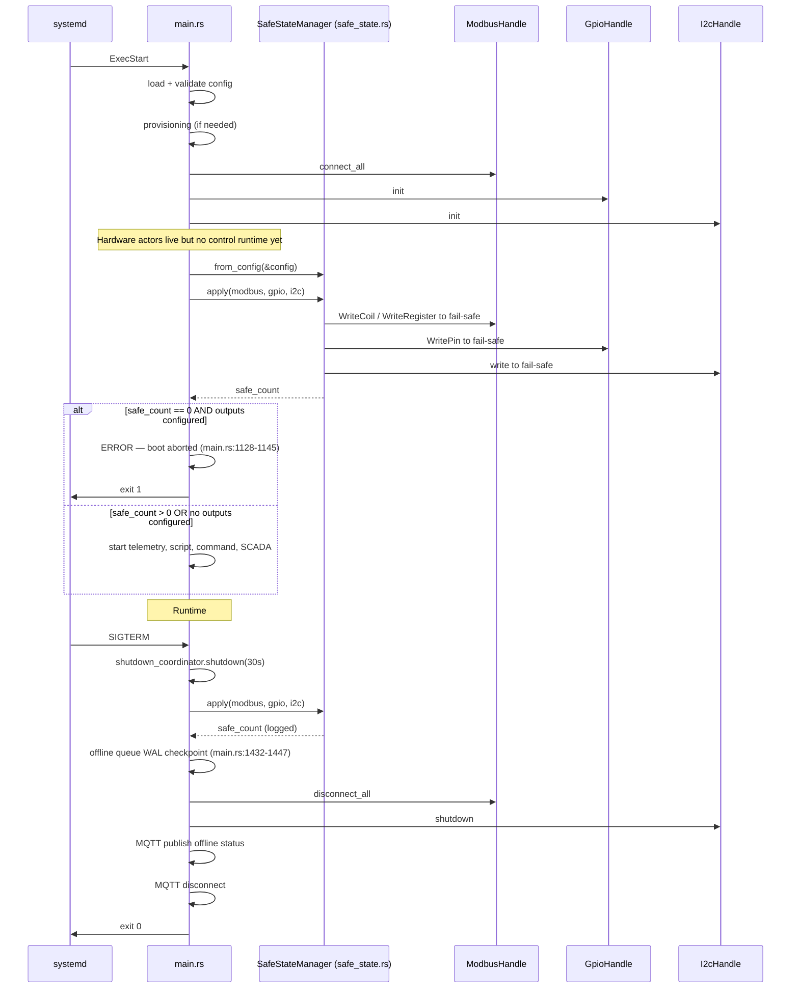
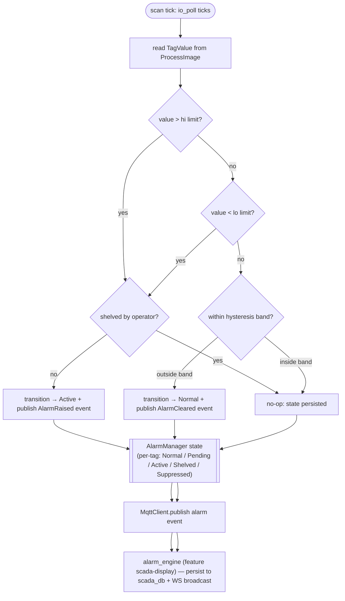
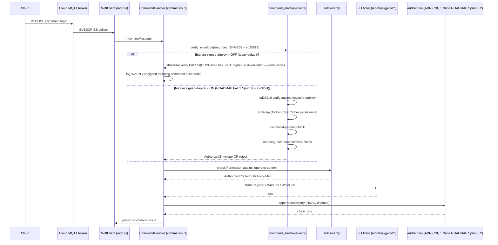

# C4 Level 4 — Selected Code Views

**Document version:** 1.0
**SoT:** HEAD `3413db47`, `suderra-agent` v1.6.0 (`Cargo.toml:3`)
**Date:** 2026-04-24
**Owner:** architecture-writer (Lane-C)

## Purpose

Level 4 of the C4 model is the zoom-in that a code reviewer uses to understand the **internal shape** of a component: the types, the state machine, the channel topology. The C4 convention is to not produce Level 4 diagrams for every component — only for the ones that carry architectural load. Five views are included here:

1. **Actor pattern** — the shape every hardware I/O container shares.
2. **Offline queue** — the durability discipline that keeps telemetry lossless across MQTT outages.
3. **Safe-state manager** — the life-safety ordering guarantee that opens and closes the runtime.
4. **Alarm engine scan cycle** — how IEC 62682 evaluation integrates with the process image.
5. **Command envelope verify** — the zero-trust command path (ADR-018 §7) and the type-vs-runtime split the reader must understand.

Each view names concrete types (`struct`, `enum`, `trait`, `fn` signature shapes) and is backed by an evidence line that can be grep-verified against `src/`.

---

## 4.1 Actor pattern — shared shape across Modbus, GPIO, I2C

### Shape

| Element | Example type (from `src/`) | Responsibility |
|---|---|---|
| Command enum | `ModbusCommand` (per `docs/ARCHITECTURE.md:86-95`) | Variant per operation; every variant carries a `tokio::sync::oneshot::Sender<R>` for the response. |
| Handle | `ModbusHandle`, `GpioHandle`, `I2cHandle` (public types in `src/modbus.rs`, `src/gpio.rs`, `src/i2c.rs`) | Wraps the mpsc `Sender<Command>`. `Clone`, `Send`, `Sync`. Public API = one `async fn` per command variant. |
| Channel | `tokio::sync::mpsc::channel::<Command>(capacity)` | Bounded; default capacity small (8-16) because handle calls are `await`ed and backpressure is the desired behaviour on overload. |
| Actor | `ModbusActor` / `GpioActor` / `I2cActor` (non-public types) | Owns the hardware context (rodbus `client::Context`, rppal `Gpio`, i2cdev). Single consumer of the mpsc receiver. `!Send` on Modbus because rodbus 1.4 is not Send. |
| Circuit breaker | `resilience::circuit_breaker::CircuitBreaker` | `AtomicU8` state (0=Closed, 1=Open, 2=HalfOpen) + `AtomicU32` failure_count. Opens at threshold 3, recovers after 30 s. |
| Timeout wrapper | `resilience::timeout::with_timeout` | Wraps the actor call with `tokio::time::timeout`; default budgets per operation class (Modbus 5 s, GPIO 5 s, connect 10 s). |

### Invariants

- **Handle type is `Send+Sync`; actor type is `!Send`.** This is the whole reason the pattern exists. A Modbus `client::Context` is `!Send`; the script engine runs on a Tokio multi-thread runtime; without the actor the two cannot coexist.
- **No shared mutable state between consumers and actor.** Everything flows through the command enum + oneshot response pair. A handle never hands out a `&mut` to hardware state.
- **Timeout + circuit breaker wrap every hardware touch.** If a read takes longer than the configured budget, the caller gets `Err(TimeoutError)`; repeated timeouts trip the breaker; the breaker's Open state fast-fails subsequent calls without touching hardware until the recovery window elapses.
- **Handle drop does not drop the actor.** The actor task is spawned on the `LocalSet` at `main.rs:559`; it outlives any single handle. The actor exits only when the shutdown coordinator broadcasts.

### Why this matters for Level 4

The actor pattern is the reason the gateway can keep a rodbus 1.4 client under a multi-thread runtime, keep GPIO writes panic-isolated from script execution, and keep hardware calls rate-shaped without touching the caller. It is the single most-reused piece of internal structure.

---

## 4.2 Offline queue — durability state machine

### Shape

| Type | Location | Role |
|---|---|---|
| `OfflineQueue` | `src/offline_queue.rs` | Synchronous API over a `rusqlite::Connection` with WAL mode. Used for tests and non-async paths. |
| `AsyncOfflineQueue` | `src/offline_queue.rs` | Tokio-aware wrapper: async enqueue + async drain using `tokio::task::spawn_blocking` for the SQLite call. |
| `QueuedMessage` | `src/offline_queue.rs` | Row schema: `id`, `topic`, `payload`, `priority`, `enqueued_at`, `attempt_count`. |
| `MessagePriority` | `src/offline_queue.rs` | Enum: Low / Normal / High / Critical. Drives both drain order and eviction order when disk-cap is hit. |
| `QueueStats` | `src/offline_queue.rs` | Count, oldest-age, disk-bytes — surfaced via health endpoint and periodic log. |
| `IntegrityCheckResult` | `src/offline_queue.rs` | Result of SQLite `PRAGMA integrity_check` on boot; a `Corrupt` result forces a quarantine + fresh-start discipline. |

### Invariants

- **WAL mode is mandatory.** The queue's whole point is survival across agent crashes. WAL + fsync-on-commit is the minimum; the Shutdown path at `main.rs:1432-1447` runs an explicit WAL checkpoint so no write remains in the WAL file.
- **Drain preserves priority order.** Critical telemetry (alarm transitions, life-safety events) drains before routine samples. This is a SQL `ORDER BY priority DESC, enqueued_at ASC`, not an application-level sort.
- **Eviction never touches Critical-priority rows.** When the disk cap is reached, the purger evicts oldest Low then Normal rows; Critical is never evicted. If the disk fills with Critical-only rows, the queue enters back-pressure (new enqueues block) rather than dropping.
- **Failure to open the queue is not fatal.** If `/var/lib/suderra` is unwritable (e.g. read-only root), the agent logs and falls back to in-memory buffering with a bounded heap cap. This is a practical concession: an edge box booting on a corrupt SD card still publishes live telemetry; only offline durability is lost until the disk is repaired.

---

## 4.3 Safe-state manager — boot and shutdown ordering

### Shape

- `SafeStateManager::from_config(&AgentConfig)` — builds the manager by walking `config.modbus`, `config.gpio`, `config.i2c` and producing one safe-state entry per configured output.
- `SafeStateManager::apply(&self, modbus: Option<&ModbusHandle>, gpio: Option<&GpioHandle>, i2c: Option<&I2cHandle>) -> usize` — drives every output to its configured safe value; returns the number of outputs written successfully.
- `src/safe_state_v2.rs` (types pre-staged, runtime ROADMAP Faz 2 Sprint 7.2) layers the ADR-024 discriminants: `FailSafe` enum (DE_ENERGIZE, HOLD_LAST, KNOWN_STATE, DIVERSE_CHANNEL), `OutputTag` v2, `DiversityClass`, `HardwiredSafetyOverride`.

### Invariants

- **CRITICAL-001 — safe-state runs before runtime.** `main.rs:1118-1151` applies safe-state **after** hardware init and **before** the script engine, command handler, telemetry, or SCADA server start. On failure (zero outputs reached safe-state despite having configured outputs), boot aborts with `anyhow::anyhow!("LIFE-SAFETY: Boot aborted ...")`. Systemd restarts under Restart=on-failure; repeated abort triggers RestartBurst handling, which is documented in `deployment-runbook-writer`.
- **Shutdown safe-state is a second apply, not a first.** Boot already established fail-safe values. The shutdown apply re-asserts them in case the runtime changed output state during operation. This is redundant by design.
- **Safe-state apply happens BEFORE bus disconnect.** The Modbus/GPIO/I2C handles must still be live when safe-state drives outputs; disconnecting them first would leave the last runtime-set output state on the wire — a life-safety violation.
- **Offline queue checkpoint happens between safe-state and disconnect.** `main.rs:1432-1447` forces a WAL checkpoint after safe-state is applied and before the MQTT client is torn down, so no telemetry generated by the safe-state transition is lost.

---

## 4.4 Alarm engine scan cycle (IEC 62682 / ISA-18.2 alignment)

### Shape

- `src/alarms.rs` owns `AlarmManager`. Evaluation is integrated into the `io_poll` loop (`src/io_poll.rs`) rather than being a separate periodic task — this keeps alarm latency at most one poll period.
- `src/alarm_engine.rs` (feature `scada-display`) extends the base manager with a SCADA-facing state machine that adds `acknowledged` / `reset` / `reprised` transitions; the base manager owns the Raised/Cleared primitive.
- Hysteresis is per-tag and per-limit in `src/alarms.rs`; the exact fields (deadband width, delay-before-active) live on `AlarmRule` entries in the agent config (`config.rs` — `alarms_*` section).

### Invariants

- **Shelving does not hide the alarm from audit.** A shelved alarm still produces an audit entry (ADR-020 §1) identifying the operator and duration. The SCADA server surface exposes "currently shelved" as a discoverable list.
- **The poll loop is the only writer to alarm state.** `src/io_poll.rs` is the single task that feeds tag values into `AlarmManager::evaluate`. Scripts cannot write alarm state directly; they can only affect the tag value that the next poll evaluates.
- **Alarm events are durable via the offline queue.** On disconnect, alarm MQTT publishes land in `OfflineQueue` with `Critical` priority, which preserves them across reconnect / eviction cycles.

---

## 4.5 Command envelope verify — today vs target

### Shape

- `src/command_envelope/` has five files: `mod.rs`, `envelope.rs` (type), `canonical.rs` (canonical-params), `jti.rs` (replay cache), `mutating.rs` (allowlist).
- `src/authz/` has six files: `mod.rs`, `permission.rs` (Permission enum), `policy.rs`, `manifest.rs`, `context.rs` (sealed AuthorizedContext), `verify.rs`.
- The verify function injects SHA-256 and ed25519-dalek as closures, keeping `command_envelope` free of crypto-impl coupling (testable with mock crypto).

### Invariants

- **The code path is present; the runtime enforcement is flag-gated.** Types and the verify path are compiled in always, as pre-staging for the Faz 2 Sprint 6.4 runtime wiring. The flip to Enforcing mode is the `signed-deploy` feature (`Cargo.toml:355`). Until flipped, the agent logs a WARN for any unsigned mutating command but accepts it. This is tracked as **ORPHAN-EDGE-004** and is the whole reason the feature exists (HC-1 fleet backward-compat per ADR-018 §9).
- **Envelope verify is crypto-agnostic by injection.** The pure function takes a `FnOnce` for SHA-256 and a `FnOnce` for ed25519 verify. Production uses the real closures; unit tests substitute deterministic mocks. This is a `Make it impossible` discipline per CLAUDE.md — there is no path where envelope logic silently picks a different crypto backend.
- **Audit append is a hard requirement on successful command execution.** Even in today's permissive mode, a successful command must land in the audit chain (ADR-020). Until runtime wiring lands in Faz 2 Sprint 6.2, the chain is populated via the pre-staged types; the relay to the cloud audit sink is part of the same sprint.

---

## Evidence

- `sens-api-gateway/src/main.rs:471-500` (Tokio runtime build + LocalSet rationale)
- `sens-api-gateway/src/main.rs:559` (`LocalSet::new`)
- `sens-api-gateway/src/main.rs:1118-1151` (boot safe-state)
- `sens-api-gateway/src/main.rs:1414-1447` (shutdown safe-state + WAL checkpoint)
- `sens-api-gateway/src/main.rs:1154-1165` (ShutdownCoordinator registration)
- `sens-api-gateway/src/offline_queue.rs` (types: `OfflineQueue`, `AsyncOfflineQueue`, `QueuedMessage`, `QueueStats`, `MessagePriority`, `IntegrityCheckResult`)
- `sens-api-gateway/src/scripting/engine.rs` (types: `ScriptEngine`, `ExecutionResult`, `ScanCycleStats`)
- `sens-api-gateway/src/command_envelope/envelope.rs` + `canonical.rs` + `jti.rs` + `mutating.rs`
- `sens-api-gateway/src/authz/permission.rs` + `policy.rs` + `manifest.rs` + `context.rs` + `verify.rs`
- `sens-api-gateway/src/resilience/circuit_breaker.rs` + `timeout.rs` + `rate_limiter.rs`
- `sens-api-gateway/docs/ARCHITECTURE.md:63-107` (actor command enum shape), `:109-133` (circuit breaker constants), `:183-206` (conflict detector)
- `docs/adr/017-st-bytecode-runtime.md`, `docs/adr/018-edge-rbac-abac-model.md`, `docs/adr/020-audit-log-hmac-chain.md`, `docs/adr/024-edge-hardware-adapter-inventory.md`

Not covered here — sequence-level cross-container flows are in `data-flow.md`; the IEC 62443 zone-conduit layout is in `deployment-topology.md`; measured and target performance numbers are in `performance-envelope.md`.
