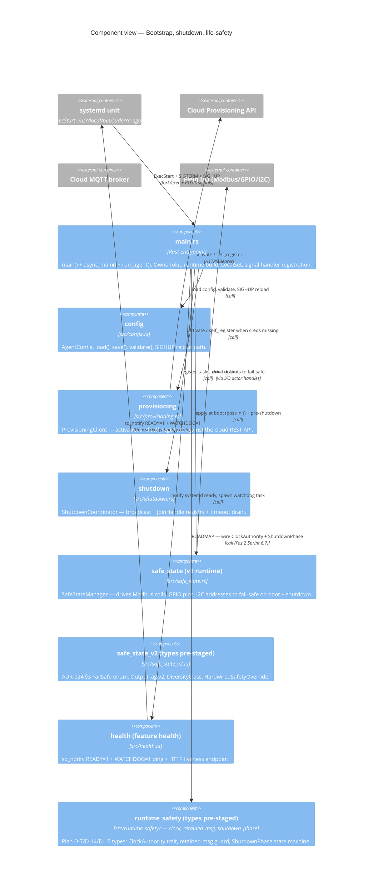
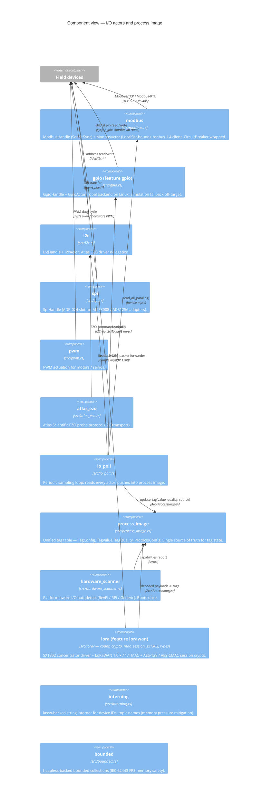
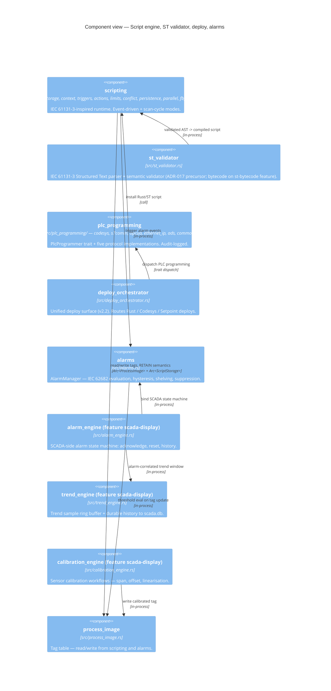
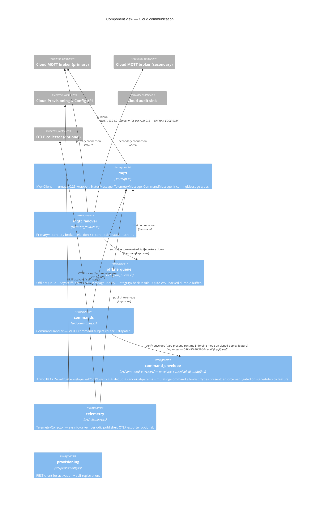
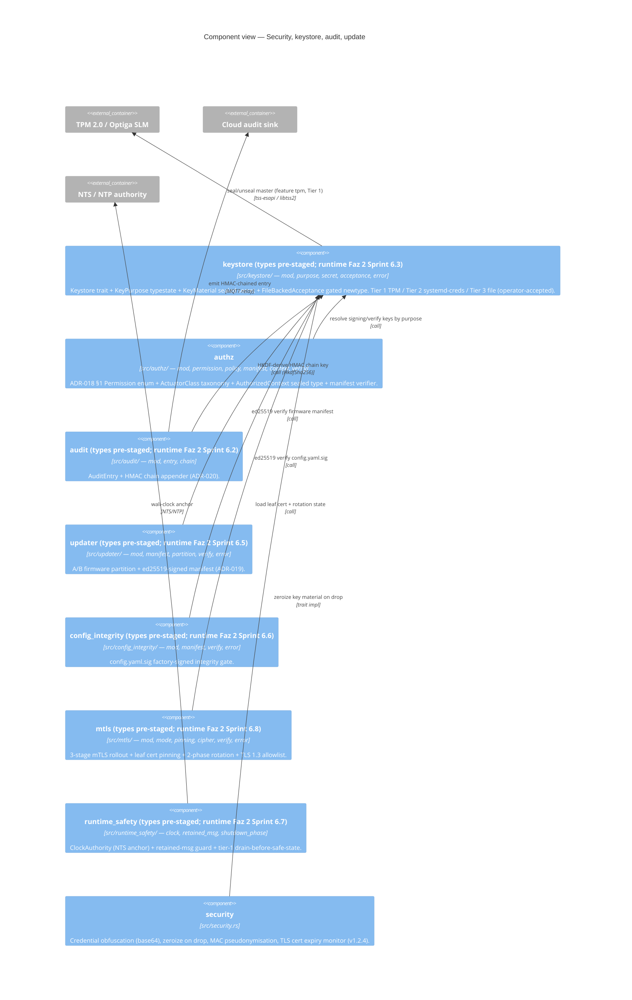
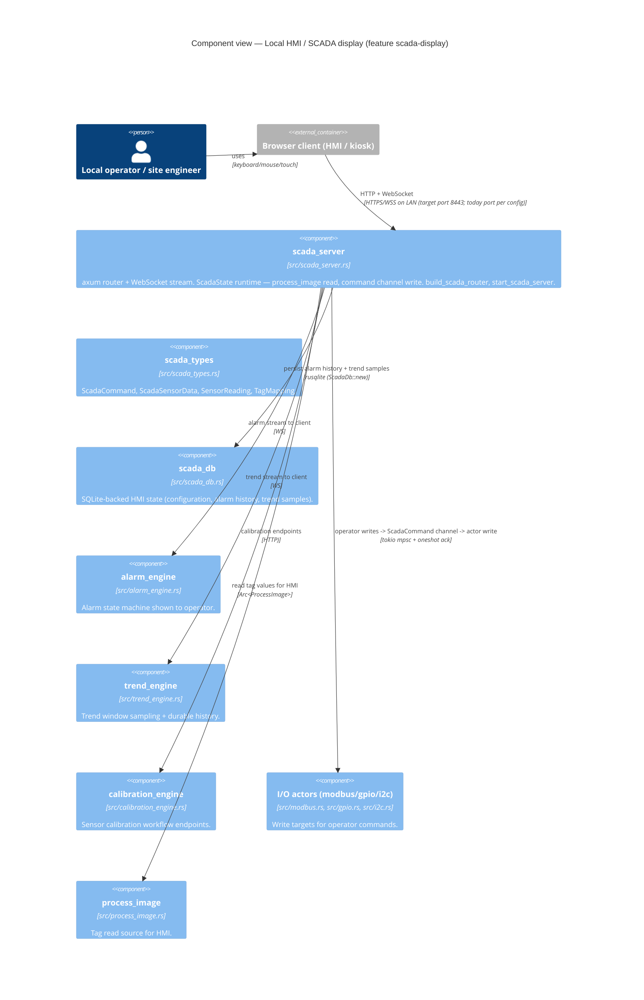
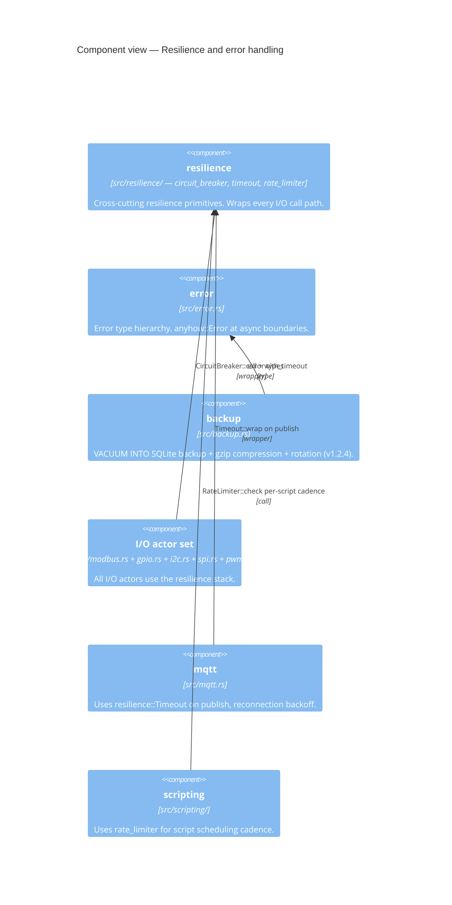

# C4 Level 3 — Component View

**Document version:** 1.0
**SoT:** HEAD `3413db47`, `suderra-agent` v1.6.0 (`Cargo.toml:3`)
**Date:** 2026-04-24
**Owner:** architecture-writer (Lane-C)

## Purpose

Level 3 zooms inside the single-process container from `c4-container.md` and names the Rust **modules** (files and submodule directories) that implement each container, plus the interactions between them. At this level we may name `struct`, `trait`, and module-path identifiers; we **still do not** name individual functions — that is reserved for `c4-code.md` (Level 4).

Because the Suderra Edge Gateway is a single process, Level 3 is a view inside the `suderra-agent` OS process. We split the view into seven component clusters so each fits on one screen and has a coherent theme. Every module named here has been grep-verified against `src/` at HEAD.

## Diagram 1 — Bootstrap, shutdown, and life-safety cluster



## Diagram 2 — I/O actors, process image, LoRaWAN



## Diagram 3 — Script engine, validators, deploy, alarms



## Diagram 4 — Cloud communication cluster



## Diagram 5 — Security, keystore, audit, update



## Diagram 6 — Local HMI / SCADA cluster (feature scada-display)



## Diagram 7 — Resilience and error handling



## Module inventory — grep-verified against HEAD

Top-level modules declared in `src/main.rs:18-116`:

```
alarms                   src/alarms.rs
authz                    src/authz/
backup                   src/backup.rs
bounded                  src/bounded.rs
commands                 src/commands.rs
config                   src/config.rs
error                    src/error.rs
gpio                     src/gpio.rs
health                   src/health.rs
i2c                      src/i2c.rs
interning                src/interning.rs
modbus                   src/modbus.rs
mqtt                     src/mqtt.rs
mqtt_failover            src/mqtt_failover.rs
offline_queue            src/offline_queue.rs
plc_programming          src/plc_programming/
provisioning             src/provisioning.rs
pwm                      src/pwm.rs
resilience               src/resilience/
scripting                src/scripting/
deploy_orchestrator      src/deploy_orchestrator.rs
hardware_scanner         src/hardware_scanner.rs
process_image            src/process_image.rs
atlas_ezo                src/atlas_ezo.rs
io_poll                  src/io_poll.rs
security                 src/security.rs
st_validator             src/st_validator.rs
safe_state               src/safe_state.rs
safe_state_v2            src/safe_state_v2.rs
keystore                 src/keystore/
audit                    src/audit/
command_envelope         src/command_envelope/
updater                  src/updater/
config_integrity         src/config_integrity/
runtime_safety           src/runtime_safety/
mtls                     src/mtls/
shutdown                 src/shutdown.rs
spi                      src/spi.rs
telemetry                src/telemetry.rs
```

Feature-gated modules (conditional compilation):

```
lora                     src/lora/                     feature lorawan
scada_server             src/scada_server.rs           feature scada-display
scada_types              src/scada_types.rs            feature scada-display
scada_db                 src/scada_db.rs               feature scada-display
alarm_engine             src/alarm_engine.rs           feature scada-display
trend_engine             src/trend_engine.rs           feature scada-display
calibration_engine       src/calibration_engine.rs     feature scada-display
```

**Total modules: 39 top-level + 6 feature-gated = 45 distinct module roots.** Submodule directories (`src/authz/`, `src/audit/`, `src/command_envelope/`, `src/config_integrity/`, `src/keystore/`, `src/lora/`, `src/mtls/`, `src/plc_programming/`, `src/resilience/`, `src/runtime_safety/`, `src/scripting/`, `src/updater/`) each contain an additional 3–11 files, all of which are listed in the diagrams above by path.

## Cross-cluster invariants

1. **Every I/O actor is handle-fronted.** A consumer (scripting, commands, safe-state, SCADA server, io_poll) never reaches into an actor's state — it holds a `ModbusHandle` / `GpioHandle` / `I2cHandle` and sends a command over mpsc. This isolates the Tokio `LocalSet` from the multi-thread runtime and makes the actor the single panic domain.
2. **The process image is the single tag SSoT.** `src/process_image.rs` is the only place tag values live at runtime. Everything that needs to read or write a tag reads from or writes to it — there is no parallel cache. This invariant is load-bearing for the alarm, SCADA, scripting, and telemetry clusters.
3. **Life-safety comes before runtime in boot.** `main.rs:1118-1151` applies safe-state to every actuator output **before** the script engine, telemetry, command handler, or SCADA server start. This closes CRITICAL-001 (LIFE-SAFETY boot order). Any component that spawns actuator-writing tasks before this point is a regression.
4. **Feature-gated code compiles out, does not hide behind runtime flags.** `opc-ua-server`, `scada-display`, `lorawan`, `tpm`, `telemetry`, `signed-deploy`, `st-bytecode`, `multi-task-scheduler`, `live-debug`, `license-enforce` (`Cargo.toml:325-397`) are compile-time. `tests/invariants/feature_off_no_symbols.sh` (see `Cargo.toml:265`) enforces this for `opc-ua-server`; the same discipline is expected for any new feature.
5. **`#[allow(dead_code)]` on type-pre-staged modules is deliberate.** Modules `authz`, `safe_state_v2`, `keystore`, `audit`, `command_envelope`, `updater`, `config_integrity`, `runtime_safety`, `mtls` all live behind a runtime-wiring sprint (Faz 2 Sprints 6.1 through 6.8). The types are in-tree so reference stability is preserved across the rollout; production behaviour is unchanged until the corresponding sprint flips the gate. This is a staged-rollout discipline, not dead code.

## Evidence

- `sens-api-gateway/src/main.rs:18-116` — full module graph
- `sens-api-gateway/src/main.rs:124-136` — concrete `use` imports proving cross-module wiring
- `sens-api-gateway/src/main.rs:295-337` — `AppState` field inventory (ties Level 2 containers to Level 3 modules)
- `sens-api-gateway/src/main.rs:1118-1151` — boot safe-state enforcement
- `sens-api-gateway/src/main.rs:1154-1165` — shutdown coordinator registration
- `sens-api-gateway/src/main.rs:1168-1284` — scada-display feature conditional block
- `sens-api-gateway/src/offline_queue.rs` — public surface: `OfflineQueue`, `AsyncOfflineQueue`, `QueuedMessage`, `QueueStats`, `IntegrityCheckResult`, `MessagePriority`
- `sens-api-gateway/src/mqtt.rs` — public surface: `MqttClient`, `IncomingMessage`, `StatusMessage`, `DeviceStatus`, `TelemetryMessage`, `CommandMessage`, `TelemetryMetrics`, `ModbusDeviceData`, `ModbusRegisterData`, `GpioPinData`
- `sens-api-gateway/src/scada_server.rs` — public surface: `ScadaState`, `build_scada_router`, `start_scada_server`, `build_scada_sensor_data`, `ScadaProcess`, `ScadaSensorData`, `SensorReading`, `TagMapping`
- `sens-api-gateway/src/scripting/engine.rs` — public surface: `ScriptEngine`, `ExecutionResult`, `ScanCycleStats`
- `sens-api-gateway/Cargo.toml:325-397` — feature-gate matrix
- `docs/adr/017-st-bytecode-runtime.md`, `docs/adr/018-edge-rbac-abac-model.md`, `docs/adr/019-edge-firmware-signing-ab-partition.md`, `docs/adr/020-audit-log-hmac-chain.md`, `docs/adr/021-platform-key-ceremony-lifecycle.md`, `docs/adr/024-edge-hardware-adapter-inventory.md` — type-pre-staged module roadmap

Not covered here — actor-pattern internals (channel shapes, scan-cycle state machine) go in `c4-code.md`; sequence flows go in `data-flow.md`; zone topology goes in `deployment-topology.md`.
