# C4 Level 2 — Container View

**Document version:** 1.0
**SoT:** HEAD `3413db47`, `suderra-agent` v1.6.0 (`Cargo.toml:3`)
**Date:** 2026-04-24
**Owner:** architecture-writer (Lane-C)

## Purpose

Level 2 of the C4 model names the deployable **containers** — processes, data stores, and agents that run as independent runtime units — and the protocols between them. At this level we do **not** name Rust modules or functions; those live in `c4-component.md` (Level 3) and `c4-code.md` (Level 4). A Siemens OT architect reading this chapter must be able to tell which network endpoints exist, which filesystem locations hold persistent state, and which external bus each container attaches to.

The Suderra Edge Gateway ships as a **single OS-level process** (the `suderra-agent` Linux binary, `Cargo.toml:447-449`) containing a Tokio multi-threaded runtime (`src/main.rs:471-477`) and a `LocalSet` (`src/main.rs:559`) for non-Send PLC drivers. Functionally, however, it decomposes into logical containers that a reviewer should see separately because each has its own lifecycle, its own backing store, and its own external peer.

## Diagram — Container View

```mermaid
C4Container
    title Suderra Edge Gateway — Container View

    Person(plantOp, "Plant Operator / Site Engineer", "Interacts via Local HMI or Cloud UI")

    System_Ext(fieldIO, "Field Devices", "Sensors, actuators, PLCs")
    System_Ext(cloudMqtt, "Cloud MQTT Broker", "EMQX / Mosquitto cluster")
    System_Ext(cloudApi, "Cloud Provisioning & Config API", "HTTPS REST")
    System_Ext(cloudAudit, "Cloud Audit Sink", "ADR-020 anchor")
    System_Ext(otlp, "OTLP Collector", "Optional")
    System_Ext(ntp, "NTS / NTP", "Time authority")
    System_Ext(systemd, "systemd", "Unit supervisor, watchdog, journald")

    System_Boundary(agent, "suderra-agent process (single OS process, Tokio runtime)") {
        Container(provisioningC, "Provisioning Container", "Rust async", "Activation + self-registration against cloud API; persists MQTT creds and TLS material.")
        Container(mqttClientC, "MQTT Client Container", "Rust async, rumqttc 0.25", "Connects to cloud broker; publishes telemetry/status/capabilities, subscribes to commands. Offline-queue-backed.")
        Container(mqttFailoverC, "MQTT Failover Container", "Rust async", "Primary/secondary broker failover state machine; escalates to offline-queue on both-down.")
        Container(ioActorsC, "I/O Actor Container", "Rust async + LocalSet", "Actor pattern for Modbus-TCP/RTU, GPIO, I2C, SPI, PWM, Atlas EZO. Circuit-breaker + timeout wrapped.")
        Container(loraC, "LoRaWAN Gateway Container", "Rust async (feature lorawan)", "SX1302 concentrator packet forwarder; cmac/AES-CCM session crypto.")
        Container(processImageC, "Process Image Container", "Rust (in-memory)", "Unified tag table: every I/O point as a typed tag with quality + timestamp.")
        Container(scriptEngineC, "Script Engine Container", "Rust async", "IEC 61131-3-inspired runtime: event-driven + scan-cycle; rate-limited, depth-capped, conflict-detecting.")
        Container(stValidatorC, "ST Validator Container", "Rust (sync, call-driven)", "IEC 61131-3 Structured Text parser + validator (ADR-017 precursor, bytecode feature-gated).")
        Container(plcProgC, "PLC Programming Container", "Rust async", "Codesys V3, S7comm, OPC UA, EtherNet/IP, ADS upload/start/stop.")
        Container(alarmMgrC, "Alarm Manager Container", "Rust async", "IEC 62682 alarm evaluation, hysteresis, shelving.")
        Container(commandC, "Command Dispatcher Container", "Rust async", "MQTT command subject router; RBAC gate (ADR-018); envelope verify (ADR-018 §7 — feature signed-deploy).")
        Container(deployOrchC, "Deploy Orchestrator Container", "Rust async", "Unified deploy path for Rust/Codesys/Setpoint (v2.2).")
        Container(telemetryC, "Telemetry Collector Container", "Rust async", "Periodic system metrics publisher.")
        Container(shutdownC, "Shutdown Coordinator Container", "Rust async", "Life-safety ordered termination: signal → drain → safe-state → flush → disconnect.")
        Container(safeStateC, "Safe-State Manager Container", "Rust async", "Life-safety fail-safe enforcement on boot and shutdown (v1 runtime; v2 pre-staged).")
        Container(healthC, "Health & Liveness Container", "axum (feature health)", "Systemd sd-notify ready + watchdog; HTTP health endpoint.")
        Container(scadaServerC, "SCADA Display Server Container", "axum + WebSocket (feature scada-display)", "Local HMI runtime: HTTP + WSS + command channel back to I/O Actors.")
        Container(auditC, "Audit Chain Container", "Rust (types Faz 2 Sprint 6.2)", "HMAC-chained AuditEntry appender (ADR-020); runtime wiring pending.")
        Container(keystoreC, "Keystore Container", "Rust (Tier 1 TPM / Tier 2 systemd-creds / Tier 3 file)", "Master-key holder; HKDF-derives child keys for audit, DB, keypairs.")
        Container(updaterC, "Updater Container", "Rust (types Faz 2 Sprint 6.5)", "A/B partition firmware manifest verifier (ADR-019).")

        ContainerDb(retainDb, "RETAIN Persistence", "SQLCipher SQLite", "IEC 61131-3 RETAIN variable durability at /var/lib/suderra/retain.db, AES-256-CBC at rest.")
        ContainerDb(scadaDb, "SCADA Database", "SQLite (feature scada-display)", "HMI configuration, tag mappings, alarm history, trend samples at /var/lib/suderra/scada/scada.db.")
        ContainerDb(offlineQ, "Offline Queue Store", "SQLite (WAL mode)", "Durable telemetry buffer when MQTT is down; flushed on reconnect.")
        ContainerDb(scriptStore, "Script Storage", "Filesystem + SQLite", "User scripts + function block registry + execution history.")
        ContainerDb(configFile, "Config File", "YAML on disk", "/etc/suderra/config.yaml (mode 0600); integrity-sig path (ADR per batch 9 runtime-pending).")
        ContainerDb(backupStore, "Backup Store", "gz-compressed SQLite dumps", "VACUUM INTO backup target (v1.2.4).")
    }

    Rel(plantOp, scadaServerC, "Views / acknowledges alarms", "HTTPS + WSS")
    Rel(provisioningC, cloudApi, "activate / self-register", "HTTPS Bearer")
    Rel(mqttClientC, cloudMqtt, "pub/sub telemetry, commands, status, capabilities", "MQTT v3.1.1 over TLS (target mTLS — ORPHAN-EDGE-003)")
    Rel(mqttFailoverC, cloudMqtt, "Primary / secondary broker selection", "MQTT over TLS")
    Rel(ioActorsC, fieldIO, "Read / write", "Modbus-TCP/RTU, I2C, SPI, GPIO, PWM, Atlas EZO")
    Rel(loraC, fieldIO, "LoRaWAN uplinks/downlinks", "SX1302 / Semtech UDP packet forwarder")
    Rel(ioActorsC, processImageC, "Push typed tags + quality", "in-process channels")
    Rel(loraC, processImageC, "Push decoded payloads", "in-process")
    Rel(scriptEngineC, processImageC, "Read + write tags", "in-process")
    Rel(scriptEngineC, ioActorsC, "Actions (SetOutput, Pulse, Ramp)", "in-process + conflict detector")
    Rel(scriptEngineC, retainDb, "Persist RETAIN variables", "rusqlite/SQLCipher")
    Rel(scriptEngineC, scriptStore, "Load user scripts, FB registry, exec history", "rusqlite + filesystem")
    Rel(stValidatorC, scriptEngineC, "Validated program structure", "in-process")
    Rel(commandC, cloudMqtt, "Subscribe to command subjects", "MQTT")
    Rel(commandC, plcProgC, "Upload / start / stop PLC programs", "in-process")
    Rel(commandC, deployOrchC, "Unified deploy request", "in-process")
    Rel(plcProgC, fieldIO, "Program upload / status / control", "Codesys 1217, S7 102, OPC UA 4840, EIP 44818, ADS 48898")
    Rel(alarmMgrC, processImageC, "Evaluate tag thresholds", "in-process")
    Rel(alarmMgrC, mqttClientC, "Publish alarm events", "in-process")
    Rel(telemetryC, mqttClientC, "Publish periodic metrics", "in-process")
    Rel(mqttClientC, offlineQ, "Buffer while offline", "rusqlite WAL")
    Rel(shutdownC, safeStateC, "Trigger safe-state before disconnect", "in-process")
    Rel(safeStateC, ioActorsC, "Drive outputs to fail-safe", "in-process")
    Rel(keystoreC, auditC, "HKDF-derive audit HMAC key", "in-process")
    Rel(auditC, cloudAudit, "Emit HMAC-chained entries", "MQTT relay (ADR-020 §10a)")
    Rel(updaterC, cloudApi, "Pull firmware manifest", "HTTPS")
    Rel(telemetryC, otlp, "OTLP traces (feature telemetry)", "OTLP/gRPC")
    Rel(healthC, systemd, "READY=1, WATCHDOG=1", "sd_notify")
    Rel(healthC, ntp, "Clock sanity", "NTS/NTP")
    Rel(scadaServerC, scadaDb, "Read config, write alarm history + trend samples", "rusqlite")
    Rel(scadaServerC, processImageC, "Read tag values for HMI", "in-process")
    Rel(scadaServerC, ioActorsC, "Operator write commands (ScadaCommand channel)", "tokio mpsc → actor write")
    Rel(provisioningC, configFile, "Persist MQTT creds, tenant_id", "fs OpenOptions mode 0600")
    Rel(keystoreC, configFile, "Load config integrity signature", "fs read")

    UpdateLayoutConfig($c4ShapeInRow="4", $c4BoundaryInRow="2")
```

## Container inventory and ownership

Every container corresponds to a file or subdirectory under `sens-api-gateway/src/` that has been verified to exist at HEAD `3413db47`. No invented modules.

| Container | Source location | Feature gate | Lifecycle | Backing store |
|---|---|---|---|---|
| Provisioning | `src/provisioning.rs` | always | one-shot at boot when creds missing | `configFile` |
| MQTT Client | `src/mqtt.rs` | always | long-lived | `offlineQ` |
| MQTT Failover | `src/mqtt_failover.rs` | always | long-lived | — |
| I/O Actor (Modbus) | `src/modbus.rs` | always | long-lived (LocalSet) | — |
| I/O Actor (GPIO) | `src/gpio.rs` | `gpio` (`Cargo.toml:326`) | long-lived | — |
| I/O Actor (I2C) | `src/i2c.rs` | always | long-lived | — |
| I/O Actor (SPI) | `src/spi.rs` | always | long-lived | — |
| I/O Actor (PWM) | `src/pwm.rs` | always | long-lived | — |
| I/O Actor (Atlas EZO) | `src/atlas_ezo.rs` | always | long-lived | — |
| I/O Poll Loop | `src/io_poll.rs` | always | long-lived | — |
| Hardware Scanner | `src/hardware_scanner.rs` | always | one-shot at boot | — |
| LoRaWAN Gateway | `src/lora/` (7 files) | `lorawan` (`Cargo.toml:341`) | long-lived | — |
| Process Image | `src/process_image.rs` | always | in-memory | — |
| Script Engine | `src/scripting/` (10 files + `function_blocks/`) | always | long-lived (multi-task target is `multi-task-scheduler`, `Cargo.toml:373`) | `scriptStore`, `retainDb` |
| ST Validator | `src/st_validator.rs` | always (Bytecode pipeline `st-bytecode` `Cargo.toml:367`) | call-driven | — |
| PLC Programming | `src/plc_programming/` (7 files) | always | call-driven | — |
| Alarm Manager | `src/alarms.rs` | always (IEC 62682 v1.2.4) | long-lived | — |
| Command Dispatcher | `src/commands.rs` + `src/command_envelope/` (5 files) | always (envelope enforcement on `signed-deploy` `Cargo.toml:355`) | long-lived | — |
| Deploy Orchestrator | `src/deploy_orchestrator.rs` | always (v2.2) | call-driven | — |
| Telemetry Collector | `src/telemetry.rs` | always (OTLP on `telemetry` `Cargo.toml:330`) | long-lived | — |
| Shutdown Coordinator | `src/shutdown.rs` | always | long-lived | — |
| Safe-State Manager | `src/safe_state.rs` + `src/safe_state_v2.rs` | v1 runtime; v2 pre-staged (ROADMAP Faz 2 Sprint 7.2) | boot + shutdown + trigger | — |
| Health & Liveness | `src/health.rs` | `health` (`Cargo.toml:328`) | long-lived | — |
| SCADA Display Server | `src/scada_server.rs` + `scada_types.rs` + `scada_db.rs` + `alarm_engine.rs` + `trend_engine.rs` + `calibration_engine.rs` | `scada-display` (`Cargo.toml:338`) | long-lived | `scadaDb` |
| Audit Chain | `src/audit/` (3 files) | types always; runtime wiring ROADMAP Faz 2 Sprint 6.2 (ADR-020) | long-lived when wired | — |
| Keystore | `src/keystore/` (5 files) | types always; Tier 1 on `tpm` (`Cargo.toml:361`) | one-shot unseal + hold | — |
| Updater | `src/updater/` (5 files) | types always; runtime ROADMAP Faz 2 Sprint 6.5 (ADR-019) | call-driven | — |
| mTLS | `src/mtls/` (6 files) | types always; rustls wiring ROADMAP Faz 2 Sprint 6.8 (ADR-015) | call-driven | — |
| Runtime Safety | `src/runtime_safety/` (4 files) | types always; runtime ROADMAP Faz 2 Sprint 6.7 | call-driven | — |
| Config Integrity | `src/config_integrity/` (4 files) | types always; runtime ROADMAP Faz 2 Sprint 6.6 (D-13) | boot verify | — |
| Authz / RBAC | `src/authz/` (6 files) | types always; manifest verifier ROADMAP Faz 2 Sprint 6.1 (ADR-018) | call-driven | — |
| Backup | `src/backup.rs` | always | scheduled / call-driven | `backupStore` |
| Bounded collections | `src/bounded.rs` | always | utility | — |
| Interning | `src/interning.rs` | always | utility | — |
| Resilience (Circuit Breaker + Timeout + Rate Limiter) | `src/resilience/` (4 files) | always | utility | — |
| Error | `src/error.rs` | always | utility | — |
| Security helpers | `src/security.rs` | always | utility | — |
| Config | `src/config.rs` | always | load + SIGHUP reload | `configFile` |

**Verified module count at HEAD `3413db47`:** 35 top-level `mod` declarations in `src/main.rs` + 16 submodule directories under `src/` (see `ls sens-api-gateway/src/` report in `c4-component.md` §Evidence). No module name in this chapter is invented.

## Protocols between containers

| From → To | Transport | Auth / integrity today | ADR-015 / ADR-018 target | Finding |
|---|---|---|---|---|
| MQTT Client → Cloud MQTT | MQTT v3.1.1 / TLS 1.2+ | user + password in CONNECT | mTLS, cert CN as identity | ORPHAN-EDGE-003 (ROADMAP-Q3) |
| Command Dispatcher → Cloud MQTT | same as above | envelope verify is **type-present, runtime-permissive** until `signed-deploy` flag flips (`Cargo.toml:355`) | Enforcing mode rejects unsigned mutating commands | ORPHAN-EDGE-004 (type-only today) |
| PLC Programming → Field PLC | Codesys 1217 / S7 102 / OPC UA 4840 / EIP 44818 / ADS 48898 | Protocol-native (user/pass where supported; S7 + EIP + ADS have no protocol auth) | OPC UA UserTokenPolicy + Codesys password; S7/EIP/ADS unchanged (protocol limitation) | HARDWARE-VENDOR RESPONSIBILITY (Siemens S7 auth; Rockwell EIP CIP Security) |
| Alarm Manager → MQTT Client | in-process | in-process | — | — |
| Audit Chain → Cloud Audit | MQTT relay | HMAC-SHA256 chained, master-key-derived | Ed25519 periodic attestation (ADR-020 §2) | ADR-020 Proposed |
| Provisioning → Cloud API | HTTPS / TLS 1.2+ | Bearer token (one-shot) | Unchanged | — |
| SCADA Server → browser | HTTPS / WSS | JWT session (feature scada-display) | mTLS client cert for engineer role | ROADMAP-Q4 HMI-mTLS |
| Updater → Cloud API | HTTPS | Bearer + signed manifest (ed25519, ADR-019) | Unchanged | — |
| Keystore ↔ TPM | TSS2 / libtss2-esys | Hardware-bound; PCR-sealed | Unchanged | Feature `tpm` off-by-default; Tier 2/3 fallback |
| Health → systemd | sd_notify fd | Unix socket, uid-gated | Unchanged | — |

## Persistent stores — footprint summary

| Store | Path | Typical size | Encryption | Retention |
|---|---|---|---|---|
| Config file | `/etc/suderra/config.yaml` | < 8 KB | None at rest (mode 0600 only); integrity-sig path in `src/config_integrity/` (runtime ROADMAP Sprint 6.6) | Unbounded — operator-owned |
| RETAIN DB | `/var/lib/suderra/retain.db` | KB–MB depending on FB count | SQLCipher AES-256-CBC (`Cargo.toml:94`) | Lifecycle-bound |
| SCADA DB | `/var/lib/suderra/scada/scada.db` | MB (trend history) | SQLite (no SQLCipher today — feature scada-display) | Bounded by trend-retention config (`trend_engine.rs`) |
| Offline queue | `offline_queue.rs` managed SQLite | 0 when online; grows to disk cap when offline | SQLite WAL (no SQLCipher today) | Drained on reconnect; size cap + rotation in `offline_queue.rs` (ADR-019 §11 retention target) |
| Script storage | `/etc/suderra/scripts/` + SQLite history | KB per script + log history | Filesystem perms (mode 0640 expected) | Operator-owned |
| Backup store | Operator-configured | Compressed (gzip, `flate2`, `Cargo.toml:110`) | Depends on destination | Operator-owned |

## Decisions visible at this level

1. **Single OS process, many logical containers.** We deploy one binary, not many. This is practical for edge hardware with limited RAM (target < 512 MiB total, see `performance-envelope.md`). Inter-container communication is in-process (`tokio::sync::mpsc`, `tokio::sync::watch`, `Arc<RwLock<T>>`) with zero IPC syscall overhead.
2. **`LocalSet` for non-Send PLC drivers.** The rodbus 1.4 Modbus client is `!Send` (`Cargo.toml:70`). Wrapping the I/O actors in a `tokio::task::LocalSet` (`src/main.rs:559`) lets us keep an otherwise multi-thread Tokio runtime and still use Send-only handles (`ModbusHandle`, `GpioHandle`, `I2cHandle`) from anywhere.
3. **Actor pattern for every I/O bus.** Every hardware container exposes a cheaply-cloneable Send+Sync **handle** backed by an mpsc channel to a `!Send` **actor** task. The handle is what every consumer (scripting, command dispatcher, safe-state, telemetry) holds. This isolates panic domains and allows circuit-breaker wrapping on a single seam.
4. **Three SQLite stores, three purposes, separate files.** We deliberately keep RETAIN (`retain.db`), SCADA HMI state (`scada/scada.db`), and Offline Queue in separate SQLite files so a corruption in one does not bring down the others and so each can be rotated/backed-up on its own cadence. SQLCipher encryption is on for `retain.db` (`Cargo.toml:94`); SQLCipher for the SCADA DB and offline queue is tracked as ROADMAP-Q3 hardening in the security audit doc.
5. **Feature-gated subsystems compile out fully.** `scada-display`, `lorawan`, `telemetry`, `health`, `tpm`, `signed-deploy`, `st-bytecode`, `multi-task-scheduler`, `opc-ua-server`, `live-debug`, `license-enforce` (`Cargo.toml:325-397`) are compile-time switches. An invariant test `tests/invariants/feature_off_no_symbols.sh` (`Cargo.toml:265`) asserts that when the `opc-ua-server` feature is off, no OPC UA symbols appear in the release binary — the same discipline is the gating rule for any new feature flag.

## Evidence

- `sens-api-gateway/Cargo.toml:3` (version), `:15-342` (dependencies + features), `:447-449` (binary)
- `sens-api-gateway/src/main.rs:18-116` (full module graph), `:298-337` (`AppState` field inventory), `:471-477` (Tokio runtime build), `:559` (`LocalSet`)
- `sens-api-gateway/src/main.rs:1084-1101` (MQTT client instantiation), `:1297-1323` (SQLite persistence init), `:1327-1340` (script engine init), `:1154-1165` (shutdown coordinator init)
- `sens-api-gateway/src/main.rs:1168-1284` (SCADA server start, feature-gated)
- `sens-api-gateway/src/offline_queue.rs` (public surface: `OfflineQueue`, `AsyncOfflineQueue`, `QueuedMessage`, `QueueStats`, `IntegrityCheckResult`)
- `sens-api-gateway/src/scada_server.rs` (public surface: `ScadaState`, `build_scada_router`, `start_scada_server`, `build_scada_sensor_data`)
- `sens-api-gateway/docs/ARCHITECTURE.md:291-319` (existing module map; reshaped into this chapter)
- `docs/adr/015-nats-cert-is-identity-ssot.md`, `docs/adr/017-st-bytecode-runtime.md`, `docs/adr/018-edge-rbac-abac-model.md`, `docs/adr/019-edge-firmware-signing-ab-partition.md`, `docs/adr/020-audit-log-hmac-chain.md`, `docs/adr/024-edge-hardware-adapter-inventory.md`

Not covered here — Rust module internals and interaction patterns go in `c4-component.md`; sequence-level behaviour goes in `data-flow.md`.
