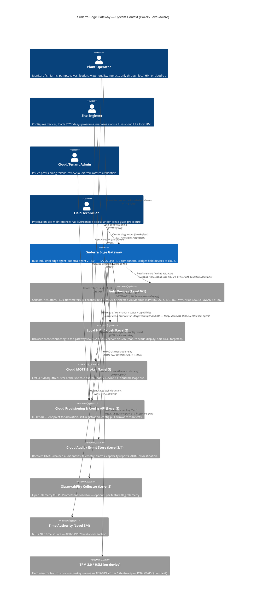

# C4 Level 1 — System Context

**Document version:** 1.0
**SoT:** HEAD `3413db47`, `suderra-agent` v1.6.0 (`Cargo.toml:3`)
**Date:** 2026-04-24
**Owner:** architecture-writer (Lane-C)

## Purpose

This chapter frames `suderra-agent` (the Suderra Edge Gateway) inside the industrial operational environment it participates in. Following Simon Brown's C4 model, Level 1 names only the system under description, the human actors that interact with it, and the external systems it exchanges data with. **No internal structure appears at Level 1** — process boundaries come at Level 2 (`c4-container.md`), module boundaries at Level 3 (`c4-component.md`), and selected internal code views at Level 4 (`c4-code.md`).

A Siemens OT reviewer should be able to read this single page and understand where the gateway sits against ISA-95 Levels 0 through 4 and which counter-parties share trust boundaries with it.

## Diagram — System Context

## Legend

| Symbol | Meaning |
|---|---|
| `Person(...)` | A human role (ISA-95 operator / engineer / admin / technician). |
| `System(...)` | The system under description. One per C4 context diagram. |
| `System_Ext(...)` | An external system the gateway exchanges data with, outside our code boundary. |
| `Rel(...)` | A data or control flow. The label names the transport and — at this level only — the authentication posture when it differs between today and the ADR-015 target. |

## ISA-95 Level mapping

| ISA-95 Level | Role | Element in this diagram |
|---|---|---|
| 0 | Field devices | Sensors, actuators, valves (inside `Field Devices (Level 0/1)`) |
| 1 | Direct control | Modbus/PROFINET/I2C devices; `suderra-agent` runs **here** |
| 2 | Supervisory | `Local HMI / Kiosk`, SCADA display server exposed by the gateway |
| 3 | MES / Site | `Cloud MQTT Broker`, `Cloud Provisioning & Config API`, `Cloud Audit`, `OTLP Collector`, `Time Authority` |
| 4 | Enterprise | Cloud tenant UI and billing (reached through the Level 3 cloud API) |

The gateway deliberately straddles Levels 1 and 2: it controls field I/O (Level 1) AND hosts a local HMI runtime (Level 2) when the `scada-display` feature is compiled in (`src/main.rs:105-116` gates `scada_server`, `scada_db`, `alarm_engine`, `trend_engine`, `calibration_engine`). This is a practical choice per `docs/architecture/deployment-topology.md` — at a single-site aquaculture farm, splitting Level 1 and Level 2 into two physical boxes is not operationally required and doubles the hardware-failure surface.

## Key context decisions worth knowing before reading Levels 2–4

1. **The gateway is a cloud-tethered edge node by design.** Activation, credential rotation, firmware manifest distribution, and audit anchoring all flow through the cloud API and cloud MQTT broker. An air-gapped topology is supported (`deployment-topology.md`, Topology C) but it is a configuration of the same binary, not a separate product.
2. **MQTT authentication posture is evolving.** Today, the gateway authenticates to the cloud MQTT broker via username + password derived at activation time (`src/main.rs:961-965` and `src/main.rs:1031-1033`). ADR-015 mandates mTLS with cert-as-identity; this migration is tracked as **ORPHAN-EDGE-003** and targeted for ROADMAP-Q3. Both truths are shown explicitly on conduit labels in `deployment-topology.md`.
3. **Human actors never write to the field I/O directly.** Operators and engineers hit either the cloud UI (reaching the gateway over MQTT commands) or the local HMI (reaching the gateway over HTTPS/WSS on the LAN). Field Technicians can reach the process via SSH only under a documented break-glass flow; this is intentionally privileged and audited.
4. **TPM and HSM presence is device-tier dependent.** RPi 5 boards with a TPM 2.0 (SLB 9670 / Optiga SLM) use Tier 1 master-key sealing (ADR-019 §7); RPi 4 and earlier boards without TPM fall back to systemd-creds (Tier 2) or operator-passphrase file-backed keystore (Tier 3). The feature gate `tpm` in `Cargo.toml:361` is the compile-time switch; the runtime tier fallback is selected by the keystore module.

## Trust boundaries crossed by this context

| Boundary | Direction | Primary authentication today | ADR-015 target | Finding |
|---|---|---|---|---|
| Edge ↔ Cloud MQTT | bidirectional | TLS 1.2+ server cert, user/pass in CONNECT | mTLS with device cert CN as identity | ORPHAN-EDGE-003 (ROADMAP-Q3) |
| Edge → Cloud API | outbound | TLS 1.2+, Bearer provisioning/tenant token | TLS 1.2+, Bearer (unchanged — activation is one-shot) | — |
| Edge ↔ Local HMI | bidirectional | HTTPS server cert on LAN, JWT session (scada-display) | HTTPS + mTLS client cert for engineer role | ROADMAP-Q4 HMI-mTLS |
| Edge ↔ Field I/O | bidirectional | None (Modbus plaintext) or Modbus+TLS (rodbus 1.4, ADR-024) | Modbus+TLS mandatory for AO/DO writes | Tracked in ADR-024 §11 HARDWARE-VENDOR RESPONSIBILITY |
| Edge → Audit Relay | outbound | MQTT over TLS, HMAC-chained payload | mTLS + HMAC-chained payload (ADR-020) | ADR-020 Proposed → target Accepted 2026-05-03 |

## Evidence

- `sens-api-gateway/Cargo.toml:3` (version) / `:325-342` (feature gates: `default`, `gpio`, `scada-display`, `lorawan`, `tpm`, `telemetry`)
- `sens-api-gateway/src/main.rs:103-116` (feature-conditional modules)
- `sens-api-gateway/src/main.rs:918-1080` (activation / self-registration — cloud API contract)
- `sens-api-gateway/src/main.rs:1492-1502` (MQTT offline-status publish — cloud MQTT contract)
- `sens-api-gateway/src/main.rs:1674-1717` (capabilities report — cloud MQTT contract)
- `sens-api-gateway/docs/ARCHITECTURE.md:447-478` (PLC programming context and protocols)
- `docs/adr/015-nats-cert-is-identity-ssot.md` (transport-identity target)
- `docs/adr/019-edge-firmware-signing-ab-partition.md` §7 (TPM / keystore tier hierarchy)
- `docs/adr/020-audit-log-hmac-chain.md` §2, §10a (audit relay contract)
- `docs/adr/024-edge-hardware-adapter-inventory.md` §11 (hardware-vendor responsibility split)

Not covered here — see `c4-container.md` for process boundaries, `deployment-topology.md` for IEC 62443 zone-conduit view, `security-architecture-writer` for threat model and crypto inventory.
