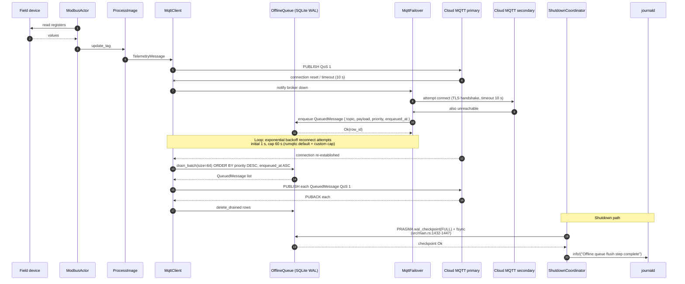
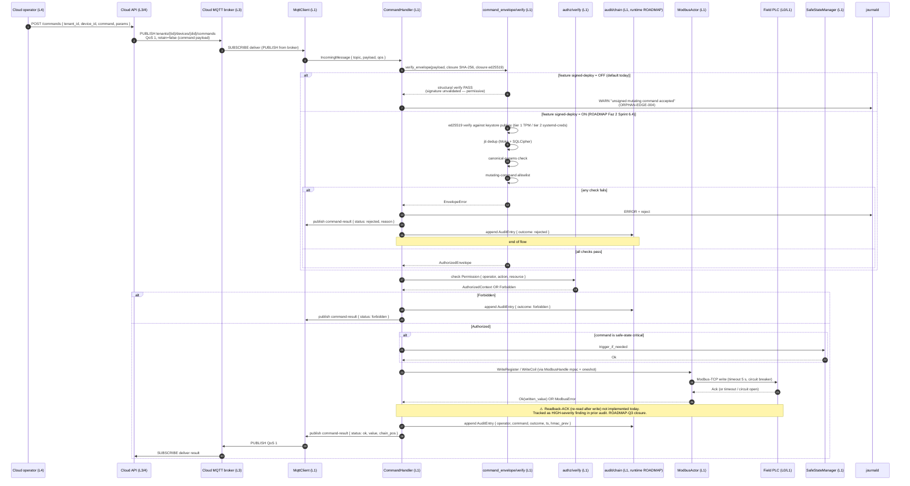

# Data Flow — Telemetry and Command Paths

**Document version:** 1.0
**SoT:** HEAD `3413db47`, `suderra-agent` v1.6.0 (`Cargo.toml:3`)
**Date:** 2026-04-24
**Owner:** architecture-writer (Lane-C)

## Purpose

This chapter answers "what happens to a byte on the wire" for the two most load-bearing flows in the system:

1. **Telemetry path** — a sensor read turns into an MQTT publish, with offline-queue fallback when the broker is down.
2. **Command path** — a cloud-sent command turns into a PLC write, including envelope verification, RBAC gating, audit append, and acknowledgement.

Both flows are ISA-95-level-aware and labelled with transport, QoS (MQTT), timeout budget, and retry policy per arrow. Where today's posture and the ADR-015 / ADR-018 target differ, both are shown with the owning finding ID.

Not covered here — zone topology is in `deployment-topology.md`; module-internal code shapes are in `c4-code.md`; module dependencies are in `c4-component.md`.

## Flow 1 — Telemetry path: sensor read → cloud

### Sequence diagram (normal path, broker reachable)

```mermaid
sequenceDiagram
    autonumber
    participant Field as Field device (ISA-95 L0)
    participant Modbus as ModbusActor (L1, !Send in LocalSet)
    participant ProcImg as ProcessImage (L1, in-memory)
    participant Script as ScriptEngine (L1)
    participant Alarm as AlarmManager (L1)
    participant OfflineQ as OfflineQueue (L1, SQLite WAL)
    participant Mqtt as MqttClient (L1, rumqttc)
    participant Broker as Cloud MQTT broker (L3)
    participant Ingest as Cloud ingestion (L3/4)

    Note over Field,Modbus: io_poll loop ticks every poll_interval (default 1 s)
    Modbus->>Field: Modbus-TCP READ_HOLDING_REGISTERS / READ_COILS<br/>timeout 5 s (CircuitBreaker, threshold 3, recovery 30 s)
    Field-->>Modbus: register values (raw u16 / i16 / f32 / etc.)
    Modbus->>ProcImg: update_tag(name, scaled_value, TagQuality::Good, source=Modbus)
    ProcImg-->>Script: watch notification (watch channel — scan-cycle feature multi-task-scheduler)
    Script->>Alarm: threshold evaluate (on tag update)
    Alarm-->>Script: AlarmEvent (Raised / Cleared / NoChange)

    par Telemetry publish
        ProcImg->>Mqtt: TelemetryMessage { tenant_id, device_id, ts, metrics, modbus, gpio }<br/>JSON (serde_json)
        Mqtt->>Broker: PUBLISH topic=tenants/{tid}/devices/{did}/telemetry<br/>QoS 1, retain=false, TLS 1.2+, timeout 10 s<br/>(today: user/pass auth; target mTLS per ADR-015 — ORPHAN-EDGE-003)
        Broker-->>Mqtt: PUBACK
        Broker->>Ingest: broker subscription fan-out
    and Alarm publish
        Alarm->>Mqtt: AlarmMessage { tenant_id, device_id, rule_id, state, value, ts }
        Mqtt->>Broker: PUBLISH topic=tenants/{tid}/devices/{did}/alarm<br/>QoS 1, retain=false, TLS 1.2+
        Broker-->>Mqtt: PUBACK
    end
```

### Sequence diagram (degraded path, broker unreachable)



### Arrow contract table — Flow 1

| # | From → To | Transport | Encoding | QoS / retry | Timeout budget | Notes |
|---|---|---|---|---|---|---|
| 1 | Field → ModbusActor | Modbus-TCP (rodbus 1.4) or Modbus-RTU (tokio-serial) | Binary Modbus frame | CircuitBreaker threshold 3, recovery 30 s; operation retry = 0 (handled at poll cycle) | 5 s per op, 10 s connect | `Cargo.toml:70` (rodbus pinned); `src/modbus.rs` |
| 2 | ModbusActor → ProcessImage | in-process | `TagValue { value, quality, source, ts }` | — | `RwLock` contention-bounded | `src/process_image.rs`; `update_tag` is async on `Arc<ProcessImage>` |
| 3 | ProcessImage → ScriptEngine | in-process `tokio::sync::watch` | `TagUpdate` event | — | watch receiver is never-block (latest wins) | feature `multi-task-scheduler` enables scan-cycle subscription (`Cargo.toml:373`) |
| 4 | ScriptEngine → AlarmManager | in-process | `TagValue` + rule id | — | rate-limited per script (`ScriptRateLimiter` default 60/min) | `docs/ARCHITECTURE.md:175-181` |
| 5 | AlarmManager → MqttClient | in-process | `AlarmMessage` (serde_json) | — | — | `src/alarms.rs` |
| 6 | MqttClient → Cloud broker (PUBLISH) | MQTT v3.1.1 over TLS 1.2+ | JSON | QoS 1, retain=false; rumqttc in-flight cap (default 100); reconnect with exponential backoff 1–60 s | 10 s publish timeout (resilience::Timeout wrapper) | Today: user+pass CONNECT auth. Target: mTLS cert-CN per ADR-015 — ORPHAN-EDGE-003 (ROADMAP-Q3) |
| 7 | MqttClient ↔ Primary / Secondary (failover) | MQTT / TLS | CONNECT / PINGRESP | reconnect 1 s initial, x2 up to 60 s | 10 s connect | `src/mqtt_failover.rs` |
| 8 | MqttFailover → OfflineQueue | in-process | `QueuedMessage` insert | — | `spawn_blocking` over SQLite `INSERT`; disk-cap eviction by priority-oldest-first (Low, Normal) — Critical never evicted | `src/offline_queue.rs` |
| 9 | OfflineQueue → MqttClient (drain) | in-process | `Vec<QueuedMessage>` (batch 64) | drain order: `ORDER BY priority DESC, enqueued_at ASC` | per-publish 10 s; batch continues on partial failure | `src/offline_queue.rs` |
| 10 | ShutdownCoordinator → OfflineQueue | in-process | `PRAGMA wal_checkpoint(FULL)` + fsync | — | part of 30 s shutdown budget | `src/main.rs:1389-1394`, `:1432-1447` |

### Invariants — Flow 1

- **The io_poll loop is the single writer of tag values from hardware.** All other components (scripts, SCADA server, commands) write tags only indirectly, by going through an I/O actor that goes through io_poll-compatible plumbing.
- **Telemetry publish never blocks the io_poll loop.** The publish is either queued to the MQTT task (`rumqttc` internal ring buffer) or, on broker-down, to the offline queue via `spawn_blocking`. The poll loop's next tick is never gated on a network round-trip.
- **Offline queue drain preserves priority order across reconnect.** Alarm events (priority `Critical`) drain before routine telemetry. Disk-cap eviction never drops `Critical` rows.
- **Shutdown checkpoint is unconditional.** Even if the agent is exiting due to boot-safe-state failure or a fatal error, `PRAGMA wal_checkpoint(FULL) + fsync` runs so no message survives only in the WAL file.
- **TLS is mandatory on C7.** `src/main.rs:1034-1037` auto-enables TLS when port 8883 is indicated by the activation response. Plain-text MQTT is not a supported production posture; it is tolerated only on LAN dev topologies where the operator explicitly overrides.

## Flow 2 — Command path: cloud → PLC write

### Sequence diagram (today — permissive envelope verify, unsigned tolerated with WARN)



### Arrow contract table — Flow 2

| # | From → To | Transport | Encoding | QoS / retry | Timeout budget | Notes |
|---|---|---|---|---|---|---|
| 1 | CloudOp → CloudApi | HTTPS REST | JSON | operator-initiated, no retry at this hop | cloud-API-owned | Out of edge scope |
| 2 | CloudApi → Broker | MQTT (cloud API → broker publish) | JSON | QoS 1 | — | Cloud-side |
| 3 | Broker → MqttClient | MQTT v3.1.1 over TLS | JSON | QoS 1 delivery | inbound has no timeout at edge — rumqttc dispatches on message | Today: user/pass auth; target mTLS per ADR-015 (ORPHAN-EDGE-003) |
| 4 | MqttClient → CommandHandler | in-process channel | `IncomingMessage` | — | — | `src/commands.rs` |
| 5 | CommandHandler → command_envelope/verify | in-process | raw bytes + injected crypto closures | — | — | Today permissive (ORPHAN-EDGE-004); target Enforcing on `signed-deploy` flag flip |
| 6 | CommandHandler → authz/verify | in-process | Permission + operator context | — | — | `src/authz/verify.rs` — types present, runtime wiring ROADMAP Faz 2 Sprint 6.1 |
| 7 | CommandHandler → SafeStateManager (conditional) | in-process | trigger signal | — | — | Invoked for safe-state-critical commands (e.g. emergency-stop) |
| 8 | CommandHandler → ModbusActor (via Handle) | in-process mpsc + oneshot | `ModbusCommand::WriteRegister` / `WriteCoil` | no retry at this layer; actor has circuit-breaker | 5 s (`MODBUS_TIMEOUT`) | Readback-ACK (re-read after write to confirm applied state) is NOT implemented today — ROADMAP-Q3 closure |
| 9 | ModbusActor → Field PLC | Modbus-TCP | Modbus write PDU | circuit-breaker threshold 3; recovery 30 s | 5 s | Life-safety-critical writes are additionally protected by the write-through safe-state manager |
| 10 | CommandHandler → Audit chain | in-process | `AuditEntry { operator, command, outcome, ts, hmac_prev, chain_pos }` | — | — | ADR-020; runtime relay ROADMAP Faz 2 Sprint 6.2 |
| 11 | CommandHandler → MqttClient (result publish) | in-process | `CommandResult` JSON | — | — | Resulting MQTT PUBLISH is a fresh QoS 1 send |
| 12 | MqttClient → Broker (result) | MQTT over TLS | JSON | QoS 1 | 10 s publish timeout | — |

### Today-vs-target callouts — Flow 2

| Arrow # | Today | Target | Finding / ADR |
|---|---|---|---|
| 3, 12 | TLS 1.2+ server cert + user/pass in CONNECT | mTLS with device cert CN as identity | ORPHAN-EDGE-003 / ADR-015 (ROADMAP-Q3) |
| 5 | Envelope verify is **type-present, runtime permissive** — unsigned mutating commands produce WARN and proceed | Enforcing mode rejects unsigned. The path flips when the `signed-deploy` feature flag is enabled at build time (`Cargo.toml:355`). | ORPHAN-EDGE-004 / ADR-018 §7 (ROADMAP Faz 2 Sprint 6.4) |
| 8, 9 | Write issued; no post-write readback | Readback-ACK: re-read the written register and assert equality before reporting success | Prior-audit HIGH finding (ROADMAP-Q3 closure) |
| 10 | Audit chain types compiled; runtime append is pre-staged but not wired into the live command path | Every successful or rejected command appends an HMAC-chained AuditEntry; cloud relay anchors the chain | ADR-020 (ROADMAP Faz 2 Sprint 6.2) |

### Invariants — Flow 2

- **Command execution requires two gates.** `command_envelope/verify` (integrity) and `authz/verify` (authorization). A `signed-deploy`-enforced build requires both; today's build requires authz only, because envelope verify is in permissive mode. This is the single most-load-bearing posture-change in the rollout and is explicitly surfaced in every affected chapter.
- **The audit append is a post-condition, not a log statement.** A command with no matching audit entry is a defect. The chain's HMAC tree is keyed off the master key (ADR-019 §7) and derived via HKDF (ADR-020 §2). Runtime wiring lands Faz 2 Sprint 6.2.
- **Safe-state-critical commands call the manager before touching I/O.** Emergency-stop and other life-safety commands route through `SafeStateManager` so the transition is logged and atomic with respect to the normal I/O path.
- **Readback-ACK is a known gap, not a silent omission.** Every Siemens VAQ that asks "does the gateway confirm applied state?" must be answered "write completes at Modbus layer; explicit readback is ROADMAP-Q3". Misrepresenting this as implemented would be a compliance-evidence defect.
- **The command topic is tenant-scoped.** `tenants/{tenant_id}/devices/{device_id}/commands` binds every command to a single tenant; cross-tenant command delivery is not representable in the subject hierarchy. This is the wire-level expression of the `tenant_id` scoping that the cloud side enforces.

## Retry and backoff summary

| Location | Initial delay | Max delay | Max attempts | Behaviour at max |
|---|---|---|---|---|
| Modbus read/write | — (no retry at op layer) | — | 0 | Error returned; CircuitBreaker tallies |
| Modbus CircuitBreaker | — | 30 s recovery | threshold 3 failures | Opens; fast-fail for 30 s; then HalfOpen test |
| MQTT reconnect (rumqttc) | 1 s | 60 s (custom cap) | unbounded | keeps attempting; OfflineQueue absorbs the gap |
| Provisioning activate() / self_register() | 10 s | 160 s (10 × 2^(n-1), n=1..5) | 5 | `exit 1` — systemd restarts on next boot |
| Script engine execution | — | — | max_call_depth=10, max_execution_time=5000 ms | Timeout → script rejected; rate limiter throttles calling cadence |
| Shutdown drain | — | 30 s total (`SHUTDOWN_TIMEOUT_SECS` in `src/main.rs:890`) | 1 | Force-abort any task still running |

## Evidence

- `sens-api-gateway/src/main.rs:890` (`SHUTDOWN_TIMEOUT_SECS`)
- `sens-api-gateway/src/main.rs:926-1005` (self-register retry loop: 5 attempts, exponential 10 × 2^(n-1) s)
- `sens-api-gateway/src/main.rs:1011-1074` (activate() retry loop — same profile)
- `sens-api-gateway/src/main.rs:1118-1151` (boot safe-state enforcement)
- `sens-api-gateway/src/main.rs:1432-1447` (shutdown WAL checkpoint)
- `sens-api-gateway/src/main.rs:1482-1513` (offline-status publish + MQTT disconnect)
- `sens-api-gateway/src/commands.rs` (CommandHandler public surface)
- `sens-api-gateway/src/command_envelope/` (envelope verify path)
- `sens-api-gateway/src/authz/` (authorization verify path)
- `sens-api-gateway/src/mqtt.rs` (MqttClient, TelemetryMessage, CommandMessage types)
- `sens-api-gateway/src/offline_queue.rs` (OfflineQueue WAL discipline)
- `sens-api-gateway/src/resilience/circuit_breaker.rs`, `src/resilience/timeout.rs`, `src/resilience/rate_limiter.rs`
- `sens-api-gateway/docs/ARCHITECTURE.md:109-133` (circuit breaker constants), `:136-149` (timeout budgets), `:151-173` (script limits)
- `docs/adr/015-nats-cert-is-identity-ssot.md`, `docs/adr/018-edge-rbac-abac-model.md`, `docs/adr/020-audit-log-hmac-chain.md`

Not covered here — attack paths on these flows are the subject of `security/` (STRIDE); SLA targets on latency are in `operations/`; observability instrumentation is in `operations/` and the OTLP conduit row in `deployment-topology.md`.
