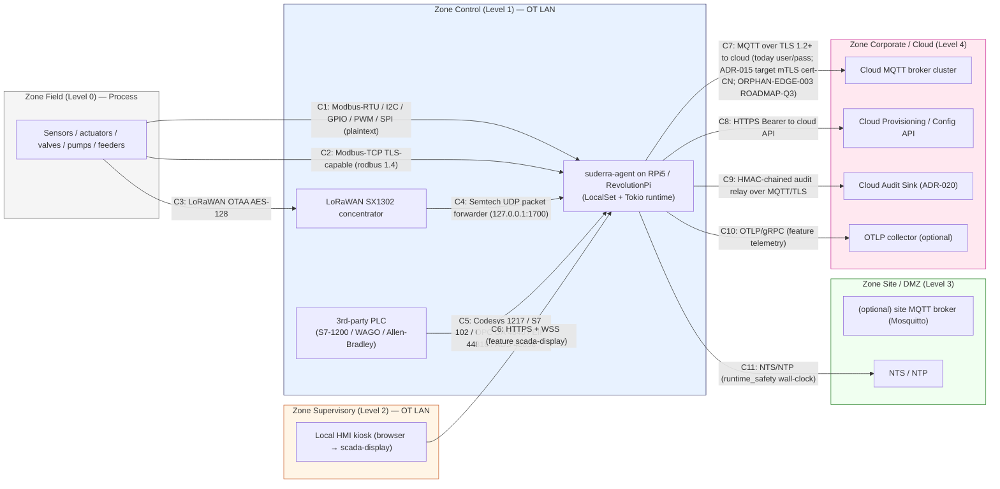
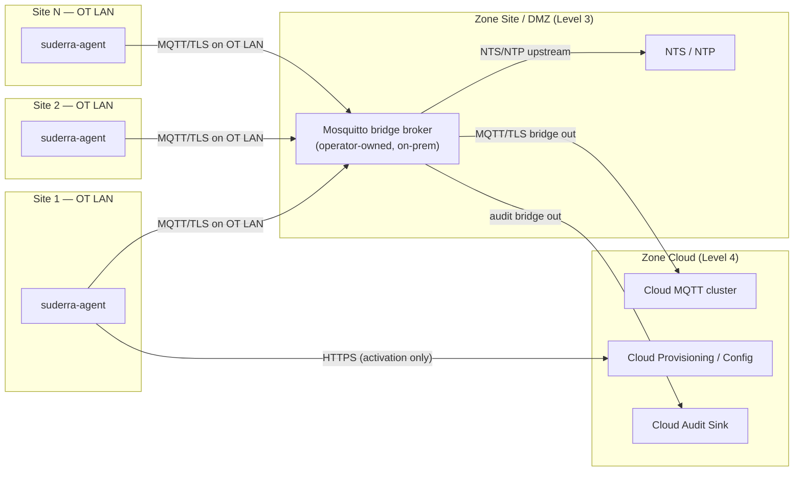
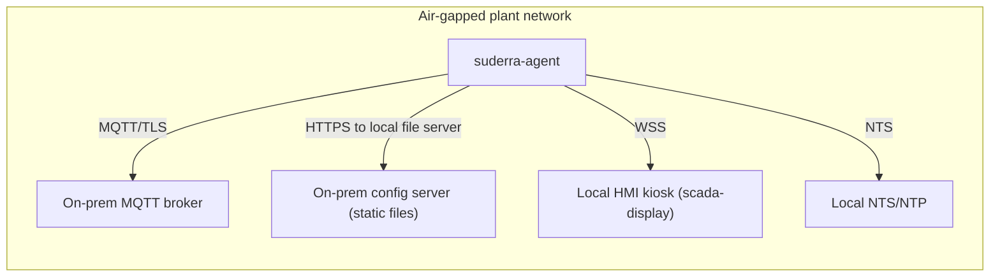

# Deployment Topology — IEC 62443 Zone-and-Conduit View

**Document version:** 1.0
**SoT:** HEAD `3413db47`, `suderra-agent` v1.6.0 (`Cargo.toml:3`)
**Date:** 2026-04-24
**Owner:** architecture-writer (Lane-C)

## Purpose

This chapter gives the deployment-architecture view a Siemens OT cyber-security reviewer needs to accept the gateway into a segmented plant network. The view is structured per **IEC 62443-3-2 zone-and-conduit model** and cross-referenced with **ISA-95 levels**. Every conduit is labelled with:

- transport (TCP/UDP/serial, MQTT/HTTPS/Modbus/OPC UA/...)
- authentication posture **today** (against HEAD `3413db47`)
- authentication posture **on the roadmap** (per the owning ADR, with ORPHAN-EDGE finding ID + target milestone)
- encryption state at-rest / in-flight

Three typical install topologies are covered (Topology A — single site, Topology B — multi-site with DMZ broker, Topology C — air-gapped). Each is a configuration of the same `suderra-agent` binary, not a different product.

Not covered here — threat model (STRIDE) + crypto inventory live in `security/` (`security-architecture-writer`); install procedure lives in `deployment/` (`deployment-runbook-writer`); SLA targets live in `operations/` (`operations-sla-writer`).

## Zones and ISA-95 mapping

| IEC 62443 zone | ISA-95 level | Role | Trust tier | Example assets |
|---|---|---|---|---|
| Field / Process | Level 0 | Sensors, actuators, field devices | Lowest — physical access assumed possible | pH probes, flow meters, relays, VFDs, dosing pumps |
| Control | Level 1 | Direct control / PLC loop | Medium — controlled physical access | PLCs, RTUs, **suderra-agent** on RPi/RevPi |
| Supervisory / Operator | Level 2 | HMI / SCADA | Medium-high — badge-controlled | Local HMI kiosk running the scada-display browser client |
| Site / DMZ | Level 3 | Broker, local time source, jump host | High — IT-managed | DMZ MQTT broker, NTS server, jump host |
| Corporate / Cloud | Level 4 | Cloud tenant API, audit sink, OTLP | Highest (from the OT side) — internet-facing | Cloud MQTT cluster, provisioning API, audit store |

## Topology A — Single-site, typical (diagram)

## Topology B — Multi-site with DMZ broker

The DMZ Mosquitto bridge isolates the cloud conduit to a single IT-managed host in the site DMZ. OT LAN firewall rules allow only the agents to reach the DMZ broker; only the DMZ broker talks to the internet. This is the pattern used when a plant's IT policy forbids OT assets from reaching the internet directly.

## Topology C — Air-gapped

Air-gapped mode uses the same binary with the cloud-tethered conduits pointed at on-prem peers. Firmware updates arrive via physically transported signed artefacts verified by `src/updater/` (ADR-019 ed25519 signature chain). The audit chain (ADR-020) still produces HMAC-chained entries locally; relay to a trusted sink is operator-configured (USB, scheduled sync window, etc.). `deployment-runbook-writer` owns the air-gap install procedure.

## Conduit table — Topology A (authoritative)

Every conduit in the diagram is tabulated here with its transport, port, direction, today-authentication, roadmap-authentication, and encryption state. "Today" = observed at HEAD `3413db47`. "Roadmap" = target state per the owning ADR.

| ID | Source → Destination | Transport / Protocol | Port | Direction | Auth today | Auth roadmap | Encryption (in-flight) | Encryption (at rest on agent) | Owning ADR / finding |
|---|---|---|---|---|---|---|---|---|---|
| C1 | Field sensors → `suderra-agent` | Modbus-RTU / I2C / GPIO / SPI / PWM | RS-485 / `/dev/i2c-*` / sysfs GPIO / `/dev/spidev*` / PWM | field → agent | Physical access control only (no protocol auth) | Unchanged at protocol layer; HARDWARE-VENDOR RESPONSIBILITY (field-device vendor) for higher-layer hardening | Plaintext | — | ADR-024 §11 HARDWARE-VENDOR RESPONSIBILITY |
| C2 | Field devices → `suderra-agent` | Modbus-TCP (rodbus 1.4 TLS-capable) | 502 / 802 | field → agent | Server cert if TLS on; no client cert in default profile | Mutual TLS with device-side client cert (ADR-024 §4) | TLS 1.2+ when enabled; plaintext otherwise | — | ADR-024 §4 |
| C3 | Field devices → LoRaWAN concentrator | LoRaWAN 1.0.x / 1.1 OTAA | ISM band | field → agent | AES-128 (AppSKey / NwkSKey from OTAA) | Unchanged (LoRaWAN is the spec boundary) | AES-128 application layer | Session keys zeroize-on-drop via `secrecy` + `zeroize` crates (`Cargo.toml:47`, `:296`) | — |
| C4 | LoRaWAN concentrator → `suderra-agent` | Semtech UDP packet forwarder | UDP 1700 | concentrator → agent | Loopback-only (127.0.0.1:1700) | Unchanged — localhost is the trust boundary | None (loopback) | — | feature `lorawan` (`Cargo.toml:341`) |
| C5 | 3rd-party PLCs → `suderra-agent` (programming) | Codesys V3 / S7comm / OPC UA / EtherNet/IP / ADS | 1217 / 102 / 4840 / 44818 / 48898 | PLC ↔ agent | Protocol-native (user/pass for Codesys + OPC UA; none for S7/EIP/ADS) | OPC UA UserTokenPolicy mTLS mandatory (`src/plc_programming/opcua.rs`); S7/EIP/ADS improvements HARDWARE-VENDOR RESPONSIBILITY | Protocol-native (OPC UA can encrypt; Codesys/S7/EIP/ADS plaintext) | — | ADR-024; `docs/ARCHITECTURE.md:447-478` |
| C6 | Local HMI browser → `suderra-agent` | HTTPS + WSS (axum + tower-http, feature `scada-display`) | Operator-configured (8443 target) | HMI → agent | JWT session | HTTPS + mTLS client cert for engineer role (ROADMAP-Q4 HMI-mTLS) | TLS 1.2+ | SCADA DB plaintext SQLite today (`src/scada_db.rs`); SQLCipher target ROADMAP-Q3 | ROADMAP-Q4 |
| C7 | `suderra-agent` → Cloud MQTT broker | MQTT v3.1.1 over TLS (rumqttc 0.25) | 8883 | agent → cloud | TLS 1.2+ server cert; user+password in CONNECT (`src/main.rs:961-965`, `:1031-1033`) | **mTLS, cert CN as identity per ADR-015** (ORPHAN-EDGE-003 ROADMAP-Q3) | TLS 1.2+ | Creds base64-obfuscated in `/etc/suderra/config.yaml` (mode 0600); SQLCipher-encrypted RETAIN DB at `/var/lib/suderra/retain.db` | ADR-015; ORPHAN-EDGE-003 |
| C8 | `suderra-agent` → Cloud Provisioning / Config API | HTTPS (reqwest 0.12, rustls) | 443 | agent → cloud | TLS 1.2+ server cert; Bearer provisioning/tenant token (one-shot) | Unchanged (activation is one-shot; ADR-019 §2 provisioning protocol already identity-bound) | TLS 1.2+ | — | — |
| C9 | `suderra-agent` → Cloud Audit Sink | MQTT over TLS (ADR-020 §10a relay) | 8883 | agent → cloud | Shares C7 MQTT session | Shares C7 target; payload = HMAC-chained `AuditEntry` (ADR-020 §1) | TLS 1.2+ + HMAC-SHA256 chain integrity + periodic ed25519 attestation | Audit chain appended to local store (runtime wiring ROADMAP Faz 2 Sprint 6.2) | ADR-020 |
| C10 | `suderra-agent` → OTLP collector | OTLP / gRPC (opentelemetry-otlp 0.27, feature `telemetry`) | 4317 | agent → cloud | TLS 1.2+ server cert | Unchanged (tracing data, no secrets) | TLS 1.2+ | — | feature `telemetry` (`Cargo.toml:330`) |
| C11 | `suderra-agent` → NTS / NTP | NTS / NTP | 123 / NTS | agent → site | NTS server cert (when NTS enabled); NTP plaintext otherwise | NTS mandatory per ADR-019/020 wall-clock anchor | NTS TLS if enabled; NTP in the clear | — | `src/runtime_safety/clock.rs` (runtime ROADMAP Faz 2 Sprint 6.7) |

### Conduit-C7 two-truth callout

The gateway → cloud MQTT conduit (C7) is the single conduit where the gap between today's posture and the ADR-mandated target is largest. The authoritative statement is:

- **Today:** TLS 1.2+ server-cert, user/pass in the CONNECT frame. This is what the code at `src/main.rs:961-965` and `src/main.rs:1031-1033` produces after activation.
- **Target (ADR-015):** mTLS with the device client certificate's CN as the identity. No user/pass in CONNECT.
- **Tracking:** ORPHAN-EDGE-003. Target milestone: ROADMAP-Q3. Owner: edge-platform team.

A Siemens reviewer accepting this gateway into an SL2 zone must see both truths. Masking the gap behind a single row would misrepresent the current state.

## Firewall / ACL table — Topology A

Inbound = destination-perspective. Outbound = source-perspective.

| Src zone | Dst zone | Port / Proto | Direction | Purpose | Minimum IEC 62443 rule |
|---|---|---|---|---|---|
| Field (L0) | Control (L1) | Modbus 502/TCP | inbound to agent | Field-device → agent reads | SL2 FR1/FR2: whitelist source IP per device |
| Field (L0) | Control (L1) | 1700/UDP (loopback) | local | LoRaWAN packet forwarder | SL2 FR3: bind 127.0.0.1 only |
| Supervisory (L2) | Control (L1) | 8443/TCP | inbound to agent | Local HMI browser | SL2 FR1/FR2: LAN-scoped; HTTPS + session token |
| Control (L1) | Site/DMZ (L3) or Cloud (L4) | 8883/TCP | outbound | Agent → MQTT broker | SL2 FR4/FR5: TLS 1.2+; mTLS target (ADR-015) |
| Control (L1) | Cloud (L4) | 443/TCP | outbound | Agent → provisioning/config API | SL2 FR4: TLS 1.2+; Bearer |
| Control (L1) | Cloud (L4) | 4317/TCP | outbound | Agent → OTLP collector (optional) | SL2 FR4: TLS 1.2+; compile-out when feature off |
| Control (L1) | Site/DMZ (L3) | 123/UDP and NTS port | outbound | NTS/NTP | SL2 FR5: NTS when available |
| Control (L1) | Control (L1) | Codesys 1217, S7 102, OPC UA 4840, EIP 44818, ADS 48898 | outbound | Agent → 3rd-party PLC programming | Per-PLC protocol rules; HARDWARE-VENDOR RESPONSIBILITY for device-side hardening |

No inbound rules from Zone Cloud (L4) to Zone Control (L1). Cloud-to-edge traffic is carried as MQTT messages delivered by the broker to the agent's existing outbound session. This is the structural enforcement of the "edge is outbound-initiating" discipline ADR-014/015 establish for NATS and ADR-019/020 assume for MQTT.

## On-device filesystem layout

| Path | Mode | Owner | Content | Purpose |
|---|---|---|---|---|
| `/etc/suderra/config.yaml` | 0600 | `suderra:suderra` | YAML config + base64-obfuscated MQTT creds | SSoT for runtime config. Integrity signature target at `/etc/suderra/config.yaml.sig` (runtime ROADMAP Sprint 6.6 per `src/config_integrity/`). |
| `/etc/suderra/scripts/` | 0750 | `suderra:suderra` | User scripts (JSON / ST bytecode) | Script storage backing `ScriptStorage` singleton. |
| `/etc/suderra/certs/` | 0700 | `suderra:suderra` | CA cert, client cert, client key | TLS material for cloud conduits (C7, C8). |
| `/var/lib/suderra/retain.db` | 0600 | `suderra:suderra` | SQLCipher-encrypted SQLite (IEC 61131-3 RETAIN) | Durability for RETAIN variables + FB state (`Cargo.toml:94`). |
| `/var/lib/suderra/scada/scada.db` | 0600 | `suderra:suderra` | SQLite (plaintext today) | SCADA HMI state (feature `scada-display`). SQLCipher target ROADMAP-Q3. |
| `/var/lib/suderra/offline_queue.db` | 0600 | `suderra:suderra` | SQLite WAL (plaintext today) | Durable telemetry buffer. Encryption-at-rest target ROADMAP-Q3. |
| `/var/lib/suderra/backups/` | 0700 | `suderra:suderra` | gzipped SQLite dumps | VACUUM INTO backup target (`Cargo.toml:110`, `src/backup.rs`). |
| `/var/log/journal/...` | systemd-managed | `systemd-journal` | tracing-journald structured logs | Structured audit + ops logs with FSS-capable sealing (`Cargo.toml:234`). |

## Systemd unit expectations

The `systemd/` directory in the source tree ships the unit file template. A Siemens OT reviewer expects:

- `Restart=on-failure` + `RestartSec=10` — agent self-heals on crash.
- `WatchdogSec=` — the agent sends `WATCHDOG=1` on a cadence of half the timeout (`src/main.rs:665-709`). systemd kills and restarts on missed heartbeat.
- `NoNewPrivileges=true`, `ProtectSystem=strict`, `ProtectHome=true`, `PrivateTmp=true` — standard hardening.
- `LimitCORE=0` — core dumps disabled (ADR-019 §5 in-process hardening).
- `SystemCallFilter=@system-service` — seccomp allowlist (ADR-019 §5).
- `CapabilityBoundingSet=` — drop CAP_LINUX_IMMUTABLE after audit log append-only setup (ADR-020 §3a).

Exact unit file contents are not covered by this chapter — see `deployment/` (`deployment-runbook-writer`) for the shipped template and hardening ladder.

## Evidence

- `sens-api-gateway/Cargo.toml:30` (reqwest rustls), `:33` (rumqttc), `:70` (rodbus 1.4 TLS), `:94` (SQLCipher), `:110` (flate2 gzip), `:201-284` (tss-esapi / libc / nix / tracing-journald), `:325-397` (feature matrix), `:447-449` (binary)
- `sens-api-gateway/src/main.rs:102-116` (feature-gated module compilation), `:595-641` (OTLP init), `:656-714` (systemd ready + watchdog), `:731-887` (signal handlers + SIGHUP reload), `:961-965`/`:1031-1033` (MQTT creds in CONNECT — today's auth posture)
- `sens-api-gateway/src/offline_queue.rs` (SQLite WAL durability)
- `sens-api-gateway/src/scada_db.rs` + `src/scada_server.rs` (LAN HMI conduit)
- `sens-api-gateway/docs/ARCHITECTURE.md:447-478` (PLC programming protocol matrix)
- `docs/adr/014-nats-mtls-only-auth.md`, `docs/adr/015-nats-cert-is-identity-ssot.md` (mTLS / cert-CN roadmap — ADR-015 governs the NATS bus; the same discipline applies to the MQTT conduit per ORPHAN-EDGE-003)
- `docs/adr/017-st-bytecode-runtime.md`, `docs/adr/018-edge-rbac-abac-model.md`, `docs/adr/019-edge-firmware-signing-ab-partition.md`, `docs/adr/020-audit-log-hmac-chain.md`, `docs/adr/024-edge-hardware-adapter-inventory.md` (roadmap ADRs visible in the conduit table)

Not covered here — ORPHAN-EDGE finding backlog lives in the orchestrator's finding tracker; install steps live in `deployment/`; SLA and observability targets live in `operations/`.
