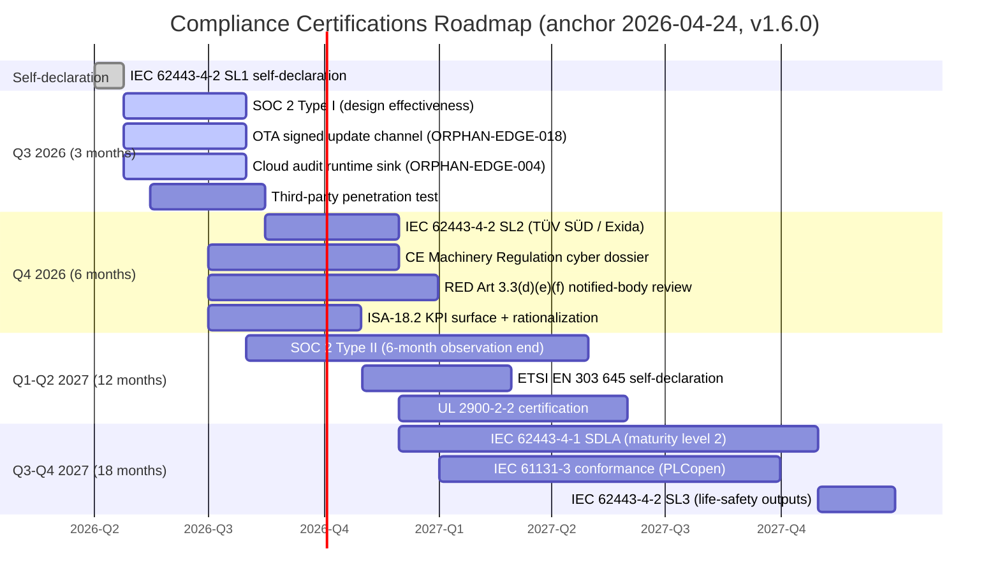

# Certifications Roadmap — `sens-api-gateway` v1.6.0

**Purpose:** Single planning view across every compliance target. Each entry has a target date, gatekeeper blocker list, responsible owner, and cross-reference to the evidence chapter.

**Status key:**

- **Today** — already landed or achievable within 3 months.
- **Q-NN** — quarter window targeted.
- **BLOCKED** — named blocker(s) must resolve before window opens.

## Gantt view



## Target-by-target detail

### Today — IEC 62443-4-2 SL1 self-declaration

- **Status:** LANDED.
- **Evidence:** [iec62443-4-2-gap.md](./iec62443-4-2-gap.md) FR1-FR7 PARTIAL+ posture; `docs/compliance/certificates/` directory does **not** exist — no formal certificate claimed.
- **Customer-facing language:** "IEC 62443-4-2 SL1 self-declaration; SL2 ROADMAP".

### Q3 2026 — SOC 2 Type I (design effectiveness)

- **Window:** 2026-04-24 → 2026-07-31 (3 months).
- **Gatekeeper:** None — Type I is a point-in-time design attestation; all policies + ADRs are in place.
- **Deliverables:** Auditor-issued Type I report covering CC1-CC9 + A1.x + C1.x + PI1.x + P1-P8.
- **Owner:** SaaS operator compliance lead + platform owner.
- **Evidence chapter:** [soc2.md](./soc2.md).

### Q3 2026 — OTA signed update channel (IEC 62443 SUM-4 + ETSI EN 303 645 §5.7)

- **Window:** 2026-04-24 → 2026-07-31.
- **Gatekeeper:** ORPHAN-EDGE-018 (OTA firmware update protocol + signing undocumented / unimplemented).
- **Blocker resolution path:** `feat(sens-api-gateway): OTA signed update channel` PR — ADR-019 A/B partition + ADR-032 cosign / sigstore + anti-rollback runtime.
- **Owner:** edge-agent maintainers + security team.
- **Evidence chapter:** [iec62443-4-1-sdla.md](./iec62443-4-1-sdla.md) SUM-4 / SUM-5 row; [ce-ul-fcc-red.md](./ce-ul-fcc-red.md) EN 303 645 §5.7.

### Q3 2026 — Cloud audit runtime sink (SOC 2 CC4.2 + IEC 62443 FR6)

- **Window:** 2026-04-24 → 2026-07-31.
- **Gatekeeper:** ORPHAN-EDGE-004 — the cloud consumer that lands HMAC-chained edge audit entries into a long-retention store is not wired.
- **Blocker resolution path:** wire the NATS consumer on the SaaS-backend side (`apps/observability-service/` or `apps/admin-api-service/`) + long-retention storage (OpenSearch per ADR-005 or purpose-built audit store) + query endpoint.
- **Owner:** SaaS-backend platform team + edge-agent maintainers jointly.
- **Downstream:** opens the 6-month observation window for SOC 2 Type II.
- **Evidence chapter:** [soc2.md](./soc2.md) CC4.2 row.

### Q3 2026 — Third-party penetration test

- **Window:** 2026-05-15 → 2026-08-15.
- **Gatekeeper:** SDLA SVV-4 row currently GAP.
- **Deliverables:** Independent pentest report (TÜV SÜD or equivalent); findings flow through CVD process into orphan-finding registry.
- **Owner:** Security team + platform owner.
- **Evidence chapter:** [iec62443-4-1-sdla.md](./iec62443-4-1-sdla.md) SVV-3 / SVV-4.

### Q4 2026 — IEC 62443-4-2 SL2 certification (TÜV SÜD / Exida)

- **Window:** after pentest completes → 2026-11-30 (6 months from anchor).
- **Gatekeeper:** 5 SL2 blockers listed in [iec62443-4-2-gap.md](./iec62443-4-2-gap.md) summary + SVV-3/SVV-4 pentest clean + SUM-4 OTA channel + SUM-5 patch SLA.
- **Deliverables:** Formal SL2 component-security certificate; certificate file added to `docs/compliance/certificates/` (directory created at that time, not before).
- **Owner:** Security team + compliance lead.
- **Evidence chapter:** [iec62443-4-2-gap.md](./iec62443-4-2-gap.md).

### Q4 2026 — CE Machinery Regulation (2023/1230) cyber dossier

- **Window:** 2026-07-01 → 2026-11-30.
- **Gatekeeper:** IEC 62443-4-2 SL2 certificate (evidence feeds Annex III clause 1.1.9).
- **Deliverables:** Cyber dossier delivered to OEM integrator + notified body; notified body review concludes by window end.
- **Owner:** OEM integrator + compliance lead (joint — OEM files the final CE declaration).
- **Evidence chapter:** [ce-ul-fcc-red.md](./ce-ul-fcc-red.md).

### Q4 2026 — RED Art 3.3(d)(e)(f) notified-body review

- **Window:** 2026-07-01 → 2026-12-31.
- **Gatekeeper:** EN 18031-1 + EN 18031-2 test reports based on IEC 62443-4-2 + GDPR/KVKK evidence.
- **Deliverables:** RED cyber dossier accepted by notified body per OEM SKU.
- **Owner:** OEM integrator + compliance lead.
- **Evidence chapter:** [ce-ul-fcc-red.md](./ce-ul-fcc-red.md).

### Q4 2026 — ISA-18.2 KPI surface + rationalization

- **Window:** 2026-07-01 → 2026-10-31.
- **Gatekeeper:** 5 FAIL rows in [isa18-2.md](./isa18-2.md) (rationalization metadata, flood detection, standing-alarm digest, chattering detection, performance metrics).
- **Deliverables:** Operator-visible KPI dashboard + rationalization workflow.
- **Owner:** Edge-agent maintainers + `operations-sla-writer`.
- **Downstream:** closes last FR6 PARTIAL row in [iec62443-4-2-gap.md](./iec62443-4-2-gap.md).

### Q1-Q2 2027 — SOC 2 Type II

- **Window:** observation ends at 6 months after audit-sink lands (2026-Q3) → Type II report attestable 2027-Q1/Q2.
- **Gatekeeper:** ORPHAN-EDGE-004 closure (2026-Q3) opens observation window.
- **Deliverables:** Auditor-issued Type II report.
- **Owner:** SaaS operator compliance lead.
- **Evidence chapter:** [soc2.md](./soc2.md).

### Q1 2027 — ETSI EN 303 645 self-declaration

- **Window:** 2026-11-01 → 2027-02-28.
- **Gatekeeper:** 5.7 (software integrity) depends on OTA channel Q3 delivery; 5.11 (data deletion) depends on tenant-termination cascade.
- **Deliverables:** Self-declaration (EN 303 645 does not require notified body for industrial gateway, but is valuable signal for RED dossier completeness).
- **Owner:** Compliance lead.
- **Evidence chapter:** [ce-ul-fcc-red.md](./ce-ul-fcc-red.md).

### Q2 2027 — UL 2900-2-2 certification

- **Window:** after SL2 → 2027-05-31.
- **Gatekeeper:** IEC 62443-4-2 SL2 certificate (UL accepts IEC 62443 as primary evidence).
- **Deliverables:** UL 2900-2-2 certification for North American market.
- **Owner:** Compliance lead + US channel partner.
- **Evidence chapter:** [ce-ul-fcc-red.md](./ce-ul-fcc-red.md).

### Q3-Q4 2027 — IEC 62443-4-1 SDLA (maturity level 2)

- **Window:** after SL2 product certificate → 2027-10-31 (18 months from anchor).
- **Gatekeeper:** All PARTIAL/GAP rows in [iec62443-4-1-sdla.md](./iec62443-4-1-sdla.md) closed; 12-month history of process evidence.
- **Deliverables:** SDLA maturity-level-2 certificate (Practices 1-8).
- **Owner:** Platform owner + compliance lead.
- **Evidence chapter:** [iec62443-4-1-sdla.md](./iec62443-4-1-sdla.md).

### Q3 2027 — IEC 61131-3 conformance (PLCopen)

- **Window:** 2027-01-01 → 2027-09-30.
- **Gatekeeper:** Faz 3 ST bytecode runtime VM landed + stable; SVV test corpus published.
- **Deliverables:** PLCopen IEC 61131-3 conformance test submission (ST + FBD languages; LD / IL / SFC explicitly NOT-PLANNED).
- **Owner:** Scripting runtime maintainers + compliance lead.
- **Evidence chapter:** [iec61131-3.md](./iec61131-3.md).

### Q4 2027 — IEC 62443-4-2 SL3 (life-safety outputs)

- **Window:** after SDLA maturity-level-2 → 2027-12-31 (18 months from anchor).
- **Gatekeeper:** 6 SL3 blockers listed in [iec62443-4-2-gap.md](./iec62443-4-2-gap.md) summary — primarily ADR-023 SL3 upgrade path + multi-party authorization + hardware-side DoS protection.
- **Deliverables:** SL3 certification for the life-safety-actuation subset (digital outputs, pH/NH3/DO thresholds, dosing pumps, aerators, VFD setpoints).
- **Owner:** Security team + OEM hardware partner.
- **Evidence chapter:** [iec62443-4-2-gap.md](./iec62443-4-2-gap.md) § SL3 blockers.

## Never-targeted

- **IEC 62443-4-2 SL4** — nation-state adversary with physical access. Outside the design envelope of a farm-floor edge gateway; claiming SL4 would require hardware roots of trust + anti-tamper + supply-chain attestation levels that are incompatible with commodity ARM / aarch64 COTS hardware. Not on any roadmap.
- **IEC 61131-3 LD / IL / SFC** — reasoning in [iec61131-3.md](./iec61131-3.md). NOT-PLANNED.

## Dependency graph summary

```
ORPHAN-EDGE-018 (OTA) ─────────┐
ORPHAN-EDGE-004 (audit sink) ──┼──► SOC 2 Type I ── 6-mo obs. ──► SOC 2 Type II
                               │
Pentest (SVV-3/-4) ─────────────┼──► IEC 62443-4-2 SL2 ──► CE cyber ──► RED
                               │                        │
                               │                        └► UL 2900-2-2
                               │
All PARTIAL SDLA rows resolved ─┴──────────────────────► IEC 62443-4-1 SDLA

Faz 3 ST VM ─────────────────────► IEC 61131-3 PLCopen conformance

SL2 product cert + SDLA cert + ADR-023 SL3 path ──► IEC 62443-4-2 SL3 (life-safety)
```

Compliance snapshot: 2026-04-24, v1.6.0, HEAD=3413db47
