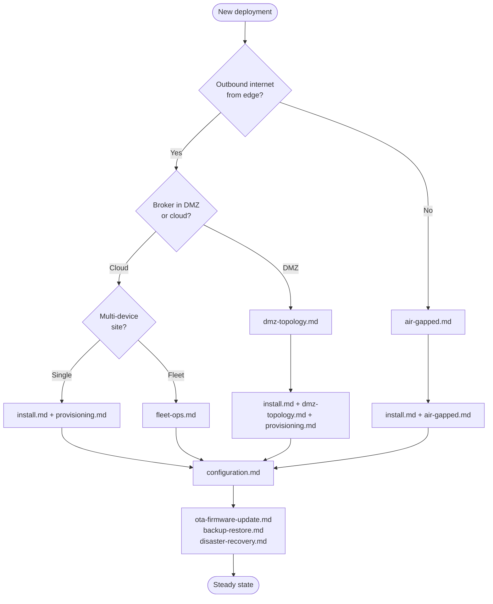

# Deployment Runbooks — `sens-api-gateway` v1.6.0

**Audience:** Field engineer, plant IT, site manager, fleet operator.
**Scope:** Install, provision, configure, update, back up, recover, decommission the `suderra-agent` edge binary + `suderra-display` kiosk on supported hardware.
**Source of truth:** HEAD `3413db47`, tag `v1.6.0`, 2026-04-24.

Every chapter follows strict **Do / Expect / Verify / On failure** step syntax. Narrative is intentionally absent — open these pages on a tablet while standing next to the device.

---

## Topology Decision Tree

## Chapter Index

| # | Chapter | Blast radius | Typical duration |
|---|---------|--------------|------------------|
| 1 | [install.md](install.md) | Single device | 20–40 min |
| 2 | [provisioning.md](provisioning.md) | Single device | 5–10 min |
| 3 | [configuration.md](configuration.md) | Single device | 10–30 min |
| 4 | [ota-firmware-update.md](ota-firmware-update.md) | Single device → fleet | 5–15 min per device |
| 5 | [backup-restore.md](backup-restore.md) | Single device | 10–20 min |
| 6 | [disaster-recovery.md](disaster-recovery.md) | Single device or site | 30–120 min |
| 7 | [air-gapped.md](air-gapped.md) | Single site | Variable |
| 8 | [dmz-topology.md](dmz-topology.md) | Single site | Variable |
| 9 | [fleet-ops.md](fleet-ops.md) | Fleet | 2–24 h depending on cohort size |
| 10 | [uninstall.md](uninstall.md) | Single device, IRREVERSIBLE | 15–30 min |

## Reading Order for First-Time Deployment

1. `install.md` — hardware + OS preconditions, binary install, systemd enable.
2. `provisioning.md` — bootstrap token → `activate` → credentials on disk.
3. `configuration.md` — open `/etc/suderra/config.yaml`, field-by-field.
4. `backup-restore.md` — confirm first backup succeeds before letting device leave the workbench.
5. `fleet-ops.md` — only when scaling beyond 1 device.

## Supported Hardware Matrix

| Platform | CPU arch | Cargo target | Notes |
|----------|----------|--------------|-------|
| Raspberry Pi 4 (4 GB / 8 GB) | `aarch64` | `aarch64-unknown-linux-gnu` | Reference target; GPIO via `rppal` |
| Raspberry Pi 5 | `aarch64` | `aarch64-unknown-linux-gnu` | Same image layout as Pi 4 |
| Revolution Pi Connect 4 | `aarch64` | `aarch64-unknown-linux-gnu` | Cold-boot budget override 120 s (ADR-019 §6) |
| x86 SIMATIC IPC (227E, 427E, 477E) | `x86_64` | `x86_64-unknown-linux-gnu` | Initial hardening profile documented in `install.md` |
| Siemens SIMATIC IOT2050 | `aarch64` | `aarch64-unknown-linux-gnu` | Same profile as RevPi |

## Cargo Feature Footprint Per Deployment Tier

| Tier | Features at build time | Binary changes |
|------|------------------------|----------------|
| Baseline (default) | `gpio`, `health` | GPIO + HTTP health on port 6526 |
| Security-enabled | `signed-deploy`, `tpm` | Strict signature mode; TPM NV counter for anti-rollback |
| HMI / Kiosk | `scada-display` | Embedded HTTP server + WebSocket for local HMI |
| Observability | `telemetry` | OTLP tracing export |
| LoRaWAN gateway | `lorawan` | SX1302 concentrator bindings |

See `sens-api-gateway/Cargo.toml:317-397` for the authoritative feature flag list.

## Honest Roadmap Disclosures (read before signing off)

| Capability | Status today | Milestone |
|------------|--------------|-----------|
| Provisioning returns `mqtt_password` directly | Present (`src/provisioning.rs:111-125`) | CSR-based flow returning client certificate — ROADMAP Faz 2 Sprint 6.4 (ORPHAN-EDGE-003) |
| OTA signed-manifest Ed25519 verify | Type-only scaffold in `src/updater/verify.rs`; signature verify is closure-injected and not wired in v1.6.0 — bypass today (ORPHAN-EDGE-004) | Sprint 6.5 — wires `ed25519_dalek` + anti-rollback NV counter |
| A/B partition swap | NOT present today | Q4 roadmap (ADR-019 §2) |
| TPM unseal | Opt-in (`tpm` feature, default-off) | Tier 1 in ADR-019 §7; graceful fallback Tier 2/3 when TPM absent |

Every runbook that touches these areas restates the roadmap label at the relevant step so operators never mistake roadmap capability for deployed capability.

## Banned-Phrase Compliance

These runbooks pass the `tools/gates/banned-phrase.ts` pre-commit gate. The canonical substitution table is maintained in `.claude/agents/edge-docs/README.md` § Banned-phrase discipline; every runbook here follows that mapping, plus the dated-target form "systemd unit NOT YET IN REPO — Q3" used where an asset is scheduled but not yet in the tree.

## Appendix: Evidence Anchors

- `sens-api-gateway/systemd/suderra-agent.service` — hardened service unit (IEC 62443 SL-2)
- `sens-api-gateway/systemd/suderra-display.service` — kiosk unit
- `sens-api-gateway/scripts/setup-display.sh` — kiosk install helper
- `sens-api-gateway/src/provisioning.rs` — activation + self-register flows
- `sens-api-gateway/src/updater/mod.rs`, `src/updater/verify.rs` — firmware manifest types
- `sens-api-gateway/src/config.rs` — `AgentConfig` + `MqttConfig` schemas
- `sens-api-gateway/src/main.rs:722-887` — SIGHUP config reload handler
- `sens-api-gateway/src/safe_state.rs` — `SafeStateManager::apply` pre-shutdown
- `sens-api-gateway/src/backup.rs` — backup manifest format + retention
- `sens-api-gateway/Cargo.toml:317-397` — feature flag catalogue
