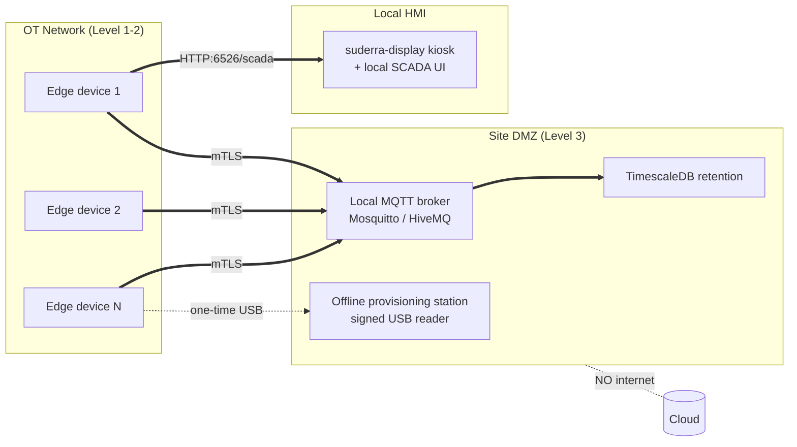

# Air-Gapped Deployment Runbook

**Audience:** Field engineer deploying into a site with no outbound internet; OT plant IT operator running the site's local broker.
**Prerequisites:**
- Target hardware prepared per `install.md` Steps 1–7.
- Local MQTT broker already deployed on a DMZ VM or on-prem server reachable from the edge over the OT network (e.g. Mosquitto, HiveMQ Edge).
- Local provisioning assets on signed USB media: agent binary artefact, manifest, broker CA bundle, per-device credential envelope.
- Operator has the site-master key for bundle decryption (never stored on the USB, carried via separate channel).

**Duration:** 30–60 min first device; 15–20 min subsequent devices at the same site.
**Blast radius:** single device (first); the site once the broker is shared.
**Safety:** first-time deploy is greenfield (no actuator under control yet). When adding a device to a site with existing actuator coverage, follow `ota-firmware-update.md` Step 2 safe-state before connecting.

---

## Topology



No inbound or outbound internet traffic. The edge, broker, and HMI exist on a fully self-contained network.

---

## Step 1 — Prepare the provisioning USB

**Do:** on the operator's trusted workstation, prepare a signed USB image with:

```
/suderra-airgap-<site-code>/
├── agent/
│   ├── suderra-agent_1.6.0_<arch>.tar.gz
│   ├── suderra-agent_1.6.0_<arch>.tar.gz.sha256
│   └── suderra-agent_1.6.0_<arch>.manifest.json
├── certs/
│   ├── broker-ca.pem            # local broker CA
│   └── devices/<device-code>/   # per-device credential envelopes
│       ├── client.pem
│       ├── client.key           # mode 0600
│       └── config.yaml.seed
└── checksums.sha256             # covers every file in the tree
```

**Expect:** USB is write-locked after burn; a parallel out-of-band email/SMS conveys the site-master key to the field engineer.

**Verify:**
```bash
sha256sum -c /mnt/usb/checksums.sha256
```

**On failure:** checksum mismatch → the media is untrusted. Destroy and re-burn. Do not patch over a single bad file — the whole image is suspect.

---

## Step 2 — Stage the binary on the device

Follow `install.md` Steps 1–5 exactly, sourcing the artefact from the USB rather than network.

```bash
sudo tar --no-same-owner -xzf \
    /mnt/usb/suderra-airgap-<site-code>/agent/suderra-agent_1.6.0_aarch64.tar.gz \
    -C /tmp/suderra-install
sudo install -m 0755 -o root -g root \
    /tmp/suderra-install/suderra-agent /usr/local/bin/suderra-agent
```

**Expect:** binary installed; systemd unit enabled.

**Verify:** `install.md` Step 7 verify block.

**On failure:** see `install.md` On-failure matrix.

---

## Step 3 — Install per-device credential envelope

**Do:**
```bash
sudo install -d -o root -g suderra -m 0750 /etc/suderra
sudo install -m 0600 -o root -g suderra \
    /mnt/usb/.../certs/broker-ca.pem        /etc/suderra/broker-ca.pem
sudo install -m 0600 -o root -g suderra \
    /mnt/usb/.../certs/devices/<dev>/client.pem /etc/suderra/client.pem
sudo install -m 0600 -o root -g suderra \
    /mnt/usb/.../certs/devices/<dev>/client.key /etc/suderra/client.key
sudo install -m 0600 -o root -g suderra \
    /mnt/usb/.../certs/devices/<dev>/config.yaml.seed /etc/suderra/config.yaml
```

**Expect:** all four files mode 0600, owned `root:suderra`.

**Verify:**
```bash
stat -c '%U:%G %a %n' /etc/suderra/*.pem /etc/suderra/client.key /etc/suderra/config.yaml
```

**On failure:** mode drift → re-run `chmod 0600`. The agent's `src/security::validate_key_file_permissions` helper rejects world-readable key files at load time.

---

## Step 4 — Wire config.yaml to the local broker

The pre-seeded `config.yaml` already points at the local broker. Confirm:

```yaml
api_url: "https://provisioning.internal.invalid"   # unreachable by design; cloud provisioning disabled
mqtt:
  broker: "mqtt.site.internal"
  port: 8883
  username: "<per-device>"
  password: null                                   # mTLS in use; no shared secret
  tls:
    enabled: true
    ca_cert_path: /etc/suderra/broker-ca.pem
    client_cert_path: /etc/suderra/client.pem
    client_key_path: /etc/suderra/client.key
    verify_hostname: true
    insecure_skip_verify: false
tenant_id: "<site-tenant-id>"
device_id: "<device-uuid>"
device_code: "<device-code>"
```

**Expect:** no outbound internet reference; MQTT uses mTLS with the site-local CA + per-device client cert. Because the broker enforces mTLS, the `mqtt_password` field remains null — the air-gapped path side-steps ORPHAN-EDGE-003 entirely by using client certificates from day one.

**Verify:** `sudo -u suderra awk '/^api_url|password|client_cert_path/' /etc/suderra/config.yaml`.

**On failure:** `insecure_skip_verify: true` → reject. In release builds the agent refuses to load (`src/config.rs:252-260`). Fix the seed file and retry.

---

## Step 5 — Start the agent

**Do:**
```bash
sudo systemctl start suderra-agent
```

**Expect:** agent connects to the local broker; capabilities retained message published; local SCADA server (if `scada-display` feature built) listens on 6526.

**Verify:**
```bash
systemctl is-active suderra-agent
journalctl -u suderra-agent --since "1 min ago" | grep -iE 'mqtt connected|subscribed' | tail -5
curl -sf http://localhost:6526/health && echo
```

**On failure:**
- mTLS handshake fails → the broker does not trust this client cert. Confirm the broker's `cafile` includes the site CA and `require_certificate true` is set. If using a downstream CRL, make sure this device's cert is not in it.
- Name resolution fails for `mqtt.site.internal` → fix `/etc/hosts` or local DNS. The air-gapped profile deliberately does not allow unresolved DNS to fall through to a public resolver.

---

## Step 6 — Enable local HMI (optional)

If the operator wants on-device kiosk display at this site:

```bash
sudo /var/aqua-saas/sens-api-gateway/scripts/setup-display.sh install
sudo /var/aqua-saas/sens-api-gateway/scripts/setup-display.sh enable
sudo /var/aqua-saas/sens-api-gateway/scripts/setup-display.sh status
```

**Expect:** `cage` compositor + Chromium kiosk up; `Agent HTTP health check: OK`.

**Verify:** run the `status` subcommand again after 60 s and confirm both `cage` and `chromium` are still running.

**On failure:**
- `No display device at /dev/dri/card0` → no DRM device. The service unit has `ConditionPathExists=/dev/dri/card0` (`suderra-display.service:18`) and will refuse to start. Use a headless variant without this feature.
- `Agent HTTP health check: FAILED` → the display service's `ExecStartPre` loops for 30 s waiting for `/health` (`suderra-display.service:35`). Fix the agent first (Step 5 on-failure matrix) before enabling the display.

---

## Step 7 — Update artefact rotation

Since there is no cloud OTA, updates come from signed USB media.

**Do:** follow `ota-firmware-update.md` with the update artefact sourced from a fresh signed USB. Gate 5 (monotonic version) still enforces: a USB-borne downgrade is refused.

**Expect:** update succeeds end-to-end, with the update audit entry written locally to `/var/log/suderra/audit.log` (air-gapped sites cannot post to a cloud audit sink, so the local HMAC-chained log is the single-source-of-truth per ADR-020).

**Verify:** `sudo -u suderra tail -n 5 /var/log/suderra/audit.log`.

**On failure:** see `ota-firmware-update.md` Rollback.

---

## Step 8 — Telemetry retention at the site

Air-gapped sites typically use a local TimescaleDB/PostgreSQL for retention. The broker forwards telemetry into this sink via a local sidecar (site-specific, not in this repo).

**Do:** confirm the site sink is receiving telemetry:
```bash
# Example Mosquitto bridge / subscriber sanity:
mosquitto_sub -h mqtt.site.internal -p 8883 \
    --cafile /etc/suderra/broker-ca.pem \
    --cert /etc/suderra/client.pem --key /etc/suderra/client.key \
    -t "suderra/<tenant>/<device>/telemetry" -v | head -5
```

**Expect:** JSON telemetry messages stream out.

**Verify:** site TimescaleDB row count for the device grows over a 5-min window.

**On failure:** sink lag → this is a site-side topic, not an agent issue. Follow the site's sink runbook.

---

## Post-conditions

- Device is under mTLS with the local broker — no outbound internet traffic.
- Credentials on disk are 0600; broker-ca present; no `mqtt_password` populated.
- Local HMI reachable if enabled.
- Update artefact rotation is documented on signed USB cadence.
- Local audit log is the SSoT for device events.

## Rollback

To decommission an air-gapped device, run `uninstall.md` on the device (skipping the cloud-side revoke because there is no cloud). Revoke the client cert at the local CA by adding it to the site CRL, and redeploy the CRL to the broker.

## Appendix: Evidence

- `sens-api-gateway/src/config.rs:223-310` — `MqttTlsConfig` (`client_cert_path`, `client_key_path`).
- `sens-api-gateway/src/security` — `validate_key_file_permissions` (FR4 MED-23).
- `sens-api-gateway/systemd/suderra-agent.service:91-95` — read-only `/etc/suderra`, writable `/var/lib/suderra` + `/var/log/suderra`.
- `sens-api-gateway/scripts/setup-display.sh:34-123` — kiosk install flow.
- ADR-020 — local audit log HMAC chain.
