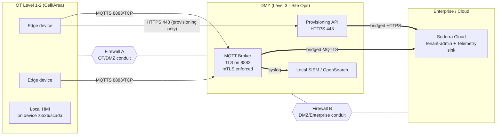

# DMZ Topology Runbook

**Audience:** Plant IT network architect + OT security reviewer.
**Prerequisites:**
- OT network and IT network are separated by a firewall managed by the site.
- The operator can request firewall rule changes (conduits) via the plant IT change process.
- Cloud tenant is provisioned; the DMZ-hosted broker has been authorised against it (if the topology bridges to cloud).

**Duration:** design work measured in days; enforcement changes per conduit measured in hours.
**Blast radius:** single site (all edge devices routed through the DMZ).
**Safety:** adding or removing a conduit can cut command/telemetry flow. Coordinate with plant operations; during a conduit change, queued QoS 1/2 messages accumulate in the broker (clean_session=false by default, `src/config.rs:296-301`) — plan for the disconnect window.

---

## Reference Topology



Reference model: IEC 62443 zone + conduit. Edge devices live in a Level 1-2 **zone**; the DMZ broker + provisioning API live in a Level 3 **zone**; the cloud lives in Level 4/5. Every arrow crossing a zone boundary is an explicit **conduit** with documented direction, port, protocol, TLS posture, auth.

---

## Firewall Rules — Authoritative Conduit Table

Firewall A governs the OT ↔ DMZ boundary. Every rule below must be explicitly programmed; the default stance is deny-all.

| # | Source zone | Source | Dest zone | Dest | Port/Proto | Direction | TLS | Auth | Purpose |
|---|-------------|--------|-----------|------|------------|-----------|-----|------|---------|
| A1 | OT | Edge devices subnet | DMZ | Broker | 8883/TCP | outbound from OT | TLS 1.3 (server or mTLS) | Username/password OR client cert | Telemetry publish + command subscribe |
| A2 | OT | Edge devices subnet | DMZ | Provisioning API | 443/TCP | outbound from OT | TLS 1.3 | Single-use bootstrap token | One-time activation + self-register |
| A3 | DMZ | NTP host | OT | Edge devices | 123/UDP | inbound to OT | n/a | symmetric key (chrony) | Time sync — NTP server lives in DMZ |
| A4 | OT | Edge devices | DMZ | Syslog relay | 6514/TCP | outbound from OT | TLS 1.3 | cert | Optional audit log forwarding |

Firewall B governs the DMZ ↔ Enterprise/Cloud boundary.

| # | Source | Dest | Port/Proto | TLS | Auth | Purpose |
|---|--------|------|------------|-----|------|---------|
| B1 | Broker | Cloud broker | 8883/TCP | TLS 1.3 + mTLS | cert | Broker-to-broker bridge (if cloud integration enabled) |
| B2 | Provisioning API | Cloud provisioning | 443/TCP | TLS 1.3 | service-account token | Token validation + cloud device registry |
| B3 | Local SIEM | Enterprise SIEM | 6514/TCP | TLS 1.3 | cert | Cross-zone log forwarding |

### Rules that MUST stay denied

- Any outbound HTTP (port 80) from OT — provisioning + telemetry are TLS-only.
- Any direct OT ↔ Enterprise/Cloud flow bypassing the DMZ — all cloud traffic hops through the DMZ broker or provisioning API.
- Inbound port 22 (SSH) from DMZ or Enterprise into OT — edge devices receive updates via MQTT, not via SSH push.
- Any protocol listed on the banned list from CERT-IACS/ICS-CERT advisories (SMB, NETBIOS, Telnet, Rsh, TFTP).

---

## Step 1 — Design the conduit table for this site

**Do:** starting from the authoritative table above, produce the site-specific conduit spreadsheet with exact IP addresses / subnets / source-NAT policy. Review with OT security.

**Expect:** every row has an owner, a review-date, and an implementation ticket.

**Verify:** spreadsheet is attached to the site design doc + signed off by OT + IT Sec.

**On failure:** unsigned design → do not proceed to enforcement. Unresolved conduit design is the leading cause of cross-zone exposure.

---

## Step 2 — Implement Firewall A rules

**Do:** plant IT implements rules A1–A4 on Firewall A per the site spreadsheet. Typical nftables-style example for a Linux-based firewall:

```
table inet ot_to_dmz {
    chain forward {
        type filter hook forward priority 0; policy drop;

        # A1 — MQTTS 8883 out to broker
        ip saddr 10.30.0.0/24 ip daddr 10.40.5.10 tcp dport 8883 ct state new,established accept
        ip daddr 10.30.0.0/24 ip saddr 10.40.5.10 tcp sport 8883 ct state established accept

        # A2 — HTTPS 443 out to provisioning API
        ip saddr 10.30.0.0/24 ip daddr 10.40.5.11 tcp dport 443 ct state new,established accept
        ip daddr 10.30.0.0/24 ip saddr 10.40.5.11 tcp sport 443 ct state established accept

        # A3 — NTP in
        ip saddr 10.40.5.12 ip daddr 10.30.0.0/24 udp dport 123 ct state new,established accept
        ip daddr 10.40.5.12 ip saddr 10.30.0.0/24 udp sport 123 ct state established accept

        # A4 — optional syslog out
        ip saddr 10.30.0.0/24 ip daddr 10.40.5.13 tcp dport 6514 ct state new,established accept
    }
}
```

**Expect:** commit succeeds; no concurrent sessions dropped because `ct state established accept` preserves already-open connections.

**Verify:** from an edge device
```bash
nc -vz mqtt.site.dmz 8883         # connection refused or connected — NOT blocked
nc -vz provisioning.site.dmz 443
```

**On failure:** drop in session count observed on devices during commit → the firewall invalidated established flows. Roll back the rule change and rewrite with stateful `ct state established accept` before attempting again.

---

## Step 3 — Implement Firewall B rules

**Do:** plant IT implements rules B1–B3 per the site spreadsheet. These rules are outside the edge device's direct control; document only.

**Expect:** broker-to-cloud bridge is up; cloud shows the DMZ broker's identity.

**Verify:** cloud tenant-admin → bridge health dashboard → green.

**On failure:** bridge down → cloud-side investigation; edge devices remain operational against the local broker until the bridge recovers. Backlog drains via retained MQTT queue.

---

## Step 4 — Point edge devices at the DMZ endpoints

**Do:** for every edge device, update `config.yaml`:

```yaml
api_url: "https://provisioning.site.dmz"
mqtt:
  broker: "mqtt.site.dmz"
  port: 8883
  tls:
    enabled: true
    ca_cert_path: /etc/suderra/dmz-ca.pem
    verify_hostname: true
```

Reload via `systemctl reload suderra-agent` (see `configuration.md` Step 8).

**Expect:** edge devices reconnect to the DMZ broker.

**Verify:** `journalctl -u suderra-agent | grep -i 'mqtt connected'` shows the DMZ broker hostname.

**On failure:** TLS hostname mismatch → `verify_hostname: true` is strict. Confirm the broker's certificate CN/SAN includes `mqtt.site.dmz`. Do not flip `verify_hostname: false` — that would widen attack surface. Re-issue the broker cert instead.

---

## Step 5 — Continuous-verification: conduit drift

**Do:** keep a watch-dog that alerts on deviation from the conduit table. Typical implementation:

- nightly nmap from the OT subnet against the DMZ, diffed against the approved conduit table.
- nightly nmap from the DMZ against OT, diffed likewise.

**Expect:** only rules A1–A4 (inbound from A3) and B1–B3 show open.

**Verify:** diff output is empty.

**On failure:** any new open port → treat as a drift incident. Open a change ticket; close the drift within 24 h.

---

## Post-conditions

- Conduit table is implemented and signed off.
- Edge devices reach the DMZ only on the approved ports.
- Broker bridges cleanly to the cloud (if applicable).
- Drift monitoring is active.

## Rollback

Reversing a DMZ migration — e.g. returning to direct edge ↔ cloud — is rarely advisable once the DMZ is in place. If required:

1. Prepare the direct-to-cloud broker endpoint.
2. Update edge `config.yaml` in a canary cohort (see `fleet-ops.md`).
3. Let the canary soak.
4. Wide-roll.
5. Decommission the DMZ broker last, after all devices have reconnected.

## Appendix: Evidence

- `sens-api-gateway/src/config.rs:223-261` — `MqttTlsConfig` including `verify_hostname` default-true.
- `sens-api-gateway/systemd/suderra-agent.service:168-176` — nftables allow-list note: CIDR enforcement lives in deployment firewall, not the unit file (by design).
- ADR-014 / ADR-015 — NATS cert-is-identity principle (the same discipline is mirrored here for MQTT bridges to the cloud).
- IEC 62443-3-3 — zone and conduit baseline.
