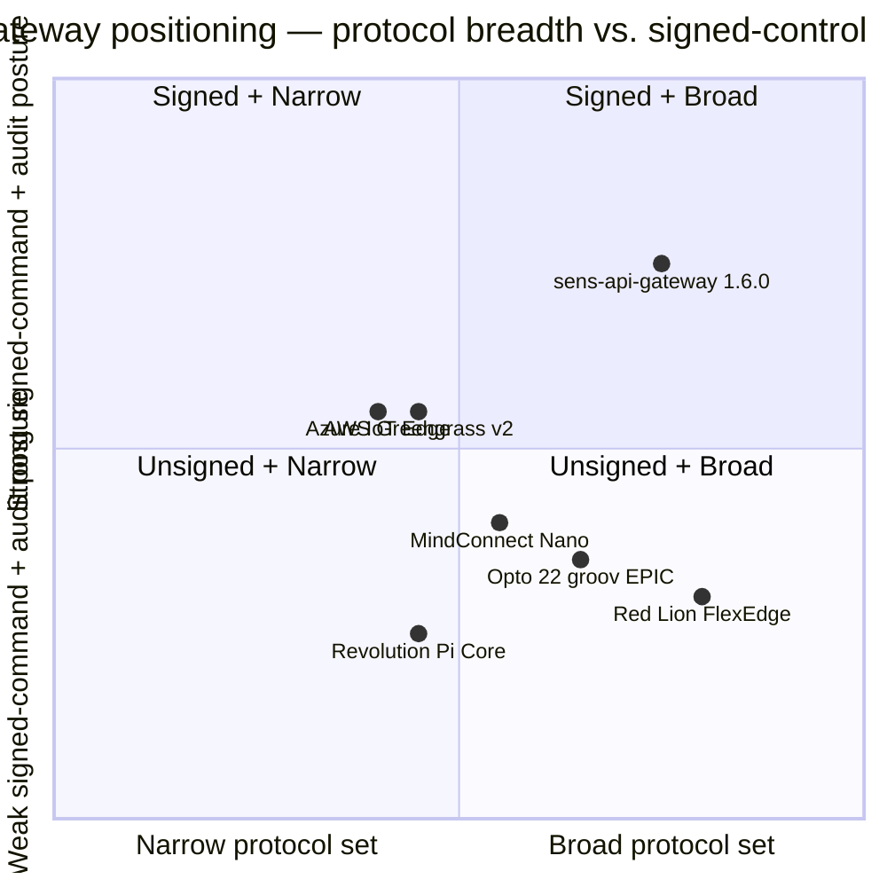

# sens-api-gateway — Competitive Positioning

**Version under comparison:** sens-api-gateway 1.6.0 (`Cargo.toml:6`) · **Date:** 2026-04-24 · **Source commit:** `3413db47`
**Audience:** Siemens procurement + OT cybersecurity vendor-assessment reviewer, or a customer IT/OT team running a like-for-like RFP evaluation.
**Honesty contract:** where a competitor wins, this document says so with a citation. Where sens-api-gateway wins, the row cites a Rust source file + line or `Cargo.toml` + line.

## Competitive set

Six reference products, chosen because they appear most often in target-customer RFPs alongside sens-api-gateway:

1. **AWS IoT Greengrass v2** — hyperscaler edge runtime (Lambda-on-edge, Stream Manager, MQTT broker bridge).
2. **Azure IoT Edge** — hyperscaler edge runtime (modules-as-containers, Device Twin, Edge Hub MQTT bridge).
3. **Siemens MindConnect Nano** — Siemens-branded industrial edge gateway, MindSphere / Insights Hub uplink.
4. **Red Lion FlexEdge** — US protocol-gateway leader; Crimson + Graphite apps, wide protocol fan-out.
5. **Opto 22 groov EPIC** — US industrial edge controller + PAC; Node-RED, CODESYS optional.
6. **Revolution Pi Core** — DE open hardware edge; Kunbus Linux image on Raspberry Pi Compute Module; Codesys option.

## Positioning quadrant

*Axis reading: the y-axis rewards products that sign mutating commands end-to-end, chain their audit log, and pin signing algorithms. The x-axis rewards breadth of native industrial protocols without vendor middleware.*

## Side-by-side matrix

| Feature | Greengrass v2 | Azure IoT Edge | MindConnect Nano | Red Lion FlexEdge | Opto 22 groov EPIC | Revolution Pi Core | **sens-api-gateway** |
|---------|---------------|----------------|-------------------|--------------------|---------------------|---------------------|----------------------|
| Native MQTT 3.1.1 / v5 | Yes (via MQTT bridge / Greengrass MQTT) | Yes (Edge Hub) | Yes | Yes | Yes | App-level | **Yes** — `Cargo.toml:33` `rumqttc = "0.25"`, `src/mqtt.rs` |
| MQTT to cloud over mTLS (cert-is-identity) | Yes | Yes | Yes | Yes | Yes | App-level | **ROADMAP-Q2** — device leg is user/pass today (`src/mqtt.rs:203-237`). Competitors win this row today. |
| Native Modbus-TCP | Partner / Lambda component | Partner / module | Yes | Yes | Yes | Partner / app | **Yes** — `Cargo.toml:70` rodbus 1.4, `src/modbus.rs` |
| Native Modbus-RTU | Partner | Partner | Yes | Yes | Yes | Partner | **Yes** — `Cargo.toml:72` tokio-serial |
| Native OPC UA server (IEC 62541) | Partner component | Yes (preview / module) | Yes (client) | Yes | Yes | Partner | **Yes, feature-gated** — `Cargo.toml:266, 379`, `src/plc_programming/opcua.rs` (handrolled, 5 787 LOC; vendor-stack review is ROADMAP-Q3) |
| Native S7comm (Siemens 300/400/1200/1500) | No | No | **Yes (Siemens-native)** | Yes | Optional | No | **Yes** — `src/plc_programming/s7comm.rs` |
| PROFINET device / IO-Device | No | No | **Yes** | Partial | Partial | No | **NOT-PLANNED** — certified stack missing; MindConnect Nano wins this row |
| PROFINET IRT | No | No | **Yes** | No | No | No | **NOT-PLANNED** — MindConnect Nano wins |
| EtherNet/IP (CIP) | Partner | Partner | No | Yes | Yes | Partner | **Yes** — `src/plc_programming/ethernet_ip.rs` |
| Beckhoff ADS/AMS | No | No | No | Yes | No | Partner | **Yes** — `src/plc_programming/ads.rs` |
| Codesys V3 | No | No | No | No | Optional | **Yes** (DE strength) | **Yes** — `src/plc_programming/codesys.rs` |
| LoRaWAN concentrator (SX1302) | Partner | Partner | No | No | No | Partner | **Yes, feature-gated** — `src/lora/` + vendor HAL (`Cargo.toml:286-341`) |
| IEC 61131-3 Structured Text runtime on the device | No | No | No | No (scripting) | **Yes** (CODESYS add-on) | **Yes** (CODESYS add-on) | **Yes, feature-gated, native Rust VM** — `Cargo.toml:367`, `src/st_validator.rs` (3 551 LOC), ADR-017 |
| IEC 61131-3 LD / FBD / SFC | No | No | No | No | **Yes (via CODESYS)** | **Yes (via CODESYS)** | **NOT-PLANNED** — ADR-017 §2; ST-only product decision. groov EPIC + Revolution Pi win these rows |
| Local HMI / kiosk | No | No | No | Yes (Crimson / Graphite) | **Yes (groov View)** | Partner | **Yes, feature-gated** — `Cargo.toml:338`, `src/scada_server.rs` (2 145 LOC) |
| Signed-command envelope (Ed25519 on mutating commands) | Partial (Lambda signing) | Partial (module image signing) | Partial | No | No | No | **Yes, feature-gated** — `Cargo.toml:355` `signed-deploy`, `src/command_envelope/`, ADR-018 §7 |
| HMAC audit chain (append-only, 7-yr retention) | No (CloudWatch logs) | No (Log Analytics) | No | No | No | No | **Yes** — `src/audit/chain.rs`, ADR-020 §1, 7-yr retention per ADR-020 §10a |
| TPM 2.0 device-identity sealing | Optional (Greengrass secrets) | Optional (DPS + HSM) | Partial | No | No | Optional | **Yes, feature-gated** — `Cargo.toml:284, 361`, ADR-019 §7 |
| Kani formal verification harnesses (safe_state, RBAC, gas) | No | No | No | No | No | No | **Yes** — `Cargo.toml:394-397`, ADR-023 §8 |
| Memory-safety posture (no GC / no C for hot path) | Node.js / Python / C++ runtimes | .NET / Node.js / Python modules | Java + C | Linux + Java mix | Java + CODESYS C | Linux + CODESYS C | **Pure Rust** — `edition = "2024"`, `unwrap_used = "deny"`, `indexing_slicing = "deny"`, `unsafe_op_in_unsafe_fn = "deny"` (`Cargo.toml:4, 433-445`) |
| Offline queue on uplink loss | Stream Manager | Edge Hub store-and-forward | Yes | Yes | Yes | App-level | **Yes** — `src/offline_queue.rs`, SQLCipher-backed |
| Field-level I/O (GPIO / I2C / SPI / PWM) on one binary | No (RPi via partner) | No (RPi via partner) | No | Yes | Yes | **Yes** (RPi CM native) | **Yes** — `src/{gpio, i2c, spi, pwm}.rs` |
| Atlas Scientific EZO (pH / DO / EC) | Partner | Partner | No | Partner | Partner | Partner | **Yes, native** — `src/atlas_ezo.rs` |
| MindSphere / Insights Hub uplink | No | No | **Yes (native)** | Partner | No | No | **ROADMAP** — owned by `integration/siemens/` (siemens-integration-writer). MindConnect Nano wins today. |
| TIA Portal GSDML export | No | No | **Yes (native)** | Partner | No | No | **ROADMAP** — owned by siemens-integration-writer. MindConnect Nano wins today. |
| SBOM (CycloneDX) at release | Yes | Yes | Partial | No | No | Partial | **ROADMAP-Q2** — CI pipeline work; competitors partly win this row |
| ISO/IEC 30111 CVD policy | Yes | Yes | Yes | No | No | No | **ROADMAP-Q2** — owned by security-architecture-writer; hyperscalers win this row today |
| Certified IEC 62443-4-2 SL2 | Not claimed for edge runtime itself | Not claimed for edge runtime itself | **SL2 claimed** | Not claimed | Not claimed | Not claimed | **Not certified** — posture-building per §5 of `overview.md`. MindConnect Nano wins this row today. |
| ISA-18.2 alarm KPI evidence | No | No | No | Partial | Partial | No | **ROADMAP-Q3** — shape present in `src/alarm_engine.rs`; KPI doc by operations-sla-writer |
| Hardware-vendor-independent (runs on many SBCs) | Ties to AWS Snow family + qualified gateways | Ties to qualified gateways | **Siemens hardware only** | Red Lion hardware only | **Opto 22 hardware only** | Revolution Pi + RPi CM only | **Yes** — runs on RPi 4/5 (ARM64), RPi 3 (armv7), x86-64 Linux (`docs/ARCHITECTURE.md` §Build Targets) |
| License model | AWS EULA | Azure / Microsoft | Siemens commercial | Red Lion commercial | Opto 22 commercial | KunBus commercial + OSS | **Proprietary** — `Cargo.toml:8` |

## Where sens-api-gateway loses (explicit)

A Siemens reviewer comparing line-for-line today should mark the following boxes against us, not for us. Document remains valid if any change:

1. **PROFINET + MindSphere + TIA-native workflow — MindConnect Nano wins.** Siemens-native integration is the product's purpose; we list that work under ROADMAP and own the gap publicly in `integration/siemens/` (owned by `siemens-integration-writer`).
2. **CODESYS-hosted IEC 61131-3 full language set (LD / FBD / SFC) — groov EPIC + Revolution Pi win.** Product decision per ADR-017 §2 is ST-only. No closure planned; reason documented.
3. **IEC 62443-4-2 SL2 certification badge — MindConnect Nano claims it; we do not.** Until the `compliance-evidence-writer` delivers SL2 certification evidence, this row stays against us.
4. **MQTT mTLS on device uplink — every competitor here today; we ship user/pass.** Evidence: `src/mqtt.rs:203-237`. Closure is ROADMAP-Q2 migration to cert-is-identity per ADR-015 pattern (already live on platform NATS fabric).
5. **SBOM at release — hyperscalers generate it automatically; we do not yet.** ROADMAP-Q2 owned by `compliance-evidence-writer` + CI.
6. **Published CVD policy (ISO/IEC 30111) — AWS / Azure / Siemens publish theirs; ours is in build.** ROADMAP-Q2 owned by `security-architecture-writer`.

## Where sens-api-gateway wins (with receipts)

1. **Signed + chained audit end-to-end in one OSS-free Rust binary.** No competitor ships Ed25519-signed mutating commands + HMAC-chained audit log with a 7-year retention contract as a baseline. Evidence: `Cargo.toml:145` (ed25519-dalek 2.1), `src/command_envelope/`, `src/audit/chain.rs`, ADR-018 §7, ADR-020 §1 + §10a.
2. **Formal verification in CI (Kani).** No competitor publishes formal `safe_state_reachable` / `rbac_non_bypass` / `gas_budget_saturating` harnesses. Evidence: `Cargo.toml:394-397`, ADR-023 §8.
3. **Memory-safe everywhere (no GC pauses, no C in the hot path).** CODESYS-hosted competitors run C on the control path. Greengrass / IoT Edge hot-path is Node.js / .NET / containers. Evidence: `Cargo.toml:4` edition 2024, `Cargo.toml:433-445` deny-lints.
4. **ISA-18.2 alarm state + priority conflict detector in scripting layer.** Most competitors outsource alarming to the PLC or a cloud rules engine. Evidence: `src/alarm_engine.rs:14-245`, `src/scripting/conflict.rs`.
5. **IEC 61131-3 ST runs as native Rust, not as a CODESYS add-on.** Cold-start cost, runtime dependencies, and licence model all lower. Evidence: `src/st_validator.rs` (3 551 LOC), `Cargo.toml:367` feature `st-bytecode`, ADR-017.
6. **Protocol breadth in one binary, not an ecosystem of partner components.** Greengrass / IoT Edge need partner components for most industrial protocols; sens-api-gateway ships them in the default crate graph. Evidence: `src/plc_programming/` (ads, codesys, ethernet_ip, opcua, s7comm), `src/modbus.rs`, `src/lora/`, `src/atlas_ezo.rs`.
7. **Offline-first by design with SQLCipher-at-rest.** Competitors offer store-and-forward with plaintext or OS-level encryption. Evidence: `Cargo.toml:89-94` bundled-sqlcipher-vendored-openssl, `src/offline_queue.rs`, `src/scada_db.rs`.
8. **Hardware-independent across three SBC ISAs.** No CODESYS-runtime lock-in, no Siemens-hardware-only requirement. Evidence: `docs/ARCHITECTURE.md` §Build Targets (x86_64 / aarch64 / armv7).

## Win / loss summary by evaluator profile

| Buyer profile | Likely winner of the RFP |
|---------------|---------------------------|
| Siemens PROFINET + MindSphere factory | **MindConnect Nano** — native fit |
| US packaging / process-industry retrofit with AB + Modbus + EtherNet/IP | **Red Lion FlexEdge** — US install base, breadth |
| US discrete automation with Opto 22 legacy | **Opto 22 groov EPIC** — installed base |
| DE / EU mid-market CODESYS / Siemens S7 / open-hardware | **Revolution Pi Core** for CODESYS or **sens-api-gateway** for audit + multi-site |
| Aquaculture Tier-1/Tier-2 multi-site with compliance burden | **sens-api-gateway** — signed-command + audit + offline-first |
| Hyperscaler-native greenfield with Lambda / Azure Function control logic | **Greengrass / IoT Edge** — native integration |
| Regulated food / pharma / water utility needing audit chain + memory-safe binary | **sens-api-gateway** — chained audit log + Rust posture |

## Evidence

- `Cargo.toml:4, 6, 8, 30, 33, 70, 72, 94, 110, 116, 145, 158, 171, 207, 220, 234, 252, 266, 284, 286-296, 299, 310-311, 315, 326, 328, 330, 338, 341, 355, 361, 367, 372, 379, 385, 392, 394-397, 421-445`
- `sens-api-gateway/src/alarm_engine.rs:14-245`
- `sens-api-gateway/src/audit/chain.rs`, `entry.rs`
- `sens-api-gateway/src/command_envelope/` (canonical, envelope, jti, mutating)
- `sens-api-gateway/src/modbus.rs`, `mqtt.rs:203-237`, `offline_queue.rs`, `scada_db.rs`
- `sens-api-gateway/src/plc_programming/` (ads, codesys, ethernet_ip, opcua, s7comm)
- `sens-api-gateway/src/scada_server.rs`, `st_validator.rs`
- `sens-api-gateway/src/safe_state.rs:76-130`, `src/scripting/conflict.rs`
- `sens-api-gateway/docs/ARCHITECTURE.md` §Build Targets
- `docs/adr/017-st-bytecode-runtime.md`, `018-edge-rbac-abac-model.md`, `019-edge-firmware-signing-ab-partition.md`, `020-audit-log-hmac-chain.md`, `021-platform-key-ceremony-lifecycle.md`, `023-sl3-upgrade-path.md`
- `docs/reviews/edge-expert/2026-04-05-s2-high-findings.md:141-198` — Modbus defense-in-depth status
- `docs/reviews/orphan-findings.md#ORPHAN-018` — OTA doc gap
