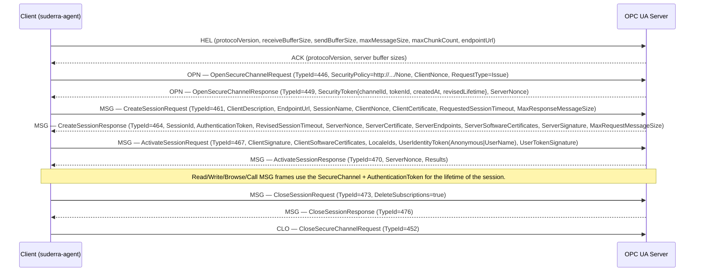

# OPC UA — Wire Contract Reference

**Protocol role on this device:** binary-transport OPC UA client. `suderra-agent` connects to third-party OPC UA servers (Siemens S7-1500, Beckhoff TwinCAT 3, B&R Automation Studio, Unified Automation and other PLCopen-OPCUA servers) to browse / read / write / call methods against the address space.

A separate OPC UA **server** role (feature `opc-ua-server`, crate `async-opcua`) is off by default and is not part of the RC2 `scada-display` release tier; this chapter covers the **client** role only.

RC2 operator guidance lives in `docs/runbooks/edge-gateway-opcua.md`. For `agent-v2.0.0-rc2`, treat the client as `SecurityPolicy#None` unless a later runtime PR proves signed/encrypted chunk support.

RFC 2119 keywords apply.

## 1. Standard + version

- Base: **IEC 62541-6 OPC Unified Architecture — Part 6: Mappings**, edition 2.0 (2017), also published as **OPC Foundation Part 6 v1.04**.
- Transport mapping: `opc.tcp` binary (Part 6 § 7).
- Encoding: OPC UA Binary (Part 6 § 5.2).
- Default port: `4840` (`src/plc_programming/opcua.rs:55`).
- Security Policies referenced in the code: `#None`, `#Basic256Sha256`, `#Basic256`, `#Aes128_Sha256_RsaOaep`, `#Aes256_Sha256_RsaPss` (`src/plc_programming/opcua.rs:403-417`).

## 2. Crate + feature flag

- The OPC UA **client** is **hand-rolled** (`src/plc_programming/opcua.rs`, 5 787 lines). It is NOT built on the `opcua` crate. This is a deliberate choice at the time of this snapshot because the client only needs a narrow slice of OPC UA services (CreateSession, ActivateSession, Browse, Read, Write, Call) and the external crate would add build-time complexity against constrained ARMv7/aarch64 targets.
- No feature flag guards the client — it is always compiled.
- The `opcua = "0.12"` dependency (`Cargo.toml:266`) and the `opc-ua-server` feature (`Cargo.toml:379`) exist for the **server** role and are NOT consumed by this chapter.

## 3. Supported operations

Service — request TypeId — response TypeId — status anchor:

| Service | Request TypeId | Response TypeId | Status | Anchor |
|---------|----------------|-----------------|--------|--------|
| Hello / Acknowledge (`HEL`/`ACK`) | — | — | PRESENT | `src/plc_programming/opcua.rs:61-66` |
| OpenSecureChannel | 446 | 449 | PRESENT (None only — see section 6) | `src/plc_programming/opcua.rs:1387-1419`, `src/plc_programming/opcua.rs:2893` |
| CloseSecureChannel | 452 | — | PRESENT | `src/plc_programming/opcua.rs:86` |
| CreateSession | 461 | 464 | PRESENT | `src/plc_programming/opcua.rs:78-80`, `src/plc_programming/opcua.rs:1782-1891` |
| ActivateSession | 467 | 470 | PRESENT (anonymous + username/password IdentityToken) | `src/plc_programming/opcua.rs:82-84` |
| CloseSession | 473 | 476 | PRESENT | `src/plc_programming/opcua.rs:133-136` |
| Cancel | 479 | 482 | PRESENT | `src/plc_programming/opcua.rs:137-140` |
| Browse | 527 | 530 | PRESENT | `src/plc_programming/opcua.rs:88-90` |
| BrowseNext | 531 | 534 | PRESENT | `src/plc_programming/opcua.rs:147-149` |
| TranslateBrowsePathsToNodeIds | 552 | 555 | PRESENT | `src/plc_programming/opcua.rs:150-153` |
| RegisterNodes / UnregisterNodes | 558/564 | 561/567 | PRESENT | `src/plc_programming/opcua.rs:154-161` |
| Read | 631 | 634 | PRESENT | `src/plc_programming/opcua.rs:92-94` |
| Write | 673 | 676 | PRESENT | `src/plc_programming/opcua.rs:96-98` |
| Call | 712 | 715 | PRESENT | `src/plc_programming/opcua.rs:100-102` |
| HistoryRead / HistoryUpdate | 664/700 | 667/703 | NOT-WIRED — ROADMAP-Q3 | TypeIds defined `src/plc_programming/opcua.rs:168-174`; no send path |
| CreateMonitoredItems / Subscription / Publish | — | — | ROADMAP-Q3 | Agent polls via Read instead of Subscription |
| AddNodes / AddReferences / DeleteNodes / DeleteReferences | — | — | NOT-PURSUED | Address-space authoring is a server concern |
| Query services | — | — | NOT-PURSUED | |

Structured Data Types, Server / Endpoint discovery (`FindServers`, `GetEndpoints`) Type IDs are defined (`src/plc_programming/opcua.rs:109-123`) and the discovery call paths exist; they MUST be invoked before first CreateSession.

## 4. Wire format

### 4.1 Secure-channel handshake



### 4.2 Message framing on the wire

Every message begins with the 8-byte chunk header defined by Part 6 § 7.1.2:

| Offset | Field | Size | Notes |
|--------|-------|------|-------|
| `0x00` | MessageType | 3 bytes ASCII | `HEL`, `ACK`, `ERR`, `OPN`, `CLO`, `MSG` (`src/plc_programming/opcua.rs:61-66`). |
| `0x03` | ChunkType | 1 byte ASCII | `F` final, `C` intermediate chunk, `A` abort. |
| `0x04` | MessageSize | 4 bytes LE u32 | Total chunk size in bytes including this header. |

Maximum message size: **16 MiB** (`MAX_OPCUA_MESSAGE_SIZE`, `src/plc_programming/opcua.rs:58`). A message larger than this limit MUST be rejected by the client before decoding.

NodeId encoding follows Part 6 § 5.2.2.9:

| Encoding | Byte 0 | Content |
|----------|--------|---------|
| TwoByte | `0x00` | 1-byte identifier |
| FourByte | `0x01` | 1-byte namespace + 2-byte identifier |
| Numeric | `0x02` | 2-byte namespace + 4-byte identifier |
| String | `0x03` | 2-byte namespace + String |
| Guid | `0x04` | 2-byte namespace + 16-byte Guid |
| Opaque (ByteString) | `0x05` | 2-byte namespace + ByteString |

## 5. Error handling

- Per-request timeout: configurable via `timeout_secs` (`src/plc_programming/opcua.rs:443`); default 10 s.
- Session timeout (server-revised): default requested `60 000 ms` (`src/plc_programming/opcua.rs:444`, `default_session_timeout`).
- OPC UA `StatusCode` is a 32-bit value; the client decodes it as `u32` and logs `CreateSession failed with status: 0x<HEX>` (`src/plc_programming/opcua.rs:1891`). It does NOT yet map the status-code dictionary to human-readable names — integrators SHOULD refer to OPC Foundation Part 4 Annex A.
- On read/write, operation-level `StatusCode` is returned per-value and surfaced to the application layer as an `Err` variant for any non-`Good` status.

## 6. Authentication + encryption

**CRITICAL HONESTY (ORPHAN-EDGE-005):**

The hand-rolled OPC UA client declares both `SECURITY_POLICY_NONE` and `SECURITY_POLICY_BASIC256SHA256` as URI constants (`src/plc_programming/opcua.rs:69-71`). It also exposes the full Siemens-expected policy enum (`OpcUaSecurityPolicy::None | Basic256 | Basic256Sha256 | Aes128Sha256RsaOaep | Aes256Sha256RsaPss`, `src/plc_programming/opcua.rs:391-400`) and `OpcUaSecurityMode::None | Sign | SignAndEncrypt` (`src/plc_programming/opcua.rs:425-430`). The configuration DEFAULT is `Basic256Sha256` + `SignAndEncrypt` (`src/plc_programming/opcua.rs:395-398`, `src/plc_programming/opcua.rs:428-430`).

However:

- The wired code path today issues **OpenSecureChannelRequest with `SecurityPolicy#None`** (observed at `src/plc_programming/opcua.rs:43-69` + `src/plc_programming/opcua.rs:1387-1419`; the cryptographic signing / encrypting of MSG chunks per Part 6 § 6.7 has no live implementation).
- The certificate handling (`client_cert_path`, `client_key_path`, `src/plc_programming/opcua.rs:441-442`) is carried through the config surface but the message-layer asymmetric key exchange + symmetric derivation per Part 6 § 6.7.4 is not performed.
- Therefore: a Siemens-facing customer auditing the edge today MUST treat the OPC UA client as `SecurityPolicy#None` + `SecurityMode#None`. Basic256Sha256 and SignAndEncrypt are `ROADMAP-Q3` under `ORPHAN-EDGE-005`. Until that finding closes, OPC UA traffic MUST be confined to a physically isolated cell network or an IPsec / WireGuard overlay.
- User-identity tokens: Anonymous + UserName (cleartext over the `None` policy) are implemented. Certificate-based identity tokens are NOT WIRED.

### 6.1 Why this matters for Siemens

Siemens OPC UA servers (S7-1500, TIA Portal V16+) default to `Basic256Sha256 / SignAndEncrypt` and will refuse `SecurityPolicy#None` unless the operator explicitly enables an unsecured endpoint. Integrators evaluating this agent against a S7-1500 PLC MUST either:

1. Wait for `ORPHAN-EDGE-005` to close (Q3 roadmap target), or
2. Enable an unsecured endpoint on the S7 side under a written exception — and compensate with network-layer controls.

## 7. Configuration schema

```yaml
opcua:
  - name: siemens_s7_1500
    endpoint_url: opc.tcp://10.42.1.50:4840
    security_policy: basic256_sha256      # none | basic256 | basic256_sha256 | aes128_sha256_rsa_oaep | aes256_sha256_rsa_pss
    security_mode: sign_and_encrypt       # none | sign | sign_and_encrypt
    username: opcua_reader                # optional
    password: "********"                  # optional; cleartext under SecurityPolicy#None — AVOID
    client_cert_path: /etc/suderra/opcua-client.der
    client_key_path:  /etc/suderra/opcua-client.key
    timeout_secs: 10
    session_timeout_ms: 60000
    program_namespace: 4                  # optional — namespace for ProgramTransfer nodes
```

See `src/plc_programming/opcua.rs:432-447` for the `OpcUaConfig::default()` shape.

## 8. Worked example

Read node `ns=4;s=MAIN.StateMachine.CurrentStep` as a `String`:

```
MSG-F <len=0x0000006C>
SecureChannelId = 0x000000A3
TokenId         = 0x00000001
SequenceNumber  = 17
RequestId       = 17
TypeId          = NodeId(ns=0, id=631)   # ReadRequest
RequestHeader   = { AuthenticationToken, Timestamp, RequestHandle, ... }
MaxAge          = 0
TimestampsToReturn = 2 (Both)
NodesToRead     = [
  { NodeId(ns=4, s="MAIN.StateMachine.CurrentStep"),
    AttributeId = 13 (Value),
    IndexRange = null,
    DataEncoding = null
  }
]
```

Response (TypeId 634):

```
Results = [
  DataValue {
    Value            = Variant(String, "AERATION_ON"),
    StatusCode       = 0x00000000 (Good),
    SourceTimestamp  = 2026-04-24T12:00:00Z,
    ServerTimestamp  = 2026-04-24T12:00:00.007Z
  }
]
```

## 9. Test coverage

- 45 `#[test]` / `#[tokio::test]` blocks live inside `src/plc_programming/opcua.rs`. The test surface exercises: Hello / Ack parsing, OpenSecureChannel under `#None`, NodeId encoding round-trip, Variant encoding, StatusCode parsing, CreateSession response decoding.
- No security-policy `Basic256Sha256` test exists — consistent with ORPHAN-EDGE-005.
- HIL against a live S7-1500 or Beckhoff TwinCAT 3 is RECOMMENDED and is the only path to proving interop with vendor-specific quirks (e.g. Siemens namespace `4` structure).

## 10. Interop certification status

- **OPC Foundation Compliance Test Tool (CTT):** not pursued. Formal PASS against CTT requires security-policy coverage; blocked on ORPHAN-EDGE-005.
- **PLCopen OPC UA for Client / Server:** not tested.

## 11. Evidence

| Claim | Anchor |
|-------|--------|
| Hand-rolled client; 5 787 LoC | `src/plc_programming/opcua.rs` (file length) |
| `SECURITY_POLICY_NONE` + `SECURITY_POLICY_BASIC256SHA256` URI constants | `src/plc_programming/opcua.rs:69-71` |
| Hello/Ack/Open/Close/Msg tokens | `src/plc_programming/opcua.rs:61-66` |
| Default port `4840` | `src/plc_programming/opcua.rs:55` |
| Max message size 16 MiB | `src/plc_programming/opcua.rs:58` |
| Service TypeIds (CreateSession 461/464, ActivateSession 467/470, Browse 527/530, Read 631/634, Write 673/676, Call 712/715) | `src/plc_programming/opcua.rs:78-102` |
| OpcUaSecurityPolicy enum + default `Basic256Sha256` | `src/plc_programming/opcua.rs:391-400` |
| OpcUaSecurityMode enum + default `SignAndEncrypt` | `src/plc_programming/opcua.rs:425-430` |
| Observed wired policy = `#None` | `src/plc_programming/opcua.rs:43-69`, ORPHAN-EDGE-005 |
| CreateSession StatusCode decode | `src/plc_programming/opcua.rs:1891` |

## Interop test plan

| # | Input | Expected output |
|---|-------|-----------------|
| O1 | `HEL` with `ReceiveBufferSize = 8192`, `SendBufferSize = 8192` against a compliant server | `ACK` with server-side buffers; no protocol error |
| O2 | `OpenSecureChannelRequest` with `SecurityPolicy#None`, `RequestType = Issue` | `OpenSecureChannelResponse`, `channelId != 0`, `tokenId != 0`, `revisedLifetime > 0` |
| O3 | `CreateSession` → `ActivateSession` with Anonymous IdentityToken | `ActivateSessionResponse` `StatusCode = Good (0x00000000)` |
| O4 | `Read` node `ns=0;i=2259` (Server_ServerStatus_State) | `DataValue` with `Variant(Int32, 0)` (Running) |
| O5 | `Write` a read-only node | Operation-level `StatusCode = 0x80AF0000` (BadNotWritable) surfaced as `Err` |
| O6 | `Call` method with wrong ObjectId | `StatusCode = 0x80AA0000` (BadMethodInvalid) |
| O7 | `OpenSecureChannelRequest` with `SecurityPolicy#Basic256Sha256` | Fails against current build — `ORPHAN-EDGE-005 ROADMAP-Q3`; no spontaneous downgrade to `#None` |
| O8 | Server revokes session after `revisedSessionTimeout` | Next request fails with `BadSessionIdInvalid`; client logs `CreateSession failed ...`, should reopen session |
| O9 | 20 MiB response | Rejected at decode with a length-limit error (> 16 MiB cap) |
| O10 | Siemens S7-1500 with only secured endpoint available | CreateSession fails with `BadSecurityChecksFailed`; ROADMAP-Q3 gating applies |
