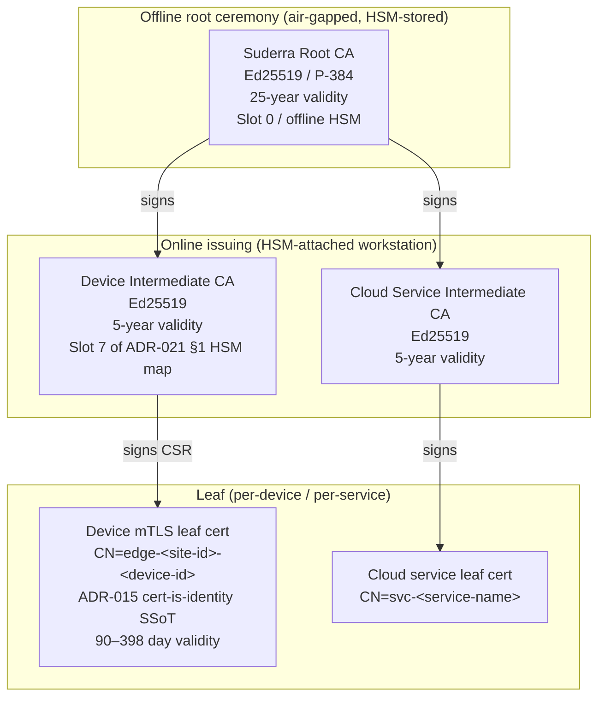

# PKI Hierarchy — `sens-api-gateway` v1.6.0

**Source of truth:** HEAD `3413db47`, tag `v1.6.0`, date `2026-04-24`.
**Scope:** X.509 and Ed25519 key trees, rotation, revocation, bootstrap. The document distinguishes TODAY (v1.6.0 live code) from ROADMAP (tracked Faz 2 sprint delivery).

---

## 1. CA tree (planned)



Status today vs roadmap:

| Layer | Today (v1.6.0) | Roadmap milestone |
|-------|----------------|-------------------|
| Root CA + Device Intermediate | Generated; keys in offline HSM (ceremony operator-owned) | Established |
| Device leaf cert per agent | NOT wired — MQTT uses username+password (`src/mqtt.rs:237`) | ROADMAP-Faz 2 Sprint 6.4 — CSR flow in provisioning API |
| Cloud service leaf cert | Let's Encrypt on provisioning API endpoint; agent verifies via system CA store (`src/provisioning.rs:219-223`) | Kept as-is — Let's Encrypt 90-day rotation matches our freshness policy |
| Leaf-cert fingerprint pinning | Types only (`src/mtls/pinning.rs`; `#[allow(dead_code)]` per `src/main.rs:98`) | ROADMAP-Faz 2 Sprint 6.8 — staged rollout Legacy → Warn → Strict per `src/mtls/mode.rs` |

Key-generation location:

- **Root + Intermediates:** air-gapped ceremony workstation with attached HSM; private key never leaves the HSM. Signing operations are quorum-authorized per ADR-021 §8 (two-person integrity for slots 1–9 per the 9-slot canonical map).
- **Device leaf (ROADMAP):** CSR generated on-device using pure-Rust code (no openssl subprocess); private key stored in the sealed keystore backend (TPM NV, systemd-creds, or Argon2id-wrapped file — ADR-018 §7). CSR + device fingerprint sent to provisioning API; response carries signed cert + bootstrap tokens.
- **Cloud service leaves:** Let's Encrypt ACME; renewed by cloud infrastructure, not by edge agents.

---

## 2. Ed25519 signing-key slots (ADR-021 §1 canonical 9-slot HSM map)

Edge devices VERIFY only — they do not hold any of these signing keys. Signing is an offline-ceremony or cloud-operator action. Slot identifiers are reused in audit events.

| Slot | Name | Purpose | Edge verify call site |
|------|------|---------|-----------------------|
| 1 | firmware_manifest | A/B firmware image signature | `src/updater/...` (type-only, ROADMAP-Sprint 6.5) |
| 2 | rbac_manifest | Role/permission manifest signature | `src/authz/...` via `verify_manifest` closure (types Batch 5b) |
| 3 | command_envelope | Mutating command signature | `src/command_envelope/...` (type-only, ROADMAP-Sprint 6.4) |
| 4 | st_bytecode | ST-language compiled bytecode signature | `src/plc_programming/...` + `src/scripting/...` |
| 5 | audit_daily_anchor | Ed25519 over last-entry current_hmac per day | `src/audit/...` (ROADMAP-Sprint 6.2, ORPHAN-EDGE-004 labels runtime sink NOT WIRED) |
| 6 | license_jwt | License JWT claim signing | `jsonwebtoken` verify with `Algorithm::EdDSA` (`Cargo.toml:246-251`) |
| 7 | device_intermediate_ca | Signs per-device X.509 leaf | ROADMAP-Sprint 6.4 |
| 8 | acceptance_token | Signs file-backed keystore operator-acceptance | `src/keystore/acceptance.rs:56-65` |
| 9 | revocation_statement | Signs CRL-equivalent revocation statements | Not yet exercised on edge |

Cross-reference: `device_audit_attestation_keypair` is HKDF-derived on-edge per ADR-020 §2. This is the ONE signing key held on-edge (per-epoch audit attestation); it is derived from the TPM-sealed master and rotates every epoch.

---

## 3. Cert CN format (ADR-015 cert-is-identity SSoT)

Device leaf cert subject:

```
CN = edge-<site-id>-<device-id>
```

- `site-id`: operator-assigned 6–12 chars `[a-z0-9-]`.
- `device-id`: factory-assigned UUIDv4 short form (first 8 hex chars) or full device UUID.

Identity extraction — at verification time, the authenticated subject CN is the SINGLE TRUST ANCHOR. Neither `x-tenant-id` headers, MQTT username, nor payload claims may alter the tenant binding. The cloud-side NATS equivalent of this rule is ADR-014 / ADR-015 (cert-is-identity).

Edge agent TODAY does not enforce CN-based client cert identity because it publishes to MQTT with username+password (ORPHAN-EDGE-003). After CSR rollout (ROADMAP-Sprint 6.4) the MQTT broker ACL pivots from username → CN.

---

## 4. Rotation policy

| Cert type | Max validity | Rotation lead | Enforcement |
|-----------|--------------|---------------|-------------|
| Root CA | 25 years | 5-year ceremony cadence | Offline; manual operator process |
| Device Intermediate CA | 5 years | 6-month overlap | Keys stay in HSM; new issuance pauses old |
| Device leaf (mTLS mode `Legacy`) | 60 days | 30-day alert | `MAX_LEAF_CERT_AGE_DAYS_LEGACY = 60` (`src/mtls/mode.rs:8`) |
| Device leaf (mTLS mode `Warn`) | 90 days | 30-day alert | `MAX_LEAF_CERT_AGE_DAYS_WARN = 90` (`src/mtls/mode.rs:13`) |
| Device leaf (mTLS mode `Strict`) | 398 days (CA/B Forum ceiling) | 30-day alert | `MAX_LEAF_CERT_AGE_DAYS_STRICT = 398` (`src/mtls/mode.rs:22`) |
| Cloud service leaf (Let's Encrypt) | 90 days | ACME-automated | Edge side monitors via `check_certificate_expiry` (`src/security.rs:286-361`) |

Edge-side expiry check thresholds (`src/security.rs:250-264`):

- `Ok` ≥ 30 days remaining
- `Warning` 14–30 days
- `Critical` 7–14 days
- `Urgent` < 7 days
- `Expired` < 0

Operator alerts are emitted through `tracing-journald` (`Cargo.toml:234`) + MQTT `alarms` topic when a cert drops below 30 days.

---

## 5. Revocation

### 5.1 CRL distribution

- **Cloud side:** intermediate CA publishes CRL to `https://crl.suderra.example/issuing-ca.crl` (PLACEHOLDER host — operator-specific domain set at deployment time). Signed by the intermediate CA Ed25519 key.
- **Edge side:** CRL fetched opportunistically during online sync; cached under `/var/lib/suderra/pki/crl/` with 7-day max staleness. Hard-expiry 30 days — after which the agent refuses to validate new broker sessions until CRL refreshes.

### 5.2 OCSP

- **Not in initial rollout.** OCSP responders add state-synchronization complexity and OCSP stapling is a broker-side responsibility under the current MQTT architecture. Revisit under ROADMAP-Q4 if OCSP must-staple becomes mandatory by customer policy.

### 5.3 Revocation statement (slot 9)

- Emergency revocation (compromised Intermediate, for example) signs a revocation statement with slot 9 and publishes it to every connected agent via MQTT retained topic `suderra/security/revocation`. Agents cache the statement in the signed-deploy enforcement path (feature `signed-deploy`, `Cargo.toml:355`) and refuse to establish new sessions covered by the revoked cert.

---

## 6. Bootstrap tokens (provisioning)

Two flows coexist (ADR-018 §2 license tier allocation + plan HC-1):

| Flow | Token field | Lifetime | Scope | Source code |
|------|-------------|----------|-------|-------------|
| Pre-registered device (classic activate) | `provisioning_token` | Single-use; cloud-policy-bound (24 h default) | One device_id | `src/provisioning.rs:235-246` |
| Self-register (tenant-first) | `tenant_token` | Single-use or multi-use (tenant-policy) | One tenant, creates a new device_id on use | `src/provisioning.rs:343-354` |

Both tokens are wrapped in `secrecy::Secret<String>` (`Cargo.toml:47`) so they only leave the zeroizing container at `expose_secret()` call sites. Logged values are masked via `mask_token` (`src/provisioning.rs:33-46`) with a 20-character threshold (LOW-41): shorter tokens render as asterisks; 20+ render as first-4 + ellipsis + last-4.

Time-binding of provisioning tokens is the cloud-API responsibility (expiry in the database row); edge receives it opaquely.

---

## 7. Service-identity bridge to cloud (ADR-014 / ADR-015)

Cloud-side the NATS bus uses mTLS with cert CN as the sole identity (`docs/adr/014-nats-mtls-only-auth.md`, `docs/adr/015-nats-cert-is-identity-ssot.md`). No NATS user/pass. The edge does not speak NATS directly; it reaches cloud through:

1. HTTPS provisioning API → Let's Encrypt cert verify.
2. MQTT broker → TLS with system CA today (`src/mqtt.rs:744-786`), per-device X.509 roadmap.

Neither edge path uses NATS CONNECT-frame credentials — alignment with ADR-015 `verify_and_map: true` is preserved by keeping the edge out of the NATS trust domain entirely.

---

## 8. Today-vs-roadmap truth line

- **TODAY (v1.6.0):** Edge verifies cloud TLS via system CA; MQTT username+password auth; cert-expiry monitoring active; PKI types for pinning and rotation exist but are `#[allow(dead_code)]` per Faz-2 staging (`src/main.rs:60-99`).
- **ROADMAP-Faz 2 Sprint 6.4:** CSR flow in provisioning; MQTT broker pivots to CN-based ACL; `ORPHAN-EDGE-003` closes.
- **ROADMAP-Faz 2 Sprint 6.8:** mTLS `Strict` mode; leaf-cert fingerprint pinning active; 2-phase cert rotation state machine wired.

---

## 9. Cross-references

- `docs/security/crypto-inventory.md` — primitives underpinning every signing/verify path.
- `docs/security/threat-model.md` — trust-boundary 5 (operator ceremony) lists the STRIDE mitigations.
- `docs/security/credentials-handling.md` — keystore backends that hold private material.
- ADR-014, ADR-015, ADR-018, ADR-019, ADR-021.
