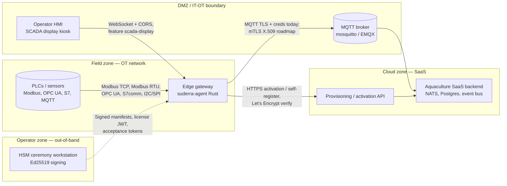
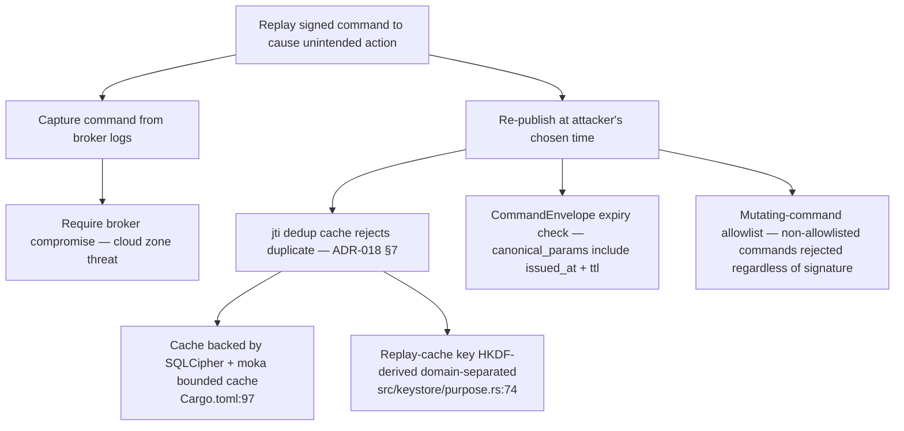

# Threat Model — `sens-api-gateway` v1.6.0

**Source of truth:** HEAD `3413db47`, tag `v1.6.0`, date `2026-04-24`.
**Methodology:** Microsoft STRIDE per trust boundary + attack trees for the three highest-impact threats. Control tier labels reference CLAUDE.md architectural-solution hierarchy (Tier-1 make-it-impossible, Tier-2 make-it-automatic, Tier-3 make-it-detectable).

---

## 1. Trust-boundary diagram



Trust boundaries (numbered for STRIDE matrix references):

1. Field device ↔ edge agent (Modbus/OPC UA/S7/I2C wire level)
2. Edge agent ↔ MQTT broker (DMZ crossing)
3. Edge agent ↔ cloud provisioning API (HTTPS)
4. Operator HMI ↔ edge SCADA display server (localhost/LAN WebSocket)
5. Operator ceremony ↔ edge (signed artifacts: firmware, RBAC, license, acceptance)
6. Local filesystem ↔ edge process (config, keys, audit log)
7. Kernel / hardware ↔ edge process (TPM, systemd-creds, PCR, sealed storage)

---

## 2. STRIDE matrix

### Trust boundary 1 — Field device ↔ edge agent

| STRIDE | Threat | Control tier | Evidence / mitigation |
|--------|--------|--------------|-----------------------|
| **S**poofing | Malicious actor on OT LAN impersonates PLC, feeds false telemetry | Tier-3 detectable | Modbus TLS path (rodbus 1.4 PKI via `TlsClientConfig::full_pki`; `Cargo.toml:70`). Non-TLS deployments rely on physical OT-LAN segmentation (HARDWARE-VENDOR RESPONSIBILITY — customer network design). OPC UA server `SECURITY_POLICY_NONE` today — ROADMAP per ORPHAN-EDGE-005, target Faz 2 Sprint 6.5 Basic256Sha256 |
| **T**ampering | Modified payload in transit on RS-485 or Ethernet | Tier-3 detectable | Modbus CRC-16 (protocol-level, weak); TLS where available; replay-cache + jti dedup in CommandEnvelope (`src/command_envelope/mod.rs`) |
| **R**epudiation | Operator denies having commanded a PLC write | Tier-1 make-it-impossible | Two-phase audit entry (Pre + Post) per regulated action via `AuditEntry::phase` (`src/audit/entry.rs:27-41`); Pre-phase logged BEFORE command handler runs so intent is recorded even on handler crash. Chain HMAC means tamper detectable (`src/audit/chain.rs:171`) |
| **I**nformation disclosure | Sensitive process value read by unauthorized OT node | Tier-3 detectable | Permission manifest signed by platform slot (ADR-021 §1 slot 2); `AuditAction::TagRead` emitted on each read (`src/audit/entry.rs:124`) |
| **D**enial of service | Malformed Modbus frame crashes agent | Tier-1 make-it-impossible | `clippy::unwrap_used=deny`, `expect_used=deny`, `indexing_slicing=deny` (`Cargo.toml:434-440`); bincode input bounded via `MAX_ENVELOPE_BYTES = 64 KB` / bytecode 256 KB (`Cargo.toml:186-193`) |
| **E**levation of privilege | OT-side attacker writes to a tag class they shouldn't | Tier-1 make-it-impossible | `AuditResource::Permission` wire-tag discipline; RBAC manifest verified via Ed25519 before activation (`src/keystore/mod.rs:99-108` derive_key domain separation) |

### Trust boundary 2 — Edge agent ↔ MQTT broker

| STRIDE | Threat | Control tier | Evidence / mitigation |
|--------|--------|--------------|-----------------------|
| **S**poofing | Attacker impersonates broker (MITM) | Tier-3 detectable today → Tier-1 roadmap | Today: rustls with explicit CA (or system store); hostname verification always on (`src/mqtt.rs:706-718`). Leaf-cert pinning types declared but NOT wired (`src/mtls/pinning.rs` — label "mTLS 6-layer TYPE-ONLY" per main.rs `#[allow(dead_code)]` markers, `src/main.rs:98`). Roadmap Faz 2 Sprint 6.8 wires pinning + 2-phase rotation |
| **S**poofing | Attacker impersonates agent (reuses creds) | Tier-2 make-it-automatic (partial) | Today: MQTT username + password set via `options.set_credentials` (`src/mqtt.rs:237`) — ORPHAN-EDGE-003 labels this as current state; ROADMAP per-device X.509 client cert via CSR flow Faz 2 Sprint 6.4. Password stored `secrecy::Secret` with `ExposeSecret` at point-of-use only (`Cargo.toml:47`, `src/provisioning.rs:230-246`) |
| **T**ampering | Injected PUBLISH manipulates a command | Tier-1 make-it-impossible | Mutating commands require a signed `CommandEnvelope` — Ed25519 over canonical bytes, jti dedup, mutating-command allowlist (`src/command_envelope/mod.rs`, type-only today, Faz 2 Sprint 6.4 runtime). Outside signed-deploy enforcement: permissive with warning; `signed-deploy` feature flag flips to reject (`Cargo.toml:355`) |
| **R**epudiation | "The broker was compromised, not me" | Tier-3 detectable | Audit Pre + Post with correlation_id (UUIDv4) links cloud-side MQTT record to edge-side audit entry (`src/audit/entry.rs:337`) |
| **I**nformation disclosure | Telemetry read by unauthorized MQTT subscriber | Tier-2 make-it-automatic | Per-tenant topic namespace; broker ACL enforced server-side; TLS in transit (`src/mqtt.rs:248`) |
| **D**enial of service | Malicious broker sends 10 MiB PUBLISH to exhaust memory | Tier-1 make-it-impossible | `options.set_max_packet_size(1 MiB, 1 MiB)` (`src/mqtt.rs:245`); rumqttc uses rustls (no OpenSSL attack surface); `rustls-tls-manual-roots` avoids h2 transitively (`Cargo.toml:30`) |
| **E**levation of privilege | Broker publishes a firmware-update on behalf of operator | Tier-1 make-it-impossible | Firmware manifest verification is closure-injected Ed25519 (`src/updater/...`); enforced regardless of broker identity |

### Trust boundary 3 — Edge agent ↔ cloud provisioning API

| STRIDE | Threat | Control tier | Evidence / mitigation |
|--------|--------|--------------|-----------------------|
| **S**poofing | Rogue API server phishes activation token | Tier-2 make-it-automatic | Let's Encrypt system CA store; `redirect::Policy::none()` blocks cross-origin redirect leak of token (`src/provisioning.rs:220`); `reqwest` with rustls, no OpenSSL (`Cargo.toml:28-30`) |
| **T**ampering | Injected MQTT credentials in activation response | Tier-3 detectable | Activation response parsed strictly (serde); `ActivationResponse` custom `Debug` redacts `mqtt_password` (`src/provisioning.rs:134`); token masked in logs (`src/provisioning.rs:33`, threshold 20 chars per LOW-41) |
| **R**epudiation | Device denies it requested activation | Tier-3 detectable | Token is single-use, bound to provisioning_token; request body includes device fingerprint (SHA-256 hashed MAC addresses per LOW-45, `src/provisioning.rs:468`) |
| **I**nformation disclosure | Full response body logged on failure | Tier-2 make-it-automatic | Body truncated to 100 chars with UTF-8-safe char boundary (`src/provisioning.rs:316-329`); status + body_len logged but not full body on success |
| **D**enial of service | Cloud unreachable — device bricked on boot | Tier-3 detectable | 30 s timeout (`src/provisioning.rs:218`); retry + backoff at caller level |
| **E**levation of privilege | Activation response elevates tenant privileges | Tier-1 make-it-impossible | Tenant ID sealed newtype (`TenantId::new_from_verified` ctor; `src/authz/permission.rs`); RBAC manifest still requires Ed25519 signature to activate |

### Trust boundary 4 — Operator HMI ↔ edge SCADA display

| STRIDE | Threat | Control tier | Evidence / mitigation |
|--------|--------|--------------|-----------------------|
| **S**poofing | Rogue browser connects to SCADA display | Tier-2 make-it-automatic | Feature-gated `scada-display` (off by default, `Cargo.toml:337`); `tower-http::cors` middleware; local-LAN-only deployment assumed — if remote access is wanted, put behind reverse proxy with auth (Not covered by this policy — see `docs/deployment/scada-display.md`) |
| **T**ampering | WebSocket injection writes to a tag | Tier-1 make-it-impossible | SCADA display server is read-only in v1.6.0 (tag writes go through CommandEnvelope signed path); no raw WS tag-write route exposed |
| **I**nformation disclosure | XSS in rendered values | Tier-3 detectable | Values rendered as text nodes; CSP headers via axum (not yet pinned — ROADMAP-Q3 ORPHAN-EDGE-006 candidate: explicit CSP default-src 'self' for kiosk) |
| **D**enial of service | WS-connection flood | Tier-2 make-it-automatic | axum built-in connection limits; localhost kiosk deployment reduces surface |

### Trust boundary 5 — Operator ceremony ↔ edge (signed artifacts)

| STRIDE | Threat | Control tier | Evidence / mitigation |
|--------|--------|--------------|-----------------------|
| **S**poofing | Attacker signs a fake firmware manifest | Tier-1 make-it-impossible | Ed25519 signing key lives in the ceremony HSM (`ADR-021 §1` slots 1–9); edge verifies only. `verify_strict` used (rejects non-canonical signatures) |
| **T**ampering | Manifest modified after signing | Tier-1 make-it-impossible | Signature covers canonical bytes including per-file SHA-256 digest (firmware) / canonical params (envelope) |
| **R**epudiation | "I didn't sign that" | Tier-1 make-it-impossible | HSM audit log + two-person integrity (plan §5 Faz 2); quorum required to unlock slot (ADR-021 §8) |
| **I**nformation disclosure | Signing key exported | Tier-1 make-it-impossible | HSM non-exportable; `tss-esapi` edge-side binding is default-off (`Cargo.toml:284`, feature `tpm`); master key never leaves sealed container on edge |
| **E**levation of privilege | License JWT replays from one tenant to another | Tier-1 make-it-impossible | JWT `Validation::new(Algorithm::EdDSA)` explicit; CI invariant `tests/invariants/jwt_alg_pinning.rs` (`Cargo.toml:246-251`); tenant claim bound in signature |

### Trust boundary 6 — Local filesystem ↔ edge process

| STRIDE | Threat | Control tier | Evidence / mitigation |
|--------|--------|--------------|-----------------------|
| **S**poofing | Hostile process writes replacement `config.yaml` | Tier-1 make-it-impossible | Config integrity check via Ed25519 `config.yaml.sig` (D-13, `src/config_integrity/`; type-only today, runtime lands Faz 2 Sprint 6.6) |
| **T**ampering | Attacker edits audit log on disk | Tier-3 detectable | HMAC chain — tamper invalidates every subsequent entry (`src/audit/chain.rs:171`; `append_entry`). `audit-verify` CLI walks chain (ROADMAP Faz 2 Sprint 6.2 — ORPHAN-EDGE-004 labels runtime sink NOT WIRED today) |
| **I**nformation disclosure | SD card extracted, DB key read | Tier-2 make-it-automatic | `/etc/suderra/db.key` permissions 0400 from create (`src/offline_queue.rs:94`); SQLCipher AES-256-CBC at rest (`Cargo.toml:94`); DB key is HMAC-SHA256(machine-id, device-local-secret) — NOT solely machine-id |
| **D**enial of service | Disk-fill via audit spam | Tier-2 make-it-automatic | Audit entry size bounded: `MAX_DETAIL_BYTES = 4096` + `MAX_CORRELATION_ID_BYTES = 128` + `MAX_ACTOR_LABEL_BYTES = 256` (`src/audit/entry.rs:364-366`); logrotate + fcntl F_SETLK via `nix` fs feature (`Cargo.toml:220`) |
| **E**levation of privilege | TOCTOU on key file | Tier-1 make-it-impossible | `OpenOptions::new().create_new(true).mode(0o400)` — single atomic syscall; no read-then-write race (`src/offline_queue.rs:94`) |

### Trust boundary 7 — Kernel/hardware ↔ edge process

| STRIDE | Threat | Control tier | Evidence / mitigation |
|--------|--------|--------------|-----------------------|
| **I**nformation disclosure | Coredump captures master key bytes | Tier-1 make-it-impossible (systemd) + Tier-1 (in-process) | systemd `LimitCORE=0` + runtime `prctl(PR_SET_DUMPABLE, 0)` (ROADMAP Faz 2 Sprint 6.3 Layer D of credentials-handling defense-in-depth — today Layer D is TYPE-ONLY per `main.rs:60-99`, ORPHAN-EDGE-004) |
| **I**nformation disclosure | Swap-to-disk leaks key | Tier-1 make-it-impossible | `mlock()` on master key bytes (ROADMAP Faz 2 Sprint 6.3, ORPHAN-EDGE-004) |
| **T**ampering | Rollback to vulnerable firmware | Tier-1 make-it-impossible (with TPM) | TPM NV-counter anti-rollback (`Cargo.toml:284`, feature `tpm` default-off); PCR[0..7] sealed master key (`src/keystore/mod.rs:62-76`); absent TPM → Tier-3 detectable only via signed manifest version check |

---

## 3. Attack trees (top three threats)

### 3.1 Device impersonation (impacts: cloud telemetry forgery)

```mermaid
flowchart TD
    ROOT[Attacker publishes forged telemetry as a victim device] --> A[Steal MQTT credentials]
    ROOT --> B[Steal activation token]
    ROOT --> C[Run agent on attacker hardware with copied config]

    A --> A1[Read /etc/suderra/config.yaml on victim device<br/>Mitigation: filesystem perms + config.yaml.sig roadmap]
    A --> A2[MITM MQTT TLS handshake<br/>Mitigation: Tier-3 cert pinning ROADMAP Sprint 6.8]
    A --> A3[Phish activation response<br/>Mitigation: Let's Encrypt verify + redirect::none()]

    B --> B1[Steal from operator workstation<br/>Mitigation: single-use + time-bounded token policy]
    B --> B2[Intercept self-register API call<br/>Mitigation: TLS + `mask_token` in logs]

    C --> C1[Copy /etc/suderra/db.key and /etc/machine-id<br/>Mitigation: SD-card extraction requires physical access; TPM-sealed path rejects on different PCRs]
    C --> C2[Fail-closed: MQTT broker rejects unknown client_id<br/>derived deterministically from device_code — src/mqtt.rs:226]
```

Roadmap closure: ORPHAN-EDGE-003 moves MQTT from username/password to per-device X.509 CSR flow. Once wired, steps A1-A3 require broker-side private-key theft, which is a cloud-zone threat not edge-zone.

### 3.2 Command replay



Type-only today — runtime wiring Faz 2 Sprint 6.4 (label per `src/main.rs:72`).

### 3.3 Offline-queue tamper (audit evidence corruption)

```mermaid
flowchart TD
    ROOT[Tamper with audit log to cover evidence of prior action] --> A[Open SQLCipher DB, modify entry]
    ROOT --> B[Delete an entry]
    ROOT --> C[Forge a new entry at a given sequence]

    A --> A1[Requires DB key: need /etc/suderra/db.key + /etc/machine-id<br/>File perm 0400, root-only read]
    A --> A2[Even with key, HMAC chain invalidates every subsequent current_hmac<br/>src/audit/chain.rs:171]

    B --> B1[Gap in sequence number detected by audit-verify CLI<br/>ROADMAP Faz 2 Sprint 6.2]
    B --> B2[Daily Ed25519 anchor covers last_entry.current_hmac<br/>ADR-020 §4 — cloud SIEM cross-check]

    C --> C1[Requires ceremony-signed entry — attacker has no audit-hmac-chain key<br/>chain key = HKDF(master, info="suderra:audit:hmac-chain:v1") — master is TPM-sealed]
    C --> C2[Tamper-resistance property pinned in tamper_e1_detail_invalidates_e2_prev_hmac_link test<br/>src/audit/chain.rs:383]
```

Today status (ORPHAN-EDGE-004): HMAC chain types + closure-injected append are live; runtime sink that actually writes/fsyncs the chain to durable storage is NOT WIRED. Audit entries produced by runtime today go to tracing-journald only — tamper-evident via journald FSS but not HMAC-chained. Roadmap Faz 2 Sprint 6.2 wires the SQLCipher sink + `audit-verify` CLI.

---

## 4. Unmitigated risks — candidates for orphan findings

The three labels the agent spec names as load-bearing are:

- **ORPHAN-EDGE-003** — MQTT user/pass (`src/mqtt.rs:237`): MQTT client authentication uses username + password, not per-device X.509. Roadmap Faz 2 Sprint 6.4 replaces with CSR flow.
- **ORPHAN-EDGE-004** — Defense-in-depth 6 layers TYPE-ONLY (`src/main.rs:60-99`): `keystore`, `audit`, `command_envelope`, `updater`, `config_integrity`, `runtime_safety`, `mtls` all carry `#[allow(dead_code)]` and stage types for Faz 2 Sprints 6.2–6.8. Runtime sinks are NOT wired.
- **ORPHAN-EDGE-005** — OPC UA `SECURITY_POLICY_NONE`: the optional `opcua` feature (`Cargo.toml:266`) builds a server that can negotiate `SECURITY_POLICY_NONE`. Roadmap Sprint 6.5 restricts to `Basic256Sha256` with per-client cert verification.

Additional candidates surfaced by this threat model:

- **ORPHAN-EDGE-006 (new)** — No explicit CSP default-src pinning on SCADA display WebSocket HTTP routes; depends on axum defaults. Candidate finding to add under `docs/reviews/orphan-findings.md`.
- **ORPHAN-EDGE-007 (new)** — `keep-alive` and `clean_session=false` in MQTT options (`src/mqtt.rs:238-239`) means broker-side persistent session risk if broker is compromised; combined with lack of per-device cert (ORPHAN-EDGE-003) this broadens replay window.

---

## 5. Threat count

Total STRIDE rows documented: **35** (7 trust boundaries, average 5 rows — some boundaries omit variants where the threat class does not apply at that boundary).
Attack trees: **3** (device impersonation, command replay, offline-queue tamper).
